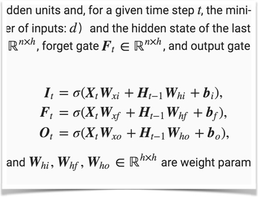
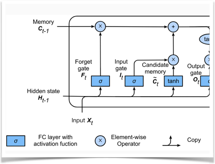
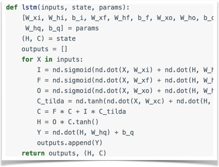
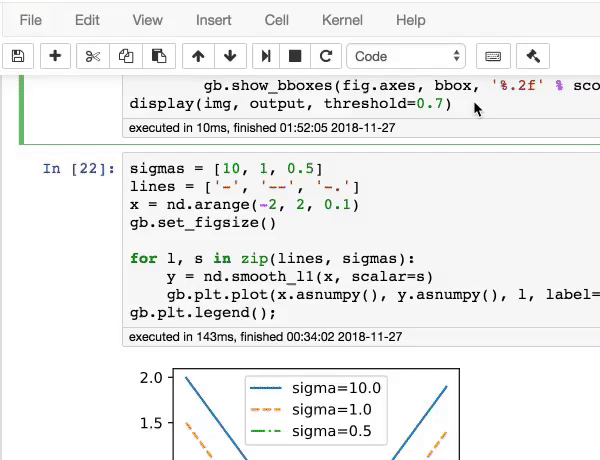

<div align="left">
  
</div>

# D2L.ai: 複数フレームワークのコード、数式、議論を備えた対話型ディープラーニングの本

[](https://github.com/d2l-ai/d2l-en/actions/workflows/ci.yml)

[Book website](https://d2l.ai/) | [STAT 157 Course at UC Berkeley](http://courses.d2l.ai/berkeley-stat-157/index.html)

<h5 align="center"><i>ディープラーニングを理解する最良の方法は、実際に手を動かして学ぶことです。</i></h5>

<p align="center">
  
  
  
  
</p>

このオープンソースの本は、ディープラーニングを親しみやすいものにするための私たちの試みであり、概念、背景、コードを学べるようにしています。本書全体は Jupyter ノートブックで執筆されており、説明、図、数式、対話的な例を、自己完結したコードとシームレスに統合しています。

私たちの目標は、次のようなリソースを提供することです。
1. 誰もが自由に利用できること。
1. 実際に応用機械学習研究者への道を歩み始めるための出発点となるのに十分な技術的深さを備えていること。
1. 実行可能なコードを含み、読者が実際に問題を解く方法を示していること。
1. 私たち自身だけでなく、広くコミュニティによっても迅速に更新できること。
1. 技術的な詳細について対話的に議論し、質問に答えるためのフォーラムで補完されていること。

## D2L を採用している大学
<p align="center">
  
</p>


この本が役に立つと感じたら、このリポジトリにスター（★）を付けるか、以下の bibtex エントリを使って本書を引用してください。

```
@book{zhang2023dive,
    title={Dive into Deep Learning},
    author={Zhang, Aston and Lipton, Zachary C. and Li, Mu and Smola, Alexander J.},
    publisher={Cambridge University Press},
    note={\url{https://D2L.ai}},
    year={2023}
}
```


## 推薦の言葉

> <p>"AI 革命は、10年足らずのうちに研究室から幅広い産業へ、そして私たちの日常生活の隅々へと広がりました。Dive into Deep Learning はディープラーニングに関する उत्कृष्टなテキストであり、ディープラーニングがなぜ AI 革命に火をつけたのかを学びたいすべての人に注目されるべき本です。それは、現代における最も強力な技術的原動力です。"</p>
> <b>&mdash; Jensen Huang, Founder and CEO, NVIDIA</b>

> <p>"これは時宜を得た魅力的な本であり、ディープラーニングの原理についての包括的な概観を提供するだけでなく、実践的なプログラミングコードを伴う詳細なアルゴリズム、さらにコンピュータビジョンと自然言語処理における最先端のディープラーニング入門も提供しています。ディープラーニングに飛び込みたいなら、この本に飛び込んでください！"</p>
> <b>&mdash; Jiawei Han, Michael Aiken Chair Professor, University of Illinois at Urbana-Champaign</b>

> <p>"Jupyter ノートブックの統合によって実現された実践的な経験に焦点を当てた、機械学習文献への非常に歓迎すべき追加です。ディープラーニングを学ぶ学生にとって、この分野で熟達するために非常に価値のある一冊となるでしょう。"</p>
> <b>&mdash; Bernhard Schölkopf, Director, Max Planck Institute for Intelligent Systems</b>

> <p>"Dive into Deep Learning は、実践的な学習と深い説明の間で उत्कृष्टなバランスを保っています。私は自分のディープラーニングの授業でこれを使っており、ディープラーニングを徹底的かつ実践的に理解したい人に推薦します。"</p>
> <b>&mdash; Colin Raffel, Assistant Professor, University of North Carolina, Chapel Hill</b>

## 貢献する ([学び方](https://d2l.ai/chapter_appendix-tools-for-deep-learning/contributing.html))

このオープンソースの本は、教育的な提案、誤字の修正、その他の改善をコミュニティの貢献者から受けてきました。皆さんの助けは、本書をすべての人にとってより良いものにするうえで貴重です。

**親愛なる [D2L contributors](https://github.com/d2l-ai/d2l-en/graphs/contributors) の皆さん、あなたの GitHub ID と名前を d2lbook.en AT gmail DOT com までメールでお送りください。そうすれば、あなたの名前が [acknowledgments](https://d2l.ai/chapter_preface/index.html#acknowledgments) に掲載されます。ありがとうございます。**

## ライセンスの概要

このオープンソースの本は、Creative Commons Attribution-ShareAlike 4.0 International License の下で公開されています。[LICENSE](LICENSE) ファイルを参照してください。

このオープンソースの本に含まれるサンプルコードおよび参照コードは、修正版 MIT ライセンスの下で公開されています。[LICENSE-SAMPLECODE](LICENSE-SAMPLECODE) ファイルを参照してください。

[Chinese version](https://github.com/d2l-ai/d2l-zh) | [Discuss and report issues](https://discuss.d2l.ai/) | [Code of conduct](CODE_OF_CONDUCT.md)\n