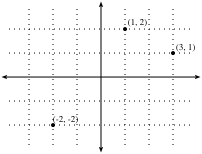
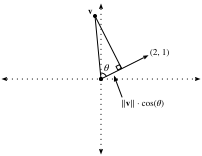
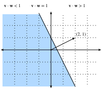
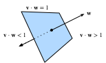
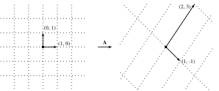

# 幾何と線形代数的操作
:label:`sec_geometry-linear-algebraic-ops`

:numref:`sec_linear-algebra` では、線形代数の基礎に触れ、
それを用いてデータを変換する一般的な操作を表現できることを見た。
線形代数は、深層学習や、より広く機械学習で行う多くの仕事を支える
重要な数学的柱の一つである。
:numref:`sec_linear-algebra` には現代の深層学習モデルの仕組みを伝えるのに十分な道具立てがありましたが、
この分野にはまだまだ多くの内容がある。
この節では、さらに深く掘り下げ、
線形代数の操作に関するいくつかの幾何学的解釈を示し、
固有値と固有ベクトルを含むいくつかの基本概念を導入する。

## ベクトルの幾何
まず、ベクトルの2つの一般的な幾何学的解釈、
すなわち空間内の点または方向としての解釈について議論する必要がある。
本質的には、ベクトルとは下の Python のリストのような数の並びである。

```{.python .input}
#@tab all
v = [1, 7, 0, 1]
```

数学者はこれをたいてい *列* ベクトルまたは *行* ベクトルとして書く。つまり、次のように表する。

$$
\mathbf{x} = \begin{bmatrix}1\\7\\0\\1\end{bmatrix},
$$

あるいは

$$
\mathbf{x}^\top = \begin{bmatrix}1 & 7 & 0 & 1\end{bmatrix}.
$$

これらはしばしば異なる解釈を持ち、
データ例は列ベクトル、
重み付き和を作るために使う重みは行ベクトルとして扱われる。
しかし、柔軟であることは有益である。
:numref:`sec_linear-algebra` で述べたように、
単一のベクトルの既定の向きは列ベクトルであるが、
表形式データセットを表す任意の行列については、
各データ例を行ベクトルとして行列内で扱う方が
より一般的である。

ベクトルが与えられたとき、まず与えるべき解釈は
空間内の点としての解釈である。
2次元または3次元では、固定された基準である *原点* に対して、
ベクトルの成分を用いて空間内の点の位置を定めることで、
これらの点を可視化できる。これは :numref:`fig_grid` に示されている。


:label:`fig_grid`

この幾何学的な見方により、問題をより抽象的なレベルで考えられるようになる。
猫か犬かを分類するような、いかにも手に負えなさそうな問題に直面する代わりに、
課題を空間内の点の集合として抽象的に捉え、
2つの異なる点のクラスターをどう分離するかを見つけることとして
考え始めることができる。

並行して、ベクトルに対して人々がしばしば取る第2の見方がある。
それは空間内の方向としての見方である。
ベクトル $\mathbf{v} = [3,2]^\top$ を、
原点から右に3、上に2の位置として考えるだけでなく、
右に3歩、上に2歩進むための方向そのものとしても考えられる。
このようにして、図 :numref:`fig_arrow` にあるすべてのベクトルを同じものとして扱う。


:label:`fig_arrow`

この見方の利点の一つは、
ベクトル加算の操作を視覚的に理解できることである。
特に、まず一方のベクトルが示す方向に進み、
その後で他方のベクトルが示す方向に進む、ということを行いる。
これは :numref:`fig_add-vec` に示されている。


:label:`fig_add-vec`

ベクトル減算にも同様の解釈がある。
$\mathbf{u} = \mathbf{v} + (\mathbf{u}-\mathbf{v})$ という恒等式を考えると、
ベクトル $\mathbf{u}-\mathbf{v}$ は点 $\mathbf{v}$ から点 $\mathbf{u}$ へ移動する方向であることがわかる。


## 内積と角度
:numref:`sec_linear-algebra` で見たように、
2つの列ベクトル $\mathbf{u}$ と $\mathbf{v}$ を取ると、
次のように計算してその内積を作れる。

$$\mathbf{u}^\top\mathbf{v} = \sum_i u_i\cdot v_i.$$
:eqlabel:`eq_dot_def`

:eqref:`eq_dot_def` は対称的なので、古典的な掛け算の記法にならって

$$
\mathbf{u}\cdot\mathbf{v} = \mathbf{u}^\top\mathbf{v} = \mathbf{v}^\top\mathbf{u},
$$

と書き、ベクトルの順序を入れ替えても同じ答えになることを強調する。

内積 :eqref:`eq_dot_def` には幾何学的な解釈もある。それは2つのベクトルのなす角と密接に関係している。 :numref:`fig_angle` に示す角を考えましょう。


:label:`fig_angle`

まず、2つの特定のベクトルを考える。

$$
\mathbf{v} = (r,0) \; \textrm{and} \; \mathbf{w} = (s\cos(\theta), s \sin(\theta)).
$$

ベクトル $\mathbf{v}$ は長さ $r$ で $x$ 軸に平行に伸びており、
ベクトル $\mathbf{w}$ は長さ $s$ で $x$ 軸となす角が $\theta$ である。
この2つのベクトルの内積を計算すると、

$$
\mathbf{v}\cdot\mathbf{w} = rs\cos(\theta) = \|\mathbf{v}\|\|\mathbf{w}\|\cos(\theta).
$$

簡単な代数操作により、項を整理して

$$
\theta = \arccos\left(\frac{\mathbf{v}\cdot\mathbf{w}}{\|\mathbf{v}\|\|\mathbf{w}\|}\right).
$$

を得られる。

要するに、この2つの特定のベクトルについては、
内積とノルムを組み合わせることで2つのベクトルのなす角がわかる。
この事実は一般の場合にも成り立ちる。ここでは導出はしませんが、
$\|\mathbf{v} - \mathbf{w}\|^2$ を2通りに書くことを考えると、
一方は内積を用い、もう一方は余弦定理を用いることで、
完全な関係を得られる。
実際、任意の2つのベクトル $\mathbf{v}$ と $\mathbf{w}$ について、
そのなす角は

$$\theta = \arccos\left(\frac{\mathbf{v}\cdot\mathbf{w}}{\|\mathbf{v}\|\|\mathbf{w}\|}\right).$$
:eqlabel:`eq_angle_forumla`

である。

この結果は、計算のどこにも2次元という情報が現れないので、うれしい性質である。
実際、3次元でも300万次元でも問題なく使える。

簡単な例として、ベクトルの組のなす角をどう計算するか見てみよう。

```{.python .input}
#@tab mxnet
%matplotlib inline
from d2l import mxnet as d2l
from IPython import display
from mxnet import gluon, np, npx
npx.set_np()

def angle(v, w):
    return np.arccos(v.dot(w) / (np.linalg.norm(v) * np.linalg.norm(w)))

angle(np.array([0, 1, 2]), np.array([2, 3, 4]))
```

```{.python .input}
#@tab pytorch
%matplotlib inline
from d2l import torch as d2l
from IPython import display
import torch
from torchvision import transforms
import torchvision

def angle(v, w):
    return torch.acos(v.dot(w) / (torch.norm(v) * torch.norm(w)))

angle(torch.tensor([0, 1, 2], dtype=torch.float32), torch.tensor([2.0, 3, 4]))
```

```{.python .input}
#@tab tensorflow
%matplotlib inline
from d2l import tensorflow as d2l
from IPython import display
import tensorflow as tf

def angle(v, w):
    return tf.acos(tf.tensordot(v, w, axes=1) / (tf.norm(v) * tf.norm(w)))

angle(tf.constant([0, 1, 2], dtype=tf.float32), tf.constant([2.0, 3, 4]))
```

今は使いませんが、角度が $\pi/2$
（同値に $90^{\circ}$）であるベクトルを *直交* していると言うことを知っておくと便利である。
上の式を見ると、これは $\theta = \pi/2$ のときに起こり、
これは $\cos(\theta) = 0$ と同じことである。
これが起こる唯一の方法は内積そのものが0である場合であり、
2つのベクトルは $\mathbf{v}\cdot\mathbf{w} = 0$ のとき、かつそのときに限り直交する。
これは、対象を幾何学的に理解するときに役立つ式である。

なぜ角度を計算することが有用なのか、という疑問はもっともである。
答えは、データに期待する不変性の種類にある。
画像と、その複製で各ピクセル値が同じだが明るさが $10\%$ のものを考えましょう。
個々のピクセルの値は、一般に元の値からかなり離れている。
したがって、元の画像と暗い画像の距離を計算すると、その距離は大きくなりえる。
しかし、多くの機械学習アプリケーションでは、*内容* は同じである。---猫/犬分類器にとっては、依然として猫の画像である。
一方、角度を考えると、任意のベクトル $\mathbf{v}$ について、
$\mathbf{v}$ と $0.1\cdot\mathbf{v}$ のなす角は0であることはすぐにわかる。
これは、ベクトルをスケーリングしても向きは同じで、長さだけが変わることに対応している。
角度は、暗い画像を同一とみなする。

このような例は至るところにある。
テキストでは、同じことを言っている文書を2倍の長さで書いたとしても、
議論している話題が変わらないことを望むかもしれない。
ある種の符号化（たとえば、ある語彙における単語の出現回数を数えるもの）では、これは文書を表すベクトルの2倍化に対応するので、
やはり角度を使える。

### コサイン類似度
2つのベクトルの近さを測るために角度を用いる機械学習の文脈では、
実務家は *コサイン類似度* という用語を使って、
次の量を指する。
$$
\cos(\theta) = \frac{\mathbf{v}\cdot\mathbf{w}}{\|\mathbf{v}\|\|\mathbf{w}\|}.
$$

コサインは、2つのベクトルが同じ方向を向くときに最大値 $1$、
反対方向を向くときに最小値 $-1$、
2つのベクトルが直交するときに値 $0$ を取りる。
高次元ベクトルの成分が平均 $0$ でランダムにサンプルされる場合、
そのコサインはほとんど常に0に近くなることに注意する。


## 超平面

ベクトルを扱うことに加えて、線形代数を深く理解するために
もう一つ重要な対象がある。それは *超平面* であり、
これは線（2次元）や平面（3次元）の高次元への一般化である。
$d$ 次元ベクトル空間では、超平面は $d-1$ 次元を持ち、
空間を2つの半空間に分割する。

例から始めましょう。
列ベクトル $\mathbf{w}=[2,1]^\top$ があるとする。
「$\mathbf{w}\cdot\mathbf{v} = 1$ を満たす点 $\mathbf{v}$ はどれか？」を知りたいとする。
上で述べた内積と角度の関係 :eqref:`eq_angle_forumla` を思い出すと、
これは次と同値である。
$$
\|\mathbf{v}\|\|\mathbf{w}\|\cos(\theta) = 1 \; \iff \; \|\mathbf{v}\|\cos(\theta) = \frac{1}{\|\mathbf{w}\|} = \frac{1}{\sqrt{5}}.
$$


:label:`fig_vector-project`

この式の幾何学的意味を考えると、
これは $\mathbf{v}$ を $\mathbf{w}$ の方向へ射影した長さがちょうど $1/\|\mathbf{w}\|$ である、
と言っているのと同じだとわかる。これは :numref:`fig_vector-project` に示されている。
これが成り立つ点の集合は、
ベクトル $\mathbf{w}$ に直角な直線である。
必要なら、この直線の方程式を求めて、
$2x + y = 1$、あるいは同値に $y = 1 - 2x$ であることを確認できる。

次に、$\mathbf{w}\cdot\mathbf{v} > 1$ や $\mathbf{w}\cdot\mathbf{v} < 1$ を満たす点の集合を考えると、
それぞれ射影が $1/\|\mathbf{w}\|$ より長い、または短い場合であることがわかる。
したがって、これら2つの不等式は直線の両側を定める。
このようにして、空間を2つに切り分ける方法が得られる。
一方の側のすべての点は内積がしきい値未満で、もう一方の側はしきい値超過である。
これは :numref:`fig_space-division` に示されている。


:label:`fig_space-division`

高次元でも話はほぼ同じである。
今度は $\mathbf{w} = [1,2,3]^\top$ を取り、
3次元で $\mathbf{w}\cdot\mathbf{v} = 1$ を満たす点を考えると、
与えられたベクトル $\mathbf{w}$ に直角な平面が得られる。
2つの不等式は、再び平面の両側を定める。これは :numref:`fig_higher-division` に示されている。


:label:`fig_higher-division`

ここで可視化できる能力は尽きますが、
10次元でも、100次元でも、10億次元でもこれを行うことを妨げるものはない。
これは機械学習モデルを考えるときによく起こりる。
たとえば、 :numref:`sec_softmax` のような線形分類モデルは、
異なる目標クラスを分離する超平面を見つける方法として理解できる。
この文脈では、そのような超平面はしばしば *決定平面* と呼ばれる。
深層学習による分類モデルの大半は、最後に softmax に入力される線形層で終わるので、
深層ニューラルネットワークの役割は、
目標クラスが超平面によってきれいに分離できるような非線形埋め込みを見つけることだと解釈できる。

手作りの例として、Fashion-MNIST データセット
（:numref:`sec_fashion_mnist` で見たもの）に含まれるTシャツとズボンの小さな画像を分類するために、
それらの平均の差ベクトルを使って決定平面を定め、
大まかなしきい値を目分量で決めるだけでも、かなり妥当なモデルを作れることに注意する。まずデータを読み込み、平均を計算する。

```{.python .input}
#@tab mxnet
# Load in the dataset
train = gluon.data.vision.FashionMNIST(train=True)
test = gluon.data.vision.FashionMNIST(train=False)

X_train_0 = np.stack([x[0] for x in train if x[1] == 0]).astype(float)
X_train_1 = np.stack([x[0] for x in train if x[1] == 1]).astype(float)
X_test = np.stack(
    [x[0] for x in test if x[1] == 0 or x[1] == 1]).astype(float)
y_test = np.stack(
    [x[1] for x in test if x[1] == 0 or x[1] == 1]).astype(float)

# Compute averages
ave_0 = np.mean(X_train_0, axis=0)
ave_1 = np.mean(X_train_1, axis=0)
```

```{.python .input}
#@tab pytorch
# Load in the dataset
trans = []
trans.append(transforms.ToTensor())
trans = transforms.Compose(trans)
train = torchvision.datasets.FashionMNIST(root="../data", transform=trans,
                                          train=True, download=True)
test = torchvision.datasets.FashionMNIST(root="../data", transform=trans,
                                         train=False, download=True)

X_train_0 = torch.stack(
    [x[0] * 256 for x in train if x[1] == 0]).type(torch.float32)
X_train_1 = torch.stack(
    [x[0] * 256 for x in train if x[1] == 1]).type(torch.float32)
X_test = torch.stack(
    [x[0] * 256 for x in test if x[1] == 0 or x[1] == 1]).type(torch.float32)
y_test = torch.stack([torch.tensor(x[1]) for x in test
                      if x[1] == 0 or x[1] == 1]).type(torch.float32)

# Compute averages
ave_0 = torch.mean(X_train_0, axis=0)
ave_1 = torch.mean(X_train_1, axis=0)
```

```{.python .input}
#@tab tensorflow
# Load in the dataset
((train_images, train_labels), (
    test_images, test_labels)) = tf.keras.datasets.fashion_mnist.load_data()


X_train_0 = tf.cast(tf.stack(train_images[[i for i, label in enumerate(
    train_labels) if label == 0]] * 256), dtype=tf.float32)
X_train_1 = tf.cast(tf.stack(train_images[[i for i, label in enumerate(
    train_labels) if label == 1]] * 256), dtype=tf.float32)
X_test = tf.cast(tf.stack(test_images[[i for i, label in enumerate(
    test_labels) if label == 0]] * 256), dtype=tf.float32)
y_test = tf.cast(tf.stack(test_images[[i for i, label in enumerate(
    test_labels) if label == 1]] * 256), dtype=tf.float32)

# Compute averages
ave_0 = tf.reduce_mean(X_train_0, axis=0)
ave_1 = tf.reduce_mean(X_train_1, axis=0)
```

これらの平均を詳しく調べると有益なので、どのように見えるかを描画してみよう。この場合、平均は確かにぼやけたTシャツの画像に見える。

```{.python .input}
#@tab mxnet, pytorch
# Plot average t-shirt
d2l.set_figsize()
d2l.plt.imshow(ave_0.reshape(28, 28).tolist(), cmap='Greys')
d2l.plt.show()
```

```{.python .input}
#@tab tensorflow
# Plot average t-shirt
d2l.set_figsize()
d2l.plt.imshow(tf.reshape(ave_0, (28, 28)), cmap='Greys')
d2l.plt.show()
```

2つ目の場合も、平均はぼやけたズボンの画像に見える。

```{.python .input}
#@tab mxnet, pytorch
# Plot average trousers
d2l.plt.imshow(ave_1.reshape(28, 28).tolist(), cmap='Greys')
d2l.plt.show()
```

```{.python .input}
#@tab tensorflow
# Plot average trousers
d2l.plt.imshow(tf.reshape(ave_1, (28, 28)), cmap='Greys')
d2l.plt.show()
```

完全に機械学習された解法では、しきい値をデータセットから学習する。この場合は、訓練データで良さそうに見えるしきい値を自分で目分量で決めた。

```{.python .input}
#@tab mxnet
# Print test set accuracy with eyeballed threshold
w = (ave_1 - ave_0).T
predictions = X_test.reshape(2000, -1).dot(w.flatten()) > -1500000

# Accuracy
np.mean(predictions.astype(y_test.dtype) == y_test, dtype=np.float64)
```

```{.python .input}
#@tab pytorch
# Print test set accuracy with eyeballed threshold
w = (ave_1 - ave_0).T
# '@' is Matrix Multiplication operator in pytorch.
predictions = X_test.reshape(2000, -1) @ (w.flatten()) > -1500000

# Accuracy
torch.mean((predictions.type(y_test.dtype) == y_test).float(), dtype=torch.float64)
```

```{.python .input}
#@tab tensorflow
# Print test set accuracy with eyeballed threshold
w = tf.transpose(ave_1 - ave_0)
predictions = tf.reduce_sum(X_test * tf.nest.flatten(w), axis=0) > -1500000

# Accuracy
tf.reduce_mean(
    tf.cast(tf.cast(predictions, y_test.dtype) == y_test, tf.float32))
```

## 線形変換の幾何

:numref:`sec_linear-algebra` と上の議論を通じて、
ベクトル、長さ、角度の幾何についてはしっかり理解できた。
しかし、まだ議論していない重要な対象が一つある。
それは、行列で表される線形変換の幾何学的理解である。
2つの、場合によっては異なる高次元空間の間で、
行列がデータをどう変換するのかを完全に身につけるにはかなりの練習が必要であり、
この付録の範囲を超えている。
しかし、2次元から直感を積み上げ始めることはできる。

ある行列があるとする。

$$
\mathbf{A} = \begin{bmatrix}
a & b \\ c & d
\end{bmatrix}.
$$

これを任意のベクトル
$\mathbf{v} = [x, y]^\top$
に適用したいとき、掛け算を行うと

$$
\begin{aligned}
\mathbf{A}\mathbf{v} & = \begin{bmatrix}a & b \\ c & d\end{bmatrix}\begin{bmatrix}x \\ y\end{bmatrix} \\
& = \begin{bmatrix}ax+by\\ cx+dy\end{bmatrix} \\
& = x\begin{bmatrix}a \\ c\end{bmatrix} + y\begin{bmatrix}b \\d\end{bmatrix} \\
& = x\left\{\mathbf{A}\begin{bmatrix}1\\0\end{bmatrix}\right\} + y\left\{\mathbf{A}\begin{bmatrix}0\\1\end{bmatrix}\right\}.
\end{aligned}
$$

これは奇妙な計算に見えるかもしれない。
明快だったものが、やや見通しの悪いものになったように感じられるでしょう。
しかし、これにより、行列が *任意* のベクトルをどう変換するかを、
*2つの特定のベクトル*:
$[1,0]^\top$ と $[0,1]^\top$ に対する変換の仕方で表せることがわかる。
これは少し考える価値がある。
本質的には、無限個の問題
（任意の実数の組に何が起こるか）
を有限個の問題
（これらの特定のベクトルに何が起こるか）
に還元しているのである。
これらのベクトルは *基底* の一例であり、
空間内の任意のベクトルをこれらの *基底ベクトル* の重み付き和として書ける。

特定の行列

$$
\mathbf{A} = \begin{bmatrix}
1 & 2 \\
-1 & 3
\end{bmatrix}.
$$

を使うと何が起こるか描いてみよう。

特定のベクトル $\mathbf{v} = [2, -1]^\top$ を見ると、
これは $2\cdot[1,0]^\top + -1\cdot[0,1]^\top$ なので、
行列 $A$ はこれを
$2(\mathbf{A}[1,0]^\top) + -1(\mathbf{A}[0,1])^\top = 2[1, -1]^\top - [2,3]^\top = [0, -5]^\top$
へ送ることがわかる。
この論理を注意深くたどり、
たとえばすべての整数対の点の格子を考えると、
起こることは、行列積が格子を
せん断し、回転し、拡大縮小する一方で、
格子構造自体は :numref:`fig_grid-transform` に示すように保たれる、ということである。


:label:`fig_grid-transform`

これが、行列で表される線形変換について
身につけるべき最も重要な直感である。
行列は、空間のある部分だけを他の部分と異なるように歪めることはできない。
できるのは、空間上の元の座標を
せん断し、回転し、拡大縮小することだけである。

歪みが非常に大きくなることもある。たとえば、行列

$$
\mathbf{B} = \begin{bmatrix}
2 & -1 \\ 4 & -2
\end{bmatrix},
$$

は2次元平面全体を1本の直線へと圧縮する。
このような変換を識別し扱うことは後の節の話題であるが、
幾何学的には、これは上で見た変換の種類とは本質的に異なることがわかる。
たとえば、行列 $\mathbf{A}$ の結果は元の格子へ「戻す」ことができる。
しかし、行列 $\mathbf{B}$ の結果は戻せない。
なぜなら、ベクトル $[1,2]^\top$ がどこから来たのかはわからないからです---それは
$[1,1]^\top$ だったのでしょうか、それとも $[0, -1]^\top$ だったのでしょうか？

この図は $2\times2$ 行列についてのものでしたが、
ここで学んだことを高次元に持ち込むことを妨げるものはない。
$[1,0, \ldots,0]$ のような同様の基底ベクトルを取り、
行列がそれらをどこへ送るかを見れば、
扱っている次元が何であれ、行列積が空間全体をどう歪めるかについて
感覚をつかみ始めることができる。

## 線形従属

再び行列

$$
\mathbf{B} = \begin{bmatrix}
2 & -1 \\ 4 & -2
\end{bmatrix}.
$$

を考える。

これは平面全体を直線 $y = 2x$ 上に押しつぶする。
ここで疑問が生じる。行列そのものを見るだけで、
これを検出する方法はあるのでしょうか？
答えは、実際にある、である。
$\mathbf{B}$ の2つの列を $\mathbf{b}_1 = [2,4]^\top$ と $\mathbf{b}_2 = [-1, -2]^\top$ とする。
行列 $\mathbf{B}$ によって変換されるものはすべて、
行列の列の重み付き和
たとえば $a_1\mathbf{b}_1 + a_2\mathbf{b}_2$
として書けることを思い出する。
これを *線形結合* と呼ぶ。
$\mathbf{b}_1 = -2\cdot\mathbf{b}_2$ であるという事実は、
たとえば $\mathbf{b}_2$ だけを使ってこれら2つの列の任意の線形結合を書けることを意味する。なぜなら

$$
a_1\mathbf{b}_1 + a_2\mathbf{b}_2 = -2a_1\mathbf{b}_2 + a_2\mathbf{b}_2 = (a_2-2a_1)\mathbf{b}_2.
$$

だからである。

これは、ある意味で一方の列が冗長であることを意味する。
空間内で一意な方向を定めていないからである。
これはそれほど驚くことではない。
すでにこの行列が平面全体を1本の直線へ押しつぶすことを見たからである。
さらに、線形従属
$\mathbf{b}_1 = -2\cdot\mathbf{b}_2$
がこれを捉えていることもわかる。
2つのベクトルの対称性を高めるため、これを

$$
\mathbf{b}_1  + 2\cdot\mathbf{b}_2 = 0.
$$

と書く。

一般に、ベクトルの集まり
$\mathbf{v}_1, \ldots, \mathbf{v}_k$ が *線形従属* であるとは、
係数 $a_1, \ldots, a_k$ が *すべて0ではない* ものが存在して

$$
\sum_{i=1}^k a_i\mathbf{v_i} = 0.
$$

となることをいいる。

この場合、あるベクトルを他のベクトルの組み合わせで解けるので、
実質的に冗長になる。
したがって、行列の列に線形従属があることは、
その行列が空間をより低い次元へ圧縮していることの証拠である。
線形従属がなければ、ベクトルは *線形独立* であるといいる。
行列の列が線形独立なら、圧縮は起こらず、その操作は元に戻せる。

## 階数

一般の $n\times m$ 行列があるとき、
その行列がどの次元の空間へ写すのかを問うのは自然である。
*階数* として知られる概念がその答えになる。
前節では、線形従属が空間の低次元への圧縮の証拠であることを述べたので、
これを階数の概念の定義に使える。
特に、行列 $\mathbf{A}$ の階数とは、
列の部分集合の中で線形独立な列の最大数である。たとえば、行列

$$
\mathbf{B} = \begin{bmatrix}
2 & 4 \\ -1 & -2
\end{bmatrix},
$$

は2つの列が線形従属なので $\textrm{rank}(B)=1$ である。
しかし、どちらか一方の列だけなら線形従属ではない。
より難しい例として、

$$
\mathbf{C} = \begin{bmatrix}
1& 3 & 0 & -1 & 0 \\
-1 & 0 & 1 & 1 & -1 \\
0 & 3 & 1 & 0 & -1 \\
2 & 3 & -1 & -2 & 1
\end{bmatrix},
$$

を考えると、たとえば最初の2列は線形独立であるが、
3列の4通りの組はどれも従属であることから、$\mathbf{C}$ の階数は2であると示せる。

この手順は、述べたとおり非常に非効率である。
与えられた行列の列のすべての部分集合を調べる必要があり、
したがって列数に対して指数時間になる可能性がある。
後で、行列の階数を計算するより計算効率のよい方法を見ますが、
今のところは、この概念がよく定義されており、その意味を理解するにはこれで十分である。

## 可逆性

上で、線形従属な列を持つ行列との掛け算は元に戻せない、
すなわち入力を常に復元できる逆操作は存在しないことを見た。
しかし、フルランク行列
（すなわち、階数が $n$ の $n \times n$ 行列 $\mathbf{A}$）
との掛け算は、常に元に戻せるはずである。
行列

$$
\mathbf{I} = \begin{bmatrix}
1 & 0 & \cdots & 0 \\
0 & 1 & \cdots & 0 \\
\vdots & \vdots & \ddots & \vdots \\
0 & 0 & \cdots & 1
\end{bmatrix}.
$$

を考える。

これは対角成分が1で、それ以外が0の行列である。
これを *単位* 行列と呼ぶ。
適用してもデータを変えない行列である。
行列 $\mathbf{A}$ が行ったことを打ち消す行列を見つけるには、
次を満たす行列 $\mathbf{A}^{-1}$ を見つけたいのである。

$$
\mathbf{A}^{-1}\mathbf{A} = \mathbf{A}\mathbf{A}^{-1} =  \mathbf{I}.
$$

これを連立方程式として見ると、未知数は $n \times n$
（$\mathbf{A}^{-1}$ の各要素）で、方程式も $n \times n$
（$\mathbf{A}^{-1}\mathbf{A}$ の各要素と $\mathbf{I}$ の各要素の間で成り立つべき等式）
あるので、一般には解が存在すると期待できる。
実際、次の節では *行列式* と呼ばれる量を見ますが、
その値が0でなければ解を見つけられるという性質がある。
このような行列 $\mathbf{A}^{-1}$ を *逆行列* と呼ぶ。
例として、$\mathbf{A}$ が一般の $2 \times 2$ 行列

$$
\mathbf{A} = \begin{bmatrix}
a & b \\
c & d
\end{bmatrix},
$$

なら、その逆行列は

$$
 \frac{1}{ad-bc}  \begin{bmatrix}
d & -b \\
-c & a
\end{bmatrix}.
$$

であることがわかる。

これが本当にそうかは、上の式で与えられる逆行列を掛けると実際にうまくいくことを確認すればよいである。

```{.python .input}
#@tab mxnet
M = np.array([[1, 2], [1, 4]])
M_inv = np.array([[2, -1], [-0.5, 0.5]])
M_inv.dot(M)
```

```{.python .input}
#@tab pytorch
M = torch.tensor([[1, 2], [1, 4]], dtype=torch.float32)
M_inv = torch.tensor([[2, -1], [-0.5, 0.5]])
M_inv @ M
```

```{.python .input}
#@tab tensorflow
M = tf.constant([[1, 2], [1, 4]], dtype=tf.float32)
M_inv = tf.constant([[2, -1], [-0.5, 0.5]])
tf.matmul(M_inv, M)
```

### 数値的な問題
行列の逆行列は理論上は有用であるが、
実際には問題を解くのに行列の逆行列を *使う* ことは、たいてい望ましくないと言わなければならない。
一般に、次のような線形方程式を解くには、

$$
\mathbf{A}\mathbf{x} = \mathbf{b},
$$

逆行列を計算して掛ける

$$
\mathbf{x} = \mathbf{A}^{-1}\mathbf{b}.
$$

よりも、はるかに数値的に安定なアルゴリズムがある。

小さな数で割ると数値的不安定性が生じうるのと同様に、
低階数に近い行列の逆行列を求めることも不安定になりえる。

さらに、行列 $\mathbf{A}$ が *疎*、
つまり非ゼロ値を少数しか含まないことはよくある。
例を調べれば、逆行列が疎であるとは限らないことがわかるでしょう。
たとえ $\mathbf{A}$ が $100$ 万×$100$ 万の行列で、
非ゼロ要素が $500$ 万個しかない
（したがって保存する必要があるのはその $500$ 万個だけ）
としても、逆行列は通常ほとんどすべての要素が非ゼロになり、
$1\textrm{M}^2$ 個、つまり $1$ 兆個の要素すべてを保存する必要が出てきます！

線形代数を扱うときにしばしば遭遇する厄介な数値問題を
ここで完全に掘り下げる時間はありませんが、
どのような場合に注意して進むべきかについての直感を与えたいと思いる。
一般には、実務で逆行列を避けるのがよい経験則である。

## 行列式
線形代数の幾何学的な見方は、*行列式* として知られる基本量を
直感的に解釈する方法を与えてくれる。
先ほどの格子の図を、今度は強調された領域つきで考えます（:numref:`fig_grid-filled`）。


:label:`fig_grid-filled`

強調された正方形を見てください。
これは辺が $(0, 1)$ と $(1, 0)$ で与えられる正方形であり、面積は1である。
$\mathbf{A}$ がこの正方形を変換した後、
それは平行四辺形になる。
この平行四辺形が元の面積と同じである理由はなく、
実際、ここで示した特定の場合

$$
\mathbf{A} = \begin{bmatrix}
1 & 2 \\
-1 & 3
\end{bmatrix},
$$

では、この平行四辺形の面積を求めると5になることは、座標幾何の練習問題である。

一般に、行列

$$
\mathbf{A} = \begin{bmatrix}
a & b \\
c & d
\end{bmatrix},
$$

があるとき、結果として得られる平行四辺形の面積は $ad-bc$ であることが計算によりわかる。
この面積を *行列式* と呼ぶ。

簡単な例で確認してみよう。

```{.python .input}
#@tab mxnet
import numpy as np
np.linalg.det(np.array([[1, -1], [2, 3]]))
```

```{.python .input}
#@tab pytorch
torch.det(torch.tensor([[1, -1], [2, 3]], dtype=torch.float32))
```

```{.python .input}
#@tab tensorflow
tf.linalg.det(tf.constant([[1, -1], [2, 3]], dtype=tf.float32))
```

鋭い読者は、この式が0にも、負にもなりうることに気づくでしょう。
負の項については、これは一般に数学で採用される慣習の問題である。
行列が図形を反転させるなら、面積は符号反転すると考える。
では、行列式が0のときに何がわかるか見てみよう。

次を考える。

$$
\mathbf{B} = \begin{bmatrix}
2 & 4 \\ -1 & -2
\end{bmatrix}.
$$

この行列の行列式を計算すると、
$2\cdot(-2 ) - 4\cdot(-1) = 0$ である。
上での理解に照らすと、これは納得できる。
$\mathbf{B}$ は元の図の正方形を
面積0の線分へと圧縮する。
そして実際、変換後に面積が0になるのは、
低次元空間へ圧縮される場合に限られる。
したがって、次の結果が成り立ちる。
行列 $A$ が可逆であるのは、行列式が0でないとき、かつそのときに限りる。

最後に、平面上に何らかの図形が描かれていると想像する。
コンピュータ科学者のように考えると、
その図形を小さな正方形の集合に分解できるので、
図形の面積は本質的には分解に含まれる正方形の数にすぎない。
この図形を行列で変換すると、
各正方形は平行四辺形へ送られ、それぞれの面積は行列式で与えられる。
したがって、任意の図形について、行列式は
行列がその図形の面積をどれだけ拡大縮小するかを表す（符号付きの）数を与えることがわかる。

より大きな行列の行列式を計算するのは骨が折れますが、
直感は同じである。
行列式は、$n\times n$ 行列が $n$ 次元体積をどれだけ拡大縮小するかを与える係数であり続ける。

## テンソルと一般的な線形代数操作

:numref:`sec_linear-algebra` ではテンソルの概念を導入した。
この節では、テンソル縮約
（行列積に相当するテンソル版）をさらに深く掘り下げ、
それが多くの行列・ベクトル操作を統一的に捉える視点を与えることを見る。

行列やベクトルでは、それらを掛けてデータを変換する方法を知っていた。
テンソルが私たちにとって有用であるためには、同様の定義が必要である。
行列積を考えてみよう。

$$
\mathbf{C} = \mathbf{A}\mathbf{B},
$$

あるいは同値に

$$ c_{i, j} = \sum_{k} a_{i, k}b_{k, j}.$$

このパターンはテンソルにも繰り返し使える。
テンソルでは、何について和を取るかを一意に普遍的に選べるわけではないので、
どの添字について和を取るのかを正確に指定する必要がある。
たとえば、

$$
y_{il} = \sum_{jk} x_{ijkl}a_{jk}.
$$

のように考えられる。

このような変換を *テンソル縮約* と呼ぶ。
これは、行列積だけよりもはるかに柔軟な変換の族を表せる。

よく使われる記法上の簡略化として、
和を取る添字は式中に2回以上現れる添字ちょうどであることに注目できる。
そのため、人々はしばしば *アインシュタイン記法* を用い、
繰り返し現れる添字に対して和が暗黙に取られるようにする。
これにより、次の簡潔な表現が得られる。

$$
y_{il} = x_{ijkl}a_{jk}.
$$

### 線形代数の一般的な例

これまで見てきた線形代数の定義の多くが、
この圧縮されたテンソル記法でどう表せるか見てみよう。

* $\mathbf{v} \cdot \mathbf{w} = \sum_i v_iw_i$
* $\|\mathbf{v}\|_2^{2} = \sum_i v_iv_i$
* $(\mathbf{A}\mathbf{v})_i = \sum_j a_{ij}v_j$
* $(\mathbf{A}\mathbf{B})_{ik} = \sum_j a_{ij}b_{jk}$
* $\textrm{tr}(\mathbf{A}) = \sum_i a_{ii}$

このようにして、無数の特殊な記法を短いテンソル表現に置き換えられる。

### コードで表す
テンソルはコード中でも柔軟に操作できる。
:numref:`sec_linear-algebra` で見たように、
以下のようにテンソルを作成できる。

```{.python .input}
#@tab mxnet
# Define tensors
B = np.array([[[1, 2, 3], [4, 5, 6]], [[7, 8, 9], [10, 11, 12]]])
A = np.array([[1, 2], [3, 4]])
v = np.array([1, 2])

# Print out the shapes
A.shape, B.shape, v.shape
```

```{.python .input}
#@tab pytorch
# Define tensors
B = torch.tensor([[[1, 2, 3], [4, 5, 6]], [[7, 8, 9], [10, 11, 12]]])
A = torch.tensor([[1, 2], [3, 4]])
v = torch.tensor([1, 2])

# Print out the shapes
A.shape, B.shape, v.shape
```

```{.python .input}
#@tab tensorflow
# Define tensors
B = tf.constant([[[1, 2, 3], [4, 5, 6]], [[7, 8, 9], [10, 11, 12]]])
A = tf.constant([[1, 2], [3, 4]])
v = tf.constant([1, 2])

# Print out the shapes
A.shape, B.shape, v.shape
```

アインシュタインの総和は直接実装されている。
アインシュタイン総和に現れる添字は文字列として渡し、
その後に作用させるテンソルを続ける。
たとえば、行列積を実装するには、
上で見たアインシュタイン総和
（$\mathbf{A}\mathbf{v} = a_{ij}v_j$）
を考え、添字そのものを取り除くと次の実装になる。

```{.python .input}
#@tab mxnet
# Reimplement matrix multiplication
np.einsum("ij, j -> i", A, v), A.dot(v)
```

```{.python .input}
#@tab pytorch
# Reimplement matrix multiplication
torch.einsum("ij, j -> i", A, v), A@v
```

```{.python .input}
#@tab tensorflow
# Reimplement matrix multiplication
tf.einsum("ij, j -> i", A, v), tf.matmul(A, tf.reshape(v, (2, 1)))
```

これは非常に柔軟な記法である。
たとえば、伝統的には次のように書くものを計算したいとする。

$$
c_{kl} = \sum_{ij} \mathbf{b}_{ijk}\mathbf{a}_{il}v_j.
$$

これはアインシュタイン総和を使って次のように実装できる。

```{.python .input}
#@tab mxnet
np.einsum("ijk, il, j -> kl", B, A, v)
```

```{.python .input}
#@tab pytorch
torch.einsum("ijk, il, j -> kl", B, A, v)
```

```{.python .input}
#@tab tensorflow
tf.einsum("ijk, il, j -> kl", B, A, v)
```

この記法は人間にとって読みやすく効率的であるが、
何らかの理由でテンソル縮約をプログラム的に生成する必要がある場合には、
ややかさばりる。
このため、`einsum` には各テンソルに整数の添字を与える別の記法もある。
たとえば、同じテンソル縮約は次のようにも書ける。

```{.python .input}
#@tab mxnet
np.einsum(B, [0, 1, 2], A, [0, 3], v, [1], [2, 3])
```

```{.python .input}
#@tab pytorch
# PyTorch does not support this type of notation.
```

```{.python .input}
#@tab tensorflow
# TensorFlow does not support this type of notation.
```

どちらの記法でも、コード中でテンソル縮約を簡潔かつ効率的に表現できる。

## まとめ
* ベクトルは、空間内の点または方向として幾何学的に解釈できる。
* 内積は、任意に高次元の空間における角度の概念を定義する。
* 超平面は、直線や平面の高次元一般化である。分類タスクの最後の段階でよく使われる決定平面を定義するのに使える。
* 行列積は、基礎となる座標を一様に歪めるものとして幾何学的に解釈できる。これはベクトルを変換する非常に制限された、しかし数学的には明快な方法である。
* 線形従属は、ベクトルの集まりが期待より低い次元空間にあることを見分ける方法である（たとえば、2次元空間に3つのベクトルがある場合）。行列の階数は、その列のうち線形独立な最大部分集合の大きさである。
* 行列の逆行列が定義されるとき、行列の反転により最初の行列の作用を打ち消す別の行列を見つけられる。逆行列は理論上有用だが、数値的不安定性のため実務では注意が必要である。
* 行列式により、行列が空間をどれだけ拡大または縮小するかを測れる。行列式が0でないことは可逆（非特異）行列であることを意味し、行列式が0であることは非可逆（特異）行列であることを意味する。
* テンソル縮約とアインシュタイン総和は、機械学習で見られる多くの計算を表すための、簡潔で明快な記法を与える。

## 演習
1. 次のベクトルのなす角は何か。
$$
\vec v_1 = \begin{bmatrix}
1 \\ 0 \\ -1 \\ 2
\end{bmatrix}, \qquad \vec v_2 = \begin{bmatrix}
3 \\ 1 \\ 0 \\ 1
\end{bmatrix}?
$$
2. 真か偽か：$\begin{bmatrix}1 & 2\\0&1\end{bmatrix}$ と $\begin{bmatrix}1 & -2\\0&1\end{bmatrix}$ は互いに逆行列であるか？
3. 平面上に面積 $100\textrm{m}^2$ の図形を描いたとする。次の行列で図形を変換した後の面積はどうなるか。
$$
\begin{bmatrix}
2 & 3\\
1 & 2
\end{bmatrix}.
$$
4. 次のベクトル集合のうち、線形独立なのはどれか。
 * $\left\{\begin{pmatrix}1\\0\\-1\end{pmatrix}, \begin{pmatrix}2\\1\\-1\end{pmatrix}, \begin{pmatrix}3\\1\\1\end{pmatrix}\right\}$
 * $\left\{\begin{pmatrix}3\\1\\1\end{pmatrix}, \begin{pmatrix}1\\1\\1\end{pmatrix}, \begin{pmatrix}0\\0\\0\end{pmatrix}\right\}$
 * $\left\{\begin{pmatrix}1\\1\\0\end{pmatrix}, \begin{pmatrix}0\\1\\-1\end{pmatrix}, \begin{pmatrix}1\\0\\1\end{pmatrix}\right\}$
5. ある値 $a, b, c, d$ の選び方に対して、$A = \begin{bmatrix}c\\d\end{bmatrix}\cdot\begin{bmatrix}a & b\end{bmatrix}$ と書ける行列があるとする。真か偽か：このような行列の行列式は常に $0$ である。
6. ベクトル $e_1 = \begin{bmatrix}1\\0\end{bmatrix}$ と $e_2 = \begin{bmatrix}0\\1\end{bmatrix}$ は直交している。$Ae_1$ と $Ae_2$ が直交するための行列 $A$ の条件は何か？
7. 任意の行列 $A$ について、$\textrm{tr}(\mathbf{A}^4)$ をアインシュタイン記法でどのように書けるか？

:begin_tab:`mxnet`
[Discussions](https://discuss.d2l.ai/t/410)
:end_tab:

:begin_tab:`pytorch`
[Discussions](https://discuss.d2l.ai/t/1084)
:end_tab:

:begin_tab:`tensorflow`
[Discussions](https://discuss.d2l.ai/t/1085)
:end_tab:\n