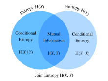

# 情報理論
:label:`sec_information_theory`

宇宙は情報であふれている。情報は、学問分野の壁を越える共通言語を与えてくれる。シェイクスピアのソネットから Cornell ArXiv 上の研究論文まで、ゴッホの《星月夜》の版画からベートーヴェンの交響曲第5番まで、最初のプログラミング言語 Plankalkül から最先端の機械学習アルゴリズムまで、あらゆるものは情報理論の法則に従わなければならない。形式が何であれ同じである。情報理論を用いれば、異なる信号にどれだけの情報が含まれているかを測定し、比較できる。この節では、情報理論の基本概念と、機械学習における情報理論の応用を調べる。

始める前に、機械学習と情報理論の関係を概観しておきましょう。機械学習は、データから興味深い信号を抽出し、重要な予測を行うことを目指する。一方、情報理論は、情報の符号化、復号、伝送、操作を研究する。その結果、情報理論は、機械学習システムにおける情報処理を議論するための基礎的な言語を提供する。たとえば、多くの機械学習アプリケーションでは、 :numref:`sec_softmax` で説明したクロスエントロピー損失を用いる。この損失は、情報理論的な考察から直接導出できる。


## 情報

情報理論の「魂」である情報から始めましょう。*情報* は、1つ以上の符号化形式の特定の並びを持つあらゆるものに符号化できる。ここで、情報という概念を定義しようとしているとしよう。出発点として何が考えられるだろうか。

次の思考実験を考えてみる。友人がトランプのデッキを持っている。友人はデッキをシャッフルし、いくつかのカードをめくって、そのカードについての文を私たちに伝える。私たちは、それぞれの文が持つ情報量を評価しようとする。

まず、友人が1枚のカードをめくって「カードが見える」と言う。これはまったく情報を与えない。私たちはすでにそうであると確信していたので、情報量はゼロであるべきである。

次に、友人が1枚のカードをめくって「ハートが見える」と言う。これはある程度の情報を与えますが、実際には可能なスートは $4$ 種類しかなく、それぞれ同じ確率で起こるので、この結果に驚きはない。どのような情報量の尺度であっても、この事象の情報量は低いはずである。

次に、友人が1枚のカードをめくって「これはスペードの $3$ だ」と言う。これはより多くの情報である。実際、可能な結果は $52$ 通りあり、それらはすべて同確率で、友人はそのうちのどれであるかを教えてくれた。これは中程度の情報量であるべきである。

これを論理的に極限まで進めてみよう。最後に、友人がデッキのすべてのカードをめくり、シャッフルされたデッキの全順序を読み上げるとする。デッキの並び方は $52!$ 通りあり、これもすべて同確率なので、それがどれかを知るには大量の情報が必要である。

私たちが構築する情報の概念は、この直感に一致していなければならない。実際、次の節では、これらの事象の情報量がそれぞれ $0\textrm{ bits}$、$2\textrm{ bits}$、$~5.7\textrm{ bits}$、$~225.6\textrm{ bits}$ であることを計算する。

これらの思考実験を読むと、自然な考えが見えてきる。出発点として、知識そのものよりも、情報とは驚きの度合い、あるいは事象の抽象的な起こりやすさを表すものだと考えられる。たとえば、珍しい事象を記述したいなら、多くの情報が必要である。ありふれた事象なら、それほど多くの情報は必要ない。

1948年、Claude E. Shannon は *A Mathematical Theory of Communication* :cite:`Shannon.1948` を発表し、情報理論を確立した。彼の論文で、Shannon は情報エントロピーの概念を初めて導入した。ここから私たちの旅を始めましょう。


### 自己情報

情報は事象の抽象的な起こりやすさを表すので、その起こりやすさをどのようにビット数へ写像すればよいのだろうか。Shannon は、情報の単位として *bit* という用語を導入した。これはもともと John Tukey によって作られたものである。では、「ビット」とは何で、なぜ情報の測定に使うのだろうか。歴史的には、古い送信機は $0$ と $1$ の2種類の符号しか送受信できませんでした。実際、2進符号化は現在のすべてのデジタル計算機でも広く使われている。このように、あらゆる情報は $0$ と $1$ の列として符号化される。したがって、長さ $n$ の2進数字列は $n$ ビットの情報を含みる。

ここで、任意の符号列について、各 $0$ または $1$ が確率 $\frac{1}{2}$ で現れるとする。すると、長さ $n$ の符号列を持つ事象 $X$ は、確率 $\frac{1}{2^n}$ で起こりる。同時に、先ほど述べたように、この列は $n$ ビットの情報を含みる。では、確率 $p$ をビット数に変換する数学関数へ一般化できるだろうか。Shannon は *自己情報* を定義することで答えを与えた。

$$I(X) = - \log_2 (p),$$

これは事象 $X$ について受け取った情報の *ビット数* である。この節では常に底2の対数を使うことに注意する。簡単のため、この節の残りでは対数表記の添字2を省略し、すなわち $\log(.)$ は常に $\log_2(.)$ を意味する。たとえば、符号 "0010" の自己情報は

$$I(\textrm{"0010"}) = - \log (p(\textrm{"0010"})) = - \log \left( \frac{1}{2^4} \right) = 4 \textrm{ bits}.$$

以下のように自己情報を計算できる。その前に、この節で必要なパッケージをすべてインポートしよう。

```{.python .input}
#@tab mxnet
from mxnet import np
from mxnet.metric import NegativeLogLikelihood
from mxnet.ndarray import nansum
import random

def self_information(p):
    return -np.log2(p)

self_information(1 / 64)
```

```{.python .input}
#@tab pytorch
import torch
from torch.nn import NLLLoss

def nansum(x):
    # Define nansum, as pytorch does not offer it inbuilt.
    return x[~torch.isnan(x)].sum()

def self_information(p):
    return -torch.log2(torch.tensor(p)).item()

self_information(1 / 64)
```

```{.python .input}
#@tab tensorflow
import tensorflow as tf

def log2(x):
    return tf.math.log(x) / tf.math.log(2.)

def nansum(x):
    return tf.reduce_sum(tf.where(tf.math.is_nan(
        x), tf.zeros_like(x), x), axis=-1)

def self_information(p):
    return -log2(tf.constant(p)).numpy()

self_information(1 / 64)
```

## エントロピー

自己情報は単一の離散事象の情報しか測れないので、離散分布でも連続分布でもよい任意の確率変数に対する、より一般化された尺度が必要である。


### エントロピーの動機づけ

何を求めたいのかを具体的にしてみよう。これは、*Shannon エントロピーの公理* として知られるものの非形式的な説明である。以下の常識的な主張の集まりが、情報の一意な定義を強いることがわかる。これらの公理の形式的な版や他の公理については、:citet:`Csiszar.2008` を参照する。

1.  確率変数を観測して得られる情報は、要素の呼び名や、確率0の追加要素の有無に依存しない。
2.  2つの確率変数を観測して得られる情報は、それらを別々に観測して得られる情報の和を超えない。独立であれば、ちょうどその和になる。
3.  （ほぼ）確実な事象を観測して得られる情報は（ほぼ）ゼロである。

この事実の証明は本書の範囲を超えますが、エントロピーがどのような形を取るべきかを一意に決めることは重要である。これらが許す曖昧さは基本単位の選択だけであり、通常は、単一の公平なコイン投げが1ビットの情報を与えるという先ほどの選択で正規化される。

### 定義

確率密度関数（p.d.f.）または確率質量関数（p.m.f.） $p(x)$ を持つ確率分布 $P$ に従う任意の確率変数 $X$ に対して、期待される情報量を *エントロピー*（または *Shannon エントロピー*）で測りる。

$$H(X) = - E_{x \sim P} [\log p(x)].$$
:eqlabel:`eq_ent_def`

具体的には、$X$ が離散的なら、$$H(X) = - \sum_i p_i \log p_i \textrm{, where } p_i = P(X_i).$$

それ以外に、$X$ が連続的なら、エントロピーは *微分エントロピー* とも呼ばれる。

$$H(X) = - \int_x p(x) \log p(x) \; dx.$$

エントロピーは以下のように定義できる。

```{.python .input}
#@tab mxnet
def entropy(p):
    entropy = - p * np.log2(p)
    # Operator `nansum` will sum up the non-nan number
    out = nansum(entropy.as_nd_ndarray())
    return out

entropy(np.array([0.1, 0.5, 0.1, 0.3]))
```

```{.python .input}
#@tab pytorch
def entropy(p):
    entropy = - p * torch.log2(p)
    # Operator `nansum` will sum up the non-nan number
    out = nansum(entropy)
    return out

entropy(torch.tensor([0.1, 0.5, 0.1, 0.3]))
```

```{.python .input}
#@tab tensorflow
def entropy(p):
    return nansum(- p * log2(p))

entropy(tf.constant([0.1, 0.5, 0.1, 0.3]))
```

### 解釈

エントロピーの定義 :eqref:`eq_ent_def` で、なぜ負の対数の期待値を使うのか疑問に思うかもしれない。いくつか直感を示する。

まず、なぜ *対数* 関数 $\log$ を使うのだろうか。$p(x) = f_1(x) f_2(x) \ldots, f_n(x)$ であり、各成分関数 $f_i(x)$ が互いに独立だとする。これは、各 $f_i(x)$ が $p(x)$ から得られる総情報量に独立に寄与することを意味する。先ほど述べたように、エントロピーの式は独立な確率変数に対して加法的であることが望まれる。幸い、$\log$ は確率分布の積を自然に各項の和へ変換できる。

次に、なぜ *負の* $\log$ を使うのだろうか。直感的には、ありふれた事象は珍しい事象よりも少ない情報しか含まないはずである。なぜなら、普通の事象よりも異例の事象から多くの情報を得ることが多いからである。しかし、$\log$ は確率に対して単調増加であり、しかも $[0, 1]$ のすべての値で負である。事象の確率とそのエントロピーの間に単調減少の関係を作る必要があり、しかもそれは理想的には常に正であるべきです（観測したものが、これまで知っていたことを忘れさせるようなことはないはずだからです）。そこで、$\log$ 関数の前に負号を付ける。

最後に、*期待値* 関数はどこから来るのだろうか。確率変数 $X$ を考える。自己情報（$-\log(p)$）は、特定の結果を見たときの *驚き* の量と解釈できる。実際、確率が0に近づくと驚きは無限大になる。同様に、エントロピーは $X$ を観測したときの平均的な驚きの量と解釈できる。たとえば、スロットマシンのシステムが、確率 ${p_1, \ldots, p_k}$ で統計的に独立な記号 ${s_1, \ldots, s_k}$ を出力するとする。このとき、このシステムのエントロピーは、各出力を観測したときの自己情報の平均に等しく、すなわち

$$H(S) = \sum_i {p_i \cdot I(s_i)} = - \sum_i {p_i \cdot \log p_i}.$$


### エントロピーの性質

上の例と解釈から、エントロピー :eqref:`eq_ent_def` の次の性質を導ける。ここでは、$X$ を事象、$P$ を $X$ の確率分布と呼ぶ。

* すべての離散的な $X$ について $H(X) \geq 0$（連続的な $X$ ではエントロピーが負になりうる）。

* $X \sim P$ が p.d.f. または p.m.f. $p(x)$ に従い、$P$ を新しい確率分布 $Q$ の p.d.f. または p.m.f. $q(x)$ で推定しようとするとき、$$H(X) = - E_{x \sim P} [\log p(x)] \leq  - E_{x \sim P} [\log q(x)], \textrm{ with equality if and only if } P = Q.$$ あるいは、$H(X)$ は $P$ から引いた記号を符号化するのに必要な平均ビット数の下限を与える。

* $X \sim P$ のとき、$x$ はすべての可能な結果に均等に広がっている場合に最大の情報量を伝える。具体的には、確率分布 $P$ が $k$ クラス $\{p_1, \ldots, p_k \}$ を持つ離散分布なら、$$H(X) \leq \log(k), \textrm{ with equality if and only if } p_i = \frac{1}{k}, \forall i.$$ $P$ が連続確率変数なら、話はもっと複雑になる。しかし、さらに $P$ が有限区間（すべての値が $0$ と $1$ の間）に台を持つと仮定すれば、その区間上の一様分布であるときに $P$ は最大エントロピーを持つ。


## 相互情報量

これまで、単一の確率変数 $X$ のエントロピーを定義しましたが、確率変数の組 $(X, Y)$ のエントロピーはどうだろうか。これらの手法は、次のような問いに答えようとしていると考えられる。「$X$ と $Y$ を合わせたときに含まれる情報は、それぞれを別々に見た場合と比べて何か。冗長な情報があるのか、それともすべて独自の情報なのか。」

以下の議論では、常に $(X, Y)$ を、p.d.f. または p.m.f. $p_{X, Y}(x, y)$ を持つ同時確率分布 $P$ に従う確率変数の組とし、$X$ と $Y$ はそれぞれ確率分布 $p_X(x)$ と $p_Y(y)$ に従うものとする。


### 同時エントロピー

単一の確率変数のエントロピー :eqref:`eq_ent_def` と同様に、確率変数の組 $(X, Y)$ の *同時エントロピー* $H(X, Y)$ を

$$H(X, Y) = -E_{(x, y) \sim P} [\log p_{X, Y}(x, y)]. $$
:eqlabel:`eq_joint_ent_def`

と定義する。

厳密には、(X, Y) が離散確率変数の組なら、

$$H(X, Y) = - \sum_{x} \sum_{y} p_{X, Y}(x, y) \log p_{X, Y}(x, y).$$

一方、(X, Y) が連続確率変数の組なら、*微分同時エントロピー* を次のように定義する。

$$H(X, Y) = - \int_{x, y} p_{X, Y}(x, y) \ \log p_{X, Y}(x, y) \;dx \;dy.$$

:eqref:`eq_joint_ent_def` は、確率変数の組に含まれる総ランダム性を表していると考えられる。2つの極端な例として、$X = Y$ が同一の確率変数なら、その組に含まれる情報は1つ分とまったく同じであり、$H(X, Y) = H(X) = H(Y)$ である。反対に、$X$ と $Y$ が独立なら、$H(X, Y) = H(X) + H(Y)$ である。実際、確率変数の組に含まれる情報は、どちらか一方のエントロピーより小さくはなく、両方の和より大きくもない。

$$
H(X), H(Y) \le H(X, Y) \le H(X) + H(Y).
$$

同時エントロピーをゼロから実装してみよう。

```{.python .input}
#@tab mxnet
def joint_entropy(p_xy):
    joint_ent = -p_xy * np.log2(p_xy)
    # Operator `nansum` will sum up the non-nan number
    out = nansum(joint_ent.as_nd_ndarray())
    return out

joint_entropy(np.array([[0.1, 0.5], [0.1, 0.3]]))
```

```{.python .input}
#@tab pytorch
def joint_entropy(p_xy):
    joint_ent = -p_xy * torch.log2(p_xy)
    # Operator `nansum` will sum up the non-nan number
    out = nansum(joint_ent)
    return out

joint_entropy(torch.tensor([[0.1, 0.5], [0.1, 0.3]]))
```

```{.python .input}
#@tab tensorflow
def joint_entropy(p_xy):
    joint_ent = -p_xy * log2(p_xy)
    # Operator `nansum` will sum up the non-nan number
    out = nansum(joint_ent)
    return out

joint_entropy(tf.constant([[0.1, 0.5], [0.1, 0.3]]))
```

これは先ほどと同じ *コード* であるが、今度は2つの確率変数の同時分布に対して働くものとして解釈する。


### 条件付きエントロピー

上で定義した同時エントロピーは、確率変数の組に含まれる情報量を表する。これは有用であるが、しばしば私たちが知りたいものではない。機械学習の設定を考えてみよう。$X$ を画像の画素値を表す確率変数（または確率変数ベクトル）、$Y$ をクラスラベルである確率変数とする。$X$ にはかなりの情報が含まれているはずである。自然画像は複雑だからである。しかし、画像が与えられた後の $Y$ に含まれる情報は少ないはずである。実際、数字の画像なら、その数字が判読不能でない限り、どの数字かの情報はすでに画像の中に含まれているはずである。したがって、情報理論の語彙をさらに広げるには、別の確率変数に条件づけられた確率変数の情報量を扱える必要がある。

確率論では、変数間の関係を測るために *条件付き確率* の定義を見た。ここでは同様に、*条件付きエントロピー* $H(Y \mid X)$ を定義したいと思いる。これは

$$ H(Y \mid X) = - E_{(x, y) \sim P} [\log p(y \mid x)],$$
:eqlabel:`eq_cond_ent_def`

と書ける。ここで $p(y \mid x) = \frac{p_{X, Y}(x, y)}{p_X(x)}$ は条件付き確率である。具体的には、(X, Y) が離散確率変数の組なら、

$$H(Y \mid X) = - \sum_{x} \sum_{y} p(x, y) \log p(y \mid x).$$

(X, Y) が連続確率変数の組なら、*微分条件付きエントロピー* も同様に

$$H(Y \mid X) = - \int_x \int_y p(x, y) \ \log p(y \mid x) \;dx \;dy.$$

と定義される。


ここで自然に、*条件付きエントロピー* $H(Y \mid X)$ はエントロピー $H(X)$ や同時エントロピー $H(X, Y)$ とどう関係するのか、という疑問が生じる。上の定義を使うと、次のように簡潔に表せる。

$$H(Y \mid X) = H(X, Y) - H(X).$$

これは直感的に解釈できる。$X$ が与えられたときの $Y$ の情報量 ($H(Y \mid X)$) は、$X$ と $Y$ を合わせた情報量 ($H(X, Y)$) から、すでに $X$ に含まれている情報を引いたものと同じである。これにより、$X$ にも表れている情報を除いた $Y$ の情報が得られる。

では、条件付きエントロピー :eqref:`eq_cond_ent_def` をゼロから実装してみよう。

```{.python .input}
#@tab mxnet
def conditional_entropy(p_xy, p_x):
    p_y_given_x = p_xy/p_x
    cond_ent = -p_xy * np.log2(p_y_given_x)
    # Operator `nansum` will sum up the non-nan number
    out = nansum(cond_ent.as_nd_ndarray())
    return out

conditional_entropy(np.array([[0.1, 0.5], [0.2, 0.3]]), np.array([0.2, 0.8]))
```

```{.python .input}
#@tab pytorch
def conditional_entropy(p_xy, p_x):
    p_y_given_x = p_xy/p_x
    cond_ent = -p_xy * torch.log2(p_y_given_x)
    # Operator `nansum` will sum up the non-nan number
    out = nansum(cond_ent)
    return out

conditional_entropy(torch.tensor([[0.1, 0.5], [0.2, 0.3]]),
                    torch.tensor([0.2, 0.8]))
```

```{.python .input}
#@tab tensorflow
def conditional_entropy(p_xy, p_x):
    p_y_given_x = p_xy/p_x
    cond_ent = -p_xy * log2(p_y_given_x)
    # Operator `nansum` will sum up the non-nan number
    out = nansum(cond_ent)
    return out

conditional_entropy(tf.constant([[0.1, 0.5], [0.2, 0.3]]),
                    tf.constant([0.2, 0.8]))
```

### 相互情報量

前節の確率変数 $(X, Y)$ の設定を踏まえると、「$Y$ に含まれるが $X$ には含まれない情報量がわかった今、$X$ と $Y$ の間で共有されている情報量も同様に問えるのだろうか」と思うかもしれない。答えは $(X, Y)$ の *相互情報量* であり、$I(X, Y)$ と書く。

形式的な定義にすぐ入るのではなく、まずはこれまで構築した用語だけを使って相互情報量の式を導いてみることで、直感を養いましょう。私たちは2つの確率変数の間で共有される情報を求めたいのである。これを行う1つの方法は、$X$ と $Y$ を合わせたすべての情報から始めて、共有されていない部分を取り除くことである。$X$ と $Y$ を合わせた情報は $H(X, Y)$ で表される。ここから、$Y$ にはなく $X$ にある情報と、$X$ にはなく $Y$ にある情報を引く必要がある。前節で見たように、これはそれぞれ $H(X \mid Y)$ と $H(Y \mid X)$ で与えられる。したがって、相互情報量は

$$
I(X, Y) = H(X, Y) - H(Y \mid X) - H(X \mid Y).
$$

実際、これは相互情報量の有効な定義である。これらの項の定義を展開してまとめると、少し代数計算をするだけで、これは次と同じであることがわかる。

$$I(X, Y) = E_{x} E_{y} \left\{ p_{X, Y}(x, y) \log\frac{p_{X, Y}(x, y)}{p_X(x) p_Y(y)} \right\}. $$
:eqlabel:`eq_mut_ent_def`


これらの関係はすべて、図 :numref:`fig_mutual_information` にまとめられる。次の主張がすべて $I(X, Y)$ と等価である理由を考えるのは、直感を試すよい練習である。

* $H(X) - H(X \mid Y)$
* $H(Y) - H(Y \mid X)$
* $H(X) + H(Y) - H(X, Y)$


:label:`fig_mutual_information`


多くの点で、相互情報量 :eqref:`eq_mut_ent_def` は、 :numref:`sec_random_variables` で見た相関係数を原理的に拡張したものと考えられる。これにより、変数間の線形関係だけでなく、あらゆる種類の2つの確率変数が共有する最大の情報量を問うことができる。

では、相互情報量をゼロから実装してみよう。

```{.python .input}
#@tab mxnet
def mutual_information(p_xy, p_x, p_y):
    p = p_xy / (p_x * p_y)
    mutual = p_xy * np.log2(p)
    # Operator `nansum` will sum up the non-nan number
    out = nansum(mutual.as_nd_ndarray())
    return out

mutual_information(np.array([[0.1, 0.5], [0.1, 0.3]]),
                   np.array([0.2, 0.8]), np.array([[0.75, 0.25]]))
```

```{.python .input}
#@tab pytorch
def mutual_information(p_xy, p_x, p_y):
    p = p_xy / (p_x * p_y)
    mutual = p_xy * torch.log2(p)
    # Operator `nansum` will sum up the non-nan number
    out = nansum(mutual)
    return out

mutual_information(torch.tensor([[0.1, 0.5], [0.1, 0.3]]),
                   torch.tensor([0.2, 0.8]), torch.tensor([[0.75, 0.25]]))
```

```{.python .input}
#@tab tensorflow
def mutual_information(p_xy, p_x, p_y):
    p = p_xy / (p_x * p_y)
    mutual = p_xy * log2(p)
    # Operator `nansum` will sum up the non-nan number
    out = nansum(mutual)
    return out

mutual_information(tf.constant([[0.1, 0.5], [0.1, 0.3]]),
                   tf.constant([0.2, 0.8]), tf.constant([[0.75, 0.25]]))
```

### 相互情報量の性質

相互情報量 :eqref:`eq_mut_ent_def` の定義を暗記するよりも、次の重要な性質を覚えておけば十分である。

* 相互情報量は対称的である。すなわち、$I(X, Y) = I(Y, X)$。
* 相互情報量は非負である。すなわち、$I(X, Y) \geq 0$。
* $X$ と $Y$ が独立であるとき、かつそのときに限り $I(X, Y) = 0$。たとえば、$X$ と $Y$ が独立なら、$Y$ を知っても $X$ について何の情報も得られず、その逆も同様なので、相互情報量はゼロである。
* あるいは、$X$ が $Y$ の可逆関数であるなら、$Y$ と $X$ はすべての情報を共有しており、$$I(X, Y) = H(Y) = H(X).$$

### 点ごとの相互情報量

この章の冒頭でエントロピーを扱ったとき、$-\log(p_X(x))$ を特定の結果に対する *驚き* として解釈できた。相互情報量の対数項にも同様の解釈を与えられる。これはしばしば *点ごとの相互情報量* と呼ばれる。

$$\textrm{pmi}(x, y) = \log\frac{p_{X, Y}(x, y)}{p_X(x) p_Y(y)}.$$
:eqlabel:`eq_pmi_def`

:eqref:`eq_pmi_def` は、独立な確率的結果に対して期待される場合と比べて、特定の結果の組 $x$ と $y$ がどれだけ起こりやすいか、あるいは起こりにくいかを測っていると考えられる。大きく正なら、これら2つの特定の結果は、ランダムな偶然と比べてはるかに高い頻度で起こります（*注*：分母は $p_X(x) p_Y(y)$ であり、これは2つの結果が独立である場合の確率です）。一方、大きく負なら、ランダムな偶然から期待されるよりもはるかに低い頻度で2つの結果が起こることを表する。

これにより、相互情報量 :eqref:`eq_mut_ent_def` を、2つの結果が一緒に起こるのを見たときの驚きの平均量として、独立であると仮定した場合に期待するものと比較して解釈できる。

### 相互情報量の応用

相互情報量は純粋な定義だけでは少し抽象的であるが、機械学習とどう関係するのだろうか。自然言語処理では、最も難しい問題の1つが *曖昧性解消*、つまり文脈から単語の意味が不明瞭になる問題である。たとえば、最近のニュース見出しで「Amazon is on fire」と報じられたとする。これは、企業 Amazon の建物が火事なのか、それともアマゾン熱帯雨林が燃えているのか、迷うかもしれない。

この場合、相互情報量はこの曖昧性の解消に役立つ。まず、企業 Amazon と比較的大きな相互情報量を持つ単語群、たとえば e-commerce、technology、online を見つける。次に、アマゾン熱帯雨林と比較的大きな相互情報量を持つ別の単語群、たとえば rain、forest、tropical を見つける。「Amazon」を曖昧でなくする必要があるときは、Amazon という単語の文脈にどちらのグループがより多く現れるかを比較できる。この場合、記事は森林について述べる方向に進み、文脈が明確になる。


## Kullback–Leibler ダイバージェンス

:numref:`sec_linear-algebra` で述べたように、ノルムを使えば任意の次元の空間における2点間の距離を測れる。これと同様のことを確率分布に対して行いたいのである。やり方はいくつもあるが、情報理論はその中でも最も優れた方法の1つを提供する。ここでは、2つの分布がどれだけ近いかを測る方法を与える *Kullback–Leibler（KL）ダイバージェンス* を調べる。


### 定義

p.d.f. または p.m.f. $p(x)$ を持つ確率分布 $P$ に従う確率変数 $X$ があり、別の p.d.f. または p.m.f. $q(x)$ を持つ確率分布 $Q$ で $P$ を推定するとする。このとき、$P$ と $Q$ の間の *Kullback–Leibler（KL）ダイバージェンス*（または *相対エントロピー*）は

$$D_{\textrm{KL}}(P\|Q) = E_{x \sim P} \left[ \log \frac{p(x)}{q(x)} \right].$$
:eqlabel:`eq_kl_def`

点ごとの相互情報量 :eqref:`eq_pmi_def` と同様に、対数項にも解釈を与えられる。$-\log \frac{q(x)}{p(x)} = -\log(q(x)) - (-\log(p(x)))$ は、$P$ の下で $x$ を見る頻度が $Q$ で期待するよりはるかに高ければ大きく正になり、期待よりはるかに低ければ大きく負になる。このように、これは基準分布から見たときに、その結果を観測してどれだけ *相対的に* 驚くかを表していると解釈できる。

KL ダイバージェンスをゼロから実装してみよう。

```{.python .input}
#@tab mxnet
def kl_divergence(p, q):
    kl = p * np.log2(p / q)
    out = nansum(kl.as_nd_ndarray())
    return out.abs().asscalar()
```

```{.python .input}
#@tab pytorch
def kl_divergence(p, q):
    kl = p * torch.log2(p / q)
    out = nansum(kl)
    return out.abs().item()
```

```{.python .input}
#@tab tensorflow
def kl_divergence(p, q):
    kl = p * log2(p / q)
    out = nansum(kl)
    return tf.abs(out).numpy()
```

### KL ダイバージェンスの性質

KL ダイバージェンス :eqref:`eq_kl_def` のいくつかの性質を見てみよう。

* KL ダイバージェンスは非対称である。すなわち、ある $P,Q$ について $$D_{\textrm{KL}}(P\|Q) \neq D_{\textrm{KL}}(Q\|P).$$
* KL ダイバージェンスは非負である。すなわち、$$D_{\textrm{KL}}(P\|Q) \geq 0.$$ 等号が成り立つのは $P = Q$ のときに限られる。
* ある $x$ について $p(x) > 0$ かつ $q(x) = 0$ なら、$D_{\textrm{KL}}(P\|Q) = \infty$。
* KL ダイバージェンスと相互情報量には密接な関係がある。 :numref:`fig_mutual_information` に示した関係に加えて、$I(X, Y)$ は次の項とも数値的に等価である。
    1. $D_{\textrm{KL}}(P(X, Y)  \ \| \ P(X)P(Y))$;
    1. $E_Y \{ D_{\textrm{KL}}(P(X \mid Y) \ \| \ P(X)) \}$;
    1. $E_X \{ D_{\textrm{KL}}(P(Y \mid X) \ \| \ P(Y)) \}$。

  最初の項では、相互情報量を $P(X, Y)$ と $P(X)$ と $P(Y)$ の積との KL ダイバージェンスとして解釈し、同時分布が独立である場合の分布とどれだけ異なるかを測るものとみなする。2番目の項では、$X$ の分布の値を知ることで $Y$ についての不確実性が平均的にどれだけ減るかを相互情報量が教えてくれる。3番目も同様である。


### 例

非対称性を明示的に見るために、簡単な例を見てみよう。

まず、長さ $10,000$ の3つのテンソルを生成して並べ替える。目的のテンソル $p$ は正規分布 $N(0, 1)$ に従い、2つの候補テンソル $q_1$ と $q_2$ はそれぞれ正規分布 $N(-1, 1)$ と $N(1, 1)$ に従う。

```{.python .input}
#@tab mxnet
random.seed(1)

nd_len = 10000
p = np.random.normal(loc=0, scale=1, size=(nd_len, ))
q1 = np.random.normal(loc=-1, scale=1, size=(nd_len, ))
q2 = np.random.normal(loc=1, scale=1, size=(nd_len, ))

p = np.array(sorted(p.asnumpy()))
q1 = np.array(sorted(q1.asnumpy()))
q2 = np.array(sorted(q2.asnumpy()))
```

```{.python .input}
#@tab pytorch
torch.manual_seed(1)

tensor_len = 10000
p = torch.normal(0, 1, (tensor_len, ))
q1 = torch.normal(-1, 1, (tensor_len, ))
q2 = torch.normal(1, 1, (tensor_len, ))

p = torch.sort(p)[0]
q1 = torch.sort(q1)[0]
q2 = torch.sort(q2)[0]
```

```{.python .input}
#@tab tensorflow
tensor_len = 10000
p = tf.random.normal((tensor_len, ), 0, 1)
q1 = tf.random.normal((tensor_len, ), -1, 1)
q2 = tf.random.normal((tensor_len, ), 1, 1)

p = tf.sort(p)
q1 = tf.sort(q1)
q2 = tf.sort(q2)
```

$q_1$ と $q_2$ は $y$ 軸（すなわち $x=0$）に関して対称なので、$D_{\textrm{KL}}(p\|q_1)$ と $D_{\textrm{KL}}(p\|q_2)$ は似た値になると期待できる。以下に示すように、$D_{\textrm{KL}}(p\|q_1)$ と $D_{\textrm{KL}}(p\|q_2)$ の差は3%未満である。

```{.python .input}
#@tab all
kl_pq1 = kl_divergence(p, q1)
kl_pq2 = kl_divergence(p, q2)
similar_percentage = abs(kl_pq1 - kl_pq2) / ((kl_pq1 + kl_pq2) / 2) * 100

kl_pq1, kl_pq2, similar_percentage
```

対照的に、$D_{\textrm{KL}}(q_2 \|p)$ と $D_{\textrm{KL}}(p \| q_2)$ は大きく異なり、以下に示すように約40%の差がある。

```{.python .input}
#@tab all
kl_q2p = kl_divergence(q2, p)
differ_percentage = abs(kl_q2p - kl_pq2) / ((kl_q2p + kl_pq2) / 2) * 100

kl_q2p, differ_percentage
```

## クロスエントロピー

情報理論の深層学習への応用に興味があるなら、簡単な例を見てみよう。真の分布 $P$ を確率分布 $p(x)$ で、推定分布 $Q$ を確率分布 $q(x)$ で定義し、この節の残りでそれらを使う。

与えられた $n$ 個のデータ例 {$x_1, \ldots, x_n$} に基づいて2値分類問題を解く必要があるとする。$1$ と $0$ をそれぞれ正例と負例のラベル $y_i$ として符号化し、ニューラルネットワークが $\theta$ でパラメータ化されているとする。$\hat{y}_i= p_{\theta}(y_i \mid x_i)$ となるような最良の $\theta$ を見つけたいなら、 :numref:`sec_maximum_likelihood` で見た最尤法を適用するのが自然である。具体的には、真のラベル $y_i$ と予測 $\hat{y}_i= p_{\theta}(y_i \mid x_i)$ に対して、正例に分類される確率は $\pi_i= p_{\theta}(y_i = 1 \mid x_i)$ である。したがって、対数尤度関数は

$$
\begin{aligned}
l(\theta) &= \log L(\theta) \\
  &= \log \prod_{i=1}^n \pi_i^{y_i} (1 - \pi_i)^{1 - y_i} \\
  &= \sum_{i=1}^n y_i \log(\pi_i) + (1 - y_i) \log (1 - \pi_i). \\
\end{aligned}
$$

対数尤度関数 $l(\theta)$ を最大化することは、$- l(\theta)$ を最小化することと同じなので、ここから最良の $\theta$ を求められる。上の損失を任意の分布へ一般化するために、$-l(\theta)$ を *クロスエントロピー損失* $\textrm{CE}(y, \hat{y})$ とも呼ぶ。ここで $y$ は真の分布 $P$ に従い、$\hat{y}$ は推定分布 $Q$ に従う。

これはすべて最尤推定の観点から導かれた。しかし、よく見ると $\log(\pi_i)$ のような項が計算に現れており、これは情報理論の観点からこの式を理解できることを示す強い示唆である。


### 形式的定義

KL ダイバージェンスと同様に、確率変数 $X$ に対して、*クロスエントロピー* によって推定分布 $Q$ と真の分布 $P$ の間のダイバージェンスを測れる。

$$\textrm{CE}(P, Q) = - E_{x \sim P} [\log(q(x))].$$
:eqlabel:`eq_ce_def`

上で述べたエントロピーの性質を使うと、これはエントロピー $H(P)$ と $P$ と $Q$ の間の KL ダイバージェンスの和としても解釈できる。すなわち、

$$\textrm{CE} (P, Q) = H(P) + D_{\textrm{KL}}(P\|Q).$$


クロスエントロピー損失は以下のように実装できる。

```{.python .input}
#@tab mxnet
def cross_entropy(y_hat, y):
    ce = -np.log(y_hat[range(len(y_hat)), y])
    return ce.mean()
```

```{.python .input}
#@tab pytorch
def cross_entropy(y_hat, y):
    ce = -torch.log(y_hat[range(len(y_hat)), y])
    return ce.mean()
```

```{.python .input}
#@tab tensorflow
def cross_entropy(y_hat, y):
    # `tf.gather_nd` is used to select specific indices of a tensor.
    ce = -tf.math.log(tf.gather_nd(y_hat, indices = [[i, j] for i, j in zip(
        range(len(y_hat)), y)]))
    return tf.reduce_mean(ce).numpy()
```

では、ラベルと予測の2つのテンソルを定義し、それらのクロスエントロピー損失を計算してみよう。

```{.python .input}
#@tab mxnet
labels = np.array([0, 2])
preds = np.array([[0.3, 0.6, 0.1], [0.2, 0.3, 0.5]])

cross_entropy(preds, labels)
```

```{.python .input}
#@tab pytorch
labels = torch.tensor([0, 2])
preds = torch.tensor([[0.3, 0.6, 0.1], [0.2, 0.3, 0.5]])

cross_entropy(preds, labels)
```

```{.python .input}
#@tab tensorflow
labels = tf.constant([0, 2])
preds = tf.constant([[0.3, 0.6, 0.1], [0.2, 0.3, 0.5]])

cross_entropy(preds, labels)
```

### 性質

この節の冒頭で示唆したように、クロスエントロピー :eqref:`eq_ce_def` は最適化問題における損失関数として使える。次の3つは同値である。

1.  分布 $P$ に対する $Q$ の予測確率を最大化すること、（すなわち $E_{x
\sim P} [\log (q(x))]$）;
1.  クロスエントロピー $\textrm{CE} (P, Q)$ を最小化すること;
1.  KL ダイバージェンス $D_{\textrm{KL}}(P\|Q)$ を最小化すること。

クロスエントロピーの定義は、真のデータのエントロピー $H(P)$ が定数である限り、目的2と目的3の等価関係を間接的に示している。


### 多クラス分類の目的関数としてのクロスエントロピー

クロスエントロピー損失 $\textrm{CE}$ を用いた分類の目的関数を深く掘り下げると、$\textrm{CE}$ を最小化することは対数尤度関数 $L$ を最大化することと等価であることがわかる。

まず、$n$ 個の例を含むデータセットが与えられ、それが $k$ クラスに分類できるとする。各データ例 $i$ について、任意の $k$ クラスラベル $\mathbf{y}_i = (y_{i1}, \ldots, y_{ik})$ を *one-hot 符号化* で表する。具体的には、例 $i$ がクラス $j$ に属するなら、$j$ 番目の要素を $1$ にし、他の成分をすべて $0$ にする。すなわち、

$$ y_{ij} = \begin{cases}1 & j \in J; \\ 0 &\textrm{otherwise.}\end{cases}$$

たとえば、多クラス分類問題に3つのクラス $A$、$B$、$C$ があるなら、ラベル $\mathbf{y}_i$ は {$A: (1, 0, 0); B: (0, 1, 0); C: (0, 0, 1)$} と符号化できる。


ニューラルネットワークが $\theta$ でパラメータ化されているとする。真のラベルベクトル $\mathbf{y}_i$ と予測 $$\hat{\mathbf{y}}_i= p_{\theta}(\mathbf{y}_i \mid \mathbf{x}_i) = \sum_{j=1}^k y_{ij} p_{\theta} (y_{ij}  \mid  \mathbf{x}_i).$$

したがって、*クロスエントロピー損失* は

$$
\textrm{CE}(\mathbf{y}, \hat{\mathbf{y}}) = - \sum_{i=1}^n \mathbf{y}_i \log \hat{\mathbf{y}}_i
 = - \sum_{i=1}^n \sum_{j=1}^k y_{ij} \log{p_{\theta} (y_{ij}  \mid  \mathbf{x}_i)}.\\
$$

一方で、最尤推定によってもこの問題に取り組める。まず、$k$ クラスの multinoulli 分布を簡単に紹介しよう。これは Bernoulli 分布を2値分類から多クラスへ拡張したものである。確率変数 $\mathbf{z} = (z_{1}, \ldots, z_{k})$ が確率 $\mathbf{p} =$ ($p_{1}, \ldots, p_{k}$) を持つ $k$ クラス *multinoulli 分布* に従う、すなわち $$p(\mathbf{z}) = p(z_1, \ldots, z_k) = \textrm{Multi} (p_1, \ldots, p_k), \textrm{ where } \sum_{i=1}^k p_i = 1,$$ とすると、$\mathbf{z}$ の同時確率質量関数(p.m.f.) は
$$\mathbf{p}^\mathbf{z} = \prod_{j=1}^k p_{j}^{z_{j}}.$$


各データ例のラベル $\mathbf{y}_i$ は、確率 $\boldsymbol{\pi} =$ ($\pi_{1}, \ldots, \pi_{k}$) を持つ $k$ クラス multinoulli 分布に従うとみなせる。したがって、各データ例 $\mathbf{y}_i$ の同時 p.m.f. は  $\mathbf{\pi}^{\mathbf{y}_i} = \prod_{j=1}^k \pi_{j}^{y_{ij}}.$
したがって、対数尤度関数は

$$
\begin{aligned}
l(\theta)
 = \log L(\theta)
 = \log \prod_{i=1}^n \boldsymbol{\pi}^{\mathbf{y}_i}
 = \log \prod_{i=1}^n \prod_{j=1}^k \pi_{j}^{y_{ij}}
 = \sum_{i=1}^n \sum_{j=1}^k y_{ij} \log{\pi_{j}}.\\
\end{aligned}
$$

最尤推定では、$\pi_{j} = p_{\theta} (y_{ij}  \mid  \mathbf{x}_i)$ として目的関数 $l(\theta)$ を最大化する。したがって、任意の多クラス分類に対して、上の対数尤度関数 $l(\theta)$ を最大化することは、CE 損失 $\textrm{CE}(y, \hat{y})$ を最小化することと等価である。


上の証明を確かめるために、組み込みの尺度 `NegativeLogLikelihood` を適用してみよう。先ほどの例と同じ `labels` と `preds` を使うと、前の例と同じ数値損失が小数点以下5桁まで一致して得られる。

```{.python .input}
#@tab mxnet
nll_loss = NegativeLogLikelihood()
nll_loss.update(labels.as_nd_ndarray(), preds.as_nd_ndarray())
nll_loss.get()
```

```{.python .input}
#@tab pytorch
# Implementation of cross-entropy loss in PyTorch combines `nn.LogSoftmax()`
# and `nn.NLLLoss()`
nll_loss = NLLLoss()
loss = nll_loss(torch.log(preds), labels)
loss
```

```{.python .input}
#@tab tensorflow
def nll_loss(y_hat, y):
    # Convert labels to one-hot vectors.
    y = tf.keras.utils.to_categorical(y, num_classes= y_hat.shape[1])
    # We will not calculate negative log-likelihood from the definition.
    # Rather, we will follow a circular argument. Because NLL is same as
    # `cross_entropy`, if we calculate cross_entropy that would give us NLL
    cross_entropy = tf.keras.losses.CategoricalCrossentropy(
        from_logits = True, reduction = tf.keras.losses.Reduction.NONE)
    return tf.reduce_mean(cross_entropy(y, y_hat)).numpy()

loss = nll_loss(tf.math.log(preds), labels)
loss
```

## まとめ

* 情報理論は、情報の符号化、復号、伝送、操作を扱う学問分野である。
* エントロピーは、異なる信号にどれだけの情報が含まれているかを測る単位である。
* KL ダイバージェンスは、2つの分布の乖離も測れる。
* クロスエントロピーは、多クラス分類の目的関数として見なせる。クロスエントロピー損失を最小化することは、対数尤度関数を最大化することと等価である。


## 演習

1. 最初の節のカードの例が、実際に主張されたエントロピーを持つことを確認せよ。
1. KL ダイバージェンス $D(p\|q)$ がすべての分布 $p$ と $q$ に対して非負であることを示せ。ヒント：Jensen の不等式、すなわち $-\log x$ が凸関数であることを使え。
1. いくつかのデータ源からエントロピーを計算してみよう。
    * タイプライターを打つサルが出力する文字列を見ていると仮定する。サルはタイプライターの $44$ 個のキーをランダムに押す（まだ特殊キーやシフトキーは発見していないと仮定してよい）。1文字あたり何ビットのランダム性を観測するか。
    * サルに不満なので、酔っぱらいの植字工に置き換えた。彼は、整合的ではないものの、単語を生成できる。代わりに、語彙 $2,000$ 語からランダムに1語を選ぶとする。英語での単語の平均長を4.5文字と仮定する。今度は1文字あたり何ビットのランダム性を観測するか。
    * それでも結果に不満なので、植字工を高品質な言語モデルに置き換える。その言語モデルは現在、1語あたり15程度の低い perplexity を達成できる。言語モデルの文字レベルの *perplexity* は、各確率が単語中の1文字に対応する確率の集合の幾何平均の逆数として定義される。具体的には、与えられた単語の長さが $l$ なら、  $\textrm{PPL}(\textrm{word}) = \left[\prod_i p(\textrm{character}_i)\right]^{ -\frac{1}{l}} = \exp \left[ - \frac{1}{l} \sum_i{\log p(\textrm{character}_i)} \right].$  テスト単語の長さが4.5文字だと仮定すると、今度は1文字あたり何ビットのランダム性を観測するか。
1. なぜ $I(X, Y) = H(X) - H(X \mid Y)$ が直感的に成り立つのか説明せよ。次に、両辺を同時分布に関する期待値として表すことで、これが真であることを示せ。
1. 2つのガウス分布 $\mathcal{N}(\mu_1, \sigma_1^2)$ と $\mathcal{N}(\mu_2, \sigma_2^2)$ の間の KL ダイバージェンスは何か。\n
