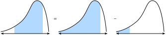
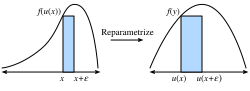
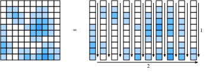

# 積分計算
:label:`sec_integral_calculus`

微分は、伝統的な微積分教育の内容の半分にすぎない。もう一つの柱である積分は、最初は「この曲線の下の面積はどれくらいか？」という、かなり別個の問いのように見える。一見無関係に思えますが、積分は *微積分の基本定理* として知られるものを通じて、微分と密接に結びついている。

本書で扱う機械学習のレベルでは、積分について深い理解は必要ない。しかし、後で出てくる応用の土台を築くために、簡単な導入を行いる。

## 幾何学的解釈
関数 $f(x)$ があるとする。簡単のため、$f(x)$ は非負（0 未満の値を取らない）と仮定しよう。ここで理解したいのは、$f(x)$ と $x$ 軸の間に含まれる面積がどれくらいか、ということである。

```{.python .input}
#@tab mxnet
%matplotlib inline
from d2l import mxnet as d2l
from IPython import display
from mpl_toolkits import mplot3d
from mxnet import np, npx
npx.set_np()

x = np.arange(-2, 2, 0.01)
f = np.exp(-x**2)

d2l.set_figsize()
d2l.plt.plot(x, f, color='black')
d2l.plt.fill_between(x.tolist(), f.tolist())
d2l.plt.show()
```

```{.python .input}
#@tab pytorch
%matplotlib inline
from d2l import torch as d2l
from IPython import display
from mpl_toolkits import mplot3d
import torch

x = torch.arange(-2, 2, 0.01)
f = torch.exp(-x**2)

d2l.set_figsize()
d2l.plt.plot(x, f, color='black')
d2l.plt.fill_between(x.tolist(), f.tolist())
d2l.plt.show()
```

```{.python .input}
#@tab tensorflow
%matplotlib inline
from d2l import tensorflow as d2l
from IPython import display
from mpl_toolkits import mplot3d
import tensorflow as tf

x = tf.range(-2, 2, 0.01)
f = tf.exp(-x**2)

d2l.set_figsize()
d2l.plt.plot(x, f, color='black')
d2l.plt.fill_between(x.numpy(), f.numpy())
d2l.plt.show()
```

多くの場合、この面積は無限大になるか、あるいは定義できません（$f(x) = x^{2}$ の下の面積を考えてみてください）。そのため、通常は $a$ と $b$ という 2 つの端点の間の面積を考える。

```{.python .input}
#@tab mxnet
x = np.arange(-2, 2, 0.01)
f = np.exp(-x**2)

d2l.set_figsize()
d2l.plt.plot(x, f, color='black')
d2l.plt.fill_between(x.tolist()[50:250], f.tolist()[50:250])
d2l.plt.show()
```

```{.python .input}
#@tab pytorch
x = torch.arange(-2, 2, 0.01)
f = torch.exp(-x**2)

d2l.set_figsize()
d2l.plt.plot(x, f, color='black')
d2l.plt.fill_between(x.tolist()[50:250], f.tolist()[50:250])
d2l.plt.show()
```

```{.python .input}
#@tab tensorflow
x = tf.range(-2, 2, 0.01)
f = tf.exp(-x**2)

d2l.set_figsize()
d2l.plt.plot(x, f, color='black')
d2l.plt.fill_between(x.numpy()[50:250], f.numpy()[50:250])
d2l.plt.show()
```

この面積は、以下の積分記号で表する。

$$
\textrm{Area}(\mathcal{A}) = \int_a^b f(x) \;dx.
$$

内部の変数はダミー変数であり、$\sum$ における和の添字と同じようなものである。そのため、内部の変数は任意の文字で書き換えても同じ意味になる。

$$
\int_a^b f(x) \;dx = \int_a^b f(z) \;dz.
$$

このような積分を近似する方法には、昔からの考え方がある。区間 $a$ から $b$ の間の領域を $N$ 個の縦のスライスに分割することを考える。$N$ が十分大きければ、各スライスの面積を長方形で近似し、それらを足し合わせることで曲線の下の総面積を求められる。これをコードで行う例を見てみよう。真の値の求め方は後の節で説明する。

```{.python .input}
#@tab mxnet
epsilon = 0.05
a = 0
b = 2

x = np.arange(a, b, epsilon)
f = x / (1 + x**2)

approx = np.sum(epsilon*f)
true = np.log(2) / 2

d2l.set_figsize()
d2l.plt.bar(x.asnumpy(), f.asnumpy(), width=epsilon, align='edge')
d2l.plt.plot(x, f, color='black')
d2l.plt.ylim([0, 1])
d2l.plt.show()

f'approximation: {approx}, truth: {true}'
```

```{.python .input}
#@tab pytorch
epsilon = 0.05
a = 0
b = 2

x = torch.arange(a, b, epsilon)
f = x / (1 + x**2)

approx = torch.sum(epsilon*f)
true = torch.log(torch.tensor([5.])) / 2

d2l.set_figsize()
d2l.plt.bar(x, f, width=epsilon, align='edge')
d2l.plt.plot(x, f, color='black')
d2l.plt.ylim([0, 1])
d2l.plt.show()

f'approximation: {approx}, truth: {true}'
```

```{.python .input}
#@tab tensorflow
epsilon = 0.05
a = 0
b = 2

x = tf.range(a, b, epsilon)
f = x / (1 + x**2)

approx = tf.reduce_sum(epsilon*f)
true = tf.math.log(tf.constant([5.])) / 2

d2l.set_figsize()
d2l.plt.bar(x, f, width=epsilon, align='edge')
d2l.plt.plot(x, f, color='black')
d2l.plt.ylim([0, 1])
d2l.plt.show()

f'approximation: {approx}, truth: {true}'
```

問題は、数値的にはできるとしても、この方法を解析的に扱えるのは次のような最も単純な関数に限られることである。

$$
\int_a^b x \;dx.
$$

コード中の例のような、もう少し複雑なもの

$$
\int_a^b \frac{x}{1+x^{2}} \;dx.
$$

は、このような直接的な方法では解けない。

そこで別のアプローチを取りる。面積という概念を直感的に扱いながら、積分を求めるための主要な計算道具である *微積分の基本定理* を学ぶ。これが積分の学習の基礎になる。

## 微積分の基本定理

積分の理論をさらに深く見ていくために、次の関数を導入しよう。

$$
F(x) = \int_0^x f(y) dy.
$$

この関数は、$x$ をどのように変えるかに応じて、0 から $x$ までの面積を表する。次が成り立つので、これで十分である。

$$
\int_a^b f(x) \;dx = F(b) - F(a).
$$

これは、図 :numref:`fig_area-subtract` に示すように、遠い端点までの面積を求めてから、近い端点までの面積を引けばよい、という事実を数学的に表したものである。


:label:`fig_area-subtract`

したがって、$F(x)$ が何であるかを求めれば、任意の区間での積分を求められる。

そのために、実験を考えてみよう。微積分でよく行うように、値をほんの少しだけずらしたときに何が起こるかを想像する。上のコメントから、

$$
F(x+\epsilon) - F(x) = \int_x^{x+\epsilon} f(y) \; dy.
$$

であることがわかる。これは、関数のごく薄い一片の下の面積だけ、関数値が変化することを意味する。

ここで近似を行いる。このような小さな面積の一片を見ると、その面積は、高さが $f(x)$、底辺の幅が $\epsilon$ の長方形の面積に近いように見える。実際、$\epsilon \rightarrow 0$ とすると、この近似はますます良くなることが示せる。したがって、

$$
F(x+\epsilon) - F(x) \approx \epsilon f(x).
$$

しかし、これは $F$ の導関数を計算しているときに期待される形とまったく同じである。したがって、次の少し驚くべき事実がわかる。

$$
\frac{dF}{dx}(x) = f(x).
$$

これが *微積分の基本定理* である。展開して書くと、
$$\frac{d}{dx}\int_0^x  f(y) \; dy = f(x).$$
:eqlabel:`eq_ftc`

これは、面積を求めるという概念（*a priori* にはかなり難しい）を、導関数に関する主張（はるかによく理解されているもの）へと還元する。最後にもう 1 つ述べておくべきことは、これだけでは $F(x)$ が正確に何であるかはわからないという点である。実際、任意の $C$ に対して $F(x)+C$ も同じ導関数を持つ。これは積分理論における避けられない事実である。幸いなことに、定積分を扱うときには定数項は打ち消し合うので、結果には影響しない。

$$
\int_a^b f(x) \; dx = (F(b) + C) - (F(a) + C) = F(b) - F(a).
$$

これは抽象的なナンセンスのように見えるかもしれませんが、積分の計算に対してまったく新しい見方を与えてくれることに少し立ち止まって注目しよう。もはや、面積を復元するために何かを切り分けて足し合わせる必要はない。必要なのは、求めたい関数の導関数が与えられた関数になるような関数を見つけることだけである。これは非常に強力である。なぜなら、 :numref:`sec_derivative_table` の表を逆向きに見るだけで、多くの難しい積分を書き下せるからである。たとえば、$x^{n}$ の導関数は $nx^{n-1}$ であることを知っている。したがって、基本定理 :eqref:`eq_ftc` を用いると、

$$
\int_0^{x} ny^{n-1} \; dy = x^n - 0^n = x^n.
$$

同様に、$e^{x}$ の導関数はそれ自身だろうから、

$$
\int_0^{x} e^{x} \; dx = e^{x} - e^{0} = e^x - 1.
$$

このようにして、微分積分学の考え方を自由に活用しながら、積分の理論全体を構築できる。すべての積分法則は、この 1 つの事実から導かれる。

## 変数変換
:label:`subsec_integral_example`

微分と同様に、積分の計算を扱いやすくするいくつかの規則がある。実際、微分積分学の各規則（積の法則、和の法則、連鎖律など）には、それぞれ対応する積分計算の規則（部分積分、積分の線形性、変数変換公式）がある。この節では、その中でもおそらく最も重要なもの、変数変換公式について見ていきる。

まず、積分そのものである関数を考える。

$$
F(x) = \int_0^x f(y) \; dy.
$$

この関数を別の関数と合成して $F(u(x))$ を得たとき、これがどのような形になるかを知りたいとする。連鎖律より、

$$
\frac{d}{dx}F(u(x)) = \frac{dF}{du}(u(x))\cdot \frac{du}{dx}.
$$

これを、上と同様に基本定理 :eqref:`eq_ftc` を用いて積分に関する主張へ変換できる。すると、

$$
F(u(x)) - F(u(0)) = \int_0^x \frac{dF}{du}(u(y))\cdot \frac{du}{dy} \;dy.
$$

ここで、$F$ が積分そのものであることを思い出すと、左辺は次のように書き換えられる。

$$
\int_{u(0)}^{u(x)} f(y) \; dy = \int_0^x \frac{dF}{du}(u(y))\cdot \frac{du}{dy} \;dy.
$$

同様に、$F$ が積分であることから、基本定理 :eqref:`eq_ftc` を用いて $\frac{dF}{dx} = f$ と認識できるので、結局

$$\int_{u(0)}^{u(x)} f(y) \; dy = \int_0^x f(u(y))\cdot \frac{du}{dy} \;dy.$$
:eqlabel:`eq_change_var`

これが *変数変換* の公式である。

より直感的に導くために、$f(u(x))$ の積分を $x$ と $x+\epsilon$ の間で考えてみよう。$\epsilon$ が小さいとき、この積分は対応する長方形の面積である $\epsilon f(u(x))$ に近似される。次に、$f(y)$ を $u(x)$ から $u(x+\epsilon)$ まで積分したものと比較する。$u(x+\epsilon) \approx u(x) + \epsilon \frac{du}{dx}(x)$ であることから、この長方形の面積はおよそ $\epsilon \frac{du}{dx}(x)f(u(x))$ である。したがって、これら 2 つの長方形の面積を一致させるには、図 :numref:`fig_rect-transform` に示すように、最初のものに $\frac{du}{dx}(x)$ を掛ける必要がある。


:label:`fig_rect-transform`

これは、

$$
\int_x^{x+\epsilon} f(u(y))\frac{du}{dy}(y)\;dy = \int_{u(x)}^{u(x+\epsilon)} f(y) \; dy.
$$

が成り立つことを意味する。

これは、1 つの小さな長方形について表した変数変換公式である。

$u(x)$ と $f(x)$ を適切に選べば、非常に複雑な積分の計算が可能になる。たとえば、$f(y) = 1$、$u(x) = e^{-x^{2}}$ を選ぶと（したがって $\frac{du}{dx}(x) = -2xe^{-x^{2}}$）、例えば

$$
e^{-1} - 1 = \int_{e^{-0}}^{e^{-1}} 1 \; dy = -2\int_0^{1} ye^{-y^2}\;dy,
$$

が示せる。したがって、整理すると

$$
\int_0^{1} ye^{-y^2}\; dy = \frac{1-e^{-1}}{2}.
$$

## 符号規約に関する注意

注意深い読者は、上の計算に何か奇妙な点があることに気づくでしょう。たとえば、

$$
\int_{e^{-0}}^{e^{-1}} 1 \; dy = e^{-1} -1 < 0,
$$

のような計算は負の数を生みる。面積について考えると、負の値を見るのは奇妙に感じられるかもしれない。そのため、ここでの規約を確認しておく価値がある。

数学者は、符号付き面積という概念を採用する。これは 2 つの形で現れる。まず、関数 $f(x)$ がときどき 0 未満になる場合、その面積も負になる。たとえば、

$$
\int_0^{1} (-1)\;dx = -1.
$$

同様に、左から右ではなく右から左へ進む積分も、負の面積とみなされる。

$$
\int_0^{-1} 1\; dx = -1.
$$

標準的な面積（正の関数を左から右へ積分したもの）は常に正である。これを反転させたもの、たとえば $x$ 軸について反転して負の数の積分にしたり、$y$ 軸について反転して順序が逆の積分にしたりすると、負の面積になる。そして実際、2 回反転すると 2 つの負号が打ち消し合って正の面積になる。

$$
\int_0^{-1} (-1)\;dx =  1.
$$

この話に聞き覚えがあるなら、その通りである。 :numref:`sec_geometry-linear-algebraic-ops` では、行列式が同じように符号付き面積を表すことを説明した。

## 多重積分
場合によっては、より高次元で考える必要がある。たとえば、2 変数の関数 $f(x, y)$ があり、$x$ が $[a, b]$ を、$y$ が $[c, d]$ を動くときの $f$ の下の体積を知りたいとする。

```{.python .input}
#@tab mxnet
# Construct grid and compute function
x, y = np.meshgrid(np.linspace(-2, 2, 101), np.linspace(-2, 2, 101),
                   indexing='ij')
z = np.exp(- x**2 - y**2)

# Plot function
ax = d2l.plt.figure().add_subplot(111, projection='3d')
ax.plot_wireframe(x.asnumpy(), y.asnumpy(), z.asnumpy())
d2l.plt.xlabel('x')
d2l.plt.ylabel('y')
d2l.plt.xticks([-2, -1, 0, 1, 2])
d2l.plt.yticks([-2, -1, 0, 1, 2])
d2l.set_figsize()
ax.set_xlim(-2, 2)
ax.set_ylim(-2, 2)
ax.set_zlim(0, 1)
ax.dist = 12
```

```{.python .input}
#@tab pytorch
# Construct grid and compute function
x, y = torch.meshgrid(torch.linspace(-2, 2, 101), torch.linspace(-2, 2, 101))
z = torch.exp(- x**2 - y**2)

# Plot function
ax = d2l.plt.figure().add_subplot(111, projection='3d')
ax.plot_wireframe(x, y, z)
d2l.plt.xlabel('x')
d2l.plt.ylabel('y')
d2l.plt.xticks([-2, -1, 0, 1, 2])
d2l.plt.yticks([-2, -1, 0, 1, 2])
d2l.set_figsize()
ax.set_xlim(-2, 2)
ax.set_ylim(-2, 2)
ax.set_zlim(0, 1)
ax.dist = 12
```

```{.python .input}
#@tab tensorflow
# Construct grid and compute function
x, y = tf.meshgrid(tf.linspace(-2., 2., 101), tf.linspace(-2., 2., 101))
z = tf.exp(- x**2 - y**2)

# Plot function
ax = d2l.plt.figure().add_subplot(111, projection='3d')
ax.plot_wireframe(x, y, z)
d2l.plt.xlabel('x')
d2l.plt.ylabel('y')
d2l.plt.xticks([-2, -1, 0, 1, 2])
d2l.plt.yticks([-2, -1, 0, 1, 2])
d2l.set_figsize()
ax.set_xlim(-2, 2)
ax.set_ylim(-2, 2)
ax.set_zlim(0, 1)
ax.dist = 12
```

これを次のように書く。

$$
\int_{[a, b]\times[c, d]} f(x, y)\;dx\;dy.
$$

この積分を計算したいとする。私の主張は、まず $x$ について積分し、その後で $y$ について積分するという手順を繰り返すことで計算できる、ということである。すなわち、

$$
\int_{[a, b]\times[c, d]} f(x, y)\;dx\;dy = \int_c^{d} \left(\int_a^{b} f(x, y) \;dx\right) \; dy.
$$

なぜそうなるのか見てみよう。

上の図では、関数を $\epsilon \times \epsilon$ の正方形に分割し、それぞれを整数座標 $i, j$ で表している。この場合、積分はおよそ

$$
\sum_{i, j} \epsilon^{2} f(\epsilon i, \epsilon j).
$$

と近似できる。

一度離散化してしまえば、これらの正方形上の値をどの順序で足し合わせてもよく、値が変わることを心配する必要はない。これは :numref:`fig_sum-order` に示されている。特に、

$$
 \sum _ {j} \epsilon \left(\sum_{i} \epsilon f(\epsilon i, \epsilon j)\right).
$$

と書ける。


:label:`fig_sum-order`

内側の和は、まさに次の積分の離散化である。

$$
G(\epsilon j) = \int _a^{b} f(x, \epsilon j) \; dx.
$$

最後に、この 2 つの式を組み合わせると、

$$
\sum _ {j} \epsilon G(\epsilon j) \approx \int _ {c}^{d} G(y) \; dy = \int _ {[a, b]\times[c, d]} f(x, y)\;dx\;dy.
$$

したがって、まとめると

$$
\int _ {[a, b]\times[c, d]} f(x, y)\;dx\;dy = \int _ c^{d} \left(\int _ a^{b} f(x, y) \;dx\right) \; dy.
$$

一度離散化してしまえば、私たちがやったことは数の列を足す順序を入れ替えただけだということに注意する。すると、これは大したことではないように思えるかもしれない。しかし、この結果（*フビニの定理* と呼ばれます）は常に成り立つわけではありません！機械学習で扱う種類の数学（連続関数）では問題ありませんが、成り立たない例を作ることも可能です（たとえば、長方形 $[0,2]\times[0,1]$ 上の関数 $f(x, y) = xy(x^2-y^2)/(x^2+y^2)^3$ など）。

$x$ を先に積分し、その後 $y$ を積分するという選択は任意であったことに注意する。同様に、先に $y$、次に $x$ を積分して

$$
\int _ {[a, b]\times[c, d]} f(x, y)\;dx\;dy = \int _ a^{b} \left(\int _ c^{d} f(x, y) \;dy\right) \; dx.
$$

と書くこともできる。

しばしば、ベクトル表記にまとめて、$U = [a, b]\times [c, d]$ に対して

$$
\int _ U f(\mathbf{x})\;d\mathbf{x}.
$$

と書く。

## 多重積分における変数変換
:eqref:`eq_change_var` の 1 変数の場合と同様に、高次元の積分の中で変数を変えることは重要な道具である。ここでは導出は省略して、結果だけをまとめる。

積分領域を再パラメータ化する関数が必要である。これを $\phi : \mathbb{R}^n \rightarrow \mathbb{R}^n$ とする。つまり、$n$ 個の実変数を受け取り、別の $n$ 個を返す任意の関数である。式をすっきりさせるために、$\phi$ は *単射*、すなわち自分自身に折り返すことがない（$\phi(\mathbf{x}) = \phi(\mathbf{y}) \implies \mathbf{x} = \mathbf{y}$）と仮定する。

このとき、

$$
\int _ {\phi(U)} f(\mathbf{x})\;d\mathbf{x} = \int _ {U} f(\phi(\mathbf{x})) \left|\det(D\phi(\mathbf{x}))\right|\;d\mathbf{x}.
$$

と書ける。

ここで $D\phi$ は $\phi$ の *ヤコビアン* であり、$\boldsymbol{\phi} = (\phi_1(x_1, \ldots, x_n), \ldots, \phi_n(x_1, \ldots, x_n))$ の偏微分からなる行列である。

$$
D\boldsymbol{\phi} = \begin{bmatrix}
\frac{\partial \phi _ 1}{\partial x _ 1} & \cdots & \frac{\partial \phi _ 1}{\partial x _ n} \\
\vdots & \ddots & \vdots \\
\frac{\partial \phi _ n}{\partial x _ 1} & \cdots & \frac{\partial \phi _ n}{\partial x _ n}
\end{bmatrix}.
$$

よく見ると、これは 1 変数の連鎖律 :eqref:`eq_change_var` に似ていますが、$\frac{du}{dx}(x)$ の代わりに $\left|\det(D\phi(\mathbf{x}))\right|$ が現れている点が異なる。この項をどう解釈すればよいか見てみよう。$\frac{du}{dx}(x)$ の項は、$u$ を適用することで $x$ 軸がどれだけ伸びるかを表していた。高次元で同じことを行うには、$\boldsymbol{\phi}$ を適用したときに、小さな正方形（あるいは小さな *超立方体*）の面積（あるいは体積、あるいは超体積）がどれだけ伸びるかを調べる。もし $\boldsymbol{\phi}$ が行列による乗算であれば、行列式がその答えを与えることはすでに知っている。

少し工夫すれば、*ヤコビアン* は、微分や勾配を用いて直線や平面で近似できるのと同じように、多変数関数 $\boldsymbol{\phi}$ をある点の近くで最もよく近似する行列であることが示せる。したがって、ヤコビアンの行列式は、1 次元で見たスケーリング因子をそのまま高次元に拡張したものになっている。

これを厳密に埋めるには少し手間がかかるので、今すぐ完全に明確でなくても心配はいりない。少なくとも、後で使う例を 1 つ見てみよう。次の積分を考える。

$$
\int _ {-\infty}^{\infty} \int _ {-\infty}^{\infty} e^{-x^{2}-y^{2}} \;dx\;dy.
$$

この積分を直接いじっても先には進めませんが、変数変換を使えば大きく前進できる。$\boldsymbol{\phi}(r, \theta) = (r \cos(\theta),  r\sin(\theta))$（つまり $x = r \cos(\theta)$、$y = r \sin(\theta)$）とおくと、変数変換公式により、これは次と同じである。

$$
\int _ 0^\infty \int_0 ^ {2\pi} e^{-r^{2}} \left|\det(D\mathbf{\phi}(\mathbf{x}))\right|\;d\theta\;dr,
$$

ここで

$$
\left|\det(D\mathbf{\phi}(\mathbf{x}))\right| = \left|\det\begin{bmatrix}
\cos(\theta) & -r\sin(\theta) \\
\sin(\theta) & r\cos(\theta)
\end{bmatrix}\right| = r(\cos^{2}(\theta) + \sin^{2}(\theta)) = r.
$$

したがって、積分は

$$
\int _ 0^\infty \int _ 0 ^ {2\pi} re^{-r^{2}} \;d\theta\;dr = 2\pi\int _ 0^\infty re^{-r^{2}} \;dr = \pi,
$$

となる。最後の等号は、 :numref:`subsec_integral_example` 節で使ったのと同じ計算に従う。

この積分は、 :numref:`sec_random_variables` で連続確率変数を学ぶときに再び登場する。

## まとめ

* 積分の理論により、面積や体積に関する問いに答えられる。
* 微積分の基本定理により、ある点までの面積の導関数が積分される関数の値で与えられるという観察を通じて、導関数に関する知識を使って面積を計算できる。
* 高次元の積分は、1 変数積分を繰り返すことで計算できる。

## 演習
1. $\int_1^2 \frac{1}{x} \;dx$ はいくらか？
2. 変数変換公式を用いて、$\int_0^{\sqrt{\pi}}x\sin(x^2)\;dx$ を積分せよ。
3. $\int_{[0,1]^2} xy \;dx\;dy$ はいくらか？
4. 変数変換公式を用いて $\int_0^2\int_0^1xy(x^2-y^2)/(x^2+y^2)^3\;dy\;dx$ と $\int_0^1\int_0^2f(x, y) = xy(x^2-y^2)/(x^2+y^2)^3\;dx\;dy$ を計算し、それらが異なることを確かめよ。

:begin_tab:`mxnet`
[Discussions](https://discuss.d2l.ai/t/414)
:end_tab:

:begin_tab:`pytorch`
[Discussions](https://discuss.d2l.ai/t/1092)
:end_tab:


:begin_tab:`tensorflow`
[Discussions](https://discuss.d2l.ai/t/1093)
:end_tab:\n