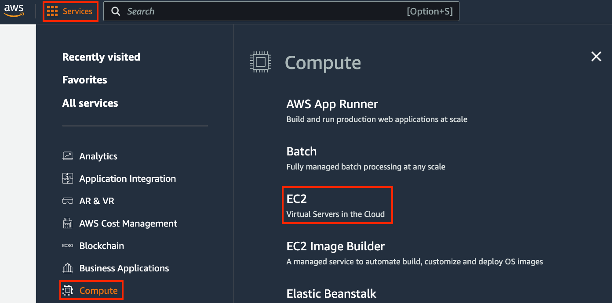
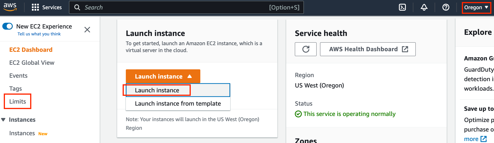
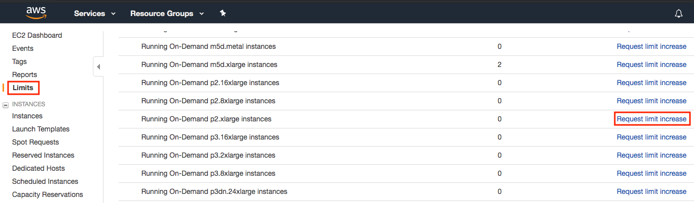
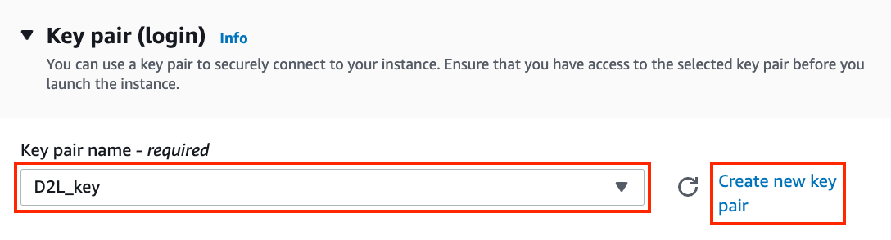
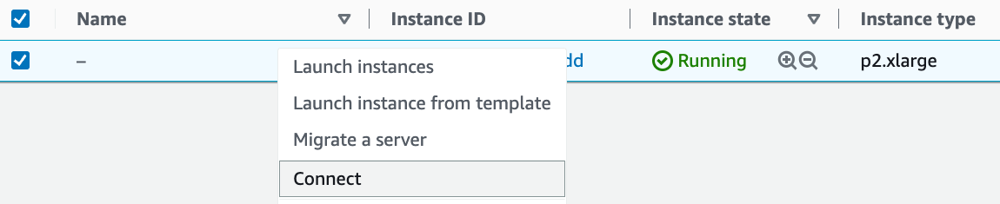

# AWS EC2 インスタンスの使用
:label:`sec_aws`

この節では、素の Linux マシンにすべてのライブラリをインストールする方法を示します。:numref:`sec_sagemaker` では Amazon SageMaker の使い方を説明しましたが、AWS では自分でインスタンスを構築するほうが費用は安く済みます。手順は次の 3 ステップです。

1. AWS EC2 から GPU 搭載の Linux インスタンスを要求する。
1. CUDA をインストールする（または CUDA があらかじめインストールされた Amazon Machine Image を使う）。
1. 本書のコードを実行するための深層学習フレームワークやその他のライブラリをインストールする。

この手順は、多少の変更は必要ですが、他のインスタンス（および他のクラウド）にも適用できます。先に進む前に AWS アカウントを作成する必要があります。詳細は :numref:`sec_sagemaker` を参照してください。


## EC2 インスタンスの作成と実行

AWS アカウントにログインしたら、"EC2" をクリックして (:numref:`fig_aws`) EC2 パネルへ移動します。


:width:`400px`
:label:`fig_aws`

:numref:`fig_ec2` に EC2 パネルを示します。


:width:`700px`
:label:`fig_ec2`

### 場所の事前設定
遅延を減らすため、近くのデータセンターを選択します。たとえば、右上の赤枠で示した "Oregon" です (:numref:`fig_ec2`)。中国にいる場合は、ソウルや東京など、近いアジア太平洋リージョンを選択できます。なお、データセンターによっては GPU インスタンスが利用できない場合があります。


### 制限の増加

インスタンスを選ぶ前に、左側のバーにある "Limits" ラベルをクリックして、数量制限があるかどうかを確認してください。:numref:`fig_ec2` に示すようにします。:numref:`fig_limits` はそのような制限の例です。現在のアカウントでは、リージョンの制約により "p2.xlarge" インスタンスを起動できません。1 つ以上のインスタンスを起動する必要がある場合は、"Request limit increase" リンクをクリックして、より高いインスタンス割り当てを申請してください。通常、申請の処理には 1 営業日かかります。


:width:`700px`
:label:`fig_limits`


### インスタンスの起動

次に、:numref:`fig_ec2` の赤枠で示した "Launch Instance" ボタンをクリックして、インスタンスを起動します。

まず、適切な Amazon Machine Image (AMI) を選択します。Ubuntu インスタンスを選びます (:numref:`fig_ubuntu`)。


:width:`700px`
:label:`fig_ubuntu`

EC2 では、さまざまなインスタンス構成を選べます。初心者には少し圧倒されるかもしれません。:numref:`tab_ec2` に適したマシンの例を示します。

:さまざまな EC2 インスタンスタイプ
:label:`tab_ec2`

| Name | GPU         | Notes                         |
|------|-------------|-------------------------------|
| g2   | Grid K520   | ancient                       |
| p2   | Kepler K80  | old but often cheap as spot   |
| g3   | Maxwell M60 | good trade-off                |
| p3   | Volta V100  | high performance for FP16     |
| p4   | Ampere A100 | high performance for large-scale training |
| g4   | Turing T4   | inference optimized FP16/INT8 |


これらのサーバーには、使用する GPU の数を示す複数のバリエーションがあります。たとえば、p2.xlarge は GPU が 1 基、p2.16xlarge は GPU が 16 基で、メモリも多くなります。詳細は [AWS EC2 documentation](https://aws.amazon.com/ec2/instance-types/) または [summary page](https://www.ec2instances.info) を参照してください。説明のためには p2.xlarge で十分です (:numref:`fig_p2x` の赤枠で示しています)。


:width:`700px`
:label:`fig_p2x`

GPU を使うには、適切なドライバと GPU 対応の深層学習フレームワークを備えた GPU 有効インスタンスを使う必要があることに注意してください。そうでなければ、GPU を使う利点は得られません。

続いて、インスタンスにアクセスするためのキーペアを選択します。キーペアがない場合は、:numref:`fig_keypair` の "Create new key pair" をクリックしてキーペアを生成します。その後、以前に生成したキーペアを選択できます。新しいキーペアを生成した場合は、必ずダウンロードして安全な場所に保管してください。これはサーバーへ SSH 接続する唯一の方法です。


:width:`500px`
:label:`fig_keypair`

この例では、"Network settings" の既定設定はそのままにします（サブネットやセキュリティグループなどを設定するには "Edit" ボタンをクリックします）。ここでは、既定のハードディスクサイズを 64 GB に増やすだけにします (:numref:`fig_disk`)。CUDA だけでもすでに 4 GB を占有することに注意してください。


:width:`700px`
:label:`fig_disk`


"Launch Instance" をクリックして作成したインスタンスを起動します。:numref:`fig_launching` に示すインスタンス ID をクリックすると、このインスタンスの状態を確認できます。


:width:`700px`
:label:`fig_launching`

### インスタンスへの接続

:numref:`fig_connect` に示すように、インスタンスの状態が緑色になったら、インスタンスを右クリックして `Connect` を選択し、インスタンスへの接続方法を表示します。


:width:`700px`
:label:`fig_connect`

これが新しい鍵である場合、SSH を機能させるには公開表示されていてはいけません。`D2L_key.pem` を保存したフォルダに移動し、次のコマンドを実行して鍵を公開表示不可にします。

```bash
chmod 400 D2L_key.pem
```


:width:`400px`
:label:`fig_chmod`


次に、:numref:`fig_chmod` の下側の赤枠にある SSH コマンドをコピーして、コマンドラインに貼り付けます。

```bash
ssh -i "D2L_key.pem" ubuntu@ec2-xx-xxx-xxx-xxx.y.compute.amazonaws.com
```


コマンドラインで "Are you sure you want to continue connecting (yes/no)" と表示されたら、"yes" と入力して Enter を押し、インスタンスにログインします。

これでサーバーの準備は完了です。


## CUDA のインストール

CUDA をインストールする前に、最新のドライバでインスタンスを更新してください。

```bash
sudo apt-get update && sudo apt-get install -y build-essential git libgfortran3
```


ここでは CUDA 12.1 をダウンロードします。NVIDIA の [official repository](https://developer.nvidia.com/cuda-toolkit-archive) にアクセスして、:numref:`fig_cuda` に示すようにダウンロードリンクを見つけてください。


:width:`500px`
:label:`fig_cuda`

指示をコピーして端末に貼り付け、CUDA 12.1 をインストールします。

```bash
# The link and file name are subject to changes
wget https://developer.download.nvidia.com/compute/cuda/repos/ubuntu2204/x86_64/cuda-ubuntu2204.pin
sudo mv cuda-ubuntu2204.pin /etc/apt/preferences.d/cuda-repository-pin-600
wget https://developer.download.nvidia.com/compute/cuda/12.1.0/local_installers/cuda-repo-ubuntu2204-12-1-local_12.1.0-530.30.02-1_amd64.deb
sudo dpkg -i cuda-repo-ubuntu2204-12-1-local_12.1.0-530.30.02-1_amd64.deb
sudo cp /var/cuda-repo-ubuntu2204-12-1-local/cuda-*-keyring.gpg /usr/share/keyrings/
sudo apt-get update
sudo apt-get -y install cuda
```


プログラムをインストールした後、次のコマンドを実行して GPU を確認します。

```bash
nvidia-smi
```


最後に、CUDA をライブラリパスに追加して他のライブラリが見つけられるようにします。たとえば、次の行を `~/.bashrc` の末尾に追加します。

```bash
export PATH="/usr/local/cuda-12.1/bin:$PATH"
export LD_LIBRARY_PATH=${LD_LIBRARY_PATH}:/usr/local/cuda-12.1/lib64
```


## コード実行用ライブラリのインストール

本書のコードを実行するには、EC2 インスタンス上の Linux ユーザー向けに :ref:`chap_installation` の手順に従い、リモート Linux サーバーで作業する際には次のヒントを使ってください。

* Miniconda のインストールページにある bash スクリプトをダウンロードするには、ダウンロードリンクを右クリックして "Copy Link Address" を選び、`wget [コピーしたリンクアドレス]` を実行します。
* `~/miniconda3/bin/conda init` を実行した後は、現在のシェルを閉じて開き直す代わりに `source ~/.bashrc` を実行してもかまいません。


## Jupyter Notebook をリモートで実行する

Jupyter Notebook をリモートで実行するには、SSH のポートフォワーディングを使う必要があります。そもそも、クラウド上のサーバーにはモニターもキーボードもありません。そのため、次のようにデスクトップ（またはノートパソコン）からサーバーにログインします。

```
# This command must be run in the local command line
ssh -i "/path/to/key.pem" ubuntu@ec2-xx-xxx-xxx-xxx.y.compute.amazonaws.com -L 8889:localhost:8888
```


次に、EC2 インスタンス上で本書のダウンロード済みコードの場所に移動し、以下を実行します。

```
conda activate d2l
jupyter notebook
```


:numref:`fig_jupyter` は、Jupyter Notebook を実行した後に得られる出力例を示しています。最後の行がポート 8888 の URL です。


:width:`700px`
:label:`fig_jupyter`

ポートフォワーディングで 8889 番ポートを使っているので、:numref:`fig_jupyter` の赤枠内の最後の行をコピーし、URL の "8888" を "8889" に置き換えて、ローカルのブラウザで開きます。


## 使用していないインスタンスを終了する

クラウドサービスは使用時間に応じて課金されるため、使っていないインスタンスは閉じるべきです。なお、次の 2 つの方法があります。

* インスタンスを "Stopping" すると、再び起動できるようになります。これは通常のサーバーの電源を切るのに似ています。ただし、停止中のインスタンスでも、保持されているハードディスク領域に対して少額の課金は続きます。 
* インスタンスを "Terminating" すると、それに関連付けられたすべてのデータが削除されます。これにはディスクも含まれるため、再起動することはできません。将来使う予定がないと確信している場合にのみ実行してください。

このインスタンスをさらに多くのインスタンスのテンプレートとして使いたい場合は、:numref:`fig_connect` の例を右クリックして "Image" $\rightarrow$
"Create" を選び、インスタンスのイメージを作成します。完了したら、"Instance State" $\rightarrow$ "Terminate" を選んでインスタンスを終了します。次回このインスタンスを使いたいときは、この節の手順に従って保存したイメージを基にインスタンスを作成できます。違いは、:numref:`fig_ubuntu` に示した "1. Choose AMI" で、左側の "My AMIs" オプションを使って保存したイメージを選択する点だけです。作成されたインスタンスには、イメージのハードディスクに保存されていた情報が保持されます。たとえば、CUDA やその他の実行環境を再インストールする必要はありません。


## まとめ

* 自分でコンピュータを購入して構築しなくても、必要に応じてインスタンスを起動・停止できます。
* GPU 対応の深層学習フレームワークを使う前に CUDA をインストールする必要があります。
* ポートフォワーディングを使えば、リモートサーバー上で Jupyter Notebook を実行できます。


## 演習

1. クラウドは便利ですが、安くはありません。費用を抑えるために [spot instances](https://aws.amazon.com/ec2/spot/) を起動する方法を調べてください。
1. さまざまな GPU サーバーを試してみてください。どれくらい速いでしょうか。
1. マルチ GPU サーバーを試してみてください。どの程度スケールアップできるでしょうか。


[Discussions](https://discuss.d2l.ai/t/423)\n