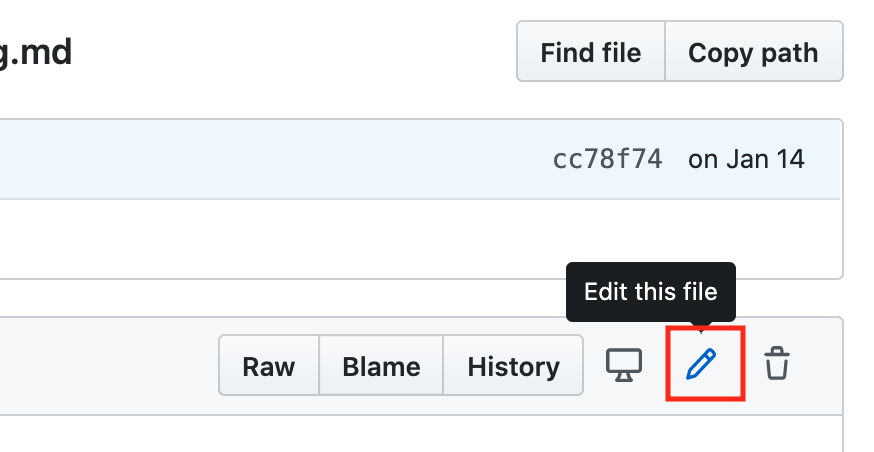
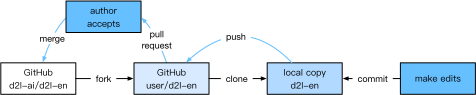
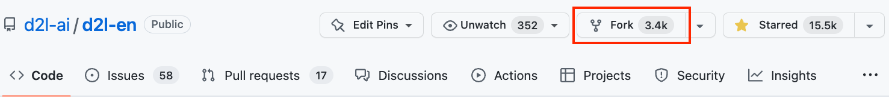
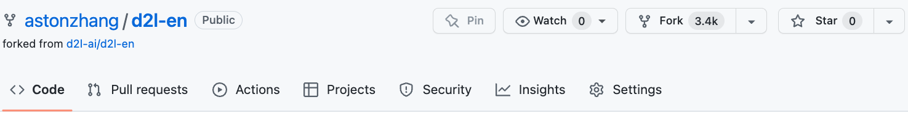

# この本への貢献
:label:`sec_how_to_contribute`

[読者](https://github.com/d2l-ai/d2l-en/graphs/contributors)からの貢献は、この本を改善するうえで大いに役立つ。誤字を見つけた場合、古くなったリンクを見つけた場合、引用が抜けていると思われる箇所がある場合、コードが洗練されていない場合、あるいは説明が不明瞭な場合は、ぜひご自身で修正して、私たちが読者の皆さんをよりよく支援できるようにする。通常の書籍では、印刷版の改訂（したがって誤字修正）までの遅れは年単位になることがあるが、この本では改善を取り込むのに通常は数時間から数日しかかからない。これはすべて、バージョン管理と継続的インテグレーション（CI）テストのおかげで可能になっている。そのためには、GitHub リポジトリに [pull request](https://github.com/d2l-ai/d2l-en/pulls) を送る必要がある。著者によって pull request がコードリポジトリにマージされると、あなたは貢献者になる。

## 小さな変更の提出

最も一般的な貢献は、1文を編集したり、誤字を修正したりすることである。まず [GitHub repository](https://github.com/d2l-ai/d2l-en) でソースファイルを見つけ、直接編集することをおすすめする。たとえば、[Find file](https://github.com/d2l-ai/d2l-en/find/master) ボタンを使ってファイルを検索し (:numref:`fig_edit_file`)、ソースファイル（markdown ファイル）を特定できる。次に、右上隅の "Edit this file" ボタンをクリックして、markdown ファイルに変更を加える。


:width:`300px`
:label:`fig_edit_file`

編集が終わったら、ページ下部の "Propose file change" パネルに変更内容の説明を入力し、"Propose file change" ボタンをクリックする。すると、新しいページに移動して変更内容を確認できます (:numref:`fig_git_createpr`)。問題がなければ、"Create pull request" ボタンをクリックして pull request を送信できる。

## 大きな変更の提案

テキストやコードの大部分を更新する予定がある場合は、この本で使われている形式についてもう少し理解しておく必要がある。ソースファイルは [markdown format](https://daringfireball.net/projects/markdown/syntax) を基にしており、[D2L-Book](http://book.d2l.ai/user/markdown.html) パッケージによる拡張として、数式、画像、章、引用を参照する機能などが追加されている。これらのファイルは任意の markdown エディタで開いて編集できる。

コードを変更したい場合は、 :numref:`sec_jupyter` で説明されているように Jupyter Notebook を使ってこれらの markdown ファイルを開くことをおすすめする。そうすれば、変更を実行してテストできる。更新したセクションを CI システムが実行して出力を生成するため、変更を提出する前にすべての出力を消去するのを忘れないでください。

一部のセクションでは、複数のフレームワーク実装をサポートしている場合がある。
新しいコードブロックを追加する場合は、ブロックの先頭行に `%%tab` を付けてください。たとえば、
PyTorch のコードブロックには `%%tab pytorch`、TensorFlow のコードブロックには `%%tab tensorflow`、すべての実装で共有するコードブロックには `%%tab all` を使う。詳細は `d2lbook` パッケージを参照する。

## 大きな変更の提出

大きな変更を提出するには、標準的な Git の手順を使うことをおすすめする。要するに、その流れは :numref:`fig_contribute` に示すとおりである。


:label:`fig_contribute`

以下で各手順を詳しく説明する。すでに Git に慣れている方は、この節を飛ばしてもかまわない。具体例として、貢献者のユーザー名を "astonzhang" と仮定する。

### Git のインストール

Git のオープンソース書籍には、[Git のインストール方法](https://git-scm.com/book/en/v2) が説明されている。通常、Ubuntu Linux では `apt install git` で、macOS では Xcode の開発者ツールをインストールすることで、あるいは GitHub の [desktop client](https://desktop.github.com) を使うことで実行できる。GitHub アカウントを持っていない場合は、登録する必要がある。

### GitHub にログインする

ブラウザで、この本のコードリポジトリの [address](https://github.com/d2l-ai/d2l-en/) を開く。 :numref:`fig_git_fork` の右上にある赤枠内の `Fork` ボタンをクリックして、この本のリポジトリのコピーを作成する。これでそれは *あなたのコピー* となり、好きなように変更できる。


:width:`700px`
:label:`fig_git_fork`


すると、この本のコードリポジトリはあなたのユーザー名に fork（つまり複製）され、 :numref:`fig_git_forked` の左上に示されている `astonzhang/d2l-en` のようになる。


:width:`700px`
:label:`fig_git_forked`

### リポジトリをクローンする

リポジトリを clone（つまりローカルコピーを作成）するには、そのリポジトリアドレスを取得する必要がある。 :numref:`fig_git_clone` の緑のボタンにそれが表示される。この fork を長く使い続けるつもりなら、ローカルコピーがメインリポジトリと同期して最新であることを確認する。まずは、始めるために :ref:`chap_installation` の手順に従ってください。主な違いは、今はリポジトリの *自分の fork* をダウンロードしているという点である。


:width:`700px`
:label:`fig_git_clone`

```
# Replace your_github_username with your GitHub username
git clone https://github.com/your_github_username/d2l-en.git
```


### 編集して push する

いよいよ本を編集する。 :numref:`sec_jupyter` の手順に従って Jupyter Notebook で編集するのが最善である。変更を加え、問題ないことを確認する。たとえば、`~/d2l-en/chapter_appendix-tools-for-deep-learning/contributing.md` というファイルの誤字を修正したとする。
その後、どのファイルを変更したかを確認できる。

この時点で Git は `chapter_appendix-tools-for-deep-learning/contributing.md` ファイルが変更されたことを知らせる。

```
mylaptop:d2l-en me$ git status
On branch master
Your branch is up-to-date with 'origin/master'.

Changes not staged for commit:
  (use "git add <file>..." to update what will be committed)
  (use "git checkout -- <file>..." to discard changes in working directory)

	modified:   chapter_appendix-tools-for-deep-learning/contributing.md
```


これが意図した変更であることを確認したら、次のコマンドを実行する。

```
git add chapter_appendix-tools-for-deep-learning/contributing.md
git commit -m 'Fix a typo in git documentation'
git push
```


変更されたコードは、あなたの個人 fork リポジトリに入る。変更の追加を依頼するには、この本の公式リポジトリに対して pull request を作成する必要がある。

### Pull Request を提出する

:numref:`fig_git_newpr` に示すように、GitHub 上で自分の fork リポジトリに移動し、"New pull request" を選択する。すると、あなたの編集内容と、この本のメインリポジトリの現在の内容との差分を表示する画面が開く。


:width:`700px`
:label:`fig_git_newpr`


最後に、 :numref:`fig_git_createpr` に示すボタンをクリックして pull request を提出する。pull request には、行った変更内容を必ず記述する。
そうすることで、著者がレビューしやすくなり、本にマージしやすくなる。変更内容によっては、すぐに受け入れられることもあれば、却下されることもありますし、より可能性が高いのは、変更に関するフィードバックを受け取ることである。それらを反映させれば、準備完了である。


:width:`700px`
:label:`fig_git_createpr`


## 要約

* GitHub を使ってこの本に貢献できる。
* 小さな変更なら、GitHub 上で直接ファイルを編集できる。
* 大きな変更の場合は、リポジトリを fork し、ローカルで編集し、準備が整ってから貢献する。
* 貢献は pull request としてまとめて送られる。大きすぎる pull request は理解や取り込みが難しくなるので避けてください。複数の小さな pull request に分けて送るほうがよいである。


## 演習

1. `d2l-ai/d2l-en` リポジトリに star と fork をする。
1. 改善が必要だと思う点（たとえば、参照の欠落）を見つけたら、pull request を提出する。 
1. 通常は、新しいブランチを使って pull request を作成するほうがよい方法である。[Git branching](https://git-scm.com/book/en/v2/Git-Branching-Branches-in-a-Nutshell) でその方法を学びましょう。
