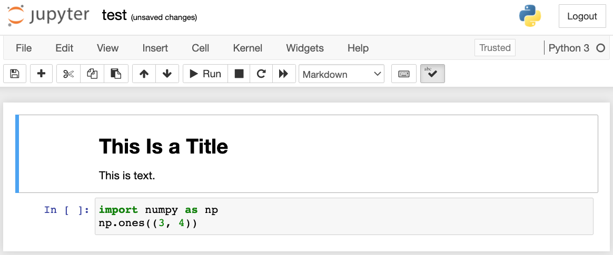
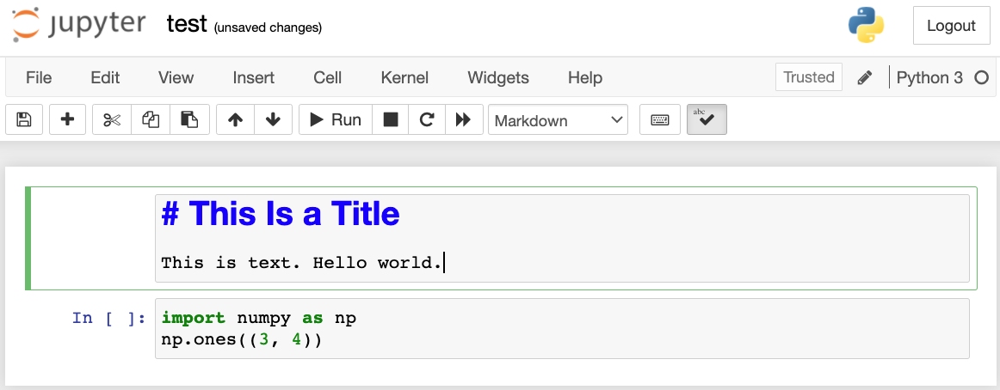
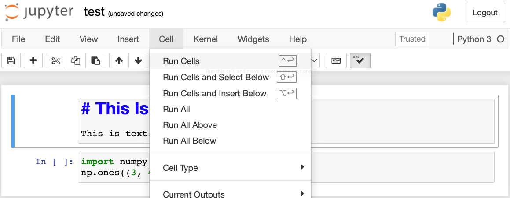
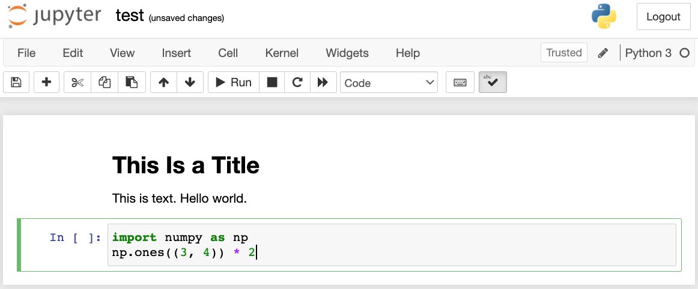

# Jupyter Notebook の使用
:label:`sec_jupyter`


この節では、Jupyter Notebook を使って本書の各節にあるコードを編集し、実行する方法を説明する。Jupyter がインストールされており、:ref:`chap_installation` に記載されているとおりにコードをダウンロードしてあることを確認する。Jupyter についてさらに知りたい場合は、[ドキュメント](https://jupyter.readthedocs.io/en/latest/) にある優れたチュートリアルを参照する。


## ローカルでコードを編集・実行する

本書のコードのローカルパスが `xx/yy/d2l-en/` だとする。シェルを使ってこのパスにディレクトリを移動し（`cd xx/yy/d2l-en`）、`jupyter notebook` コマンドを実行する。ブラウザが自動的に開かない場合は、http://localhost:8888 を開いよ。すると、 :numref:`fig_jupyter00` に示すように、Jupyter のインターフェースと、本書のコードを含むすべてのフォルダが表示される。


:width:`600px`
:label:`fig_jupyter00`


Webページに表示されているフォルダをクリックすると、ノートブックファイルにアクセスできる。これらは通常、拡張子 ".ipynb" を持つ。簡潔さのため、ここでは一時的な "test.ipynb" ファイルを作成する。クリックした後に表示される内容は :numref:`fig_jupyter01` に示されている。このノートブックには markdown セルと code セルが含まれている。markdown セルの内容には "This Is a Title" と "This is text." が含まれている。code セルには 2 行の Python コードが含まれている。


:width:`600px`
:label:`fig_jupyter01`


markdown セルをダブルクリックして編集モードに入る。 :numref:`fig_jupyter02` に示すように、セルの末尾に新しい文字列 "Hello world." を追加する。


:width:`600px`
:label:`fig_jupyter02`


:numref:`fig_jupyter03` に示すように、メニューバーの "Cell" $\rightarrow$ "Run Cells" をクリックして編集したセルを実行する。


:width:`600px`
:label:`fig_jupyter03`

実行後、markdown セルは :numref:`fig_jupyter04` のように表示される。


:width:`600px`
:label:`fig_jupyter04`


次に code セルをクリックする。 :numref:`fig_jupyter05` に示すように、最後のコード行の後に要素を 2 倍にする。


:width:`600px`
:label:`fig_jupyter05`


ショートカット（既定では "Ctrl + Enter"）を使ってセルを実行し、 :numref:`fig_jupyter06` の出力結果を得ることもできる。


:width:`600px`
:label:`fig_jupyter06`


ノートブックにより多くのセルが含まれている場合は、メニューバーの "Kernel" $\rightarrow$ "Restart & Run All" をクリックして、ノートブック全体のすべてのセルを実行できる。メニューバーの "Help" $\rightarrow$ "Edit Keyboard Shortcuts" をクリックすると、好みに応じてショートカットを編集できる。

## 高度なオプション

ローカルでの編集に加えて、2 つのことが非常に重要である。markdown 形式でノートブックを編集することと、Jupyter をリモートで実行することである。後者は、より高速なサーバー上でコードを実行したいときに重要である。前者が重要なのは、Jupyter のネイティブな ipynb 形式が、内容とは無関係な多くの補助データを保存するからである。これらは主に、コードがどのように、どこで実行されたかに関係している。これは Git にとって扱いにくく、貢献内容のレビューを非常に難しくする。幸い、代替手段として markdown 形式でのネイティブな編集がある。

### Jupyter における Markdown ファイル

本書の内容に貢献したい場合は、GitHub 上のソースファイル（ipynb ファイルではなく md ファイル）を修正する必要がある。notedown プラグインを使うと、Jupyter 内で md 形式のノートブックを直接編集できる。


まず、notedown プラグインをインストールし、Jupyter Notebook を起動して、プラグインを読み込みる。

```
pip install d2l-notedown  # You may need to uninstall the original notedown.
jupyter notebook --NotebookApp.contents_manager_class='notedown.NotedownContentsManager'
```


Jupyter Notebook を実行するたびに、既定で notedown プラグインを有効にすることもできる。まず、Jupyter Notebook の設定ファイルを生成する（すでに生成済みであれば、この手順は省略できる）。

```
jupyter notebook --generate-config
```


次に、Jupyter Notebook の設定ファイルの末尾に次の行を追加する（Linux または macOS では、通常 `~/.jupyter/jupyter_notebook_config.py` にある）。

```
c.NotebookApp.contents_manager_class = 'notedown.NotedownContentsManager'
```


その後は、`jupyter notebook` コマンドを実行するだけで、既定で notedown プラグインが有効になる。

### リモートサーバー上で Jupyter Notebook を実行する

ときには、リモートサーバー上で Jupyter Notebook を実行し、ローカルコンピュータのブラウザからアクセスしたいことがある。ローカルマシンに Linux または macOS がインストールされている場合（Windows でも PuTTY などのサードパーティソフトウェアを通じてこの機能を利用できる）、ポートフォワーディングを使える。

```
ssh myserver -L 8888:localhost:8888
```


上の文字列 `myserver` はリモートサーバーのアドレスである。すると、http://localhost:8888 を使って、Jupyter Notebook を実行しているリモートサーバー `myserver` にアクセスできる。この付録の後半では、AWS インスタンス上で Jupyter Notebook を実行する方法を詳しく説明する。

### 時間計測

`ExecuteTime` プラグインを使うと、Jupyter Notebook 内の各 code セルの実行時間を計測できる。次のコマンドを使ってプラグインをインストールする。

```
pip install jupyter_contrib_nbextensions
jupyter contrib nbextension install --user
jupyter nbextension enable execute_time/ExecuteTime
```


## まとめ

* Jupyter Notebook ツールを使うと、本書の各節のコードを編集・実行し、さらに貢献することができる。
* ポートフォワーディングを使えば、リモートサーバー上で Jupyter Notebook を実行できる。


## 演習

1. ローカルマシン上の Jupyter Notebook を使って、本書のコードを編集・実行しなさい。
1. ポートフォワーディングを介して、Jupyter Notebook を *リモートで* 使い、本書のコードを編集・実行しなさい。
1. 2 つの正方行列 $\mathbb{R}^{1024 \times 1024}$ に対して、操作 $\mathbf{A}^\top \mathbf{B}$ と $\mathbf{A} \mathbf{B}$ の実行時間を比較しなさい。どちらが速いか。
