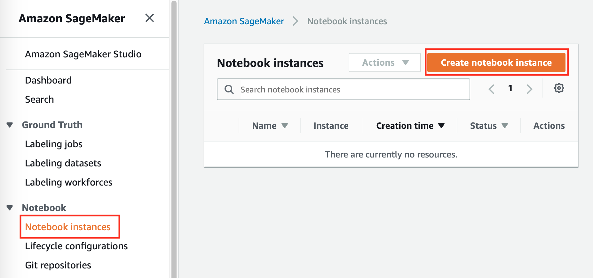
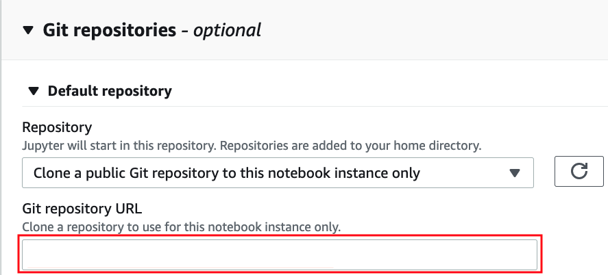
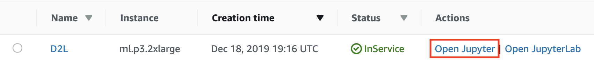
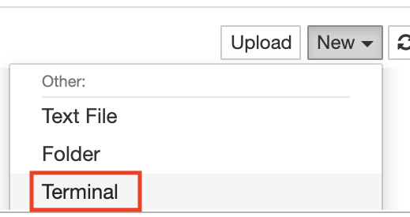

# Amazon SageMaker の使用
:label:`sec_sagemaker`

深層学習アプリケーションは、
ローカルマシンで提供できる範囲を容易に超えてしまうほどの
計算資源を必要とすることがある。
クラウドコンピューティングサービスを使うと、
より強力なコンピュータを利用して、
本書の GPU を多用するコードを
より簡単に実行できる。
この節では、
Amazon SageMaker を使って
本書のコードを実行する方法を紹介する。

## サインアップ

まず、https://aws.amazon.com/ でアカウントを作成する必要がある。
追加のセキュリティのために、
二要素認証の利用が推奨される。
また、
詳細な請求および支出アラートを設定しておくと、
たとえば
インスタンスの停止を忘れた場合などの
思わぬ請求を避けるのに役立つ。
AWS アカウントにログインしたら、
[コンソール](http://console.aws.amazon.com/) を開いて "Amazon SageMaker" を検索し（:numref:`fig_sagemaker` を参照）、
それをクリックして SageMaker パネルを開く。


:width:`300px`
:label:`fig_sagemaker`

## SageMaker インスタンスの作成

次に、 :numref:`fig_sagemaker-create` に示すようにノートブックインスタンスを作成しよう。


:width:`400px`
:label:`fig_sagemaker-create`

SageMaker には、計算性能と価格が異なる複数の[インスタンスタイプ](https://aws.amazon.com/sagemaker/pricing/instance-types/)がある。
ノートブックインスタンスを作成するときには、
その名前とタイプを指定できる。
:numref:`fig_sagemaker-create-2` では、`ml.p3.2xlarge` を選択している。1 基の Tesla V100 GPU と 8 コア CPU を備えており、このインスタンスは本書の大部分に対して十分な性能を持っている。


:width:`400px`
:label:`fig_sagemaker-create-2`

:begin_tab:`mxnet`
SageMaker で実行するための ipynb 形式の本書全体は https://github.com/d2l-ai/d2l-en-sagemaker で利用できる。インスタンス作成時に SageMaker がそれをクローンできるよう、この GitHub リポジトリの URL（:numref:`fig_sagemaker-create-3`）を指定できる。
:end_tab:

:begin_tab:`pytorch`
SageMaker で実行するための ipynb 形式の本書全体は https://github.com/d2l-ai/d2l-pytorch-sagemaker で利用できる。インスタンス作成時に SageMaker がそれをクローンできるよう、この GitHub リポジトリの URL（:numref:`fig_sagemaker-create-3`）を指定できる。
:end_tab:

:begin_tab:`tensorflow`
SageMaker で実行するための ipynb 形式の本書全体は https://github.com/d2l-ai/d2l-tensorflow-sagemaker で利用できる。インスタンス作成時に SageMaker がそれをクローンできるよう、この GitHub リポジトリの URL（:numref:`fig_sagemaker-create-3`）を指定できる。
:end_tab:


:width:`400px`
:label:`fig_sagemaker-create-3`

## インスタンスの起動と停止

インスタンスの作成には
数分かかることがある。
準備ができたら、
その横にある "Open Jupyter" リンクをクリックして（:numref:`fig_sagemaker-open`）、
このインスタンス上で
本書のすべての Jupyter ノートブックを
編集・実行できるようにする
（:numref:`sec_jupyter` の手順と同様です）。


:width:`400px`
:label:`fig_sagemaker-open`


作業を終えたら、
それ以上課金されないように
インスタンスを停止することを忘れないでください（:numref:`fig_sagemaker-stop`）。


:width:`300px`
:label:`fig_sagemaker-stop`

## ノートブックの更新

:begin_tab:`mxnet`
このオープンソース書籍のノートブックは、GitHub の [d2l-ai/d2l-en-sagemaker](https://github.com/d2l-ai/d2l-en-sagemaker) リポジトリで定期的に更新される。
最新版に更新するには、
SageMaker インスタンス上でターミナルを開きます（:numref:`fig_sagemaker-terminal`）。
:end_tab:

:begin_tab:`pytorch`
このオープンソース書籍のノートブックは、GitHub の [d2l-ai/d2l-pytorch-sagemaker](https://github.com/d2l-ai/d2l-pytorch-sagemaker) リポジトリで定期的に更新される。
最新版に更新するには、
SageMaker インスタンス上でターミナルを開きます（:numref:`fig_sagemaker-terminal`）。
:end_tab:


:begin_tab:`tensorflow`
このオープンソース書籍のノートブックは、GitHub の [d2l-ai/d2l-tensorflow-sagemaker](https://github.com/d2l-ai/d2l-tensorflow-sagemaker) リポジトリで定期的に更新される。
最新版に更新するには、
SageMaker インスタンス上でターミナルを開きます（:numref:`fig_sagemaker-terminal`）。
:end_tab:



:width:`300px`
:label:`fig_sagemaker-terminal`

リモートリポジトリから更新を取り込む前に、ローカルの変更をコミットしておくとよいでしょう。 
そうでない場合は、ターミナルで次のコマンドを実行して
ローカルの変更をすべて破棄する。

:begin_tab:`mxnet`

```bash
cd SageMaker/d2l-en-sagemaker/
git reset --hard
git pull
```


:end_tab:

:begin_tab:`pytorch`

```bash
cd SageMaker/d2l-pytorch-sagemaker/
git reset --hard
git pull
```


:end_tab:

:begin_tab:`tensorflow`

```bash
cd SageMaker/d2l-tensorflow-sagemaker/
git reset --hard
git pull
```


:end_tab:

## まとめ

* Amazon SageMaker を使ってノートブックインスタンスを作成し、本書の GPU を多用するコードを実行できる。
* Amazon SageMaker インスタンス上のターミナルを通じてノートブックを更新できる。


## 演習


1. Amazon SageMaker を使って、GPU を必要とする任意の節を編集して実行しなさい。
1. ターミナルを開いて、本書のすべてのノートブックを格納しているローカルディレクトリにアクセスしなさい。
