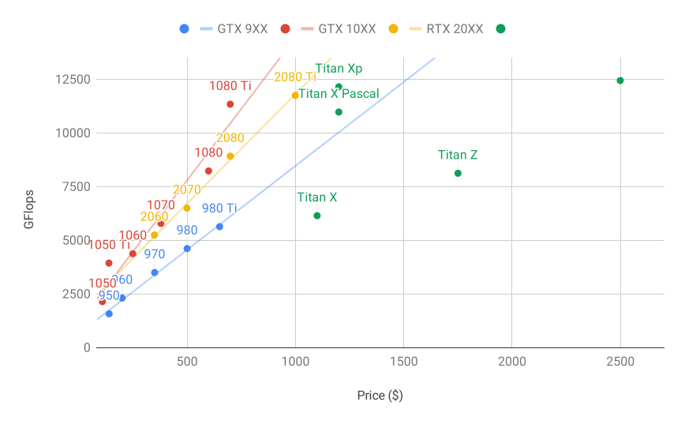
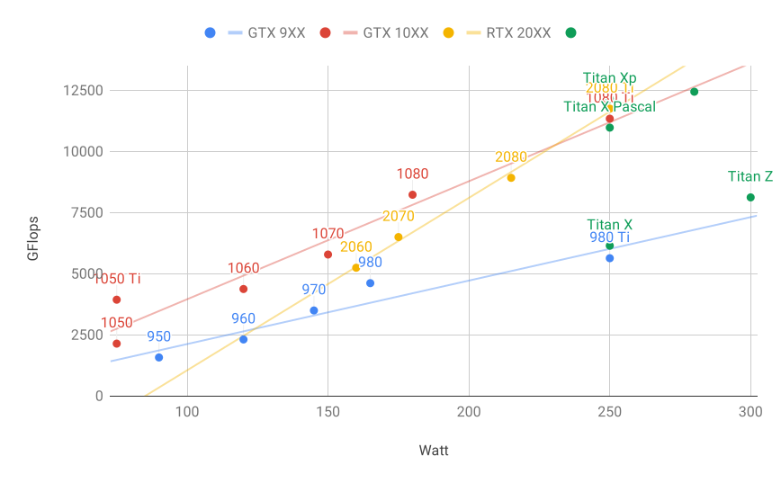

# サーバーとGPUの選択
:label:`sec_buy_gpu`

深層学習の学習には一般に大量の計算が必要である。現時点では、GPUは深層学習にとって最も費用対効果の高いハードウェアアクセラレータである。特に、CPUと比べるとGPUは安価でありながら高性能で、しばしば1桁以上の差がある。さらに、1台のサーバーで複数のGPUを搭載でき、高性能サーバーでは最大8枚まで対応する。より一般的なのは、エンジニア向けワークステーションで最大4枚程度である。というのも、熱、冷却、電力の要件は、オフィスビルで支えられる範囲をすぐに超えてしまうからである。より大規模な展開では、クラウドコンピューティング（たとえば、Amazonの[P3](https://aws.amazon.com/ec2/instance-types/p3/)や[G4](https://aws.amazon.com/blogs/aws/in-the-works-ec2-instances-g4-with-nvidia-t4-gpus/)インスタンス）がはるかに実用的な解決策である。

## サーバーの選択

計算の大部分はGPU上で行われるため、多数のスレッドを持つ高性能CPUを購入する必要は通常ない。とはいえ、Pythonのグローバルインタプリタロック（GIL）のため、4--8枚のGPUを使う状況ではCPUの単一スレッド性能が重要になることがある。その他の条件が同じなら、コア数は少ないがクロック周波数が高いCPUのほうが、より経済的な選択肢だといえる。たとえば、6コア4 GHzのCPUと8コア3.5 GHzのCPUのどちらかを選ぶなら、総合的な速度は低くても前者のほうがはるかに望ましいである。
重要なのは、GPUは多くの電力を消費し、その結果として大量の熱を放出することである。そのため、非常に優れた冷却と、GPUを搭載できる十分に大きな筐体が必要になる。可能であれば、以下の指針に従ってください。

1. **電源**。GPUはかなりの電力を消費する。1台あたり最大350Wを見込んで予算を組んでください（効率的なコードは多くのエネルギーを使う可能性があるため、グラフィックスカードの通常時の消費ではなく、*ピーク需要*を確認してください）。電源が需要に見合っていないと、システムが不安定になる。
1. **筐体サイズ**。GPUは大きく、補助電源コネクタにも追加のスペースが必要になることがよくある。また、大きな筐体のほうが冷却しやすいである。
1. **GPU冷却**。GPUの数が多い場合は、水冷への投資を検討してもよいでしょう。また、ファンの数が少なくても*リファレンスデザイン*を選ぶことを目指する。というのも、薄いため、デバイス間に空気を取り込む余地があるからである。複数ファンのGPUを買うと、複数枚を搭載した際に十分な空気を取り込めないほど厚くなり、熱による性能抑制（サーマルスロットリング）に陥ることがある。
1. **PCIeスロット**。GPUとのデータのやり取り（およびGPU間の交換）には大きな帯域幅が必要である。16レーンのPCIe 3.0スロットを推奨する。複数のGPUを搭載する場合は、マザーボードの説明を注意深く読み、複数GPUを同時に使っても16$\times$の帯域幅が維持されるか、追加スロットでもPCIe 2.0ではなくPCIe 3.0が使えるかを確認する。マザーボードによっては、複数GPUを搭載すると帯域幅が8$\times$、あるいは4$\times$にまで低下する。これは一部には、CPUが提供するPCIeレーン数に起因する。

要するに、深層学習サーバーを構築する際の推奨事項は次のとおりである。

* **初心者**。低消費電力の低価格GPUを購入する（深層学習に適した安価なゲーミングGPUは150--200W程度です）。運が良ければ、現在のコンピュータで対応できるかもしれない。
* **1 GPU**。4コアの低価格CPUで十分であり、ほとんどのマザーボードで問題ない。少なくとも32 GBのDRAMを目指し、ローカルデータアクセス用にSSDへ投資する。600Wの電源で十分でしょう。ファンの多いGPUを購入する。
* **2 GPUs**。4--6コアの低価格CPUで十分である。64 GBのDRAMを目指し、SSDへ投資する。高性能GPUを2枚使うなら、おおむね1000Wが必要になる。マザーボードについては、*2つの*PCIe 3.0 x16スロットがあることを確認する。可能であれば、PCIe 3.0 x16スロットの間に2つの空きスペース（60mmの間隔）があるマザーボードを選び、追加の空気の流れを確保する。この場合、ファンの多いGPUを2枚購入する。
* **4 GPUs**。比較的速い単一スレッド性能（すなわち高いクロック周波数）を持つCPUを購入する。おそらく、AMD Threadripperのような、より多くのPCIeレーンを持つCPUが必要になる。4つのPCIe 3.0 x16スロットを得るには、PLXでPCIeレーンを多重化する必要があるため、比較的高価なマザーボードが必要になるでしょう。細くてGPU間に空気を通せるリファレンスデザインのGPUを購入する。1600--2000Wの電源が必要で、オフィスのコンセントでは対応できないかもしれない。このサーバーはおそらく*うるさくて熱い*状態で動作する。机の下に置きたくはないでしょう。128 GBのDRAMを推奨する。ローカルストレージ用にSSD（1--2 TB NVMe）を用意し、データ保存用にRAID構成のハードディスクを複数台用意する。
* **8 GPUs**。複数の冗長電源を備えた専用のマルチGPUサーバー筐体（たとえば、電源1台あたり1600Wで2+1構成）を購入する必要がある。これにはデュアルソケットのサーバーCPU、256 GBのECC DRAM、高速ネットワークカード（10 GBE推奨）が必要であり、サーバーがGPUの*物理的なフォームファクタ*に対応しているか確認しなければならない。コンシューマ向けGPUとサーバー向けGPUでは、空気の流れや配線の配置が大きく異なる（たとえば、RTX 2080とTesla V100）。そのため、電源ケーブルのための十分なクリアランスがない、あるいは適切な配線ハーネスがないために、コンシューマ向けGPUをサーバーに搭載できないことがある（このことは、共同著者の1人が痛い目に遭って学びました）。

## GPUの選択

現時点では、AMDとNVIDIAが専用GPUの2大メーカーである。NVIDIAは深層学習分野に最初に参入し、CUDAを通じて深層学習フレームワークへのより良いサポートを提供している。そのため、購入者の多くはNVIDIA GPUを選ぶ。

NVIDIAは、個人ユーザー向け（たとえばGTXおよびRTXシリーズ）と企業ユーザー向け（Teslaシリーズ）の2種類のGPUを提供している。これら2種類のGPUは、計算性能としては同程度である。しかし、企業向けGPUは一般に（受動）強制冷却を用い、より多くのメモリとECC（誤り訂正）メモリを備えている。これらのGPUはデータセンターにより適しており、通常はコンシューマ向けGPUの10倍の価格である。

100台以上のサーバーを持つ大企業であれば、NVIDIA Teslaシリーズを検討するか、あるいはクラウド上のGPUサーバーを利用するのがよいでしょう。10台以上のサーバーを持つ研究室や中小企業であれば、NVIDIA RTXシリーズが最も費用対効果が高い可能性が高いである。SupermicroやAsusの筐体を使った、4--8枚のGPUを効率よく搭載できる事前構成済みサーバーを購入できる。

GPUベンダーは通常、1〜2年ごとに新世代をリリースする。たとえば、2017年にリリースされたGTX 1000（Pascal）シリーズや、2019年のRTX 2000（Turing）シリーズである。各シリーズには、異なる性能レベルを提供する複数のモデルがある。GPU性能は主に次の3つのパラメータの組み合わせである。

1. **計算性能**。一般には32ビット浮動小数点の計算性能を見る。16ビット浮動小数点学習（FP16）も主流になりつつある。予測だけに興味があるなら、8ビット整数も使える。最新世代のTuring GPUは4ビットの高速化も提供する。残念ながら、本書執筆時点では、低精度ネットワークを学習するためのアルゴリズムはまだ広く普及していない。
1. **メモリ容量**。モデルが大きくなったり、学習時のバッチが大きくなったりすると、より多くのGPUメモリが必要になる。HBM2（High Bandwidth Memory）とGDDR6（Graphics DDR）のどちらかを確認する。HBM2のほうが高速であるが、はるかに高価である。
1. **メモリ帯域幅**。十分なメモリ帯域幅があって初めて、計算性能を最大限に引き出せる。GDDR6を使う場合は、幅広いメモリバスを確認する。

ほとんどのユーザーにとっては、計算性能を見るだけで十分である。多くのGPUが異なる種類の高速化を提供していることに注意する。たとえば、NVIDIAのTensorCoreは一部の演算子を5$\times$高速化する。ライブラリがこれをサポートしていることを確認する。GPUメモリは少なくとも4 GB必要であり（8 GBならはるかに良いです）、GUIの表示にもGPUを使わないようにしてください（代わりに内蔵グラフィックスを使います）。それが避けられない場合は、安全のためにRAMをさらに2 GB追加する。

:numref:`fig_flopsvsprice` は、さまざまなGTX 900、GTX 1000、RTX 2000シリーズのモデルについて、32ビット浮動小数点の計算性能と価格を比較したものである。示されている価格は、本書執筆時点でWikipediaに掲載されていたものである。

:label:`fig_flopsvsprice`

ここから、いくつかのことがわかる。

1. 各シリーズ内では、価格と性能はおおむね比例する。Titanモデルは、より大容量のGPUメモリの恩恵のためにかなり高価である。しかし、980 Tiと1080 Tiを比較するとわかるように、新しいモデルのほうが費用対効果は高くなっている。RTX 2000シリーズでは、価格の改善はあまり見られない。ただし、これは低精度性能（FP16、INT8、INT4）がはるかに優れているためである。
2. GTX 1000シリーズの性能対コスト比は、900シリーズのおよそ2倍である。
3. RTX 2000シリーズでは、性能（GFLOPs）は価格の*アフィン*関数である。

:label:`fig_wattvsprice`

:numref:`fig_wattvsprice` は、消費電力が計算量にほぼ線形に比例して増えることを示している。第二に、後の世代ほど効率が高くなっている。これはRTX 2000シリーズに対応するグラフと矛盾しているように見える。しかし、これはTensorCoreが不釣り合いに多くの電力を消費することによるものである。

## まとめ

* サーバーを構築するときは、電源、PCIeバスレーン、CPUの単一スレッド速度、冷却に注意する。
* 可能であれば、最新世代のGPUを購入すべきである。
* 大規模展開ではクラウドを使ってください。
* 高密度サーバーはすべてのGPUと互換とは限らない。購入前に機械的仕様と冷却仕様を確認する。
* 高効率のためにはFP16またはそれ以下の精度を使ってください。
