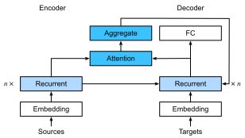

{.python .input}
%load_ext d2lbook.tab
tab.interact_select('mxnet', 'pytorch', 'tensorflow', 'jax')
```

# バーダナウ注意機構
:label:`sec_seq2seq_attention`

:numref:`sec_seq2seq` で機械翻訳に出会ったとき、私たちは 2 つの RNN に基づく系列変換学習のためのエンコーダ--デコーダアーキテクチャを設計した :cite:`Sutskever.Vinyals.Le.2014`。
具体的には、RNN エンコーダは可変長の系列を *固定形状* のコンテキスト変数へ変換する。
その後、RNN デコーダは生成されたトークンとコンテキスト変数に基づいて、出力（ターゲット）系列をトークンごとに生成する。

:numref:`fig_seq2seq_details` を思い出してほしい。ここではそれを少し詳しくしたものを (:numref:`fig_s2s_attention_state`) として再掲する。従来の RNN では、ソース系列に関するすべての関連情報は、エンコーダによって内部の *固定次元* の状態表現へと変換される。デコーダは、この状態そのものを、翻訳系列を生成するための完全かつ唯一の情報源として用いる。言い換えると、系列変換機構は中間状態を、入力として与えられたどのような文字列に対しても十分統計量として扱う。


:label:`fig_s2s_attention_state`

これは短い系列に対してはかなり妥当だが、本や章、あるいは非常に長い文のような長い系列に対しては明らかに不可能である。結局のところ、あまり長くはないうちに、中間表現の中にソース系列の重要な情報をすべて格納するための「空間」が足りなくなる。したがって、デコーダは長く複雑な文を翻訳できなくなる。この問題に最初に直面した一人が :citet:`Graves.2013` であり、彼は手書き文字を生成する RNN を設計しようとした。ソーステキストは任意の長さを取りうるため、彼らは微分可能な注意モデルを設計し、テキスト文字と、はるかに長いペン軌跡とを整列させた。この整列は一方向にのみ進む。これはさらに、音声認識におけるデコードアルゴリズム、たとえば隠れマルコフモデル :cite:`rabiner1993fundamentals` にも着想を得ている。

整列を学習するというアイデアに触発されて、:citet:`Bahdanau.Cho.Bengio.2014` は、一方向の整列制約 *なし* の微分可能な注意モデルを提案した。
トークンを予測するとき、入力トークンのすべてが関連するとは限らないなら、モデルは現在の予測に関連すると見なされる入力系列の一部にだけ整列（あるいは注意）する。これを用いて、次のトークンを生成する前に現在の状態を更新する。説明だけを見るとさほど目立たないが、この *バーダナウ注意機構* は、深層学習における過去10年で最も影響力のあるアイデアの一つになったと言ってよく、Transformer :cite:`Vaswani.Shazeer.Parmar.ea.2017` や多くの関連する新しいアーキテクチャを生み出した。

```{.python .input}
%%tab mxnet
from d2l import mxnet as d2l
from mxnet import init, np, npx
from mxnet.gluon import rnn, nn
npx.set_np()
```

```{.python .input}
%%tab pytorch
from d2l import torch as d2l
import torch
from torch import nn
```

```{.python .input}
%%tab tensorflow
from d2l import tensorflow as d2l
import tensorflow as tf
```

```{.python .input}
%%tab jax
from d2l import jax as d2l
from flax import linen as nn
from jax import numpy as jnp
import jax
```

## モデル

:numref:`sec_seq2seq` の系列変換アーキテクチャ、特に :eqref:`eq_seq2seq_s_t` で導入した記法に従う。
重要な考え方は、状態、すなわちソース文を要約するコンテキスト変数 $\mathbf{c}$ を固定したままにするのではなく、元のテキスト（エンコーダの隠れ状態 $\mathbf{h}_{t}$）と、すでに生成されたテキスト（デコーダの隠れ状態 $\mathbf{s}_{t'-1}$）の両方の関数として動的に更新することである。これにより $\mathbf{c}_{t'}$ が得られ、これは任意のデコード時刻 $t'$ の後に更新される。入力系列の長さが $T$ だとしよう。この場合、コンテキスト変数は注意プーリングの出力である：

$$\mathbf{c}_{t'} = \sum_{t=1}^{T} \alpha(\mathbf{s}_{t' - 1}, \mathbf{h}_{t}) \mathbf{h}_{t}.$$

ここでは $\mathbf{s}_{t' - 1}$ をクエリとして用い、
$\mathbf{h}_{t}$ をキーと値の両方として用いた。$\mathbf{c}_{t'}$ は、その後、状態 $\mathbf{s}_{t'}$ を生成し、新しいトークンを生成するために使われることに注意してほしい。:eqref:`eq_seq2seq_s_t` を参照。特に、注意重み $\alpha$ は :eqref:`eq_attn-scoring-alpha` に従って、:eqref:`eq_additive-attn` で定義された加法的注意スコア関数を用いて計算される。
この注意を用いた RNN エンコーダ--デコーダアーキテクチャは :numref:`fig_s2s_attention_details` に示されている。なお、後にこのモデルは、すでに生成されたトークンをデコーダ内でさらなるコンテキストとして含めるように修正された（すなわち、注意の和は $T$ で止まらず、$t'-1$ まで進む）。たとえば、この戦略を音声認識に適用した説明として :citet:`chan2015listen` を参照されたい。


:label:`fig_s2s_attention_details`

## 注意付きデコーダの定義

注意付き RNN エンコーダ--デコーダを実装するには、
デコーダを再定義するだけでよい（注意関数から生成済み記号を省くと設計が簡単になる）。まず、`AttentionDecoder` クラスを定義して、[**注意付きデコーダの基本インターフェース**] を定めよう。名前からして驚くほどではないが、`AttentionDecoder` クラスである。

```{.python .input}
%%tab pytorch, mxnet, tensorflow
class AttentionDecoder(d2l.Decoder):  #@save
    """The base attention-based decoder interface."""
    def __init__(self):
        super().__init__()

    @property
    def attention_weights(self):
        raise NotImplementedError
```

`Seq2SeqAttentionDecoder` クラスで [**RNN デコーダを実装する**] 必要がある。
デコーダの状態は次の要素で初期化される。
(i) 注意のキーと値として使われる、すべての時刻におけるエンコーダ最終層の隠れ状態；
(ii) デコーダの隠れ状態を初期化するために使われる、最終時刻におけるエンコーダの全層の隠れ状態；
(iii) 注意プーリングでパディングトークンを除外するための、エンコーダの有効長。
各デコード時刻では、前の時刻で得られたデコーダ最終層の隠れ状態が、注意機構のクエリとして使われる。
注意機構の出力と入力埋め込みの両方を連結し、RNN デコーダの入力とする。

```{.python .input}
%%tab mxnet
class Seq2SeqAttentionDecoder(AttentionDecoder):
    def __init__(self, vocab_size, embed_size, num_hiddens, num_layers,
                 dropout=0):
        super().__init__()
        self.attention = d2l.AdditiveAttention(num_hiddens, dropout)
        self.embedding = nn.Embedding(vocab_size, embed_size)
        self.rnn = rnn.GRU(num_hiddens, num_layers, dropout=dropout)
        self.dense = nn.Dense(vocab_size, flatten=False)
        self.initialize(init.Xavier())

    def init_state(self, enc_outputs, enc_valid_lens):
        # Shape of outputs: (num_steps, batch_size, num_hiddens).
        # Shape of hidden_state: (num_layers, batch_size, num_hiddens)
        outputs, hidden_state = enc_outputs
        return (outputs.swapaxes(0, 1), hidden_state, enc_valid_lens)

    def forward(self, X, state):
        # Shape of enc_outputs: (batch_size, num_steps, num_hiddens).
        # Shape of hidden_state: (num_layers, batch_size, num_hiddens)
        enc_outputs, hidden_state, enc_valid_lens = state
        # Shape of the output X: (num_steps, batch_size, embed_size)
        X = self.embedding(X).swapaxes(0, 1)
        outputs, self._attention_weights = [], []
        for x in X:
            # Shape of query: (batch_size, 1, num_hiddens)
            query = np.expand_dims(hidden_state[-1], axis=1)
            # Shape of context: (batch_size, 1, num_hiddens)
            context = self.attention(
                query, enc_outputs, enc_outputs, enc_valid_lens)
            # Concatenate on the feature dimension
            x = np.concatenate((context, np.expand_dims(x, axis=1)), axis=-1)
            # Reshape x as (1, batch_size, embed_size + num_hiddens)
            out, hidden_state = self.rnn(x.swapaxes(0, 1), hidden_state)
            hidden_state = hidden_state[0]
            outputs.append(out)
            self._attention_weights.append(self.attention.attention_weights)
        # After fully connected layer transformation, shape of outputs:
        # (num_steps, batch_size, vocab_size)
        outputs = self.dense(np.concatenate(outputs, axis=0))
        return outputs.swapaxes(0, 1), [enc_outputs, hidden_state,
                                        enc_valid_lens]

    @property
    def attention_weights(self):
        return self._attention_weights
```

```{.python .input}
%%tab pytorch
class Seq2SeqAttentionDecoder(AttentionDecoder):
    def __init__(self, vocab_size, embed_size, num_hiddens, num_layers,
                 dropout=0):
        super().__init__()
        self.attention = d2l.AdditiveAttention(num_hiddens, dropout)
        self.embedding = nn.Embedding(vocab_size, embed_size)
        self.rnn = nn.GRU(
            embed_size + num_hiddens, num_hiddens, num_layers,
            dropout=dropout)
        self.dense = nn.LazyLinear(vocab_size)
        self.apply(d2l.init_seq2seq)

    def init_state(self, enc_outputs, enc_valid_lens):
        # Shape of outputs: (num_steps, batch_size, num_hiddens).
        # Shape of hidden_state: (num_layers, batch_size, num_hiddens)
        outputs, hidden_state = enc_outputs
        return (outputs.permute(1, 0, 2), hidden_state, enc_valid_lens)

    def forward(self, X, state):
        # Shape of enc_outputs: (batch_size, num_steps, num_hiddens).
        # Shape of hidden_state: (num_layers, batch_size, num_hiddens)
        enc_outputs, hidden_state, enc_valid_lens = state
        # Shape of the output X: (num_steps, batch_size, embed_size)
        X = self.embedding(X).permute(1, 0, 2)
        outputs, self._attention_weights = [], []
        for x in X:
            # Shape of query: (batch_size, 1, num_hiddens)
            query = torch.unsqueeze(hidden_state[-1], dim=1)
            # Shape of context: (batch_size, 1, num_hiddens)
            context = self.attention(
                query, enc_outputs, enc_outputs, enc_valid_lens)
            # Concatenate on the feature dimension
            x = torch.cat((context, torch.unsqueeze(x, dim=1)), dim=-1)
            # Reshape x as (1, batch_size, embed_size + num_hiddens)
            out, hidden_state = self.rnn(x.permute(1, 0, 2), hidden_state)
            outputs.append(out)
            self._attention_weights.append(self.attention.attention_weights)
        # After fully connected layer transformation, shape of outputs:
        # (num_steps, batch_size, vocab_size)
        outputs = self.dense(torch.cat(outputs, dim=0))
        return outputs.permute(1, 0, 2), [enc_outputs, hidden_state,
                                          enc_valid_lens]

    @property
    def attention_weights(self):
        return self._attention_weights
```

```{.python .input}
%%tab tensorflow
class Seq2SeqAttentionDecoder(AttentionDecoder):
    def __init__(self, vocab_size, embed_size, num_hiddens, num_layers,
                 dropout=0):
        super().__init__()
        self.attention = d2l.AdditiveAttention(num_hiddens, num_hiddens,
                                               num_hiddens, dropout)
        self.embedding = tf.keras.layers.Embedding(vocab_size, embed_size)
        self.rnn = tf.keras.layers.RNN(tf.keras.layers.StackedRNNCells(
            [tf.keras.layers.GRUCell(num_hiddens, dropout=dropout)
             for _ in range(num_layers)]), return_sequences=True,
                                       return_state=True)
        self.dense = tf.keras.layers.Dense(vocab_size)

    def init_state(self, enc_outputs, enc_valid_lens):
        # Shape of outputs: (batch_size, num_steps, num_hiddens)
        # Length of list hidden_state is num_layers, where the shape of its
        # element is (batch_size, num_hiddens)
        outputs, hidden_state = enc_outputs
        return (tf.transpose(outputs, (1, 0, 2)), hidden_state,
                enc_valid_lens)

    def call(self, X, state, **kwargs):
        # Shape of output enc_outputs: # (batch_size, num_steps, num_hiddens)
        # Length of list hidden_state is num_layers, where the shape of its
        # element is (batch_size, num_hiddens)
        enc_outputs, hidden_state, enc_valid_lens = state
        # Shape of the output X: (num_steps, batch_size, embed_size)
        X = self.embedding(X)  # Input X has shape: (batch_size, num_steps)
        X = tf.transpose(X, perm=(1, 0, 2))
        outputs, self._attention_weights = [], []
        for x in X:
            # Shape of query: (batch_size, 1, num_hiddens)
            query = tf.expand_dims(hidden_state[-1], axis=1)
            # Shape of context: (batch_size, 1, num_hiddens)
            context = self.attention(query, enc_outputs, enc_outputs,
                                     enc_valid_lens, **kwargs)
            # Concatenate on the feature dimension
            x = tf.concat((context, tf.expand_dims(x, axis=1)), axis=-1)
            out = self.rnn(x, hidden_state, **kwargs)
            hidden_state = out[1:]
            outputs.append(out[0])
            self._attention_weights.append(self.attention.attention_weights)
        # After fully connected layer transformation, shape of outputs:
        # (batch_size, num_steps, vocab_size)
        outputs = self.dense(tf.concat(outputs, axis=1))
        return outputs, [enc_outputs, hidden_state, enc_valid_lens]

    @property
    def attention_weights(self):
        return self._attention_weights
```

```{.python .input}
%%tab jax
class Seq2SeqAttentionDecoder(nn.Module):
    vocab_size: int
    embed_size: int
    num_hiddens: int
    num_layers: int
    dropout: float = 0

    def setup(self):
        self.attention = d2l.AdditiveAttention(self.num_hiddens, self.dropout)
        self.embedding = nn.Embed(self.vocab_size, self.embed_size)
        self.dense = nn.Dense(self.vocab_size)
        self.rnn = d2l.GRU(num_hiddens, num_layers, dropout=self.dropout)

    def init_state(self, enc_outputs, enc_valid_lens, *args):
        # Shape of outputs: (num_steps, batch_size, num_hiddens).
        # Shape of hidden_state: (num_layers, batch_size, num_hiddens)
        outputs, hidden_state = enc_outputs
        # Attention Weights are returned as part of state; init with None
        return (outputs.transpose(1, 0, 2), hidden_state, enc_valid_lens)

    @nn.compact
    def __call__(self, X, state, training=False):
        # Shape of enc_outputs: (batch_size, num_steps, num_hiddens).
        # Shape of hidden_state: (num_layers, batch_size, num_hiddens)
        # Ignore Attention value in state
        enc_outputs, hidden_state, enc_valid_lens = state
        # Shape of the output X: (num_steps, batch_size, embed_size)
        X = self.embedding(X).transpose(1, 0, 2)
        outputs, attention_weights = [], []
        for x in X:
            # Shape of query: (batch_size, 1, num_hiddens)
            query = jnp.expand_dims(hidden_state[-1], axis=1)
            # Shape of context: (batch_size, 1, num_hiddens)
            context, attention_w = self.attention(query, enc_outputs,
                                                  enc_outputs, enc_valid_lens,
                                                  training=training)
            # Concatenate on the feature dimension
            x = jnp.concatenate((context, jnp.expand_dims(x, axis=1)), axis=-1)
            # Reshape x as (1, batch_size, embed_size + num_hiddens)
            out, hidden_state = self.rnn(x.transpose(1, 0, 2), hidden_state,
                                         training=training)
            outputs.append(out)
            attention_weights.append(attention_w)

        # Flax sow API is used to capture intermediate variables
        self.sow('intermediates', 'dec_attention_weights', attention_weights)

        # After fully connected layer transformation, shape of outputs:
        # (num_steps, batch_size, vocab_size)
        outputs = self.dense(jnp.concatenate(outputs, axis=0))
        return outputs.transpose(1, 0, 2), [enc_outputs, hidden_state,
                                            enc_valid_lens]
```

以下では、長さ7の時系列をそれぞれ持つ4つの系列からなるミニバッチを用いて、[**実装した注意付きデコーダをテストする**]。

```{.python .input}
%%tab all
vocab_size, embed_size, num_hiddens, num_layers = 10, 8, 16, 2
batch_size, num_steps = 4, 7
encoder = d2l.Seq2SeqEncoder(vocab_size, embed_size, num_hiddens, num_layers)
decoder = Seq2SeqAttentionDecoder(vocab_size, embed_size, num_hiddens,
                                  num_layers)
if tab.selected('mxnet'):
    X = d2l.zeros((batch_size, num_steps))
    state = decoder.init_state(encoder(X), None)
    output, state = decoder(X, state)
if tab.selected('pytorch'):
    X = d2l.zeros((batch_size, num_steps), dtype=torch.long)
    state = decoder.init_state(encoder(X), None)
    output, state = decoder(X, state)
if tab.selected('tensorflow'):
    X = tf.zeros((batch_size, num_steps))
    state = decoder.init_state(encoder(X, training=False), None)
    output, state = decoder(X, state, training=False)
if tab.selected('jax'):
    X = jnp.zeros((batch_size, num_steps), dtype=jnp.int32)
    state = decoder.init_state(encoder.init_with_output(d2l.get_key(),
                                                        X, training=False)[0],
                               None)
    (output, state), _ = decoder.init_with_output(d2l.get_key(), X,
                                                  state, training=False)
d2l.check_shape(output, (batch_size, num_steps, vocab_size))
d2l.check_shape(state[0], (batch_size, num_steps, num_hiddens))
d2l.check_shape(state[1][0], (batch_size, num_hiddens))
```

## [**学習**]

新しいデコーダを定義したので、:numref:`sec_seq2seq_training` と同様に進められる。
すなわち、ハイパーパラメータを指定し、通常のエンコーダと注意付きデコーダをインスタンス化し、このモデルを機械翻訳のために学習する。

```{.python .input}
%%tab all
data = d2l.MTFraEng(batch_size=128)
embed_size, num_hiddens, num_layers, dropout = 256, 256, 2, 0.2
if tab.selected('mxnet', 'pytorch', 'jax'):
    encoder = d2l.Seq2SeqEncoder(
        len(data.src_vocab), embed_size, num_hiddens, num_layers, dropout)
    decoder = Seq2SeqAttentionDecoder(
        len(data.tgt_vocab), embed_size, num_hiddens, num_layers, dropout)
if tab.selected('mxnet', 'pytorch'):
    model = d2l.Seq2Seq(encoder, decoder, tgt_pad=data.tgt_vocab['<pad>'],
                        lr=0.005)
if tab.selected('jax'):
    model = d2l.Seq2Seq(encoder, decoder, tgt_pad=data.tgt_vocab['<pad>'],
                        lr=0.005, training=True)
if tab.selected('mxnet', 'pytorch', 'jax'):
    trainer = d2l.Trainer(max_epochs=30, gradient_clip_val=1, num_gpus=1)
if tab.selected('tensorflow'):
    with d2l.try_gpu():
        encoder = d2l.Seq2SeqEncoder(
            len(data.src_vocab), embed_size, num_hiddens, num_layers, dropout)
        decoder = Seq2SeqAttentionDecoder(
            len(data.tgt_vocab), embed_size, num_hiddens, num_layers, dropout)
        model = d2l.Seq2Seq(encoder, decoder, tgt_pad=data.tgt_vocab['<pad>'],
                            lr=0.005)
    trainer = d2l.Trainer(max_epochs=30, gradient_clip_val=1)
trainer.fit(model, data)
```

モデルを学習した後、
それを用いて [**いくつかの英語文をフランス語に翻訳**] し、
それらの BLEU スコアを計算する。

```{.python .input}
%%tab all
engs = ['go .', 'i lost .', 'he\'s calm .', 'i\'m home .']
fras = ['va !', 'j\'ai perdu .', 'il est calme .', 'je suis chez moi .']
if tab.selected('pytorch', 'mxnet', 'tensorflow'):
    preds, _ = model.predict_step(
        data.build(engs, fras), d2l.try_gpu(), data.num_steps)
if tab.selected('jax'):
    preds, _ = model.predict_step(
        trainer.state.params, data.build(engs, fras), data.num_steps)
for en, fr, p in zip(engs, fras, preds):
    translation = []
    for token in data.tgt_vocab.to_tokens(p):
        if token == '<eos>':
            break
        translation.append(token)
    print(f'{en} => {translation}, bleu,'
          f'{d2l.bleu(" ".join(translation), fr, k=2):.3f}')
```

最後の英語文を翻訳するときの [**注意重みを可視化**] してみよう。
各クエリがキー--値のペアに対して非一様な重みを割り当てていることがわかる。
これは、各デコードステップで入力系列の異なる部分が注意プーリングで選択的に集約されていることを示している。

```{.python .input}
%%tab all
if tab.selected('pytorch', 'mxnet', 'tensorflow'):
    _, dec_attention_weights = model.predict_step(
        data.build([engs[-1]], [fras[-1]]), d2l.try_gpu(), data.num_steps, True)
if tab.selected('jax'):
    _, (dec_attention_weights, _) = model.predict_step(
        trainer.state.params, data.build([engs[-1]], [fras[-1]]),
        data.num_steps, True)
attention_weights = d2l.concat(
    [step[0][0][0] for step in dec_attention_weights], 0)
attention_weights = d2l.reshape(attention_weights, (1, 1, -1, data.num_steps))
```

```{.python .input}
%%tab mxnet
# Plus one to include the end-of-sequence token
d2l.show_heatmaps(
    attention_weights[:, :, :, :len(engs[-1].split()) + 1],
    xlabel='Key positions', ylabel='Query positions')
```

```{.python .input}
%%tab pytorch
# Plus one to include the end-of-sequence token
d2l.show_heatmaps(
    attention_weights[:, :, :, :len(engs[-1].split()) + 1].cpu(),
    xlabel='Key positions', ylabel='Query positions')
```

```{.python .input}
%%tab tensorflow
# Plus one to include the end-of-sequence token
d2l.show_heatmaps(attention_weights[:, :, :, :len(engs[-1].split()) + 1],
                  xlabel='Key positions', ylabel='Query positions')
```

```{.python .input}
%%tab jax
# Plus one to include the end-of-sequence token
d2l.show_heatmaps(attention_weights[:, :, :, :len(engs[-1].split()) + 1],
                  xlabel='Key positions', ylabel='Query positions')
```

## まとめ

トークンを予測するとき、入力トークンのすべてが関連するとは限らない場合、バーダナウ注意機構を備えた RNN エンコーダ--デコーダは入力系列の異なる部分を選択的に集約する。これは、状態（コンテキスト変数）を加法的注意プーリングの出力として扱うことで実現される。
RNN エンコーダ--デコーダでは、バーダナウ注意機構は前時刻のデコーダ隠れ状態をクエリとして扱い、すべての時刻におけるエンコーダ隠れ状態をキーと値の両方として扱う。


## 演習

1. 実験で GRU を LSTM に置き換えよ。
1. 実験を修正して、加法的注意スコア関数をスケールド・ドット積に置き換えよ。学習効率にどのような影響があるか。

:begin_tab:`mxnet`
[Discussions](https://discuss.d2l.ai/t/347)
:end_tab:

:begin_tab:`pytorch`
[Discussions](https://discuss.d2l.ai/t/1065)
:end_tab:

:begin_tab:`tensorflow`
[Discussions](https://discuss.d2l.ai/t/3868)
:end_tab:

:begin_tab:`jax`
[Discussions](https://discuss.d2l.ai/t/18028)
:end_tab:\n