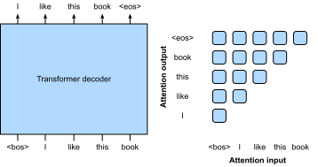
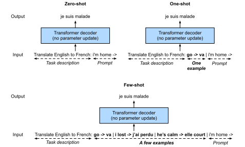

# Transformerによる大規模事前学習
:label:`sec_large-pretraining-transformers`

これまでの画像分類と機械翻訳の実験では、
モデルは入力--出力の例を含むデータセットで
特定のタスクを実行するために *ゼロから* 学習されてきました。
たとえば、Transformer は英語--フランス語の対で学習されました
(:numref:`sec_transformer`)。
これにより、このモデルは入力された英語テキストをフランス語に翻訳できます。
その結果、各モデルはデータ分布のわずかな変化にも敏感な
*特化型の専門家* になります
(:numref:`sec_environment-and-distribution-shift`)。
より汎化性能の高いモデル、あるいは適応の有無にかかわらず複数のタスクを実行できる
より有能な *汎用モデル* を得るために、
大規模データでモデルを *事前学習* することがますます一般的になっています。

事前学習のためのデータが大きくなると、Transformer アーキテクチャは
モデルサイズと学習計算量を増やすことでより良い性能を示し、
優れた *スケーリング* 挙動を示します。
具体的には、Transformer ベースの言語モデルの性能は、
モデルパラメータ数、学習トークン数、学習計算量に対してべき乗則でスケールします :cite:`kaplan2020scaling`。
Transformer のスケーラビリティは、
より大きなデータで学習されたより大規模な Vision Transformer による
大幅な性能向上からも裏付けられています
(:numref:`sec_vision-transformer` で議論)。
より最近の成功例には Gato があり、これは Atari をプレイし、画像にキャプションを付け、会話し、ロボットとして行動できる *汎用* モデルです :cite:`reed2022generalist`。Gato は、テキスト、画像、関節トルク、ボタン押下など多様なモダリティで事前学習されたときにうまくスケールする単一の Transformer です。
特筆すべきことに、このようなマルチモーダルデータはすべて、平坦なトークン列として直列化され、
Transformer によってテキストトークン (:numref:`sec_transformer`) や画像パッチ (:numref:`sec_vision-transformer`) と同様に処理できます。

マルチモーダルデータに対する Transformer 事前学習の説得力ある成功に先立って、
Transformer は大量のテキストで広く事前学習されていました。
もともと機械翻訳のために提案された Transformer アーキテクチャは、
:numref:`fig_transformer` に示すように、
入力系列を表現するためのエンコーダと、
ターゲット系列を生成するためのデコーダから構成されます。
主に、Transformer は 3 つの異なるモードで使用できます:
*エンコーダのみ*、*エンコーダ--デコーダ*、および *デコーダのみ* です。
この章の最後に、これら 3 つのモードを概観し、
Transformer の事前学習におけるスケーラビリティを説明します。

## エンコーダのみ

Transformer エンコーダのみを使用する場合、
入力トークン列は同じ数の表現に変換され、
それらはさらに出力（たとえば分類）へ射影できます。
Transformer エンコーダは自己注意層から構成され、
すべての入力トークンが互いに注意を向けます。
たとえば、 :numref:`fig_vit` に示した Vision Transformer はエンコーダのみであり、
入力画像パッチの列を特別な “&lt;cls&gt;” トークンの表現へ変換します。
この表現はすべての入力トークンに依存するため、
さらに分類ラベルへ射影されます。
この設計は、テキストで事前学習された先行のエンコーダのみ Transformer、
BERT (Bidirectional Encoder Representations from Transformers) :cite:`Devlin.Chang.Lee.ea.2018`
に着想を得ています。

### BERT の事前学習

:label:`fig_bert-encoder-only`

BERT は *マスク付き言語モデリング* を用いてテキスト系列で事前学習されます:
ランダムにマスクされたトークンを含む入力テキストを
Transformer エンコーダに与え、マスクされたトークンを予測します。
:numref:`fig_bert-encoder-only` に示すように、
元のテキスト系列 "I", "love", "this", "red", "car" の先頭に “&lt;cls&gt;” トークンを付加し、
“&lt;mask&gt;” トークンが "love" をランダムに置き換えます。
その後、マスクされたトークン "love" とその予測との間のクロスエントロピー損失を、
事前学習中に最小化します。
Transformer エンコーダの注意パターン
(:numref:`fig_bert-encoder-only` の右側) には制約がないため、
すべてのトークンが互いに注意を向けられることに注意してください。
したがって、"love" の予測は系列中の前後の入力トークンに依存します。
これが BERT が「双方向エンコーダ」である理由です。
手作業のラベル付けを必要とせず、書籍や Wikipedia から得られる大規模テキストデータを
BERT の事前学習に利用できます。

### BERT のファインチューニング

事前学習済み BERT は、単一テキストまたはテキスト対を含む下流のエンコーディングタスクに対して *ファインチューニング* できます。ファインチューニング中には、ランダムに初期化された追加層を BERT に加えることができ、これらのパラメータと事前学習済み BERT のパラメータの両方が、下流タスクの学習データに適合するように *更新* されます。

:label:`fig_bert-finetune-classification`

:numref:`fig_bert-finetune-classification` は、
感情分析のための BERT のファインチューニングを示しています。
Transformer エンコーダは事前学習済み BERT であり、
テキスト系列を入力として受け取り、
“&lt;cls&gt;” 表現
（入力全体のグローバル表現）
を追加の全結合層に入力して
感情を予測します。
ファインチューニング中は、感情分析データにおける
予測とラベルの間のクロスエントロピー損失を、
勾配ベースのアルゴリズムで最小化します。
このとき、追加層はゼロから学習され、
BERT の事前学習済みパラメータは更新されます。
BERT は感情分析だけにとどまりません。
3.5 億パラメータの BERT が
2500 億トークンの学習トークンから学んだ
汎用的な言語表現は、
単一テキスト分類、テキスト対分類または回帰、
テキストタグ付け、質問応答などの自然言語タスクにおいて
最先端性能を押し上げました。

これらの下流タスクにはテキスト対理解が含まれることに気づくかもしれません。
BERT の事前学習には、ある文が別の文に直後に続くかどうかを予測する
別の損失があります。
しかし、この損失は、同じサイズの BERT 変種を 2 兆トークンで事前学習した RoBERTa においては、
後にあまり有用ではないことが分かりました :cite:`Liu.Ott.Goyal.ea.2019`。
BERT の他の派生モデルは、モデルアーキテクチャや事前学習目的を改善しました。
たとえば、ALBERT（パラメータ共有を強制） :cite:`lan2019albert`、
SpanBERT（テキストのスパンを表現・予測） :cite:`joshi2020spanbert`、
DistilBERT（知識蒸留による軽量化） :cite:`sanh2019distilbert`、
ELECTRA（置換トークン検出） :cite:`clark2019electra` などです。
さらに、BERT はコンピュータビジョンにおける Transformer 事前学習にも影響を与え、
Vision Transformer :cite:`Dosovitskiy.Beyer.Kolesnikov.ea.2021`、
Swin Transformer :cite:`liu2021swin`、
MAE（masked autoencoders） :cite:`he2022masked`
などが生まれました。

## エンコーダ--デコーダ

Transformer エンコーダは入力トークン列を
同じ数の出力表現へ変換するため、
エンコーダのみモードでは機械翻訳のように任意長の系列を生成できません。
もともと機械翻訳のために提案されたように、
Transformer アーキテクチャにはデコーダを組み込むことができ、
デコーダはエンコーダ出力とデコーダ出力の両方を条件として、
ターゲット系列をトークンごとに自己回帰的に予測し、
任意長のターゲット系列を生成します:
(i) エンコーダ出力を条件付けするために、エンコーダ--デコーダのクロスアテンション
(:numref:`fig_transformer` のデコーダのマルチヘッド注意)
により、ターゲットトークンは *すべて* の入力トークンに注意を向けられます;
(ii) デコーダ出力を条件付けすることは、いわゆる *因果的* 注意
（この名称は文献で一般的ですが、因果性の正しい研究とはほとんど関係がないため誤解を招きます）
パターン
(:numref:`fig_transformer` のデコーダのマスク付きマルチヘッド注意)
によって実現され、任意のターゲットトークンはターゲット系列中の *過去* と *現在* のトークンにのみ注意を向けられます。

人手ラベル付きの機械翻訳データを超えてエンコーダ--デコーダ Transformer を事前学習するために、
BART :cite:`lewis2019bart` と T5 :cite:`raffel2020exploring` は、
大規模テキストコーパスで事前学習された 2 つの同時期に提案されたエンコーダ--デコーダ Transformer です。
どちらも事前学習目的において元のテキストの復元を試みますが、
前者は入力へのノイズ付加
（たとえば、マスキング、削除、並べ替え、回転）を重視し、
後者は包括的なアブレーション研究とともに
マルチタスクの統一を強調しています。

### T5 の事前学習

事前学習済み Transformer エンコーダ--デコーダの例として、
T5 (Text-to-Text Transfer Transformer)
は多くのタスクを同じ text-to-text 問題として統一します:
どのタスクでも、エンコーダの入力はタスク記述
（たとえば "Summarize", ":"）
に続いてタスク入力
（たとえば記事からのトークン列）となり、
デコーダはタスク出力
（たとえば入力記事を要約したトークン列）を予測します。
text-to-text として機能するために、T5 は
入力テキストに条件付けてあるターゲットテキストを生成するよう学習されます。

:label:`fig_t5-encoder-decoder`

任意の元テキストから入力と出力を得るために、
T5 は連続するスパンを予測するよう事前学習されます。
具体的には、テキスト中のトークンがランダムに
特別なトークンで置き換えられ、各連続スパンは
同じ特別トークンで置き換えられます。
:numref:`fig_t5-encoder-decoder` の例を考えましょう。
元のテキストは "I", "love", "this", "red", "car" です。
トークン "love", "red", "car" はランダムに特別なトークンで置き換えられます。
"red" と "car" は連続するスパンなので、
同じ特別トークンで置き換えられます。
その結果、入力系列は "I", "&lt;X&gt;", "this", "&lt;Y&gt;" となり、
ターゲット系列は
"&lt;X&gt;", "love", "&lt;Y&gt;", "red", "car", "&lt;Z&gt;"
となります。ここで "&lt;Z&gt;" は終端を示す別の特別トークンです。
:numref:`fig_t5-encoder-decoder` に示すように、
デコーダは系列予測中に未来のトークンへ注意を向けないよう、
因果的注意パターンを持ちます。

T5 では、連続するスパンの予測は
破損したテキストの復元とも呼ばれます。
この目的のもと、T5 は C4
(Colossal Clean Crawled Corpus) データからの 1000 億トークンで事前学習されました。
このデータはウェブ上のクリーンな英語テキストから構成されています :cite:`raffel2020exploring`。

### T5 のファインチューニング

BERT と同様に、T5 もこのタスクを実行するために、
タスク固有の学習データでファインチューニング（T5 パラメータの更新）する必要があります。
BERT のファインチューニングとの主な違いは次のとおりです:
(i) T5 の入力にはタスク記述が含まれる;
(ii) T5 は Transformer デコーダにより
任意長の系列を生成できる;
(iii) 追加層は不要である。

:label:`fig_t5-finetune-summarization`

:numref:`fig_t5-finetune-summarization`
は、テキスト要約を例として
T5 のファインチューニングを説明しています。
この下流タスクでは、
タスク記述トークン "Summarize", ":"
に続いて記事トークンがエンコーダに入力されます。

ファインチューニング後、110 億パラメータの T5（T5-11B）は、
複数のエンコーディング（たとえば分類）および生成（たとえば要約）ベンチマークで最先端の結果を達成しました。
公開以来、T5 は後続研究で広く利用されています。
たとえば、Switch Transformer は T5 を基に設計され、
パラメータの一部のみを活性化して
計算効率を高めています :cite:`fedus2022switch`。
Imagen と呼ばれる text-to-image モデルでは、
テキストは 46 億パラメータを持つ凍結された T5 エンコーダ（T5-XXL）に入力されます :cite:`saharia2022photorealistic`。
:numref:`fig_imagen` の写実的な text-to-image 例は、
T5 エンコーダ単体でも、ファインチューニングなしで
テキストを効果的に表現できる可能性を示唆しています。

:width:`700px`
:label:`fig_imagen`

## デコーダのみ

ここまでで、エンコーダのみおよびエンコーダ--デコーダ Transformer を概観しました。
これに対して、デコーダのみ Transformer は、
:numref:`fig_transformer` に示した元のエンコーダ--デコーダアーキテクチャから、
エンコーダ全体と、エンコーダ--デコーダのクロスアテンションを含む
デコーダのサブレイヤを取り除きます。
今日では、デコーダのみ Transformer は、
自己教師あり学習を通じて世界中に豊富に存在する未ラベルテキストコーパスを活用する
大規模言語モデリング (:numref:`sec_language-model`) における *事実上の* アーキテクチャとなっています。

### GPT と GPT-2

学習目的として言語モデリングを用い、
GPT (generative pre-training) モデルは
Transformer デコーダをそのバックボーンとして選びました :cite:`Radford.Narasimhan.Salimans.ea.2018`。

:label:`fig_gpt-decoder-only`

:numref:`subsec_partitioning-seqs` で説明した自己回帰言語モデルの学習に従い、
:numref:`fig_gpt-decoder-only` は
Transformer エンコーダを用いた GPT の事前学習を示しており、
ターゲット系列は入力系列を 1 トークンずらしたものです。
Transformer デコーダの注意パターンは、
各トークンが過去のトークンにのみ注意を向けられることを
強制することに注意してください
（未来のトークンはまだ選ばれていないため、注意を向けることができません）。

GPT は 1 億パラメータを持ち、
個々の下流タスクごとにファインチューニングが必要です。
はるかに大規模な Transformer デコーダ言語モデル GPT-2 は、
1 年後に導入されました :cite:`Radford.Wu.Child.ea.2019`。
GPT の元の Transformer デコーダと比べて、事前正規化
(:numref:`subsec_vit-encoder` で議論) と、
改善された初期化および重みスケーリングが GPT-2 では採用されました。
400 GB のテキストで事前学習された 15 億パラメータの GPT-2 は、
言語モデリングベンチマークで最先端の結果を得るとともに、
*パラメータやアーキテクチャを更新せずに*
複数の他タスクでも有望な結果を示しました。

### GPT-3 とその先

GPT-2 は、モデルを更新せずに同じ言語モデルを複数のタスクに使う可能性を示しました。
これは、勾配計算によるモデル更新を必要とするファインチューニングよりも、
計算効率が高いです。

:label:`fig_gpt-3-xshot`

パラメータ更新なしで言語モデルをより計算効率よく使う方法を説明する前に、
:numref:`sec_rnn-scratch` を思い出してください。そこでは、言語モデルは
ある接頭辞テキスト系列を条件としてテキスト系列を生成するよう学習できます。
したがって、事前学習済み言語モデルは、
タスク記述、タスク固有の入力--出力例、およびプロンプト（タスク入力）を含む入力系列を条件として、
*パラメータ更新なし* でタスク出力を系列として生成できます。
この学習パラダイムは *in-context learning* と呼ばれ :cite:`brown2020language`、
タスク固有の入力--出力例がない場合、1 つある場合、少数ある場合に応じて、
*ゼロショット*、*ワンショット*、*フューショット* にさらに分類できます
(:numref:`fig_gpt-3-xshot`)。

:width:`400px`
:label:`fig_gpt3-xshot-scaling`

これら 3 つの設定は GPT-3 :cite:`brown2020language` で検証され、
その最大版は GPT-2 の約 2 桁大きいデータとモデルサイズを使用しています。
GPT-3 は GPT-2 の直接の後継である GPT-2 と同じ Transformer デコーダアーキテクチャを使用していますが、
注意パターン
(:numref:`fig_gpt-decoder-only` の右側)
は交互の層でより疎になっています。
3000 億トークンで事前学習された GPT-3 は、
より大きなモデルサイズでより良い性能を示し、
フューショット性能が最も急速に向上します
(:numref:`fig_gpt3-xshot-scaling`)。

その後の GPT-4 モデルは、報告書で技術的詳細を完全には公開しませんでした :cite:`openai2023gpt4`。
先行モデルとは対照的に、GPT-4 は大規模なマルチモーダルモデルであり、
テキストと画像の両方を入力として受け取り、
テキスト出力を生成できます。

## スケーラビリティ

:numref:`fig_gpt3-xshot-scaling` は、GPT-3 言語モデルにおける Transformer のスケーラビリティを実証的に示しています。
言語モデリングに関しては、Transformer のスケーラビリティに関するより包括的な実証研究により、
研究者たちは、より多くのデータと計算量でより大きな Transformer を学習することに可能性を見いだしました :cite:`kaplan2020scaling`。

:width:`700px`
:label:`fig_scaling-power-law3`

:numref:`fig_scaling-power-law3` に示すように、
*べき乗則スケーリング* は、モデルサイズ（埋め込み層を除くパラメータ数）、
データセットサイズ（学習トークン数）、
および学習計算量（PetaFLOP/s-days、埋め込み層を除く）に関して
性能に観測されます。
一般に、これら 3 つの要因を同時に増やすと、より良い性能につながります。
しかし、それらを *どのように* 同時に増やすべきかは、
依然として議論の的です :cite:`hoffmann2022training`。

:width:`700px`
:label:`fig_scaling-sample-conv`

性能向上だけでなく、大規模モデルは小規模モデルよりもサンプル効率にも優れています。 :numref:`fig_scaling-sample-conv` は、大規模モデルが小規模モデルと同じ性能を達成するために必要な学習サンプル（処理トークン数）が少なく、性能が計算量に対して滑らかにスケールすることを示しています。

:width:`250px`
:label:`fig_scaling-gpt3`

:cite:`kaplan2020scaling` における実証的スケーリング挙動は、その後の大規模 Transformer モデルでも検証されています。たとえば、GPT-3 は :numref:`fig_scaling-gpt3` において、さらに 2 桁の範囲でこの仮説を支持しました。

## 大規模言語モデル

GPT 系列における Transformer のスケーラビリティは、その後の大規模言語モデルに影響を与えました。 
GPT-2 の Transformer デコーダは、2700 億トークンで学習された 5300 億パラメータの Megatron-Turing NLG の学習に用いられました :cite:`smith2022using`。GPT-2 の設計に従い、2800 億パラメータの Gopher :cite:`rae2021scaling` は 3000 億トークンで事前学習され、多様なタスクで競争力のある性能を示しました。 
同じアーキテクチャを継承し、Gopher と同じ計算予算を用いた Chinchilla :cite:`hoffmann2022training` は、はるかに小さい（700 億パラメータ）モデルでありながら、より長く学習（1.4 兆トークン）し、多くのタスクで Gopher を上回り、パラメータ数よりもトークン数を重視する結果となりました。
言語モデリングのスケーリングの流れを継続するために、
PaLM (Pathway Language Model) :cite:`chowdhery2022palm` は、修正された設計を持つ 5400 億パラメータの Transformer デコーダで、7800 億トークンで事前学習され、BIG-Bench ベンチマークにおいて平均的な人間性能を上回りました :cite:`srivastava2022beyond`。その後継である PaLM 2 :cite:`anil2023palm` は、データとモデルをおおむね 1:1 で拡大し、多言語能力と推論能力を向上させました。 
Minerva :cite:`lewkowycz2022solving` のように汎用モデル（PaLM）をさらに学習したものや、一般コーパスで学習されていない Galactica :cite:`taylor2022galactica` などの他の大規模言語モデルも、有望な定量的推論能力および科学的推論能力を示しました。

OPT (Open Pretrained Transformers) :cite:`zhang2022opt`、BLOOM :cite:` scao2022bloom`、FALCON :cite:`penedo2023refinedweb`
のようなオープンソース公開は、
大規模言語モデルの研究と利用を民主化しました。
推論時の計算効率に焦点を当てたオープンソースの Llama 1 :cite:`touvron2023llama` は、通常よりも多くのトークンで学習することで、はるかに大きなモデルを上回りました。更新版の Llama 2 :cite:`touvron2023llama2` は事前学習コーパスをさらに 40% 増やし、競合するクローズドソースモデルに匹敵しうる製品モデルにつながりました。 

:citet:`wei2022emergent` は、大規模モデルには存在するが小規模モデルには存在しない、大規模言語モデルの創発的能力について議論しました。
しかし、単にモデルサイズを大きくするだけでは、モデルが人間の指示によりよく従うようになるわけではありません。
:citet:`wei2021finetuned,sanh2021multitask` は、*指示* によって記述されたさまざまなデータセットで大規模言語モデルをファインチューニングすると、
保持されたタスクに対するゼロショット性能が向上することを見いだしました。
*人間のフィードバックからの強化学習* を用いて、
:citet:`ouyang2022training` は GPT-3 をファインチューニングし、
多様な指示に従えるようにしました。
その結果として得られた InstructGPT に続き、
ファインチューニングを通じて言語モデルを人間の意図に整合させる :cite:`ouyang2022training`
[ChatGPT](https://chat.openai.com/)
は、人間のような応答（たとえばコードのデバッグや創作的な文章作成）を
人間との会話に基づいて生成でき、
多くの自然言語処理タスクをゼロショットで実行できます :cite:`qin2023chatgpt`。
:citet:`bai2022constitutional` は、指示チューニングの過程を部分的に自動化するために、人間の入力（たとえば人手ラベル付きデータ）をモデル出力で置き換えました。これは *AI フィードバックからの強化学習* とも呼ばれます。

大規模言語モデルは、*プロンプト* とも呼ばれる in-context learning を通じて、
望ましいタスクをモデルに実行させるためのテキスト入力の与え方を定式化する、刺激的な可能性を提供します。
特に、
*chain-of-thought prompting* :cite:`wei2022chain` は、
少数ショットの「質問、中間推論ステップ、答え」のデモンストレーションを用いる in-context learning 手法であり、
大規模言語モデルの複雑な推論能力を引き出して、
数学、常識、記号推論のタスクを解くのに役立ちます。
複数の推論経路をサンプリングすること :cite:`wang2023self`、少数ショットのデモンストレーションを多様化すること :cite:`zhang2023automatic`、
複雑な問題を部分問題に分解すること :cite:`zhou2023least`
は、いずれも推論精度を改善できます。実際、各答えの直前に "Let's think step by step" のような単純なプロンプトを与えるだけで、
大規模言語モデルは十分な精度で *ゼロショット* の
chain-of-thought 推論さえ実行できます :cite:`kojima2022large`。
テキストと画像の両方からなるマルチモーダル入力に対しても、
言語モデルはテキスト入力のみを用いる場合より高い精度でマルチモーダル chain-of-thought 推論を実行できます :cite:`zhang2023multicot`。

## 要約と考察

Transformer は、エンコーダのみ（たとえば BERT）、エンコーダ--デコーダ（たとえば T5）、およびデコーダのみ（たとえば GPT 系列）として事前学習されてきました。事前学習済みモデルは、モデル更新あり（たとえばファインチューニング）またはなし（たとえばフューショット）で、さまざまなタスクに適応できます。Transformer のスケーラビリティは、より大きなモデル、より多くの学習データ、より多くの学習計算量がより良い性能につながることを示唆しています。Transformer はもともとテキストデータ向けに設計・事前学習されたため、この節はやや自然言語処理に寄っています。それでも、上で議論したこれらのモデルは、より最近の複数モダリティにまたがるモデルでもしばしば見られます。たとえば、
(i) Chinchilla :cite:`hoffmann2022training` はさらに Flamingo :cite:`alayrac2022flamingo` に拡張され、フューショット学習のための視覚言語モデルとなりました;
(ii) GPT-2 :cite:`Radford.Wu.Child.ea.2019` と Vision Transformer は、CLIP (Contrastive Language-Image Pre-training) :cite:`radford2021learning` においてテキストと画像をエンコードし、その画像埋め込みとテキスト埋め込みは後に DALL-E 2 の text-to-image システム :cite:`ramesh2022hierarchical` に採用されました。マルチモーダル事前学習における Transformer のスケーラビリティについてはまだ体系的研究がありませんが、Parti :cite:`yu2022scaling` と呼ばれる全 Transformer の text-to-image モデルは、モダリティをまたいだスケーラビリティの可能性を示しています:
より大きな Parti は、より高忠実度な画像生成と、内容豊かなテキスト理解が可能です (:numref:`fig_parti`)。

:width:`700px`
:label:`fig_parti`

## 演習

1. 異なるタスクからなるミニバッチを用いて T5 をファインチューニングすることは可能ですか？ なぜですか、なぜではないですか？ GPT-2 ではどうでしょうか？
1. 強力な言語モデルがあるとしたら、どのような応用が考えられますか？
1. 追加層を加えて言語モデルをテキスト分類にファインチューニングするよう求められたとします。どこにそれらを追加しますか？ なぜですか？
1. ターゲット系列の予測全体を通して入力系列が常に利用可能な系列変換問題（たとえば機械翻訳）を考えてください。デコーダのみ Transformer でモデル化することの限界は何でしょうか？ なぜですか？

[Discussions](https://discuss.d2l.ai/t/9232)\n