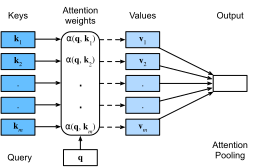

{.python .input  n=1}
%load_ext d2lbook.tab
tab.interact_select('mxnet', 'pytorch', 'tensorflow')
```

# クエリ、キー、値
:label:`sec_queries-keys-values`

これまでに見てきたネットワークはすべて、入力が明確に定義されたサイズであることに本質的に依存していた。たとえば、ImageNet の画像は $224 \times 224$ ピクセルであり、CNN はこのサイズに特化して調整されている。自然言語処理においてさえ、RNN の入力サイズは明確に定義されており固定である。可変サイズへの対応は、1トークンずつ順に処理するか、あるいは特別に設計された畳み込みカーネルによって行われる :cite:`Kalchbrenner.Grefenstette.Blunsom.2014`。この方法は、入力が本当に可変サイズであり、しかも情報量もさまざまである場合、たとえば :numref:`sec_seq2seq` におけるテキスト変換 :cite:`Sutskever.Vinyals.Le.2014` のような場合には、重大な問題を引き起こし得る。特に長い系列では、ネットワークがすでに生成したもの、あるいは見たものすべてを追跡し続けることが非常に難しくなる。:citet:`yang2016neural` が提案したような明示的な追跡ヒューリスティックでさえ、得られる利点は限定的である。 

これをデータベースと比べてみよう。最も単純な形では、データベースはキー ($k$) と値 ($v$) の集合である。たとえば、私たちのデータベース $\mathcal{D}$ は、\{("Zhang", "Aston"), ("Lipton", "Zachary"), ("Li", "Mu"), ("Smola", "Alex"), ("Hu", "Rachel"), ("Werness", "Brent")\} というタプルからなり、姓がキーで名が値だとする。$\mathcal{D}$ に対して操作を行うことができ、たとえば "Li" に対する厳密なクエリ ($q$) を与えれば、値 "Mu" が返される。もし ("Li", "Mu") が $\mathcal{D}$ のレコードでなければ、有効な答えは存在しない。近似一致も許すなら、代わりに ("Lipton", "Zachary") を取得することになる。この非常に単純で自明な例であっても、私たちはいくつかの有用なことを学べる。

* データベースサイズに依存せず有効であるように、($k$,$v$) ペアに対して動作するクエリ $q$ を設計できる。 
* 同じクエリでも、データベースの内容に応じて異なる答えを返しうる。 
* 大きな状態空間（データベース）に対して動作するための「コード」は、かなり単純でよい（たとえば、厳密一致、近似一致、top-$k$）。 
* 操作を有効にするために、データベースを圧縮したり単純化したりする必要はない。 

もちろん、ここで単純なデータベースを持ち出したのは、深層学習を説明するためである。実際、これは過去10年の深層学習で導入された最も刺激的な概念の一つ、すなわち *注意機構* へとつながる :cite:`Bahdanau.Cho.Bengio.2014`。その機械翻訳への応用の詳細は後で扱う。ここでは、次のことだけ考えよう。$\mathcal{D} \stackrel{\textrm{def}}{=} \{(\mathbf{k}_1, \mathbf{v}_1), \ldots (\mathbf{k}_m, \mathbf{v}_m)\}$ を、*キー* と *値* の $m$ 個のタプルからなるデータベースとする。さらに、$\mathbf{q}$ を *クエリ* とする。このとき、$\mathcal{D}$ 上の *attention* を次のように定義できる。

$$\textrm{Attention}(\mathbf{q}, \mathcal{D}) \stackrel{\textrm{def}}{=} \sum_{i=1}^m \alpha(\mathbf{q}, \mathbf{k}_i) \mathbf{v}_i,$$
:eqlabel:`eq_attention_pooling`

ここで $\alpha(\mathbf{q}, \mathbf{k}_i) \in \mathbb{R}$ ($i = 1, \ldots, m$) はスカラーの注意重みである。この操作自体は通常、*attention pooling* と呼ばれる。*attention* という名前は、重み $\alpha$ が大きい（すなわち重要な）項に特に注意を払うことに由来する。このように、$\mathcal{D}$ 上の attention は、データベースに含まれる値の線形結合を生成する。実際、これは上の例を、1つを除くすべての重みが0である特殊ケースとして含んでいる。いくつかの特殊ケースがある。

* 重み $\alpha(\mathbf{q}, \mathbf{k}_i)$ が非負である。この場合、注意機構の出力は、値 $\mathbf{v}_i$ が張る凸錐の中に含まれる。 
* 重み $\alpha(\mathbf{q}, \mathbf{k}_i)$ が凸結合をなす、すなわち $\sum_i \alpha(\mathbf{q}, \mathbf{k}_i) = 1$ かつすべての $i$ について $\alpha(\mathbf{q}, \mathbf{k}_i) \geq 0$ である。これは深層学習で最も一般的な設定である。 
* 重み $\alpha(\mathbf{q}, \mathbf{k}_i)$ のうちちょうど1つだけが $1$ で、他はすべて $0$ である。これは従来のデータベースクエリに似ている。 
* すべての重みが等しい、すなわちすべての $i$ について $\alpha(\mathbf{q}, \mathbf{k}_i) = \frac{1}{m}$ である。これはデータベース全体にわたる平均化に相当し、深層学習では average pooling とも呼ばれる。 

重みの総和を $1$ にするための一般的な戦略は、次のように正規化することである。

$$\alpha(\mathbf{q}, \mathbf{k}_i) = \frac{\alpha(\mathbf{q}, \mathbf{k}_i)}{{\sum_j} \alpha(\mathbf{q}, \mathbf{k}_j)}.$$

特に、重みを非負にもするためには、指数関数を用いることができる。これは、任意の関数 $a(\mathbf{q}, \mathbf{k})$ を選び、それに対して多項モデルで用いられる softmax 演算を次のように適用できることを意味する。

$$\alpha(\mathbf{q}, \mathbf{k}_i) = \frac{\exp(a(\mathbf{q}, \mathbf{k}_i))}{\sum_j \exp(a(\mathbf{q}, \mathbf{k}_j))}. $$
:eqlabel:`eq_softmax_attention`

この操作は、すべての深層学習フレームワークで容易に利用できる。これは微分可能であり、その勾配は決して消失しないため、モデルにとって望ましい性質を備えている。ただし、上で導入した注意機構が唯一の選択肢というわけではない。たとえば、強化学習手法を用いて訓練できる非微分可能な注意モデルを設計することもできる :cite:`Mnih.Heess.Graves.ea.2014`。予想されるように、そのようなモデルの訓練はかなり複雑である。そのため、現代の attention 研究の大部分は :numref:`fig_qkv` に示した枠組みに従っている。したがって、ここではこの微分可能な機構の系列に焦点を当てる。 


:label:`fig_qkv`

非常に注目すべきなのは、キーと値の集合に対して実行する実際の「コード」、すなわちクエリが、操作対象となる空間が大きいにもかかわらず、かなり簡潔でありうることである。これは、学習すべきパラメータが多すぎないという点で、ネットワーク層にとって望ましい性質である。同様に便利なのは、attention が、attention pooling のやり方を変えることなく、任意に大きなデータベースに対して動作できることである。

```{.python .input}
%%tab mxnet
from d2l import mxnet as d2l
from mxnet import np, npx
npx.set_np()
```

```{.python .input  n=2}
%%tab pytorch
from d2l import torch as d2l
import torch
```

```{.python .input}
%%tab tensorflow
from d2l import tensorflow as d2l
import tensorflow as tf
```

```{.python .input}
%%tab jax
from d2l import jax as d2l
from jax import numpy as jnp
```

## 可視化

注意機構の利点の一つは、特に重みが非負で総和が $1$ である場合、かなり直感的であることである。この場合、重みが大きいことを、モデルが関連のある成分を選択している方法だと *解釈* できるかもしれない。これは良い直感であるが、あくまで *直感* にすぎないことを忘れてはいけない。それでも、さまざまなクエリを適用したときに、与えられたキー集合に対してその効果を可視化したいことがある。この関数は後で役立つ。

そこで、`show_heatmaps` 関数を定義する。これは行列（注意重み）を入力として受け取るのではなく、4つの軸を持つテンソルを受け取り、さまざまなクエリと重みの配列を扱えるようにしている点に注意されたい。したがって、入力 `matrices` の形状は（表示する行数、表示する列数、クエリ数、キー数）である。これは、Transformer の仕組みを設計する際にその働きを可視化したいときに役立つ。

```{.python .input  n=17}
%%tab all
#@save
def show_heatmaps(matrices, xlabel, ylabel, titles=None, figsize=(2.5, 2.5),
                  cmap='Reds'):
    """Show heatmaps of matrices."""
    d2l.use_svg_display()
    num_rows, num_cols, _, _ = matrices.shape
    fig, axes = d2l.plt.subplots(num_rows, num_cols, figsize=figsize,
                                 sharex=True, sharey=True, squeeze=False)
    for i, (row_axes, row_matrices) in enumerate(zip(axes, matrices)):
        for j, (ax, matrix) in enumerate(zip(row_axes, row_matrices)):
            if tab.selected('pytorch', 'mxnet', 'tensorflow'):
                pcm = ax.imshow(d2l.numpy(matrix), cmap=cmap)
            if tab.selected('jax'):
                pcm = ax.imshow(matrix, cmap=cmap)
            if i == num_rows - 1:
                ax.set_xlabel(xlabel)
            if j == 0:
                ax.set_ylabel(ylabel)
            if titles:
                ax.set_title(titles[j])
    fig.colorbar(pcm, ax=axes, shrink=0.6);
```

簡単な妥当性確認として、クエリとキーが同じときにのみ注意重みが $1$ となる場合を表す単位行列を可視化してみよう。

```{.python .input  n=20}
%%tab all
attention_weights = d2l.reshape(d2l.eye(10), (1, 1, 10, 10))
show_heatmaps(attention_weights, xlabel='Keys', ylabel='Queries')
```

## まとめ

注意機構により、多数の（キー、値）ペアからデータを集約できる。ここまでの議論はかなり抽象的で、単にデータをプールする方法を説明しているにすぎなかった。これらの不思議なクエリ、キー、値がどこから生じるのかは、まだ説明していない。ここで少し直感を与えると、たとえば回帰の設定では、クエリは回帰を行うべき位置に対応するかもしれない。キーは過去のデータが観測された位置であり、値は（回帰）値そのものである。これは次節で学ぶ、いわゆる Nadaraya--Watson 推定量 :cite:`Nadaraya.1964,Watson.1964` である。 

設計上、注意機構は、ニューラルネットワークが集合から要素を選択し、それに対応する表現の重み付き和を構成するための *微分可能* な制御手段を提供する。 

## 演習

1. 古典的なデータベースで使われる近似的な（キー、クエリ）一致を再実装したいとする。どの attention 関数を選ぶか？ 
1. attention 関数が $a(\mathbf{q}, \mathbf{k}_i) = \mathbf{q}^\top \mathbf{k}_i$ で与えられ、かつ $i = 1, \ldots, m$ に対して $\mathbf{k}_i = \mathbf{v}_i$ であるとする。:eqref:`eq_softmax_attention` における softmax 正規化を用いたときのキー上の確率分布を $p(\mathbf{k}_i; \mathbf{q})$ と表す。$\nabla_{\mathbf{q}} \mathop{\textrm{Attention}}(\mathbf{q}, \mathcal{D}) = \textrm{Cov}_{p(\mathbf{k}_i; \mathbf{q})}[\mathbf{k}_i]$ を証明せよ。
1. 注意機構を用いた微分可能な検索エンジンを設計せよ。 
1. Squeeze and Excitation Networks :cite:`Hu.Shen.Sun.2018` の設計を見直し、注意機構の観点から解釈せよ。 
