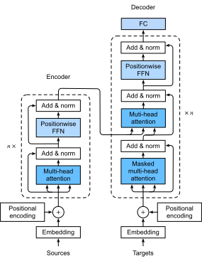

{.python .input}
%load_ext d2lbook.tab
tab.interact_select('mxnet', 'pytorch', 'tensorflow', 'jax')
```

# Transformerアーキテクチャ
:label:`sec_transformer`


:numref:`subsec_cnn-rnn-self-attention` では、CNN、RNN、自己注意を比較した。
特に、自己注意は並列計算と
最短の最大経路長の両方を備えている。
したがって、
自己注意を用いて深いアーキテクチャを設計するのは魅力的である。
入力表現に対してなおRNNに依存していた
以前の自己注意モデル :cite:`Cheng.Dong.Lapata.2016,Lin.Feng.Santos.ea.2017,Paulus.Xiong.Socher.2017` とは異なり、
Transformerモデルは
畳み込み層も再帰層も使わず、
注意機構のみに基づいている :cite:`Vaswani.Shazeer.Parmar.ea.2017`。
もともとは
テキストデータに対する系列変換学習のために提案されたが、
Transformerは
言語、視覚、音声、強化学習など、
現代の深層学習の幅広い応用分野で
広く使われるようになっている。

```{.python .input}
%%tab mxnet
from d2l import mxnet as d2l
import math
from mxnet import autograd, init, np, npx
from mxnet.gluon import nn
import pandas as pd
npx.set_np()
```

```{.python .input}
%%tab pytorch
from d2l import torch as d2l
import math
import pandas as pd
import torch
from torch import nn
```

```{.python .input}
%%tab tensorflow
from d2l import tensorflow as d2l
import numpy as np
import pandas as pd
import tensorflow as tf
```

```{.python .input}
%%tab jax
from d2l import jax as d2l
from flax import linen as nn
from jax import numpy as jnp
import jax
import math
import pandas as pd
```

## モデル

エンコーダ--デコーダ
アーキテクチャの一例として、
Transformerの全体アーキテクチャを
:numref:`fig_transformer` に示す。
見てわかるように、
Transformerはエンコーダとデコーダから構成される。
:numref:`fig_s2s_attention_details` の
Bahdanau注意による系列変換学習とは対照的に、
入力（source）系列と出力（target）系列の埋め込みには、
自己注意に基づくモジュールを積み重ねた
エンコーダとデコーダに入力する前に、
位置エンコーディングが加えられる。


:width:`320px`
:label:`fig_transformer`


ここで、 :numref:`fig_transformer` における
Transformerアーキテクチャの概要を説明する。
高レベルでは、
Transformerエンコーダは複数の同一層のスタックであり、
各層は2つのサブレイヤー（いずれも $\textrm{sublayer}$ と表記）を持つ。
1つ目は
マルチヘッド自己注意プーリングであり、
2つ目は位置ごとのフィードフォワードネットワークである。
具体的には、
エンコーダの自己注意では、
クエリ、キー、値はすべて
前のエンコーダ層の出力から得られる。
:numref:`sec_resnet` のResNet設計に着想を得て、
両方のサブレイヤーの周囲に
残差接続が用いられる。
Transformerでは、
系列の任意の位置にある任意の入力 $\mathbf{x} \in \mathbb{R}^d$ に対して、
残差接続 $\mathbf{x} + \textrm{sublayer}(\mathbf{x}) \in \mathbb{R}^d$ が可能であるように、
$\textrm{sublayer}(\mathbf{x}) \in \mathbb{R}^d$ を要求する。
この残差接続による加算の直後に
層正規化が続く :cite:`Ba.Kiros.Hinton.2016`。
その結果、Transformerエンコーダは入力系列の各位置に対して
$d$ 次元のベクトル表現を出力する。

Transformerデコーダもまた、
残差接続と層正規化を備えた
複数の同一層のスタックである。
エンコーダで説明した2つのサブレイヤーに加えて、
デコーダは
その間に
エンコーダ--デコーダ注意と呼ばれる
3つ目のサブレイヤーを挿入する。
エンコーダ--デコーダ注意では、
クエリは
デコーダの自己注意サブレイヤーの出力から得られ、
キーと値は
Transformerエンコーダの出力から得られる。
デコーダの自己注意では、
クエリ、キー、値はすべて
前のデコーダ層の出力から得られる。
ただし、デコーダの各位置は
その位置までのデコーダ内のすべての位置にのみ
注意を向けることが許される。
この*マスク付き*注意は
自己回帰性を保ち、
予測が生成済みの出力トークンのみに依存することを保証する。


すでに
:numref:`sec_multihead-attention` で
スケールド・ドット積に基づく
マルチヘッド注意と、
:numref:`subsec_positional-encoding` で
位置エンコーディングを説明し実装した。
以下では、
Transformerモデルの残りの部分を実装する。

## [**位置ごとのフィードフォワードネットワーク**]
:label:`subsec_positionwise-ffn`

位置ごとのフィードフォワードネットワークは、
同じMLPを用いて
すべての系列位置の表現を変換する。
このため、これを*位置ごと*と呼ぶ。
以下の実装では、
形状が
（バッチサイズ、時間ステップ数またはトークン単位の系列長、
隠れユニット数または特徴次元）
である入力 `X` は、
2層MLPによって
形状が
（バッチサイズ、時間ステップ数、`ffn_num_outputs`）
の出力テンソルへ変換される。

```{.python .input}
%%tab mxnet
class PositionWiseFFN(nn.Block):  #@save
    """The positionwise feed-forward network."""
    def __init__(self, ffn_num_hiddens, ffn_num_outputs):
        super().__init__()
        self.dense1 = nn.Dense(ffn_num_hiddens, flatten=False,
                               activation='relu')
        self.dense2 = nn.Dense(ffn_num_outputs, flatten=False)

    def forward(self, X):
        return self.dense2(self.dense1(X))
```

```{.python .input}
%%tab pytorch
class PositionWiseFFN(nn.Module):  #@save
    """The positionwise feed-forward network."""
    def __init__(self, ffn_num_hiddens, ffn_num_outputs):
        super().__init__()
        self.dense1 = nn.LazyLinear(ffn_num_hiddens)
        self.relu = nn.ReLU()
        self.dense2 = nn.LazyLinear(ffn_num_outputs)

    def forward(self, X):
        return self.dense2(self.relu(self.dense1(X)))
```

```{.python .input}
%%tab tensorflow
class PositionWiseFFN(tf.keras.layers.Layer):  #@save
    """The positionwise feed-forward network."""
    def __init__(self, ffn_num_hiddens, ffn_num_outputs):
        super().__init__()
        self.dense1 = tf.keras.layers.Dense(ffn_num_hiddens)
        self.relu = tf.keras.layers.ReLU()
        self.dense2 = tf.keras.layers.Dense(ffn_num_outputs)

    def call(self, X):
        return self.dense2(self.relu(self.dense1(X)))
```

```{.python .input}
%%tab jax
class PositionWiseFFN(nn.Module):  #@save
    """The positionwise feed-forward network."""
    ffn_num_hiddens: int
    ffn_num_outputs: int

    def setup(self):
        self.dense1 = nn.Dense(self.ffn_num_hiddens)
        self.dense2 = nn.Dense(self.ffn_num_outputs)

    def __call__(self, X):
        return self.dense2(nn.relu(self.dense1(X)))
```

次の例は、
[**テンソルの最内側の次元が変化する**]ことを示している。
その変化先は
位置ごとのフィードフォワードネットワークの出力数である。
同じMLPが
すべての位置で変換を行うため、
それらすべての位置で入力が同じなら、
出力も同一になる。

```{.python .input}
%%tab mxnet
ffn = PositionWiseFFN(4, 8)
ffn.initialize()
ffn(np.ones((2, 3, 4)))[0]
```

```{.python .input}
%%tab pytorch
ffn = PositionWiseFFN(4, 8)
ffn.eval()
ffn(d2l.ones((2, 3, 4)))[0]
```

```{.python .input}
%%tab tensorflow
ffn = PositionWiseFFN(4, 8)
ffn(tf.ones((2, 3, 4)))[0]
```

```{.python .input}
%%tab jax
ffn = PositionWiseFFN(4, 8)
ffn.init_with_output(d2l.get_key(), jnp.ones((2, 3, 4)))[0][0]
```

## 残差接続と層正規化

ここでは、 :numref:`fig_transformer` の「add & norm」コンポーネントに注目しよう。
この節の冒頭で述べたように、
これは残差接続の直後に
層正規化が続く構成である。
どちらも効果的な深層アーキテクチャにとって重要である。

:numref:`sec_batch_norm` では、
バッチ正規化が
ミニバッチ内の各例にわたって
どのように再中心化と再スケーリングを行うかを説明した。
:numref:`subsec_layer-normalization-in-bn` で議論したように、
層正規化はバッチ正規化と同じだが、
前者は特徴次元に沿って正規化する点が異なる。
そのため、スケール不変性とバッチサイズ不変性の利点を持つ。
コンピュータビジョンで広く使われているにもかかわらず、
バッチ正規化は、
入力がしばしば可変長系列である自然言語処理タスクでは、
経験的に層正規化ほど有効でないことが多い。

次のコード片は、
[**層正規化とバッチ正規化による異なる次元に沿った正規化を比較する**]。

```{.python .input}
%%tab mxnet
ln = nn.LayerNorm()
ln.initialize()
bn = nn.BatchNorm()
bn.initialize()
X = d2l.tensor([[1, 2], [2, 3]])
# Compute mean and variance from X in the training mode
with autograd.record():
    print('layer norm:', ln(X), '\nbatch norm:', bn(X))
```

```{.python .input}
%%tab pytorch
ln = nn.LayerNorm(2)
bn = nn.LazyBatchNorm1d()
X = d2l.tensor([[1, 2], [2, 3]], dtype=torch.float32)
# Compute mean and variance from X in the training mode
print('layer norm:', ln(X), '\nbatch norm:', bn(X))
```

```{.python .input}
%%tab tensorflow
ln = tf.keras.layers.LayerNormalization()
bn = tf.keras.layers.BatchNormalization()
X = tf.constant([[1, 2], [2, 3]], dtype=tf.float32)
print('layer norm:', ln(X), '\nbatch norm:', bn(X, training=True))
```

```{.python .input}
%%tab jax
ln = nn.LayerNorm()
bn = nn.BatchNorm()
X = d2l.tensor([[1, 2], [2, 3]], dtype=d2l.float32)
# Compute mean and variance from X in the training mode
print('layer norm:', ln.init_with_output(d2l.get_key(), X)[0],
      '\nbatch norm:', bn.init_with_output(d2l.get_key(), X,
                                           use_running_average=False)[0])
```

ここで、残差接続の後に層正規化を行う
`AddNorm` クラスを
[**実装できる**]。
正則化のためにドロップアウトも適用する。

```{.python .input}
%%tab mxnet
class AddNorm(nn.Block):  #@save
    """The residual connection followed by layer normalization."""
    def __init__(self, dropout):
        super().__init__()
        self.dropout = nn.Dropout(dropout)
        self.ln = nn.LayerNorm()

    def forward(self, X, Y):
        return self.ln(self.dropout(Y) + X)
```

```{.python .input}
%%tab pytorch
class AddNorm(nn.Module):  #@save
    """The residual connection followed by layer normalization."""
    def __init__(self, norm_shape, dropout):
        super().__init__()
        self.dropout = nn.Dropout(dropout)
        self.ln = nn.LayerNorm(norm_shape)

    def forward(self, X, Y):
        return self.ln(self.dropout(Y) + X)
```

```{.python .input}
%%tab tensorflow
class AddNorm(tf.keras.layers.Layer):  #@save
    """The residual connection followed by layer normalization."""
    def __init__(self, norm_shape, dropout):
        super().__init__()
        self.dropout = tf.keras.layers.Dropout(dropout)
        self.ln = tf.keras.layers.LayerNormalization(norm_shape)

    def call(self, X, Y, **kwargs):
        return self.ln(self.dropout(Y, **kwargs) + X)
```

```{.python .input}
%%tab jax
class AddNorm(nn.Module):  #@save
    """The residual connection followed by layer normalization."""
    dropout: int

    @nn.compact
    def __call__(self, X, Y, training=False):
        return nn.LayerNorm()(
            nn.Dropout(self.dropout)(Y, deterministic=not training) + X)
```

残差接続では、
加算演算の後も出力テンソルが同じ形状になるように、
2つの入力が同じ形状であることが必要である。
[**そのため、出力テンソルも加算後に同じ形状を持つ**]。

```{.python .input}
%%tab mxnet
add_norm = AddNorm(0.5)
add_norm.initialize()
shape = (2, 3, 4)
d2l.check_shape(add_norm(d2l.ones(shape), d2l.ones(shape)), shape)
```

```{.python .input}
%%tab pytorch
add_norm = AddNorm(4, 0.5)
shape = (2, 3, 4)
d2l.check_shape(add_norm(d2l.ones(shape), d2l.ones(shape)), shape)
```

```{.python .input}
%%tab tensorflow
# Normalized_shape is: [i for i in range(len(input.shape))][1:]
add_norm = AddNorm([1, 2], 0.5)
shape = (2, 3, 4)
d2l.check_shape(add_norm(tf.ones(shape), tf.ones(shape), training=False),
                shape)
```

```{.python .input}
%%tab jax
add_norm = AddNorm(0.5)
shape = (2, 3, 4)
output, _ = add_norm.init_with_output(d2l.get_key(), d2l.ones(shape),
                                      d2l.ones(shape))
d2l.check_shape(output, shape)
```

## エンコーダ
:label:`subsec_transformer-encoder`

Transformerエンコーダを構成するための
必要な要素がすべてそろったので、
まずは
[**エンコーダ内の1層**]を実装しよう。
以下の `TransformerEncoderBlock` クラスは
2つのサブレイヤーを含む。
すなわち、マルチヘッド自己注意と位置ごとのフィードフォワードネットワークであり、
両方のサブレイヤーの周囲に
残差接続と層正規化が用いられる。

```{.python .input}
%%tab mxnet
class TransformerEncoderBlock(nn.Block):  #@save
    """The Transformer encoder block."""
    def __init__(self, num_hiddens, ffn_num_hiddens, num_heads, dropout,
                 use_bias=False):
        super().__init__()
        self.attention = d2l.MultiHeadAttention(
            num_hiddens, num_heads, dropout, use_bias)
        self.addnorm1 = AddNorm(dropout)
        self.ffn = PositionWiseFFN(ffn_num_hiddens, num_hiddens)
        self.addnorm2 = AddNorm(dropout)

    def forward(self, X, valid_lens):
        Y = self.addnorm1(X, self.attention(X, X, X, valid_lens))
        return self.addnorm2(Y, self.ffn(Y))
```

```{.python .input}
%%tab pytorch
class TransformerEncoderBlock(nn.Module):  #@save
    """The Transformer encoder block."""
    def __init__(self, num_hiddens, ffn_num_hiddens, num_heads, dropout,
                 use_bias=False):
        super().__init__()
        self.attention = d2l.MultiHeadAttention(num_hiddens, num_heads,
                                                dropout, use_bias)
        self.addnorm1 = AddNorm(num_hiddens, dropout)
        self.ffn = PositionWiseFFN(ffn_num_hiddens, num_hiddens)
        self.addnorm2 = AddNorm(num_hiddens, dropout)

    def forward(self, X, valid_lens):
        Y = self.addnorm1(X, self.attention(X, X, X, valid_lens))
        return self.addnorm2(Y, self.ffn(Y))
```

```{.python .input}
%%tab tensorflow
class TransformerEncoderBlock(tf.keras.layers.Layer):  #@save
    """The Transformer encoder block."""
    def __init__(self, key_size, query_size, value_size, num_hiddens,
                 norm_shape, ffn_num_hiddens, num_heads, dropout, bias=False):
        super().__init__()
        self.attention = d2l.MultiHeadAttention(
            key_size, query_size, value_size, num_hiddens, num_heads, dropout,
            bias)
        self.addnorm1 = AddNorm(norm_shape, dropout)
        self.ffn = PositionWiseFFN(ffn_num_hiddens, num_hiddens)
        self.addnorm2 = AddNorm(norm_shape, dropout)

    def call(self, X, valid_lens, **kwargs):
        Y = self.addnorm1(X, self.attention(X, X, X, valid_lens, **kwargs),
                          **kwargs)
        return self.addnorm2(Y, self.ffn(Y), **kwargs)
```

```{.python .input}
%%tab jax
class TransformerEncoderBlock(nn.Module):  #@save
    """The Transformer encoder block."""
    num_hiddens: int
    ffn_num_hiddens: int
    num_heads: int
    dropout: float
    use_bias: bool = False

    def setup(self):
        self.attention = d2l.MultiHeadAttention(self.num_hiddens, self.num_heads,
                                                self.dropout, self.use_bias)
        self.addnorm1 = AddNorm(self.dropout)
        self.ffn = PositionWiseFFN(self.ffn_num_hiddens, self.num_hiddens)
        self.addnorm2 = AddNorm(self.dropout)

    def __call__(self, X, valid_lens, training=False):
        output, attention_weights = self.attention(X, X, X, valid_lens,
                                                   training=training)
        Y = self.addnorm1(X, output, training=training)
        return self.addnorm2(Y, self.ffn(Y), training=training), attention_weights
```

見てわかるように、
Transformerエンコーダのどの層も
入力の形状を変えない。

```{.python .input}
%%tab mxnet
X = d2l.ones((2, 100, 24))
valid_lens = d2l.tensor([3, 2])
encoder_blk = TransformerEncoderBlock(24, 48, 8, 0.5)
encoder_blk.initialize()
d2l.check_shape(encoder_blk(X, valid_lens), X.shape)
```

```{.python .input}
%%tab pytorch
X = d2l.ones((2, 100, 24))
valid_lens = d2l.tensor([3, 2])
encoder_blk = TransformerEncoderBlock(24, 48, 8, 0.5)
encoder_blk.eval()
d2l.check_shape(encoder_blk(X, valid_lens), X.shape)
```

```{.python .input}
%%tab tensorflow
X = tf.ones((2, 100, 24))
valid_lens = tf.constant([3, 2])
norm_shape = [i for i in range(len(X.shape))][1:]
encoder_blk = TransformerEncoderBlock(24, 24, 24, 24, norm_shape, 48, 8, 0.5)
d2l.check_shape(encoder_blk(X, valid_lens, training=False), X.shape)
```

```{.python .input}
%%tab jax
X = jnp.ones((2, 100, 24))
valid_lens = jnp.array([3, 2])
encoder_blk = TransformerEncoderBlock(24, 48, 8, 0.5)
(output, _), _ = encoder_blk.init_with_output(d2l.get_key(), X, valid_lens,
                                              training=False)
d2l.check_shape(output, X.shape)
```

以下の[**Transformerエンコーダ**]の実装では、
上記の `TransformerEncoderBlock` クラスの `num_blks` 個のインスタンスを積み重ねる。
固定位置エンコーディングの値は常に $-1$ と $1$ の間にあるため、
入力埋め込みと位置エンコーディングを加算する前に、
学習可能な入力埋め込みの値に
埋め込み次元の平方根を掛けて
再スケーリングする。

```{.python .input}
%%tab mxnet
class TransformerEncoder(d2l.Encoder):  #@save
    """The Transformer encoder."""
    def __init__(self, vocab_size, num_hiddens, ffn_num_hiddens,
                 num_heads, num_blks, dropout, use_bias=False):
        super().__init__()
        self.num_hiddens = num_hiddens
        self.embedding = nn.Embedding(vocab_size, num_hiddens)
        self.pos_encoding = d2l.PositionalEncoding(num_hiddens, dropout)
        self.blks = nn.Sequential()
        for _ in range(num_blks):
            self.blks.add(TransformerEncoderBlock(
                num_hiddens, ffn_num_hiddens, num_heads, dropout, use_bias))
        self.initialize()

    def forward(self, X, valid_lens):
        # Since positional encoding values are between -1 and 1, the embedding
        # values are multiplied by the square root of the embedding dimension
        # to rescale before they are summed up
        X = self.pos_encoding(self.embedding(X) * math.sqrt(self.num_hiddens))
        self.attention_weights = [None] * len(self.blks)
        for i, blk in enumerate(self.blks):
            X = blk(X, valid_lens)
            self.attention_weights[
                i] = blk.attention.attention.attention_weights
        return X
```

```{.python .input}
%%tab pytorch
class TransformerEncoder(d2l.Encoder):  #@save
    """The Transformer encoder."""
    def __init__(self, vocab_size, num_hiddens, ffn_num_hiddens,
                 num_heads, num_blks, dropout, use_bias=False):
        super().__init__()
        self.num_hiddens = num_hiddens
        self.embedding = nn.Embedding(vocab_size, num_hiddens)
        self.pos_encoding = d2l.PositionalEncoding(num_hiddens, dropout)
        self.blks = nn.Sequential()
        for i in range(num_blks):
            self.blks.add_module("block"+str(i), TransformerEncoderBlock(
                num_hiddens, ffn_num_hiddens, num_heads, dropout, use_bias))

    def forward(self, X, valid_lens):
        # Since positional encoding values are between -1 and 1, the embedding
        # values are multiplied by the square root of the embedding dimension
        # to rescale before they are summed up
        X = self.pos_encoding(self.embedding(X) * math.sqrt(self.num_hiddens))
        self.attention_weights = [None] * len(self.blks)
        for i, blk in enumerate(self.blks):
            X = blk(X, valid_lens)
            self.attention_weights[
                i] = blk.attention.attention.attention_weights
        return X
```

```{.python .input}
%%tab tensorflow
class TransformerEncoder(d2l.Encoder):  #@save
    """The Transformer encoder."""
    def __init__(self, vocab_size, key_size, query_size, value_size,
                 num_hiddens, norm_shape, ffn_num_hiddens, num_heads,
                 num_blks, dropout, bias=False):
        super().__init__()
        self.num_hiddens = num_hiddens
        self.embedding = tf.keras.layers.Embedding(vocab_size, num_hiddens)
        self.pos_encoding = d2l.PositionalEncoding(num_hiddens, dropout)
        self.blks = [TransformerEncoderBlock(
            key_size, query_size, value_size, num_hiddens, norm_shape,
            ffn_num_hiddens, num_heads, dropout, bias) for _ in range(
            num_blks)]

    def call(self, X, valid_lens, **kwargs):
        # Since positional encoding values are between -1 and 1, the embedding
        # values are multiplied by the square root of the embedding dimension
        # to rescale before they are summed up
        X = self.pos_encoding(self.embedding(X) * tf.math.sqrt(
            tf.cast(self.num_hiddens, dtype=tf.float32)), **kwargs)
        self.attention_weights = [None] * len(self.blks)
        for i, blk in enumerate(self.blks):
            X = blk(X, valid_lens, **kwargs)
            self.attention_weights[
                i] = blk.attention.attention.attention_weights
        return X
```

```{.python .input}
%%tab jax
class TransformerEncoder(d2l.Encoder):  #@save
    """The Transformer encoder."""
    vocab_size: int
    num_hiddens:int
    ffn_num_hiddens: int
    num_heads: int
    num_blks: int
    dropout: float
    use_bias: bool = False

    def setup(self):
        self.embedding = nn.Embed(self.vocab_size, self.num_hiddens)
        self.pos_encoding = d2l.PositionalEncoding(self.num_hiddens, self.dropout)
        self.blks = [TransformerEncoderBlock(self.num_hiddens,
                                             self.ffn_num_hiddens,
                                             self.num_heads,
                                             self.dropout, self.use_bias)
                     for _ in range(self.num_blks)]

    def __call__(self, X, valid_lens, training=False):
        # Since positional encoding values are between -1 and 1, the embedding
        # values are multiplied by the square root of the embedding dimension
        # to rescale before they are summed up
        X = self.embedding(X) * math.sqrt(self.num_hiddens)
        X = self.pos_encoding(X, training=training)
        attention_weights = [None] * len(self.blks)
        for i, blk in enumerate(self.blks):
            X, attention_w = blk(X, valid_lens, training=training)
            attention_weights[i] = attention_w
        # Flax sow API is used to capture intermediate variables
        self.sow('intermediates', 'enc_attention_weights', attention_weights)
        return X
```

以下では、ハイパーパラメータを指定して
[**2層のTransformerエンコーダを作成する**]。
Transformerエンコーダの出力形状は
（バッチサイズ、時間ステップ数、`num_hiddens`）である。

```{.python .input}
%%tab mxnet
encoder = TransformerEncoder(200, 24, 48, 8, 2, 0.5)
d2l.check_shape(encoder(np.ones((2, 100)), valid_lens), (2, 100, 24))
```

```{.python .input}
%%tab pytorch
encoder = TransformerEncoder(200, 24, 48, 8, 2, 0.5)
d2l.check_shape(encoder(d2l.ones((2, 100), dtype=torch.long), valid_lens),
                (2, 100, 24))
```

```{.python .input}
%%tab tensorflow
encoder = TransformerEncoder(200, 24, 24, 24, 24, [1, 2], 48, 8, 2, 0.5)
d2l.check_shape(encoder(tf.ones((2, 100)), valid_lens, training=False),
                (2, 100, 24))
```

```{.python .input}
%%tab jax
encoder = TransformerEncoder(200, 24, 48, 8, 2, 0.5)
d2l.check_shape(encoder.init_with_output(d2l.get_key(),
                                         jnp.ones((2, 100), dtype=jnp.int32),
                                         valid_lens)[0],
                (2, 100, 24))
```

## デコーダ

:numref:`fig_transformer` に示すように、
[**Transformerデコーダは複数の同一層から構成される**]。
各層は以下の
`TransformerDecoderBlock` クラスで実装され、
3つのサブレイヤーを含む。
すなわち、
デコーダ自己注意、
エンコーダ--デコーダ注意、
位置ごとのフィードフォワードネットワークである。
これらのサブレイヤーには、
それぞれの周囲に
残差接続があり、その後に層正規化が続く。


この節の前半で述べたように、
マスク付きマルチヘッドデコーダ自己注意
（1つ目のサブレイヤー）では、
クエリ、キー、値は
すべて前のデコーダ層の出力から得られる。
系列変換モデルを学習するとき、
出力系列のすべての位置（時間ステップ）のトークンは
既知である。
しかし、
予測時には
出力系列はトークンごとに生成される。
したがって、
デコーダの任意の時間ステップでは
生成済みトークンのみを
デコーダ自己注意に使うことができる。
デコーダの自己回帰性を保つために、
マスク付き自己注意は `dec_valid_lens` を指定し、
各クエリが
デコーダ内のクエリ位置までの
すべての位置にのみ注意を向けるようにする。

```{.python .input}
%%tab mxnet
class TransformerDecoderBlock(nn.Block):
    # The i-th block in the Transformer decoder
    def __init__(self, num_hiddens, ffn_num_hiddens, num_heads, dropout, i):
        super().__init__()
        self.i = i
        self.attention1 = d2l.MultiHeadAttention(num_hiddens, num_heads,
                                                 dropout)
        self.addnorm1 = AddNorm(dropout)
        self.attention2 = d2l.MultiHeadAttention(num_hiddens, num_heads,
                                                 dropout)
        self.addnorm2 = AddNorm(dropout)
        self.ffn = PositionWiseFFN(ffn_num_hiddens, num_hiddens)
        self.addnorm3 = AddNorm(dropout)

    def forward(self, X, state):
        enc_outputs, enc_valid_lens = state[0], state[1]
        # During training, all the tokens of any output sequence are processed
        # at the same time, so state[2][self.i] is None as initialized. When
        # decoding any output sequence token by token during prediction,
        # state[2][self.i] contains representations of the decoded output at
        # the i-th block up to the current time step
        if state[2][self.i] is None:
            key_values = X
        else:
            key_values = np.concatenate((state[2][self.i], X), axis=1)
        state[2][self.i] = key_values

        if autograd.is_training():
            batch_size, num_steps, _ = X.shape
            # Shape of dec_valid_lens: (batch_size, num_steps), where every
            # row is [1, 2, ..., num_steps]
            dec_valid_lens = np.tile(np.arange(1, num_steps + 1, ctx=X.ctx),
                                     (batch_size, 1))
        else:
            dec_valid_lens = None
        # Self-attention
        X2 = self.attention1(X, key_values, key_values, dec_valid_lens)
        Y = self.addnorm1(X, X2)
        # Encoder-decoder attention. Shape of enc_outputs:
        # (batch_size, num_steps, num_hiddens)
        Y2 = self.attention2(Y, enc_outputs, enc_outputs, enc_valid_lens)
        Z = self.addnorm2(Y, Y2)
        return self.addnorm3(Z, self.ffn(Z)), state
```

```{.python .input}
%%tab pytorch
class TransformerDecoderBlock(nn.Module):
    # The i-th block in the Transformer decoder
    def __init__(self, num_hiddens, ffn_num_hiddens, num_heads, dropout, i):
        super().__init__()
        self.i = i
        self.attention1 = d2l.MultiHeadAttention(num_hiddens, num_heads,
                                                 dropout)
        self.addnorm1 = AddNorm(num_hiddens, dropout)
        self.attention2 = d2l.MultiHeadAttention(num_hiddens, num_heads,
                                                 dropout)
        self.addnorm2 = AddNorm(num_hiddens, dropout)
        self.ffn = PositionWiseFFN(ffn_num_hiddens, num_hiddens)
        self.addnorm3 = AddNorm(num_hiddens, dropout)

    def forward(self, X, state):
        enc_outputs, enc_valid_lens = state[0], state[1]
        # During training, all the tokens of any output sequence are processed
        # at the same time, so state[2][self.i] is None as initialized. When
        # decoding any output sequence token by token during prediction,
        # state[2][self.i] contains representations of the decoded output at
        # the i-th block up to the current time step
        if state[2][self.i] is None:
            key_values = X
        else:
            key_values = torch.cat((state[2][self.i], X), dim=1)
        state[2][self.i] = key_values
        if self.training:
            batch_size, num_steps, _ = X.shape
            # Shape of dec_valid_lens: (batch_size, num_steps), where every
            # row is [1, 2, ..., num_steps]
            dec_valid_lens = torch.arange(
                1, num_steps + 1, device=X.device).repeat(batch_size, 1)
        else:
            dec_valid_lens = None
        # Self-attention
        X2 = self.attention1(X, key_values, key_values, dec_valid_lens)
        Y = self.addnorm1(X, X2)
        # Encoder-decoder attention. Shape of enc_outputs:
        # (batch_size, num_steps, num_hiddens)
        Y2 = self.attention2(Y, enc_outputs, enc_outputs, enc_valid_lens)
        Z = self.addnorm2(Y, Y2)
        return self.addnorm3(Z, self.ffn(Z)), state
```

```{.python .input}
%%tab tensorflow
class TransformerDecoderBlock(tf.keras.layers.Layer):
    # The i-th block in the Transformer decoder
    def __init__(self, key_size, query_size, value_size, num_hiddens,
                 norm_shape, ffn_num_hiddens, num_heads, dropout, i):
        super().__init__()
        self.i = i
        self.attention1 = d2l.MultiHeadAttention(
            key_size, query_size, value_size, num_hiddens, num_heads, dropout)
        self.addnorm1 = AddNorm(norm_shape, dropout)
        self.attention2 = d2l.MultiHeadAttention(
            key_size, query_size, value_size, num_hiddens, num_heads, dropout)
        self.addnorm2 = AddNorm(norm_shape, dropout)
        self.ffn = PositionWiseFFN(ffn_num_hiddens, num_hiddens)
        self.addnorm3 = AddNorm(norm_shape, dropout)

    def call(self, X, state, **kwargs):
        enc_outputs, enc_valid_lens = state[0], state[1]
        # During training, all the tokens of any output sequence are processed
        # at the same time, so state[2][self.i] is None as initialized. When
        # decoding any output sequence token by token during prediction,
        # state[2][self.i] contains representations of the decoded output at
        # the i-th block up to the current time step
        if state[2][self.i] is None:
            key_values = X
        else:
            key_values = tf.concat((state[2][self.i], X), axis=1)
        state[2][self.i] = key_values
        if kwargs["training"]:
            batch_size, num_steps, _ = X.shape
            # Shape of dec_valid_lens: (batch_size, num_steps), where every
            # row is [1, 2, ..., num_steps]
            dec_valid_lens = tf.repeat(
                tf.reshape(tf.range(1, num_steps + 1),
                           shape=(-1, num_steps)), repeats=batch_size, axis=0)
        else:
            dec_valid_lens = None
        # Self-attention
        X2 = self.attention1(X, key_values, key_values, dec_valid_lens,
                             **kwargs)
        Y = self.addnorm1(X, X2, **kwargs)
        # Encoder-decoder attention. Shape of enc_outputs:
        # (batch_size, num_steps, num_hiddens)
        Y2 = self.attention2(Y, enc_outputs, enc_outputs, enc_valid_lens,
                             **kwargs)
        Z = self.addnorm2(Y, Y2, **kwargs)
        return self.addnorm3(Z, self.ffn(Z), **kwargs), state
```

```{.python .input}
%%tab jax
class TransformerDecoderBlock(nn.Module):
    # The i-th block in the Transformer decoder
    num_hiddens: int
    ffn_num_hiddens: int
    num_heads: int
    dropout: float
    i: int

    def setup(self):
        self.attention1 = d2l.MultiHeadAttention(self.num_hiddens,
                                                 self.num_heads,
                                                 self.dropout)
        self.addnorm1 = AddNorm(self.dropout)
        self.attention2 = d2l.MultiHeadAttention(self.num_hiddens,
                                                 self.num_heads,
                                                 self.dropout)
        self.addnorm2 = AddNorm(self.dropout)
        self.ffn = PositionWiseFFN(self.ffn_num_hiddens, self.num_hiddens)
        self.addnorm3 = AddNorm(self.dropout)

    def __call__(self, X, state, training=False):
        enc_outputs, enc_valid_lens = state[0], state[1]
        # During training, all the tokens of any output sequence are processed
        # at the same time, so state[2][self.i] is None as initialized. When
        # decoding any output sequence token by token during prediction,
        # state[2][self.i] contains representations of the decoded output at
        # the i-th block up to the current time step
        if state[2][self.i] is None:
            key_values = X
        else:
            key_values = jnp.concatenate((state[2][self.i], X), axis=1)
        state[2][self.i] = key_values
        if training:
            batch_size, num_steps, _ = X.shape
            # Shape of dec_valid_lens: (batch_size, num_steps), where every
            # row is [1, 2, ..., num_steps]
            dec_valid_lens = jnp.tile(jnp.arange(1, num_steps + 1),
                                      (batch_size, 1))
        else:
            dec_valid_lens = None
        # Self-attention
        X2, attention_w1 = self.attention1(X, key_values, key_values,
                                           dec_valid_lens, training=training)
        Y = self.addnorm1(X, X2, training=training)
        # Encoder-decoder attention. Shape of enc_outputs:
        # (batch_size, num_steps, num_hiddens)
        Y2, attention_w2 = self.attention2(Y, enc_outputs, enc_outputs,
                                           enc_valid_lens, training=training)
        Z = self.addnorm2(Y, Y2, training=training)
        return self.addnorm3(Z, self.ffn(Z), training=training), state, attention_w1, attention_w2
```

エンコーダ--デコーダ注意におけるスケールド・ドット積演算と
残差接続における加算演算を容易にするため、
[**デコーダの特徴次元（`num_hiddens`）は
エンコーダのそれと同じである。**]

```{.python .input}
%%tab mxnet
decoder_blk = TransformerDecoderBlock(24, 48, 8, 0.5, 0)
decoder_blk.initialize()
X = np.ones((2, 100, 24))
state = [encoder_blk(X, valid_lens), valid_lens, [None]]
d2l.check_shape(decoder_blk(X, state)[0], X.shape)
```

```{.python .input}
%%tab pytorch
decoder_blk = TransformerDecoderBlock(24, 48, 8, 0.5, 0)
X = d2l.ones((2, 100, 24))
state = [encoder_blk(X, valid_lens), valid_lens, [None]]
d2l.check_shape(decoder_blk(X, state)[0], X.shape)
```

```{.python .input}
%%tab tensorflow
decoder_blk = TransformerDecoderBlock(24, 24, 24, 24, [1, 2], 48, 8, 0.5, 0)
X = tf.ones((2, 100, 24))
state = [encoder_blk(X, valid_lens), valid_lens, [None]]
d2l.check_shape(decoder_blk(X, state, training=False)[0], X.shape)
```

```{.python .input}
%%tab jax
decoder_blk = TransformerDecoderBlock(24, 48, 8, 0.5, 0)
X = d2l.ones((2, 100, 24))
state = [encoder_blk.init_with_output(d2l.get_key(), X, valid_lens)[0][0],
         valid_lens, [None]]
d2l.check_shape(decoder_blk.init_with_output(d2l.get_key(), X, state)[0][0],
                X.shape)
```

ここで、`num_blks` 個の `TransformerDecoderBlock` インスタンスからなる
[**Transformerデコーダ全体を構成する**]。
最後に、
全結合層が
`vocab_size` 個の可能な出力トークンすべてに対する予測を計算する。
デコーダ自己注意の重みと
エンコーダ--デコーダ注意の重みの両方は、
後で可視化できるように保存される。

```{.python .input}
%%tab mxnet
class TransformerDecoder(d2l.AttentionDecoder):
    def __init__(self, vocab_size, num_hiddens, ffn_num_hiddens, num_heads,
                 num_blks, dropout):
        super().__init__()
        self.num_hiddens = num_hiddens
        self.num_blks = num_blks
        self.embedding = nn.Embedding(vocab_size, num_hiddens)
        self.pos_encoding = d2l.PositionalEncoding(num_hiddens, dropout)
        self.blks = nn.Sequential()
        for i in range(num_blks):
            self.blks.add(TransformerDecoderBlock(
                num_hiddens, ffn_num_hiddens, num_heads, dropout, i))
        self.dense = nn.Dense(vocab_size, flatten=False)
        self.initialize()

    def init_state(self, enc_outputs, enc_valid_lens):
        return [enc_outputs, enc_valid_lens, [None] * self.num_blks]

    def forward(self, X, state):
        X = self.pos_encoding(self.embedding(X) * math.sqrt(self.num_hiddens))
        self._attention_weights = [[None] * len(self.blks) for _ in range (2)]
        for i, blk in enumerate(self.blks):
            X, state = blk(X, state)
            # Decoder self-attention weights
            self._attention_weights[0][
                i] = blk.attention1.attention.attention_weights
            # Encoder-decoder attention weights
            self._attention_weights[1][
                i] = blk.attention2.attention.attention_weights
        return self.dense(X), state

    @property
    def attention_weights(self):
        return self._attention_weights
```

```{.python .input}
%%tab pytorch
class TransformerDecoder(d2l.AttentionDecoder):
    def __init__(self, vocab_size, num_hiddens, ffn_num_hiddens, num_heads,
                 num_blks, dropout):
        super().__init__()
        self.num_hiddens = num_hiddens
        self.num_blks = num_blks
        self.embedding = nn.Embedding(vocab_size, num_hiddens)
        self.pos_encoding = d2l.PositionalEncoding(num_hiddens, dropout)
        self.blks = nn.Sequential()
        for i in range(num_blks):
            self.blks.add_module("block"+str(i), TransformerDecoderBlock(
                num_hiddens, ffn_num_hiddens, num_heads, dropout, i))
        self.dense = nn.LazyLinear(vocab_size)

    def init_state(self, enc_outputs, enc_valid_lens):
        return [enc_outputs, enc_valid_lens, [None] * self.num_blks]

    def forward(self, X, state):
        X = self.pos_encoding(self.embedding(X) * math.sqrt(self.num_hiddens))
        self._attention_weights = [[None] * len(self.blks) for _ in range (2)]
        for i, blk in enumerate(self.blks):
            X, state = blk(X, state)
            # Decoder self-attention weights
            self._attention_weights[0][
                i] = blk.attention1.attention.attention_weights
            # Encoder-decoder attention weights
            self._attention_weights[1][
                i] = blk.attention2.attention.attention_weights
        return self.dense(X), state

    @property
    def attention_weights(self):
        return self._attention_weights
```

```{.python .input}
%%tab tensorflow
class TransformerDecoder(d2l.AttentionDecoder):
    def __init__(self, vocab_size, key_size, query_size, value_size,
                 num_hiddens, norm_shape, ffn_num_hiddens, num_heads,
                 num_blks, dropout):
        super().__init__()
        self.num_hiddens = num_hiddens
        self.num_blks = num_blks
        self.embedding = tf.keras.layers.Embedding(vocab_size, num_hiddens)
        self.pos_encoding = d2l.PositionalEncoding(num_hiddens, dropout)
        self.blks = [TransformerDecoderBlock(
            key_size, query_size, value_size, num_hiddens, norm_shape,
            ffn_num_hiddens, num_heads, dropout, i)
                     for i in range(num_blks)]
        self.dense = tf.keras.layers.Dense(vocab_size)

    def init_state(self, enc_outputs, enc_valid_lens):
        return [enc_outputs, enc_valid_lens, [None] * self.num_blks]

    def call(self, X, state, **kwargs):
        X = self.pos_encoding(self.embedding(X) * tf.math.sqrt(
            tf.cast(self.num_hiddens, dtype=tf.float32)), **kwargs)
        # 2 attention layers in decoder
        self._attention_weights = [[None] * len(self.blks) for _ in range(2)]
        for i, blk in enumerate(self.blks):
            X, state = blk(X, state, **kwargs)
            # Decoder self-attention weights
            self._attention_weights[0][i] = (
                blk.attention1.attention.attention_weights)
            # Encoder-decoder attention weights
            self._attention_weights[1][i] = (
                blk.attention2.attention.attention_weights)
        return self.dense(X), state

    @property
    def attention_weights(self):
        return self._attention_weights
```

```{.python .input}
%%tab jax
class TransformerDecoder(nn.Module):
    vocab_size: int
    num_hiddens: int
    ffn_num_hiddens: int
    num_heads: int
    num_blks: int
    dropout: float

    def setup(self):
        self.embedding = nn.Embed(self.vocab_size, self.num_hiddens)
        self.pos_encoding = d2l.PositionalEncoding(self.num_hiddens,
                                                   self.dropout)
        self.blks = [TransformerDecoderBlock(self.num_hiddens,
                                             self.ffn_num_hiddens,
                                             self.num_heads, self.dropout, i)
                     for i in range(self.num_blks)]
        self.dense = nn.Dense(self.vocab_size)

    def init_state(self, enc_outputs, enc_valid_lens):
        return [enc_outputs, enc_valid_lens, [None] * self.num_blks]

    def __call__(self, X, state, training=False):
        X = self.embedding(X) * jnp.sqrt(jnp.float32(self.num_hiddens))
        X = self.pos_encoding(X, training=training)
        attention_weights = [[None] * len(self.blks) for _ in range(2)]
        for i, blk in enumerate(self.blks):
            X, state, attention_w1, attention_w2 = blk(X, state,
                                                       training=training)
            # Decoder self-attention weights
            attention_weights[0][i] = attention_w1
            # Encoder-decoder attention weights
            attention_weights[1][i] = attention_w2
        # Flax sow API is used to capture intermediate variables
        self.sow('intermediates', 'dec_attention_weights', attention_weights)
        return self.dense(X), state
```

## [**学習**]

Transformerアーキテクチャに従って
エンコーダ--デコーダモデルを実装しよう。
ここでは、
TransformerエンコーダとTransformerデコーダの両方が
4ヘッド注意を用いた2層構成であるとする。
:numref:`sec_seq2seq_training` と同様に、
英仏機械翻訳データセット上で
系列変換学習のために
Transformerモデルを学習する。

```{.python .input}
%%tab all
data = d2l.MTFraEng(batch_size=128)
num_hiddens, num_blks, dropout = 256, 2, 0.2
ffn_num_hiddens, num_heads = 64, 4
if tab.selected('tensorflow'):
    key_size, query_size, value_size = 256, 256, 256
    norm_shape = [2]
if tab.selected('pytorch', 'mxnet', 'jax'):
    encoder = TransformerEncoder(
        len(data.src_vocab), num_hiddens, ffn_num_hiddens, num_heads,
        num_blks, dropout)
    decoder = TransformerDecoder(
        len(data.tgt_vocab), num_hiddens, ffn_num_hiddens, num_heads,
        num_blks, dropout)
if tab.selected('mxnet', 'pytorch'):
    model = d2l.Seq2Seq(encoder, decoder, tgt_pad=data.tgt_vocab['<pad>'],
                        lr=0.001)
    trainer = d2l.Trainer(max_epochs=30, gradient_clip_val=1, num_gpus=1)
if tab.selected('jax'):
    model = d2l.Seq2Seq(encoder, decoder, tgt_pad=data.tgt_vocab['<pad>'],
                        lr=0.001, training=True)
    trainer = d2l.Trainer(max_epochs=30, gradient_clip_val=1, num_gpus=1)
if tab.selected('tensorflow'):
    with d2l.try_gpu():
        encoder = TransformerEncoder(
            len(data.src_vocab), key_size, query_size, value_size, num_hiddens,
            norm_shape, ffn_num_hiddens, num_heads, num_blks, dropout)
        decoder = TransformerDecoder(
            len(data.tgt_vocab), key_size, query_size, value_size, num_hiddens,
            norm_shape, ffn_num_hiddens, num_heads, num_blks, dropout)
        model = d2l.Seq2Seq(encoder, decoder, tgt_pad=data.tgt_vocab['<pad>'],
                            lr=0.001)
    trainer = d2l.Trainer(max_epochs=30, gradient_clip_val=1)
trainer.fit(model, data)
```

学習後、
Transformerモデルを用いて
いくつかの英語文を[**フランス語に翻訳**]し、そのBLEUスコアを計算する。

```{.python .input}
%%tab all
engs = ['go .', 'i lost .', 'he\'s calm .', 'i\'m home .']
fras = ['va !', 'j\'ai perdu .', 'il est calme .', 'je suis chez moi .']
if tab.selected('pytorch', 'mxnet', 'tensorflow'):
    preds, _ = model.predict_step(
        data.build(engs, fras), d2l.try_gpu(), data.num_steps)
if tab.selected('jax'):
    preds, _ = model.predict_step(
        trainer.state.params, data.build(engs, fras), data.num_steps)
for en, fr, p in zip(engs, fras, preds):
    translation = []
    for token in data.tgt_vocab.to_tokens(p):
        if token == '<eos>':
            break
        translation.append(token)
    print(f'{en} => {translation}, bleu,'
          f'{d2l.bleu(" ".join(translation), fr, k=2):.3f}')
```

最後の英語文をフランス語に翻訳するときの
[**Transformerの注意重みを可視化する**]。
エンコーダ自己注意重みの形状は
（エンコーダ層数、注意ヘッド数、`num_steps` またはクエリ数、`num_steps` またはキー・値ペア数）である。

```{.python .input}
%%tab pytorch, mxnet, tensorflow
_, dec_attention_weights = model.predict_step(
    data.build([engs[-1]], [fras[-1]]), d2l.try_gpu(), data.num_steps, True)
enc_attention_weights = d2l.concat(model.encoder.attention_weights, 0)
shape = (num_blks, num_heads, -1, data.num_steps)
enc_attention_weights = d2l.reshape(enc_attention_weights, shape)
d2l.check_shape(enc_attention_weights,
                (num_blks, num_heads, data.num_steps, data.num_steps))
```

```{.python .input}
%%tab jax
_, (dec_attention_weights, enc_attention_weights) = model.predict_step(
    trainer.state.params, data.build([engs[-1]], [fras[-1]]),
    data.num_steps, True)
enc_attention_weights = d2l.concat(enc_attention_weights, 0)
shape = (num_blks, num_heads, -1, data.num_steps)
enc_attention_weights = d2l.reshape(enc_attention_weights, shape)
d2l.check_shape(enc_attention_weights,
                (num_blks, num_heads, data.num_steps, data.num_steps))
```

エンコーダ自己注意では、
クエリとキーの両方が同じ入力系列から来る。
パディングトークンは意味を持たないため、
入力系列の有効長が指定されていれば、
どのクエリもパディングトークンの位置には注意を向けない。
以下では、
マルチヘッド注意重みの2層を
行ごとに示す。
各ヘッドは、
クエリ、キー、値の別々の表現部分空間に基づいて
独立に注意を向ける。

```{.python .input}
%%tab mxnet, tensorflow, jax
d2l.show_heatmaps(
    enc_attention_weights, xlabel='Key positions', ylabel='Query positions',
    titles=['Head %d' % i for i in range(1, 5)], figsize=(7, 3.5))
```

```{.python .input}
%%tab pytorch
d2l.show_heatmaps(
    enc_attention_weights.cpu(), xlabel='Key positions',
    ylabel='Query positions', titles=['Head %d' % i for i in range(1, 5)],
    figsize=(7, 3.5))
```

[**デコーダ自己注意重みとエンコーダ--デコーダ注意重みを可視化するには、
さらにデータ操作が必要である。**]
たとえば、
マスクされた注意重みを0で埋める。
なお、
デコーダ自己注意重みと
エンコーダ--デコーダ注意重みは
どちらも同じクエリを持つ。
すなわち、
系列開始トークンの後に
出力トークン、場合によっては
系列終了トークンが続く。

```{.python .input}
%%tab mxnet
dec_attention_weights_2d = [d2l.tensor(head[0]).tolist()
                            for step in dec_attention_weights
                            for attn in step for blk in attn for head in blk]
dec_attention_weights_filled = d2l.tensor(
    pd.DataFrame(dec_attention_weights_2d).fillna(0.0).values)
dec_attention_weights = d2l.reshape(dec_attention_weights_filled, (
    -1, 2, num_blks, num_heads, data.num_steps))
dec_self_attention_weights, dec_inter_attention_weights = \
    dec_attention_weights.transpose(1, 2, 3, 0, 4)
```

```{.python .input}
%%tab pytorch
dec_attention_weights_2d = [head[0].tolist()
                            for step in dec_attention_weights
                            for attn in step for blk in attn for head in blk]
dec_attention_weights_filled = d2l.tensor(
    pd.DataFrame(dec_attention_weights_2d).fillna(0.0).values)
shape = (-1, 2, num_blks, num_heads, data.num_steps)
dec_attention_weights = d2l.reshape(dec_attention_weights_filled, shape)
dec_self_attention_weights, dec_inter_attention_weights = \
    dec_attention_weights.permute(1, 2, 3, 0, 4)
```

```{.python .input}
%%tab tensorflow
dec_attention_weights_2d = [head[0] for step in dec_attention_weights
                            for attn in step
                            for blk in attn for head in blk]
dec_attention_weights_filled = tf.convert_to_tensor(
    np.asarray(pd.DataFrame(dec_attention_weights_2d).fillna(
        0.0).values).astype(np.float32))
dec_attention_weights = tf.reshape(dec_attention_weights_filled, shape=(
    -1, 2, num_blks, num_heads, data.num_steps))
dec_self_attention_weights, dec_inter_attention_weights = tf.transpose(
    dec_attention_weights, perm=(1, 2, 3, 0, 4))
```

```{.python .input}
%%tab jax
dec_attention_weights_2d = [head[0].tolist() for step in dec_attention_weights
                            for attn in step
                            for blk in attn for head in blk]
dec_attention_weights_filled = d2l.tensor(
    pd.DataFrame(dec_attention_weights_2d).fillna(0.0).values)
dec_attention_weights = dec_attention_weights_filled.reshape(
    (-1, 2, num_blks, num_heads, data.num_steps))
dec_self_attention_weights, dec_inter_attention_weights = \
    dec_attention_weights.transpose(1, 2, 3, 0, 4)
```

```{.python .input}
%%tab all
d2l.check_shape(dec_self_attention_weights,
                (num_blks, num_heads, data.num_steps, data.num_steps))
d2l.check_shape(dec_inter_attention_weights,
                (num_blks, num_heads, data.num_steps, data.num_steps))
```

デコーダ自己注意の自己回帰性のため、
どのクエリもクエリ位置より後のキー・値ペアには注意を向けない。

```{.python .input}
%%tab all
d2l.show_heatmaps(
    dec_self_attention_weights[:, :, :, :],
    xlabel='Key positions', ylabel='Query positions',
    titles=['Head %d' % i for i in range(1, 5)], figsize=(7, 3.5))
```

エンコーダ自己注意の場合と同様に、
入力系列の有効長を指定することで、
[**出力系列からのどのクエリも
入力系列中のパディングトークンには注意を向けない。**]

```{.python .input}
%%tab all
d2l.show_heatmaps(
    dec_inter_attention_weights, xlabel='Key positions',
    ylabel='Query positions', titles=['Head %d' % i for i in range(1, 5)],
    figsize=(7, 3.5))
```

Transformerアーキテクチャは
もともと系列変換学習のために提案されたが、
本書の後半で見るように、
Transformerエンコーダまたは
Transformerデコーダのいずれか一方が
さまざまな深層学習タスクで
個別に使われることが多い。

## 要約

Transformerはエンコーダ--デコーダアーキテクチャの一例であるが、
実際にはエンコーダまたはデコーダのどちらか一方だけを使うこともできる。
Transformerアーキテクチャでは、マルチヘッド自己注意が
入力系列と出力系列の表現に用いられるが、
デコーダではマスク付き版によって自己回帰性を保たなければならない。
Transformerにおける残差接続と層正規化は、
非常に深いモデルを学習するうえで重要である。
Transformerモデルの位置ごとのフィードフォワードネットワークは、
同じMLPを用いてすべての系列位置の表現を変換する。


## 演習

1. 実験でより深いTransformerを学習せよ。学習速度と翻訳性能にどのような影響があるか。
1. Transformerでスケールド・ドット積注意を加法注意に置き換えるのはよい考えか。なぜか。
1. 言語モデル化では、Transformerのエンコーダ、デコーダ、あるいは両方のどれを使うべきか。この方法をどのように設計するか。
1. 入力系列が非常に長い場合、Transformerはどのような課題に直面するか。なぜか。
1. Transformerの計算効率とメモリ効率をどのように改善するか。ヒント：:citet:`Tay.Dehghani.Bahri.ea.2020` のサーベイ論文を参照してよい。\n
