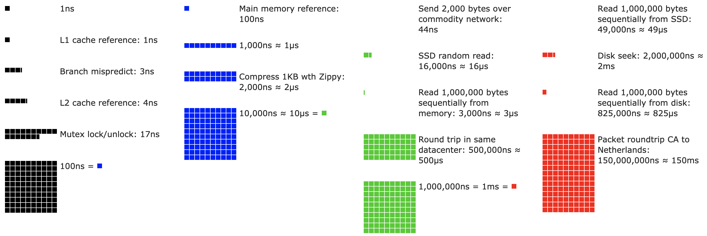
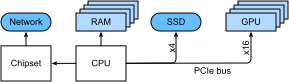
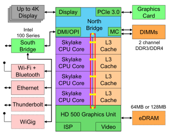
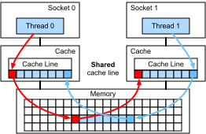
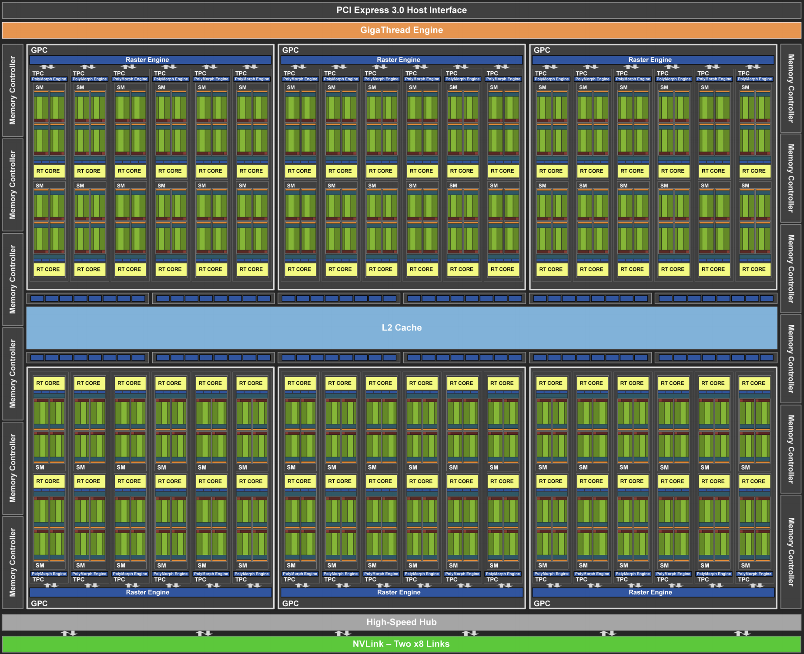
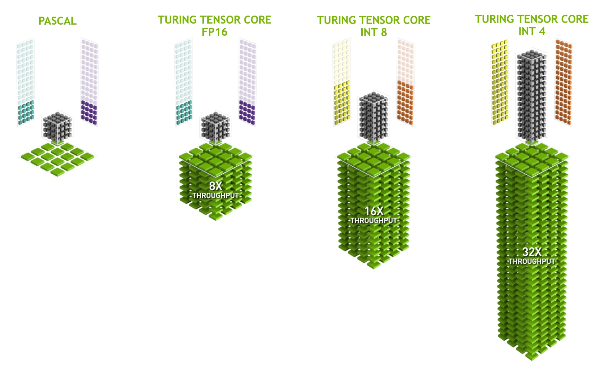

# ハードウェア
:label:`sec_hardware`

優れた性能を持つシステムを構築するには、問題の統計的側面を捉えるアルゴリズムやモデルをよく理解していることが必要である。同時に、基盤となるハードウェアについても少なくともある程度の知識を持っていることが不可欠である。本節は、ハードウェアやシステム設計の正式な講義の代わりにはならない。むしろ、なぜあるアルゴリズムが他より効率的なのか、そしてどうすれば高いスループットを達成できるのかを理解するための出発点として役立つだろう。優れた設計は容易に1桁の差を生み出し、その差が、ネットワークを訓練できるかどうか（たとえば1週間で）と、まったく訓練できないかどうか（3か月かかって締切に間に合わない）を分けることさえある。  
まずコンピュータを見る。次に、CPUとGPUをより詳しく見る。最後に、複数のコンピュータがサーバーセンターやクラウドでどのように接続されているかを概観する。 

:label:`fig_latencynumbers`

せっかちな読者は :numref:`fig_latencynumbers` だけでも十分かもしれない。これは Colin Scott の [interactive post](https://people.eecs.berkeley.edu/%7Ercs/research/interactive_latency.html) から取ったもので、過去10年の進歩の概要をよく示している。元の数値は Jeff Dean の [2010年の Stanford talk](https://static.googleusercontent.com/media/research.google.com/en//people/jeff/Stanford-DL-Nov-2010.pdf) に由来する。  
以下の議論では、これらの数値の背後にあるいくつかの理由と、それらがアルゴリズム設計にどう役立つかを説明する。以下の議論は非常に高レベルで概略的なものである。明らかに、これは正式な講義の*代わりにはならない\*。むしろ、統計モデルを扱う人が適切な設計判断を下すのに十分な情報を提供することを目的としている。コンピュータアーキテクチャの詳細な概説については、 :cite:`Hennessy.Patterson.2011`、あるいは [Arste Asanovic](http://inst.eecs.berkeley.edu/%7Ecs152/sp19/) によるような関連講義を参照しよ。

## コンピュータ

深層学習の研究者や実務者の多くは、かなりの量のメモリ、計算資源、GPUのような何らかのアクセラレータ、あるいはそれらを複数備えたコンピュータを利用できる。コンピュータは次の主要な構成要素から成る。

* プログラムを実行できるプロセッサ（CPUとも呼ばれる）。これはオペレーティングシステムや他の多くの処理も実行し、通常は8コア以上で構成される。
* 計算結果（重みベクトルや活性化、訓練データなど）を保存・取得するためのメモリ（RAM）。
* 1 GB/sから100 GB/sの速度を持つEthernetネットワーク接続（複数ある場合もある）。ハイエンドサーバーでは、より高度な相互接続が使われることもある。
* システムを1つ以上のGPUに接続するための高速拡張バス（PCIe）。サーバーでは最大8個のアクセラレータを備え、しばしば高度なトポロジーで接続される。一方、デスクトップシステムでは、予算や電源容量に応じて1個または2個である。
* 磁気ハードディスクドライブやソリッドステートドライブのような耐久性のあるストレージ。多くの場合PCIeバスを使って接続される。これは、訓練データを効率よくシステムへ転送し、必要に応じて中間チェックポイントを保存する役割を果たする。

:label:`fig_mobo-symbol`

:numref:`fig_mobo-symbol` が示すように、ほとんどの構成要素（ネットワーク、GPU、ストレージ）はPCIeバスを介してCPUに接続されている。PCIeはCPUに直接接続された複数のレーンから成る。たとえば AMD の Threadripper 3 は 64 本の PCIe 4.0 レーンを持ち、それぞれが双方向で 16 Gbit/s のデータ転送が可能です。メモリはCPUに直接接続され、総帯域幅は最大で100 GB/sに達する。

コンピュータ上でコードを実行するときには、データをプロセッサ（CPUまたはGPU）へ送り、計算を行い、その結果をプロセッサからRAMや耐久性のあるストレージへ戻す必要がある。したがって、良い性能を得るには、どれか1つのシステムが大きなボトルネックにならないよう、これらが途切れなく連携することを নিশ্চিতする必要がある。たとえば、画像を十分な速さで読み込めなければ、プロセッサは仕事をすることができない。同様に、行列をCPU（またはGPU）へ十分な速さで移動できなければ、その演算器は手待ちになる。最後に、ネットワークを介して複数のコンピュータを同期させたいなら、ネットワークが計算を遅らせてはならない。1つの方法は、通信と計算を交互に行うことである。では、各構成要素をもう少し詳しく見ていこう。

## メモリ

最も基本的には、メモリはすぐにアクセスできる必要のあるデータを保存するために使われる。現在、CPUのRAMは通常 [DDR4](https://en.wikipedia.org/wiki/DDR4_SDRAM) で、1モジュールあたり20--25 GB/sの帯域幅を提供する。各モジュールは64ビット幅のバスを持つ。通常は複数チャネルを使えるように、メモリモジュールは2枚組で使われる。CPUは2〜4のメモリチャネルを持ち、つまりピークメモリ帯域幅は40 GB/sから100 GB/sの範囲である。しばしば各チャネルに2つのバンクがある。たとえば AMD の Zen 3 Threadripper には8スロットある。

これらの数値は確かに印象的であるが、話の半分しか示していない。メモリの一部を読み出したいとき、まずその情報がどこにあるかをメモリモジュールに伝える必要がある。つまり、最初にRAMへ*アドレス*を送らなければならない。これが済むと、64ビットのレコードを1つだけ読むことも、長いレコード列を読むこともできる。後者は*burst read*と呼ばれる。要するに、メモリへアドレスを送り転送を開始するのに約100 ns（詳細は使用するメモリチップのタイミング係数に依存する）かかり、その後の各転送はわずか0.2 nsである。つまり、最初の読み出しは後続の読み出しの500倍も高価である！ 1秒あたり最大10,000,000回のランダム読み出しが可能だとわかる。これは、できる限りランダムなメモリアクセスを避け、burst read（およびwrite）を使うべきだことを示している。

複数の*bank*があることを考えると、事情は少し複雑になる。各bankはかなり独立にメモリを読み出せる。これは2つの意味を持つ。  
一方では、メモリ全体に均等に分散していれば、実効的なランダム読み出し回数は最大で4倍になる。また、burst readが4倍速い以上、ランダム読み出しを行うのは依然としてよくない、ということでもある。他方では、64ビット境界へのメモリアラインメントのため、あらゆるデータ構造も同じ境界に合わせるのが望ましいである。コンパイラは適切なフラグが設定されていれば、これをかなり[自動的に](https://en.wikipedia.org/wiki/Data_structure_alignment)行う。興味のある読者は、[Zeshan Chishti](http://web.cecs.pdx.edu/%7Ezeshan/ece585_lec5.pdf) による講義のようなDRAMに関する講義を参照するとよいだろう。

GPUメモリは、CPUよりもはるかに多くの演算器を持つため、さらに高い帯域幅が要求される。これに対処する方法は大きく2つある。1つ目は、メモリバスを大幅に広くすることである。たとえば NVIDIA の RTX 2080 Ti は352ビット幅のバスを持つ。これにより、より多くの情報を同時に転送できる。2つ目は、GPUが特定の高性能メモリを使うことである。NVIDIA の RTX や Titan シリーズのような一般向けデバイスは通常、総帯域幅が500 GB/sを超える [GDDR6](https://en.wikipedia.org/wiki/GDDR6_SDRAM) チップを使う。別の選択肢としてHBM（high bandwidth memory）モジュールがある。これは非常に異なるインターフェースを使い、専用のシリコンウェハー上でGPUに直接接続される。そのため非常に高価で、通常は NVIDIA Volta V100 シリーズのようなハイエンドサーバーチップに限って使われる。驚くことではないが、GPUメモリはCPUメモリよりも一般に*はるかに*小さいである。これは前者のコストが高いためである。ここでの目的に関しては、両者の性能特性は概ね似ているが、GPUのほうがずっと高速だと考えてよいだろう。本書の目的では、詳細は安全に無視できる。GPUカーネルを高スループット向けに調整するときにのみ重要になる。

## ストレージ

RAMの重要な特性として*帯域幅*と*レイテンシ*があることを見た。ストレージデバイスにも同じことが当てはまるが、その差はさらに極端になりえる。

### ハードディスクドライブ

*ハードディスクドライブ*（HDD）は半世紀以上使われてきた。要するに、いくつかの回転するプラッタと、任意のトラックを読み書きするために位置決めできるヘッドから成る。ハイエンドのディスクは9枚のプラッタで最大16 TBを保持する。HDDの大きな利点の1つは比較的安価であることである。多くの欠点の1つは、故障モードがしばしば壊滅的であり、読み出しレイテンシが比較的高いことである。

後者を理解するために、HDDが約7,200 RPM（毎分回転数）で回転していることを考えてみよう。もしこれよりずっと速ければ、プラッタに働く遠心力のために破損してしまう。これは、ディスク上の特定のセクタへアクセスするときに大きな欠点になる。つまり、プラッタが所定の位置に回転してくるのを待たなければならない（ヘッドは動かせるが、実際のディスクを加速することはできない）。そのため、要求したデータが利用可能になるまで8 ms以上かかることがある。これを表す一般的な言い方として、HDDは約100 IOPs（input/output operations per second）で動作できる、というものがある。この数値は過去20年間ほとんど変わっていない。さらに悪いことに、帯域幅を増やすのも同様に難しいです（100--200 MB/s程度です）。結局のところ、各ヘッドはビットのトラックを読み取るので、ビットレートは情報密度の平方根にしか比例して増えない。その結果、HDDは急速にアーカイブ用ストレージや、非常に大きなデータセット向けの低グレードなストレージへと追いやられつつある。

### ソリッドステートドライブ

ソリッドステートドライブ（SSD）は、フラッシュメモリを使って情報を永続的に保存する。これにより、保存されたレコードへのアクセスが*はるかに高速*になる。現代のSSDは100,000〜500,000 IOPsで動作でき、つまりHDDより最大で3桁高速である。さらに、帯域幅は1--3GB/sに達し、HDDより1桁高速である。これらの改善は、うますぎて信じられないほどに聞こえる。実際、その設計方法に由来する次のような注意点がある。

* SSDは情報をブロック（256 KB以上）単位で保存する。書き込みはブロック全体としてしか行えず、かなり時間がかかりる。したがって、SSDへのビット単位のランダム書き込みは非常に性能が悪いである。同様に、一般にデータを書き込むこと自体に時間がかかりる。なぜなら、ブロックを読み出し、消去し、その後新しい情報で書き直す必要があるからである。現在ではSSDコントローラとファームウェアがこれを緩和するアルゴリズムを発達させている。それでも、特にQLC（quad level cell）SSDでは書き込みがかなり遅くなりえる。性能向上の鍵は、操作の*キュー*を維持し、読み出しを優先し、可能なら大きなブロックで書き込むことである。
* SSDのメモリセルは比較的早く劣化する（しばしば数千回の書き込み後にはすでに）。ウェアレベリング保護アルゴリズムは、劣化を多くのセルに分散できる。とはいえ、SSDをスワップファイルや大量のログファイルの集約に使うことは推奨されない。
* 最後に、帯域幅の大幅な増加により、コンピュータ設計者はSSDをPCIeバスに直接接続せざるを得なくなった。これに対応できるドライブはNVMe（Non Volatile Memory enhanced）と呼ばれ、最大4本のPCIeレーンを使える。PCIe 4.0では最大8GB/sに相当する。

### クラウドストレージ

クラウドストレージは、設定可能な範囲の性能を提供する。つまり、仮想マシンへのストレージ割り当ては、量の面でも速度の面でも動的であり、ユーザーが選択できる。レイテンシが高すぎる場合、たとえば多数の小さなレコードを使った訓練中などには、割り当てられたIOP数を増やすことを推奨する。

## CPU

中央処理装置（CPU）は、あらゆるコンピュータの中心である。CPUは、機械語を実行できる*プロセッサコア*、それらを接続する*バス*（具体的なトポロジーはプロセッサのモデル、世代、ベンダーによって大きく異なる）、そして主記憶からの読み出しよりも高い帯域幅と低いレイテンシでメモリアクセスを可能にする*キャッシュ*から成る。最後に、現代のほとんどすべてのCPUは、メディア処理や機械学習で一般的な高性能線形代数や畳み込みを支援するための*ベクトル処理ユニット*を備えている。

:label:`fig_skylake`

:numref:`fig_skylake` は、Intel Skylake の一般向け4コアCPUを示している。これは統合GPU、キャッシュ、4コアを接続するリングバスを備えている。Ethernet、WiFi、Bluetooth、SSDコントローラ、USBのような周辺機器は、チップセットの一部であるか、あるいはCPUに直接（PCIeで）接続されている。

### マイクロアーキテクチャ

各プロセッサコアは、かなり洗練された一連の構成要素から成る。詳細は世代やベンダーによって異なるが、基本機能はほぼ標準的である。フロントエンドは命令を読み込み、どの経路が選ばれるかを予測しようとする（たとえば制御フローに対して）。その後、命令はアセンブリコードからマイクロ命令へとデコードされる。アセンブリコードは、しばしばプロセッサが実行する最下層のコードではない。代わりに、複雑な命令はより低レベルの操作の集合へとデコードされることがある。これらは実際の実行コアによって処理される。後者はしばしば、多数の操作を同時に実行できる。たとえば、 :numref:`fig_cortexa77` の ARM Cortex A77 コアは、最大8つの操作を同時に実行できる。

:label:`fig_cortexa77`

これは、独立に実行できるなら、効率的なプログラムは1クロックサイクルあたり複数の命令を実行できる可能性があることを意味する。すべてのユニットが同じ能力を持つわけではない。整数命令を専門とするものもあれば、浮動小数点性能に最適化されたものもある。スループットを高めるため、プロセッサは分岐命令で複数のコード経路を同時に追跡し、実行されなかった分岐の結果を破棄することもある。だからこそ、フロントエンドの分岐予測ユニットが重要であり、最も有望な経路だけが追跡されるのである。

### ベクトル化

深層学習は非常に計算資源を消費する。したがって、CPUを機械学習に適したものにするには、1クロックサイクルで多くの演算を行う必要がある。これはベクトルユニットによって実現される。名称はさまざまで、ARMではNEON、x86では（最近の世代では）[AVX2](https://en.wikipedia.org/wiki/Advanced_Vector_Extensions) ユニットと呼ばれる。共通しているのは、SIMD（single instruction multiple data）演算を実行できることである。 :numref:`fig_neon128` は、ARMで8個の短整数を1クロックサイクルで加算できる様子を示している。

:label:`fig_neon128`

アーキテクチャの選択によっては、このようなレジスタは最大512ビット長で、最大64組の数値を組み合わせられる。たとえば、2つの数を掛けて第3の数に加える、いわゆる fused multiply-add を行うことができる。Intel の [OpenVino](https://01.org/openvinotoolkit) は、これらを使ってサーバーグレードCPU上で深層学習に十分なスループットを実現している。ただし、この数値はGPUが達成できる性能には完全に及ばない。たとえば、NVIDIA の RTX 2080 Ti は4,352個のCUDAコアを持ち、それぞれがそのような演算をいつでも処理できる。

### キャッシュ

次の状況を考えてみよう。上で示した :numref:`fig_skylake` のような、4コアを持つ控えめなCPUコアが2 GHzで動作しているとする。  
さらに、IPC（instructions per clock）が1であり、256ビット幅のAVX2が有効になっていると仮定する。加えて、AVX2演算に使うレジスタの少なくとも1つはメモリから取得する必要があるとする。これは、CPUが1クロックサイクルあたり $4 \times 256 \textrm{ bit} = 128 \textrm{ bytes}$ のデータを消費することを意味する。1秒あたり $2 \times 10^9 \times 128 = 256 \times 10^9$ バイトをプロセッサへ転送できなければ、演算器は手待ちになる。残念ながら、このようなチップのメモリインターフェースは20--40 GB/sのデータ転送しかサポートせず、1桁少ないのである。解決策は、できる限りメモリから*新しい*データを読み込むのを避け、CPU上に局所的にキャッシュすることである。そこでキャッシュが役立ちる。一般に次の名称や概念が使われる。

* **レジスタ** は厳密にはキャッシュの一部ではない。命令の段取りを助ける。とはいえ、CPUレジスタはCPUがクロック速度で遅延なくアクセスできるメモリ位置である。CPUには数十個のレジスタがある。レジスタを効率的に使うかどうかはコンパイラ（またはプログラマ）次第である。たとえばC言語には `register` キーワードがある。
* **L1キャッシュ** は、高いメモリ帯域幅要求に対する最初の防衛線である。L1キャッシュは非常に小さく（典型的なサイズは32--64 KB）、しばしばデータキャッシュと命令キャッシュに分かれている。データがL1キャッシュに見つかれば、アクセスは非常に高速である。そこに見つからなければ、探索はキャッシュ階層の下位へ進みる。
* **L2キャッシュ** が次の段階である。アーキテクチャ設計やプロセッササイズによっては排他的であることもある。特定のコアだけがアクセスできる場合もあれば、複数コアで共有される場合もある。L2キャッシュはL1より大きく（通常は1コアあたり256--512 KB）、遅いである。さらに、L2にあるものへアクセスするには、まずL1にないことを確認する必要があり、その分わずかな追加レイテンシが生じる。
* **L3キャッシュ** は複数コアで共有され、かなり大きくなりえる。AMD の Epyc 3 サーバーCPUは、複数のチップレットにまたがって合計256 MBという巨大なキャッシュを持つ。より一般的な値は4--8 MB程度である。

次にどのメモリ要素が必要になるかを予測することは、チップ設計における重要な最適化パラメータの1つである。たとえば、多くのキャッシュアルゴリズムは後ろ向きよりも前向きに*先読み*しようとするため、メモリを*前方*方向に走査するのが望ましいである。同様に、メモリアクセスパターンを局所的に保つことは性能向上に有効である。

キャッシュを追加するのは諸刃の剣である。一方では、プロセッサコアがデータ不足に陥らないようにする。同時に、チップサイズを増やし、本来なら演算性能向上に使えたはずの面積を消費する。さらに、*キャッシュミス*は高くつくことがある。 :numref:`fig_falsesharing` に示すような最悪のケース、*false sharing* を考えてみよう。あるメモリ位置がプロセッサ0でキャッシュされているときに、プロセッサ1上のスレッドがそのデータを要求する。それを得るには、プロセッサ0は現在の処理を止め、情報を主記憶へ書き戻し、その後プロセッサ1がそれをメモリから読み出せるようにしなければならない。この操作中、両方のプロセッサは待機する。十分にありうることであるが、このようなコードは、効率的な単一プロセッサ実装と比べて、複数プロセッサ上では*遅く*動作する。これも、キャッシュサイズに実用上の限界がある理由の1つです（物理的なサイズ以外にも）。

:label:`fig_falsesharing`

## GPUとその他のアクセラレータ

深層学習がGPUなしでは成功しなかったと主張しても大げさではない。同様に、GPUメーカーの業績が深層学習によって大きく向上したと論じるのも十分に妥当である。ハードウェアとアルゴリズムのこの共進化により、良くも悪くも深層学習が望ましい統計モデリングのパラダイムとなる状況が生まれた。したがって、GPUやTPUのような関連アクセラレータの具体的な利点を理解しておく価値がある :cite:`Jouppi.Young.Patil.ea.2017`。

実務でしばしば行われる区別として、アクセラレータは訓練向けか推論向けかのどちらかに最適化される。推論では、ネットワークの順伝播を計算するだけで十分である。逆伝播のための中間データ保存は不要である。さらに、非常に高精度な計算も必要ないかもしれない（通常はFP16やINT8で十分です）。一方、訓練では勾配を計算するためにすべての中間結果を保存する必要がある。さらに、勾配の蓄積には数値のアンダーフロー（またはオーバーフロー）を避けるため、より高い精度が必要である。つまり、FP16（またはFP32との混合精度）が最低要件になる。これらすべてにより、より高速で大容量のメモリ（HBM2対GDDR6）と、より多くの演算性能が必要になる。たとえば、NVIDIA の [Turing](https://devblogs.nvidia.com/nvidia-turing-architecture-in-depth/) T4 GPUは推論向けに最適化されており、一方V100 GPUは訓練により適している。

:numref:`fig_neon128` で示したベクトル化を思い出してほしい。プロセッサコアにベクトルユニットを追加することで、スループットを大幅に向上させることができた。たとえば、 :numref:`fig_neon128` の例では16個の演算を同時に実行できた。  
まず、ベクトル間の演算だけでなく行列間の演算も最適化するような演算を追加したらどうだろうか。この戦略が tensor core につながった（まもなく説明する）。  
次に、もっと多くのコアを追加したらどうだろうか。要するに、この2つの戦略がGPUの設計判断を要約している。 :numref:`fig_turing_processing_block` は基本的な処理ブロックの概要を示している。そこには16個の整数演算ユニットと16個の浮動小数点演算ユニットがある。それに加えて、2つのtensor coreが、深層学習に関連する追加演算のうち狭い範囲を高速化する。各streaming multiprocessorは、そのようなブロックを4つ含む。

:width:`150px`
:label:`fig_turing_processing_block`

次に、12個のstreaming multiprocessorがgraphics processing clusterにまとめられ、それがハイエンドのTU102プロセッサを構成する。十分なメモリチャネルとL2キャッシュがこの構成を補完する。 :numref:`fig_turing` に関連する詳細がある。このようなデバイスを設計する理由の1つは、必要に応じて個々のブロックを追加・削除でき、よりコンパクトなチップを実現したり、歩留まりの問題（不良モジュールが有効化されない場合など）に対処したりできることである。幸いなことに、こうしたデバイスのプログラミングは、CUDAやフレームワークコードの層の下に隠れており、一般的な深層学習研究者が直接意識することはほとんどない。特に、利用可能な資源があれば、複数のプログラムがGPU上で同時に実行されることも十分ありえる。それでも、デバイスメモリに収まらないモデルを選ばないよう、デバイスの制約を知っておく価値はある。

:width:`350px`
:label:`fig_turing`

最後に、より詳しく触れておく価値があるのは*tensor core*である。これは、深層学習に特に有効な、より最適化された回路を追加する最近の傾向の一例である。たとえば、TPUは高速な行列乗算のためにsystolic array :cite:`Kung.1988` を追加した。そこでは、非常に少数（第1世代TPUでは1つ）の大きな演算をサポートする設計でした。tensor coreはその反対側にある。数値精度に応じて $4 \times 4$ から $16 \times 16$ の行列を扱う小さな演算に最適化されている。 :numref:`fig_tensorcore` は最適化の概要を示している。

:width:`400px`
:label:`fig_tensorcore`

もちろん、計算を最適化すると、ある種の妥協は避けられない。その1つは、GPUは割り込みや疎なデータの処理があまり得意ではないことである。[Gunrock](https://github.com/gunrock/gunrock) :cite:`Wang.Davidson.Pan.ea.2016` のような注目すべき例外はあるが、疎行列や疎ベクトルのアクセスパターンは、GPUが得意とする高帯域幅のburst read操作とは相性がよくない。両方の目標を両立させることは活発な研究分野である。たとえば、グラフ上の深層学習向けに調整されたライブラリ [DGL](http://dgl.ai) を参照しよ。

## ネットワークとバス

単一のデバイスだけでは最適化に不十分な場合、処理を同期するためにデータをそのデバイスへ、またはそこから転送する必要がある。そこでネットワークとバスが役立ちる。設計パラメータとしては、帯域幅、コスト、距離、柔軟性がある。  
一方にはWiFiがある。これはかなり良い到達範囲を持ち、使うのが非常に簡単で（何しろ配線が不要です）、安価であるが、帯域幅とレイテンシは比較的平凡である。正気な機械学習研究者なら、これでサーバークラスタを構築しようとはしないだろう。以下では、深層学習に適した相互接続に焦点を当てる。

* **PCIe** は、非常に高帯域幅のポイントツーポイント接続のための専用バスです（PCIe 4.0の16レーンスロットでは、1レーンあたり最大32 GB/s）。レイテンシは1桁マイクロ秒（5 μs）程度である。PCIeリンクは貴重である。プロセッサが持つ数は限られている。AMD の EPYC 3 は128レーン、Intel の Xeon は1チップあたり最大48レーンである。デスクトップ向けCPUでは、それぞれ20（Ryzen 9）と16（Core i9）である。GPUは通常16レーンを使うため、CPUにフル帯域で接続できるGPUの数は制限される。結局のところ、ストレージやEthernetのような他の高帯域幅周辺機器とリンクを共有しなければならないからである。RAMアクセスと同様に、パケットのオーバーヘッドが減るため、大きな一括転送が望ましいである。
* **Ethernet** は、コンピュータを接続する最も一般的な方法である。PCIeよりかなり遅いものの、導入コストが非常に低く、堅牢で、はるかに長い距離をカバーできる。低グレードのサーバーでは、典型的な帯域幅は1 GBit/sである。より高性能なデバイス（たとえばクラウドの [C5 instances](https://aws.amazon.com/ec2/instance-types/c5/)）では、10〜100 GBit/sの帯域幅が提供される。これまでと同様に、データ伝送にはかなりのオーバーヘッドがある。生のEthernetを直接使うことはほとんどなく、物理的な相互接続の上で実行されるプロトコル（UDPやTCP/IPなど）を使う。これにより、さらにオーバーヘッドが増える。PCIeと同様に、Ethernetは2つのデバイス、たとえばコンピュータとスイッチを接続するよう設計されている。
* **スイッチ** を使うと、任意の2台が（通常はフル帯域幅の）ポイントツーポイント接続を同時に行える形で、複数のデバイスを接続できる。たとえば、Ethernetスイッチは40台のサーバーを高い断面帯域幅で接続できる。スイッチは従来のコンピュータネットワークに固有のものではない。PCIeレーンでさえ[スイッチング](https://www.broadcom.com/products/pcie-switches-bridges/pcie-switches)できる。これは、たとえば [P2 instances](https://aws.amazon.com/ec2/instance-types/p2/) のように、多数のGPUをホストプロセッサに接続する場合に起こりる。
* **NVLink** は、非常に高帯域幅の相互接続におけるPCIeの代替である。1リンクあたり最大300 Gbit/sのデータ転送速度を提供する。サーバー向けGPU（Volta V100）は6リンクを持つが、一般向けGPU（RTX 2080 Ti）は1リンクしかなく、速度も100 Gbit/sに抑えられている。GPU間で高いデータ転送性能を得るには [NCCL](https://github.com/NVIDIA/nccl) の使用を推奨する。

## さらなるレイテンシ数値

:numref:`table_latency_numbers` と :numref:`table_latency_numbers_tesla` の要約は、数値の更新版を [GitHub gist](https://gist.github.com/eshelman/343a1c46cb3fba142c1afdcdeec17646) として管理している [Eliot Eshelman](https://gist.github.com/eshelman) によるものです。

:Common Latency Numbers.

| Action | Time | Notes |
| :----------------------------------------- | -----: | :---------------------------------------------- |
| L1 cache reference/hit                     | 1.5 ns | 4 cycles                                        |
| Floating-point add/mult/FMA                | 1.5 ns | 4 cycles                                        |
| L2 cache reference/hit                     |   5 ns | 12 ~ 17 cycles                                  |
| Branch mispredict                          |   6 ns | 15 ~ 20 cycles                                  |
| L3 cache hit (unshared cache)              |  16 ns | 42 cycles                                       |
| L3 cache hit (shared in another core)      |  25 ns | 65 cycles                                       |
| Mutex lock/unlock                          |  25 ns |                                                 |
| L3 cache hit (modified in another core)    |  29 ns | 75 cycles                                       |
| L3 cache hit (on a remote CPU socket)      |  40 ns | 100 ~ 300 cycles (40 ~ 116 ns)                  |
| QPI hop to a another CPU (per hop)         |  40 ns |                                                 |
| 64MB memory ref. (local CPU)          |  46 ns | TinyMemBench on Broadwell E5-2690v4             |
| 64MB memory ref. (remote CPU)         |  70 ns | TinyMemBench on Broadwell E5-2690v4             |
| 256MB memory ref. (local CPU)         |  75 ns | TinyMemBench on Broadwell E5-2690v4             |
| Intel Optane random write                  |  94 ns | UCSD Non-Volatile Systems Lab                   |
| 256MB memory ref. (remote CPU)        | 120 ns | TinyMemBench on Broadwell E5-2690v4             |
| Intel Optane random read                   | 305 ns | UCSD Non-Volatile Systems Lab                   |
| Send 4KB over 100 Gbps HPC fabric          |   1 μs | MVAPICH2 over Intel Omni-Path                   |
| Compress 1KB with Google Snappy            |   3 μs |                                                 |
| Send 4KB over 10 Gbps ethernet             |  10 μs |                                                 |
| Write 4KB randomly to NVMe SSD             |  30 μs | DC P3608 NVMe SSD (QOS 99% is 500μs)            |
| Transfer 1MB to/from NVLink GPU            |  30 μs | ~33GB/s on NVIDIA 40GB NVLink                 |
| Transfer 1MB to/from PCI-E GPU             |  80 μs | ~12GB/s on PCIe 3.0 x16 link                  |
| Read 4KB randomly from NVMe SSD            | 120 μs | DC P3608 NVMe SSD (QOS 99%)                     |
| Read 1MB sequentially from NVMe SSD        | 208 μs | ~4.8GB/s DC P3608 NVMe SSD                    |
| Write 4KB randomly to SATA SSD             | 500 μs | DC S3510 SATA SSD (QOS 99.9%)                   |
| Read 4KB randomly from SATA SSD            | 500 μs | DC S3510 SATA SSD (QOS 99.9%)                   |
| Round trip within same data center          | 500 μs | One-way ping is ~250μs                          |
| Read 1MB sequentially from SATA SSD        |   2 ms | ~550MB/s DC S3510 SATA SSD                    |
| Read 1MB sequentially from disk            |   5 ms | ~200MB/s server HDD                           |
| Random Disk Access (seek+rotation)         |  10 ms |                                                 |
| Send packet CA->Netherlands->CA            | 150 ms |                                                 |
:label:`table_latency_numbers`

:Latency Numbers for NVIDIA Tesla GPUs.

| Action | Time | Notes |
| :------------------------------ | -----: | :---------------------------------------- |
| GPU Shared Memory access        |  30 ns | 30~90 cycles (bank conflicts add latency) |
| GPU Global Memory access        | 200 ns | 200~800 cycles                            |
| Launch CUDA kernel on GPU       |  10 μs | Host CPU instructs GPU to start kernel    |
| Transfer 1MB to/from NVLink GPU |  30 μs | ~33GB/s on NVIDIA 40GB NVLink           |
| Transfer 1MB to/from PCI-E GPU  |  80 μs | ~12GB/s on PCI-Express x16 link         |
:label:`table_latency_numbers_tesla`

## まとめ

* デバイスには操作ごとのオーバーヘッドがある。したがって、多数の小さな転送よりも、少数の大きな転送を目指すことが重要である。これはRAM、SSD、ネットワーク、GPUに当てはまる。
* 性能にはベクトル化が重要である。自分のアクセラレータが持つ具体的な能力を把握しておきよう。たとえば、あるIntel Xeon CPUはINT8演算に特に優れ、NVIDIA Volta GPUはFP16の行列-行列演算で卓越し、NVIDIA TuringはFP16、INT8、INT4演算で優れている。
* 小さなデータ型による数値オーバーフローは、訓練中（推論ではそれよりは少ないですが）問題になることがある。
* エイリアシングは性能を大きく低下させることがある。たとえば、64ビットCPUでのメモリアラインメントは64ビット境界に合わせるべきである。GPUでは、畳み込みサイズをtensor coreに合わせて整列させるのがよいだろう。
* アルゴリズムをハードウェアに合わせましょう（たとえばメモリフットプリントや帯域幅）。パラメータがキャッシュに収まると、非常に大きな高速化（1桁以上）が得られる。
* 新しいアルゴリズムの性能は、実験結果を検証する前に紙の上で見積もることを推奨する。1桁以上の不一致は懸念材料である。
* 性能ボトルネックのデバッグにはプロファイラを使いよう。
* 訓練用と推論用のハードウェアは、価格性能比の観点で異なる最適点を持つ。

## 演習

1. 外部メモリインターフェースに対して整列している場合と不整列な場合で、メモリアクセス速度に差があるかどうかを調べるCコードを書きなさい。ヒント: キャッシュ効果に注意すること。
1. 連続アクセスと、あるストライドを持つアクセスの速度差を調べなさい。
1. CPUのキャッシュサイズをどのように測定できるか？
1. 最大帯域幅を得るには、複数のメモリチャネルにデータをどのように配置するか？ 多数の小さなスレッドがある場合はどうするか？
1. エンタープライズクラスのHDDが10,000 rpmで回転しているとする。最悪の場合、HDDがデータを読み出せるようになるまでに絶対に必要な最小時間はどれくらいか（ヘッドはほぼ瞬時に動くと仮定してよい）？ なぜ2.5" HDDが商用サーバーで人気になりつつあるのだろうか。（3.5" や 5.25" ドライブと比べて）？
1. HDDメーカーが記録密度を1平方インチあたり1 Tbitから5 Tbitに増やしたとする。2.5" HDDの1つのトラック上にどれだけの情報を保存できるか？ 内側トラックと外側トラックで違いはあるか？
1. 8ビットから16ビットのデータ型にすると、必要なシリコン量はおよそ4倍になる。なぜだろうか。 NVIDIA が Turing GPU に INT4 演算を追加したのはなぜだと思うか？
1. メモリを前方に読むのと後方に読むのでは、どれくらい速さが違いますか？ この数値はコンピュータやCPUベンダーによって異なるか？ なぜだろうか。 Cコードを書いて実験しなさい。
1. ディスクのキャッシュサイズを測定できるか？ 一般的なHDDではどれくらいですか？ SSDにもキャッシュは必要ですか？
1. Ethernetを介してメッセージを送るときのパケットオーバーヘッドを測定しなさい。UDPとTCP/IP接続の違いを調べなさい。
1. Direct memory access により、CPU以外のデバイスがメモリへ直接書き込み（および読み出し）できる。なぜこれは良い考えなのだろうか。
1. Turing T4 GPU の性能数値を見なさい。FP16からINT8やINT4へ移ると性能が「たった」2倍にしかならないのはなぜだろうか。
1. サンフランシスコとアムステルダムの間で、パケットの往復にかかる最短時間はどれくらいであるべきですか？ ヒント: 距離は10,000 kmと仮定してよいである。
