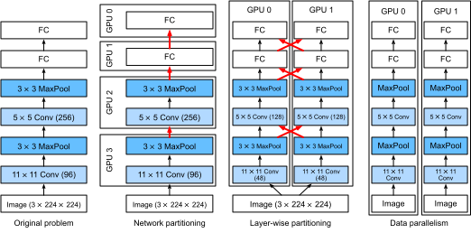

# 複数GPUでの学習
:label:`sec_multi_gpu`

これまで、CPUとGPU上でモデルを効率よく学習する方法について議論してきました。さらに、 :numref:`sec_auto_para` では、深層学習フレームワークがそれらの間で計算と通信を自動的に並列化できることも示しました。また、 :numref:`sec_use_gpu` では、`nvidia-smi` コマンドを使ってコンピュータ上で利用可能なGPUをすべて一覧表示する方法も示しました。  
しかし、実際に深層学習の学習をどのように並列化するのかについては、まだ議論していませんでした。  
その代わりに、データを何らかの形で複数デバイスに分割して動作させる、ということを暗黙に仄めかしていました。本節ではその詳細を補い、ゼロからネットワークを並列に学習する方法を示します。高レベルAPIの機能を活用する方法については、 :numref:`sec_multi_gpu_concise` に譲ります。  
ここでは、 :numref:`sec_minibatch_sgd` で説明したようなミニバッチ確率的勾配降下法に慣れていることを前提とします。


## 問題の分割

まずは、単純なコンピュータビジョン問題と、やや古典的なネットワーク、たとえば複数層の畳み込み、プーリング、そして最後にいくつかの全結合層を持つものから始めましょう。  
つまり、LeNet :cite:`LeCun.Bottou.Bengio.ea.1998` や AlexNet :cite:`Krizhevsky.Sutskever.Hinton.2012` にかなり似たネットワークから始めます。  
複数のGPU（デスクトップサーバなら2枚、AWS g4dn.12xlarge インスタンスなら4枚、p3.16xlarge なら8枚、p2.16xlarge なら16枚）があるとき、単純で再現性のある設計方針の恩恵を受けつつ、良好な高速化を達成できるように学習を分割したいと考えます。結局のところ、複数GPUは *メモリ* と *計算能力* の両方を増やします。要するに、分類したい学習データのミニバッチが与えられたとき、次の選択肢があります。

まず、ネットワークを複数GPUにまたがって分割する方法があります。つまり、各GPUが特定の層へ流れ込むデータを入力として受け取り、いくつかの後続層にわたってデータを処理し、その後データを次のGPUへ送ります。  
これにより、単一GPUでは扱えないより大きなネットワークでデータを処理できます。  
さらに、GPUごとのメモリ使用量も十分に制御できます（全ネットワークのメモリ使用量の一部で済みます）。

しかし、層間のインターフェース（したがってGPU間のインターフェース）には厳密な同期が必要です。特に、層ごとの計算負荷が適切に釣り合っていない場合、これは厄介です。GPUの数が増えると、この問題はさらに悪化します。  
層間のインターフェースでは、活性化や勾配など、大量のデータ転送も必要になります。  
これはGPUバスの帯域幅を圧迫する可能性があります。  
さらに、計算集約的でありながら逐次的な操作を分割するのは容易ではありません。この点についての最善の試みとしては、たとえば :citet:`Mirhoseini.Pham.Le.ea.2017` を参照してください。これは依然として難しい問題であり、非自明な問題に対して良い（線形な）スケーリングを達成できるかどうかは明らかではありません。複数GPUを連結するための優れたフレームワークやオペレーティングシステムの支援がない限り、推奨しません。

第二に、作業を層単位で分割する方法があります。たとえば、単一GPUで64チャネルを計算する代わりに、問題を4枚のGPUに分割し、それぞれが16チャネル分のデータを生成するようにできます。  
同様に、全結合層では出力ユニット数を分割できます。 :numref:`fig_alexnet_original`（:citet:`Krizhevsky.Sutskever.Hinton.2012` より引用）はこの設計を示しており、当時はGPUのメモリ容量が非常に小さかった（当時2GB）ため、この戦略が用いられていました。  
チャネル数（またはユニット数）が小さすぎない限り、計算の観点では良好なスケーリングが可能です。  
さらに、利用可能メモリは線形に増えるため、複数GPUを使えばより大きなネットワークを処理できます。


:label:`fig_alexnet_original`

しかし、各層が他のすべての層の結果に依存するため、同期操作やバリア操作が *非常に多く* 必要になります。  
さらに、転送が必要なデータ量は、GPU間で層を分散する場合よりもさらに大きくなる可能性があります。したがって、帯域幅コストと複雑さのため、この方法は推奨しません。

最後に、データを複数GPUに分割する方法があります。この方法では、すべてのGPUが異なる観測に対してではあるものの、同じ種類の作業を行います。各ミニバッチの学習後に、勾配がGPU間で集約されます。  
これは最も単純な方法であり、どのような状況にも適用できます。  
必要なのは、各ミニバッチの後に同期することだけです。とはいえ、他の勾配がまだ計算中のうちから、勾配パラメータの交換を始められると非常に望ましいです。  
さらに、GPU数が増えるとミニバッチサイズも大きくなるため、学習効率が向上します。  
ただし、GPUを増やしても、より大きなモデルを学習できるようにはなりません。



:label:`fig_splitting`


複数GPUでのさまざまな並列化方法の比較を :numref:`fig_splitting` に示します。  
概して、十分に大きなメモリを持つGPUにアクセスできるなら、データ並列が最も便利な方法です。分散学習のための分割についての詳細な説明は :cite:`Li.Andersen.Park.ea.2014` も参照してください。深層学習初期にはGPUメモリが問題でしたが、現在では非常に特殊な場合を除いてこの問題は解決されています。以下ではデータ並列に焦点を当てます。

## データ並列

1台のマシンに $k$ 枚のGPUがあると仮定します。学習するモデルが与えられると、各GPUは独立にモデルパラメータの完全な集合を保持します。ただし、GPU間のパラメータ値は同一であり、同期されています。  
例として、 :numref:`fig_data_parallel` は $k=2$ のときのデータ並列による学習を示しています。


:label:`fig_data_parallel`

一般に、学習は次のように進みます。

* 学習の任意の反復で、ランダムなミニバッチが与えられたら、バッチ内の例を $k$ 個の部分に分け、GPUに均等に分配します。
* 各GPUは、自分に割り当てられたミニバッチ部分に基づいて、モデルパラメータの損失と勾配を計算します。
* $k$ 枚のGPUの局所勾配を集約して、現在のミニバッチ確率的勾配を得ます。
* 集約された勾配を各GPUに再配布します。
* 各GPUは、このミニバッチ確率的勾配を使って、自分が保持しているモデルパラメータの完全な集合を更新します。


実際には、$k$ 枚のGPUで学習するときにはミニバッチサイズを $k$ 倍に *増やす* のが普通です。そうすることで、各GPUが単一GPUで学習する場合と同じ量の仕事をすることになります。16枚GPUのサーバでは、ミニバッチサイズがかなり大きくなるため、それに応じて学習率も増やす必要があるかもしれません。  
また、 :numref:`sec_batch_norm` のバッチ正規化は調整が必要で、たとえばGPUごとに別々のバッチ正規化係数を保持する方法があります。  
以下では、複数GPU学習を説明するためにおもちゃのネットワークを使います。

```{.python .input}
#@tab mxnet
%matplotlib inline
from d2l import mxnet as d2l
from mxnet import autograd, gluon, np, npx
npx.set_np()
```

```{.python .input}
#@tab pytorch
%matplotlib inline
from d2l import torch as d2l
import torch
from torch import nn
from torch.nn import functional as F
```

## [**おもちゃのネットワーク**]

:numref:`sec_lenet` で導入した LeNet を少し変更して使います。パラメータ交換と同期を詳細に示すため、これをゼロから定義します。

```{.python .input}
#@tab mxnet
# Initialize model parameters
scale = 0.01
W1 = np.random.normal(scale=scale, size=(20, 1, 3, 3))
b1 = np.zeros(20)
W2 = np.random.normal(scale=scale, size=(50, 20, 5, 5))
b2 = np.zeros(50)
W3 = np.random.normal(scale=scale, size=(800, 128))
b3 = np.zeros(128)
W4 = np.random.normal(scale=scale, size=(128, 10))
b4 = np.zeros(10)
params = [W1, b1, W2, b2, W3, b3, W4, b4]

# Define the model
def lenet(X, params):
    h1_conv = npx.convolution(data=X, weight=params[0], bias=params[1],
                              kernel=(3, 3), num_filter=20)
    h1_activation = npx.relu(h1_conv)
    h1 = npx.pooling(data=h1_activation, pool_type='avg', kernel=(2, 2),
                     stride=(2, 2))
    h2_conv = npx.convolution(data=h1, weight=params[2], bias=params[3],
                              kernel=(5, 5), num_filter=50)
    h2_activation = npx.relu(h2_conv)
    h2 = npx.pooling(data=h2_activation, pool_type='avg', kernel=(2, 2),
                     stride=(2, 2))
    h2 = h2.reshape(h2.shape[0], -1)
    h3_linear = np.dot(h2, params[4]) + params[5]
    h3 = npx.relu(h3_linear)
    y_hat = np.dot(h3, params[6]) + params[7]
    return y_hat

# Cross-entropy loss function
loss = gluon.loss.SoftmaxCrossEntropyLoss()
```

```{.python .input}
#@tab pytorch
# Initialize model parameters
scale = 0.01
W1 = torch.randn(size=(20, 1, 3, 3)) * scale
b1 = torch.zeros(20)
W2 = torch.randn(size=(50, 20, 5, 5)) * scale
b2 = torch.zeros(50)
W3 = torch.randn(size=(800, 128)) * scale
b3 = torch.zeros(128)
W4 = torch.randn(size=(128, 10)) * scale
b4 = torch.zeros(10)
params = [W1, b1, W2, b2, W3, b3, W4, b4]

# Define the model
def lenet(X, params):
    h1_conv = F.conv2d(input=X, weight=params[0], bias=params[1])
    h1_activation = F.relu(h1_conv)
    h1 = F.avg_pool2d(input=h1_activation, kernel_size=(2, 2), stride=(2, 2))
    h2_conv = F.conv2d(input=h1, weight=params[2], bias=params[3])
    h2_activation = F.relu(h2_conv)
    h2 = F.avg_pool2d(input=h2_activation, kernel_size=(2, 2), stride=(2, 2))
    h2 = h2.reshape(h2.shape[0], -1)
    h3_linear = torch.mm(h2, params[4]) + params[5]
    h3 = F.relu(h3_linear)
    y_hat = torch.mm(h3, params[6]) + params[7]
    return y_hat

# Cross-entropy loss function
loss = nn.CrossEntropyLoss(reduction='none')
```

## データ同期

効率的な複数GPU学習には、2つの基本操作が必要です。  
まず、[**パラメータのリストを複数デバイスに配布する**] 能力と、勾配を付加する能力（`get_params`）が必要です。パラメータがなければ、GPU上でネットワークを評価することはできません。  
第二に、複数デバイス間でパラメータを合計する能力、つまり `allreduce` 関数が必要です。

```{.python .input}
#@tab mxnet
def get_params(params, device):
    new_params = [p.copyto(device) for p in params]
    for p in new_params:
        p.attach_grad()
    return new_params
```

```{.python .input}
#@tab pytorch
def get_params(params, device):
    new_params = [p.to(device) for p in params]
    for p in new_params:
        p.requires_grad_()
    return new_params
```

モデルパラメータを1枚のGPUにコピーして試してみましょう。

```{.python .input}
#@tab all
new_params = get_params(params, d2l.try_gpu(0))
print('b1 weight:', new_params[1])
print('b1 grad:', new_params[1].grad)
```

まだ何の計算もしていないので、バイアスパラメータに関する勾配はまだゼロです。  
次に、複数GPUに分散されたベクトルがあると仮定しましょう。次の [**`allreduce` 関数は、すべてのベクトルを加算し、その結果をすべてのGPUにブロードキャストします**]。これを動かすには、結果を集約するデバイスへデータをコピーする必要があることに注意してください。

```{.python .input}
#@tab mxnet
def allreduce(data):
    for i in range(1, len(data)):
        data[0][:] += data[i].copyto(data[0].ctx)
    for i in range(1, len(data)):
        data[0].copyto(data[i])
```

```{.python .input}
#@tab pytorch
def allreduce(data):
    for i in range(1, len(data)):
        data[0][:] += data[i].to(data[0].device)
    for i in range(1, len(data)):
        data[i][:] = data[0].to(data[i].device)
```

異なるデバイス上で異なる値を持つベクトルを作成し、それらを集約してみましょう。

```{.python .input}
#@tab mxnet
data = [np.ones((1, 2), ctx=d2l.try_gpu(i)) * (i + 1) for i in range(2)]
print('before allreduce:\n', data[0], '\n', data[1])
allreduce(data)
print('after allreduce:\n', data[0], '\n', data[1])
```

```{.python .input}
#@tab pytorch
data = [torch.ones((1, 2), device=d2l.try_gpu(i)) * (i + 1) for i in range(2)]
print('before allreduce:\n', data[0], '\n', data[1])
allreduce(data)
print('after allreduce:\n', data[0], '\n', data[1])
```

## データの分配

ミニバッチを複数GPUに均等に [**分配する**] ための簡単なユーティリティ関数が必要です。たとえば、2枚のGPUでは、データの半分をそれぞれのGPUにコピーしたいとします。  
より便利で簡潔なので、まずは深層学習フレームワークの組み込み関数を使って、$4 \times 5$ 行列で試してみましょう。

```{.python .input}
#@tab mxnet
data = np.arange(20).reshape(4, 5)
devices = [npx.gpu(0), npx.gpu(1)]
split = gluon.utils.split_and_load(data, devices)
print('input :', data)
print('load into', devices)
print('output:', split)
```

```{.python .input}
#@tab pytorch
data = torch.arange(20).reshape(4, 5)
devices = [torch.device('cuda:0'), torch.device('cuda:1')]
split = nn.parallel.scatter(data, devices)
print('input :', data)
print('load into', devices)
print('output:', split)
```

後で再利用できるように、データとラベルの両方を分割する `split_batch` 関数を定義します。

```{.python .input}
#@tab mxnet
#@save
def split_batch(X, y, devices):
    """Split `X` and `y` into multiple devices."""
    assert X.shape[0] == y.shape[0]
    return (gluon.utils.split_and_load(X, devices),
            gluon.utils.split_and_load(y, devices))
```

```{.python .input}
#@tab pytorch
#@save
def split_batch(X, y, devices):
    """Split `X` and `y` into multiple devices."""
    assert X.shape[0] == y.shape[0]
    return (nn.parallel.scatter(X, devices),
            nn.parallel.scatter(y, devices))
```

## 学習

これで、[**単一ミニバッチに対する複数GPU学習**] を実装できます。その実装は主として、本節で説明したデータ並列のアプローチに基づいています。複数GPU間でデータを同期するために、先ほど説明した補助関数 `allreduce` と `split_and_load` を使います。並列性を実現するために特別なコードを書く必要がないことに注意してください。ミニバッチ内では計算グラフにデバイス間の依存関係がないため、計算は *自動的に* 並列実行されます。

```{.python .input}
#@tab mxnet
def train_batch(X, y, device_params, devices, lr):
    X_shards, y_shards = split_batch(X, y, devices)
    with autograd.record():  # Loss is calculated separately on each GPU
        ls = [loss(lenet(X_shard, device_W), y_shard)
              for X_shard, y_shard, device_W in zip(
                  X_shards, y_shards, device_params)]
    for l in ls:  # Backpropagation is performed separately on each GPU
        l.backward()
    # Sum all gradients from each GPU and broadcast them to all GPUs
    for i in range(len(device_params[0])):
        allreduce([device_params[c][i].grad for c in range(len(devices))])
    # The model parameters are updated separately on each GPU
    for param in device_params:
        d2l.sgd(param, lr, X.shape[0])  # Here, we use a full-size batch
```

```{.python .input}
#@tab pytorch
def train_batch(X, y, device_params, devices, lr):
    X_shards, y_shards = split_batch(X, y, devices)
    # Loss is calculated separately on each GPU
    ls = [loss(lenet(X_shard, device_W), y_shard).sum()
          for X_shard, y_shard, device_W in zip(
              X_shards, y_shards, device_params)]
    for l in ls:  # Backpropagation is performed separately on each GPU
        l.backward()
    # Sum all gradients from each GPU and broadcast them to all GPUs
    with torch.no_grad():
        for i in range(len(device_params[0])):
            allreduce([device_params[c][i].grad for c in range(len(devices))])
    # The model parameters are updated separately on each GPU
    for param in device_params:
        d2l.sgd(param, lr, X.shape[0]) # Here, we use a full-size batch
```

次に、[**学習関数**] を定義できます。これは前の章で使ったものとは少し異なります。GPUを割り当て、すべてのモデルパラメータをすべてのデバイスにコピーする必要があるからです。  
もちろん、各バッチは複数GPUを扱うために `train_batch` 関数で処理されます。便宜上（そしてコードを簡潔にするため）、精度の計算は1枚のGPU上で行いますが、他のGPUはアイドル状態になるため、これは *非効率的* です。

```{.python .input}
#@tab mxnet
def train(num_gpus, batch_size, lr):
    train_iter, test_iter = d2l.load_data_fashion_mnist(batch_size)
    devices = [d2l.try_gpu(i) for i in range(num_gpus)]
    # Copy model parameters to `num_gpus` GPUs
    device_params = [get_params(params, d) for d in devices]
    num_epochs = 10
    animator = d2l.Animator('epoch', 'test acc', xlim=[1, num_epochs])
    timer = d2l.Timer()
    for epoch in range(num_epochs):
        timer.start()
        for X, y in train_iter:
            # Perform multi-GPU training for a single minibatch
            train_batch(X, y, device_params, devices, lr)
            npx.waitall()
        timer.stop()
        # Evaluate the model on GPU 0
        animator.add(epoch + 1, (d2l.evaluate_accuracy_gpu(
            lambda x: lenet(x, device_params[0]), test_iter, devices[0]),))
    print(f'test acc: {animator.Y[0][-1]:.2f}, {timer.avg():.1f} sec/epoch '
          f'on {str(devices)}')
```

```{.python .input}
#@tab pytorch
def train(num_gpus, batch_size, lr):
    train_iter, test_iter = d2l.load_data_fashion_mnist(batch_size)
    devices = [d2l.try_gpu(i) for i in range(num_gpus)]
    # Copy model parameters to `num_gpus` GPUs
    device_params = [get_params(params, d) for d in devices]
    num_epochs = 10
    animator = d2l.Animator('epoch', 'test acc', xlim=[1, num_epochs])
    timer = d2l.Timer()
    for epoch in range(num_epochs):
        timer.start()
        for X, y in train_iter:
            # Perform multi-GPU training for a single minibatch
            train_batch(X, y, device_params, devices, lr)
            torch.cuda.synchronize()
        timer.stop()
        # Evaluate the model on GPU 0
        animator.add(epoch + 1, (d2l.evaluate_accuracy_gpu(
            lambda x: lenet(x, device_params[0]), test_iter, devices[0]),))
    print(f'test acc: {animator.Y[0][-1]:.2f}, {timer.avg():.1f} sec/epoch '
          f'on {str(devices)}')
```

これが [**単一GPU上**] でどの程度うまく動くか見てみましょう。  
まず、バッチサイズを256、学習率を0.2にします。

```{.python .input}
#@tab all
train(num_gpus=1, batch_size=256, lr=0.2)
```

バッチサイズと学習率を変えずに [**GPU数を2に増やす**] と、テスト精度は前の実験と比べておおむね同じままであることがわかります。  
最適化アルゴリズムの観点では、両者は同一です。残念ながら、ここでは意味のある高速化は得られません。モデルが単純に小さすぎるうえ、データセットも小さいためです。また、複数GPU学習の実装にやや洗練されていない方法を使っているため、Pythonのオーバーヘッドも大きくなっています。今後は、より複雑なモデルと、より洗練された並列化の方法に出会うことになります。  
とはいえ、Fashion-MNIST で何が起こるか見てみましょう。

```{.python .input}
#@tab all
train(num_gpus=2, batch_size=256, lr=0.2)
```

## まとめ

* 深層ネットワークの学習を複数GPUに分割する方法はいくつかあります。層間で分割する方法、層ごとに分割する方法、データに分割する方法です。前の2つは、綿密に調整されたデータ転送を必要とします。データ並列が最も単純な戦略です。
* データ並列学習は簡単です。ただし、効率を高めるために実効ミニバッチサイズを増やします。
* データ並列では、データを複数GPUに分割し、各GPUが独自に順伝播と逆伝播を実行し、その後で勾配を集約して結果をGPUにブロードキャストします。
* より大きなミニバッチに対しては、学習率を少し大きくしてもよいでしょう。

## 演習

1. $k$ 枚のGPUで学習するとき、ミニバッチサイズを $b$ から $k \cdot b$ に変更し、つまりGPU数に応じて拡大しなさい。
1. 異なる学習率で精度を比較しなさい。GPU数に応じてどのようにスケールするか。
1. 異なるGPU上の異なるパラメータを集約する、より効率的な `allreduce` 関数を実装しなさい。なぜそれがより効率的なのか。
1. 複数GPUでのテスト精度計算を実装しなさい。

:begin_tab:`mxnet`
[Discussions](https://discuss.d2l.ai/t/364)
:end_tab:

:begin_tab:`pytorch`
[Discussions](https://discuss.d2l.ai/t/1669)
:end_tab:\n