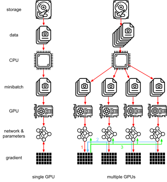
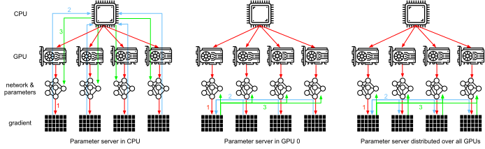
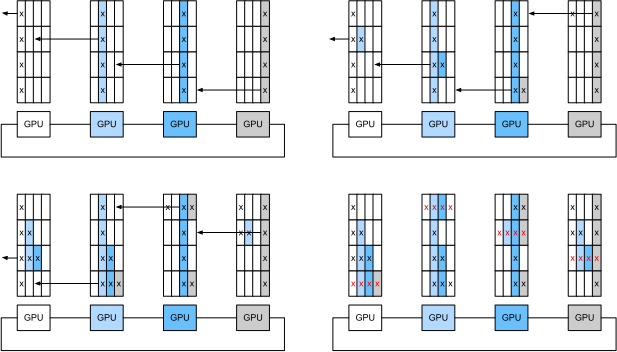
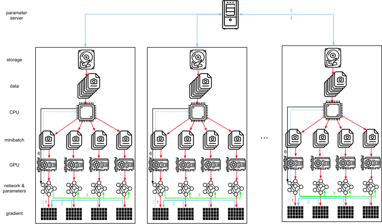

# パラメータサーバー
:label:`sec_parameterserver`

単一GPUから複数GPUへ、さらに複数GPUを含む複数サーバーへと移行し、それらが複数のラックやネットワークスイッチにまたがって配置される可能性があるにつれて、
分散・並列学習のためのアルゴリズムは、より高度なものにする必要があります。詳細は重要です。というのも、相互接続方式によって帯域幅は大きく異なるからです（たとえば、NVLink は適切な設定では 6 本のリンクを通じて最大 100 GB/s を提供でき、PCIe 4.0（16レーン）は 32 GB/s を提供します。一方、高速な 100GbE Ethernet でさえ 10 GB/s にすぎません）。同時に、統計モデリングの専門家にネットワークやシステムの専門家であることを期待するのは無理があります。

パラメータサーバーの中核となるアイデアは、分散潜在変数モデルの文脈で :citet:`Smola.Narayanamurthy.2010` により導入されました。その後、push と pull の意味論について :citet:`Ahmed.Aly.Gonzalez.ea.2012` で説明され、システムとオープンソースライブラリについて :citet:`Li.Andersen.Park.ea.2014` で説明されました。以下では、効率化に必要な構成要素を動機づけます。

## データ並列学習

分散学習におけるデータ並列学習のアプローチを見直しましょう。この節では、他のすべての方法を除外してこれを用います。というのも、実際の実装がかなり सरल単純だからです。GPU には現在十分なメモリがあるため、（グラフ上の深層学習を除けば）他の並列化戦略が好まれる実用例はほとんどありません。:numref:`fig_parameterserver` は、:numref:`sec_multi_gpu` で実装したデータ並列性の変種を示しています。その要点は、更新されたパラメータをすべての GPU に再配布する前に、勾配の集約を 1 枚の GPU（GPU 0）上で行うことです。

:label:`fig_parameterserver`

振り返ってみると、GPU 0 上で集約するという判断はかなり場当たり的に見えます。結局のところ、CPU 上で集約してもよいはずです。実際、あるパラメータは 1 枚の GPU 上で、別のパラメータは別の GPU 上で集約することさえできます。最適化アルゴリズムがそれをサポートしている限り、そうできない理由は特にありません。たとえば、勾配 $\mathbf{g}_1, \ldots, \mathbf{g}_4$ に対応する 4 つのパラメータベクトルがあるなら、それぞれの $\mathbf{g}_i$（$i = 1, \ldots, 4$）について、勾配を 1 枚の GPU 上で集約できます。

この考え方は恣意的で軽率に見えるかもしれません。確かに、数学的にはどこでも同じです。しかし、:numref:`sec_hardware` で述べたように、私たちは帯域幅の異なるバスを持つ現実の物理ハードウェアを扱っています。
:numref:`fig_bw_hierarchy` に示すような実際の 4-way GPU サーバーを考えてみましょう。特に接続が良ければ、100 GbE のネットワークカードを備えているかもしれません。より一般的なのは 1--10 GbE の範囲で、有効帯域幅は 100 MB/s から 1 GB/s 程度です。
CPU にはすべての GPU に直接接続するのに十分な PCIe レーンがないため（たとえば、コンシューマ向け Intel CPU では 24 レーンです）、[マルチプレクサ](https://www.broadcom.com/products/pcie-switches-bridges/pcie-switches) が必要になります。CPU から 16x Gen3 リンクでの帯域幅は 16 GB/s です。これは、各 GPU がスイッチに接続される速度でもあります。つまり、デバイス間で通信するほうがより効率的なのです。

:label:`fig_bw_hierarchy`

議論のために、勾配のサイズが 160 MB だと仮定しましょう。この場合、残りの 3 枚の GPU から 4 枚目の GPU に勾配を送るのに 30 ms かかります（各転送は 10 ms = 160 MB / 16 GB/s）。さらに重みベクトルを送り返すのに 30 ms かかるので、合計 60 ms になります。
すべてのデータを CPU に送ると、4 枚の GPU *それぞれ* が CPU にデータを送る必要があるため 40 ms の追加コストが発生し、合計 80 ms になります。最後に、勾配を 40 MB ずつ 4 つに分割できると仮定しましょう。すると、PCIe スイッチはすべてのリンク間でフル帯域幅の通信を提供するので、各部分を別々の GPU 上で *同時に* 集約できます。30 ms の代わりに 7.5 ms で済み、同期操作全体は 15 ms になります。要するに、パラメータをどのように同期するかによって、同じ操作が 15 ms から 80 ms まで変わり得るのです。:numref:`fig_ps_distributed` は、パラメータ交換のさまざまな戦略を示しています。

:label:`fig_ps_distributed`

性能向上のために利用できる別の手段があることにも注意してください。深いネットワークでは、上から下までのすべての勾配を計算するのにある程度の時間がかかります。したがって、他のパラメータ群の勾配を計算している最中であっても、いくつかのパラメータ群については同期を開始できます。これを Horovod でどのように行うかについては、たとえば :citet:`Sergeev.Del-Balso.2018` を参照してください。

## リング同期

現代の深層学習ハードウェアで同期を行う際には、しばしばかなり特殊なネットワーク接続に遭遇します。たとえば、AWS p3.16xlarge と NVIDIA DGX-2 のインスタンスは :numref:`fig_nvlink` の接続構造を共有しています。各 GPU は PCIe リンクを介してホスト CPU に接続されており、その速度は最大でも 16 GB/s です。さらに各 GPU には 6 本の NVLink 接続があり、それぞれが双方向で 300 Gbit/s の転送能力を持ちます。これは 1 リンク・1 方向あたり約 18 GB/s に相当します。要するに、NVLink の総帯域幅は PCIe の帯域幅よりかなり大きいのです。問題は、それを最も効率的に使う方法です。

:label:`fig_nvlink`

最適な同期戦略は、ネットワークを 2 つのリングに分解し、それらを使ってデータを直接同期することだと分かっています :cite:`Wang.Li.Liberty.ea.2018`。:numref:`fig_nvlink_twoloop` は、ネットワークが 1 つのリング（1-2-3-4-5-6-7-8-1、NVLink 帯域幅が 2 倍）と、もう 1 つのリング（1-4-6-3-5-8-2-7-1、通常の帯域幅）に分解できることを示しています。この場合に効率的な同期プロトコルを設計するのは容易ではありません。

:label:`fig_nvlink_twoloop`

次の思考実験を考えてみましょう。$n$ 個の計算ノード（または GPU）からなるリングがあるとします。最初のノードから 2 番目のノードへ勾配を送ることができます。そこでそれはローカル勾配に加えられ、3 番目のノードへ送られ、以下同様に続きます。$n-1$ ステップ後には、集約された勾配は最後に訪れたノードに存在します。つまり、勾配の集約にかかる時間はノード数に対して線形に増加します。しかし、この方法ではアルゴリズムはかなり非効率です。結局のところ、どの時点でも通信しているノードは 1 つしかありません。もし勾配を $n$ 個のチャンクに分割し、チャンク $i$ の同期をノード $i$ から開始したらどうでしょうか？
各チャンクのサイズは $1/n$ なので、総時間は $(n-1)/n \approx 1$ になります。言い換えると、勾配の集約に費やす時間は、リングのサイズを大きくしても *増加しない* のです。これは非常に驚くべき結果です。:numref:`fig_ringsync` は、$n=4$ ノードでの手順を示しています。

:label:`fig_ringsync`

8 枚の V100 GPU 間で 160 MB を同期する同じ例を用いると、およそ $2 \cdot 160 \textrm{MB} / (3 \cdot 18 \textrm{GB/s}) \approx 6 \textrm{ms}$ になります。これは、8 枚の GPU を使っているにもかかわらず PCIe バスを使うよりも優れています。実際には、深層学習フレームワークが通信を大きなバースト転送にまとめることに失敗することが多いため、これらの数値は少し悪くなります。

リング同期が他の同期アルゴリズムと本質的に異なるという誤解がよくありますが、注意してください。違いは、単純な木構造と比べて同期経路がやや複雑であるという点だけです。

## マルチマシン学習

複数マシンでの分散学習には、さらに別の課題があります。すなわち、場合によっては 1 桁以上遅い、比較的低帯域幅のファブリックを介して接続されたサーバーと通信する必要があるのです。
デバイス間の同期は厄介です。結局のところ、学習コードを実行している異なるマシンは、微妙に異なる速度で動作します。したがって、同期的な分散最適化を使いたいなら、それらを *同期* させる必要があります。:numref:`fig_ps_multimachine` は、分散並列学習がどのように行われるかを示しています。

1. 各マシンで（異なる）バッチのデータを読み込み、それを複数の GPU に分割して GPU メモリへ転送する。そこで各 GPU バッチごとに予測と勾配を別々に計算する。
2. すべてのローカル GPU からの勾配を 1 枚の GPU 上で集約する（あるいは、その一部を異なる GPU 上で集約する）。
3. 勾配を CPU に送る。
4. CPU は勾配を中央のパラメータサーバーに送り、そこで全勾配を集約する。
5. 集約された勾配を用いてパラメータを更新し、更新後のパラメータを各 CPU にブロードキャストし返す。
6. その情報を 1 枚（または複数枚）の GPU に送る。
7. 更新されたパラメータをすべての GPU に展開する。

:label:`fig_ps_multimachine`

これらの操作はどれもかなり単純に見えます。実際、単一マシン *内* では効率的に実行できます。しかし複数マシンになると、中央のパラメータサーバーがボトルネックになることが分かります。結局のところ、サーバーごとの帯域幅には限りがあるため、$m$ 個のワーカーに対してすべての勾配をサーバーへ送るのにかかる時間は $\mathcal{O}(m)$ です。この壁を破るには、サーバー数を $n$ に増やせばよいでしょう。このとき各サーバーはパラメータの $\mathcal{O}(1/n)$ しか保持する必要がないため、更新と最適化にかかる総時間は $\mathcal{O}(m/n)$ になります。
両者を対応させれば、扱うワーカー数に関係なく一定のスケーリングが得られます。実際には、*同じ* マシンをワーカーとしてもサーバーとしても使います。:numref:`fig_ps_multips` はその設計を示しています（詳細は :cite:`Li.Andersen.Park.ea.2014` も参照してください）。
特に、複数マシンが不合理な遅延なく動作するようにするのは容易ではありません。 

:label:`fig_ps_multips`

## キー--バリューストア

分散マルチGPU学習に必要な手順を実際に実装するのは容易ではありません。
そのため、共通の抽象化、すなわち更新の意味論を再定義した *キー--バリューストア* を使うと有益です。

多くのワーカーと多くの GPU にまたがって、勾配 $i$ の計算は次のように定義できます。

$$\mathbf{g}_{i} = \sum_{k \in \textrm{workers}} \sum_{j \in \textrm{GPUs}} \mathbf{g}_{ijk},$$

ここで $\mathbf{g}_{ijk}$ は、ワーカー $k$ の GPU $j$ 上で分割された勾配 $i$ の一部です。
この操作の要点は、これが *可換な縮約* であることです。つまり、多くのベクトルを 1 つにまとめ、どの順序で操作を適用しても結果が変わりません。これは私たちの目的にとって都合がよい性質です。というのも、どの勾配がいつ受信されるかを細かく制御する必要が（なくても）よいからです。さらに、この操作は異なる $i$ の間で独立であることにも注意してください。

これにより、次の 2 つの操作を定義できます。勾配を蓄積する *push* と、集約された勾配を取得する *pull* です。勾配の集合は多数存在するため（結局のところ、層も多数あります）、勾配をキー $i$ で索引付けする必要があります。Dynamo
:cite:`DeCandia.Hastorun.Jampani.ea.2007` で導入されたもののようなキー--バリューストアとのこの類似性は偶然ではありません。キー--バリューストアもまた、多くの類似した特性を満たしており、特に複数サーバーにパラメータを分散する際にそうです。

キー--バリューストアにおける push と pull の操作は次のように説明されます。

* **push(key, value)** は、特定の勾配（value）をワーカーから共通ストレージへ送ります。そこでその値は、たとえば加算によって集約されます。
* **pull(key, value)** は、共通ストレージから集約済みの値を取得します。たとえば、すべてのワーカーからの勾配をまとめた後に取得します。

同期に関する複雑さをすべて単純な push と pull の操作の背後に隠すことで、最適化を単純な形で表現したい統計モデラーの関心事と、分散同期に本質的な複雑さを扱わなければならないシステムエンジニアの関心事を分離できます。

## まとめ

* 同期は、特定のネットワーク基盤やサーバー内の接続性に対して高度に適応的である必要があります。これにより、同期にかかる時間が大きく変わり得ます。
* リング同期は p3 および DGX-2 サーバーでは最適になり得ますが、他ではそうとは限りません。
* 複数のパラメータサーバーを追加して帯域幅を増やす場合には、階層的な同期戦略がうまく機能します。

## 演習

1. リング同期をさらに高速化できますか？ ヒント: 両方向にメッセージを送ることができます。
1. 非同期通信を許可することは可能ですか（計算がまだ進行中の間に）？ それは性能にどのように影響しますか？
1. 長時間実行される計算の途中でサーバーを失ったらどうなりますか？ 計算を完全にやり直さずに済むような *フォールトトレランス* 機構をどのように設計できますか？

[Discussions](https://discuss.d2l.ai/t/366)\n