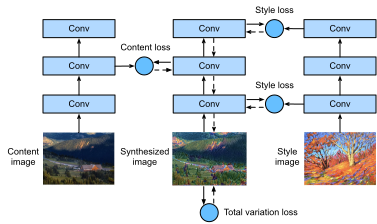

# ニューラル・スタイル変換

写真好きの方なら、
フィルターに馴染みがあるかもしれない。
フィルターは写真の色調を変え、
風景写真をより鮮明にしたり、
ポートレート写真の肌を白く見せたりできる。
しかし、
通常ひとつのフィルターは
写真の一側面しか変えない。
写真に理想的なスタイルを適用するには、
おそらく
さまざまなフィルターの組み合わせを何度も試す必要がある。
この過程は、
モデルのハイパーパラメータ調整と同じくらい複雑である。


この節では、
CNN の層ごとの表現を活用して、
ある画像のスタイルを別の画像に自動的に適用する、
すなわち *スタイル変換* :cite:`Gatys.Ecker.Bethge.2016` を行う。
このタスクには 2 枚の入力画像が必要である。
1 枚は *コンテンツ画像*、
もう 1 枚は *スタイル画像* である。
ニューラルネットワークを用いて
コンテンツ画像を修正し、
スタイル画像のスタイルに近づける。
たとえば、
:numref:`fig_style_transfer` のコンテンツ画像は、
シアトル郊外のマウント・レーニア国立公園で私たちが撮影した風景写真であり、
スタイル画像は
秋のオークの木々をテーマにした油絵である。
出力される合成画像では、
スタイル画像の油彩の筆致が適用されて
より鮮やかな色彩になりつつ、
コンテンツ画像中の物体の主要な形状は保たれる。


:label:`fig_style_transfer`

## 手法

:numref:`fig_style_transfer_model` は、
簡略化した例を用いて CNN ベースのスタイル変換手法を示している。
まず、合成画像を初期化する。
たとえばコンテンツ画像で初期化する。
この合成画像は、スタイル変換の過程で更新が必要な唯一の変数、
すなわち学習中に更新されるモデルパラメータである。
次に、画像特徴を抽出するための事前学習済み CNN を選び、
学習中はそのモデルパラメータを固定する。
この深い CNN は複数の層を用いて
画像の階層的特徴を抽出す。
これらの層の出力の一部をコンテンツ特徴またはスタイル特徴として選ぶことができる。
:numref:`fig_style_transfer_model` を例にとると、
ここでの事前学習済みニューラルネットワークは 3 つの畳み込み層を持ち、
2 層目の出力がコンテンツ特徴、
1 層目と 3 層目の出力がスタイル特徴になる。


:label:`fig_style_transfer_model`

次に、順伝播（実線矢印の方向）によってスタイル変換の損失関数を計算し、逆伝播（破線矢印の方向）によってモデルパラメータ（出力される合成画像）を更新する。
スタイル変換で一般的に用いられる損失関数は 3 つの部分から成る。
(i) *コンテンツ損失* は、合成画像とコンテンツ画像をコンテンツ特徴の面で近づける。
(ii) *スタイル損失* は、合成画像とスタイル画像をスタイル特徴の面で近づける。
(iii) *全変動損失* は、合成画像中のノイズを減らすのに役立ちる。
最後に、モデルの学習が終わったら、スタイル変換のモデルパラメータを出力して
最終的な合成画像を生成する。


以下では、
具体的な実験を通してスタイル変換の技術的詳細を説明する。


## [**コンテンツ画像とスタイル画像の読み込み**]

まず、コンテンツ画像とスタイル画像を読み込みる。
表示された座標軸から、
これらの画像のサイズが異なることがわかる。

```{.python .input}
#@tab mxnet
%matplotlib inline
from d2l import mxnet as d2l
from mxnet import autograd, gluon, image, init, np, npx
from mxnet.gluon import nn

npx.set_np()

d2l.set_figsize()
content_img = image.imread('../img/rainier.jpg')
d2l.plt.imshow(content_img.asnumpy());
```

```{.python .input}
#@tab pytorch
%matplotlib inline
from d2l import torch as d2l
import torch
import torchvision
from torch import nn

d2l.set_figsize()
content_img = d2l.Image.open('../img/rainier.jpg')
d2l.plt.imshow(content_img);
```

```{.python .input}
#@tab mxnet
style_img = image.imread('../img/autumn-oak.jpg')
d2l.plt.imshow(style_img.asnumpy());
```

```{.python .input}
#@tab pytorch
style_img = d2l.Image.open('../img/autumn-oak.jpg')
d2l.plt.imshow(style_img);
```

## [**前処理と後処理**]

以下では、画像の前処理と後処理を行う 2 つの関数を定義する。
`preprocess` 関数は、入力画像の 3 つの RGB チャンネルそれぞれを標準化し、その結果を CNN の入力形式に変換する。
`postprocess` 関数は、出力画像の画素値を標準化前の元の値に戻する。
画像表示関数は各画素が 0 から 1 の浮動小数点値であることを要求するため、
0 未満の値は 0 に、1 を超える値は 1 にそれぞれ置き換える。

```{.python .input}
#@tab mxnet
rgb_mean = np.array([0.485, 0.456, 0.406])
rgb_std = np.array([0.229, 0.224, 0.225])

def preprocess(img, image_shape):
    img = image.imresize(img, *image_shape)
    img = (img.astype('float32') / 255 - rgb_mean) / rgb_std
    return np.expand_dims(img.transpose(2, 0, 1), axis=0)

def postprocess(img):
    img = img[0].as_in_ctx(rgb_std.ctx)
    return (img.transpose(1, 2, 0) * rgb_std + rgb_mean).clip(0, 1)
```

```{.python .input}
#@tab pytorch
rgb_mean = torch.tensor([0.485, 0.456, 0.406])
rgb_std = torch.tensor([0.229, 0.224, 0.225])

def preprocess(img, image_shape):
    transforms = torchvision.transforms.Compose([
        torchvision.transforms.Resize(image_shape),
        torchvision.transforms.ToTensor(),
        torchvision.transforms.Normalize(mean=rgb_mean, std=rgb_std)])
    return transforms(img).unsqueeze(0)

def postprocess(img):
    img = img[0].to(rgb_std.device)
    img = torch.clamp(img.permute(1, 2, 0) * rgb_std + rgb_mean, 0, 1)
    return torchvision.transforms.ToPILImage()(img.permute(2, 0, 1))
```

## [**特徴の抽出**]

画像特徴を抽出するために、ImageNet データセットで事前学習された VGG-19 モデルを用いる :cite:`Gatys.Ecker.Bethge.2016`。

```{.python .input}
#@tab mxnet
pretrained_net = gluon.model_zoo.vision.vgg19(pretrained=True)
```

```{.python .input}
#@tab pytorch
pretrained_net = torchvision.models.vgg19(pretrained=True)
```

画像のコンテンツ特徴とスタイル特徴を抽出するために、VGG ネットワークの特定の層の出力を選ぶことができる。
一般に、入力層に近いほど画像の細部を抽出しやすく、逆に出力層に近いほど画像の全体的な情報を抽出しやすくなる。合成画像にコンテンツ画像の細部を過度に残さないようにするため、
出力層に近い VGG 層を *コンテンツ層* として選び、画像のコンテンツ特徴を出力させる。
また、局所的および大域的なスタイル特徴を抽出するために、異なる VGG 層の出力を選ぶ。
これらの層は *スタイル層* とも呼ばれる。
:numref:`sec_vgg` で述べたように、
VGG ネットワークは 5 つの畳み込みブロックを使う。
この実験では、第 4 畳み込みブロックの最後の畳み込み層をコンテンツ層として選び、各畳み込みブロックの最初の畳み込み層をスタイル層として選ぶ。
これらの層のインデックスは `pretrained_net` インスタンスを表示することで得られる。

```{.python .input}
#@tab all
style_layers, content_layers = [0, 5, 10, 19, 28], [25]
```

VGG 層を用いて特徴を抽出する際には、
入力層から、出力層に最も近いコンテンツ層またはスタイル層までの層だけを使えば十分である。
特徴抽出に使う VGG 層だけを残した新しいネットワークインスタンス `net` を構築しよう。

```{.python .input}
#@tab mxnet
net = nn.Sequential()
for i in range(max(content_layers + style_layers) + 1):
    net.add(pretrained_net.features[i])
```

```{.python .input}
#@tab pytorch
net = nn.Sequential(*[pretrained_net.features[i] for i in
                      range(max(content_layers + style_layers) + 1)])
```

入力 `X` が与えられたとき、単に順伝播 `net(X)` を呼び出すだけでは最後の層の出力しか得られない。
中間層の出力も必要なので、
層ごとに計算を行い、
コンテンツ層とスタイル層の出力を保持する必要がある。

```{.python .input}
#@tab all
def extract_features(X, content_layers, style_layers):
    contents = []
    styles = []
    for i in range(len(net)):
        X = net[i](X)
        if i in style_layers:
            styles.append(X)
        if i in content_layers:
            contents.append(X)
    return contents, styles
```

以下に 2 つの関数を定義する。
`get_contents` 関数はコンテンツ画像からコンテンツ特徴を抽出し、
`get_styles` 関数はスタイル画像からスタイル特徴を抽出す。
学習中に事前学習済み VGG のモデルパラメータを更新する必要はないため、
学習開始前にコンテンツ特徴とスタイル特徴を抽出しておくことができる。
合成画像は
スタイル変換のために更新されるモデルパラメータの集合なので、
学習中に `extract_features` 関数を呼び出すことでのみ、合成画像のコンテンツ特徴とスタイル特徴を抽出できる。

```{.python .input}
#@tab mxnet
def get_contents(image_shape, device):
    content_X = preprocess(content_img, image_shape).copyto(device)
    contents_Y, _ = extract_features(content_X, content_layers, style_layers)
    return content_X, contents_Y

def get_styles(image_shape, device):
    style_X = preprocess(style_img, image_shape).copyto(device)
    _, styles_Y = extract_features(style_X, content_layers, style_layers)
    return style_X, styles_Y
```

```{.python .input}
#@tab pytorch
def get_contents(image_shape, device):
    content_X = preprocess(content_img, image_shape).to(device)
    contents_Y, _ = extract_features(content_X, content_layers, style_layers)
    return content_X, contents_Y

def get_styles(image_shape, device):
    style_X = preprocess(style_img, image_shape).to(device)
    _, styles_Y = extract_features(style_X, content_layers, style_layers)
    return style_X, styles_Y
```

## [**損失関数の定義**]

ここでは、スタイル変換の損失関数を説明する。損失関数は
コンテンツ損失、スタイル損失、全変動損失から成る。

### コンテンツ損失

線形回帰の損失関数と同様に、
コンテンツ損失は
二乗損失関数を通じて
合成画像とコンテンツ画像の間の
コンテンツ特徴の違いを測りる。
二乗損失関数の 2 つの入力は、
どちらも `extract_features` 関数で計算されたコンテンツ層の出力である。

```{.python .input}
#@tab mxnet
def content_loss(Y_hat, Y):
    return np.square(Y_hat - Y).mean()
```

```{.python .input}
#@tab pytorch
def content_loss(Y_hat, Y):
    # We detach the target content from the tree used to dynamically compute
    # the gradient: this is a stated value, not a variable. Otherwise the loss
    # will throw an error.
    return torch.square(Y_hat - Y.detach()).mean()
```

### スタイル損失

スタイル損失もコンテンツ損失と同様に、
二乗損失関数を用いて合成画像とスタイル画像のスタイルの違いを測りる。
任意のスタイル層のスタイル出力を表すために、
まず `extract_features` 関数を使って
スタイル層の出力を計算する。
出力が
1 つのサンプル、$c$ チャンネル、
高さ $h$、幅 $w$ を持つとすると、
この出力を
$c$ 行 $hw$ 列の行列 $\mathbf{X}$ に変換できる。
この行列は、
長さ $hw$ の $c$ 個のベクトル $\mathbf{x}_1, \ldots, \mathbf{x}_c$ の
連結とみなせる。
ここで、ベクトル $\mathbf{x}_i$ はチャンネル $i$ のスタイル特徴を表す。

これらのベクトル $\mathbf{X}\mathbf{X}^\top \in \mathbb{R}^{c \times c}$ の *グラム行列* では、$i$ 行 $j$ 列の要素 $x_{ij}$ はベクトル $\mathbf{x}_i$ と $\mathbf{x}_j$ の内積である。
これはチャンネル $i$ と $j$ のスタイル特徴の相関を表す。
このグラム行列を任意のスタイル層のスタイル出力として用いる。
$hw$ の値が大きいほど、
グラム行列の値も大きくなりやすいことに注意しよ。
また、グラム行列の縦横のサイズはどちらもチャンネル数 $c$ である。
スタイル損失がこれらの値の影響を受けないようにするため、
以下の `gram` 関数では
グラム行列をその要素数、すなわち $chw$ で割っている。

```{.python .input}
#@tab all
def gram(X):
    num_channels, n = X.shape[1], d2l.size(X) // X.shape[1]
    X = d2l.reshape(X, (num_channels, n))
    return d2l.matmul(X, X.T) / (num_channels * n)
```

明らかに、
スタイル損失の二乗損失関数における 2 つのグラム行列入力は、
合成画像とスタイル画像のスタイル層出力に基づいている。
ここでは、スタイル画像に基づくグラム行列 `gram_Y` は事前に計算済みであると仮定する。

```{.python .input}
#@tab mxnet
def style_loss(Y_hat, gram_Y):
    return np.square(gram(Y_hat) - gram_Y).mean()
```

```{.python .input}
#@tab pytorch
def style_loss(Y_hat, gram_Y):
    return torch.square(gram(Y_hat) - gram_Y.detach()).mean()
```

### 全変動損失

ときには、学習された合成画像に
高周波ノイズ、すなわち特に明るい画素や暗い画素が
多く含まれることがある。
一般的なノイズ低減法の 1 つは
*全変動ノイズ除去* である。
座標 $(i, j)$ における画素値を $x_{i, j}$ とする。
全変動損失を減らすと

$$\sum_{i, j} \left|x_{i, j} - x_{i+1, j}\right| + \left|x_{i, j} - x_{i, j+1}\right|$$

合成画像上の隣接画素の値がより近くなる。

```{.python .input}
#@tab all
def tv_loss(Y_hat):
    return 0.5 * (d2l.abs(Y_hat[:, :, 1:, :] - Y_hat[:, :, :-1, :]).mean() +
                  d2l.abs(Y_hat[:, :, :, 1:] - Y_hat[:, :, :, :-1]).mean())
```

### 損失関数

[**スタイル変換の損失関数は、コンテンツ損失、スタイル損失、全変動損失の重み付き和です**]。
これらの重みハイパーパラメータを調整することで、
合成画像における
コンテンツ保持、
スタイル変換、
ノイズ低減のバランスを取ることができる。

```{.python .input}
#@tab all
content_weight, style_weight, tv_weight = 1, 1e4, 10

def compute_loss(X, contents_Y_hat, styles_Y_hat, contents_Y, styles_Y_gram):
    # Calculate the content, style, and total variance losses respectively
    contents_l = [content_loss(Y_hat, Y) * content_weight for Y_hat, Y in zip(
        contents_Y_hat, contents_Y)]
    styles_l = [style_loss(Y_hat, Y) * style_weight for Y_hat, Y in zip(
        styles_Y_hat, styles_Y_gram)]
    tv_l = tv_loss(X) * tv_weight
    # Add up all the losses
    l = sum(styles_l + contents_l + [tv_l])
    return contents_l, styles_l, tv_l, l
```

## [**合成画像の初期化**]

スタイル変換では、
合成画像は学習中に更新が必要な唯一の変数である。
したがって、単純なモデル `SynthesizedImage` を定義し、合成画像をモデルパラメータとして扱うことができる。
このモデルでは、順伝播は単にモデルパラメータを返すだけである。

```{.python .input}
#@tab mxnet
class SynthesizedImage(nn.Block):
    def __init__(self, img_shape, **kwargs):
        super(SynthesizedImage, self).__init__(**kwargs)
        self.weight = self.params.get('weight', shape=img_shape)

    def forward(self):
        return self.weight.data()
```

```{.python .input}
#@tab pytorch
class SynthesizedImage(nn.Module):
    def __init__(self, img_shape, **kwargs):
        super(SynthesizedImage, self).__init__(**kwargs)
        self.weight = nn.Parameter(torch.rand(*img_shape))

    def forward(self):
        return self.weight
```

次に、`get_inits` 関数を定義する。
この関数は合成画像モデルのインスタンスを作成し、それを画像 `X` で初期化する。
さまざまなスタイル層におけるスタイル画像のグラム行列 `styles_Y_gram` は、学習前に計算される。

```{.python .input}
#@tab mxnet
def get_inits(X, device, lr, styles_Y):
    gen_img = SynthesizedImage(X.shape)
    gen_img.initialize(init.Constant(X), ctx=device, force_reinit=True)
    trainer = gluon.Trainer(gen_img.collect_params(), 'adam',
                            {'learning_rate': lr})
    styles_Y_gram = [gram(Y) for Y in styles_Y]
    return gen_img(), styles_Y_gram, trainer
```

```{.python .input}
#@tab pytorch
def get_inits(X, device, lr, styles_Y):
    gen_img = SynthesizedImage(X.shape).to(device)
    gen_img.weight.data.copy_(X.data)
    trainer = torch.optim.Adam(gen_img.parameters(), lr=lr)
    styles_Y_gram = [gram(Y) for Y in styles_Y]
    return gen_img(), styles_Y_gram, trainer
```

## [**学習**]


スタイル変換のモデルを学習するとき、
合成画像のコンテンツ特徴とスタイル特徴を継続的に抽出し、損失関数を計算する。
以下に学習ループを定義する。

```{.python .input}
#@tab mxnet
def train(X, contents_Y, styles_Y, device, lr, num_epochs, lr_decay_epoch):
    X, styles_Y_gram, trainer = get_inits(X, device, lr, styles_Y)
    animator = d2l.Animator(xlabel='epoch', ylabel='loss',
                            xlim=[10, num_epochs], ylim=[0, 20],
                            legend=['content', 'style', 'TV'],
                            ncols=2, figsize=(7, 2.5))
    for epoch in range(num_epochs):
        with autograd.record():
            contents_Y_hat, styles_Y_hat = extract_features(
                X, content_layers, style_layers)
            contents_l, styles_l, tv_l, l = compute_loss(
                X, contents_Y_hat, styles_Y_hat, contents_Y, styles_Y_gram)
        l.backward()
        trainer.step(1)
        if (epoch + 1) % lr_decay_epoch == 0:
            trainer.set_learning_rate(trainer.learning_rate * 0.8)
        if (epoch + 1) % 10 == 0:
            animator.axes[1].imshow(postprocess(X).asnumpy())
            animator.add(epoch + 1, [float(sum(contents_l)),
                                     float(sum(styles_l)), float(tv_l)])
    return X
```

```{.python .input}
#@tab pytorch
def train(X, contents_Y, styles_Y, device, lr, num_epochs, lr_decay_epoch):
    X, styles_Y_gram, trainer = get_inits(X, device, lr, styles_Y)
    scheduler = torch.optim.lr_scheduler.StepLR(trainer, lr_decay_epoch, 0.8)
    animator = d2l.Animator(xlabel='epoch', ylabel='loss',
                            xlim=[10, num_epochs],
                            legend=['content', 'style', 'TV'],
                            ncols=2, figsize=(7, 2.5))
    for epoch in range(num_epochs):
        trainer.zero_grad()
        contents_Y_hat, styles_Y_hat = extract_features(
            X, content_layers, style_layers)
        contents_l, styles_l, tv_l, l = compute_loss(
            X, contents_Y_hat, styles_Y_hat, contents_Y, styles_Y_gram)
        l.backward()
        trainer.step()
        scheduler.step()
        if (epoch + 1) % 10 == 0:
            animator.axes[1].imshow(postprocess(X))
            animator.add(epoch + 1, [float(sum(contents_l)),
                                     float(sum(styles_l)), float(tv_l)])
    return X
```

それでは、[**モデルの学習を開始**] する。
コンテンツ画像とスタイル画像の高さと幅を 300×450 ピクセルにリスケールする。
合成画像の初期化にはコンテンツ画像を用いる。

```{.python .input}
#@tab mxnet
device, image_shape = d2l.try_gpu(), (450, 300)
net.collect_params().reset_ctx(device)
content_X, contents_Y = get_contents(image_shape, device)
_, styles_Y = get_styles(image_shape, device)
output = train(content_X, contents_Y, styles_Y, device, 0.9, 500, 50)
```

```{.python .input}
#@tab pytorch
device, image_shape = d2l.try_gpu(), (300, 450)  # PIL Image (h, w)
net = net.to(device)
content_X, contents_Y = get_contents(image_shape, device)
_, styles_Y = get_styles(image_shape, device)
output = train(content_X, contents_Y, styles_Y, device, 0.3, 500, 50)
```

合成画像が
コンテンツ画像の風景や物体を保持しつつ、
同時にスタイル画像の色彩を
転移していることがわかる。
たとえば、
合成画像には
スタイル画像に見られるような色の塊がある。
それらの一部には、筆致の微妙な質感さえ見られる。


## まとめ

* スタイル変換で一般的に用いられる損失関数は 3 つの部分から成る。(i) コンテンツ損失は、合成画像とコンテンツ画像をコンテンツ特徴の面で近づける。(ii) スタイル損失は、合成画像とスタイル画像をスタイル特徴の面で近づける。(iii) 全変動損失は、合成画像中のノイズを減らすのに役立つ。
* 事前学習済み CNN を用いて画像特徴を抽出し、損失関数を最小化することで、学習中に合成画像をモデルパラメータとして継続的に更新できる。
* スタイル層からのスタイル出力を表すためにグラム行列を用いる。


## 演習

1. 異なるコンテンツ層とスタイル層を選ぶと、出力はどのように変化するか？
1. 損失関数の重みハイパーパラメータを調整しよ。出力はより多くのコンテンツを保持するか、それともノイズが少なくなるか？
1. 異なるコンテンツ画像とスタイル画像を使ってみよ。より興味深い合成画像を作れますか？
1. テキストに対してスタイル変換を適用できるか？ ヒント: :citet:`10.1145/3544903.3544906` のサーベイ論文を参照しよ。
