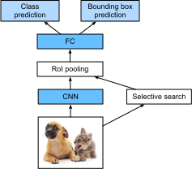
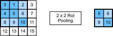
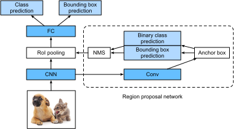
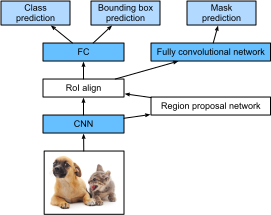

# Region-based CNNs (R-CNNs)
:label:`sec_rcnn`

単発マルチボックス検出
については :numref:`sec_ssd` で説明したが、
領域ベースの CNN、すなわち CNN 特徴を用いた領域（R-CNNs）も、
物体検出に深層学習を適用する先駆的な手法の一つです
:cite:`Girshick.Donahue.Darrell.ea.2014`。
この節では、R-CNN とその一連の改良版である fast R-CNN
:cite:`Girshick.2015`、faster R-CNN :cite:`Ren.He.Girshick.ea.2015`、および mask R-CNN
:cite:`He.Gkioxari.Dollar.ea.2017` を紹介する。
紙幅の都合上、これらのモデルの設計にのみ
焦点を当てる。


## R-CNNs


*R-CNN* はまず、入力画像から多数（たとえば 2000 個）の *region proposals*
を抽出し
（たとえば、アンカーボックスも region proposals と見なせます）、
それらのクラスとバウンディングボックス（たとえばオフセット）をラベル付けする。
:cite:`Girshick.Donahue.Darrell.ea.2014`
次に、各 region proposal に対して CNN を用いて
順伝播を行い、その特徴を抽出す。
その後、各 region proposal の特徴を用いて、
この region proposal のクラスとバウンディングボックスを
予測する。


:label:`fig_r-cnn`

:numref:`fig_r-cnn` は R-CNN モデルを示している。より具体的には、R-CNN は次の 4 つのステップから構成される。

1. 入力画像上で複数の高品質な region proposals を抽出するために、*selective search* を実行する :cite:`Uijlings.Van-De-Sande.Gevers.ea.2013`。これらの提案領域は通常、異なる形状やサイズを持つ複数のスケールで選択される。各 region proposal には、クラスと正解バウンディングボックスがラベル付けされる。
1. 学習済み CNN を選び、出力層の手前で切り取りる。各 region proposal をネットワークが要求する入力サイズにリサイズし、順伝播によってその region proposal の抽出特徴を出力する。
1. 抽出した特徴と各 region proposal のラベル付きクラスを例として用いる。複数のサポートベクターマシンを学習して物体を分類し、各サポートベクターマシンはその例に特定のクラスが含まれるかどうかを個別に判定する。
1. 抽出した特徴と各 region proposal のラベル付きバウンディングボックスを例として用いる。線形回帰モデルを学習して、正解バウンディングボックスを予測する。


R-CNN モデルは学習済み CNN を用いて画像特徴を効果的に抽出すが、
処理速度は遅いである。
1 枚の入力画像から
数千個の region proposals を選ぶことを考えてみよ。
これには、物体検出を行うために数千回の
CNN 順伝播が必要になる。
この膨大な
計算負荷のため、R-CNN を実世界のアプリケーションで
広く使うことは現実的ではない。

## Fast R-CNN

R-CNN における主な性能上のボトルネックは、
計算を共有せずに各 region proposal ごとに
独立して CNN 順伝播を行う点にある。
これらの領域は通常
重なりを持つため、
独立した特徴抽出では
同じ計算が何度も繰り返される。
*fast R-CNN* における
R-CNN からの主要な改良点の一つは、
CNN の順伝播を
画像全体に対してのみ行うことです
:cite:`Girshick.2015`。



:label:`fig_fast_r-cnn`

:numref:`fig_fast_r-cnn` は fast R-CNN モデルを示している。主な計算は次のとおりです。


1. R-CNN と比べると、fast R-CNN では特徴抽出のための CNN の入力は個々の region proposal ではなく、画像全体である。さらに、この CNN は学習可能である。入力画像が与えられたとき、CNN 出力の形状を $1 \times c \times h_1  \times w_1$ とする。
1. selective search が $n$ 個の region proposals を生成すると仮定する。これらの region proposals（形状はさまざま）は、CNN 出力上の region of interest（形状はさまざま）を示す。次に、これらの region of interest から、同じ形状（たとえば高さ $h_2$ と幅 $w_2$ が指定される）の特徴をさらに抽出し、連結しやすくする。これを実現するために、fast R-CNN は *region of interest (RoI) pooling* 層を導入する。CNN 出力と region proposals をこの層に入力し、形状 $n \times c \times h_2 \times w_2$ の連結特徴を出力して、すべての region proposals に対してさらに特徴抽出を行う。
1. 全結合層を用いて、連結特徴を形状 $n \times d$ の出力に変換する。ここで $d$ はモデル設計に依存する。
1. $n$ 個の region proposals それぞれについて、クラスとバウンディングボックスを予測する。より具体的には、クラス予測とバウンディングボックス予測において、全結合層の出力をそれぞれ形状 $n \times q$（$q$ はクラス数）と形状 $n \times 4$ の出力に変換する。クラス予測には softmax 回帰を用いる。


fast R-CNN で提案された region of interest pooling 層は、 :numref:`sec_pooling` で導入した pooling 層とは異なる。
pooling 層では、
pooling ウィンドウ、パディング、ストライドのサイズを指定することで、
出力形状を間接的に制御する。
これに対して、
region of interest pooling 層では
出力形状を直接指定できる。

たとえば、
各領域の出力高さと幅をそれぞれ $h_2$ と $w_2$ に指定するとする。
形状 $h \times w$ の任意の region of interest ウィンドウに対して、
このウィンドウは $h_2 \times w_2$ のグリッド
のサブウィンドウに分割され、
各サブウィンドウの形状はおおよそ
$(h/h_2) \times (w/w_2)$ になる。
実際には、
任意のサブウィンドウの高さと幅は切り上げられ、最大要素がサブウィンドウの出力として用いられる。
したがって、region of interest pooling 層は、
region of interest の形状が異なっていても
同じ形状の特徴を抽出できる。


説明のための例として、
:numref:`fig_roi` では、
$4 \times 4$ の入力上で
左上の $3\times 3$ の region of interest が選択されている。
この region of interest に対して、
$2\times 2$ の region of interest pooling 層を用いて
$2\times 2$ の出力を得る。
4 つに分割された各サブウィンドウには
要素 0, 1, 4, 5（最大値は 5）、
2, 6（最大値は 6）、
8, 9（最大値は 9）、
および 10 が含まれることに注意しよ。


:label:`fig_roi`

以下では、region of interest pooling 層の計算を示す。CNN で抽出された特徴 `X` の高さと幅がともに 4 で、チャネルが 1 つだけであると仮定する。

```{.python .input}
#@tab mxnet
from mxnet import np, npx

npx.set_np()

X = np.arange(16).reshape(1, 1, 4, 4)
X
```

```{.python .input}
#@tab pytorch
import torch
import torchvision

X = torch.arange(16.).reshape(1, 1, 4, 4)
X
```

さらに、
入力画像の高さと幅がともに 40 ピクセルであり、selective search がこの画像上で 2 つの region proposals を生成すると仮定しよう。
各 region proposal は 5 つの要素で表される。
すなわち、物体クラスに続いて、その左上隅と右下隅の $(x, y)$ 座標である。

```{.python .input}
#@tab mxnet
rois = np.array([[0, 0, 0, 20, 20], [0, 0, 10, 30, 30]])
```

```{.python .input}
#@tab pytorch
rois = torch.Tensor([[0, 0, 0, 20, 20], [0, 0, 10, 30, 30]])
```

`X` の高さと幅は入力画像の高さと幅の $1/10$ なので、
2 つの region proposals の座標は、指定された `spatial_scale` 引数に従って 0.1 倍される。
すると、2 つの region of interest はそれぞれ `X[:, :, 0:3, 0:3]` と `X[:, :, 1:4, 0:4]` として `X` 上に示される。
最後に、$2\times 2$ の region of interest pooling では、
各 region of interest は
サブウィンドウのグリッドに分割され、
同じ形状 $2\times 2$ の特徴をさらに抽出す。

```{.python .input}
#@tab mxnet
npx.roi_pooling(X, rois, pooled_size=(2, 2), spatial_scale=0.1)
```

```{.python .input}
#@tab pytorch
torchvision.ops.roi_pool(X, rois, output_size=(2, 2), spatial_scale=0.1)
```

## Faster R-CNN

物体検出をより高精度にするために、
fast R-CNN モデルでは通常、
selective search によって
多数の region proposals を生成する必要がある。
精度を落とさずに region proposals を減らすために、
*faster R-CNN* は selective search を *region proposal network* に置き換えることを提案した
:cite:`Ren.He.Girshick.ea.2015`。



:label:`fig_faster_r-cnn`


:numref:`fig_faster_r-cnn` は faster R-CNN モデルを示している。fast R-CNN と比べると、
faster R-CNN が変更するのは
region proposal の方法を
selective search から region proposal network に変える点だけである。
モデルの残りの部分は
変更されない。
region proposal network は
次の手順で動作する。

1. パディング 1 の $3\times 3$ 畳み込み層を用いて、CNN 出力を $c$ チャネルの新しい出力に変換する。これにより、CNN で抽出された特徴マップの空間次元上の各ユニットは、長さ $c$ の新しい特徴ベクトルを持つようになる。
1. 特徴マップの各ピクセルを中心として、異なるスケールとアスペクト比を持つ複数のアンカーボックスを生成し、それらにラベルを付ける。
1. 各アンカーボックスの中心にある長さ $c$ の特徴ベクトルを用いて、二値クラス（背景または物体）と、このアンカーボックスのバウンディングボックスを予測する。
1. 予測されたクラスが物体であるバウンディングボックスを考える。non-maximum suppression を用いて重なりのある結果を除去する。残った物体の予測バウンディングボックスが、region of interest pooling 層に必要な region proposals である。


注目すべき点として、
faster R-CNN モデルの一部として、
region proposal network は
モデルの残りの部分と同時に学習される。
言い換えると、faster R-CNN の目的関数には、
物体検出におけるクラスとバウンディングボックスの予測だけでなく、
region proposal network におけるアンカーボックスの二値クラスとバウンディングボックスの予測も含まれる。
エンドツーエンド学習の結果として、
region proposal network は
高品質な region proposals を生成する方法を学習し、
データから学習された少数の region proposals で
物体検出の精度を保てるようになる。


## Mask R-CNN

学習データセットにおいて、
画像上の物体のピクセルレベルの位置もラベル付けされているなら、
*mask R-CNN* は
そのような詳細なラベルを効果的に活用して、
物体検出の精度をさらに向上できる
:cite:`He.Gkioxari.Dollar.ea.2017`。



:label:`fig_mask_r-cnn`

:numref:`fig_mask_r-cnn` に示すように、
mask R-CNN は
faster R-CNN を基に改良されている。
具体的には、
mask R-CNN は
region of interest pooling 層を
*region of interest (RoI) alignment* 層に置き換える。
この region of interest alignment 層は
双線形補間を用いて特徴マップ上の空間情報を保持し、ピクセルレベルの予測により適している。
この層の出力には、
すべての region of interest に対して同じ形状の特徴マップが含まれる。
それらは、
各 region of interest のクラスとバウンディングボックスを予測するだけでなく、
追加の全畳み込みネットワークを通じて物体のピクセルレベルの位置も予測するために用いられる。
画像のピクセルレベルの意味情報を予測するために全畳み込みネットワークを用いる詳細については、
この章の後続の節で説明する。


## 要約


* R-CNN は入力画像から多数の region proposals を抽出し、CNN を用いて各 region proposal に順伝播を行って特徴を抽出し、その特徴を用いてこの region proposal のクラスとバウンディングボックスを予測する。
* fast R-CNN における R-CNN からの主要な改良点の一つは、CNN の順伝播を画像全体に対してのみ行うことである。また、region of interest pooling 層を導入し、形状の異なる region of interest に対して同じ形状の特徴をさらに抽出できるようにしている。
* faster R-CNN は、fast R-CNN で用いられる selective search を同時学習される region proposal network に置き換えることで、少数の region proposals でも物体検出の精度を保てるようにしている。
* faster R-CNN を基に、mask R-CNN はさらに全畳み込みネットワークを導入し、ピクセルレベルのラベルを活用して物体検出の精度をさらに向上させる。


## 演習

1. 物体検出を、バウンディングボックスとクラス確率の予測のような単一の回帰問題として定式化できるだろうか。 YOLO モデルの設計を参照してもよいです :cite:`Redmon.Divvala.Girshick.ea.2016`。
1. 単発マルチボックス検出と、この節で紹介した手法を比較しよ。主な違いは何だろうか。 :citet:`Zhao.Zheng.Xu.ea.2019` の図 2 を参照してもよいである。
