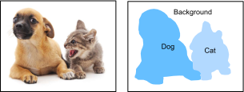

# セマンティックセグメンテーションとデータセット
:label:`sec_semantic_segmentation`

:numref:`sec_bbox`-- :numref:`sec_rcnn` で物体検出タスクについて述べたときには、
画像中の物体をラベル付けして予測するために
矩形のバウンディングボックスを用いました。
この節では、画像を異なる意味クラスに属する領域へどのように分割するかに焦点を当てる
*セマンティックセグメンテーション* の問題を扱います。
物体検出とは異なり、セマンティックセグメンテーションは
画像中に何があるかをピクセルレベルで認識し理解します。
つまり、そのラベル付けと意味領域の予測は
ピクセルレベルで行われます。
:numref:`fig_segmentation` は、セマンティックセグメンテーションにおける
画像の犬、猫、背景のラベルを示しています。
物体検出と比べると、
セマンティックセグメンテーションでラベル付けされる
ピクセルレベルの境界は、明らかにより細かい粒度です。



:label:`fig_segmentation`


## 画像セグメンテーションとインスタンスセグメンテーション

セマンティックセグメンテーションに似た、コンピュータビジョン分野の重要なタスクとして、
画像セグメンテーションとインスタンスセグメンテーションもあります。
以下では、これらをセマンティックセグメンテーションと簡単に区別します。

* *画像セグメンテーション* は、画像をいくつかの構成領域に分割します。この種の問題の手法は通常、画像内のピクセル間の相関を利用します。学習時に画像ピクセルに関するラベル情報を必要とせず、予測時に得たい意味を持つ領域が分割されることを保証できません。 :numref:`fig_segmentation` の画像を入力とすると、画像セグメンテーションは犬を2つの領域に分けるかもしれません。1つは主に黒い口と目を含む領域で、もう1つは主に黄色い残りの体を含む領域です。
* *インスタンスセグメンテーション* は、*同時検出とセグメンテーション* とも呼ばれます。画像中の各物体インスタンスのピクセルレベルの領域をどのように認識するかを研究します。セマンティックセグメンテーションとは異なり、インスタンスセグメンテーションでは意味だけでなく、異なる物体インスタンスも区別する必要があります。たとえば、画像に2匹の犬がいる場合、インスタンスセグメンテーションでは、あるピクセルが2匹のうちどちらの犬に属するかを区別する必要があります。


## Pascal VOC2012 セマンティックセグメンテーションデータセット

[**最も重要なセマンティックセグメンテーションデータセットの1つは [Pascal VOC2012](http://host.robots.ox.ac.uk/pascal/VOC/voc2012/) です。**]
以下では、このデータセットを見ていきます。

```{.python .input}
#@tab mxnet
%matplotlib inline
from d2l import mxnet as d2l
from mxnet import gluon, image, np, npx
import os

npx.set_np()
```

```{.python .input}
#@tab pytorch
%matplotlib inline
from d2l import torch as d2l
import torch
import torchvision
import os
```

このデータセットの tar ファイルは約 2 GB あるため、
ダウンロードにはしばらく時間がかかるかもしれません。
展開後のデータセットは `../data/VOCdevkit/VOC2012` にあります。

```{.python .input}
#@tab all
#@save
d2l.DATA_HUB['voc2012'] = (d2l.DATA_URL + 'VOCtrainval_11-May-2012.tar',
                           '4e443f8a2eca6b1dac8a6c57641b67dd40621a49')

voc_dir = d2l.download_extract('voc2012', 'VOCdevkit/VOC2012')
```

`../data/VOCdevkit/VOC2012` に入ると、
データセットのさまざまな構成要素を確認できます。
`ImageSets/Segmentation` パスには、学習サンプルとテストサンプルを指定するテキストファイルが含まれ、
`JPEGImages` と `SegmentationClass` パスには、それぞれ各例の入力画像とラベルが保存されています。
ここでのラベルも画像形式であり、
ラベル付けされた入力画像と同じサイズです。
さらに、
任意のラベル画像において同じ色のピクセルは同じ意味クラスに属します。
以下では、`read_voc_images` 関数を定義して、[**すべての入力画像とラベルをメモリに読み込みます**]。

```{.python .input}
#@tab mxnet
#@save
def read_voc_images(voc_dir, is_train=True):
    """Read all VOC feature and label images."""
    txt_fname = os.path.join(voc_dir, 'ImageSets', 'Segmentation',
                             'train.txt' if is_train else 'val.txt')
    with open(txt_fname, 'r') as f:
        images = f.read().split()
    features, labels = [], []
    for i, fname in enumerate(images):
        features.append(image.imread(os.path.join(
            voc_dir, 'JPEGImages', f'{fname}.jpg')))
        labels.append(image.imread(os.path.join(
            voc_dir, 'SegmentationClass', f'{fname}.png')))
    return features, labels

train_features, train_labels = read_voc_images(voc_dir, True)
```

```{.python .input}
#@tab pytorch
#@save
def read_voc_images(voc_dir, is_train=True):
    """Read all VOC feature and label images."""
    txt_fname = os.path.join(voc_dir, 'ImageSets', 'Segmentation',
                             'train.txt' if is_train else 'val.txt')
    mode = torchvision.io.image.ImageReadMode.RGB
    with open(txt_fname, 'r') as f:
        images = f.read().split()
    features, labels = [], []
    for i, fname in enumerate(images):
        features.append(torchvision.io.read_image(os.path.join(
            voc_dir, 'JPEGImages', f'{fname}.jpg')))
        labels.append(torchvision.io.read_image(os.path.join(
            voc_dir, 'SegmentationClass' ,f'{fname}.png'), mode))
    return features, labels

train_features, train_labels = read_voc_images(voc_dir, True)
```

最初の5つの入力画像とそのラベルを[**描画します**]。
ラベル画像では、白と黒がそれぞれ境界と背景を表し、その他の色は異なるクラスに対応します。

```{.python .input}
#@tab mxnet
n = 5
imgs = train_features[:n] + train_labels[:n]
d2l.show_images(imgs, 2, n);
```

```{.python .input}
#@tab pytorch
n = 5
imgs = train_features[:n] + train_labels[:n]
imgs = [img.permute(1,2,0) for img in imgs]
d2l.show_images(imgs, 2, n);
```

次に、このデータセットのすべてのラベルについて、
[**RGB の色値とクラス名を列挙します**]。

```{.python .input}
#@tab all
#@save
VOC_COLORMAP = [[0, 0, 0], [128, 0, 0], [0, 128, 0], [128, 128, 0],
                [0, 0, 128], [128, 0, 128], [0, 128, 128], [128, 128, 128],
                [64, 0, 0], [192, 0, 0], [64, 128, 0], [192, 128, 0],
                [64, 0, 128], [192, 0, 128], [64, 128, 128], [192, 128, 128],
                [0, 64, 0], [128, 64, 0], [0, 192, 0], [128, 192, 0],
                [0, 64, 128]]

#@save
VOC_CLASSES = ['background', 'aeroplane', 'bicycle', 'bird', 'boat',
               'bottle', 'bus', 'car', 'cat', 'chair', 'cow',
               'diningtable', 'dog', 'horse', 'motorbike', 'person',
               'potted plant', 'sheep', 'sofa', 'train', 'tv/monitor']
```

上で定義した2つの定数を使うと、
[**ラベル内の各ピクセルのクラスインデックスを簡単に求めることができます**]。
`voc_colormap2label` 関数を定義して、
上記の RGB 色値からクラスインデックスへの対応を構築し、
`voc_label_indices` 関数を定義して、
この Pascal VOC2012 データセットにおける任意の RGB 値をそのクラスインデックスに対応付けます。

```{.python .input}
#@tab mxnet
#@save
def voc_colormap2label():
    """Build the mapping from RGB to class indices for VOC labels."""
    colormap2label = np.zeros(256 ** 3)
    for i, colormap in enumerate(VOC_COLORMAP):
        colormap2label[
            (colormap[0] * 256 + colormap[1]) * 256 + colormap[2]] = i
    return colormap2label

#@save
def voc_label_indices(colormap, colormap2label):
    """Map any RGB values in VOC labels to their class indices."""
    colormap = colormap.astype(np.int32)
    idx = ((colormap[:, :, 0] * 256 + colormap[:, :, 1]) * 256
           + colormap[:, :, 2])
    return colormap2label[idx]
```

```{.python .input}
#@tab pytorch
#@save
def voc_colormap2label():
    """Build the mapping from RGB to class indices for VOC labels."""
    colormap2label = torch.zeros(256 ** 3, dtype=torch.long)
    for i, colormap in enumerate(VOC_COLORMAP):
        colormap2label[
            (colormap[0] * 256 + colormap[1]) * 256 + colormap[2]] = i
    return colormap2label

#@save
def voc_label_indices(colormap, colormap2label):
    """Map any RGB values in VOC labels to their class indices."""
    colormap = colormap.permute(1, 2, 0).numpy().astype('int32')
    idx = ((colormap[:, :, 0] * 256 + colormap[:, :, 1]) * 256
           + colormap[:, :, 2])
    return colormap2label[idx]
```

[**たとえば**]、最初の例画像では、
飛行機の前方部分のクラスインデックスは 1 であり、
背景のインデックスは 0 です。

```{.python .input}
#@tab all
y = voc_label_indices(train_labels[0], voc_colormap2label())
y[105:115, 130:140], VOC_CLASSES[1]
```

### データ前処理

:numref:`sec_alexnet`-- :numref:`sec_googlenet` などの以前の実験では、
画像はモデルが要求する入力形状に合わせるためにリサイズされていました。
しかし、セマンティックセグメンテーションでは、
これを行うと
予測されたピクセルクラスを元の入力画像の形状に戻す必要があります。
このようなリサイズは、特に異なるクラスを含むセグメント領域では不正確になりえます。
この問題を避けるために、
リサイズの代わりに画像を *固定* 形状にクロップします。具体的には、[**画像拡張としてランダムクロップを用いて、入力画像とラベルの同じ領域を切り出します**]。

```{.python .input}
#@tab mxnet
#@save
def voc_rand_crop(feature, label, height, width):
    """Randomly crop both feature and label images."""
    feature, rect = image.random_crop(feature, (width, height))
    label = image.fixed_crop(label, *rect)
    return feature, label
```

```{.python .input}
#@tab pytorch
#@save
def voc_rand_crop(feature, label, height, width):
    """Randomly crop both feature and label images."""
    rect = torchvision.transforms.RandomCrop.get_params(
        feature, (height, width))
    feature = torchvision.transforms.functional.crop(feature, *rect)
    label = torchvision.transforms.functional.crop(label, *rect)
    return feature, label
```

```{.python .input}
#@tab mxnet
imgs = []
for _ in range(n):
    imgs += voc_rand_crop(train_features[0], train_labels[0], 200, 300)
d2l.show_images(imgs[::2] + imgs[1::2], 2, n);
```

```{.python .input}
#@tab pytorch
imgs = []
for _ in range(n):
    imgs += voc_rand_crop(train_features[0], train_labels[0], 200, 300)

imgs = [img.permute(1, 2, 0) for img in imgs]
d2l.show_images(imgs[::2] + imgs[1::2], 2, n);
```

### [**カスタムセマンティックセグメンテーションデータセットクラス**]

高水準 API が提供する `Dataset` クラスを継承して、
カスタムのセマンティックセグメンテーションデータセットクラス `VOCSegDataset` を定義します。
`__getitem__` 関数を実装することで、
データセット内で `idx` によってインデックス付けされた入力画像と、
この画像の各ピクセルのクラスインデックスに任意にアクセスできます。
データセット内の一部の画像は
ランダムクロップの出力サイズよりも小さいため、
これらの例はカスタムの `filter` 関数によって
除外されます。
さらに、
入力画像の3つの RGB チャンネルの値を標準化するために
`normalize_image` 関数も定義します。

```{.python .input}
#@tab mxnet
#@save
class VOCSegDataset(gluon.data.Dataset):
    """A customized dataset to load the VOC dataset."""
    def __init__(self, is_train, crop_size, voc_dir):
        self.rgb_mean = np.array([0.485, 0.456, 0.406])
        self.rgb_std = np.array([0.229, 0.224, 0.225])
        self.crop_size = crop_size
        features, labels = read_voc_images(voc_dir, is_train=is_train)
        self.features = [self.normalize_image(feature)
                         for feature in self.filter(features)]
        self.labels = self.filter(labels)
        self.colormap2label = voc_colormap2label()
        print('read ' + str(len(self.features)) + ' examples')

    def normalize_image(self, img):
        return (img.astype('float32') / 255 - self.rgb_mean) / self.rgb_std

    def filter(self, imgs):
        return [img for img in imgs if (
            img.shape[0] >= self.crop_size[0] and
            img.shape[1] >= self.crop_size[1])]

    def __getitem__(self, idx):
        feature, label = voc_rand_crop(self.features[idx], self.labels[idx],
                                       *self.crop_size)
        return (feature.transpose(2, 0, 1),
                voc_label_indices(label, self.colormap2label))

    def __len__(self):
        return len(self.features)
```

```{.python .input}
#@tab pytorch
#@save
class VOCSegDataset(torch.utils.data.Dataset):
    """A customized dataset to load the VOC dataset."""

    def __init__(self, is_train, crop_size, voc_dir):
        self.transform = torchvision.transforms.Normalize(
            mean=[0.485, 0.456, 0.406], std=[0.229, 0.224, 0.225])
        self.crop_size = crop_size
        features, labels = read_voc_images(voc_dir, is_train=is_train)
        self.features = [self.normalize_image(feature)
                         for feature in self.filter(features)]
        self.labels = self.filter(labels)
        self.colormap2label = voc_colormap2label()
        print('read ' + str(len(self.features)) + ' examples')

    def normalize_image(self, img):
        return self.transform(img.float() / 255)

    def filter(self, imgs):
        return [img for img in imgs if (
            img.shape[1] >= self.crop_size[0] and
            img.shape[2] >= self.crop_size[1])]

    def __getitem__(self, idx):
        feature, label = voc_rand_crop(self.features[idx], self.labels[idx],
                                       *self.crop_size)
        return (feature, voc_label_indices(label, self.colormap2label))

    def __len__(self):
        return len(self.features)
```

### [**データセットの読み込み**]

カスタム `VOCSegDatase`t クラスを用いて、
学習セットとテストセットのインスタンスをそれぞれ作成します。
ランダムクロップ後の出力形状を $320\times 480$ と指定するとします。
以下では、学習セットとテストセットに保持される例の数を確認できます。

```{.python .input}
#@tab all
crop_size = (320, 480)
voc_train = VOCSegDataset(True, crop_size, voc_dir)
voc_test = VOCSegDataset(False, crop_size, voc_dir)
```

バッチサイズを 64 に設定し、
学習セットのデータイテレータを定義します。
最初のミニバッチの形状を出力してみましょう。
画像分類や物体検出とは異なり、ここでのラベルは3次元テンソルです。

```{.python .input}
#@tab mxnet
batch_size = 64
train_iter = gluon.data.DataLoader(voc_train, batch_size, shuffle=True,
                                   last_batch='discard',
                                   num_workers=d2l.get_dataloader_workers())
for X, Y in train_iter:
    print(X.shape)
    print(Y.shape)
    break
```

```{.python .input}
#@tab pytorch
batch_size = 64
train_iter = torch.utils.data.DataLoader(voc_train, batch_size, shuffle=True,
                                    drop_last=True,
                                    num_workers=d2l.get_dataloader_workers())
for X, Y in train_iter:
    print(X.shape)
    print(Y.shape)
    break
```

### [**全体をまとめる**]

最後に、Pascal VOC2012 セマンティックセグメンテーションデータセットをダウンロードして読み込むための
`load_data_voc` 関数を定義します。
これは学習データセットとテストデータセットの両方に対するデータイテレータを返します。

```{.python .input}
#@tab mxnet
#@save
def load_data_voc(batch_size, crop_size):
    """Load the VOC semantic segmentation dataset."""
    voc_dir = d2l.download_extract('voc2012', os.path.join(
        'VOCdevkit', 'VOC2012'))
    num_workers = d2l.get_dataloader_workers()
    train_iter = gluon.data.DataLoader(
        VOCSegDataset(True, crop_size, voc_dir), batch_size,
        shuffle=True, last_batch='discard', num_workers=num_workers)
    test_iter = gluon.data.DataLoader(
        VOCSegDataset(False, crop_size, voc_dir), batch_size,
        last_batch='discard', num_workers=num_workers)
    return train_iter, test_iter
```

```{.python .input}
#@tab pytorch
#@save
def load_data_voc(batch_size, crop_size):
    """Load the VOC semantic segmentation dataset."""
    voc_dir = d2l.download_extract('voc2012', os.path.join(
        'VOCdevkit', 'VOC2012'))
    num_workers = d2l.get_dataloader_workers()
    train_iter = torch.utils.data.DataLoader(
        VOCSegDataset(True, crop_size, voc_dir), batch_size,
        shuffle=True, drop_last=True, num_workers=num_workers)
    test_iter = torch.utils.data.DataLoader(
        VOCSegDataset(False, crop_size, voc_dir), batch_size,
        drop_last=True, num_workers=num_workers)
    return train_iter, test_iter
```

## まとめ

* セマンティックセグメンテーションは、画像を異なる意味クラスに属する領域へ分割することで、画像中に何があるかをピクセルレベルで認識し理解します。
* 最も重要なセマンティックセグメンテーションデータセットの1つは Pascal VOC2012 です。
* セマンティックセグメンテーションでは、入力画像とラベルがピクセル単位で1対1に対応するため、入力画像はリサイズではなく、固定形状にランダムクロップされます。


## 演習

1. セマンティックセグメンテーションは、自動運転車や医用画像診断にどのように応用できますか？ 他の応用例も考えられますか？
1. :numref:`sec_image_augmentation` のデータ拡張の説明を思い出してください。画像分類で用いられる画像拡張手法のうち、セマンティックセグメンテーションには適用できないものはどれでしょうか？
