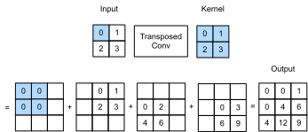

# 転置畳み込み
:label:`sec_transposed_conv`

これまで見てきた CNN の層、
たとえば畳み込み層（:numref:`sec_conv_layer`）やプーリング層（:numref:`sec_pooling`）は、
通常、入力の空間次元（高さと幅）を縮小（ダウンサンプリング）するか、
あるいはそのまま維持します。
画素レベルで分類を行うセマンティックセグメンテーションでは、
入力と出力の空間次元が同じであると便利です。
たとえば、
ある出力画素のチャネル次元には、
同じ空間位置にある入力画素の分類結果を保持できます。


これを実現するために、特に CNN 層によって空間次元が縮小された後では、
中間特徴マップの空間次元を増やす（アップサンプリングする）別の種類の CNN 層を使うことができます。
この節では、
畳み込みによるダウンサンプリング操作を逆にするための、
*転置畳み込み*（*fractionally-strided convolution* とも呼ばれる） :cite:`Dumoulin.Visin.2016`
を紹介します。

```{.python .input}
#@tab mxnet
from mxnet import np, npx, init
from mxnet.gluon import nn
from d2l import mxnet as d2l

npx.set_np()
```

```{.python .input}
#@tab pytorch
import torch
from torch import nn
from d2l import torch as d2l
```

## 基本操作

まずはチャネルを無視して、
ストライド 1 でパディングなしの基本的な転置畳み込み操作から始めましょう。
$n_h \times n_w$ の入力テンソルと、
$k_h \times k_w$ のカーネルが与えられたとします。
ストライド 1 でカーネルウィンドウを
各行で $n_w$ 回、各列で $n_h$ 回動かすと、
合計 $n_h n_w$ 個の中間結果が得られます。
各中間結果は、
ゼロで初期化された
$(n_h + k_h - 1) \times (n_w + k_w - 1)$
テンソルです。
各中間テンソルを計算するには、
入力テンソルの各要素にカーネルを掛け、
その結果得られる $k_h \times k_w$ テンソルを
各中間テンソルの一部に上書きします。
なお、
各中間テンソルにおける上書きされる部分の位置は、
計算に使われた入力テンソル中の要素の位置に対応しています。
最後に、これらすべての中間結果を加算して出力を得ます。

例として、
:numref:`fig_trans_conv` は
$2\times 2$ の入力テンソルに対して $2\times 2$ カーネルを用いた転置畳み込みがどのように計算されるかを示しています。



:label:`fig_trans_conv`


入力行列 `X` とカーネル行列 `K` に対して、基本的な転置畳み込み操作 `trans_conv` を [**実装**] できます。

```{.python .input}
#@tab all
def trans_conv(X, K):
    h, w = K.shape
    Y = d2l.zeros((X.shape[0] + h - 1, X.shape[1] + w - 1))
    for i in range(X.shape[0]):
        for j in range(X.shape[1]):
            Y[i: i + h, j: j + w] += X[i, j] * K
    return Y
```

通常の畳み込み（:numref:`sec_conv_layer`）がカーネルを通して入力要素を*縮約*するのに対し、
転置畳み込みはカーネルを通して入力要素を*拡張*し、
その結果、入力よりも大きい出力を生成します。
:numref:`fig_trans_conv` の入力テンソル `X` とカーネルテンソル `K` を構成して、
上の基本的な 2 次元転置畳み込み操作の [**出力を検証**] できます。

```{.python .input}
#@tab all
X = d2l.tensor([[0.0, 1.0], [2.0, 3.0]])
K = d2l.tensor([[0.0, 1.0], [2.0, 3.0]])
trans_conv(X, K)
```

あるいは、
入力 `X` とカーネル `K` がどちらも
4 次元テンソルである場合には、
[**高水準 API を使って同じ結果を得る**] こともできます。

```{.python .input}
#@tab mxnet
X, K = X.reshape(1, 1, 2, 2), K.reshape(1, 1, 2, 2)
tconv = nn.Conv2DTranspose(1, kernel_size=2)
tconv.initialize(init.Constant(K))
tconv(X)
```

```{.python .input}
#@tab pytorch
X, K = X.reshape(1, 1, 2, 2), K.reshape(1, 1, 2, 2)
tconv = nn.ConvTranspose2d(1, 1, kernel_size=2, bias=False)
tconv.weight.data = K
tconv(X)
```

## [**パディング、ストライド、複数チャネル**]

通常の畳み込みではパディングは入力に適用されますが、
転置畳み込みでは出力に適用されます。
たとえば、
高さと幅のそれぞれの側におけるパディング数を 1 に指定すると、
転置畳み込みの出力から最初と最後の行および列が削除されます。

```{.python .input}
#@tab mxnet
tconv = nn.Conv2DTranspose(1, kernel_size=2, padding=1)
tconv.initialize(init.Constant(K))
tconv(X)
```

```{.python .input}
#@tab pytorch
tconv = nn.ConvTranspose2d(1, 1, kernel_size=2, padding=1, bias=False)
tconv.weight.data = K
tconv(X)
```

転置畳み込みでは、
ストライドは入力ではなく中間結果（したがって出力）に対して指定されます。
:numref:`fig_trans_conv` と同じ入力テンソルおよびカーネルテンソルを用いて、
ストライドを 1 から 2 に変更すると、
中間テンソルの高さと幅の両方が増加し、
その結果、 :numref:`fig_trans_conv_stride2` の出力テンソルが得られます。


:label:`fig_trans_conv_stride2`


次のコード片で、 :numref:`fig_trans_conv_stride2` におけるストライド 2 の転置畳み込み出力を検証できます。

```{.python .input}
#@tab mxnet
tconv = nn.Conv2DTranspose(1, kernel_size=2, strides=2)
tconv.initialize(init.Constant(K))
tconv(X)
```

```{.python .input}
#@tab pytorch
tconv = nn.ConvTranspose2d(1, 1, kernel_size=2, stride=2, bias=False)
tconv.weight.data = K
tconv(X)
```

複数の入力チャネルと出力チャネルに対しては、
転置畳み込みは通常の畳み込みと同じように動作します。
入力が $c_i$ チャネルを持つとし、
転置畳み込みが各入力チャネルに対して
$k_h\times k_w$ のカーネルテンソルを割り当てるとします。
複数の出力チャネルが指定される場合、
各出力チャネルごとに $c_i\times k_h\times k_w$ のカーネルを持つことになります。


全体として、
$\mathsf{X}$ を畳み込み層 $f$ に入力して $\mathsf{Y}=f(\mathsf{X})$ を出力し、
$g$ を $f$ と同じハイパーパラメータを持つ転置畳み込み層として、
ただし出力チャネル数だけは $\mathsf{X}$ のチャネル数と同じにすると、
$g(Y)$ は $\mathsf{X}$ と同じ形状になります。
これは次の例で示せます。

```{.python .input}
#@tab mxnet
X = np.random.uniform(size=(1, 10, 16, 16))
conv = nn.Conv2D(20, kernel_size=5, padding=2, strides=3)
tconv = nn.Conv2DTranspose(10, kernel_size=5, padding=2, strides=3)
conv.initialize()
tconv.initialize()
tconv(conv(X)).shape == X.shape
```

```{.python .input}
#@tab pytorch
X = torch.rand(size=(1, 10, 16, 16))
conv = nn.Conv2d(10, 20, kernel_size=5, padding=2, stride=3)
tconv = nn.ConvTranspose2d(20, 10, kernel_size=5, padding=2, stride=3)
tconv(conv(X)).shape == X.shape
```

## [**行列の転置との関係**]
:label:`subsec-connection-to-mat-transposition`

転置畳み込みという名前は、
行列の転置に由来します。
説明のために、
まずは行列積を用いて畳み込みを実装する方法を見てみましょう。
以下の例では、$3\times 3$ の入力 `X` と $2\times 2$ の畳み込みカーネル `K` を定義し、その後 `corr2d` 関数を使って畳み込み出力 `Y` を計算します。

```{.python .input}
#@tab all
X = d2l.arange(9.0).reshape(3, 3)
K = d2l.tensor([[1.0, 2.0], [3.0, 4.0]])
Y = d2l.corr2d(X, K)
Y
```

次に、畳み込みカーネル `K` を
多くのゼロを含む疎な重み行列 `W`
として書き直します。
重み行列の形状は ($4$, $9$) で、
非ゼロ要素は
畳み込みカーネル `K` から来ています。

```{.python .input}
#@tab all
def kernel2matrix(K):
    k, W = d2l.zeros(5), d2l.zeros((4, 9))
    k[:2], k[3:5] = K[0, :], K[1, :]
    W[0, :5], W[1, 1:6], W[2, 3:8], W[3, 4:] = k, k, k, k
    return W

W = kernel2matrix(K)
W
```

入力 `X` を行ごとに連結して長さ 9 のベクトルを得ます。すると、`W` とベクトル化した `X` の行列積により、長さ 4 のベクトルが得られます。
それを再び reshape すると、上の元の畳み込み操作と同じ結果 `Y` が得られます。
つまり、畳み込みを行列積で実装したことになります。

```{.python .input}
#@tab all
Y == d2l.matmul(W, d2l.reshape(X, -1)).reshape(2, 2)
```

同様に、転置畳み込みも
行列積を用いて実装できます。
次の例では、上の
通常の畳み込みから得られた $2 \times 2$ の出力 `Y`
を転置畳み込みの入力として用います。
この操作を行列積で実装するには、
重み行列 `W` を転置して
新しい形状 $(9, 4)$ にすればよいだけです。

```{.python .input}
#@tab all
Z = trans_conv(Y, K)
Z == d2l.matmul(W.T, d2l.reshape(Y, -1)).reshape(3, 3)
```

行列積による畳み込みの実装を考えましょう。
入力ベクトル $\mathbf{x}$ と重み行列 $\mathbf{W}$ が与えられたとき、
畳み込みの順伝播関数は、
入力に重み行列を掛けて
出力ベクトル $\mathbf{y}=\mathbf{W}\mathbf{x}$ を返すことで実装できます。
逆伝播は
連鎖律に従い、
$\nabla_{\mathbf{x}}\mathbf{y}=\mathbf{W}^\top$ であるため、
畳み込みの逆伝播関数は
入力に転置された重み行列 $\mathbf{W}^\top$ を掛けることで実装できます。
したがって、
転置畳み込み層は
畳み込み層の順伝播関数と逆伝播関数を入れ替えたものとみなせます。
つまり、その順伝播関数と逆伝播関数は、
それぞれ入力ベクトルに
$\mathbf{W}^\top$ と $\mathbf{W}$ を掛けます。


## まとめ

* 通常の畳み込みがカーネルを通して入力要素を縮約するのに対し、転置畳み込みはカーネルを通して入力要素を拡張し、その結果、入力よりも大きい出力を生成する。
* $\mathsf{X}$ を畳み込み層 $f$ に入力して $\mathsf{Y}=f(\mathsf{X})$ を出力し、$g$ を $f$ と同じハイパーパラメータを持つ転置畳み込み層として、ただし出力チャネル数だけは $\mathsf{X}$ のチャネル数と同じにすると、$g(Y)$ は $\mathsf{X}$ と同じ形状になる。
* 畳み込みは行列積を用いて実装できる。転置畳み込み層は、畳み込み層の順伝播関数と逆伝播関数を入れ替えたものとみなせる。

## 演習

1. :numref:`subsec-connection-to-mat-transposition` では、畳み込みの入力 `X` と転置畳み込みの出力 `Z` は同じ形状を持ちます。では、それらは同じ値でしょうか。なぜですか。
1. 畳み込みを実装するのに行列積を使うのは効率的でしょうか。なぜですか。
