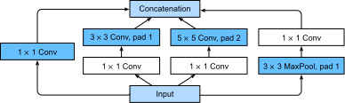

{.python .input}
%load_ext d2lbook.tab
tab.interact_select(['mxnet', 'pytorch', 'tensorflow', 'jax'])
```

# マルチブランチネットワーク（GoogLeNet）
:label:`sec_googlenet`

2014年、*GoogLeNet* は ImageNet Challenge :cite:`Szegedy.Liu.Jia.ea.2015` で優勝し、NiN :cite:`Lin.Chen.Yan.2013`、反復ブロック :cite:`Simonyan.Zisserman.2014`、そしてさまざまな畳み込みカーネルを組み合わせた構造を用いました。おそらくこれは、CNN において stem（データ取り込み）、body（データ処理）、head（予測）を明確に区別した最初のネットワークでもありました。この設計パターンは、それ以来ディープネットワークの設計において定着しています。*stem* は画像に対して作用する最初の2つまたは3つの畳み込み層で構成され、元の画像から低レベル特徴を抽出します。これに続くのが畳み込みブロックからなる *body* です。最後に *head* が、これまでに得られた特徴を、現在扱っている分類・セグメンテーション・検出・追跡の問題に応じた出力へ写像します。

GoogLeNet における重要な貢献は、ネットワーク本体の設計でした。これは畳み込みカーネルの選択という問題を独創的な方法で解決しました。$1 \times 1$ から $11 \times 11$ までのどの畳み込みが最適かを特定しようとした他の研究とは異なり、GoogLeNet は単にマルチブランチ畳み込みを *連結* しました。以下では、GoogLeNet のやや簡略化した版を紹介します。元の設計には、ネットワークの複数層に適用される中間損失関数を通じて学習を安定化させるためのいくつかの工夫が含まれていました。より優れた学習アルゴリズムが利用可能になった現在では、それらはもはや必要ありません。

```{.python .input}
%%tab mxnet
from d2l import mxnet as d2l
from mxnet import np, npx, init
from mxnet.gluon import nn
npx.set_np()
```

```{.python .input}
%%tab pytorch
from d2l import torch as d2l
import torch
from torch import nn
from torch.nn import functional as F
```

```{.python .input}
%%tab tensorflow
import tensorflow as tf
from d2l import tensorflow as d2l
```

```{.python .input}
%%tab jax
from d2l import jax as d2l
from flax import linen as nn
from jax import numpy as jnp
import jax
```

## (**Inceptionブロック**)

GoogLeNet の基本的な畳み込みブロックは *Inception block* と呼ばれ、映画 *Inception* のミーム「we need to go deeper」に由来します。


:label:`fig_inception`

:numref:`fig_inception` に示すように、Inception ブロックは4つの並列ブランチから構成されます。最初の3つのブランチは、それぞれウィンドウサイズが $1\times 1$、$3\times 3$、$5\times 5$ の畳み込み層を用いて、異なる空間スケールの情報を抽出します。中央の2つのブランチでは、入力に対して $1\times 1$ 畳み込みも追加してチャネル数を削減し、モデルの複雑さを抑えています。4つ目のブランチは $3\times 3$ の最大プーリング層を使い、その後に $1\times 1$ 畳み込み層を続けてチャネル数を変更します。4つのブランチはいずれも適切なパディングを用いて、入力と出力の高さ・幅が同じになるようにします。最後に、各ブランチの出力をチャネル次元に沿って連結し、ブロックの出力とします。Inception ブロックで一般に調整されるハイパーパラメータは、各層の出力チャネル数、すなわち異なるサイズの畳み込みにどのように容量を割り当てるかです。

```{.python .input}
%%tab mxnet
class Inception(nn.Block):
    # c1--c4 are the number of output channels for each branch
    def __init__(self, c1, c2, c3, c4, **kwargs):
        super(Inception, self).__init__(**kwargs)
        # Branch 1
        self.b1_1 = nn.Conv2D(c1, kernel_size=1, activation='relu')
        # Branch 2
        self.b2_1 = nn.Conv2D(c2[0], kernel_size=1, activation='relu')
        self.b2_2 = nn.Conv2D(c2[1], kernel_size=3, padding=1,
                              activation='relu')
        # Branch 3
        self.b3_1 = nn.Conv2D(c3[0], kernel_size=1, activation='relu')
        self.b3_2 = nn.Conv2D(c3[1], kernel_size=5, padding=2,
                              activation='relu')
        # Branch 4
        self.b4_1 = nn.MaxPool2D(pool_size=3, strides=1, padding=1)
        self.b4_2 = nn.Conv2D(c4, kernel_size=1, activation='relu')

    def forward(self, x):
        b1 = self.b1_1(x)
        b2 = self.b2_2(self.b2_1(x))
        b3 = self.b3_2(self.b3_1(x))
        b4 = self.b4_2(self.b4_1(x))
        return np.concatenate((b1, b2, b3, b4), axis=1)
```

```{.python .input}
%%tab pytorch
class Inception(nn.Module):
    # c1--c4 are the number of output channels for each branch
    def __init__(self, c1, c2, c3, c4, **kwargs):
        super(Inception, self).__init__(**kwargs)
        # Branch 1
        self.b1_1 = nn.LazyConv2d(c1, kernel_size=1)
        # Branch 2
        self.b2_1 = nn.LazyConv2d(c2[0], kernel_size=1)
        self.b2_2 = nn.LazyConv2d(c2[1], kernel_size=3, padding=1)
        # Branch 3
        self.b3_1 = nn.LazyConv2d(c3[0], kernel_size=1)
        self.b3_2 = nn.LazyConv2d(c3[1], kernel_size=5, padding=2)
        # Branch 4
        self.b4_1 = nn.MaxPool2d(kernel_size=3, stride=1, padding=1)
        self.b4_2 = nn.LazyConv2d(c4, kernel_size=1)

    def forward(self, x):
        b1 = F.relu(self.b1_1(x))
        b2 = F.relu(self.b2_2(F.relu(self.b2_1(x))))
        b3 = F.relu(self.b3_2(F.relu(self.b3_1(x))))
        b4 = F.relu(self.b4_2(self.b4_1(x)))
        return torch.cat((b1, b2, b3, b4), dim=1)
```

```{.python .input}
%%tab tensorflow
class Inception(tf.keras.Model):
    # c1--c4 are the number of output channels for each branch
    def __init__(self, c1, c2, c3, c4):
        super().__init__()
        self.b1_1 = tf.keras.layers.Conv2D(c1, 1, activation='relu')
        self.b2_1 = tf.keras.layers.Conv2D(c2[0], 1, activation='relu')
        self.b2_2 = tf.keras.layers.Conv2D(c2[1], 3, padding='same',
                                           activation='relu')
        self.b3_1 = tf.keras.layers.Conv2D(c3[0], 1, activation='relu')
        self.b3_2 = tf.keras.layers.Conv2D(c3[1], 5, padding='same',
                                           activation='relu')
        self.b4_1 = tf.keras.layers.MaxPool2D(3, 1, padding='same')
        self.b4_2 = tf.keras.layers.Conv2D(c4, 1, activation='relu')

    def call(self, x):
        b1 = self.b1_1(x)
        b2 = self.b2_2(self.b2_1(x))
        b3 = self.b3_2(self.b3_1(x))
        b4 = self.b4_2(self.b4_1(x))
        return tf.keras.layers.Concatenate()([b1, b2, b3, b4])
```

```{.python .input}
%%tab jax
class Inception(nn.Module):
    # `c1`--`c4` are the number of output channels for each branch
    c1: int
    c2: tuple
    c3: tuple
    c4: int

    def setup(self):
        # Branch 1
        self.b1_1 = nn.Conv(self.c1, kernel_size=(1, 1))
        # Branch 2
        self.b2_1 = nn.Conv(self.c2[0], kernel_size=(1, 1))
        self.b2_2 = nn.Conv(self.c2[1], kernel_size=(3, 3), padding='same')
        # Branch 3
        self.b3_1 = nn.Conv(self.c3[0], kernel_size=(1, 1))
        self.b3_2 = nn.Conv(self.c3[1], kernel_size=(5, 5), padding='same')
        # Branch 4
        self.b4_1 = lambda x: nn.max_pool(x, window_shape=(3, 3),
                                          strides=(1, 1), padding='same')
        self.b4_2 = nn.Conv(self.c4, kernel_size=(1, 1))

    def __call__(self, x):
        b1 = nn.relu(self.b1_1(x))
        b2 = nn.relu(self.b2_2(nn.relu(self.b2_1(x))))
        b3 = nn.relu(self.b3_2(nn.relu(self.b3_1(x))))
        b4 = nn.relu(self.b4_2(self.b4_1(x)))
        return jnp.concatenate((b1, b2, b3, b4), axis=-1)
```

このネットワークがなぜこれほどよく機能するのかを直感的に理解するために、フィルタの組み合わせを考えてみましょう。さまざまなサイズのフィルタで画像を探索しているのです。つまり、異なる広がりの詳細を、それぞれに適したサイズのフィルタで効率よく認識できます。同時に、異なるフィルタに対して異なる量のパラメータを割り当てることもできます。


## [**GoogLeNet モデル**]

:numref:`fig_inception_full` に示すように、GoogLeNet は合計9個の inception block を積み重ねたもので、3つのグループに分かれ、その間に max-pooling を挟み、head では global average pooling を用いて推定値を生成します。Inception ブロック間の max-pooling は次元を削減します。stem では、最初のモジュールは AlexNet や LeNet に似ています。


:label:`fig_inception_full`

ここから GoogLeNet を少しずつ実装していきましょう。まず stem から始めます。最初のモジュールは 64 チャネルの $7\times 7$ 畳み込み層を使います。

```{.python .input}
%%tab pytorch, mxnet, tensorflow
class GoogleNet(d2l.Classifier):
    def b1(self):
        if tab.selected('mxnet'):
            net = nn.Sequential()
            net.add(nn.Conv2D(64, kernel_size=7, strides=2, padding=3,
                              activation='relu'),
                    nn.MaxPool2D(pool_size=3, strides=2, padding=1))
            return net
        if tab.selected('pytorch'):
            return nn.Sequential(
                nn.LazyConv2d(64, kernel_size=7, stride=2, padding=3),
                nn.ReLU(), nn.MaxPool2d(kernel_size=3, stride=2, padding=1))
        if tab.selected('tensorflow'):
            return tf.keras.models.Sequential([
                tf.keras.layers.Conv2D(64, 7, strides=2, padding='same',
                                       activation='relu'),
                tf.keras.layers.MaxPool2D(pool_size=3, strides=2,
                                          padding='same')])
```

```{.python .input}
%%tab jax
class GoogleNet(d2l.Classifier):
    lr: float = 0.1
    num_classes: int = 10

    def setup(self):
        self.net = nn.Sequential([self.b1(), self.b2(), self.b3(), self.b4(),
                                  self.b5(), nn.Dense(self.num_classes)])

    def b1(self):
        return nn.Sequential([
                nn.Conv(64, kernel_size=(7, 7), strides=(2, 2), padding='same'),
                nn.relu,
                lambda x: nn.max_pool(x, window_shape=(3, 3), strides=(2, 2),
                                      padding='same')])
```

2つ目のモジュールは2つの畳み込み層を使います。まず 64 チャネルの $1\times 1$ 畳み込み層を適用し、その後にチャネル数を3倍にする $3\times 3$ 畳み込み層を続けます。これは Inception ブロックの第2ブランチに対応し、body の設計を完了します。この時点でチャネル数は192です。

```{.python .input}
%%tab all
@d2l.add_to_class(GoogleNet)
def b2(self):
    if tab.selected('mxnet'):
        net = nn.Sequential()
        net.add(nn.Conv2D(64, kernel_size=1, activation='relu'),
               nn.Conv2D(192, kernel_size=3, padding=1, activation='relu'),
               nn.MaxPool2D(pool_size=3, strides=2, padding=1))
        return net
    if tab.selected('pytorch'):
        return nn.Sequential(
            nn.LazyConv2d(64, kernel_size=1), nn.ReLU(),
            nn.LazyConv2d(192, kernel_size=3, padding=1), nn.ReLU(),
            nn.MaxPool2d(kernel_size=3, stride=2, padding=1))
    if tab.selected('tensorflow'):
        return tf.keras.Sequential([
            tf.keras.layers.Conv2D(64, 1, activation='relu'),
            tf.keras.layers.Conv2D(192, 3, padding='same', activation='relu'),
            tf.keras.layers.MaxPool2D(pool_size=3, strides=2, padding='same')])
    if tab.selected('jax'):
        return nn.Sequential([nn.Conv(64, kernel_size=(1, 1)),
                              nn.relu,
                              nn.Conv(192, kernel_size=(3, 3), padding='same'),
                              nn.relu,
                              lambda x: nn.max_pool(x, window_shape=(3, 3),
                                                    strides=(2, 2),
                                                    padding='same')])
```

3つ目のモジュールは、2つの完全な Inception ブロックを直列に接続します。最初の Inception ブロックの出力チャネル数は $64+128+32+32=256$ です。これは4つのブランチ間での出力チャネル数の比が $2:4:1:1$ であることに相当します。これを実現するために、まず第2ブランチと第3ブランチで入力次元をそれぞれ $\frac{1}{2}$ と $\frac{1}{12}$ に削減し、結果としてそれぞれ $96 = 192/2$ チャネルと $16 = 192/12$ チャネルにします。

2つ目の Inception ブロックの出力チャネル数は $128+192+96+64=480$ に増え、比は $128:192:96:64 = 4:6:3:2$ になります。前と同様に、第2チャネルと第3チャネルでは中間次元数を減らす必要があります。それぞれ $\frac{1}{2}$ と $\frac{1}{8}$ のスケールで十分であり、結果としてそれぞれ 128 チャネルと 32 チャネルになります。これは以下の `Inception` ブロックのコンストラクタ引数に反映されています。

```{.python .input}
%%tab all
@d2l.add_to_class(GoogleNet)
def b3(self):
    if tab.selected('mxnet'):
        net = nn.Sequential()
        net.add(Inception(64, (96, 128), (16, 32), 32),
               Inception(128, (128, 192), (32, 96), 64),
               nn.MaxPool2D(pool_size=3, strides=2, padding=1))
        return net
    if tab.selected('pytorch'):
        return nn.Sequential(Inception(64, (96, 128), (16, 32), 32),
                             Inception(128, (128, 192), (32, 96), 64),
                             nn.MaxPool2d(kernel_size=3, stride=2, padding=1))
    if tab.selected('tensorflow'):
        return tf.keras.models.Sequential([
            Inception(64, (96, 128), (16, 32), 32),
            Inception(128, (128, 192), (32, 96), 64),
            tf.keras.layers.MaxPool2D(pool_size=3, strides=2, padding='same')])
    if tab.selected('jax'):
        return nn.Sequential([Inception(64, (96, 128), (16, 32), 32),
                              Inception(128, (128, 192), (32, 96), 64),
                              lambda x: nn.max_pool(x, window_shape=(3, 3),
                                                    strides=(2, 2),
                                                    padding='same')])
```

4つ目のモジュールはより複雑です。5つの Inception ブロックを直列に接続し、それぞれの出力チャネル数は $192+208+48+64=512$、$160+224+64+64=512$、$128+256+64+64=512$、$112+288+64+64=528$、$256+320+128+128=832$ です。各ブランチに割り当てられるチャネル数は3つ目のモジュールと似ていますが、具体的な値は異なります。第2ブランチの $3\times 3$ 畳み込み層が最も多くのチャネルを出力し、次に $1\times 1$ 畳み込み層のみを持つ第1ブランチ、$5\times 5$ 畳み込み層を持つ第3ブランチ、そして $3\times 3$ 最大プーリング層を持つ第4ブランチが続きます。第2ブランチと第3ブランチでは、まず比率に従ってチャネル数を削減します。これらの比率は Inception ブロックごとに少しずつ異なります。

```{.python .input}
%%tab all
@d2l.add_to_class(GoogleNet)
def b4(self):
    if tab.selected('mxnet'):
        net = nn.Sequential()
        net.add(Inception(192, (96, 208), (16, 48), 64),
                Inception(160, (112, 224), (24, 64), 64),
                Inception(128, (128, 256), (24, 64), 64),
                Inception(112, (144, 288), (32, 64), 64),
                Inception(256, (160, 320), (32, 128), 128),
                nn.MaxPool2D(pool_size=3, strides=2, padding=1))
        return net
    if tab.selected('pytorch'):
        return nn.Sequential(Inception(192, (96, 208), (16, 48), 64),
                             Inception(160, (112, 224), (24, 64), 64),
                             Inception(128, (128, 256), (24, 64), 64),
                             Inception(112, (144, 288), (32, 64), 64),
                             Inception(256, (160, 320), (32, 128), 128),
                             nn.MaxPool2d(kernel_size=3, stride=2, padding=1))
    if tab.selected('tensorflow'):
        return tf.keras.Sequential([
            Inception(192, (96, 208), (16, 48), 64),
            Inception(160, (112, 224), (24, 64), 64),
            Inception(128, (128, 256), (24, 64), 64),
            Inception(112, (144, 288), (32, 64), 64),
            Inception(256, (160, 320), (32, 128), 128),
            tf.keras.layers.MaxPool2D(pool_size=3, strides=2, padding='same')])
    if tab.selected('jax'):
        return nn.Sequential([Inception(192, (96, 208), (16, 48), 64),
                              Inception(160, (112, 224), (24, 64), 64),
                              Inception(128, (128, 256), (24, 64), 64),
                              Inception(112, (144, 288), (32, 64), 64),
                              Inception(256, (160, 320), (32, 128), 128),
                              lambda x: nn.max_pool(x, window_shape=(3, 3),
                                                    strides=(2, 2),
                                                    padding='same')])
```

5つ目のモジュールは2つの Inception ブロックからなり、出力チャネル数はそれぞれ $256+320+128+128=832$ と $384+384+128+128=1024$ です。各ブランチに割り当てられるチャネル数は3つ目と4つ目のモジュールと同じですが、具体的な値は異なります。なお、5つ目のブロックの後には出力層が続きます。このブロックでは NiN と同様に global average pooling 層を使って、各チャネルの高さと幅を1に変換します。最後に、出力を2次元配列に変換し、その後に全結合層を適用します。この全結合層の出力数はラベルクラス数です。

```{.python .input}
%%tab all
@d2l.add_to_class(GoogleNet)
def b5(self):
    if tab.selected('mxnet'):
        net = nn.Sequential()
        net.add(Inception(256, (160, 320), (32, 128), 128),
                Inception(384, (192, 384), (48, 128), 128),
                nn.GlobalAvgPool2D())
        return net
    if tab.selected('pytorch'):
        return nn.Sequential(Inception(256, (160, 320), (32, 128), 128),
                             Inception(384, (192, 384), (48, 128), 128),
                             nn.AdaptiveAvgPool2d((1,1)), nn.Flatten())
    if tab.selected('tensorflow'):
        return tf.keras.Sequential([
            Inception(256, (160, 320), (32, 128), 128),
            Inception(384, (192, 384), (48, 128), 128),
            tf.keras.layers.GlobalAvgPool2D(),
            tf.keras.layers.Flatten()])
    if tab.selected('jax'):
        return nn.Sequential([Inception(256, (160, 320), (32, 128), 128),
                              Inception(384, (192, 384), (48, 128), 128),
                              # Flax does not provide a GlobalAvgPool2D layer
                              lambda x: nn.avg_pool(x,
                                                    window_shape=x.shape[1:3],
                                                    strides=x.shape[1:3],
                                                    padding='valid'),
                              lambda x: x.reshape((x.shape[0], -1))])
```

ここまでで `b1` から `b5` までのすべてのブロックを定義したので、あとはそれらをまとめて完全なネットワークに組み立てるだけです。

```{.python .input}
%%tab pytorch, mxnet, tensorflow
@d2l.add_to_class(GoogleNet)
def __init__(self, lr=0.1, num_classes=10):
    super(GoogleNet, self).__init__()
    self.save_hyperparameters()
    if tab.selected('mxnet'):
        self.net = nn.Sequential()
        self.net.add(self.b1(), self.b2(), self.b3(), self.b4(), self.b5(),
                     nn.Dense(num_classes))
        self.net.initialize(init.Xavier())
    if tab.selected('pytorch'):
        self.net = nn.Sequential(self.b1(), self.b2(), self.b3(), self.b4(),
                                 self.b5(), nn.LazyLinear(num_classes))
        self.net.apply(d2l.init_cnn)
    if tab.selected('tensorflow'):
        self.net = tf.keras.Sequential([
            self.b1(), self.b2(), self.b3(), self.b4(), self.b5(),
            tf.keras.layers.Dense(num_classes)])
```

GoogLeNet モデルは計算量の大きいモデルです。選択されたチャネル数、次元削減前のブロック数、チャネル間での容量配分の比率など、比較的恣意的なハイパーパラメータが非常に多いことに注意してください。その多くは、GoogLeNet が導入された当時、ネットワーク定義や設計探索のための自動化ツールがまだ利用できなかったことに起因します。たとえば現在では、優れた深層学習フレームワークが入力テンソルの次元を自動的に推論できるのは当然だと考えます。当時は、そのような設定の多くを実験者が明示的に指定しなければならず、活発な実験の速度をしばしば低下させていました。さらに、自動探索に必要なツールもまだ発展途上で、初期の実験は主として高コストな総当たり探索、遺伝的アルゴリズム、その他類似の戦略に頼っていました。

当面の変更として行うのは、[**入力の高さと幅を224から96に減らし、Fashion-MNIST で妥当な学習時間にすること**]だけです。これにより計算が簡単になります。各モジュール間で出力形状がどのように変化するかを見てみましょう。

```{.python .input}
%%tab mxnet, pytorch
model = GoogleNet().layer_summary((1, 1, 96, 96))
```

```{.python .input}
%%tab tensorflow, jax
model = GoogleNet().layer_summary((1, 96, 96, 1))
```

## [**学習**]

これまでと同様に、Fashion-MNIST データセットを用いてモデルを学習します。学習手続きを呼び出す前に、画像を $96 \times 96$ ピクセルの解像度に変換します。

```{.python .input}
%%tab mxnet, pytorch, jax
model = GoogleNet(lr=0.01)
trainer = d2l.Trainer(max_epochs=10, num_gpus=1)
data = d2l.FashionMNIST(batch_size=128, resize=(96, 96))
if tab.selected('pytorch'):
    model.apply_init([next(iter(data.get_dataloader(True)))[0]], d2l.init_cnn)
trainer.fit(model, data)
```

```{.python .input}
%%tab tensorflow
trainer = d2l.Trainer(max_epochs=10)
data = d2l.FashionMNIST(batch_size=128, resize=(96, 96))
with d2l.try_gpu():
    model = GoogleNet(lr=0.01)
    trainer.fit(model, data)
```

## 議論

GoogLeNet の重要な特徴は、先行モデルよりも計算コストが*低い*にもかかわらず、精度が向上していることです。これは、ネットワークを評価するコストと誤差削減とのトレードオフを意識した、より慎重なネットワーク設計の始まりを示しています。また、当時は完全に手作業ではあったものの、ブロック単位でネットワーク設計のハイパーパラメータを試行する時代の始まりでもありました。ネットワーク構造の探索戦略を議論する :numref:`sec_cnn-design` で、この話題に再び触れます。

以降の節では、batch normalization、残差接続、チャネルのグルーピングなど、ネットワークを大幅に改善できるいくつかの設計選択に出会います。今の時点では、おそらく最初の真に現代的な CNN を実装したことを誇りに思ってよいでしょう。

## 演習

1. GoogLeNet は非常に成功したため、速度と精度を段階的に改善するいくつかの改良版が登場しました。以下のものをいくつか実装して実行してみてください。
    1. :numref:`sec_batch_norm` で後述するように、batch normalization 層 :cite:`Ioffe.Szegedy.2015` を追加する。
    1. :citet:`Szegedy.Vanhoucke.Ioffe.ea.2016` で述べられているように、Inception ブロックの調整（幅、畳み込みの選択と順序）を行う。
    1. :citet:`Szegedy.Vanhoucke.Ioffe.ea.2016` で述べられているように、モデル正則化のために label smoothing を用いる。
    1. :numref:`sec_resnet` で後述するように、残差接続 :cite:`Szegedy.Ioffe.Vanhoucke.ea.2017` を追加して Inception ブロックをさらに調整する。
1. GoogLeNet が動作するために必要な最小の画像サイズはどれくらいですか？
1. Fashion-MNIST のネイティブ解像度である $28 \times 28$ ピクセルで動作する GoogLeNet の変種を設計できますか？ その場合、ネットワークの stem、body、head をどのように変更する必要がありますか。あるいは、変更は不要でしょうか？
1. AlexNet、VGG、NiN、GoogLeNet のモデルパラメータサイズを比較してください。後者2つのネットワークアーキテクチャは、どのようにしてモデルパラメータサイズを大幅に削減しているのでしょうか？
1. GoogLeNet と AlexNet に必要な計算量を比較してください。これは、たとえばメモリ容量、メモリ帯域幅、キャッシュサイズ、計算量、特殊演算の利点といった観点で、アクセラレータチップの設計にどのような影響を与えるでしょうか？

:begin_tab:`mxnet`
[Discussions](https://discuss.d2l.ai/t/81)
:end_tab:

:begin_tab:`pytorch`
[Discussions](https://discuss.d2l.ai/t/82)
:end_tab:

:begin_tab:`tensorflow`
[Discussions](https://discuss.d2l.ai/t/316)
:end_tab:

:begin_tab:`jax`
[Discussions](https://discuss.d2l.ai/t/18004)
:end_tab:\n