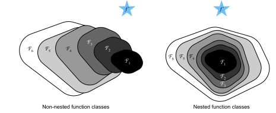
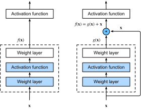

{.python .input}
%load_ext d2lbook.tab
tab.interact_select(['mxnet', 'pytorch', 'tensorflow', 'jax'])
```

# 残差ネットワーク（ResNet）と ResNeXt
:label:`sec_resnet`

より深いネットワークを設計するにつれて、層を追加することでネットワークの複雑さと表現力がどのように増すのかを理解することが不可欠になる。
さらに重要なのは、層を追加することで単に別のネットワークになるのではなく、ネットワークが厳密により表現力を持つように設計できるかどうかである。
少し前進するために、少し数学が必要になる。

```{.python .input}
%%tab mxnet
from d2l import mxnet as d2l
from mxnet import np, npx, init
from mxnet.gluon import nn
npx.set_np()
```

```{.python .input}
%%tab pytorch
from d2l import torch as d2l
import torch
from torch import nn
from torch.nn import functional as F
```

```{.python .input}
%%tab tensorflow
import tensorflow as tf
from d2l import tensorflow as d2l
```

```{.python .input}
%%tab jax
from d2l import jax as d2l
from flax import linen as nn
from jax import numpy as jnp
import jax
```

## 関数クラス

$\mathcal{F}$ を、特定のネットワークアーキテクチャ（学習率やその他のハイパーパラメータ設定も含む）が到達しうる関数のクラスと考えよう。
つまり、すべての $f \in \mathcal{F}$ について、適切なデータセットでの学習によって得られるあるパラメータ集合（たとえば重みやバイアス）が存在する。
本当に見つけたい「真の」関数を $f^*$ としよう。
それが $\mathcal{F}$ に含まれていれば理想的だが、通常はそこまで幸運ではない。
その代わりに、$\mathcal{F}$ の中で最善と思われる $f^*_\mathcal{F}$ を見つけようとする。
たとえば、
特徴量 $\mathbf{X}$
とラベル $\mathbf{y}$
を持つデータセットが与えられたとき、
次の最適化問題を解くことでそれを見つけようとするかもしれない：

$$f^*_\mathcal{F} \stackrel{\textrm{def}}{=} \mathop{\mathrm{argmin}}_f L(\mathbf{X}, \mathbf{y}, f) \textrm{ subject to } f \in \mathcal{F}.$$

正則化 :cite:`tikhonov1977solutions,morozov2012methods` は $\mathcal{F}$ の複雑さを制御し、
整合性を達成できることが知られているので、学習データが多いほど一般により良い $f^*_\mathcal{F}$ が得られる。
より強力な別のアーキテクチャ $\mathcal{F}'$ を設計すれば、より良い結果に到達できると考えるのはもっともである。
言い換えれば、$f^*_{\mathcal{F}'}$ は $f^*_{\mathcal{F}}$ より「良い」と期待するだろう。
しかし、$\mathcal{F} \not\subseteq \mathcal{F}'$ であれば、そのようなことが起こる保証はない。
実際、$f^*_{\mathcal{F}'}$ のほうが悪いことも十分ありうる。
:numref:`fig_functionclasses` に示すように、
入れ子になっていない関数クラスでは、より大きな関数クラスが必ずしも「真の」関数 $f^*$ に近づくとは限らない。
たとえば、:numref:`fig_functionclasses` の左側では、
$\mathcal{F}_3$ は $\mathcal{F}_1$ より $f^*$ に近いが、$\mathcal{F}_6$ では逆に遠ざかっており、複雑さをさらに増やしても $f^*$ からの距離が減る保証はない。
一方、$\mathcal{F}_1 \subseteq \cdots \subseteq \mathcal{F}_6$
という入れ子の関数クラスでは、
:numref:`fig_functionclasses` の右側に示すように、
前述の入れ子でない関数クラスの問題を避けることができる。



:label:`fig_functionclasses`

したがって、
大きい関数クラスが小さい関数クラスを含む場合にのみ、関数クラスを大きくするとネットワークの表現力が厳密に増すことが保証される。
深層ニューラルネットワークでは、
新しく追加した層を恒等関数 $f(\mathbf{x}) = \mathbf{x}$ に学習できれば、新しいモデルは元のモデルと同等に有効である。
新しいモデルが学習データによりよく適合する解を見つけられる可能性があるため、追加した層によって訓練誤差を下げやすくなるかもしれない。

これは、非常に深いコンピュータビジョンモデルに取り組んでいた :citet:`He.Zhang.Ren.ea.2016` が考えた問題である。
彼らが提案した *残差ネットワーク*（*ResNet*）の核心は、追加される各層が恒等関数をその要素の一つとしてより容易に含められるようにする、という考え方にある。
これらの考察はかなり深いが、驚くほど単純な解決策、すなわち *残差ブロック* を導いた。
これにより、ResNet は 2015 年の ImageNet Large Scale Visual Recognition Challenge で優勝した。この設計は、深層ニューラルネットワークの構築方法に大きな影響を与えた。たとえば、残差ブロックは再帰型ネットワークにも追加されている :cite:`prakash2016neural,kim2017residual`。同様に、Transformer :cite:`Vaswani.Shazeer.Parmar.ea.2017` では、多数の層を効率よく積み重ねるためにこれを用いている。これはグラフニューラルネットワークでも使われており :cite:`Kipf.Welling.2016`、基本的な概念として、コンピュータビジョンでも広く用いられている :cite:`Redmon.Farhadi.2018,Ren.He.Girshick.ea.2015`。 
なお、ResNet に先立って highway networks :cite:`srivastava2015highway` があり、恒等関数のまわりの洗練されたパラメータ化はないものの、いくつかの動機を共有している。


## (**残差ブロック**)
:label:`subsec_residual-blks`

:numref:`fig_residual_block` に示すように、ニューラルネットワークの局所的な部分に注目しよう。入力を $\mathbf{x}$ とする。
学習によって得たい望ましい基礎写像を $f(\mathbf{x})$ とし、それが上部の活性化関数への入力として使われると仮定する。
左側では、
点線の枠内の部分が
$f(\mathbf{x})$ を直接学習しなければならない。
右側では、
点線の枠内の部分が
*残差写像* $g(\mathbf{x}) = f(\mathbf{x}) - \mathbf{x}$ を学習する必要がある。
これが残差ブロックの名前の由来である。
恒等写像 $f(\mathbf{x}) = \mathbf{x}$ が望ましい基礎写像であるなら、残差写像は $g(\mathbf{x}) = 0$ となり、学習はより容易になる。
つまり、点線の枠内にある上側の重み層（たとえば全結合層や畳み込み層）の重みとバイアスをゼロに押し込めばよい。
右図は ResNet の *残差ブロック* を示しており、層の入力 $\mathbf{x}$ を加算演算子へ運ぶ実線は *残差接続*（または *ショートカット接続*）と呼ばれる。
残差ブロックにより、入力は層をまたいで残差接続を通ってより速く順伝播できる。
実際、
残差ブロックは
マルチブランチの Inception ブロックの特殊な場合とみなすこともできる。
2 つの分岐を持ち、
そのうちの一方が恒等写像である。


:label:`fig_residual_block`


ResNet は VGG の $3\times 3$ 畳み込み層を全面的に採用した設計を持つ。残差ブロックは、同じ出力チャネル数を持つ 2 つの $3\times 3$ 畳み込み層からなる。各畳み込み層の後にはバッチ正規化層と ReLU 活性化関数が続く。その後、この 2 つの畳み込み演算を飛ばし、最後の ReLU 活性化関数の直前で入力を直接加える。
この種の設計では、2 つの畳み込み層の出力が入力と同じ形状でなければならず、そうして初めて加算できる。チャネル数を変えたい場合は、追加の $1\times 1$ 畳み込み層を導入して、加算演算に必要な形状へ入力を変換する必要がある。以下のコードを見てみよう。

```{.python .input}
%%tab mxnet
class Residual(nn.Block):  #@save
    """The Residual block of ResNet models."""
    def __init__(self, num_channels, use_1x1conv=False, strides=1, **kwargs):
        super().__init__(**kwargs)
        self.conv1 = nn.Conv2D(num_channels, kernel_size=3, padding=1,
                               strides=strides)
        self.conv2 = nn.Conv2D(num_channels, kernel_size=3, padding=1)
        if use_1x1conv:
            self.conv3 = nn.Conv2D(num_channels, kernel_size=1,
                                   strides=strides)
        else:
            self.conv3 = None
        self.bn1 = nn.BatchNorm()
        self.bn2 = nn.BatchNorm()

    def forward(self, X):
        Y = npx.relu(self.bn1(self.conv1(X)))
        Y = self.bn2(self.conv2(Y))
        if self.conv3:
            X = self.conv3(X)
        return npx.relu(Y + X)
```

```{.python .input}
%%tab pytorch
class Residual(nn.Module):  #@save
    """The Residual block of ResNet models."""
    def __init__(self, num_channels, use_1x1conv=False, strides=1):
        super().__init__()
        self.conv1 = nn.LazyConv2d(num_channels, kernel_size=3, padding=1,
                                   stride=strides)
        self.conv2 = nn.LazyConv2d(num_channels, kernel_size=3, padding=1)
        if use_1x1conv:
            self.conv3 = nn.LazyConv2d(num_channels, kernel_size=1,
                                       stride=strides)
        else:
            self.conv3 = None
        self.bn1 = nn.LazyBatchNorm2d()
        self.bn2 = nn.LazyBatchNorm2d()

    def forward(self, X):
        Y = F.relu(self.bn1(self.conv1(X)))
        Y = self.bn2(self.conv2(Y))
        if self.conv3:
            X = self.conv3(X)
        Y += X
        return F.relu(Y)
```

```{.python .input}
%%tab tensorflow
class Residual(tf.keras.Model):  #@save
    """The Residual block of ResNet models."""
    def __init__(self, num_channels, use_1x1conv=False, strides=1):
        super().__init__()
        self.conv1 = tf.keras.layers.Conv2D(num_channels, padding='same',
                                            kernel_size=3, strides=strides)
        self.conv2 = tf.keras.layers.Conv2D(num_channels, kernel_size=3,
                                            padding='same')
        self.conv3 = None
        if use_1x1conv:
            self.conv3 = tf.keras.layers.Conv2D(num_channels, kernel_size=1,
                                                strides=strides)
        self.bn1 = tf.keras.layers.BatchNormalization()
        self.bn2 = tf.keras.layers.BatchNormalization()

    def call(self, X):
        Y = tf.keras.activations.relu(self.bn1(self.conv1(X)))
        Y = self.bn2(self.conv2(Y))
        if self.conv3 is not None:
            X = self.conv3(X)
        Y += X
        return tf.keras.activations.relu(Y)
```

```{.python .input}
%%tab jax
class Residual(nn.Module):  #@save
    """The Residual block of ResNet models."""
    num_channels: int
    use_1x1conv: bool = False
    strides: tuple = (1, 1)
    training: bool = True

    def setup(self):
        self.conv1 = nn.Conv(self.num_channels, kernel_size=(3, 3),
                             padding='same', strides=self.strides)
        self.conv2 = nn.Conv(self.num_channels, kernel_size=(3, 3),
                             padding='same')
        if self.use_1x1conv:
            self.conv3 = nn.Conv(self.num_channels, kernel_size=(1, 1),
                                 strides=self.strides)
        else:
            self.conv3 = None
        self.bn1 = nn.BatchNorm(not self.training)
        self.bn2 = nn.BatchNorm(not self.training)

    def __call__(self, X):
        Y = nn.relu(self.bn1(self.conv1(X)))
        Y = self.bn2(self.conv2(Y))
        if self.conv3:
            X = self.conv3(X)
        Y += X
        return nn.relu(Y)
```

このコードは 2 種類のネットワークを生成する。`use_1x1conv=False` のときは、ReLU 非線形性を適用する前に入力を出力へ加える。もう一方は、加算の前に $1 \times 1$ 畳み込みによってチャネル数と解像度を調整する。:numref:`fig_resnet_block` はこれを示している。


:label:`fig_resnet_block`

では、[**入力と出力が同じ形状である場合**]、つまり $1 \times 1$ 畳み込みが不要な状況を見てみよう。

```{.python .input}
%%tab mxnet, pytorch
if tab.selected('mxnet'):
    blk = Residual(3)
    blk.initialize()
if tab.selected('pytorch'):
    blk = Residual(3)
X = d2l.randn(4, 3, 6, 6)
blk(X).shape
```

```{.python .input}
%%tab tensorflow
blk = Residual(3)
X = d2l.normal((4, 6, 6, 3))
Y = blk(X)
Y.shape
```

```{.python .input}
%%tab jax
blk = Residual(3)
X = jax.random.normal(d2l.get_key(), (4, 6, 6, 3))
blk.init_with_output(d2l.get_key(), X)[0].shape
```

また、[**出力チャネル数を増やしながら出力の高さと幅を半分にする**]こともできる。
この場合は `use_1x1conv=True` として $1 \times 1$ 畳み込みを使う。これは各 ResNet ブロックの先頭で、`strides=2` によって空間次元を削減する際に便利である。

```{.python .input}
%%tab pytorch, mxnet, tensorflow
blk = Residual(6, use_1x1conv=True, strides=2)
if tab.selected('mxnet'):
    blk.initialize()
blk(X).shape
```

```{.python .input}
%%tab jax
blk = Residual(6, use_1x1conv=True, strides=(2, 2))
blk.init_with_output(d2l.get_key(), X)[0].shape
```

## [**ResNet モデル**]

ResNet の最初の 2 層は、先に説明した GoogLeNet と同じである。すなわち、64 個の出力チャネルを持ちストライド 2 の $7\times 7$ 畳み込み層の後に、ストライド 2 の $3\times 3$ 最大プーリング層が続く。違いは、ResNet では各畳み込み層の後にバッチ正規化層が追加されている点である。

```{.python .input}
%%tab pytorch, mxnet, tensorflow
class ResNet(d2l.Classifier):
    def b1(self):
        if tab.selected('mxnet'):
            net = nn.Sequential()
            net.add(nn.Conv2D(64, kernel_size=7, strides=2, padding=3),
                    nn.BatchNorm(), nn.Activation('relu'),
                    nn.MaxPool2D(pool_size=3, strides=2, padding=1))
            return net
        if tab.selected('pytorch'):
            return nn.Sequential(
                nn.LazyConv2d(64, kernel_size=7, stride=2, padding=3),
                nn.LazyBatchNorm2d(), nn.ReLU(),
                nn.MaxPool2d(kernel_size=3, stride=2, padding=1))
        if tab.selected('tensorflow'):
            return tf.keras.models.Sequential([
                tf.keras.layers.Conv2D(64, kernel_size=7, strides=2,
                                       padding='same'),
                tf.keras.layers.BatchNormalization(),
                tf.keras.layers.Activation('relu'),
                tf.keras.layers.MaxPool2D(pool_size=3, strides=2,
                                          padding='same')])
```

```{.python .input}
%%tab jax
class ResNet(d2l.Classifier):
    arch: tuple
    lr: float = 0.1
    num_classes: int = 10
    training: bool = True

    def setup(self):
        self.net = self.create_net()

    def b1(self):
        return nn.Sequential([
            nn.Conv(64, kernel_size=(7, 7), strides=(2, 2), padding='same'),
            nn.BatchNorm(not self.training), nn.relu,
            lambda x: nn.max_pool(x, window_shape=(3, 3), strides=(2, 2),
                                  padding='same')])
```

GoogLeNet は Inception ブロックからなる 4 つのモジュールを使う。
一方、ResNet は残差ブロックからなる 4 つのモジュールを使い、各モジュールは同じ出力チャネル数を持つ複数の残差ブロックで構成される。
最初のモジュールのチャネル数は入力チャネル数と同じである。すでにストライド 2 の最大プーリング層が使われているので、高さと幅をさらに減らす必要はない。後続の各モジュールの最初の残差ブロックでは、前のモジュールに比べてチャネル数を 2 倍にし、高さと幅を半分にする。

```{.python .input}
%%tab mxnet
@d2l.add_to_class(ResNet)
def block(self, num_residuals, num_channels, first_block=False):
    blk = nn.Sequential()
    for i in range(num_residuals):
        if i == 0 and not first_block:
            blk.add(Residual(num_channels, use_1x1conv=True, strides=2))
        else:
            blk.add(Residual(num_channels))
    return blk
```

```{.python .input}
%%tab pytorch
@d2l.add_to_class(ResNet)
def block(self, num_residuals, num_channels, first_block=False):
    blk = []
    for i in range(num_residuals):
        if i == 0 and not first_block:
            blk.append(Residual(num_channels, use_1x1conv=True, strides=2))
        else:
            blk.append(Residual(num_channels))
    return nn.Sequential(*blk)
```

```{.python .input}
%%tab tensorflow
@d2l.add_to_class(ResNet)
def block(self, num_residuals, num_channels, first_block=False):
    blk = tf.keras.models.Sequential()
    for i in range(num_residuals):
        if i == 0 and not first_block:
            blk.add(Residual(num_channels, use_1x1conv=True, strides=2))
        else:
            blk.add(Residual(num_channels))
    return blk
```

```{.python .input}
%%tab jax
@d2l.add_to_class(ResNet)
def block(self, num_residuals, num_channels, first_block=False):
    blk = []
    for i in range(num_residuals):
        if i == 0 and not first_block:
            blk.append(Residual(num_channels, use_1x1conv=True,
                                strides=(2, 2), training=self.training))
        else:
            blk.append(Residual(num_channels, training=self.training))
    return nn.Sequential(blk)
```

次に、すべてのモジュールを ResNet に追加する。ここでは、各モジュールに 2 つの残差ブロックを使う。最後に、GoogLeNet と同様に、グローバル平均プーリング層の後に全結合層の出力を追加する。

```{.python .input}
%%tab pytorch, mxnet, tensorflow
@d2l.add_to_class(ResNet)
def __init__(self, arch, lr=0.1, num_classes=10):
    super(ResNet, self).__init__()
    self.save_hyperparameters()
    if tab.selected('mxnet'):
        self.net = nn.Sequential()
        self.net.add(self.b1())
        for i, b in enumerate(arch):
            self.net.add(self.block(*b, first_block=(i==0)))
        self.net.add(nn.GlobalAvgPool2D(), nn.Dense(num_classes))
        self.net.initialize(init.Xavier())
    if tab.selected('pytorch'):
        self.net = nn.Sequential(self.b1())
        for i, b in enumerate(arch):
            self.net.add_module(f'b{i+2}', self.block(*b, first_block=(i==0)))
        self.net.add_module('last', nn.Sequential(
            nn.AdaptiveAvgPool2d((1, 1)), nn.Flatten(),
            nn.LazyLinear(num_classes)))
        self.net.apply(d2l.init_cnn)
    if tab.selected('tensorflow'):
        self.net = tf.keras.models.Sequential(self.b1())
        for i, b in enumerate(arch):
            self.net.add(self.block(*b, first_block=(i==0)))
        self.net.add(tf.keras.models.Sequential([
            tf.keras.layers.GlobalAvgPool2D(),
            tf.keras.layers.Dense(units=num_classes)]))
```

```{.python .input}
# %%tab jax
@d2l.add_to_class(ResNet)
def create_net(self):
    net = nn.Sequential([self.b1()])
    for i, b in enumerate(self.arch):
        net.layers.extend([self.block(*b, first_block=(i==0))])
    net.layers.extend([nn.Sequential([
        # Flax does not provide a GlobalAvg2D layer
        lambda x: nn.avg_pool(x, window_shape=x.shape[1:3],
                              strides=x.shape[1:3], padding='valid'),
        lambda x: x.reshape((x.shape[0], -1)),
        nn.Dense(self.num_classes)])])
    return net
```

各モジュールには 4 つの畳み込み層がある（$1\times 1$ 畳み込み層を除く）。最初の $7\times 7$ 畳み込み層と最後の全結合層を合わせると、合計 18 層になる。したがって、このモデルは一般に ResNet-18 と呼ばれる。
モジュール内のチャネル数や残差ブロック数を変えることで、より深い 152 層の ResNet-152 のような別の ResNet モデルを作ることができる。ResNet の主なアーキテクチャは GoogLeNet に似ているが、ResNet の構造はより単純で修正しやすい。こうした要因により、ResNet は急速かつ広範に使われるようになった。:numref:`fig_resnet18` は ResNet-18 全体を示している。


:label:`fig_resnet18`

ResNet を訓練する前に、[**ResNet の異なるモジュール間で入力形状がどのように変化するかを観察**]しよう。これまでのすべてのアーキテクチャと同様に、グローバル平均プーリング層がすべての特徴を集約する地点までは、解像度が下がる一方でチャネル数は増えていく。

```{.python .input}
%%tab pytorch, mxnet, tensorflow
class ResNet18(ResNet):
    def __init__(self, lr=0.1, num_classes=10):
        super().__init__(((2, 64), (2, 128), (2, 256), (2, 512)),
                       lr, num_classes)
```

```{.python .input}
%%tab jax
class ResNet18(ResNet):
    arch: tuple = ((2, 64), (2, 128), (2, 256), (2, 512))
    lr: float = 0.1
    num_classes: int = 10
```

```{.python .input}
%%tab pytorch, mxnet
ResNet18().layer_summary((1, 1, 96, 96))
```

```{.python .input}
%%tab tensorflow
ResNet18().layer_summary((1, 96, 96, 1))
```

```{.python .input}
%%tab jax
ResNet18(training=False).layer_summary((1, 96, 96, 1))
```

## [**訓練**]

これまでと同様に、Fashion-MNIST データセットで ResNet を訓練する。ResNet は非常に強力で柔軟なアーキテクチャである。訓練損失と検証損失を示すグラフには、訓練損失がかなり低いという大きな差が見られる。この柔軟なネットワークでは、より多くの訓練データがあれば、その差を埋めて精度を改善するうえで明確な利点があるだろう。

```{.python .input}
%%tab mxnet, pytorch, jax
model = ResNet18(lr=0.01)
trainer = d2l.Trainer(max_epochs=10, num_gpus=1)
data = d2l.FashionMNIST(batch_size=128, resize=(96, 96))
if tab.selected('pytorch'):
    model.apply_init([next(iter(data.get_dataloader(True)))[0]], d2l.init_cnn)
trainer.fit(model, data)
```

```{.python .input}
%%tab tensorflow
trainer = d2l.Trainer(max_epochs=10)
data = d2l.FashionMNIST(batch_size=128, resize=(96, 96))
with d2l.try_gpu():
    model = ResNet18(lr=0.01)
    trainer.fit(model, data)
```

## ResNeXt
:label:`subsec_resnext`

ResNet の設計で直面する課題の一つは、あるブロック内で非線形性と次元数の間にあるトレードオフである。つまり、層数を増やすことで、あるいは畳み込みの幅を増やすことで、より多くの非線形性を加えられる。別の戦略としては、ブロック間で情報を運ぶチャネル数を増やす方法がある。しかし後者には二次的なコストが伴う。なぜなら、$c_\textrm{i}$ チャネルを受け取り $c_\textrm{o}$ チャネルを出力する計算コストは $\mathcal{O}(c_\textrm{i} \cdot c_\textrm{o})$ に比例するからである（:numref:`sec_channels` の議論を参照）。

:numref:`fig_inception` の Inception ブロックからも着想を得ることができる。そこでは情報がブロック内を複数の独立したグループに分かれて流れている。この複数の独立グループという考え方を :numref:`fig_resnet_block` の ResNet ブロックに適用した結果、ResNeXt の設計が生まれた :cite:`Xie.Girshick.Dollar.ea.2017`。
Inception のように多種多様な変換を使うのではなく、
ResNeXt はすべての分岐で *同じ* 変換を採用し、
各分岐を個別に調整する必要を最小限にしている。


:label:`fig_resnext_block`

$c_\textrm{i}$ チャネルから $c_\textrm{o}$ チャネルへの畳み込みを、サイズ $c_\textrm{i}/g$ の $g$ 個のグループに分け、それぞれがサイズ $c_\textrm{o}/g$ の $g$ 個の出力を生成するように分割することを、まさにその名の通り *grouped convolution* と呼ぶ。計算コスト（比例）は $\mathcal{O}(c_\textrm{i} \cdot c_\textrm{o})$ から $\mathcal{O}(g \cdot (c_\textrm{i}/g) \cdot (c_\textrm{o}/g)) = \mathcal{O}(c_\textrm{i} \cdot c_\textrm{o} / g)$ に減り、つまり $g$ 倍高速になる。さらに良いことに、出力を生成するのに必要なパラメータ数も、$c_\textrm{i} \times c_\textrm{o}$ の行列から、サイズ $(c_\textrm{i}/g) \times (c_\textrm{o}/g)$ のより小さな行列 $g$ 個に減り、これもまた $g$ 倍の削減になる。以下では、$c_\textrm{i}$ と $c_\textrm{o}$ の両方が $g$ で割り切れると仮定する。

この設計における唯一の課題は、$g$ 個のグループ間で情報が交換されないことである。:numref:`fig_resnext_block` の ResNeXt ブロックは、これを 2 つの方法で補っている。すなわち、$3 \times 3$ カーネルを持つ grouped convolution を 2 つの $1 \times 1$ 畳み込みの間に挟んでいる。2 つ目の $1 \times 1$ 畳み込みは、チャネル数を元に戻す役割も兼ねる。利点は、$1 \times 1$ カーネルについては $\mathcal{O}(c \cdot b)$ のコストしか払わず、$3 \times 3$ カーネルについては $\mathcal{O}(b^2 / g)$ のコストで済むことである。:numref:`subsec_residual-blks` の残差ブロック実装と同様に、残差接続は $1 \times 1$ 畳み込みに置き換えられる（したがって一般化される）。

:numref:`fig_resnext_block` の右図は、得られるネットワークブロックをより簡潔にまとめている。これは、:numref:`sec_cnn-design` における汎用的な現代 CNN の設計でも重要な役割を果たす。grouped convolution の考え方は AlexNet の実装にまでさかのぼることに注意しよう :cite:`Krizhevsky.Sutskever.Hinton.2012`。メモリに制約のある 2 台の GPU にネットワークを分散させる際、実装では各 GPU を独立したチャネルとして扱っていたが、それで悪影響はなかった。

以下の `ResNeXtBlock` クラスの実装では、引数として `groups`（$g$）と、
中間（ボトルネック）チャネル数 `bot_channels`（$b$）を取る。最後に、表現の高さと幅を減らす必要があるときは、`use_1x1conv=True, strides=2` としてストライド 2 を追加する。

```{.python .input}
%%tab mxnet
class ResNeXtBlock(nn.Block):  #@save
    """The ResNeXt block."""
    def __init__(self, num_channels, groups, bot_mul,
                 use_1x1conv=False, strides=1, **kwargs):
        super().__init__(**kwargs)
        bot_channels = int(round(num_channels * bot_mul))
        self.conv1 = nn.Conv2D(bot_channels, kernel_size=1, padding=0,
                               strides=1)
        self.conv2 = nn.Conv2D(bot_channels, kernel_size=3, padding=1, 
                               strides=strides, groups=bot_channels//groups)
        self.conv3 = nn.Conv2D(num_channels, kernel_size=1, padding=0,
                               strides=1)
        self.bn1 = nn.BatchNorm()
        self.bn2 = nn.BatchNorm()
        self.bn3 = nn.BatchNorm()
        if use_1x1conv:
            self.conv4 = nn.Conv2D(num_channels, kernel_size=1,
                                   strides=strides)
            self.bn4 = nn.BatchNorm()
        else:
            self.conv4 = None

    def forward(self, X):
        Y = npx.relu(self.bn1(self.conv1(X)))
        Y = npx.relu(self.bn2(self.conv2(Y)))
        Y = self.bn3(self.conv3(Y))
        if self.conv4:
            X = self.bn4(self.conv4(X))
        return npx.relu(Y + X)
```

```{.python .input}
%%tab pytorch
class ResNeXtBlock(nn.Module):  #@save
    """The ResNeXt block."""
    def __init__(self, num_channels, groups, bot_mul, use_1x1conv=False,
                 strides=1):
        super().__init__()
        bot_channels = int(round(num_channels * bot_mul))
        self.conv1 = nn.LazyConv2d(bot_channels, kernel_size=1, stride=1)
        self.conv2 = nn.LazyConv2d(bot_channels, kernel_size=3,
                                   stride=strides, padding=1,
                                   groups=bot_channels//groups)
        self.conv3 = nn.LazyConv2d(num_channels, kernel_size=1, stride=1)
        self.bn1 = nn.LazyBatchNorm2d()
        self.bn2 = nn.LazyBatchNorm2d()
        self.bn3 = nn.LazyBatchNorm2d()
        if use_1x1conv:
            self.conv4 = nn.LazyConv2d(num_channels, kernel_size=1, 
                                       stride=strides)
            self.bn4 = nn.LazyBatchNorm2d()
        else:
            self.conv4 = None

    def forward(self, X):
        Y = F.relu(self.bn1(self.conv1(X)))
        Y = F.relu(self.bn2(self.conv2(Y)))
        Y = self.bn3(self.conv3(Y))
        if self.conv4:
            X = self.bn4(self.conv4(X))
        return F.relu(Y + X)
```

```{.python .input}
%%tab tensorflow
class ResNeXtBlock(tf.keras.Model):  #@save
    """The ResNeXt block."""
    def __init__(self, num_channels, groups, bot_mul, use_1x1conv=False,
                 strides=1):
        super().__init__()
        bot_channels = int(round(num_channels * bot_mul))
        self.conv1 = tf.keras.layers.Conv2D(bot_channels, 1, strides=1)
        self.conv2 = tf.keras.layers.Conv2D(bot_channels, 3, strides=strides,
                                            padding="same",
                                            groups=bot_channels//groups)
        self.conv3 = tf.keras.layers.Conv2D(num_channels, 1, strides=1)
        self.bn1 = tf.keras.layers.BatchNormalization()
        self.bn2 = tf.keras.layers.BatchNormalization()
        self.bn3 = tf.keras.layers.BatchNormalization()
        if use_1x1conv:
            self.conv4 = tf.keras.layers.Conv2D(num_channels, 1,
                                                strides=strides)
            self.bn4 = tf.keras.layers.BatchNormalization()
        else:
            self.conv4 = None

    def call(self, X):
        Y = tf.keras.activations.relu(self.bn1(self.conv1(X)))
        Y = tf.keras.activations.relu(self.bn2(self.conv2(Y)))
        Y = self.bn3(self.conv3(Y))
        if self.conv4:
            X = self.bn4(self.conv4(X))
        return tf.keras.activations.relu(Y + X)
```

```{.python .input}
%%tab jax
class ResNeXtBlock(nn.Module):  #@save
    """The ResNeXt block."""
    num_channels: int
    groups: int
    bot_mul: int
    use_1x1conv: bool = False
    strides: tuple = (1, 1)
    training: bool = True

    def setup(self):
        bot_channels = int(round(self.num_channels * self.bot_mul))
        self.conv1 = nn.Conv(bot_channels, kernel_size=(1, 1),
                               strides=(1, 1))
        self.conv2 = nn.Conv(bot_channels, kernel_size=(3, 3),
                               strides=self.strides, padding='same',
                               feature_group_count=bot_channels//self.groups)
        self.conv3 = nn.Conv(self.num_channels, kernel_size=(1, 1),
                               strides=(1, 1))
        self.bn1 = nn.BatchNorm(not self.training)
        self.bn2 = nn.BatchNorm(not self.training)
        self.bn3 = nn.BatchNorm(not self.training)
        if self.use_1x1conv:
            self.conv4 = nn.Conv(self.num_channels, kernel_size=(1, 1),
                                       strides=self.strides)
            self.bn4 = nn.BatchNorm(not self.training)
        else:
            self.conv4 = None

    def __call__(self, X):
        Y = nn.relu(self.bn1(self.conv1(X)))
        Y = nn.relu(self.bn2(self.conv2(Y)))
        Y = self.bn3(self.conv3(Y))
        if self.conv4:
            X = self.bn4(self.conv4(X))
        return nn.relu(Y + X)
```

その使い方は、先に述べた `ResNetBlock` とまったく同様である。たとえば、(`use_1x1conv=False, strides=1`) を使うと、入力と出力は同じ形状になる。あるいは、`use_1x1conv=True, strides=2` とすると、出力の高さと幅が半分になる。

```{.python .input}
%%tab mxnet, pytorch
blk = ResNeXtBlock(32, 16, 1)
if tab.selected('mxnet'):
    blk.initialize()
X = d2l.randn(4, 32, 96, 96)
blk(X).shape
```

```{.python .input}
%%tab tensorflow
blk = ResNeXtBlock(32, 16, 1)
X = d2l.normal((4, 96, 96, 32))
Y = blk(X)
Y.shape
```

```{.python .input}
%%tab jax
blk = ResNeXtBlock(32, 16, 1)
X = jnp.zeros((4, 96, 96, 32))
blk.init_with_output(d2l.get_key(), X)[0].shape
```

## まとめと考察

入れ子の関数クラスは望ましい。なぜなら、容量を増やしたときに、単により *強力な* 関数クラスを得られるのであって、微妙に *異なる* 関数クラスになってしまうのを避けられるからである。これを実現する一つの方法は、追加した層が入力をそのまま出力へ通すようにすることである。残差接続はこれを可能にする。その結果、単純な関数の形が $f(\mathbf{x}) = 0$ であるという帰納バイアスから、単純な関数が $f(\mathbf{x}) = \mathbf{x}$ のように見えるという帰納バイアスへと変わる。


残差写像は、重み層のパラメータをゼロに押し込むような形で、恒等関数をより容易に学習できる。残差ブロックを用いることで、有効な *深い* ニューラルネットワークを訓練できる。入力は層をまたいで残差接続を通ってより速く順伝播できる。その結果、はるかに深いネットワークを訓練できる。たとえば、元の ResNet 論文 :cite:`He.Zhang.Ren.ea.2016` では最大 152 層まで可能になった。残差ネットワークのもう一つの利点は、訓練の途中で恒等関数として初期化された層を追加できることである。結局のところ、層のデフォルトの振る舞いは、データを変えずに通すことだからである。これは場合によっては、非常に大きなネットワークの訓練を加速できる。

残差接続が登場する以前には、
ゲーティングユニットを持つバイパス経路が導入され、
100 層を超える highway networks を効果的に訓練できるようにした :cite:`srivastava2015highway`。
恒等関数をバイパス経路として用いることで、
ResNet は複数のコンピュータビジョンタスクで非常に優れた性能を示した。
残差接続は、その後の畳み込み型あるいは系列型の深層ニューラルネットワーク設計に大きな影響を与えた。
後で紹介するように、
Transformer アーキテクチャ :cite:`Vaswani.Shazeer.Parmar.ea.2017`
は残差接続（および他の設計選択）を採用しており、
言語、画像、音声、強化学習など多様な分野に広く浸透している。

ResNeXt は、畳み込みニューラルネットワークの設計が時間とともにどのように進化してきたかを示す一例である。計算をより節約し、その代わりに活性化のサイズ（チャネル数）を調整することで、より低コストでより高速かつ高精度なネットワークを実現できる。grouped convolution を別の見方で捉えると、畳み込み重みのブロック対角行列を考えることができる。なお、より効率的なネットワークにつながるこの種の「工夫」はかなり多い。たとえば ShiftNet :cite:`wu2018shift` は、チャネルにシフトした活性化を加えるだけで $3 \times 3$ 畳み込みの効果を模倣し、計算コストを増やさずに関数の複雑さを高めている。

ここまで議論してきた設計に共通する特徴は、ネットワーク設計がかなり手作業に依存しており、主として設計者の創意工夫に頼って「正しい」ネットワークハイパーパラメータを見つける点である。これは明らかに実現可能ではあるが、人手の時間という観点では非常にコストが高く、結果が何らかの意味で最適である保証もない。:numref:`sec_cnn-design` では、より自動化された方法で高品質なネットワークを得るためのいくつかの戦略を議論する。特に、RegNetX/Y モデルにつながった *ネットワーク設計空間* の概念を概観する :cite:`Radosavovic.Kosaraju.Girshick.ea.2020`。

## 演習

1. :numref:`fig_inception` の Inception ブロックと残差ブロックの主な違いは何か。計算量、精度、表現できる関数クラスの観点でどう比較できるか。
1. ResNet 論文 :cite:`He.Zhang.Ren.ea.2016` の表 1 を参照して、ネットワークのさまざまな変種を実装せよ。 
1. より深いネットワークでは、ResNet はモデルの複雑さを下げるために「ボトルネック」アーキテクチャを導入している。これを実装してみよ。
1. ResNet の後続版では、著者らは「畳み込み、バッチ正規化、活性化」の構造を「バッチ正規化、活性化、畳み込み」の構造に変更した。この改良を自分で実装せよ。詳細は :citet:`He.Zhang.Ren.ea.2016*1` の図 1 を参照せよ。
1. 関数クラスが入れ子になっていても、なぜ関数の複雑さを無制限に増やせないのか。

:begin_tab:`mxnet`
[Discussions](https://discuss.d2l.ai/t/85)
:end_tab:

:begin_tab:`pytorch`
[Discussions](https://discuss.d2l.ai/t/86)
:end_tab:

:begin_tab:`tensorflow`
[Discussions](https://discuss.d2l.ai/t/8737)
:end_tab:

:begin_tab:`jax`
[Discussions](https://discuss.d2l.ai/t/18006)
:end_tab:\n