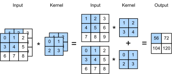

{.python .input}
%load_ext d2lbook.tab
tab.interact_select(['mxnet', 'pytorch', 'tensorflow', 'jax'])
```

# 複数入力チャネルと複数出力チャネル
:label:`sec_channels`

:numref:`subsec_why-conv-channels` では、各画像を構成する複数のチャネル（たとえば、カラー画像には赤・緑・青の量を示す標準的な RGB チャネルがある）や、複数チャネルに対する畳み込み層について説明しましたが、これまでの数値例では、単一の入力チャネルと単一の出力チャネルだけを用いることで、すべてを単純化していました。これにより、入力、畳み込みカーネル、出力をそれぞれ二次元テンソルとして考えることができました。

チャネルを導入すると、入力と隠れ表現の両方が三次元テンソルになります。たとえば、RGB 入力画像の形状は $3\times h\times w$ です。サイズ 3 のこの軸を *チャネル* 次元と呼びます。チャネルという概念は CNN と同じくらい古く、たとえば LeNet-5 :cite:`LeCun.Jackel.Bottou.ea.1995` でも使われています。 
この節では、複数入力チャネルと複数出力チャネルをもつ畳み込みカーネルについて、より詳しく見ていきます。

```{.python .input}
%%tab mxnet
from d2l import mxnet as d2l
from mxnet import np, npx
npx.set_np()
```

```{.python .input}
%%tab pytorch
from d2l import torch as d2l
import torch
```

```{.python .input}
%%tab jax
from d2l import jax as d2l
import jax
from jax import numpy as jnp
```

```{.python .input}
%%tab tensorflow
from d2l import tensorflow as d2l
import tensorflow as tf
```

## 複数入力チャネル

入力データに複数のチャネルが含まれる場合、入力データと同じ数の入力チャネルをもつ畳み込みカーネルを構成する必要があります。そうすることで、入力データとの相互相関を実行できます。入力データのチャネル数を $c_\textrm{i}$ とすると、畳み込みカーネルの入力チャネル数も $c_\textrm{i}$ である必要があります。畳み込みカーネルのウィンドウ形状が $k_\textrm{h}\times k_\textrm{w}$ であるとすると、$c_\textrm{i}=1$ のときは、畳み込みカーネルを形状 $k_\textrm{h}\times k_\textrm{w}$ の二次元テンソルとして考えれば十分です。

しかし、$c_\textrm{i}>1$ のときは、*各* 入力チャネルに対して形状 $k_\textrm{h}\times k_\textrm{w}$ のテンソルを含むカーネルが必要です。これら $c_\textrm{i}$ 個のテンソルを連結すると、形状 $c_\textrm{i}\times k_\textrm{h}\times k_\textrm{w}$ の畳み込みカーネルが得られます。入力と畳み込みカーネルはいずれも $c_\textrm{i}$ 個のチャネルをもつので、入力の二次元テンソルと畳み込みカーネルの二次元テンソルの間で、各チャネルごとに相互相関を計算し、その $c_\textrm{i}$ 個の結果を加算（チャネル方向に和を取る）して、二次元テンソルを得ます。これが、多チャネル入力と複数入力チャネルの畳み込みカーネルとの間の二次元相互相関の結果です。

:numref:`fig_conv_multi_in` は、2 つの入力チャネルをもつ二次元相互相関の例を示しています。網掛け部分は、最初の出力要素と、その出力計算に使われる入力およびカーネルテンソル要素です。
$(1\times1+2\times2+4\times3+5\times4)+(0\times0+1\times1+3\times2+4\times3)=56$。


:label:`fig_conv_multi_in`


ここで何が起きているのかを本当に理解するために、私たち自身で (**複数入力チャネルをもつ相互相関演算を実装**) してみましょう。やっていることは、チャネルごとに相互相関を行い、その結果を足し合わせているだけだという点に注意してください。

```{.python .input}
%%tab mxnet, pytorch, jax
def corr2d_multi_in(X, K):
    # まず K の 0 次元目（チャネル）を反復し、その後でそれらを足し合わせる
    return sum(d2l.corr2d(x, k) for x, k in zip(X, K))
```

```{.python .input}
%%tab tensorflow
def corr2d_multi_in(X, K):
    # まず K の 0 次元目（チャネル）を反復し、その後でそれらを足し合わせる
    return tf.reduce_sum([d2l.corr2d(x, k) for x, k in zip(X, K)], axis=0)
```

:numref:`fig_conv_multi_in` の値に対応する入力テンソル `X` とカーネルテンソル `K` を構成して、相互相関演算の (**出力を検証**) できます。

```{.python .input}
%%tab all
X = d2l.tensor([[[0.0, 1.0, 2.0], [3.0, 4.0, 5.0], [6.0, 7.0, 8.0]],
               [[1.0, 2.0, 3.0], [4.0, 5.0, 6.0], [7.0, 8.0, 9.0]]])
K = d2l.tensor([[[0.0, 1.0], [2.0, 3.0]], [[1.0, 2.0], [3.0, 4.0]]])

corr2d_multi_in(X, K)
```

## 複数出力チャネル
:label:`subsec_multi-output-channels`

入力チャネル数にかかわらず、これまでは常に 1 つの出力チャネルに行き着いていました。しかし、:numref:`subsec_why-conv-channels` で述べたように、各層に複数のチャネルをもつことは本質的です。最も一般的なニューラルネットワークアーキテクチャでは、ニューラルネットワークを深くするにつれてチャネル次元を増やし、通常はダウンサンプリングによって空間分解能と引き換えに、より大きな *チャネル深さ* を得ます。直感的には、各チャネルは異なる特徴群に反応すると考えられます。実際には、これはもう少し複雑です。素朴な解釈では、表現はピクセルごと、あるいはチャネルごとに独立に学習されるように思えるかもしれません。そうではなく、チャネルは協調して有用になるように最適化されます。つまり、単一のチャネルがエッジ検出器に対応するというより、チャネル空間のある方向がエッジ検出に対応している、と考えるほうがよいのです。

入力チャネル数と出力チャネル数をそれぞれ $c_\textrm{i}$ と $c_\textrm{o}$、カーネルの高さと幅を $k_\textrm{h}$ と $k_\textrm{w}$ とします。複数の出力チャネルをもつ出力を得るには、*各* 出力チャネルに対して形状 $c_\textrm{i}\times k_\textrm{h}\times k_\textrm{w}$ のカーネルテンソルを作成できます。それらを出力チャネル次元に沿って連結すると、畳み込みカーネルの形状は $c_\textrm{o}\times c_\textrm{i}\times k_\textrm{h}\times k_\textrm{w}$ になります。相互相関演算では、各出力チャネルの結果は、その出力チャネルに対応する畳み込みカーネルから計算され、入力テンソルのすべてのチャネルから入力を受け取ります。

以下に示すように、複数チャネルの (**出力を計算**) する相互相関関数を実装します。

```{.python .input}
%%tab all
def corr2d_multi_in_out(X, K):
    # K の 0 次元目を反復し、そのたびに入力 X との
    # 相互相関演算を行う。すべての結果を
    # まとめてスタックする
    return d2l.stack([corr2d_multi_in(X, k) for k in K], 0)
```

`K` のカーネルテンソルに `K+1` と `K+2` を連結することで、3 つの出力チャネルをもつ単純な畳み込みカーネルを構成します。

```{.python .input}
%%tab all
K = d2l.stack((K, K + 1, K + 2), 0)
K.shape
```

以下では、入力テンソル `X` に対してカーネルテンソル `K` を用いて相互相関演算を行います。これで出力には 3 つのチャネルが含まれます。最初のチャネルの結果は、前の入力テンソル `X` と複数入力チャネル・単一出力チャネルのカーネルによる結果と一致します。

```{.python .input}
%%tab all
corr2d_multi_in_out(X, K)
```

## $1\times 1$ 畳み込み層
:label:`subsec_1x1`

最初は、[**$1 \times 1$ 畳み込み**]、すなわち $k_\textrm{h} = k_\textrm{w} = 1$ は、あまり意味がないように見えます。そもそも、畳み込みは隣接するピクセルを相関させるものです。$1 \times 1$ 畳み込みは明らかにそうではありません。それにもかかわらず、これは複雑な深層ネットワークの設計にしばしば含まれる人気のある演算です :cite:`Lin.Chen.Yan.2013,Szegedy.Ioffe.Vanhoucke.ea.2017`。実際に何をしているのかを、もう少し詳しく見てみましょう。

最小のウィンドウを使うため、$1\times 1$ 畳み込みは、高さ方向と幅方向の隣接要素どうしの相互作用から成るパターンを認識するという、より大きな畳み込み層の能力を失います。$1\times 1$ 畳み込みで行われる計算は、チャネル次元上だけです。

:numref:`fig_conv_1x1` は、3 つの入力チャネルと 2 つの出力チャネルをもつ $1\times 1$ 畳み込みカーネルを用いた相互相関計算を示しています。入力と出力は同じ高さと幅をもつことに注意してください。出力の各要素は、入力画像の *同じ位置* にある要素の線形結合から導かれます。$1\times 1$ 畳み込み層は、各ピクセル位置に適用される全結合層であり、対応する $c_\textrm{i}$ 個の入力値を $c_\textrm{o}$ 個の出力値へ変換すると考えることができます。とはいえ、これは依然として畳み込み層なので、重みはピクセル位置をまたいで共有されます。したがって、$1\times 1$ 畳み込み層に必要な重みは $c_\textrm{o}\times c_\textrm{i}$ 個（加えてバイアス）です。また、畳み込み層の後には通常、非線形変換が続くことにも注意してください。これにより、$1 \times 1$ 畳み込みを他の畳み込みに単純にまとめてしまうことはできなくなります。 


:label:`fig_conv_1x1`

実際にこれが機能するか確認してみましょう。全結合層を使って $1 \times 1$ 畳み込みを実装します。必要なのは、行列積の前後でデータ形状を少し調整することだけです。

```{.python .input}
%%tab all
def corr2d_multi_in_out_1x1(X, K):
    c_i, h, w = X.shape
    c_o = K.shape[0]
    X = d2l.reshape(X, (c_i, h * w))
    K = d2l.reshape(K, (c_o, c_i))
    # 全結合層での行列積
    Y = d2l.matmul(K, X)
    return d2l.reshape(Y, (c_o, h, w))
```

$1\times 1$ 畳み込みを行う場合、上の関数は、先に実装した相互相関関数 `corr2d_multi_in_out` と等価です。いくつかのサンプルデータで確認してみましょう。

```{.python .input}
%%tab mxnet, pytorch
X = d2l.normal(0, 1, (3, 3, 3))
K = d2l.normal(0, 1, (2, 3, 1, 1))
Y1 = corr2d_multi_in_out_1x1(X, K)
Y2 = corr2d_multi_in_out(X, K)
assert float(d2l.reduce_sum(d2l.abs(Y1 - Y2))) < 1e-6
```

```{.python .input}
%%tab tensorflow
X = d2l.normal((3, 3, 3), 0, 1)
K = d2l.normal((2, 3, 1, 1), 0, 1)
Y1 = corr2d_multi_in_out_1x1(X, K)
Y2 = corr2d_multi_in_out(X, K)
assert float(d2l.reduce_sum(d2l.abs(Y1 - Y2))) < 1e-6
```

```{.python .input}
%%tab jax
X = jax.random.normal(jax.random.PRNGKey(d2l.get_seed()), (3, 3, 3)) + 0 * 1
K = jax.random.normal(jax.random.PRNGKey(d2l.get_seed()), (2, 3, 1, 1)) + 0 * 1
Y1 = corr2d_multi_in_out_1x1(X, K)
Y2 = corr2d_multi_in_out(X, K)
assert float(d2l.reduce_sum(d2l.abs(Y1 - Y2))) < 1e-6
```

## 議論

チャネルによって、MLP がもつ大きな非線形性と、特徴の *局所的* な解析を可能にする畳み込みの、両方の利点を組み合わせることができます。特にチャネルは、エッジ検出器や形状検出器のような複数の特徴を CNN が同時に扱うことを可能にします。また、平行移動不変性と局所性による劇的なパラメータ削減と、コンピュータビジョンにおける表現力豊かで多様なモデルの必要性との間で、実用的なトレードオフも提供します。 

ただし、この柔軟性には代償があることに注意してください。サイズ $(h \times w)$ の画像に対して、$k \times k$ 畳み込みを計算するコストは $\mathcal{O}(h \cdot w \cdot k^2)$ です。入力チャネル数と出力チャネル数をそれぞれ $c_\textrm{i}$ と $c_\textrm{o}$ とすると、これは $\mathcal{O}(h \cdot w \cdot k^2 \cdot c_\textrm{i} \cdot c_\textrm{o})$ に増加します。$256 \times 256$ ピクセルの画像に対して、$5 \times 5$ カーネルとそれぞれ 128 個の入力チャネルおよび出力チャネルを用いると、計算量は 530 億回を超えます（乗算と加算を別々に数えています）。後ほど、たとえばチャネルごとの演算をブロック対角にすることで、ResNeXt :cite:`Xie.Girshick.Dollar.ea.2017` のようなアーキテクチャにつながる、コスト削減の有効な戦略に出会います。 

## 演習

1. それぞれサイズ $k_1$ と $k_2$ の 2 つの畳み込みカーネルがあると仮定します 
   （その間に非線形性はないものとします）。
    1. この演算の結果が 1 つの畳み込みとして表せることを証明してください。
    1. 等価な 1 つの畳み込みの次元はどれくらいですか。
    1. 逆は成り立ちますか。つまり、任意の畳み込みを常に 2 つのより小さい畳み込みに分解できますか。
1. 形状 $c_\textrm{i}\times h\times w$ の入力、形状 $c_\textrm{o}\times c_\textrm{i}\times k_\textrm{h}\times k_\textrm{w}$ の畳み込みカーネル、パディング $(p_\textrm{h}, p_\textrm{w})$、ストライド $(s_\textrm{h}, s_\textrm{w})$ があると仮定します。
    1. 順伝播の計算コスト（乗算と加算）はどれくらいですか。
    1. メモリ使用量はどれくらいですか。
    1. 逆伝播計算のメモリ使用量はどれくらいですか。
    1. 逆伝播の計算コストはどれくらいですか。
1. 入力チャネル数 $c_\textrm{i}$ と出力チャネル数 $c_\textrm{o}$ の両方を 2 倍にすると、計算回数は何倍になりますか。パディングを 2 倍にするとどうなりますか。
1. この節の最後の例における変数 `Y1` と `Y2` は完全に同じですか。なぜですか。
1. 畳み込みウィンドウが $1 \times 1$ でない場合でも、畳み込みを行列積として表現してください。 
1. あなたの課題は、$k \times k$ カーネルを用いた高速畳み込みを実装することです。候補となるアルゴリズムの 1 つは、ソース上を水平方向に走査し、幅 $k$ の帯を読み込んで、幅 1 の出力帯を 1 値ずつ計算する方法です。別の方法は、幅 $k + \Delta$ の帯を読み込み、幅 $\Delta$ の出力帯を計算することです。なぜ後者のほうが望ましいのでしょうか。$\Delta$ をどれだけ大きく選ぶべきかに上限はありますか。
1. $c \times c$ の行列があると仮定します。 
    1. 行列が $b$ 個のブロックに分割されているとき、ブロック対角行列との積はどれくらい高速になりますか。
    1. $b$ 個のブロックをもつことの欠点は何ですか。少なくとも部分的に、それをどう修正できますか。

:begin_tab:`mxnet`
[Discussions](https://discuss.d2l.ai/t/69)
:end_tab:

:begin_tab:`pytorch`
[Discussions](https://discuss.d2l.ai/t/70)
:end_tab:

:begin_tab:`tensorflow`
[Discussions](https://discuss.d2l.ai/t/273)
:end_tab:

:begin_tab:`jax`
[Discussions](https://discuss.d2l.ai/t/17998)
:end_tab:\n