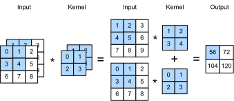
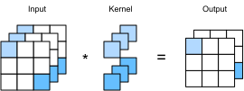

```{.python .input}
%load_ext d2lbook.tab
tab.interact_select(['mxnet', 'pytorch', 'tensorflow', 'jax'])
```

# 複数入力チャネルと複数出力チャネル
:label:`sec_channels`

:numref:`subsec_why-conv-channels` では、画像が複数のチャネルから構成されること（たとえばカラー画像には、赤・緑・青の強度を表す標準的な RGB チャネルがあること）と、複数チャネルに対する畳み込み層について説明した。ただし、これまでの数値例では、単一の入力チャネルと単一の出力チャネルだけを扱い、議論を単純化していた。そのため、入力、畳み込みカーネル、出力はいずれも二次元テンソルとして表せた。

チャネルを導入すると、入力と隠れ表現はいずれも三次元テンソルになる。たとえば RGB 入力画像の形状は $3\times h\times w$ である。この大きさ 3 の軸を *チャネル* 次元と呼ぶ。チャネルという考え方は CNN と同じくらい古く、LeNet-5 :cite:`LeCun.Jackel.Bottou.ea.1995` にも現れている。 
この節では、複数入力チャネルと複数出力チャネルをもつ畳み込みカーネルを詳しく扱う。

```{.python .input}
%%tab mxnet
from d2l import mxnet as d2l
from mxnet import np, npx
npx.set_np()
```

```{.python .input}
%%tab pytorch
from d2l import torch as d2l
import torch
```

```{.python .input}
%%tab jax
from d2l import jax as d2l
import jax
from jax import numpy as jnp
```

```{.python .input}
%%tab tensorflow
from d2l import tensorflow as d2l
import tensorflow as tf
```

## 複数入力チャネル

入力データが複数チャネルをもつ場合、畳み込みカーネルも入力データと同じ数の入力チャネルをもたなければならない。そうして初めて、入力データとの相互相関を計算できる。入力データのチャネル数を $c_\textrm{i}$ とすると、畳み込みカーネルの入力チャネル数も $c_\textrm{i}$ である必要がある。畳み込みカーネルのウィンドウ形状が $k_\textrm{h}\times k_\textrm{w}$ であれば、$c_\textrm{i}=1$ のとき、畳み込みカーネルは形状 $k_\textrm{h}\times k_\textrm{w}$ の二次元テンソルとして扱えば十分である。

しかし、$c_\textrm{i}>1$ のときは、*各* 入力チャネルに対して形状 $k_\textrm{h}\times k_\textrm{w}$ のテンソルを 1 つずつ用意する必要がある。これら $c_\textrm{i}$ 個のテンソルをまとめると、形状 $c_\textrm{i}\times k_\textrm{h}\times k_\textrm{w}$ の畳み込みカーネルになる。入力と畳み込みカーネルはともに $c_\textrm{i}$ 個のチャネルをもつので、各チャネルごとに入力の二次元テンソルとカーネルの二次元テンソルとの相互相関を計算し、その $c_\textrm{i}$ 個の結果を加算する（すなわちチャネル方向に和を取る）。こうして得られる二次元テンソルが、多チャネル入力と複数入力チャネルをもつ畳み込みカーネルとの二次元相互相関の結果である。

:numref:`fig_conv_multi_in` は、2 つの入力チャネルをもつ二次元相互相関の例を示している。網掛け部分は、最初の出力要素と、その計算に用いられる入力およびカーネルの要素を表す。
$(1\times1+2\times2+4\times3+5\times4)+(0\times0+1\times1+3\times2+4\times3)=56$。


:label:`fig_conv_multi_in`


実際に何が起きているかを確かめるために、[**複数入力チャネルをもつ相互相関演算を実装**] してみよう。各チャネルごとに相互相関を計算し、その結果を足し合わせるだけである。

```{.python .input}
%%tab mxnet, pytorch, jax
def corr2d_multi_in(X, K):
    # まず K の 0 次元目（チャネル）を反復し、その後でそれらを足し合わせる
    return sum(d2l.corr2d(x, k) for x, k in zip(X, K))
```

```{.python .input}
%%tab tensorflow
def corr2d_multi_in(X, K):
    # まず K の 0 次元目（チャネル）を反復し、その後でそれらを足し合わせる
    return tf.reduce_sum([d2l.corr2d(x, k) for x, k in zip(X, K)], axis=0)
```

:numref:`fig_conv_multi_in` に対応する入力テンソル `X` とカーネルテンソル `K` を作れば、相互相関演算の [**出力を確認**] できる。

```{.python .input}
%%tab all
X = d2l.tensor([[[0.0, 1.0, 2.0], [3.0, 4.0, 5.0], [6.0, 7.0, 8.0]],
               [[1.0, 2.0, 3.0], [4.0, 5.0, 6.0], [7.0, 8.0, 9.0]]])
K = d2l.tensor([[[0.0, 1.0], [2.0, 3.0]], [[1.0, 2.0], [3.0, 4.0]]])

corr2d_multi_in(X, K)
```

## 複数出力チャネル
:label:`subsec_multi-output-channels`

これまでは、入力チャネル数にかかわらず、常に 1 つの出力チャネルだけを考えてきた。しかし、:numref:`subsec_why-conv-channels` で述べたように、各層が複数のチャネルをもつことは本質的である。多くのニューラルネットワークアーキテクチャでは、ネットワークを深くするにつれてチャネル次元を増やし、通常はダウンサンプリングによって空間分解能を下げる代わりに、より大きな *チャネル深さ* を得る。直感的には、各チャネルは異なる特徴群に応答すると考えられる。実際には、状況はもう少し複雑である。素朴には、表現がピクセルごと、あるいはチャネルごとに独立して学習されるように見えるかもしれない。しかし実際には、チャネルは互いに協調して有用になるよう最適化される。したがって、単一のチャネルがエッジ検出器に対応すると考えるよりも、チャネル空間のある方向がエッジ検出に対応すると考えるほうが適切である。

入力チャネル数と出力チャネル数をそれぞれ $c_\textrm{i}$ と $c_\textrm{o}$、カーネルの高さと幅を $k_\textrm{h}$ と $k_\textrm{w}$ とする。複数の出力チャネルを得るには、*各* 出力チャネルに対して形状 $c_\textrm{i}\times k_\textrm{h}\times k_\textrm{w}$ のカーネルテンソルを用意すればよい。これらを出力チャネル次元に沿ってまとめると、畳み込みカーネル全体の形状は $c_\textrm{o}\times c_\textrm{i}\times k_\textrm{h}\times k_\textrm{w}$ になる。相互相関演算では、各出力チャネルは対応する畳み込みカーネルから計算され、入力テンソルのすべてのチャネルを利用する。

以下のように、複数チャネルの [**出力を計算**] する相互相関関数を実装する。

```{.python .input}
%%tab all
def corr2d_multi_in_out(X, K):
    # K の 0 次元目を反復し、そのたびに入力 X との
    # 相互相関演算を行う。すべての結果を
    # まとめてスタックする
    return d2l.stack([corr2d_multi_in(X, k) for k in K], 0)
```

`K` のカーネルテンソルに `K+1` と `K+2` を連結し、3 つの出力チャネルをもつ単純な畳み込みカーネルを作る。

```{.python .input}
%%tab all
K = d2l.stack((K, K + 1, K + 2), 0)
K.shape
```

次に、入力テンソル `X` に対してカーネルテンソル `K` を用いて相互相関演算を行う。出力は 3 つのチャネルをもつ。最初のチャネルの結果は、先ほどの複数入力チャネル・単一出力チャネルの場合と一致する。

```{.python .input}
%%tab all
corr2d_multi_in_out(X, K)
```

## $1\times 1$ 畳み込み層
:label:`subsec_1x1`

一見すると、[**$1 \times 1$ 畳み込み**]、すなわち $k_\textrm{h} = k_\textrm{w} = 1$ は意味が薄いように思える。畳み込みは本来、隣接するピクセル間の相関を捉える演算であり、$1 \times 1$ 畳み込みは明らかにそれを行わない。それにもかかわらず、これは複雑な深層ネットワークの設計でしばしば用いられる重要な演算である :cite:`Lin.Chen.Yan.2013,Szegedy.Ioffe.Vanhoucke.ea.2017`。その役割を詳しく見ていこう。

最小のウィンドウしか使わないため、$1\times 1$ 畳み込みは、高さ方向や幅方向の隣接要素どうしの相互作用からなるパターンを捉える能力をもたない。$1\times 1$ 畳み込みで行われる計算は、チャネル次元に沿ったものだけである。

:numref:`fig_conv_1x1` は、3 つの入力チャネルと 2 つの出力チャネルをもつ $1\times 1$ 畳み込みカーネルによる相互相関計算を示している。入力と出力は同じ高さと幅をもつ。出力の各要素は、入力画像の *同じ位置* にある要素の線形結合として得られる。したがって、$1\times 1$ 畳み込み層は、各ピクセル位置に適用される全結合層とみなせる。すなわち、対応する $c_\textrm{i}$ 個の入力値を $c_\textrm{o}$ 個の出力値へ変換するのである。ただし、これは依然として畳み込み層であり、重みはすべてのピクセル位置で共有される。ゆえに、$1\times 1$ 畳み込み層に必要な重みの数は $c_\textrm{o}\times c_\textrm{i}$ 個（加えてバイアス）である。また、畳み込み層の後には通常、非線形変換が続く。このため、$1 \times 1$ 畳み込みを他の畳み込みへ単純に吸収することはできない。 


:label:`fig_conv_1x1`

実際にこれが機能することを確かめよう。全結合層を用いて $1 \times 1$ 畳み込みを実装する。必要なのは、行列積の前後でデータ形状を少し調整することだけである。

```{.python .input}
%%tab all
def corr2d_multi_in_out_1x1(X, K):
    c_i, h, w = X.shape
    c_o = K.shape[0]
    X = d2l.reshape(X, (c_i, h * w))
    K = d2l.reshape(K, (c_o, c_i))
    # 全結合層での行列積
    Y = d2l.matmul(K, X)
    return d2l.reshape(Y, (c_o, h, w))
```

$1\times 1$ 畳み込みでは、上の関数は先に実装した相互相関関数 `corr2d_multi_in_out` と等価である。いくつかのサンプルデータで確かめよう。

```{.python .input}
%%tab mxnet, pytorch
X = d2l.normal(0, 1, (3, 3, 3))
K = d2l.normal(0, 1, (2, 3, 1, 1))
Y1 = corr2d_multi_in_out_1x1(X, K)
Y2 = corr2d_multi_in_out(X, K)
assert float(d2l.reduce_sum(d2l.abs(Y1 - Y2))) < 1e-6
```

```{.python .input}
%%tab tensorflow
X = d2l.normal((3, 3, 3), 0, 1)
K = d2l.normal((2, 3, 1, 1), 0, 1)
Y1 = corr2d_multi_in_out_1x1(X, K)
Y2 = corr2d_multi_in_out(X, K)
assert float(d2l.reduce_sum(d2l.abs(Y1 - Y2))) < 1e-6
```

```{.python .input}
%%tab jax
X = jax.random.normal(jax.random.PRNGKey(d2l.get_seed()), (3, 3, 3)) + 0 * 1
K = jax.random.normal(jax.random.PRNGKey(d2l.get_seed()), (2, 3, 1, 1)) + 0 * 1
Y1 = corr2d_multi_in_out_1x1(X, K)
Y2 = corr2d_multi_in_out(X, K)
assert float(d2l.reduce_sum(d2l.abs(Y1 - Y2))) < 1e-6
```

## 議論

チャネルを導入すると、MLP の大きな非線形性と、特徴の *局所的* 解析を可能にする畳み込みの利点を組み合わせられる。とりわけ、CNN はエッジ検出器や形状検出器のような複数の特徴を同時に扱えるようになる。また、平行移動不変性と局所性による大幅なパラメータ削減と、コンピュータビジョンで求められる表現力豊かで多様なモデルとの間で、実用的な折衷も与える。 

ただし、この柔軟性には代償がある。サイズ $(h \times w)$ の画像に対して $k \times k$ 畳み込みを計算するコストは $\mathcal{O}(h \cdot w \cdot k^2)$ である。入力チャネル数と出力チャネル数をそれぞれ $c_\textrm{i}$ と $c_\textrm{o}$ とすると、これは $\mathcal{O}(h \cdot w \cdot k^2 \cdot c_\textrm{i} \cdot c_\textrm{o})$ に増える。$256 \times 256$ ピクセルの画像に対し、$5 \times 5$ カーネルと 128 個ずつの入力チャネルおよび出力チャネルを用いると、計算量は 530 億回を超える（乗算と加算を別々に数える）。後に、たとえばチャネルごとの演算をブロック対角化することで計算コストを下げる有効な戦略を見る。これは ResNeXt :cite:`Xie.Girshick.Dollar.ea.2017` のようなアーキテクチャにつながる。 

## 演習

1. それぞれサイズ $k_1$ と $k_2$ の 2 つの畳み込みカーネルがあると仮定する 
   （その間に非線形性はないものとする）。
    1. この演算の結果が 1 つの畳み込みとして表せることを証明せよ。
    1. 等価な 1 つの畳み込みの次元はどれくらいか？
    1. 逆は成り立つか？ つまり、任意の畳み込みを常に 2 つのより小さい畳み込みに分解できるか？
1. 形状 $c_\textrm{i}\times h\times w$ の入力、形状 $c_\textrm{o}\times c_\textrm{i}\times k_\textrm{h}\times k_\textrm{w}$ の畳み込みカーネル、パディング $(p_\textrm{h}, p_\textrm{w})$、ストライド $(s_\textrm{h}, s_\textrm{w})$ があると仮定する。
    1. 順伝播の計算コスト（乗算と加算）はどれくらいか？
    1. メモリ使用量はどれくらいか？
    1. 逆伝播計算のメモリ使用量はどれくらいか？
    1. 逆伝播の計算コストはどれくらいか？
1. 入力チャネル数 $c_\textrm{i}$ と出力チャネル数 $c_\textrm{o}$ の両方を 2 倍にすると、計算回数は何倍になるか？ パディングを 2 倍にするとどうなるか？
1. この節の最後の例における変数 `Y1` と `Y2` は完全に同じか？ なぜか？
1. 畳み込みウィンドウが $1 \times 1$ でない場合でも、畳み込みを行列積として表現せよ。 
1. あなたの課題は、$k \times k$ カーネルを用いた高速畳み込みを実装することである。候補となるアルゴリズムの 1 つは、入力を水平方向に走査し、幅 $k$ の帯を読み込んで、幅 1 の出力帯を 1 要素ずつ計算する方法である。別の方法は、幅 $k + \Delta$ の帯を読み込み、幅 $\Delta$ の出力帯を計算することである。なぜ後者のほうが望ましいのか？ $\Delta$ をどれだけ大きく選べるかに上限はあるか？
1. $c \times c$ の行列があると仮定する。 
    1. 行列が $b$ 個のブロックに分割されているとき、ブロック対角行列との積はどれくらい高速になるか？
    1. $b$ 個のブロックをもつことの欠点は何か？ 少なくとも部分的に、それをどう補えるか？