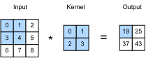

{.python .input}
%load_ext d2lbook.tab
tab.interact_select(['mxnet', 'pytorch', 'tensorflow', 'jax'])
```

# 画像のための畳み込み
:label:`sec_conv_layer`

ここまでで、畳み込み層が理論上どのように動作するかを理解した。
いよいよ、実際にどのように機能するかを見ていこう。
画像データの構造を効率よく探索するためのアーキテクチャとして畳み込みニューラルネットワークを考えるという動機に基づき、
ここでは引き続き画像を例として用いる。

```{.python .input}
%%tab mxnet
from d2l import mxnet as d2l
from mxnet import autograd, np, npx
from mxnet.gluon import nn
npx.set_np()
```

```{.python .input}
%%tab pytorch
from d2l import torch as d2l
import torch
from torch import nn
```

```{.python .input}
%%tab jax
from d2l import jax as d2l
from flax import linen as nn
import jax
from jax import numpy as jnp
```

```{.python .input}
%%tab tensorflow
from d2l import tensorflow as d2l
import tensorflow as tf
```

## 相互相関演算

厳密に言えば、畳み込み層という呼び方はやや不正確であり、
そこで表現される演算は、より正確には相互相関と呼ぶべきものである。
:numref:`sec_why-conv` における畳み込み層の説明に基づくと、
このような層では、入力テンソルとカーネルテンソルが
[**相互相関演算**] を通じて結合され、出力テンソルが生成される。

ここではまずチャネルを無視して、
2次元データと隠れ表現でこれがどのように機能するかを見てみよう。
:numref:`fig_correlation` では、入力は高さ 3、幅 3 の2次元テンソルである。
テンソルの形状は $3 \times 3$ または ($3$, $3$) と表す。
カーネルの高さと幅はいずれも 2 である。
*カーネルウィンドウ*（または *畳み込みウィンドウ*）の形状は、
カーネルの高さと幅によって与えられる（ここでは $2 \times 2$ である）。


:label:`fig_correlation`

2次元相互相関演算では、
まず畳み込みウィンドウを入力テンソルの左上隅に置き、
そこから入力テンソル上を左から右へ、上から下へとスライドさせる。
畳み込みウィンドウがある位置に移動すると、
そのウィンドウに含まれる入力部分テンソルとカーネルテンソルを要素ごとに掛け合わせ、
その結果のテンソルを総和して
1つのスカラー値を得る。
この結果が、対応する位置における出力テンソルの値になる。
ここでは、出力テンソルの高さは 2、幅は 2 であり、
4つの要素は2次元相互相関演算から次のように得られる。

$$
0\times0+1\times1+3\times2+4\times3=19,\\
1\times0+2\times1+4\times2+5\times3=25,\\
3\times0+4\times1+6\times2+7\times3=37,\\
4\times0+5\times1+7\times2+8\times3=43.
$$

各軸に沿って見ると、出力サイズは入力サイズよりわずかに小さくなっている。
カーネルの幅と高さが 1 より大きいため、
カーネルが画像内に完全に収まる位置でしか相互相関を正しく計算できない。
そのため、出力サイズは入力サイズ $n_\textrm{h} \times n_\textrm{w}$
から畳み込みカーネルのサイズ $k_\textrm{h} \times k_\textrm{w}$ を引いて、

$$(n_\textrm{h}-k_\textrm{h}+1) \times (n_\textrm{w}-k_\textrm{w}+1).$$

となる。

これは、畳み込みカーネルを画像上で「ずらす」ための十分な空間が必要だからである。
後で、画像の境界の周囲にゼロを埋め込むことで、
カーネルをずらすための十分な空間を確保し、サイズを変えずに保つ方法を見る。
次に、この処理を `corr2d` 関数として実装する。
この関数は入力テンソル `X` とカーネルテンソル `K` を受け取り、出力テンソル `Y` を返す。

```{.python .input}
%%tab mxnet
def corr2d(X, K):  #@save
    """Compute 2D cross-correlation."""
    h, w = K.shape
    Y = d2l.zeros((X.shape[0] - h + 1, X.shape[1] - w + 1))
    for i in range(Y.shape[0]):
        for j in range(Y.shape[1]):
            Y[i, j] = d2l.reduce_sum((X[i: i + h, j: j + w] * K))
    return Y
```

```{.python .input}
%%tab pytorch
def corr2d(X, K):  #@save
    """Compute 2D cross-correlation."""
    h, w = K.shape
    Y = d2l.zeros((X.shape[0] - h + 1, X.shape[1] - w + 1))
    for i in range(Y.shape[0]):
        for j in range(Y.shape[1]):
            Y[i, j] = d2l.reduce_sum((X[i: i + h, j: j + w] * K))
    return Y
```

```{.python .input}
%%tab jax
def corr2d(X, K):  #@save
    """Compute 2D cross-correlation."""
    h, w = K.shape
    Y = jnp.zeros((X.shape[0] - h + 1, X.shape[1] - w + 1))
    for i in range(Y.shape[0]):
        for j in range(Y.shape[1]):
            Y = Y.at[i, j].set((X[i:i + h, j:j + w] * K).sum())
    return Y
```

```{.python .input}
%%tab tensorflow
def corr2d(X, K):  #@save
    """Compute 2D cross-correlation."""
    h, w = K.shape
    Y = tf.Variable(tf.zeros((X.shape[0] - h + 1, X.shape[1] - w + 1)))
    for i in range(Y.shape[0]):
        for j in range(Y.shape[1]):
            Y[i, j].assign(tf.reduce_sum(
                X[i: i + h, j: j + w] * K))
    return Y
```

入力テンソル `X` とカーネルテンソル `K` を :numref:`fig_correlation` から構成し、
上の実装が2次元相互相関演算の出力を [**正しく与えることを確認**] できる。

```{.python .input}
%%tab all
X = d2l.tensor([[0.0, 1.0, 2.0], [3.0, 4.0, 5.0], [6.0, 7.0, 8.0]])
K = d2l.tensor([[0.0, 1.0], [2.0, 3.0]])
corr2d(X, K)
```

## 畳み込み層

畳み込み層は、入力とカーネルの相互相関を計算し、
さらにスカラーのバイアスを加えて出力を生成する。
畳み込み層の2つのパラメータは、カーネルとスカラーのバイアスである。
畳み込み層に基づくモデルを学習するときには、
全結合層の場合と同様に、通常カーネルをランダムに初期化する。

ここで、上で定義した `corr2d` 関数に基づいて、
[**2次元畳み込み層を実装**] する準備が整った。
`__init__` コンストラクタメソッドでは、
`weight` と `bias` を2つのモデルパラメータとして宣言する。
順伝播メソッドは `corr2d` 関数を呼び出し、バイアスを加える。

```{.python .input}
%%tab mxnet
class Conv2D(nn.Block):
    def __init__(self, kernel_size, **kwargs):
        super().__init__(**kwargs)
        self.weight = self.params.get('weight', shape=kernel_size)
        self.bias = self.params.get('bias', shape=(1,))

    def forward(self, x):
        return corr2d(x, self.weight.data()) + self.bias.data()
```

```{.python .input}
%%tab pytorch
class Conv2D(nn.Module):
    def __init__(self, kernel_size):
        super().__init__()
        self.weight = nn.Parameter(torch.rand(kernel_size))
        self.bias = nn.Parameter(torch.zeros(1))

    def forward(self, x):
        return corr2d(x, self.weight) + self.bias
```

```{.python .input}
%%tab tensorflow
class Conv2D(tf.keras.layers.Layer):
    def __init__(self):
        super().__init__()

    def build(self, kernel_size):
        initializer = tf.random_normal_initializer()
        self.weight = self.add_weight(name='w', shape=kernel_size,
                                      initializer=initializer)
        self.bias = self.add_weight(name='b', shape=(1, ),
                                    initializer=initializer)

    def call(self, inputs):
        return corr2d(inputs, self.weight) + self.bias
```

```{.python .input}
%%tab jax
class Conv2D(nn.Module):
    kernel_size: int

    def setup(self):
        self.weight = nn.param('w', nn.initializers.uniform, self.kernel_size)
        self.bias = nn.param('b', nn.initializers.zeros, 1)

    def forward(self, x):
        return corr2d(x, self.weight) + self.bias
```

$h \times w$ 畳み込み、または $h \times w$ 畳み込みカーネルでは、
畳み込みカーネルの高さと幅はそれぞれ $h$ と $w$ である。
また、$h \times w$ 畳み込みカーネルをもつ畳み込み層を、
単に $h \times w$ 畳み込み層とも呼ぶ。


## 画像における物体のエッジ検出

画素の変化位置を見つけることで、
[**畳み込み層の簡単な応用である、画像中の物体のエッジ検出**] を少し見てみよう。
まず、$6\times 8$ ピクセルの「画像」を構成する。
中央の4列は黒（$0$）で、それ以外は白（$1$）である。

```{.python .input}
%%tab mxnet, pytorch
X = d2l.ones((6, 8))
X[:, 2:6] = 0
X
```

```{.python .input}
%%tab tensorflow
X = tf.Variable(tf.ones((6, 8)))
X[:, 2:6].assign(tf.zeros(X[:, 2:6].shape))
X
```

```{.python .input}
%%tab jax
X = jnp.ones((6, 8))
X = X.at[:, 2:6].set(0)
X
```

次に、高さ 1、幅 2 のカーネル `K` を構成する。
入力に対して相互相関演算を行うと、
水平方向に隣接する要素が同じなら出力は 0 になる。
そうでなければ、出力は 0 ではない。
このカーネルは有限差分演算子の特殊な場合であることに注意してほしい。位置 $(i,j)$ では $x_{i,j} - x_{(i+1),j}$ を計算する。つまり、水平方向に隣接する画素の値の差を計算している。これは、水平方向の1階微分の離散近似である。実際、関数 $f(i,j)$ に対して、その微分は $-\partial_i f(i,j) = \lim_{\epsilon \to 0} \frac{f(i,j) - f(i+\epsilon,j)}{\epsilon}$ である。これが実際にどのように働くか見てみよう。

```{.python .input}
%%tab all
K = d2l.tensor([[1.0, -1.0]])
```

入力 `X` とカーネル `K` を用いて相互相関演算を行う準備ができた。
ご覧のとおり、[**白から黒へのエッジでは 1 を検出し、
黒から白へのエッジでは -1 を検出する。**]
それ以外の出力はすべて 0 である。

```{.python .input}
%%tab all
Y = corr2d(X, K)
Y
```

次に、このカーネルを転置した画像に適用できる。
予想どおり、結果は 0 になる。[**カーネル `K` は垂直エッジのみを検出する。**]

```{.python .input}
%%tab all
corr2d(d2l.transpose(X), K)
```

## カーネルの学習

有限差分 `[1, -1]` によるエッジ検出器を設計するのは、
まさにそれが必要なものだと分かっているなら簡潔で美しい方法である。
しかし、より大きなカーネルを考えたり、
畳み込み層を何層も重ねたりすると、
各フィルタが何をすべきかを手作業で正確に指定するのは不可能かもしれない。

では、入力と出力のペアだけを見て、
`X` から `Y` を生成したカーネルを [**学習できるか**] を見てみよう。
まず畳み込み層を構成し、そのカーネルをランダムなテンソルとして初期化する。
次に、各反復で二乗誤差を用いて `Y` と畳み込み層の出力を比較する。
その後、勾配を計算してカーネルを更新できる。
簡単のため、以下では
2次元畳み込み層の組み込みクラスを使い、
バイアスは無視する。

```{.python .input}
%%tab mxnet
# Construct a two-dimensional convolutional layer with 1 output channel and a
# kernel of shape (1, 2). For the sake of simplicity, we ignore the bias here
conv2d = nn.Conv2D(1, kernel_size=(1, 2), use_bias=False)
conv2d.initialize()

# The two-dimensional convolutional layer uses four-dimensional input and
# output in the format of (example, channel, height, width), where the batch
# size (number of examples in the batch) and the number of channels are both 1
X = X.reshape(1, 1, 6, 8)
Y = Y.reshape(1, 1, 6, 7)
lr = 3e-2  # Learning rate

for i in range(10):
    with autograd.record():
        Y_hat = conv2d(X)
        l = (Y_hat - Y) ** 2
    l.backward()
    # Update the kernel
    conv2d.weight.data()[:] -= lr * conv2d.weight.grad()
    if (i + 1) % 2 == 0:
        print(f'epoch {i + 1}, loss {float(l.sum()):.3f}')
```

```{.python .input}
%%tab pytorch
# Construct a two-dimensional convolutional layer with 1 output channel and a
# kernel of shape (1, 2). For the sake of simplicity, we ignore the bias here
conv2d = nn.LazyConv2d(1, kernel_size=(1, 2), bias=False)

# The two-dimensional convolutional layer uses four-dimensional input and
# output in the format of (example, channel, height, width), where the batch
# size (number of examples in the batch) and the number of channels are both 1
X = X.reshape((1, 1, 6, 8))
Y = Y.reshape((1, 1, 6, 7))
lr = 3e-2  # Learning rate

for i in range(10):
    Y_hat = conv2d(X)
    l = (Y_hat - Y) ** 2
    conv2d.zero_grad()
    l.sum().backward()
    # Update the kernel
    conv2d.weight.data[:] -= lr * conv2d.weight.grad
    if (i + 1) % 2 == 0:
        print(f'epoch {i + 1}, loss {l.sum():.3f}')
```

```{.python .input}
%%tab tensorflow
# Construct a two-dimensional convolutional layer with 1 output channel and a
# kernel of shape (1, 2). For the sake of simplicity, we ignore the bias here
conv2d = tf.keras.layers.Conv2D(1, (1, 2), use_bias=False)

# The two-dimensional convolutional layer uses four-dimensional input and
# output in the format of (example, height, width, channel), where the batch
# size (number of examples in the batch) and the number of channels are both 1
X = tf.reshape(X, (1, 6, 8, 1))
Y = tf.reshape(Y, (1, 6, 7, 1))
lr = 3e-2  # Learning rate

Y_hat = conv2d(X)
for i in range(10):
    with tf.GradientTape(watch_accessed_variables=False) as g:
        g.watch(conv2d.weights[0])
        Y_hat = conv2d(X)
        l = (abs(Y_hat - Y)) ** 2
        # Update the kernel
        update = tf.multiply(lr, g.gradient(l, conv2d.weights[0]))
        weights = conv2d.get_weights()
        weights[0] = conv2d.weights[0] - update
        conv2d.set_weights(weights)
        if (i + 1) % 2 == 0:
            print(f'epoch {i + 1}, loss {tf.reduce_sum(l):.3f}')
```

```{.python .input}
%%tab jax
# Construct a two-dimensional convolutional layer with 1 output channel and a
# kernel of shape (1, 2). For the sake of simplicity, we ignore the bias here
conv2d = nn.Conv(1, kernel_size=(1, 2), use_bias=False, padding='VALID')

# The two-dimensional convolutional layer uses four-dimensional input and
# output in the format of (example, height, width, channel), where the batch
# size (number of examples in the batch) and the number of channels are both 1
X = X.reshape((1, 6, 8, 1))
Y = Y.reshape((1, 6, 7, 1))
lr = 3e-2  # Learning rate

params = conv2d.init(jax.random.PRNGKey(d2l.get_seed()), X)

def loss(params, X, Y):
    Y_hat = conv2d.apply(params, X)
    return ((Y_hat - Y) ** 2).sum()

for i in range(10):
    l, grads = jax.value_and_grad(loss)(params, X, Y)
    # Update the kernel
    params = jax.tree_map(lambda p, g: p - lr * g, params, grads)
    if (i + 1) % 2 == 0:
        print(f'epoch {i + 1}, loss {l:.3f}')
```

10回の反復の後で誤差が小さな値まで下がっていることに注意してほしい。では、[**学習したカーネルテンソルを見てみよう。**]

```{.python .input}
%%tab mxnet
d2l.reshape(conv2d.weight.data(), (1, 2))
```

```{.python .input}
%%tab pytorch
d2l.reshape(conv2d.weight.data, (1, 2))
```

```{.python .input}
%%tab tensorflow
d2l.reshape(conv2d.get_weights()[0], (1, 2))
```

```{.python .input}
%%tab jax
params['params']['kernel'].reshape((1, 2))
```

実際、学習されたカーネルテンソルは、先ほど定義したカーネルテンソル `K` に驚くほど近いものになっている。

## 相互相関と畳み込み

:numref:`sec_why-conv` で述べた、相互相関演算と畳み込み演算の対応関係を思い出してほしい。
ここでは引き続き2次元畳み込み層を考える。
このような層が、相互相関ではなく :eqref:`eq_2d-conv-discrete` で定義された厳密な畳み込み演算を行うとしたらどうなるだろうか。
厳密な *畳み込み* 演算の出力を得るには、2次元カーネルテンソルを水平方向と垂直方向の両方で反転させたうえで、入力テンソルに対して *相互相関* 演算を行えばよいだけである。

注目すべきことに、深層学習ではカーネルはデータから学習されるため、
畳み込み層が厳密な畳み込み演算を行うか、
相互相関演算を行うかにかかわらず、
その出力は変わらない。

これを説明するために、畳み込み層が *相互相関* を行い、
:numref:`fig_correlation` におけるカーネルを学習したとしよう。
ここではそれを行列 $\mathbf{K}$ と表す。
他の条件が同じだと仮定すると、
この層が厳密な *畳み込み* を行う場合、
学習されるカーネル $\mathbf{K}'$ は、
$\mathbf{K}'$ を水平方向と垂直方向の両方で反転させたものが $\mathbf{K}$ と同じになる。
言い換えると、
畳み込み層が :numref:`fig_correlation` の入力と $\mathbf{K}'$ に対して厳密な *畳み込み* を行うと、
:numref:`fig_correlation` と同じ出力
（入力と $\mathbf{K}$ の相互相関）
が得られる。

深層学習の文献における標準的な用語法に従い、
厳密には少し異なるにもかかわらず、ここでも相互相関演算を畳み込みと呼び続ける。
さらに、
*要素* という用語は、
層の表現や畳み込みカーネルを表す任意のテンソルのエントリ（または成分）を指すために用いる。


## 特徴マップと受容野

:numref:`subsec_why-conv-channels` で述べたように、
:numref:`fig_correlation` における畳み込み層の出力は、
空間次元（たとえば幅と高さ）における学習された表現（特徴）を後続層へ渡すものとみなせるため、
*特徴マップ* と呼ばれることがある。
CNNでは、ある層の任意の要素 $x$ に対して、
その *受容野* とは、
順伝播の間に $x$ の計算に影響を与えうる
（すべての前の層からの）要素全体を指す。
受容野は入力の実際のサイズより大きくなることもある点に注意してほしい。

受容野を説明するために、引き続き :numref:`fig_correlation` を使おう。
$2 \times 2$ の畳み込みカーネルが与えられたとき、
網掛けされた出力要素（値 19）の受容野は、
入力の網掛け部分にある4つの要素である。
ここで $2 \times 2$ の出力を $\mathbf{Y}$ と表し、
$\mathbf{Y}$ を入力として受け取り、単一要素 $z$ を出力する、
追加の $2 \times 2$ 畳み込み層をもつより深い CNN を考える。
この場合、$\mathbf{Y}$ 上での $z$ の受容野には $\mathbf{Y}$ の4要素すべてが含まれ、
入力上での受容野には9個の入力要素すべてが含まれる。
したがって、特徴マップ内の任意の要素が、
より広い領域にわたる入力特徴を検出するためにより大きな受容野を必要とするなら、
より深いネットワークを構成すればよいのである。


受容野という名称は神経生理学に由来する。
さまざまな刺激を用いた多様な動物に対する一連の実験
:cite:`Hubel.Wiesel.1959,Hubel.Wiesel.1962,Hubel.Wiesel.1968` は、いわゆる視覚野の反応を調べた。
概して、低い層はエッジや関連する形状に反応することが分かった。
その後、:citet:`Field.1987` は、自然画像に対してこの効果を、まさに畳み込みカーネルと呼ぶほかないもので示した。
その顕著な類似性を示すために、重要な図を :numref:`field_visual` に再掲する。


:label:`field_visual`

実際、この関係は、画像分類タスクで学習されたネットワークのより深い層で計算される特徴にも当てはまることが、たとえば :citet:`Kuzovkin.Vicente.Petton.ea.2018` によって示されている。
要するに、畳み込みは生物学においてもコードにおいても、コンピュータビジョンにとって非常に強力な道具であることが証明されてきた。
そのため、深層学習における最近の成功を（今となっては）畳み込みが予告していたとしても、驚くにはあたらない。

## まとめ

畳み込み層に必要な中心的計算は相互相関演算である。
単純な入れ子の for ループだけでその値を計算できることを見た。
入力チャネルと出力チャネルが複数ある場合には、チャネル間で行列-行列演算を行う。
見てきたように、計算は単純で、何よりも非常に *局所的* である。
これにより、ハードウェア最適化の余地が大きくなり、近年のコンピュータビジョンの多くの成果はそれによってのみ可能になっている。
結局のところ、畳み込みの最適化では、メモリよりも高速計算にチップ設計者が投資できることを意味する。
これは他の用途に対して最適な設計をもたらすとは限らないが、普及しやすく手頃なコンピュータビジョンへの扉を開く。

畳み込みそのものについて言えば、エッジや線の検出、画像のぼかし、鮮鋭化など、多くの目的に使える。
最も重要なのは、統計家（あるいはエンジニア）が適切なフィルタを発明する必要がないことである。
その代わりに、データからそれらを単に *学習* すればよいのである。
これにより、特徴量設計の経験則は、証拠に基づく統計へと置き換えられる。
最後に、そして実に喜ばしいことに、これらのフィルタは深いネットワークを構築するうえで有利であるだけでなく、脳における受容野や特徴マップにも対応している。
これは、私たちが正しい方向に進んでいるという自信を与えてくれる。

## 演習

1. 対角線のエッジをもつ画像 `X` を構成せよ。
    1. この節のカーネル `K` を適用するとどうなるか。
    1. `X` を転置するとどうなるか。
    1. `K` を転置するとどうなるか。
1. いくつかのカーネルを手作業で設計せよ。
    1. 方向ベクトル $\mathbf{v} = (v_1, v_2)$ が与えられたとき、$\mathbf{v}$ に直交するエッジ、すなわち $(v_2, -v_1)$ 方向のエッジを検出するエッジ検出カーネルを導出せよ。
    1. 2階微分の有限差分演算子を導出せよ。それに対応する畳み込みカーネルの最小サイズはいくつか。画像中のどの構造がそれに最も強く反応するか。
    1. ぼかしカーネルをどのように設計するか。そのようなカーネルを使いたいのはなぜか。
    1. $d$ 階微分を得るためのカーネルの最小サイズはいくつか。
1. ここで作成した `Conv2D` クラスの勾配を自動的に求めようとすると、どのようなエラーメッセージが表示されるか。
1. 入力テンソルとカーネルテンソルを変形することで、相互相関演算を行列乗算としてどのように表現できるか。
