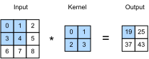

{.python .input}
%load_ext d2lbook.tab
tab.interact_select(['mxnet', 'pytorch', 'tensorflow', 'jax'])
```

# 画像のための畳み込み
:label:`sec_conv_layer`

ここまでで、畳み込み層が理論的にどのように動作するかを見てきた。
次は、それが実際にどのように機能するかを扱う。
畳み込みニューラルネットワークは、画像データの構造を効率よく活用するためのアーキテクチャとして導入された。
したがって、ここでも引き続き画像を例に説明する。

```{.python .input}
%%tab mxnet
from d2l import mxnet as d2l
from mxnet import autograd, np, npx
from mxnet.gluon import nn
npx.set_np()
```

```{.python .input}
%%tab pytorch
from d2l import torch as d2l
import torch
from torch import nn
```

```{.python .input}
%%tab jax
from d2l import jax as d2l
from flax import linen as nn
import jax
from jax import numpy as jnp
```

```{.python .input}
%%tab tensorflow
from d2l import tensorflow as d2l
import tensorflow as tf
```

## 相互相関演算

厳密には、「畳み込み層」という呼び方はやや不正確である。
この層で実際に計算しているのは、より正確には相互相関である。
:numref:`sec_why-conv` で説明したように、
この種の層では入力テンソルとカーネルテンソルを
[**相互相関演算**] によって結合し、出力テンソルを得る。

まずはチャネルを無視し、
2次元データと隠れ表現に対してこれがどのように働くかを見よう。
:numref:`fig_correlation` の入力は、高さ 3、幅 3 の2次元テンソルである。
テンソルの形状は $3 \times 3$ または ($3$, $3$) と書く。
カーネルの高さと幅はいずれも 2 である。
*カーネルウィンドウ*（または *畳み込みウィンドウ*）の形状は、
カーネルの高さと幅で決まり、この例では $2 \times 2$ である。


:label:`fig_correlation`

2次元相互相関演算では、
まず畳み込みウィンドウを入力テンソルの左上隅に置き、
そこから入力テンソル上を左から右へ、上から下へと順にスライドさせる。
ウィンドウがある位置にあるとき、
その内部の入力部分テンソルとカーネルテンソルを要素ごとに掛け合わせ、
得られた値を総和して
1つのスカラーを得る。
この結果が、その位置に対応する出力テンソルの値になる。
この例では、出力テンソルの高さは 2、幅は 2 であり、
4つの要素は次のように計算される。

$$
0\times0+1\times1+3\times2+4\times3=19,\\
1\times0+2\times1+4\times2+5\times3=25,\\
3\times0+4\times1+6\times2+7\times3=37,\\
4\times0+5\times1+7\times2+8\times3=43.
$$

各軸について見ると、出力サイズは入力サイズよりやや小さくなる。
カーネルの幅と高さが 1 より大きいため、
カーネルが画像内に完全に収まる位置でしか相互相関を計算できないからである。
その結果、出力サイズは入力サイズ $n_\textrm{h} \times n_\textrm{w}$
とカーネルサイズ $k_\textrm{h} \times k_\textrm{w}$ に対して

$$(n_\textrm{h}-k_\textrm{h}+1) \times (n_\textrm{w}-k_\textrm{w}+1).$$

となる。

これは、畳み込みカーネルを画像上で「ずらす」ための十分な空間が必要だからである。
後で、画像の境界の周囲をゼロ埋めすることで、
サイズを保ったままカーネルを十分に移動できるようにする方法を見る。
次に、この処理を `corr2d` 関数として実装する。
この関数は入力テンソル `X` とカーネルテンソル `K` を受け取り、出力テンソル `Y` を返す。

```{.python .input}
%%tab mxnet
def corr2d(X, K):  #@save
    """Compute 2D cross-correlation."""
    h, w = K.shape
    Y = d2l.zeros((X.shape[0] - h + 1, X.shape[1] - w + 1))
    for i in range(Y.shape[0]):
        for j in range(Y.shape[1]):
            Y[i, j] = d2l.reduce_sum((X[i: i + h, j: j + w] * K))
    return Y
```

```{.python .input}
%%tab pytorch
def corr2d(X, K):  #@save
    """Compute 2D cross-correlation."""
    h, w = K.shape
    Y = d2l.zeros((X.shape[0] - h + 1, X.shape[1] - w + 1))
    for i in range(Y.shape[0]):
        for j in range(Y.shape[1]):
            Y[i, j] = d2l.reduce_sum((X[i: i + h, j: j + w] * K))
    return Y
```

```{.python .input}
%%tab jax
def corr2d(X, K):  #@save
    """Compute 2D cross-correlation."""
    h, w = K.shape
    Y = jnp.zeros((X.shape[0] - h + 1, X.shape[1] - w + 1))
    for i in range(Y.shape[0]):
        for j in range(Y.shape[1]):
            Y = Y.at[i, j].set((X[i:i + h, j:j + w] * K).sum())
    return Y
```

```{.python .input}
%%tab tensorflow
def corr2d(X, K):  #@save
    """Compute 2D cross-correlation."""
    h, w = K.shape
    Y = tf.Variable(tf.zeros((X.shape[0] - h + 1, X.shape[1] - w + 1)))
    for i in range(Y.shape[0]):
        for j in range(Y.shape[1]):
            Y[i, j].assign(tf.reduce_sum(
                X[i: i + h, j: j + w] * K))
    return Y
```

入力テンソル `X` とカーネルテンソル `K` を :numref:`fig_correlation` に従って作れば、
上の実装が2次元相互相関演算の出力を [**正しく計算することを確認できる。**]

```{.python .input}
%%tab all
X = d2l.tensor([[0.0, 1.0, 2.0], [3.0, 4.0, 5.0], [6.0, 7.0, 8.0]])
K = d2l.tensor([[0.0, 1.0], [2.0, 3.0]])
corr2d(X, K)
```

## 畳み込み層

畳み込み層は、入力とカーネルの相互相関を計算し、
さらにスカラーのバイアスを加えて出力を生成する。
したがって、畳み込み層の2つのパラメータはカーネルとスカラーのバイアスである。
畳み込み層を含むモデルを学習するときも、
全結合層と同様に、通常はカーネルをランダムに初期化する。

これで、先ほど定義した `corr2d` 関数に基づいて
[**2次元畳み込み層を実装する**] 準備が整った。
`__init__` コンストラクタでは、
`weight` と `bias` を2つのモデルパラメータとして定義する。
順伝播メソッドでは `corr2d` 関数を呼び出し、バイアスを加える。

```{.python .input}
%%tab mxnet
class Conv2D(nn.Block):
    def __init__(self, kernel_size, **kwargs):
        super().__init__(**kwargs)
        self.weight = self.params.get('weight', shape=kernel_size)
        self.bias = self.params.get('bias', shape=(1,))

    def forward(self, x):
        return corr2d(x, self.weight.data()) + self.bias.data()
```

```{.python .input}
%%tab pytorch
class Conv2D(nn.Module):
    def __init__(self, kernel_size):
        super().__init__()
        self.weight = nn.Parameter(torch.rand(kernel_size))
        self.bias = nn.Parameter(torch.zeros(1))

    def forward(self, x):
        return corr2d(x, self.weight) + self.bias
```

```{.python .input}
%%tab tensorflow
class Conv2D(tf.keras.layers.Layer):
    def __init__(self):
        super().__init__()

    def build(self, kernel_size):
        initializer = tf.random_normal_initializer()
        self.weight = self.add_weight(name='w', shape=kernel_size,
                                      initializer=initializer)
        self.bias = self.add_weight(name='b', shape=(1, ),
                                    initializer=initializer)

    def call(self, inputs):
        return corr2d(inputs, self.weight) + self.bias
```

```{.python .input}
%%tab jax
class Conv2D(nn.Module):
    kernel_size: int

    def setup(self):
        self.weight = nn.param('w', nn.initializers.uniform, self.kernel_size)
        self.bias = nn.param('b', nn.initializers.zeros, 1)

    def forward(self, x):
        return corr2d(x, self.weight) + self.bias
```

$h \times w$ 畳み込み、あるいは $h \times w$ 畳み込みカーネルとは、
カーネルの高さと幅がそれぞれ $h$ と $w$ であることを意味する。
また、$h \times w$ の畳み込みカーネルをもつ畳み込み層を、
単に $h \times w$ 畳み込み層と呼ぶこともある。

## 画像における物体のエッジ検出

画素値の変化する位置を見つけることで、
[**畳み込み層の簡単な応用である画像中の物体のエッジ検出**] を見てみよう。
まず、$6\times 8$ ピクセルの「画像」を作る。
中央の4列は黒（$0$）で、それ以外は白（$1$）である。

```{.python .input}
%%tab mxnet, pytorch
X = d2l.ones((6, 8))
X[:, 2:6] = 0
X
```

```{.python .input}
%%tab tensorflow
X = tf.Variable(tf.ones((6, 8)))
X[:, 2:6].assign(tf.zeros(X[:, 2:6].shape))
X
```

```{.python .input}
%%tab jax
X = jnp.ones((6, 8))
X = X.at[:, 2:6].set(0)
X
```

次に、高さ 1、幅 2 のカーネル `K` を作る。
これを入力に対して相互相関演算すると、
水平方向に隣接する要素が同じであれば出力は 0 になる。
そうでなければ、出力は 0 ではない。
このカーネルは有限差分演算子の特殊な場合である。
位置 $(i,j)$ では $x_{i,j} - x_{i,j+1}$ を計算する。
つまり、水平方向に隣接する画素値の差を計算しており、
水平方向の1階微分の離散近似になっている。
実際、関数 $f(i,j)$ に対して、その導関数は
$-\partial_j f(i,j) = \lim_{\epsilon \to 0} \frac{f(i,j) - f(i,j+\epsilon)}{\epsilon}$
である。
これが実際にどのように働くかを見てみよう。

```{.python .input}
%%tab all
K = d2l.tensor([[1.0, -1.0]])
```

これで、入力 `X` とカーネル `K` に対して相互相関演算を行える。
見てのとおり、[**白から黒へのエッジでは 1 を検出し、
黒から白へのエッジでは -1 を検出する。**]
それ以外の出力はすべて 0 である。

```{.python .input}
%%tab all
Y = corr2d(X, K)
Y
```

次に、このカーネルを転置した画像に適用する。
予想どおり、結果は 0 になる。[**カーネル `K` は垂直なエッジだけを検出する。**]

```{.python .input}
%%tab all
corr2d(d2l.transpose(X), K)
```

## カーネルの学習

有限差分 `[1, -1]` によるエッジ検出器を設計するのは、
必要なものが分かっているなら簡潔で美しい方法である。
しかし、より大きなカーネルを考えたり、
畳み込み層を何層も重ねたりすると、
各フィルタが何をすべきかを手作業で正確に指定するのは難しい。

そこで、入力と出力の組だけを見て、
`X` から `Y` を生成したカーネルを [**学習できるか**] を調べよう。
まず畳み込み層を構成し、そのカーネルをランダムなテンソルで初期化する。
次に、各反復で二乗誤差を用いて `Y` と畳み込み層の出力を比較する。
その後、勾配を計算してカーネルを更新する。
簡単のため、以下では
組み込みの2次元畳み込み層クラスを使い、
バイアスは無視する。

```{.python .input}
%%tab mxnet
# 出力チャネル1の二次元畳み込み層を構築する。
# カーネルの形状は(1, 2)である。簡潔のため、ここではバイアスを無視する。
conv2d = nn.Conv2D(1, kernel_size=(1, 2), use_bias=False)
conv2d.initialize()

# 二次元畳み込み層は4次元入力を用いる。
# 形式は（バッチ、チャネル、高さ、幅）であり、ここでは
# バッチサイズ（バッチ内のサンプル数）とチャネル数はいずれも1である。
X = X.reshape(1, 1, 6, 8)
Y = Y.reshape(1, 1, 6, 7)
lr = 3e-2  # 学習率

for i in range(10):
    with autograd.record():
        Y_hat = conv2d(X)
        l = (Y_hat - Y) ** 2
    l.backward()
    # カーネルを更新する
    conv2d.weight.data()[:] -= lr * conv2d.weight.grad()
    if (i + 1) % 2 == 0:
        print(f'epoch {i + 1}, loss {float(l.sum()):.3f}')
```

```{.python .input}
%%tab pytorch
# 出力チャネル1の二次元畳み込み層を構築する。
# カーネルの形状は(1, 2)である。簡潔のため、ここではバイアスを無視する。
conv2d = nn.LazyConv2d(1, kernel_size=(1, 2), bias=False)

# 二次元畳み込み層は4次元入力を用いる。
# 形式は（バッチ、チャネル、高さ、幅）であり、ここでは
# バッチサイズ（バッチ内のサンプル数）とチャネル数はいずれも1である。
X = X.reshape((1, 1, 6, 8))
Y = Y.reshape((1, 1, 6, 7))
lr = 3e-2  # 学習率

for i in range(10):
    Y_hat = conv2d(X)
    l = (Y_hat - Y) ** 2
    conv2d.zero_grad()
    l.sum().backward()
    # カーネルを更新する
    conv2d.weight.data[:] -= lr * conv2d.weight.grad
    if (i + 1) % 2 == 0:
        print(f'epoch {i + 1}, loss {l.sum():.3f}')
```

```{.python .input}
%%tab tensorflow
# 出力チャネル1の二次元畳み込み層を構築する。
# カーネルの形状は(1, 2)である。簡潔のため、ここではバイアスを無視する。
conv2d = tf.keras.layers.Conv2D(1, (1, 2), use_bias=False)

# 二次元畳み込み層は4次元入力を用いる。
# (example, height, width, channel) の形式であり、ここでは
# バッチサイズ（バッチ内のサンプル数）とチャネル数はいずれも1である。
X = tf.reshape(X, (1, 6, 8, 1))
Y = tf.reshape(Y, (1, 6, 7, 1))
lr = 3e-2  # 学習率

Y_hat = conv2d(X)
for i in range(10):
    with tf.GradientTape(watch_accessed_variables=False) as g:
        g.watch(conv2d.weights[0])
        Y_hat = conv2d(X)
        l = (abs(Y_hat - Y)) ** 2
        # カーネルを更新する
        update = tf.multiply(lr, g.gradient(l, conv2d.weights[0]))
        weights = conv2d.get_weights()
        weights[0] = conv2d.weights[0] - update
        conv2d.set_weights(weights)
        if (i + 1) % 2 == 0:
            print(f'epoch {i + 1}, loss {tf.reduce_sum(l):.3f}')
```

```{.python .input}
%%tab jax
# 出力チャネル1の二次元畳み込み層を構築する。
# カーネルの形状は(1, 2)である。簡潔のため、ここではバイアスを無視する。
conv2d = nn.Conv(1, kernel_size=(1, 2), use_bias=False, padding='VALID')

# 二次元畳み込み層は4次元入力を用いる。
# (example, height, width, channel) の形式であり、ここでは
# バッチサイズ（バッチ内のサンプル数）とチャネル数はいずれも1である。
X = X.reshape((1, 6, 8, 1))
Y = Y.reshape((1, 6, 7, 1))
lr = 3e-2  # 学習率

params = conv2d.init(jax.random.PRNGKey(d2l.get_seed()), X)

def loss(params, X, Y):
    Y_hat = conv2d.apply(params, X)
    return ((Y_hat - Y) ** 2).sum()

for i in range(10):
    l, grads = jax.value_and_grad(loss)(params, X, Y)
    # カーネルを更新する
    params = jax.tree_map(lambda p, g: p - lr * g, params, grads)
    if (i + 1) % 2 == 0:
        print(f'epoch {i + 1}, loss {l:.3f}')
```

10回の反復の後には、誤差が小さな値まで下がっていることが分かる。
では、[**学習したカーネルテンソルを見てみよう。**]

```{.python .input}
%%tab mxnet
d2l.reshape(conv2d.weight.data(), (1, 2))
```

```{.python .input}
%%tab pytorch
d2l.reshape(conv2d.weight.data, (1, 2))
```

```{.python .input}
%%tab tensorflow
d2l.reshape(conv2d.get_weights()[0], (1, 2))
```

```{.python .input}
%%tab jax
params['params']['kernel'].reshape((1, 2))
```

実際、学習されたカーネルテンソルは、先ほど定義したカーネルテンソル `K` に非常に近い。

## 相互相関と畳み込み

:numref:`sec_why-conv` で述べた、相互相関演算と畳み込み演算の関係を思い出そう。
ここでも引き続き2次元畳み込み層を考える。
もしこの層が、相互相関ではなく :eqref:`eq_2d-conv-discrete` で定義した厳密な畳み込み演算を行うとしたら、どうなるだろうか。
厳密な *畳み込み* の出力を得るには、2次元カーネルテンソルを水平方向と垂直方向の両方で反転し、そのうえで入力テンソルに対して *相互相関* を計算すればよい。

重要なのは、深層学習ではカーネルをデータから学習するため、
畳み込み層が厳密な畳み込みを行うか、
相互相関を行うかにかかわらず、
得られる出力に本質的な違いはないことである。

これを説明するために、ある畳み込み層が *相互相関* を行い、
:numref:`fig_correlation` のカーネルを学習したとしよう。
これを行列 $\mathbf{K}$ と書く。
他の条件が同じなら、
この層が厳密な *畳み込み* を行う場合に学習されるカーネル $\mathbf{K}'$ は、
$\mathbf{K}'$ を水平方向と垂直方向の両方で反転したものが $\mathbf{K}$ に一致する。
言い換えれば、
畳み込み層が :numref:`fig_correlation` の入力と $\mathbf{K}'$ に対して厳密な *畳み込み* を行えば、
:numref:`fig_correlation` と同じ出力
（入力と $\mathbf{K}$ の相互相関）
を得る。

深層学習の文献における標準的な用語法に従い、
厳密には少し異なるものの、ここでも相互相関演算を畳み込みと呼ぶ。
また、
*要素* という語は、
層の表現や畳み込みカーネルを表す任意のテンソルのエントリ（成分）を指すものとして用いる。

## 特徴マップと受容野

:numref:`subsec_why-conv-channels` で述べたように、
:numref:`fig_correlation` における畳み込み層の出力は、
空間次元（たとえば幅と高さ）に沿った学習済み表現（特徴）を後続層へ渡すものとみなせる。
このため、しばしば *特徴マップ* と呼ばれる。
CNN では、ある層の任意の要素 $x$ に対し、
その *受容野* とは、
順伝播の際に $x$ の計算へ影響を与えうる
（それ以前のすべての層にある）要素全体を指す。
受容野は入力の実際のサイズより大きくなることもある点に注意されたい。

受容野を説明するために、引き続き :numref:`fig_correlation` を用いる。
$2 \times 2$ の畳み込みカーネルが与えられたとき、
網掛けされた出力要素（値 19）の受容野は、
入力の網掛け部分にある4つの要素である。
ここで $2 \times 2$ の出力を $\mathbf{Y}$ とし、
$\mathbf{Y}$ を入力として受け取り、単一の要素 $z$ を出力する
追加の $2 \times 2$ 畳み込み層をもつ、より深い CNN を考える。
このとき、$\mathbf{Y}$ 上での $z$ の受容野には $\mathbf{Y}$ の4要素すべてが含まれ、
入力上での受容野には9個の入力要素すべてが含まれる。
したがって、特徴マップ内の任意の要素が
より広い領域にまたがる入力特徴を検出するために大きな受容野を必要とするなら、
より深いネットワークを構成すればよい。

受容野という名称は神経生理学に由来する。
さまざまな刺激を用いて多様な動物を調べた一連の実験
:cite:`Hubel.Wiesel.1959,Hubel.Wiesel.1962,Hubel.Wiesel.1968` は、いわゆる視覚野の反応を明らかにした。
概して、浅い層はエッジやそれに関連する形状に反応することが分かった。
その後、:citet:`Field.1987` は、自然画像に対してこの効果を、まさに畳み込みカーネルと呼ぶべきもので示した。
その顕著な類似性を示すために、重要な図を :numref:`field_visual` に再掲する。


:label:`field_visual`

実際、この関係は、画像分類タスクで学習されたネットワークのより深い層で計算される特徴にも当てはまることが、たとえば :citet:`Kuzovkin.Vicente.Petton.ea.2018` によって示されている。
要するに、畳み込みは生物学においてもコードにおいても、コンピュータビジョンのための非常に強力な道具である。
したがって、深層学習における近年の成功を、畳み込みがあらかじめ示唆していたとしても不思議ではない。

## まとめ

畳み込み層に必要な中心的な計算は相互相関演算である。
その値は、単純な入れ子の for ループだけでも計算できる。
入力チャネルと出力チャネルが複数ある場合には、チャネル間で行列-行列演算を行う。
見てきたように、この計算は単純であり、しかも非常に *局所的* である。
そのため、ハードウェア最適化の余地が大きく、近年のコンピュータビジョンの多くの成果はこれによって初めて可能になった。
結局のところ、畳み込みの最適化は、チップ設計者がメモリよりも高速計算に資源を投じられることを意味する。
これは他の用途に最適な設計を必ずしももたらさないが、広く利用可能で手頃なコンピュータビジョンへの道を開く。

畳み込みそのものは、エッジや線の検出、画像のぼかし、鮮鋭化など、多くの目的に使える。
最も重要なのは、統計家やエンジニアが適切なフィルタを手作業で考案する必要がないことである。
その代わりに、それらをデータから *学習* すればよい。
これにより、特徴量設計の経験則は、証拠に基づく統計的手法へと置き換えられる。
さらに喜ばしいことに、これらのフィルタは深いネットワークの構築に有利であるだけでなく、脳における受容野や特徴マップにも対応している。
これは、進むべき方向が正しいという確信を与えてくれる。

## 演習

1. 対角線のエッジをもつ画像 `X` を構成せよ。
    1. この節のカーネル `K` を適用するとどうなるか。
    1. `X` を転置するとどうなるか。
    1. `K` を転置するとどうなるか。
1. いくつかのカーネルを手作業で設計せよ。
    1. 方向ベクトル $\mathbf{v} = (v_1, v_2)$ が与えられたとき、$\mathbf{v}$ に直交するエッジ、すなわち $(v_2, -v_1)$ 方向のエッジを検出するエッジ検出カーネルを導出せよ。
    1. 2階微分の有限差分演算子を導出せよ。それに対応する畳み込みカーネルの最小サイズはいくつか。画像中のどの構造がそれに最も強く反応するか。
    1. ぼかしカーネルをどのように設計するか。そのようなカーネルを使いたいのはなぜか。
    1. $d$ 階微分を得るためのカーネルの最小サイズはいくつか。
1. ここで作成した `Conv2D` クラスの勾配を自動的に求めようとすると、どのようなエラーメッセージが表示されるか。
1. 入力テンソルとカーネルテンソルを変形することで、相互相関演算を行列乗算としてどのように表現できるか。