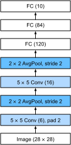

{.python .input}
%load_ext d2lbook.tab
tab.interact_select(['mxnet', 'pytorch', 'tensorflow', 'jax'])
```

# 畳み込みニューラルネットワーク（LeNet）
:label:`sec_lenet`

これで、完全に機能する CNN を構築するために必要な部品はすべてそろった。
以前、画像データを初めて扱った際には、Fashion-MNIST データセットの衣服画像に対して、ソフトマックス回帰による線形モデル (:numref:`sec_softmax_scratch`) と MLP (:numref:`sec_mlp-implementation`) を適用した。
その際は、この種のデータを扱いやすくするために、各画像を $28\times28$ の行列から長さ $784$ の固定長ベクトルへ平坦化し、その後に全結合層で処理した。
いまや畳み込み層を扱えるので、画像の空間構造を保ったまま処理できる。
さらに、全結合層を畳み込み層で置き換えることで、必要なパラメータ数を大幅に減らした、より簡潔なモデルを得られる。

この節では、*LeNet* を紹介する。
LeNet は、コンピュータビジョンにおける性能によって広く注目を集めた、最初期の公開 CNN の一つである。
このモデルは、当時 AT&T Bell Labs に在籍していた Yann LeCun によって、画像中の手書き数字を認識する目的で提案され、その名称も彼に由来する :cite:`LeCun.Bottou.Bengio.ea.1998`。
この研究は、技術開発に関する10年にわたる研究の集大成であった。
LeCun のチームは、バックプロパゲーションによって CNN を学習させることに初めて成功した研究も発表している :cite:`LeCun.Boser.Denker.ea.1989`。

当時、LeNet はサポートベクターマシンに匹敵する優れた結果を達成し、教師あり学習における支配的手法に対して、数字認識で 1% 未満の誤り率を実現した。
その後 LeNet は、ATM における入金処理の数字認識へ応用された。
今日に至るまで、1990年代に Yann LeCun と同僚の Leon Bottou が書いたコードをそのまま動かしている ATM も存在する。

```{.python .input}
%%tab mxnet
from d2l import mxnet as d2l
from mxnet import autograd, gluon, init, np, npx
from mxnet.gluon import nn
npx.set_np()
```

```{.python .input}
%%tab pytorch
from d2l import torch as d2l
import torch
from torch import nn
```

```{.python .input}
%%tab tensorflow
import tensorflow as tf
from d2l import tensorflow as d2l
```

```{.python .input}
%%tab jax
from d2l import jax as d2l
from flax import linen as nn
import jax
from jax import numpy as jnp
from types import FunctionType
```

## LeNet

大まかに言えば、[**LeNet（LeNet-5）は2つの部分から構成される。
(i) 2つの畳み込み層からなる畳み込みエンコーダと、
(ii) 3つの全結合層からなる密なブロックである**]。
そのアーキテクチャを :numref:`img_lenet` に示す。


:label:`img_lenet`

各畳み込みブロックの基本単位は、
畳み込み層、シグモイド活性化関数、
それに続く平均プーリング演算である。
ReLU と最大プーリングのほうが性能は高いが、
当時はまだ広く用いられていなかった。
各畳み込み層は $5\times 5$ のカーネルと
シグモイド活性化関数を用いる。
これらの層は、空間的に配置された入力を
複数の2次元特徴マップへ写像し、通常は
チャネル数を増やす。
最初の畳み込み層の出力チャネル数は 6、
2番目は 16 である。
各 $2\times2$ のプーリング演算（ストライド 2）は、
空間的ダウンサンプリングによって次元を 4 分の 1 に減らす。
畳み込みブロックの出力形状は
（バッチサイズ、チャネル数、高さ、幅）で与えられる。

畳み込みブロックの出力を
密なブロックへ渡すには、
ミニバッチ内の各サンプルを平坦化する必要がある。
すなわち、この4次元入力を、全結合層が受け取る2次元入力へ変換する。
ここで必要な2次元表現では、第1次元がミニバッチ内のサンプルを表し、
第2次元が各サンプルの平坦化されたベクトル表現を表す。
LeNet の密なブロックは3つの全結合層からなり、
それぞれの出力数は 120、84、10 である。
分類を行うので、
10次元の出力層は出力クラス数に対応する。

LeNet の内部で何が起きているかを完全に理解するには多少の手間がかかるかもしれないが、
次のコード片を見ると、
この種のモデルを現代の深層学習フレームワークで実装することが驚くほど容易であると分かるはずである。
必要なのは `Sequential` ブロックをインスタンス化し、
:numref:`subsec_xavier` で導入した Xavier 初期化を用いて、
適切な層を順に連結することだけである。

```{.python .input}
%%tab pytorch
def init_cnn(module):  #@save
    """Initialize weights for CNNs."""
    if type(module) == nn.Linear or type(module) == nn.Conv2d:
        nn.init.xavier_uniform_(module.weight)
```

```{.python .input}
%%tab pytorch, mxnet, tensorflow
class LeNet(d2l.Classifier):  #@save
    """The LeNet-5 model."""
    def __init__(self, lr=0.1, num_classes=10):
        super().__init__()
        self.save_hyperparameters()
        if tab.selected('mxnet'):
            self.net = nn.Sequential()
            self.net.add(
                nn.Conv2D(channels=6, kernel_size=5, padding=2,
                          activation='sigmoid'),
                nn.AvgPool2D(pool_size=2, strides=2),
                nn.Conv2D(channels=16, kernel_size=5, activation='sigmoid'),
                nn.AvgPool2D(pool_size=2, strides=2),
                nn.Dense(120, activation='sigmoid'),
                nn.Dense(84, activation='sigmoid'),
                nn.Dense(num_classes))
            self.net.initialize(init.Xavier())
        if tab.selected('pytorch'):
            self.net = nn.Sequential(
                nn.LazyConv2d(6, kernel_size=5, padding=2), nn.Sigmoid(),
                nn.AvgPool2d(kernel_size=2, stride=2),
                nn.LazyConv2d(16, kernel_size=5), nn.Sigmoid(),
                nn.AvgPool2d(kernel_size=2, stride=2),
                nn.Flatten(),
                nn.LazyLinear(120), nn.Sigmoid(),
                nn.LazyLinear(84), nn.Sigmoid(),
                nn.LazyLinear(num_classes))
        if tab.selected('tensorflow'):
            self.net = tf.keras.models.Sequential([
                tf.keras.layers.Conv2D(filters=6, kernel_size=5,
                                       activation='sigmoid', padding='same'),
                tf.keras.layers.AvgPool2D(pool_size=2, strides=2),
                tf.keras.layers.Conv2D(filters=16, kernel_size=5,
                                       activation='sigmoid'),
                tf.keras.layers.AvgPool2D(pool_size=2, strides=2),
                tf.keras.layers.Flatten(),
                tf.keras.layers.Dense(120, activation='sigmoid'),
                tf.keras.layers.Dense(84, activation='sigmoid'),
                tf.keras.layers.Dense(num_classes)])
```

```{.python .input}
%%tab jax
class LeNet(d2l.Classifier):  #@save
    """The LeNet-5 model."""
    lr: float = 0.1
    num_classes: int = 10
    kernel_init: FunctionType = nn.initializers.xavier_uniform

    def setup(self):
        self.net = nn.Sequential([
            nn.Conv(features=6, kernel_size=(5, 5), padding='SAME',
                    kernel_init=self.kernel_init()),
            nn.sigmoid,
            lambda x: nn.avg_pool(x, window_shape=(2, 2), strides=(2, 2)),
            nn.Conv(features=16, kernel_size=(5, 5), padding='VALID',
                    kernel_init=self.kernel_init()),
            nn.sigmoid,
            lambda x: nn.avg_pool(x, window_shape=(2, 2), strides=(2, 2)),
            lambda x: x.reshape((x.shape[0], -1)),  # flatten
            nn.Dense(features=120, kernel_init=self.kernel_init()),
            nn.sigmoid,
            nn.Dense(features=84, kernel_init=self.kernel_init()),
            nn.sigmoid,
            nn.Dense(features=self.num_classes, kernel_init=self.kernel_init())
        ])
```

ここでは LeNet を再現するにあたり少し簡略化し、ガウス活性化とそれに対応する出力設計を、より標準的な分類用出力に置き換えている。
ガウス型のデコーダは現在ではほとんど使われないため、この変更によって実装は大幅に単純になる。
それ以外の点では、このネットワークは元の LeNet-5 アーキテクチャと一致している。

:begin_tab:`pytorch, mxnet, tensorflow`
ネットワーク内部で何が起きているかを見てみよう。単一チャネル（白黒）の
$28 \times 28$ 画像をネットワークに通し、
各層の出力形状を表示すれば、 :numref:`img_lenet_vert` で期待される動作と
整合していることを確認するために、[**モデルを調べる**]ことができる。
:end_tab:

:begin_tab:`jax`
ネットワーク内部で何が起きているかを見てみよう。単一チャネル（白黒）の
$28 \times 28$ 画像をネットワークに通し、
各層の出力形状を表示すれば、 :numref:`img_lenet_vert` で期待される動作と
整合していることを確認するために、[**モデルを調べる**]ことができる。
Flax には `nn.tabulate` という、ネットワーク内の層と
パラメータを要約する便利なメソッドがある。ここでは `bind` メソッドを使って束縛済みモデルを作成する。
変数は `d2l.Module` クラスに束縛されるため、この束縛済みモデルは状態を持つオブジェクトとなり、
その後 `Sequential` オブジェクト属性 `net` とその中の `layers` にアクセスできる。
なお、`bind` メソッドは対話的な実験にのみ用いるべきであり、`apply` メソッドの直接の代替ではない。
:end_tab:


:label:`img_lenet_vert`

```{.python .input}
%%tab mxnet, pytorch
@d2l.add_to_class(d2l.Classifier)  #@save
def layer_summary(self, X_shape):
    X = d2l.randn(*X_shape)
    for layer in self.net:
        X = layer(X)
        print(layer.__class__.__name__, 'output shape:\t', X.shape)
        
model = LeNet()
model.layer_summary((1, 1, 28, 28))
```

```{.python .input}
%%tab tensorflow
@d2l.add_to_class(d2l.Classifier)  #@save
def layer_summary(self, X_shape):
    X = d2l.normal(X_shape)
    for layer in self.net.layers:
        X = layer(X)
        print(layer.__class__.__name__, 'output shape:\t', X.shape)

model = LeNet()
model.layer_summary((1, 28, 28, 1))
```

```{.python .input}
%%tab jax
@d2l.add_to_class(d2l.Classifier)  #@save
def layer_summary(self, X_shape, key=d2l.get_key()):
    X = jnp.zeros(X_shape)
    params = self.init(key, X)
    bound_model = self.clone().bind(params, mutable=['batch_stats'])
    _ = bound_model(X)
    for layer in bound_model.net.layers:
        X = layer(X)
        print(layer.__class__.__name__, 'output shape:\t', X.shape)

model = LeNet()
model.layer_summary((1, 28, 28, 1))
```

畳み込みブロック全体を通して、各層における表現の高さと幅は
（前の層と比べて）減少していくことに注意されたい。
最初の畳み込み層では、$5 \times 5$ カーネルによって生じる高さと幅の減少を補うために、
2ピクセルのパディングを用いている。
ちなみに、元の MNIST OCR データセットにおける $28 \times 28$ ピクセルという画像サイズは、
もともとの $32 \times 32$ ピクセルの走査画像から2ピクセル分の行と列を*切り落とした*結果である。
主な理由は、当時はメガバイト単位の節約が重要であり、容量を節約するためであった（約 30% の削減）。

これに対して、2番目の畳み込み層ではパディングを行わないため、
高さと幅はそれぞれ4ピクセルずつ減少する。
層を上がるにつれて、
チャネル数は入力の 1 から、最初の畳み込み層の後に 6、
2番目の畳み込み層の後に 16 へと増加する。
一方で、各プーリング層は高さと幅を半分にする。
最後に、各全結合層が次元を縮小し、
最終的にクラス数と一致する次元の出力を生成する。


## 学習

モデルを実装したので、
[**LeNet-5 モデルが Fashion-MNIST でどの程度うまく機能するかを試してみよう**]。

CNN はパラメータ数が少ない一方で、
各パラメータがより多くの乗算に関与するため、
同程度の深さの MLP より計算コストが高くなることがある。
GPU を利用できるなら、学習を高速化するために
ここで活用するのがよい。
なお、
`d2l.Trainer` クラスが細部をすべて処理してくれる。
デフォルトでは、利用可能なデバイス上でモデルパラメータを初期化する。
MLP の場合と同様に、損失関数はクロスエントロピーであり、
ミニバッチ確率的勾配降下法で最小化する。

```{.python .input}
%%tab pytorch, mxnet, jax
trainer = d2l.Trainer(max_epochs=10, num_gpus=1)
data = d2l.FashionMNIST(batch_size=128)
model = LeNet(lr=0.1)
if tab.selected('pytorch'):
    model.apply_init([next(iter(data.get_dataloader(True)))[0]], init_cnn)
trainer.fit(model, data)
```

```{.python .input}
%%tab tensorflow
trainer = d2l.Trainer(max_epochs=10)
data = d2l.FashionMNIST(batch_size=128)
with d2l.try_gpu():
    model = LeNet(lr=0.1)
    trainer.fit(model, data)
```

## 要約

この章では大きく前進した。1980年代の MLP から、1990年代から2000年代初頭の CNN へと進んだ。たとえば LeNet-5 の形で提案されたアーキテクチャは、今日でもなお重要である。Fashion-MNIST における誤り率について、LeNet-5 が達成できる性能を、MLP (:numref:`sec_mlp-implementation`) で達成可能な最良の性能や、ResNet (:numref:`sec_resnet`) のようなはるかに高度なアーキテクチャと比較してみる価値がある。LeNet は前者よりも後者にずっと近い。後に見るように、主な違いの一つは、より多くの計算資源が、はるかに複雑なアーキテクチャを可能にした点にある。

もう一つの違いは、LeNet の実装が相対的に容易になったことである。
かつては、C++ とアセンブリコードを用いて何か月も要する工学的課題であり、SN を改善するための工夫、初期の Lisp ベースの深層学習ツール :cite:`Bottou.Le-Cun.1988`、そして最終的にはモデルに基づく試行錯誤が必要であったが、いまでは数分で実現できる。
この驚くべき生産性向上こそが、深層学習モデル開発を大きく民主化したのである。
次の章では、さらに深く踏み込み、その先に何があるのかを見ていく。

## 演習

1. LeNet を現代的に改良せよ。以下の変更を実装して試されたい。
    1. 平均プーリングを最大プーリングに置き換える。
    1. シグモイド活性化関数を ReLU に置き換える。
1. 最大プーリングと ReLU に加えて、LeNet 風ネットワークのサイズを変更して精度の改善を試みよ。
    1. 畳み込みウィンドウのサイズを調整する。
    1. 出力チャネル数を調整する。
    1. 畳み込み層の数を調整する。
    1. 全結合層の数を調整する。
    1. 学習率やその他の学習設定（たとえば初期化やエポック数）を調整する。
1. 改良したネットワークを元の MNIST データセットで試されたい。
1. 異なる入力（たとえばセーターやコート）に対する LeNet の第1層と第2層の活性化を表示せよ。
1. ネットワークに大きく異なる画像（たとえば猫、車、あるいはランダムノイズ）を入力すると、活性化はどうなるか。