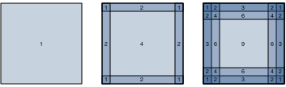

{.python .input}
%load_ext d2lbook.tab
tab.interact_select(['mxnet', 'pytorch', 'tensorflow', 'jax'])
```

# パディングとストライド
:label:`sec_padding`

:numref:`fig_correlation` の畳み込みの例を思い出してほしい。 
入力の高さと幅はともに 3 で、
畳み込みカーネルの高さと幅はともに 2 であった。
その結果、出力表現の次元は $2\times2$ になった。
入力の形状が $n_\textrm{h}\times n_\textrm{w}$ で、
畳み込みカーネルの形状が $k_\textrm{h}\times k_\textrm{w}$ だとすると、
出力の形状は $(n_\textrm{h}-k_\textrm{h}+1) \times (n_\textrm{w}-k_\textrm{w}+1)$ になる。
つまり、畳み込みを適用できる画素が尽きるまでしか、
畳み込みカーネルを移動できないのである。 

以下では、パディングやストライド付き畳み込みを含むいくつかの手法を見ていく。
これらは出力サイズをより柔軟に制御するためのものである。
その動機として、カーネルの幅と高さは通常 $1$ より大きいため、
多くの畳み込みを連続して適用すると、
出力は入力よりかなり小さくなりがちであることに注意してほしい。
$240 \times 240$ ピクセルの画像から始めると、
$5 \times 5$ の畳み込みを 10 層重ねることで
画像は $200 \times 200$ ピクセルまで縮小され、
画像の $30 \%$ が切り落とされるうえに、
元画像の境界にある興味深い情報も
すべて失われてしまう。
*パディング* は、この問題に対処するための最も一般的な手段である。
別の状況では、たとえば元の入力解像度が扱いにくいと感じる場合などに、
次元を大幅に削減したいこともある。
そのような場合に役立つ一般的な手法が *ストライド付き畳み込み* である。

```{.python .input}
%%tab mxnet
from mxnet import np, npx
from mxnet.gluon import nn
npx.set_np()
```

```{.python .input}
%%tab pytorch
import torch
from torch import nn
```

```{.python .input}
%%tab tensorflow
import tensorflow as tf
```

```{.python .input}
%%tab jax
from d2l import jax as d2l
from flax import linen as nn
import jax
from jax import numpy as jnp
```

## パディング

上で述べたように、畳み込み層を適用するときの厄介な問題の1つは、
画像の周辺部の画素が失われがちなことである。畳み込みカーネルのサイズと画像内の位置に応じた画素の利用状況を示す :numref:`img_conv_reuse` を考えてみてほしい。四隅の画素はほとんど使われない。 


:label:`img_conv_reuse`

通常は小さなカーネルを使うので、
1回の畳み込みで失われる画素数は少なくても、
畳み込み層を何層も重ねるとその損失は積み重なっていく。
この問題に対する単純な解決策は、
入力画像の境界の周囲に余分な埋め草の画素を追加して、
画像の有効サイズを大きくすることである。
通常、余分な画素の値は 0 に設定する。
:numref:`img_conv_pad` では、$3 \times 3$ の入力にパディングを施して、
サイズを $5 \times 5$ に拡張している。
それに対応する出力は $4 \times 4$ 行列に増える。
網掛け部分は最初の出力要素と、その出力計算に使われる入力テンソルおよびカーネルテンソルの要素を表している: $0\times0+0\times1+0\times2+0\times3=0$。


:label:`img_conv_pad`

一般に、合計 $p_\textrm{h}$ 行のパディング
（おおよそ上側に半分、下側に半分）と、
合計 $p_\textrm{w}$ 列のパディング
（おおよそ左側に半分、右側に半分）を追加すると、
出力の形状は

$$(n_\textrm{h}-k_\textrm{h}+p_\textrm{h}+1)\times(n_\textrm{w}-k_\textrm{w}+p_\textrm{w}+1).$$

となる。

これは、出力の高さと幅がそれぞれ $p_\textrm{h}$ と $p_\textrm{w}$ だけ増えることを意味する。

多くの場合、入力と出力の高さと幅を同じにするために、
$p_\textrm{h}=k_\textrm{h}-1$ および $p_\textrm{w}=k_\textrm{w}-1$ と設定したくなる。
こうすると、ネットワークを構築するときに各層の出力形状を予測しやすくなる。
ここで $k_\textrm{h}$ が奇数だと仮定すると、
高さ方向の両側に $p_\textrm{h}/2$ 行ずつパディングする。
$k_\textrm{h}$ が偶数の場合の1つの方法は、
入力の上側に $\lceil p_\textrm{h}/2\rceil$ 行、
下側に $\lfloor p_\textrm{h}/2\rfloor$ 行をパディングすることである。
幅方向についても同様に両側をパディングする。

CNN では、1、3、5、7 などの奇数の高さと幅をもつ
畳み込みカーネルが一般的に使われる。
奇数サイズのカーネルを選ぶ利点は、
上下に同じ行数、左右に同じ列数をパディングしながら、
次元を保てることである。

さらに、このように奇数カーネルを使い、
次元を正確に保つようにパディングする慣習には、
事務的な利点もある。
任意の2次元テンソル `X` について、
カーネルのサイズが奇数で、
すべての辺でのパディング行数と列数が同じであり、
その結果として入力と同じ高さと幅をもつ出力が得られるとき、
出力 `Y[i, j]` は、ウィンドウの中心が `X[i, j]` に来るようにして
入力と畳み込みカーネルの相互相関を計算したものだと分かる。

次の例では、高さと幅が 3 の2次元畳み込み層を作成し、
[**すべての辺に 1 ピクセルのパディングを適用する。**]
高さと幅が 8 の入力を与えると、
出力の高さと幅も 8 になることが分かる。

```{.python .input}
%%tab mxnet
# We define a helper function to calculate convolutions. It initializes 
# the convolutional layer weights and performs corresponding dimensionality 
# elevations and reductions on the input and output
def comp_conv2d(conv2d, X):
    conv2d.initialize()
    # (1, 1) indicates that batch size and the number of channels are both 1
    X = X.reshape((1, 1) + X.shape)
    Y = conv2d(X)
    # Strip the first two dimensions: examples and channels
    return Y.reshape(Y.shape[2:])

# 1 row and column is padded on either side, so a total of 2 rows or columns are added
conv2d = nn.Conv2D(1, kernel_size=3, padding=1)
X = np.random.uniform(size=(8, 8))
comp_conv2d(conv2d, X).shape
```

```{.python .input}
%%tab pytorch
# We define a helper function to calculate convolutions. It initializes the
# convolutional layer weights and performs corresponding dimensionality
# elevations and reductions on the input and output
def comp_conv2d(conv2d, X):
    # (1, 1) indicates that batch size and the number of channels are both 1
    X = X.reshape((1, 1) + X.shape)
    Y = conv2d(X)
    # Strip the first two dimensions: examples and channels
    return Y.reshape(Y.shape[2:])

# 1 row and column is padded on either side, so a total of 2 rows or columns
# are added
conv2d = nn.LazyConv2d(1, kernel_size=3, padding=1)
X = torch.rand(size=(8, 8))
comp_conv2d(conv2d, X).shape
```

```{.python .input}
%%tab tensorflow
# We define a helper function to calculate convolutions. It initializes
# the convolutional layer weights and performs corresponding dimensionality
# elevations and reductions on the input and output
def comp_conv2d(conv2d, X):
    # (1, 1) indicates that batch size and the number of channels are both 1
    X = tf.reshape(X, (1, ) + X.shape + (1, ))
    Y = conv2d(X)
    # Strip the first two dimensions: examples and channels
    return tf.reshape(Y, Y.shape[1:3])
# 1 row and column is padded on either side, so a total of 2 rows or columns
# are added
conv2d = tf.keras.layers.Conv2D(1, kernel_size=3, padding='same')
X = tf.random.uniform(shape=(8, 8))
comp_conv2d(conv2d, X).shape
```

```{.python .input}
%%tab jax
# We define a helper function to calculate convolutions. It initializes
# the convolutional layer weights and performs corresponding dimensionality
# elevations and reductions on the input and output
def comp_conv2d(conv2d, X):
    # (1, X.shape, 1) indicates that batch size and the number of channels are both 1
    key = jax.random.PRNGKey(d2l.get_seed())
    X = X.reshape((1,) + X.shape + (1,))
    Y, _ = conv2d.init_with_output(key, X)
    # Strip the dimensions: examples and channels
    return Y.reshape(Y.shape[1:3])
# 1 row and column is padded on either side, so a total of 2 rows or columns are added
conv2d = nn.Conv(1, kernel_size=(3, 3), padding='SAME')
X = jax.random.uniform(jax.random.PRNGKey(d2l.get_seed()), shape=(8, 8))
comp_conv2d(conv2d, X).shape
```

畳み込みカーネルの高さと幅が異なる場合でも、
[**高さと幅で異なるパディング数を設定することで**]、
出力と入力の高さと幅を同じにできる。

```{.python .input}
%%tab mxnet
# We use a convolution kernel with height 5 and width 3. The padding on
# either side of the height and width are 2 and 1, respectively
conv2d = nn.Conv2D(1, kernel_size=(5, 3), padding=(2, 1))
comp_conv2d(conv2d, X).shape
```

```{.python .input}
%%tab pytorch
# We use a convolution kernel with height 5 and width 3. The padding on either
# side of the height and width are 2 and 1, respectively
conv2d = nn.LazyConv2d(1, kernel_size=(5, 3), padding=(2, 1))
comp_conv2d(conv2d, X).shape
```

```{.python .input}
%%tab tensorflow
# We use a convolution kernel with height 5 and width 3. The padding on
# either side of the height and width are 2 and 1, respectively
conv2d = tf.keras.layers.Conv2D(1, kernel_size=(5, 3), padding='same')
comp_conv2d(conv2d, X).shape
```

```{.python .input}
%%tab jax
# We use a convolution kernel with height 5 and width 3. The padding on
# either side of the height and width are 2 and 1, respectively
conv2d = nn.Conv(1, kernel_size=(5, 3), padding=(2, 1))
comp_conv2d(conv2d, X).shape
```

## ストライド

相互相関を計算するとき、
まず畳み込みウィンドウを入力テンソルの左上隅に置き、
その後、下方向と右方向の両方へすべての位置に滑らせていく。
これまでの例では、1要素ずつ移動するのが既定であった。
しかし、計算効率のためであったり、
ダウンサンプリングしたかったりする場合には、
ウィンドウを1要素より多く移動させて、
途中の位置を飛ばすことがある。これは、畳み込み
カーネルが大きい場合に特に有用である。なぜなら、基になる画像の広い領域を捉えられるからである。

1回の移動で進む行数と列数を *ストライド* と呼ぶ。
ここまで、高さ方向と幅方向のストライドはいずれも 1 を使ってきた。
ときには、より大きなストライドを使いたいこともある。
:numref:`img_conv_stride` は、高さ方向に 3、幅方向に 2 のストライドをもつ
2次元相互相関演算を示している。
網掛け部分は、出力要素と、その出力計算に使われる入力テンソルおよびカーネルテンソルの要素を表している: $0\times0+0\times1+1\times2+2\times3=8$, $0\times0+6\times1+0\times2+0\times3=6$。
最初の列の2番目の要素が生成されるとき、
畳み込みウィンドウは3行下に移動していることが分かる。
最初の行の2番目の要素が生成されるとき、
畳み込みウィンドウは2列右に移動している。
畳み込みウィンドウが入力上をさらに2列右へ移動し続けると、
入力要素がウィンドウを満たせないため出力は得られない
（別の列のパディングを追加しない限り）。


:label:`img_conv_stride`

一般に、高さ方向のストライドが $s_\textrm{h}$、
幅方向のストライドが $s_\textrm{w}$ のとき、出力の形状は

$$\lfloor(n_\textrm{h}-k_\textrm{h}+p_\textrm{h}+s_\textrm{h})/s_\textrm{h}\rfloor \times \lfloor(n_\textrm{w}-k_\textrm{w}+p_\textrm{w}+s_\textrm{w})/s_\textrm{w}\rfloor.$$

となる。

$p_\textrm{h}=k_\textrm{h}-1$ および $p_\textrm{w}=k_\textrm{w}-1$ と設定すると、
出力形状は
$\lfloor(n_\textrm{h}+s_\textrm{h}-1)/s_\textrm{h}\rfloor \times \lfloor(n_\textrm{w}+s_\textrm{w}-1)/s_\textrm{w}\rfloor$
に簡略化できる。
さらに進めて、入力の高さと幅が
高さ方向と幅方向のストライドで割り切れるなら、
出力形状は $(n_\textrm{h}/s_\textrm{h}) \times (n_\textrm{w}/s_\textrm{w})$ になる。

以下では、[**高さ方向と幅方向のストライドをともに 2 に設定し**]、
入力の高さと幅を半分にする。

```{.python .input}
%%tab mxnet
conv2d = nn.Conv2D(1, kernel_size=3, padding=1, strides=2)
comp_conv2d(conv2d, X).shape
```

```{.python .input}
%%tab pytorch
conv2d = nn.LazyConv2d(1, kernel_size=3, padding=1, stride=2)
comp_conv2d(conv2d, X).shape
```

```{.python .input}
%%tab tensorflow
conv2d = tf.keras.layers.Conv2D(1, kernel_size=3, padding='same', strides=2)
comp_conv2d(conv2d, X).shape
```

```{.python .input}
%%tab jax
conv2d = nn.Conv(1, kernel_size=(3, 3), padding=1, strides=2)
comp_conv2d(conv2d, X).shape
```

[**もう少し複雑な例**] を見てみよう。

```{.python .input}
%%tab mxnet
conv2d = nn.Conv2D(1, kernel_size=(3, 5), padding=(0, 1), strides=(3, 4))
comp_conv2d(conv2d, X).shape
```

```{.python .input}
%%tab pytorch
conv2d = nn.LazyConv2d(1, kernel_size=(3, 5), padding=(0, 1), stride=(3, 4))
comp_conv2d(conv2d, X).shape
```

```{.python .input}
%%tab tensorflow
conv2d = tf.keras.layers.Conv2D(1, kernel_size=(3,5), padding='valid',
                                strides=(3, 4))
comp_conv2d(conv2d, X).shape
```

```{.python .input}
%%tab jax
conv2d = nn.Conv(1, kernel_size=(3, 5), padding=(0, 1), strides=(3, 4))
comp_conv2d(conv2d, X).shape
```

## 要約と考察

パディングは出力の高さと幅を増やすことができる。これは、出力が不必要に縮小するのを避けるために、出力の高さと幅を入力と同じにする目的でよく使われる。さらに、すべての画素が同じ頻度で使われることも保証する。通常は、入力の高さと幅の両側に対称なパディングを選ぶ。この場合、$(p_\textrm{h}, p_\textrm{w})$ パディングと呼ぶ。最も一般的には $p_\textrm{h} = p_\textrm{w}$ とし、その場合は単にパディング $p$ を選ぶと言う。 

ストライドにも同様の慣習がある。水平方向のストライド $s_\textrm{h}$ と垂直方向のストライド $s_\textrm{w}$ が一致するとき、単にストライド $s$ と言う。ストライドは出力の解像度を下げることができ、たとえば $n > 1$ のとき、出力の高さと幅を入力の高さと幅の $1/n$ にまで減らすことがある。既定では、パディングは 0、ストライドは 1 である。 

ここまでで扱ったパディングはすべて、単に画像をゼロで拡張するものであった。これは実現が非常に簡単なので、計算上大きな利点がある。さらに、追加のメモリを割り当てることなく、このパディングを暗黙的に利用するよう演算子を設計できる。同時に、CNN が画像内の暗黙的な位置情報を符号化することも可能にする。つまり、「空白」がどこにあるかを学習するだけでよいのである。ゼロパディング以外にも多くの代替手法がある。:citet:`Alsallakh.Kokhlikyan.Miglani.ea.2020` はそれらについて包括的な概観を与えている（ただし、アーティファクトが生じる場合を除いて、非ゼロパディングをいつ使うべきかについて明確な指針は示していない）。 


## 演習

1. この節の最後のコード例で、カーネルサイズが $(3, 5)$、パディングが $(0, 1)$、ストライドが $(3, 4)$ のとき、  
   出力形状を計算して実験結果と一致するか確認せよ。
1. 音声信号において、ストライド 2 は何に対応するか？
1. ミラーリングパディング、すなわち境界値をそのまま鏡映してテンソルを拡張するパディングを実装せよ。 
1. 1 より大きいストライドの計算上の利点は何か？
1. 1 より大きいストライドには、統計的にどのような利点がありうるか？
1. ストライド $\frac{1}{2}$ はどのように実装するか？ それは何に対応するか？ どのような場合に有用か？
