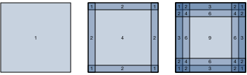
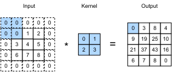

{.python .input}
%load_ext d2lbook.tab
tab.interact_select(['mxnet', 'pytorch', 'tensorflow', 'jax'])
```

# パディングとストライド
:label:`sec_padding`

:numref:`fig_correlation` の畳み込みの例を思い出そう。
入力の高さと幅はいずれも 3 であり、
畳み込みカーネルの高さと幅はいずれも 2 であった。
その結果、出力表現の形状は $2\times2$ になった。
入力の形状が $n_\textrm{h}\times n_\textrm{w}$ で、
畳み込みカーネルの形状が $k_\textrm{h}\times k_\textrm{w}$ であるとき、
出力の形状は $(n_\textrm{h}-k_\textrm{h}+1) \times (n_\textrm{w}-k_\textrm{w}+1)$ である。
すなわち、畳み込みカーネルは、
畳み込みを適用できる位置が尽きるまでしか移動できない。

以下では、パディングやストライド付き畳み込みを含むいくつかの手法を扱う。
これらは出力サイズをより柔軟に制御するためのものである。
その背景として、カーネルの高さと幅は通常 1 より大きいため、
畳み込みを何度も適用すると、
出力は入力よりかなり小さくなりやすい。
たとえば、$240 \times 240$ ピクセルの画像に対して、
$5 \times 5$ の畳み込みを 10 層重ねると、
画像は $200 \times 200$ ピクセルまで縮小し、
画像の $30 \%$ が失われるだけでなく、
元画像の境界付近にある有用な情報も
すべて失われてしまう。
*パディング* は、この問題に対処する最も一般的な方法である。
一方で、元の入力解像度が高すぎて扱いにくい場合などには、
次元を大幅に削減したいこともある。
そのような場合に有効な一般的手法が *ストライド付き畳み込み* である。

```{.python .input}
%%tab mxnet
from mxnet import np, npx
from mxnet.gluon import nn
npx.set_np()
```

```{.python .input}
%%tab pytorch
import torch
from torch import nn
```

```{.python .input}
%%tab tensorflow
import tensorflow as tf
```

```{.python .input}
%%tab jax
from d2l import jax as d2l
from flax import linen as nn
import jax
from jax import numpy as jnp
```

## パディング

前述のように、畳み込み層を適用する際の厄介な問題の1つは、
画像の周辺部の画素が失われやすいことである。
畳み込みカーネルのサイズと画像内の位置に応じて、
各画素がどの程度利用されるかを示した :numref:`img_conv_reuse` を見てみよう。
四隅の画素はほとんど使われない。


:label:`img_conv_reuse`

通常は小さなカーネルを使うため、
1 回の畳み込みで失われる画素数は少ない。
しかし、畳み込み層を何層も重ねると、その損失は蓄積していく。
この問題に対する単純な解決策は、
入力画像の境界の周囲に余分な画素を追加し、
画像の有効サイズを大きくすることである。
通常、追加する画素の値は 0 に設定する。
:numref:`img_conv_pad` では、$3 \times 3$ の入力にパディングを施し、
サイズを $5 \times 5$ に拡張している。
それに対応して、出力は $4 \times 4$ 行列に増える。
網掛け部分は最初の出力要素と、
その計算に用いられる入力テンソルおよびカーネルテンソルの要素を表す。
すなわち、$0\times0+0\times1+0\times2+0\times3=0$ である。


:label:`img_conv_pad`

一般に、合計 $p_\textrm{h}$ 行のパディング
（おおよそ上側に半分、下側に半分）と、
合計 $p_\textrm{w}$ 列のパディング
（おおよそ左側に半分、右側に半分）を追加すると、
出力の形状は

$$(n_\textrm{h}-k_\textrm{h}+p_\textrm{h}+1)\times(n_\textrm{w}-k_\textrm{w}+p_\textrm{w}+1).$$

となる。

これは、出力の高さと幅がそれぞれ $p_\textrm{h}$ と $p_\textrm{w}$ だけ増えることを意味する。

多くの場合、入力と出力の高さと幅を同じにするために、
$p_\textrm{h}=k_\textrm{h}-1$ および $p_\textrm{w}=k_\textrm{w}-1$ と設定する。
こうすると、ネットワークを構築する際に各層の出力形状を予測しやすくなる。
ここで $k_\textrm{h}$ が奇数であると仮定すると、
高さ方向の両側に $p_\textrm{h}/2$ 行ずつパディングする。
$k_\textrm{h}$ が偶数の場合の一つの方法は、
入力の上側に $\lceil p_\textrm{h}/2\rceil$ 行、
下側に $\lfloor p_\textrm{h}/2\rfloor$ 行をパディングすることである。
幅方向についても同様に両側をパディングする。

CNN では、1、3、5、7 などの奇数の高さと幅をもつ
畳み込みカーネルが一般的に用いられる。
奇数サイズのカーネルを選ぶ利点は、
上下に同じ行数、左右に同じ列数をパディングしながら、
次元を保てることである。

さらに、このように奇数サイズのカーネルを使い、
次元を正確に保つようにパディングする慣習には、
実務上の利点もある。
任意の2次元テンソル `X` について、
カーネルサイズが奇数で、
すべての辺でのパディング行数と列数が同じであり、
その結果として入力と同じ高さと幅をもつ出力が得られるとき、
出力 `Y[i, j]` は、ウィンドウの中心が `X[i, j]` に来るようにして
入力と畳み込みカーネルの相互相関を計算したものだと分かる。

次の例では、高さと幅が 3 の2次元畳み込み層を作成し、
[**すべての辺に 1 ピクセルのパディングを適用する。**]
高さと幅が 8 の入力を与えると、
出力の高さと幅も 8 になることが分かる。

```{.python .input}
%%tab mxnet
# We define a helper function to calculate convolutions. It initializes 
# the convolutional layer weights and performs corresponding dimensionality 
# 入力と出力の昇降
def comp_conv2d(conv2d, X):
    conv2d.initialize()
    # (1, 1) indicates that batch size and the number of channels are both 1
    X = X.reshape((1, 1) + X.shape)
    Y = conv2d(X)
    # 最初の2次元、すなわちサンプルとチャネルを取り除く
    return Y.reshape(Y.shape[2:])

# 1 row and column is padded on either side, so a total of 2 rows or columns are added
conv2d = nn.Conv2D(1, kernel_size=3, padding=1)
X = np.random.uniform(size=(8, 8))
comp_conv2d(conv2d, X).shape
```

```{.python .input}
%%tab pytorch
# 畳み込みを計算するための補助関数を定義する。これを初期化する
# 畳み込み層の重みと対応する次元を処理する
# 入力と出力の昇降
def comp_conv2d(conv2d, X):
    # (1, 1) indicates that batch size and the number of channels are both 1
    X = X.reshape((1, 1) + X.shape)
    Y = conv2d(X)
    # 最初の2次元、すなわちサンプルとチャネルを取り除く
    return Y.reshape(Y.shape[2:])

# 1 row and column is padded on either side, so a total of 2 rows or columns
# are added
conv2d = nn.LazyConv2d(1, kernel_size=3, padding=1)
X = torch.rand(size=(8, 8))
comp_conv2d(conv2d, X).shape
```

```{.python .input}
%%tab tensorflow
# 畳み込みを計算する補助関数を定義する。初期化する
# 畳み込み層の重みと対応する次元を計算する
# 入力と出力の昇降
def comp_conv2d(conv2d, X):
    # (1, 1) indicates that batch size and the number of channels are both 1
    X = tf.reshape(X, (1, ) + X.shape + (1, ))
    Y = conv2d(X)
    # 最初の2次元、すなわちサンプルとチャネルを取り除く
    return tf.reshape(Y, Y.shape[1:3])
# 1 row and column is padded on either side, so a total of 2 rows or columns
# are added
conv2d = tf.keras.layers.Conv2D(1, kernel_size=3, padding='same')
X = tf.random.uniform(shape=(8, 8))
comp_conv2d(conv2d, X).shape
```

```{.python .input}
%%tab jax
# 畳み込みを計算する補助関数を定義する。初期化する
# 畳み込み層の重みと対応する次元を計算する
# 入力と出力の昇降
def comp_conv2d(conv2d, X):
    # (1, X.shape, 1) indicates that batch size and the number of channels are both 1
    key = jax.random.PRNGKey(d2l.get_seed())
    X = X.reshape((1,) + X.shape + (1,))
    Y, _ = conv2d.init_with_output(key, X)
    # 次元を削除する：サンプルとチャネル
    return Y.reshape(Y.shape[1:3])
# 1 row and column is padded on either side, so a total of 2 rows or columns are added
conv2d = nn.Conv(1, kernel_size=(3, 3), padding='SAME')
X = jax.random.uniform(jax.random.PRNGKey(d2l.get_seed()), shape=(8, 8))
comp_conv2d(conv2d, X).shape
```

畳み込みカーネルの高さと幅が異なる場合でも、
[**高さと幅で異なるパディング量を設定することで**]、
出力と入力の高さと幅を同じにできる。

```{.python .input}
%%tab mxnet
# 高さ5、幅3の畳み込みカーネルを用いる。パディングは
# 高さと幅のそれぞれの両辺は2と1である
conv2d = nn.Conv2D(1, kernel_size=(5, 3), padding=(2, 1))
comp_conv2d(conv2d, X).shape
```

```{.python .input}
%%tab pytorch
# 高さ5、幅3の畳み込みカーネルを用いる。両側のパディングは
# 高さと幅はそれぞれ2と1である
conv2d = nn.LazyConv2d(1, kernel_size=(5, 3), padding=(2, 1))
comp_conv2d(conv2d, X).shape
```

```{.python .input}
%%tab tensorflow
# 高さ5、幅3の畳み込みカーネルを用いる。パディングは
# 高さと幅のそれぞれの両辺は2と1である
conv2d = tf.keras.layers.Conv2D(1, kernel_size=(5, 3), padding='same')
comp_conv2d(conv2d, X).shape
```

```{.python .input}
%%tab jax
# 高さ5、幅3の畳み込みカーネルを用いる。パディングは
# 高さと幅のそれぞれの両辺は2と1である
conv2d = nn.Conv(1, kernel_size=(5, 3), padding=(2, 1))
comp_conv2d(conv2d, X).shape
```

## ストライド

相互相関を計算するとき、
まず畳み込みウィンドウを入力テンソルの左上隅に置き、
その後、下方向と右方向に沿ってすべての位置へ滑らせていく。
これまでの例では、1 要素ずつ移動するのが既定であった。
しかし、計算効率を高めたい場合や、
ダウンサンプリングしたい場合には、
ウィンドウを 1 要素より大きく移動させて、
途中の位置を飛ばすことがある。
これは、畳み込みカーネルが大きい場合に特に有用である。
基になる画像のより広い領域を捉えられるからである。

1 回の移動で進む行数と列数を *ストライド* と呼ぶ。
ここまで、高さ方向と幅方向のストライドにはいずれも 1 を用いてきた。
しかし、ときにはより大きなストライドを使いたいこともある。
:numref:`img_conv_stride` は、高さ方向に 3、幅方向に 2 のストライドをもつ
2次元相互相関演算を示している。
網掛け部分は、出力要素と、
その計算に用いられる入力テンソルおよびカーネルテンソルの要素を表す。
すなわち、$0\times0+0\times1+1\times2+2\times3=8$、
$0\times0+6\times1+0\times2+0\times3=6$ である。
最初の列の 2 番目の要素が生成されるとき、
畳み込みウィンドウは 3 行下へ移動している。
最初の行の 2 番目の要素が生成されるとき、
畳み込みウィンドウは 2 列右へ移動している。
さらに 2 列右へ移動すると、
入力要素だけではウィンドウを満たせないため、
出力は得られない
（追加で列方向のパディングを入れない限り）。


:label:`img_conv_stride`

一般に、高さ方向のストライドが $s_\textrm{h}$、
幅方向のストライドが $s_\textrm{w}$ のとき、出力の形状は

$$\lfloor(n_\textrm{h}-k_\textrm{h}+p_\textrm{h}+s_\textrm{h})/s_\textrm{h}\rfloor \times \lfloor(n_\textrm{w}-k_\textrm{w}+p_\textrm{w}+s_\textrm{w})/s_\textrm{w}\rfloor.$$

となる。

$p_\textrm{h}=k_\textrm{h}-1$ および $p_\textrm{w}=k_\textrm{w}-1$ と設定すると、
出力形状は
$\lfloor(n_\textrm{h}+s_\textrm{h}-1)/s_\textrm{h}\rfloor \times \lfloor(n_\textrm{w}+s_\textrm{w}-1)/s_\textrm{w}\rfloor$
に簡略化できる。
さらに、入力の高さと幅が
高さ方向と幅方向のストライドで割り切れるなら、
出力形状は $(n_\textrm{h}/s_\textrm{h}) \times (n_\textrm{w}/s_\textrm{w})$ になる。

以下では、[**高さ方向と幅方向のストライドをともに 2 に設定し**]、
入力の高さと幅を半分にする。

```{.python .input}
%%tab mxnet
conv2d = nn.Conv2D(1, kernel_size=3, padding=1, strides=2)
comp_conv2d(conv2d, X).shape
```

```{.python .input}
%%tab pytorch
conv2d = nn.LazyConv2d(1, kernel_size=3, padding=1, stride=2)
comp_conv2d(conv2d, X).shape
```

```{.python .input}
%%tab tensorflow
conv2d = tf.keras.layers.Conv2D(1, kernel_size=3, padding='same', strides=2)
comp_conv2d(conv2d, X).shape
```

```{.python .input}
%%tab jax
conv2d = nn.Conv(1, kernel_size=(3, 3), padding=1, strides=2)
comp_conv2d(conv2d, X).shape
```

[**もう少し複雑な例**] を見てみよう。

```{.python .input}
%%tab mxnet
conv2d = nn.Conv2D(1, kernel_size=(3, 5), padding=(0, 1), strides=(3, 4))
comp_conv2d(conv2d, X).shape
```

```{.python .input}
%%tab pytorch
conv2d = nn.LazyConv2d(1, kernel_size=(3, 5), padding=(0, 1), stride=(3, 4))
comp_conv2d(conv2d, X).shape
```

```{.python .input}
%%tab tensorflow
conv2d = tf.keras.layers.Conv2D(1, kernel_size=(3,5), padding='valid',
                                strides=(3, 4))
comp_conv2d(conv2d, X).shape
```

```{.python .input}
%%tab jax
conv2d = nn.Conv(1, kernel_size=(3, 5), padding=(0, 1), strides=(3, 4))
comp_conv2d(conv2d, X).shape
```

## 要約と考察

パディングは出力の高さと幅を増やせる。
出力が不必要に縮小するのを避けるために、
出力の高さと幅を入力と同じに保つ目的でよく用いられる。
さらに、すべての画素がより均等な頻度で利用されることにもつながる。
通常は、入力の高さと幅の両側に対して対称なパディングを選ぶ。
この場合、$(p_\textrm{h}, p_\textrm{w})$ パディングと呼ぶ。
最も一般的には $p_\textrm{h} = p_\textrm{w}$ とし、
その場合は単にパディング $p$ と呼ぶ。

ストライドにも同様の慣習がある。
水平方向のストライド $s_\textrm{h}$ と垂直方向のストライド $s_\textrm{w}$ が一致するとき、
単にストライド $s$ と呼ぶ。
ストライドは出力の解像度を下げられる。
たとえば $n > 1$ のとき、
出力の高さと幅を入力の高さと幅の $1/n$ にまで減らせる場合がある。
既定では、パディングは 0、ストライドは 1 である。

ここまでで扱ったパディングはすべて、
単に画像をゼロで拡張するものであった。
これは実装が非常に容易であり、計算上の利点が大きい。
さらに、追加のメモリを割り当てることなく、
このパディングを暗黙的に利用するよう演算子を設計できる。
同時に、CNN が画像内の暗黙的な位置情報を符号化することも可能にする。
すなわち、「空白」がどこにあるかを学習すればよい。
ゼロパディング以外にも多くの代替手法がある。
:citet:`Alsallakh.Kokhlikyan.Miglani.ea.2020` はそれらについて包括的な概観を与えている
（ただし、アーティファクトが生じる場合を除いて、
非ゼロパディングをいつ使うべきかについて明確な指針は示していない）。


## 演習

1. この節の最後のコード例で、カーネルサイズが $(3, 5)$、パディングが $(0, 1)$、ストライドが $(3, 4)$ のとき、  
   出力形状を計算し、実験結果と一致するか確認せよ。
1. 音声信号において、ストライド 2 は何に対応するか。
1. ミラーリングパディング、すなわち境界値を鏡映してテンソルを拡張するパディングを実装せよ。
1. 1 より大きいストライドの計算上の利点は何か。
1. 1 より大きいストライドには、統計的にどのような利点がありうるか。
1. ストライド $\frac{1}{2}$ はどのように実装するか。何に対応するか。どのような場合に有用か。