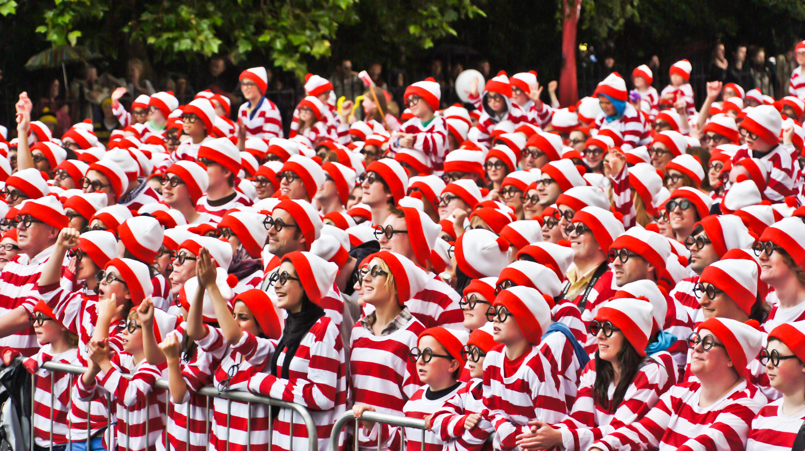

# 全結合層から畳み込みへ
:label:`sec_why-conv`

今日に至るまで、
これまで議論してきたモデルは、
表形式データを扱う場合には
依然として適切な選択肢です。
表形式とは、データが
例に対応する行と特徴量に対応する列から
構成されていることを意味します。
表形式データでは、私たちは
探したいパターンが特徴量間の相互作用を
含むかもしれないと予想できますが、
特徴量がどのように相互作用するかについての構造を
*先験的に*仮定しません。

ときには、より洗練されたアーキテクチャの構築を導くための知識が
本当に不足していることがあります。
このような場合、MLPが
私たちにできる最善の方法かもしれません。
しかし、高次元の知覚データでは、
このような構造を持たないネットワークは扱いにくくなりがちです。

たとえば、猫と犬を見分けるという
これまでの例に戻りましょう。
十分に丁寧なデータ収集を行い、
1メガピクセルの写真からなる注釈付きデータセットを
集めたとします。
これは、ネットワークへの各入力が
100万次元を持つことを意味します。
たとえ1000個の隠れ次元へと強引に削減したとしても、
$10^6 \times 10^3 = 10^9$ 個のパラメータを持つ
全結合層が必要になります。
大量のGPU、分散最適化の才能、
そして並外れた忍耐力がない限り、
このネットワークのパラメータを学習することは
実行不可能かもしれません。

注意深い読者は、
1メガピクセルの解像度は必要ないのではないかと
この議論に異を唱えるかもしれません。
しかし、10万画素で済ませられるとしても、
サイズ1000の隠れ層は、
画像の良い表現を学習するのに必要な
隠れユニット数を大幅に過小評価しています。
したがって、実用的なシステムでは
依然として数十億個のパラメータが必要になるでしょう。
さらに、これほど多くのパラメータを当てはめて分類器を学習するには、
膨大なデータセットの収集が必要になるかもしれません。
それにもかかわらず、今日では人間もコンピュータも
猫と犬をかなりうまく見分けることができ、
これらの直感に反しているように見えます。
それは、画像には
人間にも機械学習モデルにも活用できる
豊かな構造があるからです。
畳み込みニューラルネットワーク（CNN）は、
自然画像に存在する既知の構造の一部を活用するために
機械学習が取り入れた創造的な方法の一つです。

## 不変性

画像中の物体を検出したいとしましょう。
物体を認識するために用いる方法は、
画像内でその物体がどこにあるかという
正確な位置を過度に気にすべきではない、
というのはもっともらしく思えます。
理想的には、私たちのシステムはこの知識を活用すべきです。
豚は普通は飛ばず、飛行機は普通は泳ぎません。
それでも、画像の上部に豚が現れたとしても、
私たちはそれを豚だと認識できるべきです。
ここでは、子どものゲーム「ウォーリーをさがせ」から
いくらか着想を得ることができます
（このゲーム自体も、:numref:`img_waldo` に示すような
多くの実世界の模倣を生み出しました）。
このゲームは、さまざまな活動であふれた
混沌とした場面がいくつも並んでいます。
ウォーリーはそれぞれの場面のどこかに現れ、
たいていはありそうもない場所にひそんでいます。
読者の目標は彼を見つけることです。
彼の特徴的な服装にもかかわらず、
多くの気を散らす要素のために、
これは驚くほど難しいことがあります。
しかし、*ウォーリーがどのように見えるか*は、
*ウォーリーがどこにいるか*には依存しません。
私たちは画像全体をウォーリー検出器で走査し、
各パッチにスコアを割り当てて、
そのパッチにウォーリーが含まれている確率を示すことができます。
実際、多くの物体検出やセグメンテーションのアルゴリズムは
このアプローチに基づいています :cite:`Long.Shelhamer.Darrell.2015`。
CNNは、この*空間的不変性*という考えを体系化し、
より少ないパラメータで有用な表現を学習するために
これを活用します。

:width:`400px`
:label:`img_waldo`

ここで、これらの直感をより具体的にし、
コンピュータビジョンに適したニューラルネットワークアーキテクチャの設計を導く
いくつかの要件を列挙してみましょう。

1. 最初の層では、画像内のどこに現れても、
   同じパッチに対してネットワークが同様に反応すべきです。
   この原理は*平行移動不変性*（または*平行移動等価性*）と呼ばれます。
1. ネットワークの最初の層は、画像の遠く離れた領域の内容に関係なく、
   局所領域に注目すべきです。これが*局所性*の原理です。
   最終的には、これらの局所表現を集約して
   画像全体レベルで予測を行えます。
1. 進むにつれて、より深い層は、
   自然界における高次の視覚に似た形で、
   画像のより長距離の特徴を捉えられるべきです。

これが数学にどう対応するかを見ていきましょう。

## MLPへの制約

まず、2次元画像 $\mathbf{X}$ を入力とし、
その直後の隠れ表現 $\mathbf{H}$ も同様に行列として表される
（コード上では2次元テンソルです）MLPを考えます。
ここで、$\mathbf{X}$ と $\mathbf{H}$ は同じ形状を持つとします。
少し考えてみてください。
ここでは、入力だけでなく
隠れ表現も空間構造を持つと考えます。

$\mathbf{X}$ の位置 $(i,j)$ にある画素と
$\mathbf{H}$ の位置 $(i,j)$ にある画素をそれぞれ
$[\mathbf{X}]_{i, j}$ と $[\mathbf{H}]_{i, j}$ で表します。
したがって、各隠れユニットが
各入力画素から入力を受け取るようにするには、
（これまでMLPで行っていたように）重み行列を使う代わりに、
パラメータを4階の重みテンソル $\mathsf{W}$ として表現することになります。
$\mathbf{U}$ がバイアスを含むとすると、
全結合層は形式的に次のように表せます。

$$\begin{aligned} \left[\mathbf{H}\right]_{i, j} &= [\mathbf{U}]_{i, j} + \sum_k \sum_l[\mathsf{W}]_{i, j, k, l}  [\mathbf{X}]_{k, l}\\ &=  [\mathbf{U}]_{i, j} +
\sum_a \sum_b [\mathsf{V}]_{i, j, a, b}  [\mathbf{X}]_{i+a, j+b}.\end{aligned}$$

$\mathsf{W}$ から $\mathsf{V}$ への切り替えは、
今のところは単なる表記上の変更にすぎません。
というのも、両方の4階テンソルの係数の間には
1対1対応があるからです。
添字 $(k, l)$ を
$k = i+a$ および $l = j+b$ となるように
単に付け替えただけです。
言い換えると、
$[\mathsf{V}]_{i, j, a, b} = [\mathsf{W}]_{i, j, i+a, j+b}$ と置いています。
添字 $a$ と $b$ は正負両方のオフセットを取り、
画像全体を覆います。
隠れ表現 $[\mathbf{H}]_{i, j}$ の任意の位置 $(i,j)$ に対して、
その値は、$(i, j)$ を中心とする $x$ の画素を
$[\mathsf{V}]_{i, j, a, b}$ で重み付けして和を取ることで計算されます。
先へ進む前に、このパラメータ化で
*1層*に必要なパラメータ総数を考えてみましょう。
$1000 \times 1000$ の画像（1メガピクセル）が
$1000 \times 1000$ の隠れ表現へ写像されるとします。
この場合、$10^{12}$ 個のパラメータが必要であり、
これは現在のコンピュータでは到底扱えません。  

### 平行移動不変性

では、上で述べた第一の原理、
平行移動不変性 :cite:`Zhang.ea.1988` を適用しましょう。
これは、入力 $\mathbf{X}$ のシフトが
隠れ表現 $\mathbf{H}$ のシフトを
単に引き起こすべきであることを意味します。
これが可能なのは、
$\mathsf{V}$ と $\mathbf{U}$ が実際には $(i, j)$ に依存しない場合だけです。
したがって、
$[\mathsf{V}]_{i, j, a, b} = [\mathbf{V}]_{a, b}$ かつ
$\mathbf{U}$ は定数、たとえば $u$ となります。
その結果、$\mathbf{H}$ の定義は次のように簡単になります。

$$[\mathbf{H}]_{i, j} = u + \sum_a\sum_b [\mathbf{V}]_{a, b}  [\mathbf{X}]_{i+a, j+b}.$$

これは*畳み込み*です！
私たちは実質的に、位置 $(i, j)$ の近傍にある
$(i+a, j+b)$ の画素を
係数 $[\mathbf{V}]_{a, b}$ で重み付けして、
$[\mathbf{H}]_{i, j}$ の値を得ています。
$[\mathbf{V}]_{a, b}$ は画像内の位置に依存しなくなったため、
$[\mathsf{V}]_{i, j, a, b}$ よりもはるかに少ない係数で済むことに注意してください。
したがって、必要なパラメータ数はもはや $10^{12}$ ではなく、
はるかに現実的な $4 \times 10^6$ になります。
それでもなお、$a, b \in (-1000, 1000)$ への依存は残っています。
要するに、私たちは大きく前進したのです。
時間遅延ニューラルネットワーク（TDNN）は、
この考えを活用した最初期の例の一つです :cite:`Waibel.Hanazawa.Hinton.ea.1989`。

### 局所性

次に、第二の原理である局所性を適用しましょう。
上で動機づけたように、
位置 $(i, j)$ の周囲からあまり遠くまで見なくても、
$[\mathbf{H}]_{i, j}$ で何が起きているかを評価するのに
必要な情報を得られるはずだと考えます。
これは、ある範囲 $|a|> \Delta$ または $|b| > \Delta$ の外側では、
$[\mathbf{V}]_{a, b} = 0$ とすべきことを意味します。
同値に、$[\mathbf{H}]_{i, j}$ は次のように書き直せます。

$$[\mathbf{H}]_{i, j} = u + \sum_{a = -\Delta}^{\Delta} \sum_{b = -\Delta}^{\Delta} [\mathbf{V}]_{a, b}  [\mathbf{X}]_{i+a, j+b}.$$
:eqlabel:`eq_conv-layer`

これにより、パラメータ数は $4 \times 10^6$ から $4 \Delta^2$ に減ります。
ここで、$\Delta$ は通常 10 より小さいです。
このようにして、私たちはさらに4桁のオーダーでパラメータ数を削減しました。
:eqref:`eq_conv-layer` は、要するに*畳み込み層*と呼ばれるものです。
*畳み込みニューラルネットワーク*（CNN）は、
畳み込み層を含むニューラルネットワークの特別な一族です。
深層学習研究コミュニティでは、
$\mathbf{V}$ は*畳み込みカーネル*、
*フィルタ*、あるいは単に学習可能パラメータとしての
層の*重み*と呼ばれます。

以前は、画像処理ネットワークのたった1層を表現するのに
数十億個のパラメータが必要だったかもしれませんが、
今では通常、入力や隠れ表現の次元を変えずに、
数百個程度で済みます。
この劇的なパラメータ削減の代償として、
特徴が平行移動不変になり、
各隠れ活性の値を決める際に
層が局所情報しか取り込めなくなることがあります。
すべての学習は、帰納バイアスを課すことに依存しています。
そのバイアスが現実と一致していれば、
少ないサンプルで学習でき、
未見データにもよく一般化するモデルが得られます。
しかしもちろん、そのバイアスが現実と一致しなければ、
たとえば画像が実際には平行移動不変でなかったなら、
モデルは訓練データにさえうまく適合できないかもしれません。

この劇的なパラメータ削減は、最後の要件へと私たちを導きます。
すなわち、より深い層は画像のより大きく複雑な側面を表現すべきだということです。
これは、非線形性と畳み込み層を何度も交互に重ねることで実現できます。 

## 畳み込み

なぜ :eqref:`eq_conv-layer` が畳み込みと呼ばれるのかを、
簡単に復習しましょう。
数学では、2つの関数 :cite:`Rudin.1973`、
たとえば $f, g: \mathbb{R}^d \to \mathbb{R}$ の間の*畳み込み*は次のように定義されます。

$$(f * g)(\mathbf{x}) = \int f(\mathbf{z}) g(\mathbf{x}-\mathbf{z}) d\mathbf{z}.$$

つまり、一方の関数を「反転」して $\mathbf{x}$ だけ平行移動したときの、
$f$ と $g$ の重なりを測っています。
離散的な対象を扱う場合には、積分は和に変わります。
たとえば、添字が $\mathbb{Z}$ を走る
二乗和可能な無限次元ベクトルの集合からのベクトルについては、
次の定義が得られます。

$$(f * g)(i) = \sum_a f(a) g(i-a).$$

2次元テンソルでは、$f$ に対して添字 $(a, b)$、
$g$ に対して添字 $(i-a, j-b)$ を用いる対応する和を持ちます。

$$(f * g)(i, j) = \sum_a\sum_b f(a, b) g(i-a, j-b).$$
:eqlabel:`eq_2d-conv-discrete`

これは :eqref:`eq_conv-layer` に似ていますが、1つ大きな違いがあります。
$(i+a, j+b)$ を使う代わりに、差を使っているのです。
ただし、この違いは主として表記上のものにすぎません。
というのも、:eqref:`eq_conv-layer` と :eqref:`eq_2d-conv-discrete` の間で
いつでも記法を対応づけられるからです。
元の :eqref:`eq_conv-layer` の定義は、より正確には
*相互相関*を表しています。
これについては次の節で戻ってきます。

## チャネル
:label:`subsec_why-conv-channels`

ウォーリー検出器に戻って、これがどのように見えるかを見てみましょう。
畳み込み層は、:numref:`fig_waldo_mask` に示すように、
所定のサイズの窓を取り出し、フィルタ $\mathsf{V}$ に従って強度に重みを付けます。
私たちは、どこで「ウォーリーらしさ」が最も高いかに応じて、
隠れ層表現にピークが現れるようなモデルを学習したいと考えるかもしれません。

:width:`400px`
:label:`fig_waldo_mask`

この方法には1つ問題があります。
これまで私たちは、画像が3つのチャネル、
すなわち赤・緑・青から成ることをうっかり無視していました。
要するに、画像は2次元の対象ではなく、
高さ・幅・チャネルで特徴づけられる3階テンソルであり、
たとえば $1024 \times 1024 \times 3$ ピクセルの形状を持ちます。
最初の2つの軸は空間的関係に関わりますが、
3つ目の軸は各画素位置に多次元表現を割り当てるものと見なせます。
したがって、$\mathsf{X}$ は $[\mathsf{X}]_{i, j, k}$ としてインデックス付けします。
畳み込みフィルタもそれに応じて適応しなければなりません。
$[\mathbf{V}]_{a,b}$ の代わりに、今度は $[\mathsf{V}]_{a,b,c}$ を持ちます。

さらに、入力が3階テンソルであるのと同様に、
隠れ表現も同様に3階テンソル $\mathsf{H}$ として定式化するのが
良い考えであることがわかります。
言い換えると、各空間位置に対応する単一の隠れ表現を持つのではなく、
各空間位置に対応する隠れ表現のベクトル全体を
持ちたいのです。
隠れ表現は、いくつもの2次元グリッドを
積み重ねたものと考えられます。
入力と同様に、これらはしばしば*チャネル*と呼ばれます。
また、各層が次の層のために学習された特徴の
空間化された集合を提供することから、
*特徴マップ*とも呼ばれます。
直感的には、入力に近い低い層では、
あるチャネルはエッジの認識に特化し、
別のチャネルはテクスチャの認識に特化する、と考えられます。

入力（$\mathsf{X}$）と隠れ表現（$\mathsf{H}$）の両方で複数チャネルを扱うために、
$\mathsf{V}$ に4つ目の座標を追加できます: $[\mathsf{V}]_{a, b, c, d}$。
すべてをまとめると、次のようになります。

$$[\mathsf{H}]_{i,j,d} = \sum_{a = -\Delta}^{\Delta} \sum_{b = -\Delta}^{\Delta} \sum_c [\mathsf{V}]_{a, b, c, d} [\mathsf{X}]_{i+a, j+b, c},$$
:eqlabel:`eq_conv-layer-channels`

ここで $d$ は隠れ表現 $\mathsf{H}$ における出力チャネルを表します。続く畳み込み層は、3階テンソル $\mathsf{H}$ を入力として受け取ります。
一般性のために、
:eqref:`eq_conv-layer-channels` を
複数チャネルに対する畳み込み層の定義とみなし、
$\mathsf{V}$ をその層のカーネルまたはフィルタとします。

まだ対処すべき操作はたくさんあります。
たとえば、すべての隠れ表現を
1つの出力にどうまとめるか、
たとえば画像のどこかにウォーリーが*いる*のかを
判定する方法を考える必要があります。
また、どのように効率よく計算するか、
複数層をどう組み合わせるか、
適切な活性化関数は何か、
そして実際に有効なネットワークを得るために
どのような設計選択が妥当かも決める必要があります。
これらの問題については、本章の残りで扱います。

## 要約と考察

この節では、畳み込みニューラルネットワークの構造を
第一原理から導出しました。
これがCNNの発明に至った経路だったかは不明ですが、
少なくとも低次のレベルでは、
画像処理やコンピュータビジョンのアルゴリズムが
どのように動作すべきかについて妥当な原理を適用すると、
CNNが*正しい*選択であることがわかり、満足感があります。
特に、画像における平行移動不変性は、
画像のすべてのパッチが同じように扱われることを意味します。
局所性とは、対応する隠れ表現を計算するために
画素の小さな近傍だけを使うことを意味します。
CNNに関する最も初期の文献の一部は、
ネオコグニトロンの形で現れています :cite:`Fukushima.1982`。

推論の中で出てきた第二の原理は、
ある仮定がモデルに成り立つ限り、
表現力を制限せずに関数クラスのパラメータ数を
どう減らすかということでした。
この制約の結果として複雑さが劇的に減少し、
計算的にも統計的にも実行不可能だった問題が
扱えるモデルへと変わりました。 

チャネルを追加することで、
局所性と平行移動不変性によって
畳み込みカーネルに課された制約のために失われた
複雑さの一部を取り戻すことができました。
赤・緑・青以外のチャネルを追加するのは
ごく自然なことです。
特に農業や気象学で用いられる多くの衛星画像は、
数十から数百のチャネルを持ち、
代わりにハイパースペクトル画像を生成します。
それらは多くの異なる波長に関するデータを報告します。
以下では、畳み込みを効果的に使って
それが作用する画像の次元を操作する方法、
位置ベースの表現からチャネルベースの表現へ移る方法、
そして多数のカテゴリを効率よく扱う方法を見ていきます。 

## 演習

1. 畳み込みカーネルのサイズが $\Delta = 0$ であると仮定する。
   このとき、畳み込みカーネルが
   各チャネル集合ごとに独立にMLPを実装することを示せ。
   これは Network in Network
   アーキテクチャにつながる :cite:`Lin.Chen.Yan.2013`。 
1. 音声データはしばしば1次元の系列として表されます。 
    1. 音声に対して局所性と平行移動不変性を課したいのは、どのような場合でしょうか。 
    1. 音声に対する畳み込み演算を導出せよ。
    1. コンピュータビジョンと同じ道具で音声を扱えますか。ヒント: スペクトログラムを使いなさい。
1. 平行移動不変性は、結局のところ良い考えではないかもしれません。なぜでしょうか。例を挙げなさい。 
1. 畳み込み層はテキストデータにも適用できると思いますか？
   言語ではどのような問題に直面するでしょうか。
1. 物体が画像の境界にあるとき、畳み込みでは何が起こりますか。
1. 畳み込みが対称、すなわち $f * g = g * f$ であることを証明せよ。

[Discussions](https://discuss.d2l.ai/t/64)\n