# ガウス過程入門

多くの場合、機械学習はデータからパラメータを推定することに帰着します。これらのパラメータはしばしば多数で、比較的解釈しにくいものです --- たとえばニューラルネットワークの重みのように。これに対してガウス過程は、データに適合しうる関数の高レベルな性質について直接推論するための仕組みを提供します。たとえば、これらの関数が急激に変化するのか、周期的なのか、条件付き独立性を含むのか、あるいは平行移動不変なのか、といった感覚を持つことができます。ガウス過程を使うと、データに適合しうる関数値に対するガウス分布を直接指定することで、これらの性質をモデルに容易に組み込めます。 

まずはいくつかの例から始めて、ガウス過程がどのように働くのかをつかみましょう。

次のような回帰ターゲット（出力）$y$ を、入力 $x$ によって添字付けされたデータセットを観測したとします。例として、ターゲットは二酸化炭素濃度の変化量であり、入力はそれらが記録された時刻かもしれません。データの特徴は何でしょうか？ どのくらい速く変化しているように見えるでしょうか？ データ点は規則的な間隔で収集されているでしょうか、それとも入力が欠けているでしょうか？ 欠損している領域をどのように埋めると想像しますか、あるいは $x=25$ までどのように予測しますか？

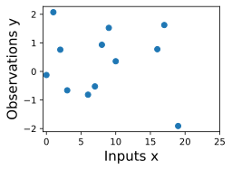

ガウス過程でデータに適合させるためには、まず、どのような種類の関数が妥当だと考えるかについての事前分布を指定します。ここでは、ガウス過程からのいくつかのサンプル関数を示します。この事前分布は妥当そうに見えるでしょうか？ ここで見ているのはデータセットに適合する関数ではなく、入力に対してどのくらい速く変化するかといった、解の高レベルな性質が妥当かどうかです。なお、このノートブックにあるすべての図を再現するコードは、事前分布と推論に関する次のノートブックで示します。

データを条件づけると、この事前分布を用いて、データに適合しうる関数の事後分布を推論できます。ここでは、事後分布からのサンプル関数を示します。

これらの関数はそれぞれ、観測データと完全に整合しており、各観測点をぴったり通過しています。これらの事後サンプルを使って予測を行うには、事後分布に含まれるあらゆる可能なサンプル関数の値を平均し、下の太い青線の曲線を作ればよいです。なお、この期待値を計算するのに実際に無限個のサンプルを取る必要はありません。後で見るように、期待値は閉形式で計算できます。 

また、予測にどの程度自信を持つべきかを知るために、不確実性の表現も欲しくなります。直感的には、事後サンプル関数のばらつきが大きい場所ほど不確実性も大きいはずです。なぜなら、真の関数が取りうる値の候補がより多いことを示しているからです。この種の不確実性は _epistemic uncertainty_ と呼ばれ、情報不足に伴う _reducible uncertainty_ です。データが増えるにつれて、この種の不確実性は消えていきます。なぜなら、観測と整合する解が次第に少なくなるからです。事後平均と同様に、事後分散（事後分布におけるこれらの関数のばらつき）も閉形式で計算できます。陰影で示しているのは、平均の両側に事後標準偏差の2倍を取ったもので、任意の入力 $x$ に対して真の関数値を95%の確率で含む _credible interval_ を作っています。

事後サンプルを取り除き、データ、事後平均、95% credible set だけを表示すると、図は少しすっきりします。データから離れるほど不確実性が増えていることに注目してください。これは epistemic uncertainty の性質です。 

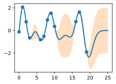

データに適合させるために使ったガウス過程の性質は、_covariance function_、別名 _kernel_ と呼ばれるものによって強く制御されます。ここで使った covariance function は _RBF (Radial Basis Function) kernel_ と呼ばれ、次の形をしています。
$$ k_{\textrm{RBF}}(x,x') = \textrm{Cov}(f(x),f(x')) = a^2 \exp\left(-\frac{1}{2\ell^2}||x-x'||^2\right) $$

この kernel の _hyperparameters_ は解釈可能です。_amplitude_ パラメータ $a$ は関数が変化する縦方向のスケールを制御し、_length-scale_ パラメータ
$\ell$
は関数の変化率（どれだけ「うねうね」しているか）を制御します。$a$ が大きいほど関数値の振幅は大きくなり、$\ell$ が大きいほど関数はよりゆっくり変化します。$a$ と
$\ell$
を変えたときに、サンプル事前分布と事後分布の関数がどう変わるか見てみましょう。 

_length-scale_ は、GP の予測と不確実性に特に顕著な影響を与えます。$||x-x'|| = \ell$
のとき、関数値のペア間の共分散は $a^2\exp(-0.5)$ です。$\ell$
より大きい距離では、関数値どうしはほとんど無相関になります。つまり、ある点 $x_*$ で予測したいとき、入力 $x$ が
$||x-x'||>\ell$
を満たす関数値は、予測に強い影響を与えません。 

length-scale を変えると、サンプル事前分布・事後分布の関数や credible set がどう変わるか見てみましょう。上の適合では length-scale を 2 にしています。ここでは
$\ell = 0.1, 0.5, 2, 5, 10$
を考えます。length-scale 0.1 は、考えている入力領域の範囲 25 に比べて非常に小さいです。たとえば、$x=5$ と $x=10$ における関数値は、このような length-scale では実質的に相関を持ちません。一方、length-scale が 10 なら、これらの入力での関数値は強く相関します。以下の図では縦軸スケールが変わっていることに注意してください。

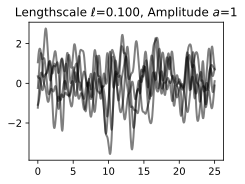
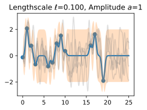

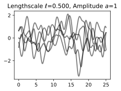
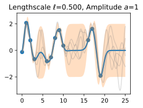

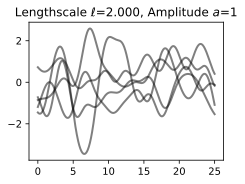

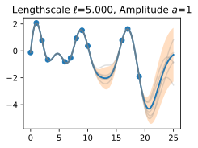

length-scale が大きくなるにつれて、関数の「wiggliness」は減少し、不確実性も減少することがわかります。length-scale が小さいと、データ点が関数値について与える情報が少なくなるため、データから離れるにつれて不確実性は急速に増加します。 

次に、length-scale を 2 に固定したまま、amplitude パラメータを変えてみましょう。事前サンプルでは縦軸スケールを固定し、事後サンプルでは変化させているので、関数のスケールが大きくなる様子とデータへの適合の両方をはっきり見ることができます。

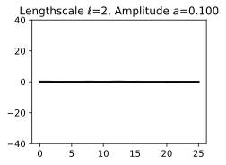

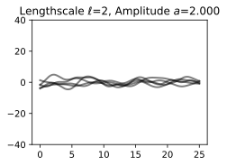

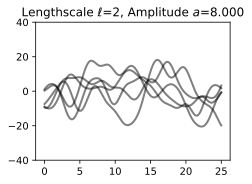
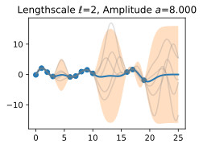

amplitude パラメータは関数のスケールに影響しますが、変化率には影響しないことがわかります。この時点で、私たちの手法の汎化性能は、これらの hyperparameters に妥当な値を与えられるかどうかに依存する、という感覚も得られます。$\ell=2$ と $a=1$ の値は妥当な適合を与えているように見えましたが、他の値のいくつかはそうではありませんでした。幸いなことに、_marginal likelihood_ と呼ばれるものを使って、これらの hyperparameters を頑健かつ自動的に指定する方法があります。これは推論に関するノートブックで改めて扱います。 

では、GP とは実際には何でしょうか？ 先に述べたように、GP は単に、任意の入力集合
$x_1,\dots,x_n$ 
によって添字付けられた任意の関数値の集合
$f(x_1),\dots,f(x_n)$
が、同時多変量ガウス分布に従うと述べるものです。この分布の平均ベクトル $\mu$ は _mean function_ によって与えられ、通常は定数またはゼロとします。この分布の共分散行列は、すべての入力 $x$ の組に対して kernel を評価したものです。 

$$\begin{bmatrix}f(x) \\f(x_1) \\ \vdots \\ f(x_n) \end{bmatrix}\sim \mathcal{N}\left(\mu, \begin{bmatrix}k(x,x) & k(x, x_1) & \dots & k(x,x_n) \\ k(x_1,x) & k(x_1,x_1) & \dots & k(x_1,x_n) \\ \vdots & \vdots & \ddots & \vdots \\ k(x_n, x) & k(x_n, x_1) & \dots & k(x_n,x_n) \end{bmatrix}\right)$$
:eqlabel:`eq_gp_prior`

式 :eqref:`eq_gp_prior` は GP の事前分布を指定しています。観測した関数値 $f(x_1), \dots, f(x_n)$ が与えられたとき、任意の $x$ における $f(x)$ の条件付き分布を計算できます。この条件付き分布を _posterior_ と呼び、予測に用います。

特に、

$$f(x) | f(x_1), \dots, f(x_n) \sim \mathcal{N}(m,s^2)$$ 

ここで

$$m = k(x,x_{1:n}) k(x_{1:n},x_{1:n})^{-1} f(x_{1:n})$$ 

$$s^2 = k(x,x) - k(x,x_{1:n})k(x_{1:n},x_{1:n})^{-1}k(x,x_{1:n})$$ 

です。ここで $k(x,x_{1:n})$ は $i=1,\dots,n$ に対して $k(x,x_{i})$ を評価して作る $1 \times n$ ベクトルであり、$k(x_{1:n},x_{1:n})$ は $i,j = 1,\dots,n$ に対して $k(x_i,x_j)$ を評価して作る $n \times n$ 行列です。$m$ は任意の $x$ に対する点予測として使え、$s^2$ は不確実性として使います。たとえば、$f(x)$ がその区間に入る確率が95%となる区間を作りたいなら、$m \pm 2s$ を使います。上のすべての図の予測平均と不確実性は、これらの式を使って作成されました。観測データ点は
$f(x_1), \dots, f(x_n)$
で与えられ、予測のために細かい刻みの $x$ 点を選びました。

1つのデータ点 $f(x_1)$ を観測し、ある $x$ における $f(x)$ の値を求めたいとします。$f(x)$ はガウス過程で記述されるので、
$(f(x), f(x_1))$
の同時分布がガウス分布であることがわかります。 

$$
\begin{bmatrix}
f(x) \\ 
f(x_1) \\
\end{bmatrix}
\sim
\mathcal{N}\left(\mu, 
\begin{bmatrix}
k(x,x) & k(x, x_1) \\
k(x_1,x) & k(x_1,x_1)
\end{bmatrix}
\right)
$$

非対角成分 $k(x,x_1) = k(x_1,x)$ 
は、関数値がどの程度相関するか --- つまり $f(x)$
が $f(x_1)$ からどれだけ強く決まるか --- を教えてくれます。すでに見たように、$x$ と $x_1$ の距離
$||x-x_1||$
に比べて length-scale が大きいと、関数値は強く相関します。$f(x_1)$ から $f(x)$ を決める過程は、関数空間でも、$f(x_1), f(x)$ の同時分布でも可視化できます。まず、$k(x,x_1) = 0.9$、$k(x,x)=1$ となる $x$ を考えます。これは、$f(x)$ の値が $f(x_1)$ の値と中程度に相関していることを意味します。同時分布では、等確率曲線は比較的細い楕円になります。

$f(x_1) = 1.2$ を観測したとします。 
この $f(x_1)$ の値で条件づけるには、密度の図において 1.2 の位置に水平線を引けばよく、すると $f(x)$ の値は主として $[0.64,1.52]$ に制約されることがわかります。これを関数空間でも描いており、観測点 $f(x_1)$ をオレンジで、$f(x)$ に対するガウス過程予測分布の1標準偏差を青で、平均値 1.08 のまわりに示しています。

次に、より強い相関 $k(x,x_1) = 0.95$ があるとします。 
すると楕円はさらに細くなり、$f(x)$ の値は $f(x_1)$ によってさらに強く決まります。1.2 に水平線を引くと、$f(x)$ の等高線は主として $[0.83, 1.45]$ の値を支持していることがわかります。ここでも、平均予測値 1.14 のまわりに1標準偏差を示した関数空間の図を示します。

相関が強くなると、ガウス過程の事後平均予測は 1.2 に近づくことがわかります。また、不確実性（誤差棒）もやや小さくなっています。これらの関数値の間に強い相関があるにもかかわらず、観測したデータ点は1つだけなので、不確実性は依然としてかなり大きいままです。 

この手順は、観測した点の数にかかわらず、任意の $x$ に対する $f(x)$ の事後分布を与えてくれます。$f(x_1), f(x_2)$ を観測したとしましょう。ここでは、特定の $x=x'$ における $f(x)$ の事後分布を関数空間で可視化します。$f(x)$ の厳密な分布は上の式で与えられます。$f(x)$ はガウス分布に従い、平均は

$$m = k(x,x_{1:3}) k(x_{1:3},x_{1:3})^{-1} f(x_{1:3})$$

分散は

$$s^2 = k(x,x) - k(x,x_{1:3})k(x_{1:3},x_{1:3})^{-1}k(x,x_{1:3})$$

です。

この入門ノートブックでは、_noise free_ の観測を考えてきました。後で見るように、観測ノイズを含めるのは簡単です。データが、潜在的なノイズなし関数 $f(x)$ に iid Gaussian noise 
$\epsilon(x) \sim \mathcal{N}(0,\sigma^2)$
を加えたものとして生成されると仮定するなら、共分散関数は単に
$k(x_i,x_j) \to k(x_i,x_j) + \delta_{ij}\sigma^2$
となります。ここで $\delta_{ij} = 1$ は $i=j$ のとき、そうでなければ 0 です。

ここまでで、ガウス過程を使って解の事前分布と事後分布をどのように指定できるか、そして kernel 関数がこれらの解の性質にどう影響するかについて、ある程度の直感を得ました。次のノートブックでは、ガウス過程の事前分布を正確に指定する方法を示し、さまざまな kernel 関数を導入・導出し、その後、kernel の hyperparameters を自動的に学習し、予測のためのガウス過程事後分布を構成する仕組みを説明します。「関数の分布」のような概念に慣れるには時間と練習が必要ですが、GP の予測式を求める実際の手順自体は非常に単純です --- そのため、これらの概念について直感的な理解を身につける練習がしやすくなっています。

## 要約

典型的な機械学習では、何らかの自由パラメータを持つ関数（たとえばニューラルネットワークとその重み）を指定し、そのパラメータの推定に焦点を当てますが、それらは解釈しにくいことがあります。ガウス過程では、その代わりに関数に対する分布そのものについて推論するため、解の高レベルな性質について考えることができます。これらの性質は共分散関数（kernel）によって制御され、そこにはしばしば少数の非常に解釈しやすい hyperparameters があります。これらの hyperparameters には、関数がどれだけ速く（どれだけうねうねと）変化するかを制御する _length-scale_ が含まれます。もう1つの hyperparameter は amplitude で、関数が変化する縦方向のスケールを制御します。 
データに適合しうる多様な関数を表現し、それらをすべてまとめて予測分布に統合することは、ベイズ法の特徴的な性質です。データから離れるほど取りうる解のばらつきが大きくなるため、直感的にはデータから離れるにつれて不確実性が増していきます。 

ガウス過程は、取りうるすべての関数値に対して多変量正規（ガウス）分布を指定することで、関数の分布を表現します。ガウス分布は容易に操作できるので、ある関数値の分布を、他の任意の値の集合に基づいて求めることができます。言い換えると、点の集合を観測したなら、それらの点で条件づけて、他の任意の入力における関数値がどのような分布になりうるかを推論できます。これらの点の相関をどのようにモデル化するかは共分散関数によって決まり、それがガウス過程の汎化特性を定義します。ガウス過程に慣れるには時間がかかりますが、扱いやすく、多くの応用があり、ニューラルネットワークのような他のモデルクラスを理解・発展させる助けにもなります。

## 演習

1. epistemic uncertainty と observation uncertainty の違いは何ですか？
2. 変化率と amplitude 以外に、どのような関数の性質を考慮したいでしょうか。また、その性質を持つ関数の現実世界の例にはどのようなものがありますか？
3. ここで考えた RBF 共分散関数は、観測間の共分散（および相関）が入力空間（時刻、空間的位置など）での距離とともに減少すると述べています。これは妥当な仮定でしょうか？ なぜそう言える、あるいはそう言えないのでしょうか？
4. 2つのガウス変数の和はガウスですか？ 2つのガウス変数の積はガウスですか？ $(a,b)$ が同時ガウス分布に従うとき、$a|b$（$b$ が与えられたときの $a$）はガウスですか？ ガウスではないですか？
5. $f(x_1) = 1.2$ のデータ点を観測する演習を繰り返してください。ただし今度は、さらに $f(x_2) = 1.4$ も観測したとします。$k(x,x_1) = 0.9$、$k(x,x_2) = 0.8$ とします。$f(x)$ の値について、$f(x_1)$ だけを観測したときよりも、より確信を持てるでしょうか、それともより不確かでしょうか？ 今の $f(x)$ の平均と95\% credible set はどうなりますか？ 
6. 観測ノイズの推定値を増やすと、真の関数の length-scale の推定値は大きくなると思いますか、それとも小さくなると思いますか？
7. データから離れるにつれて、予測分布の不確実性がある点まで増加した後、増加しなくなるとします。なぜそのようなことが起こるのでしょうか？\n
