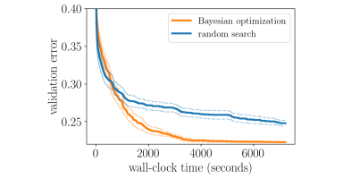

{.python .input  n=1}
%load_ext d2lbook.tab
tab.interact_select(["pytorch"])
```

# ハイパーパラメータ最適化 API
:label:`sec_api_hpo`

方法論に入る前に、まずはさまざまな HPO アルゴリズムを効率よく実装できる基本的なコード構造について説明します。一般に、ここで扱うすべての HPO アルゴリズムは、*探索* と *スケジューリング* という 2 つの意思決定プリミティブを実装する必要があります。まず、新しいハイパーパラメータ構成をサンプリングする必要があります。これは多くの場合、構成空間に対する何らかの探索を伴います。次に、各構成について、その評価をいつ行うかをスケジュールし、どれだけのリソースを割り当てるかを決める必要があります。いったん構成の評価を始めたら、それを *trial* と呼びます。これらの決定を `HPOSearcher` と `HPOScheduler` の 2 つのクラスに対応付けます。さらに、最適化プロセスを実行する `HPOTuner` クラスも提供します。

この scheduler と searcher の概念は、Syne Tune :cite:`salinas-automl22`、Ray Tune :cite:`liaw-arxiv18`、Optuna :cite:`akiba-sigkdd19` などの一般的な HPO ライブラリにも実装されています。

```{.python .input  n=2}
%%tab pytorch
import time
from d2l import torch as d2l
from scipy import stats
```

## Searcher

以下では searcher の基底クラスを定義します。これは `sample_configuration` 関数を通じて新しい候補構成を提供します。この関数を実装する簡単な方法は、 :numref:`sec_what_is_hpo` でランダムサーチを行ったときのように、構成を一様ランダムにサンプリングすることです。ベイズ最適化のようなより高度なアルゴリズムでは、過去の trial の性能に基づいてこれらの決定を行います。その結果、時間とともにより有望な候補をサンプリングできるようになります。過去の trial の履歴を更新するために `update` 関数を追加し、これをサンプリング分布の改善に利用できるようにします。

```{.python .input  n=3}
%%tab pytorch
class HPOSearcher(d2l.HyperParameters):  #@save
    def sample_configuration() -> dict:
        raise NotImplementedError

    def update(self, config: dict, error: float, additional_info=None):
        pass
```

次のコードは、前節でのランダムサーチ最適化器をこの API で実装する方法を示しています。少し拡張して、最初に評価する構成を `initial_config` で指定できるようにし、それ以降はランダムにサンプリングします。

```{.python .input  n=4}
%%tab pytorch
class RandomSearcher(HPOSearcher):  #@save
    def __init__(self, config_space: dict, initial_config=None):
        self.save_hyperparameters()

    def sample_configuration(self) -> dict:
        if self.initial_config is not None:
            result = self.initial_config
            self.initial_config = None
        else:
            result = {
                name: domain.rvs()
                for name, domain in self.config_space.items()
            }
        return result
```

## Scheduler

新しい trial のための構成をサンプリングするだけでなく、trial をいつ、どれだけ長く実行するかも決める必要があります。実際には、これらすべての決定は `HPOScheduler` によって行われ、`HPOSearcher` に新しい構成の選択を委ねます。`suggest` メソッドは、学習のための何らかのリソースが利用可能になるたびに呼び出されます。searcher の `sample_configuration` を呼ぶだけでなく、`max_epochs`（つまり、モデルをどれだけ長く学習させるか）などのパラメータも決めることがあります。`update` メソッドは、trial が新しい観測値を返すたびに呼び出されます。

```{.python .input  n=5}
%%tab pytorch
class HPOScheduler(d2l.HyperParameters):  #@save
    def suggest(self) -> dict:
        raise NotImplementedError
    
    def update(self, config: dict, error: float, info=None):
        raise NotImplementedError
```

ランダムサーチを実装する場合も、他の HPO アルゴリズムを実装する場合も、新しいリソースが利用可能になるたびに新しい構成をスケジュールする基本的な scheduler だけで十分です。

```{.python .input  n=6}
%%tab pytorch
class BasicScheduler(HPOScheduler):  #@save
    def __init__(self, searcher: HPOSearcher):
        self.save_hyperparameters()

    def suggest(self) -> dict:
        return self.searcher.sample_configuration()

    def update(self, config: dict, error: float, info=None):
        self.searcher.update(config, error, additional_info=info)
```

## Tuner

最後に、scheduler/searcher を実行し、結果をいくつか管理するコンポーネントが必要です。以下のコードは、HPO trial を逐次的に実行し、1 つの学習ジョブを順番に評価するもので、基本例として使えます。後ほど、よりスケーラブルな分散 HPO のケースでは *Syne Tune* を使います。

```{.python .input  n=7}
%%tab pytorch
class HPOTuner(d2l.HyperParameters):  #@save
    def __init__(self, scheduler: HPOScheduler, objective: callable):
        self.save_hyperparameters()
        # Bookeeping results for plotting
        self.incumbent = None
        self.incumbent_error = None
        self.incumbent_trajectory = []
        self.cumulative_runtime = []
        self.current_runtime = 0
        self.records = []

    def run(self, number_of_trials):
        for i in range(number_of_trials):
            start_time = time.time()
            config = self.scheduler.suggest()
            print(f"Trial {i}: config = {config}")
            error = self.objective(**config)
            error = float(d2l.numpy(error.cpu()))
            self.scheduler.update(config, error)
            runtime = time.time() - start_time
            self.bookkeeping(config, error, runtime)
            print(f"    error = {error}, runtime = {runtime}")
```

## HPO アルゴリズムの性能管理

どの HPO アルゴリズムでも、私たちが主に関心を持つのは、与えられた壁時計時間における最良性能の構成（*incumbent* と呼ぶ）と、その検証誤差です。そのため、各反復ごとの `runtime` を追跡します。これには、評価を実行する時間（`objective` の呼び出し）と、意思決定を行う時間（`scheduler.suggest` の呼び出し）の両方が含まれます。以下では、`cumulative_runtime` と `incumbent_trajectory` をプロットして、`scheduler`（および `searcher`）で定義される HPO アルゴリズムの *any-time performance* を可視化します。これにより、最適化器が見つけた構成がどれだけ良いかだけでなく、それをどれだけ速く見つけられるかも定量化できます。

```{.python .input  n=8}
%%tab pytorch
@d2l.add_to_class(HPOTuner)  #@save
def bookkeeping(self, config: dict, error: float, runtime: float):
    self.records.append({"config": config, "error": error, "runtime": runtime})
    # Check if the last hyperparameter configuration performs better 
    # than the incumbent
    if self.incumbent is None or self.incumbent_error > error:
        self.incumbent = config
        self.incumbent_error = error
    # Add current best observed performance to the optimization trajectory
    self.incumbent_trajectory.append(self.incumbent_error)
    # Update runtime
    self.current_runtime += runtime
    self.cumulative_runtime.append(self.current_runtime)
```

## 例: 畳み込みニューラルネットワークのハイパーパラメータ最適化

ここでは、新しく実装したランダムサーチを使って、 :numref:`sec_lenet` の `LeNet` 畳み込みニューラルネットワークの *バッチサイズ* と *学習率* を最適化します。まず、目的関数を定義します。ここでも検証誤差を用います。

```{.python .input  n=9}
%%tab pytorch
def hpo_objective_lenet(learning_rate, batch_size, max_epochs=10):  #@save
    model = d2l.LeNet(lr=learning_rate, num_classes=10)
    trainer = d2l.HPOTrainer(max_epochs=max_epochs, num_gpus=1)
    data = d2l.FashionMNIST(batch_size=batch_size)
    model.apply_init([next(iter(data.get_dataloader(True)))[0]], d2l.init_cnn)
    trainer.fit(model=model, data=data)
    validation_error = trainer.validation_error()
    return validation_error
```

構成空間も定義する必要があります。さらに、最初に評価する構成は :numref:`sec_lenet` で使ったデフォルト設定とします。

```{.python .input  n=10}
config_space = {
    "learning_rate": stats.loguniform(1e-2, 1),
    "batch_size": stats.randint(32, 256),
}
initial_config = {
    "learning_rate": 0.1,
    "batch_size": 128,
}
```

これでランダムサーチを開始できます。

```{.python .input}
searcher = RandomSearcher(config_space, initial_config=initial_config)
scheduler = BasicScheduler(searcher=searcher)
tuner = HPOTuner(scheduler=scheduler, objective=hpo_objective_lenet)
tuner.run(number_of_trials=5)
```

以下では、ランダムサーチの any-time performance を得るために、incumbent の最適化軌跡をプロットします。

```{.python .input  n=11}
board = d2l.ProgressBoard(xlabel="time", ylabel="error")
for time_stamp, error in zip(
    tuner.cumulative_runtime, tuner.incumbent_trajectory
):
    board.draw(time_stamp, error, "random search", every_n=1)
```

## HPO アルゴリズムの比較

学習アルゴリズムやモデルアーキテクチャと同様に、異なる HPO アルゴリズムをどのように比較するのが最善かを理解することは重要です。各 HPO 実行は、2 つの主要なランダム性の源に依存します。1 つは、ランダムな重み初期化やミニバッチの順序付けなど、学習過程に由来するランダムな効果です。もう 1 つは、ランダムサーチにおけるランダムサンプリングのような、HPO アルゴリズム自体に内在するランダム性です。したがって、異なるアルゴリズムを比較する際には、各実験を複数回実行し、乱数生成器の異なるシードに基づく複数回の反復全体で、平均や中央値などの統計量を報告することが重要です。

これを示すために、フィードフォワードニューラルネットワークのハイパーパラメータ調整において、ランダムサーチ（:numref:`sec_rs` を参照）とベイズ最適化 :cite:`snoek-nips12` を比較します。各アルゴリズムは、異なる乱数シードで $50$ 回評価されました。実線はこの $50$ 回の反復にわたる incumbent の平均性能を示し、破線は標準偏差を示します。ランダムサーチとベイズ最適化はおよそ 1000 秒まではほぼ同程度の性能ですが、ベイズ最適化は過去の観測を利用してより良い構成を特定できるため、その後はすぐにランダムサーチを上回ることがわかります。



:label:`example_anytime_performance`

## まとめ

この節では、この章で扱うさまざまな HPO アルゴリズムを実装するための、シンプルでありながら柔軟なインターフェースを示しました。類似のインターフェースは、一般的なオープンソースの HPO フレームワークにも見られます。また、HPO アルゴリズムをどのように比較できるか、そして注意すべき潜在的な落とし穴についても見ました。 

## 演習

1. この演習の目的は、少し難しめの HPO 問題の目的関数を実装し、より現実的な実験を行うことです。 :numref:`sec_dropout` で実装した 2 層隠れ層 MLP `DropoutMLP` を使います。
    1. 目的関数をコード化してください。これはモデルのすべてのハイパーパラメータと `batch_size` に依存する必要があります。`max_epochs=50` を使ってください。ここでは GPU は役に立たないので、`num_gpus=0` とします。ヒント: `hpo_objective_lenet` を修正してください。
    2. 妥当な探索空間を選んでください。`num_hiddens_1`、`num_hiddens_2` は $[8, 1024]$ の整数、dropout 値は $[0, 0.95]$、`batch_size` は $[16, 384]$ とします。`scipy.stats` の適切な分布を使って `config_space` のコードを示してください。
    3. この例で `number_of_trials=20` としてランダムサーチを実行し、結果をプロットしてください。まず :numref:`sec_dropout` のデフォルト構成、すなわち `initial_config = {'num_hiddens_1': 256, 'num_hiddens_2': 256, 'dropout_1': 0.5, 'dropout_2': 0.5, 'lr': 0.1, 'batch_size': 256}` を最初に評価することを忘れないでください。
2. この演習では、過去のデータに基づいて意思決定を行う新しい searcher（`HPOSearcher` のサブクラス）を実装します。これは `probab_local`、`num_init_random` というパラメータに依存します。`sample_configuration` メソッドは次のように動作します。最初の `num_init_random` 回の呼び出しでは、`RandomSearcher.sample_configuration` と同じことを行います。それ以外では、確率 `1 - probab_local` で `RandomSearcher.sample_configuration` と同じことを行います。それ以外では、これまでで最小の検証誤差を達成した構成を選び、そのハイパーパラメータの 1 つをランダムに選んで、その値を `RandomSearcher.sample_configuration` と同様にランダムにサンプリングしますが、他の値はそのままにします。この 1 つのハイパーパラメータだけが異なり、それ以外はこれまでの最良構成と同一である構成を返してください。
    1. この新しい `LocalSearcher` をコード化してください。ヒント: searcher の構築時には引数として `config_space` が必要です。`RandomSearcher` 型のメンバーを使っても構いません。また、`update` メソッドも実装する必要があります。
    2. 前の演習の実験を、`RandomSearcher` の代わりにこの新しい searcher を使って再実行してください。`probab_local`、`num_init_random` のさまざまな値を試してください。ただし、異なる HPO 手法を適切に比較するには、実験を複数回繰り返し、できれば複数のベンチマークタスクを考慮する必要があることに注意してください。
