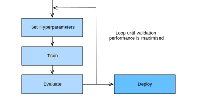

{.python .input}
%load_ext d2lbook.tab
tab.interact_select(["pytorch"])
```

# ハイパーパラメータ最適化とは何か？
:label:`sec_what_is_hpo`

前の章で見てきたように、深層ニューラルネットワークには、学習中に獲得される多数のパラメータ、すなわち重みがあります。これに加えて、すべてのニューラルネットワークには、ユーザーが設定しなければならない追加の *ハイパーパラメータ* があります。たとえば、確率的勾配降下法が訓練損失の局所最適に収束するようにするには
（:numref:`chap_optimization` を参照）、学習率とバッチサイズを調整する必要があります。訓練データセットへの過学習を避けるために、重み減衰
（:numref:`sec_weight_decay` を参照）やドロップアウト（:numref:`sec_dropout` を参照）のような正則化パラメータを設定しなければならないこともあります。層数や各層あたりのユニット数またはフィルター数（すなわち、実効的な重みの数）を設定することで、モデルの容量と帰納バイアスを定義できます。

残念ながら、これらのハイパーパラメータを訓練損失の最小化によって単純に調整することはできません。そうすると訓練データへの過学習を招くからです。たとえば、ドロップアウトや重み減衰のような正則化パラメータをゼロに設定すると訓練損失は小さくなりますが、汎化性能を損なう可能性があります。


:label:`ml_workflow`

別の形の自動化がなければ、ハイパーパラメータは試行錯誤によって手動で設定しなければならず、機械学習ワークフローの中でも時間がかかり難しい部分になります。たとえば、CIFAR-10 上で ResNet（:numref:`sec_resnet` を参照）を学習する場合を考えてみましょう。Amazon Elastic Cloud Compute (EC2) の `g4dn.xlarge` インスタンスでは 2 時間以上かかります。たとえ 10 通りのハイパーパラメータ設定を順番に試すだけでも、これだけでおよそ 1 日かかってしまいます。さらに悪いことに、ハイパーパラメータは通常、アーキテクチャやデータセットをまたいでそのまま転用できず :cite:`feurer-arxiv22,wistuba-ml18,bardenet-icml13a`、新しいタスクごとに再最適化する必要があります。また、ほとんどのハイパーパラメータには経験則がなく、妥当な値を見つけるには専門知識が必要です。

*ハイパーパラメータ最適化（HPO）* アルゴリズムは、この問題に原理的かつ自動化された方法で取り組むよう設計されています :cite:`feurer-automlbook18a`。これは、これを大域最適化問題として定式化することで実現されます。標準的な目的関数はホールドアウトした検証データセット上の誤差ですが、原理的には他のビジネス指標でも構いません。これに、学習時間、推論時間、モデルの複雑さなどの副次的な目的を組み合わせたり、制約として課したりできます。 

近年、ハイパーパラメータ最適化は *ニューラルアーキテクチャ探索（NAS）* :cite:`elsken-arxiv18a,wistuba-arxiv19` に拡張され、まったく新しいニューラルネットワークアーキテクチャを見つけることが目標になっています。従来の HPO と比べると、NAS は計算コストがさらに高く、実用上成立させるためには追加の工夫が必要です。HPO と NAS の両方は、ML パイプライン全体の自動化を目指す AutoML :cite:`hutter-book19a` の下位分野とみなせます。

この節では HPO を紹介し、:numref:`sec_softmax_concise` で導入したロジスティック回帰の例に対して、最適なハイパーパラメータを自動的に見つける方法を示します。

## 最適化問題
:label:`sec_definition_hpo`

まずは簡単な玩具問題から始めましょう。Fashion MNIST データセット上で、:numref:`sec_softmax_concise` の多クラスロジスティック回帰モデル `SoftmaxRegression` の学習率を探索し、検証誤差を最小化します。バッチサイズやエポック数のような他のハイパーパラメータも調整する価値はありますが、簡単のためここでは学習率のみに注目します。

```{.python .input}
%%tab pytorch
from d2l import torch as d2l
import numpy as np
import torch
from torch import nn
from scipy import stats
```

HPO を実行する前に、まず 2 つの要素を定義する必要があります。目的関数と構成空間です。

### 目的関数

学習アルゴリズムの性能は、ハイパーパラメータ空間 $\mathbf{x} \in \mathcal{X}$ から検証損失へ写像する関数
$f: \mathcal{X} \rightarrow \mathbb{R}$ とみなせます。$f(\mathbf{x})$ を評価するたびに、機械学習モデルを訓練して検証しなければならず、深層ニューラルネットワークを大規模データセットで学習する場合には時間と計算資源を大量に消費します。基準 $f(\mathbf{x})$ が与えられたとき、目標は $\mathbf{x}_{\star} \in \mathrm{argmin}_{\mathbf{x} \in \mathcal{X}} f(\mathbf{x})$ を見つけることです。 

$f$ を $\mathbf{x}$ に関して微分する簡単な方法はありません。なぜなら、勾配を学習プロセス全体を通して伝播させる必要があるからです。近似的な「ハイパー勾配」によって HPO を駆動する最近の研究 :cite:`maclaurin-icml15,franceschi-icml17a` はありますが、既存手法はいずれもまだ最先端手法に競争力があるとは言えず、ここでは扱いません。さらに、$f$ の評価に伴う計算負荷のため、HPO アルゴリズムはできるだけ少ないサンプルで大域最適に近づく必要があります。

ニューラルネットワークの学習は確率的です（たとえば、重みはランダムに初期化され、ミニバッチはランダムにサンプリングされる）ので、観測値にはノイズが含まれます：$y \sim f(\mathbf{x}) + \epsilon$。通常、観測ノイズ $\epsilon \sim N(0, \sigma)$ はガウス分布に従うと仮定します。

これらすべての課題に直面すると、通常は大域最適を厳密に当てにいくのではなく、性能の良いハイパーパラメータ設定を少数、迅速に見つけることを目指します。しかし、多くのニューラルネットワークモデルは計算要求が大きいため、それでも数日から数週間の計算時間が必要になることがあります。:numref:`sec_mf_hpo` では、探索を分散させるか、目的関数のより安価に評価できる近似を用いることで、最適化プロセスをどのように高速化できるかを見ていきます。

まずは、モデルの検証誤差を計算する方法から始めます。

```{.python .input  n=8}
%%tab pytorch
class HPOTrainer(d2l.Trainer):  #@save
    def validation_error(self):
        self.model.eval()
        accuracy = 0
        val_batch_idx = 0
        for batch in self.val_dataloader:
            with torch.no_grad():
                x, y = self.prepare_batch(batch)
                y_hat = self.model(x)
                accuracy += self.model.accuracy(y_hat, y)
            val_batch_idx += 1
        return 1 -  accuracy / val_batch_idx
```

ここでは、ハイパーパラメータ構成 `config` に含まれる `learning_rate` に関して検証誤差を最適化します。各評価では、`max_epochs` エポックだけモデルを訓練し、その後で検証誤差を計算して返します。

```{.python .input  n=5}
%%tab pytorch
def hpo_objective_softmax_classification(config, max_epochs=8):
    learning_rate = config["learning_rate"]
    trainer = d2l.HPOTrainer(max_epochs=max_epochs)
    data = d2l.FashionMNIST(batch_size=16)
    model = d2l.SoftmaxRegression(num_outputs=10, lr=learning_rate)
    trainer.fit(model=model, data=data)
    return d2l.numpy(trainer.validation_error())
```

### 構成空間
:label:`sec_intro_config_spaces`

目的関数 $f(\mathbf{x})$ に加えて、最適化対象となる実行可能集合 $\mathbf{x} \in \mathcal{X}$、すなわち *構成空間* または *探索空間* も定義する必要があります。ロジスティック回帰の例では、次を用います。

```{.python .input  n=6}
config_space = {"learning_rate": stats.loguniform(1e-4, 1)}
```

ここでは SciPy の `loguniform` オブジェクトを使っています。これは対数空間で -4 から -1 の間の一様分布を表します。このオブジェクトを使うと、この分布から乱数をサンプリングできます。

各ハイパーパラメータには、`learning_rate` のような `float` といったデータ型に加えて、閉じた有界範囲（すなわち下限と上限）があります。通常は、各ハイパーパラメータに対して事前分布（たとえば一様分布や対数一様分布）を割り当て、そこからサンプリングします。`learning_rate` のような正のパラメータの中には、最適値が数桁にわたって変わりうるため対数スケールで表すのが最適なものがあります。一方、モメンタムのようなものは線形スケールで扱います。

以下では、多層パーセプトロンの典型的なハイパーパラメータからなる構成空間の簡単な例を、その型と標準的な範囲とともに示します。

: 多層パーセプトロンの構成空間の例
:label:`tab_example_configspace`

| Name                | Type        |Hyperparameter Ranges           | log-scale |
| :----:              | :----:      |:------------------------------:|:---------:|
| learning rate       | float       |      $[10^{-6},10^{-1}]$       |    yes    |
| batch size          | integer     |           $[8,256]$            |    yes    |
| momentum            | float       |           $[0,0.99]$           |    no     |
| activation function | categorical | $\{\textrm{tanh}, \textrm{relu}\}$ |     -     |
| number of units     | integer     |          $[32, 1024]$          |    yes    |
| number of layers    | integer     |            $[1, 6]$            |    no     |


一般に、構成空間 $\mathcal{X}$ の構造は複雑で、$\mathbb{R}^d$ とはかなり異なることがあります。実際には、あるハイパーパラメータが他の値に依存する場合があります。たとえば、多層パーセプトロンの層数と、各層のユニット数を調整しようとしているとします。$l\textrm{-th}$ 層のユニット数は、ネットワークが少なくとも $l+1$ 層を持つ場合にのみ意味を持ちます。このような高度な HPO 問題は本章の範囲を超えています。興味のある読者は :cite:`hutter-lion11a,jenatton-icml17a,baptista-icml18a` を参照してください。

構成空間はハイパーパラメータ最適化において重要な役割を果たします。なぜなら、構成空間に含まれていないものを見つけられるアルゴリズムは存在しないからです。一方で、範囲が広すぎると、性能の良い構成を見つけるための計算予算が現実的でなくなることがあります。

## ランダム探索
:label:`sec_rs`

*ランダム探索* は、最初に扱うハイパーパラメータ最適化アルゴリズムです。ランダム探索の主な考え方は、あらかじめ定めた予算（たとえば最大反復回数）を使い切るまで構成空間から独立にサンプリングし、観測された中で最良の構成を返すことです。すべての評価は独立に並列実行できますが（:numref:`sec_rs_async` を参照）、ここでは簡単のため逐次ループを使います。

```{.python .input  n=7}
errors, values = [], []
num_iterations = 5

for i in range(num_iterations):
    learning_rate = config_space["learning_rate"].rvs()
    print(f"Trial {i}: learning_rate = {learning_rate}")
    y = hpo_objective_softmax_classification({"learning_rate": learning_rate})
    print(f"    validation_error = {y}")
    values.append(learning_rate)
    errors.append(y)
```

最良の学習率は、単に検証誤差が最も低いものです。

```{.python .input  n=7}
best_idx = np.argmin(errors)
print(f"optimal learning rate = {values[best_idx]}")
```

その単純さと汎用性のため、ランダム探索は最も頻繁に使われる HPO アルゴリズムの 1 つです。洗練された実装を必要とせず、各ハイパーパラメータに対する確率分布を定義できる限り、どのような構成空間にも適用できます。

残念ながら、ランダム探索にはいくつかの欠点もあります。第 1 に、これまでに得られた観測結果に基づいてサンプリング分布を適応させません。そのため、性能の悪い構成をサンプルする確率も、性能の良い構成をサンプルする確率も同じです。第 2 に、初期性能が悪く、これまでに見つかった構成を上回る可能性が低いものにも、すべて同じ量の資源を費やしてしまいます。

次の節では、モデルを使って探索を導くことでランダム探索の欠点を克服する、よりサンプル効率の高いハイパーパラメータ最適化アルゴリズムを見ていきます。また、性能の悪い構成の評価を自動的に打ち切って最適化を高速化するアルゴリズムも見ていきます。

## まとめ

この節では、ハイパーパラメータ最適化（HPO）を導入し、構成空間と目的関数を定義することで、それを大域最適化として定式化できることを示しました。また、最初の HPO アルゴリズムであるランダム探索を実装し、単純なソフトマックス分類問題に適用しました。

ランダム探索は非常に単純ですが、固定されたハイパーパラメータ集合をそのまま評価するグリッドサーチよりも優れた選択肢です。ランダム探索は、次元の呪い :cite:`bellman-science66` をある程度緩和し、基準がハイパーパラメータの小さな部分集合に最も強く依存している場合には、グリッドサーチよりはるかに効率的になりえます。

## 演習

1. この章では、互いに重ならない訓練集合で学習した後のモデルの検証誤差を最適化します。簡単のため、コードでは `Trainer.val_dataloader` を使っており、これは `FashionMNIST.val` のローダーに対応しています。
    1. （コードを見て）これが、元の FashionMNIST の訓練集合（60000 例）を訓練に、元の *テスト集合*（10000 例）を検証に使っていることを確認してください。
    2. なぜこのやり方は問題になりうるのでしょうか？ ヒント：:numref:`sec_generalization_basics`、特に *モデル選択* について読み直してください。
    3. 代わりに何をすべきだったでしょうか？
2. 上で、勾配降下法によるハイパーパラメータ最適化は非常に難しいと述べました。たとえば、FashionMNIST データセット（:numref:`sec_mlp-implementation`）上で 2 層パーセプトロンをバッチサイズ 256 で学習する小さな問題を考えてみましょう。1 エポック学習した後の検証指標を最小化するために、SGD の学習率を調整したいとします。
    1. なぜこの目的のために検証 *誤差* を使えないのでしょうか？ 検証セット上ではどの指標を使うべきでしょうか？
    2. 1 エポック学習した後の検証指標の計算グラフを、おおまかに描いてください。初期重みとハイパーパラメータ（たとえば学習率）がこのグラフへの入力ノードであると仮定して構いません。ヒント：:numref:`sec_backprop` の計算グラフについて読み直してください。
    3. このグラフ上での順伝播中に保存する必要がある浮動小数点値の数を、おおまかに見積もってください。ヒント：FashionMNIST には 60000 例あります。必要なメモリは各層の後の活性化で支配されると仮定し、層の幅は :numref:`sec_mlp-implementation` で確認してください。
    5. 必要な計算量と保存容量が膨大であること以外に、勾配ベースのハイパーパラメータ最適化にはどのような問題があるでしょうか？ ヒント：:numref:`sec_numerical_stability` の勾配消失と勾配爆発について読み直してください。
    6. *発展*: 勾配ベース HPO に対する洗練された（とはいえまだやや実用的ではない）アプローチについて :cite:`maclaurin-icml15` を読んでください。
3. グリッドサーチも別の HPO ベースラインです。各ハイパーパラメータについて等間隔のグリッドを定義し、その（組合せ的な）直積を順にたどって構成を提案します。
    1. 上で、基準がハイパーパラメータの小さな部分集合に最も強く依存している場合、十分に多くのハイパーパラメータに対する HPO ではランダム探索がグリッドサーチよりはるかに効率的になりうると述べました。なぜでしょうか？ ヒント：:cite:`bergstra2011algorithms` を読んでください。


:begin_tab:`pytorch`
[Discussions](https://discuss.d2l.ai/t/12090)
:end_tab:\n