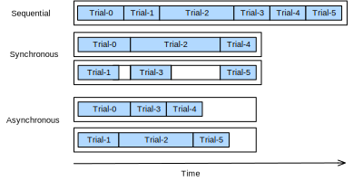

{.python .input}
%load_ext d2lbook.tab
tab.interact_select(["pytorch"])
#required_libs("syne-tune[gpsearchers]==0.3.2")
```

# 非同期ランダムサーチ
:label:`sec_rs_async`

前の :numref:`sec_api_hpo` で見たように、ハイパーパラメータ構成の評価にはコストがかかるため、ランダムサーチが良いハイパーパラメータ構成を返すまでに数時間、あるいは数日待たなければならないことがある。実際には、同じマシン上の複数GPUや、単一GPUを持つ複数マシンといった資源プールを利用できることがよくある。ここで問題になるのは、*ランダムサーチをどのように効率よく分散するか*である。

一般に、同期型と非同期型の並列ハイパーパラメータ最適化を区別する（:numref:`distributed_scheduling` を参照）。同期型では、同時に実行中のすべての試行が終了するまで待ってから、次のバッチを開始する。深層ニューラルネットワークのフィルタ数や層数のようなハイパーパラメータを含む構成空間を考えてみよう。より多くのフィルタ層を含むハイパーパラメータ構成は、当然ながら完了までにより長い時間を要し、同じバッチ内の他のすべての試行は、最適化プロセスを続ける前に同期点（:numref:`distributed_scheduling` の灰色部分）で待たなければならない。

非同期型では、資源が利用可能になり次第、すぐに新しい試行をスケジュールする。これにより、同期のオーバーヘッドを避けられるため、資源を最適に活用できる。ランダムサーチでは、新しいハイパーパラメータ構成はそれぞれ他のすべてから独立に選ばれ、特に過去の評価結果を利用しない。つまり、ランダムサーチは非同期に容易に並列化できる。これは、過去の観測に基づいて意思決定を行う、より高度な手法では自明ではない（:numref:`sec_sh_async` を参照）。逐次設定よりも多くの資源にアクセスできる必要はあるが、非同期ランダムサーチは線形の高速化を示し、$K$ 個の試行を並列実行できれば、ある性能に到達するまでの時間は $K$ 倍速くなる。 



:label:`distributed_scheduling`

このノートブックでは、同一マシン上の複数の python プロセスで試行を実行する非同期ランダムサーチを見ていく。分散ジョブのスケジューリングと実行をゼロから実装するのは困難である。そこで、非同期HPOのためのシンプルなインターフェースを提供する *Syne Tune* :cite:`salinas-automl22` を使用する。Syne Tune はさまざまな実行バックエンドで動作するよう設計されており、分散HPOについてさらに学びたい読者は、そのシンプルなAPIをぜひ調べてみよ。

```{.python .input}
from d2l import torch as d2l
import logging
logging.basicConfig(level=logging.INFO)
from syne_tune.config_space import loguniform, randint
from syne_tune.backend.python_backend import PythonBackend
from syne_tune.optimizer.baselines import RandomSearch
from syne_tune import Tuner, StoppingCriterion
from syne_tune.experiments import load_experiment
```

## 目的関数

まず、新しい目的関数を定義し、`report` コールバックを通じて Syne Tune に性能を返すようにする。

```{.python .input  n=34}
def hpo_objective_lenet_synetune(learning_rate, batch_size, max_epochs):
    from d2l import torch as d2l    
    from syne_tune import Reporter

    model = d2l.LeNet(lr=learning_rate, num_classes=10)
    trainer = d2l.HPOTrainer(max_epochs=1, num_gpus=1)
    data = d2l.FashionMNIST(batch_size=batch_size)
    model.apply_init([next(iter(data.get_dataloader(True)))[0]], d2l.init_cnn)
    report = Reporter() 
    for epoch in range(1, max_epochs + 1):
        if epoch == 1:
            # Trainer の状態を初期化する
            trainer.fit(model=model, data=data) 
        else:
            trainer.fit_epoch()
        validation_error = d2l.numpy(trainer.validation_error().cpu())
        report(epoch=epoch, validation_error=float(validation_error))
```

Syne Tune の `PythonBackend` では、依存関係を関数定義の内部で import する必要があることに注意せよ。

## 非同期スケジューラ

まず、同時に試行を評価するワーカー数を定義する。また、ランダムサーチをどれくらいの時間実行したいかを、総壁時計時間の上限として指定する必要がある。

```{.python .input  n=37}
n_workers = 2  # 利用可能なGPU数以下である必要がある

max_wallclock_time = 12 * 60  # 12分
```

次に、最適化したい指標と、その指標を最小化するか最大化するかを指定する。つまり、`metric` は `report` コールバックに渡す引数名に対応していなければならない。

```{.python .input  n=38}
mode = "min"
metric = "validation_error"
```

前の例で使った構成空間を用いる。Syne Tune では、この辞書を使って学習スクリプトに定数属性を渡すこともできる。ここでは `max_epochs` を渡すためにこの機能を利用する。さらに、最初に評価する構成を `initial_config` で指定する。

```{.python .input  n=39}
config_space = {
    "learning_rate": loguniform(1e-2, 1),
    "batch_size": randint(32, 256),
    "max_epochs": 10,
}
initial_config = {
    "learning_rate": 0.1,
    "batch_size": 128,
}
```

次に、ジョブ実行のバックエンドを指定する必要がある。ここでは、並列ジョブがサブプロセスとして実行されるローカルマシン上での分散のみを考える。しかし、大規模なHPOでは、各試行が1つのインスタンス全体を消費するクラスタ環境やクラウド環境でも実行できる。

```{.python .input  n=40}
trial_backend = PythonBackend(
    tune_function=hpo_objective_lenet_synetune,
    config_space=config_space,
)
```

これで、非同期ランダムサーチのスケジューラを作成できる。その動作は :numref:`sec_api_hpo` の `BasicScheduler` に似ている。

```{.python .input  n=41}
scheduler = RandomSearch(
    config_space,
    metric=metric,
    mode=mode,
    points_to_evaluate=[initial_config],
)
```

Syne Tune には `Tuner` もあり、主要な実験ループと管理処理が集中化され、スケジューラとバックエンドのやり取りが仲介される。

```{.python .input  n=42}
stop_criterion = StoppingCriterion(max_wallclock_time=max_wallclock_time)

tuner = Tuner(
    trial_backend=trial_backend,
    scheduler=scheduler, 
    stop_criterion=stop_criterion,
    n_workers=n_workers,
    print_update_interval=int(max_wallclock_time * 0.6),
)
```

分散HPO実験を実行してみよう。停止条件に従って、およそ12分間実行される。

```{.python .input  n=43}
tuner.run()
```

評価したすべてのハイパーパラメータ構成のログは、後で分析できるように保存される。チューニングジョブの実行中いつでも、これまでに得られた結果を簡単に取得し、incumbent の軌跡を描画できる。

```{.python .input  n=46}
d2l.set_figsize()
tuning_experiment = load_experiment(tuner.name)
tuning_experiment.plot()
```

## 非同期最適化プロセスの可視化

以下では、各試行の学習曲線（プロット内の各色が1つの試行を表す）が非同期最適化プロセスの間にどのように変化するかを可視化する。任意の時点で、同時に実行されている試行数はワーカー数と同じである。ある試行が終了すると、他の試行の終了を待たずに、すぐ次の試行を開始する。非同期スケジューリングでは、ワーカーの遊休時間を最小限に抑えられる。

```{.python .input  n=45}
d2l.set_figsize([6, 2.5])
results = tuning_experiment.results

for trial_id in results.trial_id.unique():
    df = results[results["trial_id"] == trial_id]
    d2l.plt.plot(
        df["st_tuner_time"],
        df["validation_error"],
        marker="o"
    )
    
d2l.plt.xlabel("wall-clock time")
d2l.plt.ylabel("objective function")
```

## まとめ

試行を並列資源に分散することで、ランダムサーチの待ち時間を大幅に短縮できる。一般に、同期スケジューリングと非同期スケジューリングを区別する。同期スケジューリングでは、前のバッチが終了してから新しいハイパーパラメータ構成のバッチをサンプリングする。遅い試行、つまり他の試行より完了に時間がかかる試行があると、ワーカーは同期点で待たなければならない。非同期スケジューリングでは、資源が利用可能になり次第、新しいハイパーパラメータ構成を評価するため、任意の時点で全ワーカーが稼働していることが保証される。ランダムサーチは非同期に容易に分散でき、実際のアルゴリズム自体を変更する必要はないが、他の手法では追加の修正が必要になる。

## 演習

1. :numref:`sec_dropout` で実装され、 :numref:`sec_api_hpo` の演習1で使用した `DropoutMLP` モデルを考える。
    1. Syne Tune で使う目的関数 `hpo_objective_dropoutmlp_synetune` を実装しなさい。関数が各エポック後に検証誤差を報告することを確認しなさい。
    2. :numref:`sec_api_hpo` の演習1の設定を用いて、ランダムサーチとベイズ最適化を比較しなさい。SageMaker を使う場合は、Syne Tune のベンチマーク機能を利用して実験を並列実行してよい。ヒント: ベイズ最適化は `syne_tune.optimizer.baselines.BayesianOptimization` として提供されている。
    3. この演習では、少なくとも4つのCPUコアを持つインスタンスで実行する必要がある。上で使った手法のうち1つ（ランダムサーチ、ベイズ最適化）について、`n_workers=1`、`n_workers=2`、`n_workers=4` で実験を行い、結果（incumbent の軌跡）を比較しなさい。少なくともランダムサーチでは、ワーカー数に対して線形スケーリングが観測されるはずである。ヒント: 安定した結果を得るには、それぞれ複数回繰り返して平均を取る必要があるかもしれない。
2. *発展*. この演習の目標は、Syne Tune に新しいスケジューラを実装することである。
    1. [d2lbook](https://github.com/d2l-ai/d2l-en/blob/master/INFO.md#installation-for-developers) と [syne-tune](https://syne-tune.readthedocs.io/en/latest/getting_started.html) の両方のソースを含む仮想環境を作成しなさい。
    2. :numref:`sec_api_hpo` の演習2での `LocalSearcher` を、Syne Tune の新しいサーチャーとして実装しなさい。ヒント: [このチュートリアル](https://syne-tune.readthedocs.io/en/latest/tutorials/developer/README.html) を読んでよ。あるいは、この [例](https://syne-tune.readthedocs.io/en/latest/examples.html#launch-hpo-experiment-with-home-made-scheduler) に従ってもよいである。
    3. 新しく実装した `LocalSearcher` と `DropoutMLP` ベンチマーク上の `RandomSearch` を比較しなさい。
