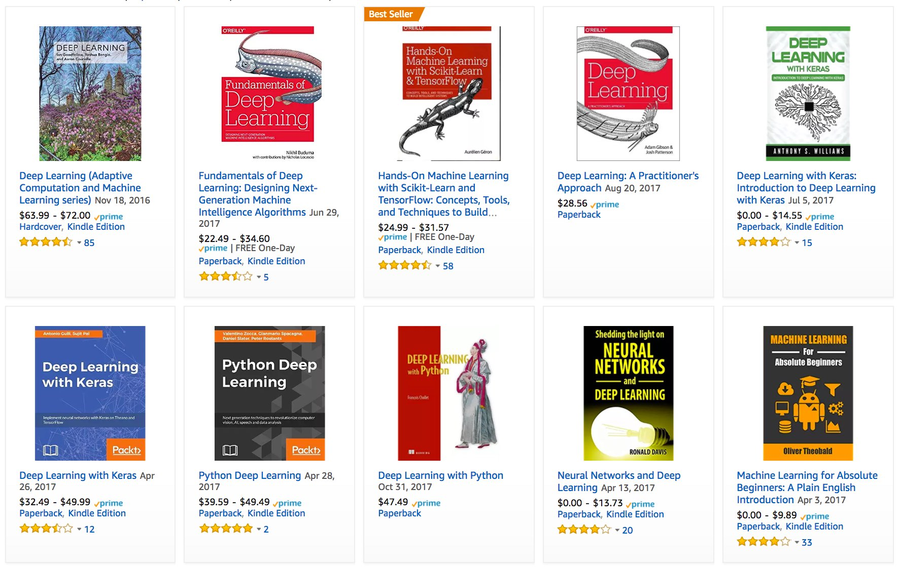
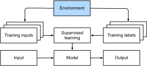
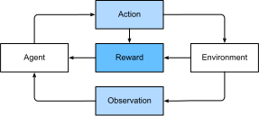

# はじめに
:label:`chap_introduction`

最近まで、私たちが日常的に操作するコンピュータプログラムのほぼすべては、その振る舞いを正確に指定する厳密なルールの集合としてコーディングされていた。例えば、Eコマースプラットフォームを管理するアプリケーションを作成したいとしよう。数時間ホワイトボードを囲んで問題について熟考した後、解決策の全体像として次のようなものに落ち着くかもしれない。(i) ユーザーはWebブラウザやモバイルアプリで動作するインターフェースを通じてアプリケーションとやり取りする。(ii) アプリケーションは商用レベルのデータベースエンジンと連携し、各ユーザーの状態を追跡して過去の取引記録を保持する。(iii) アプリケーションの中枢では、*ビジネスロジック*（いわばアプリケーションの*頭脳*）が、考え得るあらゆる状況を、プログラムが取るべき対応するアクションにマッピングする一連のルールを規定する。

アプリケーションの頭脳を構築するために、プログラムが処理すべき一般的なイベントをすべて列挙するかもしれない。例えば、顧客が商品をショッピングカートに追加するボタンをクリックするたびに、プログラムはショッピングカートのデータベーステーブルにエントリを追加し、そのユーザーのIDとリクエストされた商品のIDを関連付ける。次に、考えられるすべてのコーナーケースを一つずつ確認し、ルールの妥当性をテストして必要な修正を加える試みを行うだろう。ユーザーが空のカートで決済を開始したらどうなるだろうか？ 最初の試みで完全に正しく動作させられる開発者はほとんどいないが（問題を解決するために何度かのテスト実行が必要かもしれない）、基本的には、実際の顧客を見る*前に*このようなプログラムを書き上げ、自信を持って立ち上げることができる。機能する製品やシステムを駆動する自動化システムを手作業で設計する私たちの能力は、しばしば未知の状況においても発揮され、驚異的な認知的偉業である。そして、$100\%$の確率で機能する解決策を考案できるのであれば、通常は機械学習について悩む必要はない。

成長を続ける機械学習の研究者コミュニティにとって幸いなことに、私たちが自動化したいと考えるタスクの多くは、人間の創意工夫に簡単には屈しない。あなたの知る最も優秀な頭脳を持つ人々とホワイトボードを囲んでいると想像してほしい。ただし、今回取り組むのは次のような問題のいずれかである。

* 地理情報、衛星画像、過去の一定期間の天候データを与えられ、明日の天候を予測するプログラムを作成する。
* 自由記述のテキストで表現された事実に基づく質問を受け取り、正確に回答するプログラムを作成する。
* 画像を与えられ、そこに描かれているすべての人物を特定し、それぞれの輪郭を描画するプログラムを作成する。
* ユーザーが気に入りそうだが、通常のブラウジングでは出会いそうにない商品を提示するプログラムを作成する。

これらの問題に対しては、エリートプログラマーでさえゼロから解決策をコーディングするのに苦労するだろう。その理由は様々である。求めるプログラムが時間とともに変化するパターンに従うため、固定された正解が存在しないこともある。そのような場合、成功する解決策は絶え間なく変化する世界に柔軟に適応しなければならない。また、関係性（例えばピクセルと抽象的なカテゴリとの間の関係）が複雑すぎて、数千から数百万回の計算を必要とし、未知の原理に従っている場合もある。画像認識の場合、タスクを実行するために必要な正確な手順は、私たちの意識的な理解を超えている。私たちの無意識な認知プロセスは簡単にタスクを実行しているにもかかわらずである。

*機械学習*（Machine learning）は、経験から学習できるアルゴリズムの研究である。機械学習アルゴリズムは、通常、観測データや環境との相互作用という形で経験を積むにつれて性能が向上する。これを、私たちが構築した決定論的なEコマースプラットフォームと比較してみよう。そのプラットフォームは、どれほど経験が蓄積されても、開発者自身が学習し、ソフトウェアを更新する時期だと判断するまでは、同じビジネスロジックに従い続ける。本書では、機械学習の基礎を教える。特に*ディープラーニング*（Deep learning）に焦点を当てる。ディープラーニングは、コンピュータビジョン、自然言語処理、ヘルスケア、ゲノミクスなどの多様な分野でイノベーションを推進している強力な技術群である。

## 動機付けとなる例

執筆を始める前、この本の著者たちは、労働者の多くがそうであるように、カフェインを摂取しなければならなかった。私たちは車に乗り込み、運転を始めた。AlexはiPhoneを使って「Hey Siri」と呼びかけ、電話の音声認識システムを起動した。次にMuが「Blue Bottle コーヒーショップへの道順」と指示した。電話はすぐに彼のコマンドの書き起こしを表示した。また、私たちが道順を尋ねていることを認識し、リクエストを満たすためにマップアプリケーション（アプリ）を起動した。起動すると、マップアプリは複数のルートを特定した。各ルートの隣には、予測される移動時間が表示された。この話は教育上の便宜のために作られたものだが、スマートフォンとの日常的なやり取りが、わずか数秒の間に複数の機械学習モデルを稼働させる可能性があることを示している。

「Alexa」、「OK Google」、「Hey Siri」などの*ウェイクワード*（wake word）に応答するプログラムを書くことだけを想像してみよう。:numref:`fig_wake_word` に示されているように、コンピュータとコードエディタだけが置かれた部屋で、一人でコーディングを試みてほしい。第一原理からそのようなプログラムをどのように書くのだろうか？ 考えてみてほしい... この問題は困難である。マイクは毎秒およそ44,000のサンプルを収集する。各サンプルは音波の振幅の測定値である。生の音声の短い断片を、その断片にウェイクワードが含まれているかどうかについての確信を持った予測 $\{\textrm{yes}, \textrm{no}\}$ に、高い信頼性でマッピングできるルールとはどのようなものだろうか？ 行き詰まっても、心配する必要はない。私たちも、そのようなプログラムをゼロから書く方法は知らない。だからこそ、機械学習を使用するのである。


:label:`fig_wake_word`

ここにトリックがある。入力を出力にマッピングする方法をコンピュータに明示的に指示する方法がわからなくても、私たち自身はその認知的偉業を実行できることがよくある。言い換えれば、「Alexa」という単語を認識するようにコンピュータをプログラミングする方法を知らなくても、あなた自身はそれを認識できるということだ。この能力を武器に、短い音声断片と関連するラベル（どの断片にウェイクワードが含まれているかを示す）の例を含む巨大な*データセット*（dataset）を収集できる。現在主流となっている機械学習のアプローチでは、ウェイクワードを認識するシステムを*明示的に*設計しようとはしない。代わりに、複数の*パラメータ*（parameters）によって振る舞いが決定される柔軟なプログラムを定義する。そして、選ばれた性能評価指標に関してプログラムの性能を向上させる、考え得る最良のパラメータ値をデータセットを用いて決定する。

パラメータは、回すことでプログラムの振る舞いを操作できるつまみだと考えることができる。パラメータが固定されると、そのプログラムを*モデル*（model）と呼ぶ。パラメータを操作するだけで生成できるすべての異なるプログラム（入力から出力へのマッピング）の集合を、モデルの*クラス*（family）と呼ぶ。そして、データセットを使用してパラメータを選択する「メタプログラム」を*学習アルゴリズム*（learning algorithm）と呼ぶ。

学習アルゴリズムを導入して進める前に、入出力の正確な性質を突き止め、適切なモデルクラスを選択することで、問題を正確に定義しなければならない。この場合、私たちのモデルは音声断片を*入力*として受け取り、$\{\textrm{yes}, \textrm{no}\}$ の中からの選択を*出力*として生成する。すべてが計画通りに進めば、その断片にウェイクワードが含まれているかどうかについてのモデルの推測は概ね正しいものになるだろう。

適切なモデルクラスを選択すれば、モデルが「Alexa」という単語を聞くたびに「yes」を返すような、つまみの設定が一つ存在するはずである。ウェイクワードの正確な選択は任意であるため、おそらく十分な表現力を持つモデルクラスが必要になる。別のつまみの設定により、「Apricot」という単語を聞いたときにだけ「yes」を返すことができるようにするためだ。「Alexa」の認識と「Apricot」の認識は、直感的に似たタスクに思えるため、同じモデルクラスが適していると予想される。ただし、根本的に異なる入出力、例えば画像からキャプションへのマッピングや、英語の文から中国語の文へのマッピングなどを扱いたい場合は、全く異なるモデルクラスが必要になるかもしれない。

ご想像の通り、すべてのつまみをランダムに設定しただけでは、モデルが「Alexa」や「Apricot」、その他の英単語を認識する可能性は低い。機械学習において、*学習*（learning）とは、モデルから望む振る舞いを引き出すための、適切なつまみの設定を発見するプロセスである。言い換えれば、データを使ってモデルを*訓練*（train）する。:numref:`fig_ml_loop` に示すように、訓練プロセスは通常次のようなものになる。

1. 何も有用なことができない、ランダムに初期化されたモデルから始める。
1. データの一部（例えば、音声断片と対応する $\{\textrm{yes}, \textrm{no}\}$ ラベル）を取得する。
1. それらのデータ例で評価された性能が向上するように、モデルのつまみを微調整する。
1. モデルが素晴らしい性能になるまで、ステップ2と3を繰り返す。


:label:`fig_ml_loop`

要約すると、ウェイクワード認識器をコーディングするのではなく、大規模なラベル付きデータセットを提示されれば、ウェイクワードを認識するように*学習*できるプログラムをコーディングする。データセットを提示することでプログラムの振る舞いを決定するこの行為は、*データを用いたプログラミング*（programming with data）と考えることができる。つまり、猫と犬の多数のデータ例を機械学習システムに提供することで、猫検出器を「プログラム」できる。これにより、検出器は最終的に、猫であれば非常に大きな正の数を出力し、犬であれば非常に大きな負の数を出力し、確信が持てない場合はゼロに近い数を出力するように学習する。これは機械学習でできることのほんの一部に過ぎない。後で詳細に説明するディープラーニングは、機械学習の問題を解決するための多くの一般的な手法の中の一つに過ぎない。


## 主要なコンポーネント

ウェイクワードの例では、音声断片と2値のラベルから構成されるデータセットについて説明し、断片から分類へのマッピングを近似するモデルをどのように訓練するかについて大まかに述べた。未知の指定されたラベルを、ラベルが既知のデータ例から構成されるデータセットが与えられた既知の入力に基づいて予測しようとするこのような問題は、*教師あり学習*（supervised learning）と呼ばれる。これは、多くの種類の機械学習の問題の中の一つに過ぎない。他の種類を探求する前に、どのような機械学習の問題に取り組む場合でも常に付きまとういくつかの中核的なコンポーネントに当てはめて、より詳しく説明したい。

1. 学習元となる*データ*（data）。
1. データをどのように変換するかという*モデル*（model）。
1. モデルがどれくらいうまく（あるいは悪く）機能しているかを定量化する*目的関数*（objective function）。
1. 目的関数を最適化するためにモデルのパラメータを調整する*アルゴリズム*（algorithm）。

### データ

データなしにデータサイエンスを行うことはできないのは言うまでもない。データとは正確には*何であるか*を考察することで数百ページを費やすこともできるが、ここでは、私たちが扱うデータセットの重要な性質に焦点を当てる。一般的に、私たちはデータ例の集合を扱う。データを有用に利用するためには、通常、適切な数値表現を考案する必要がある。各*データ例*（example、あるいは*データポイント*（data point）、*データインスタンス*（data instance）、*サンプル*（sample））は、モデルがそれに基づいて予測を行うために使用する、*特徴量*（features、時には*共変量*（covariates）や*入力*（inputs）とも呼ばれる）と呼ばれる属性の集合から構成される。教師あり学習の問題において、私たちの目標は、モデルの入力には含まれない、*ラベル*（label、あるいは*ターゲット*（target））と呼ばれる特別な属性の値を予測することである。

もし画像データを扱う場合、各データ例は個々の写真（特徴量）と、その写真が属するカテゴリを示す数値（ラベル）から構成されるかもしれない。写真は、各ピクセル位置における赤、緑、青の光の明るさを示す数値の3つのグリッドとして数値的に表現される。例えば、$200\times 200$ ピクセルのカラー写真は $200\times200\times3=120000$ 個の数値から構成される。

あるいは、電子カルテデータを扱い、ある患者が今後30日生存する可能性を予測するタスクに取り組むかもしれない。ここで特徴量は、容易に入手可能な属性と頻繁に記録される測定値の集合になり、これには年齢、バイタルサイン、併存疾患、現在の投薬、最近の処置が含まれる。訓練に使用できるラベルは、過去のデータにおいて各患者が30日以内に生存したかどうかを示す2値である。

このような場合、すべてのデータ例が同じ数の数値特徴量によって特徴付けられるとき、入力は固定長のベクトルであると言い、そのベクトルの（一定の）長さをデータの*次元数*（dimensionality）と呼ぶ。ご想像の通り、固定長の入力は便利であり、悩むべき複雑さを一つ減らしてくれる。しかし、すべてのデータを*固定長*ベクトルの形で簡単に表現できるわけではない。顕微鏡画像は標準的な機器から得られることを期待できるが、インターネットからマイニングした画像すべてが同じ解像度や形状を持っているとは期待できない。画像については、標準サイズへの切り抜きを検討するかもしれないが、その戦略には限界がある。切り抜かれた部分の情報を失うリスクがあるからだ。さらに、テキストデータは、固定長表現に対してより頑強に抵抗する。Amazon、IMDb、TripAdvisorなどのEコマースサイトに残されたカスタマーレビューを考えてみよう。「ひどい！」という短文のものもあれば、何ページにもわたって長々と書かれているものもある。従来の手法と比較したディープラーニングの大きな利点の一つは、現代のモデルが*可変長*のデータを比較的優雅に処理できることである。

一般的に、私たちが持つデータが多ければ多いほど、仕事は簡単になる。データが多ければ、より強力なモデルを訓練でき、既存の仮定に頼る割合を減らすことができる。（比較的小さな）データからビッグデータへの時代（regime）の変化は、現代のディープラーニングの成功の大きな要因である。この点を徹底させるために言えば、ディープラーニングにおいて最も魅力的なモデルの多くは、大規模なデータセットなしには機能しない。小規模なデータの時代で機能するモデルもあるかもしれないが、それらは従来の手法よりも優れているわけではない。

最後に、大量のデータがあり、それを巧みに処理するだけでは十分ではない。私たちは*正しい*（right）データを必要としている。データにエラーが多かったり、選択された特徴量が興味のあるターゲットの数値を予測できなければ、学習は失敗するだろう。この状況は「*garbage in, garbage out*（ごみを入れたら、ごみが出てくる）」という決まり文句でよく言い表される。さらに、予測性能の低さだけが潜在的な結果ではない。予測的取り締まり、履歴書のスクリーニング、融資に使用されるリスクモデルなど、機械学習の機密性の高いアプリケーションでは、ごみデータがもたらす結果に特に警戒しなければならない。よく発生する障害モードの一つは、特定のグループの人々が訓練データに表現されていないデータセットに関するものである。黒い肌を見たことがない皮膚がん認識システムを適用する場合を想像してほしい。データが一部のグループを過小評価しているだけでなく、社会的な偏見を反映している場合にも失敗が発生する。例えば、過去の採用決定を用いて履歴書をスクリーニングするための予測モデルを訓練すると、機械学習モデルは意図せずして歴史的な不平等を捉え、自動化してしまう可能性がある。データサイエンティストが積極的に共謀したり、あるいは認識したりしていなくても、これらすべてが起こり得ることに注意してほしい。

### モデル

ほとんどの機械学習は、ある意味でデータを変換すること（transforming）を伴う。写真を取り込み、笑顔度を予測するシステムを構築したいと考えるかもしれない。あるいは、一連のセンサーの読み取り値を取り込み、その読み取り値が正常か異常かを予測したいと考えるかもしれない。私たちが言う*モデル*（model）とは、ある種類のデータを取り込み、おそらく異なる種類の予測を出力する計算メカニズムを指す。特に、データから推定可能な*統計モデル*（statistical models）に関心がある。単純なモデルは、適切な単純な問題に完全に対処できる能力を持っているが、私たちが本書で焦点を当てる問題は、古典的な手法の限界を広げるものである。ディープラーニングが古典的なアプローチと区別される主な理由は、それが焦点を当てる強力なモデルの集合にある。これらのモデルは、データを連続的に（successive）何度も変換し、それらを上から下へと連鎖（chain）させたものであり、それが*ディープラーニング*（Deep learning, 深層学習）の名前の由来となっている。深いモデルについて議論する過程で、より伝統的な手法についても議論する。

### 目的関数

前述のように、機械学習を経験からの学習として紹介した。ここにおける*学習*とは、あるタスクにおいて時間をかけて改善していくことを意味する。しかし、何が改善を構成するかは誰が言うのだろうか？ モデルを更新する提案を我々が行い、その提案が改善を構成するかどうかについて反対する人がいるかもしれないと想像できるだろう。

学習マシンの正式な数学的システムを開発するためには、私たちのモデルがどれだけ優れているか（あるいは悪いか）についての正式な尺度を持つ必要がある。機械学習において、さらに一般的には最適化において、これらを*目的関数*（objective functions）と呼ぶ。慣習により、目的関数は通常、低い値であるほど良いものとして定義される。これは単なる慣習に過ぎない。高い値ほど良い関数であっても、符号を反転させることで、定性的には完全に同一であるが低い値ほど良い新しい関数に変換できる。低い値が良いとして私たちが選択するため、これらの関数は*損失関数*（loss functions）と呼ばれることがある。

数値を予測しようとする場合、最も一般的な損失関数は*二乗誤差*（squared error）である。すなわち、予測と正解ターゲット（ground truth target）の差の二乗である。分類において最も一般的な目的は、誤り率（error rate）、つまり私たちの予測が正解と一致しないデータ例の割合を最小化することである。一部の目的（例えば、二乗誤差）は簡単に最適化できるが、他の目的（例えば、誤り率）は、微分不可能であるか、または他の複雑な理由から直接最適化することが困難である。このような場合、代わりに*代替目的*（surrogate objective）を最適化することが一般的である。

最適化の最中、私たちは損失をモデルのパラメータの関数と考え、訓練データセットを定数として扱う。訓練のために収集されたいくつかのデータ例からなる集合上で生じる損失を最小化することで、私たちのモデルのパラメータの最適な値を学習する。しかし、訓練データでうまく機能しても、未知のデータでうまく機能するとは限らない。そのため、利用可能なデータを通常2つのパーティションに分割したいと考えるだろう。すなわち、モデルのパラメータを学習するための*訓練データセット*（training dataset または *訓練セット* training set）と、評価のために確保される*テストデータセット*（test dataset または *テストセット* test set）である。最終的に、私たちは通常、両方のパーティションにおけるモデルのパフォーマンスを報告する。訓練のパフォーマンスは、学生が実際の最終試験の準備に使用する模擬試験で達成した点数に例えることができる。結果が励みになるものであっても、それが最終試験での成功を保証するものではない。学習の過程で、学生は模擬問題の暗記を始め、そのトピックを習得しているように見えても、実際の最終試験で未知の問題に直面するとつまずくかもしれない。モデルが訓練セットではうまく機能するが、未知のデータに一般化できない場合、訓練データに*過学習*（overfitting）していると言う。

### 最適化アルゴリズム

データソースと表現、モデル、そして明確に定義された目的関数が揃えば、損失関数を最小化するための可能な限り最良のパラメータを探索できるアルゴリズムが必要になる。ディープラーニングで一般的な最適化アルゴリズムは、*勾配降下法*（gradient descent）と呼ばれるアプローチに基づいている。手短に言えば、各ステップにおいて、この手法は各パラメータについて、そのパラメータをほんのわずかだけ摂動（perturb）させた場合に訓練セットの損失がどのように変化するかを確認する。そして、損失を下げる方向にパラメータを更新する。


## 機械学習の問題の種類

動機付けの例で挙げたウェイクワードの問題は、機械学習が対処できる多くの問題の中の一つに過ぎない。読者の関心をさらに高め、本書を通じて使われる共通の言語を提供するために、ここで機械学習の問題の全体像について幅広く概観する。

### 教師あり学習

教師あり学習（Supervised learning）は、特徴量とラベルの両方を含むデータセットが与えられ、入力特徴量が与えられたときにラベルを予測するモデルを作成することを求められるタスクを指す。各「特徴量-ラベル」のペアはデータ例（example）と呼ばれる。文脈が明らかな場合、対応するラベルが未知であっても、入力の集合を指して*データ例*という用語を使用することがある。パラメータを選択するために、私たち（教師 / supervisors）がラベル付きデータ例からなるデータセットをモデルに提供するため、教師（supervision）の概念が登場する。確率論的な用語で言えば、私たちは通常、入力特徴量が与えられたときのラベルの条件付き確率を推定することに関心がある。これはいくつかのパラダイムの中の一つに過ぎないが、教師あり学習は、産業界における機械学習の成功事例の大部分を占めている。その理由の一つは、多くの重要なタスクが、特定の利用可能なデータの集合が与えられたときに、未知の何かの確率を推定することとして明確に記述できるからである。：

* CT（コンピュータ断層撮影）画像が与えられ、がんか否かを予測する。
* 英語の文が与えられ、フランス語の正しい翻訳を予測する。
* 今月の財務報告データに基づき、来月の株価を予測する。

すべての教師あり学習の問題は「入力特徴量が与えられたときにラベルを予測する」という単純な説明で捉えられるが、教師あり学習自体は多様な形態をとり得り、（他の考慮事項に加えて）入出力の種類、サイズ、および量に応じて大量のモデル化の決定を必要とする。例えば、任意の長さのシーケンスを処理する場合と固定長のベクトル表現を処理する場合では異なるモデルを使用する。本書を通じて、これらの問題の多くについて深く掘り下げていく。

非公式には、学習プロセスは次のようなものである。まず、特徴量が既知の巨大なデータ例の集合を用意し、そこからランダムな部分集合を選択して、それぞれについて正解ラベルを取得する。これらのラベルは、すでに収集された利用可能なデータ（例えば、患者が翌年以内に死亡したか？など）であることもあれば、データをラベル付けするために人間のアノテーターを雇用する必要がある場合（例えば、画像をカテゴリに割り当てるなど）もある。これらの入力と対応するラベルが一緒になって、訓練セットを構成する。訓練データセットを教師あり学習アルゴリズムに入力する。このアルゴリズムは、データセットを入力として受け取り、別の関数、すなわち学習済みモデルを出力する関数である。最後に、これまで見たことのない入力を学習済みモデルに与え、その出力を対応するラベルの予測として使用できる。全体のプロセスを :numref:`fig_supervised_learning` に示す。


:label:`fig_supervised_learning`

#### 回帰

おそらく、最も理解しやすい教師あり学習のタスクは*回帰*（regression）である。例えば、住宅販売のデータベースから収集したデータの集合を考えてみよう。各行が異なる住宅に対応し、各列が住宅の面積（平方フィート）、寝室の数、バスルームの数、町の中心部までの徒歩分数などの関連する属性に対応する表を構築するかもしれない。このデータセットにおいて、各データ例は特定の住宅であり、対応する特徴量ベクトルは表の中の1行となる。もしあなたがニューヨークやサンフランシスコに住んでいて、Amazon、Google、Microsoft、またはFacebookのCEOではない場合、あなたの家の（面積、寝室数、バスルーム数、徒歩分数）という特徴量ベクトルは $[600, 1, 1, 60]$ のようになるかもしれない。しかし、もしピッツバーグに住んでいるなら、それは $[3000, 4, 3, 10]$ のようになるかもしれない。このような固定長の特徴量ベクトルは、ほとんどの古典的な機械学習アルゴリズムにとって不可欠である。

ある問題を回帰にするものは、実際にはターゲットの形式である。あなたが新しい家を探しているとしよう。上記のような特徴量が与えられたときに、家の公正な市場価値を推定したいと考えるかもしれない。ここでのデータは過去の住宅物件情報から構成され、ラベルは観測された販売価格になるかもしれない。ラベルが（ある区間内であっても）任意の数値をとるとき、私たちはこれを*回帰*（regression）問題と呼ぶ。目標は、実際のラベル値に密接に近似する予測を出力するモデルを構築することである。

多くの実用的な問題は、回帰問題として簡単に記述できる。ユーザーが映画につける評価（レーティング）を予測することは回帰問題と考えられ、もし2009年にこの偉業を達成する素晴らしいアルゴリズムを設計していれば、[100万ドルのNetflix賞金](https://en.wikipedia.org/wiki/Netflix_Prize)を獲得していたかもしれない。患者の入院期間の予測も回帰問題である。経験則として、*「どれくらい（how much?）」* や *「いくつ（how many?）」* を問う問題は、おそらく回帰である。例えば：
* この手術は何時間かかるだろうか？
* 今後6時間でこの町にはどれくらいの雨が降るだろうか？

たとえこれまで機械学習に取り組んだことがなくても、おそらく非公式に回帰問題に取り組んだことがあるだろう。例えば、ご自宅の排水管を修理してもらい、業者が下水管から泥を取り除くのに3時間かかったと想像してほしい。その後、350ドルの請求書が送られてきた。ここで、あなたの友人が同じ業者を2時間雇い、250ドルの請求書を受け取ったと想像してほしい。その後、知り合いから今後の泥除去の請求額はどれくらいになるかと聞かれたら、例えば、労働時間が長いほど料金が高くなるなどの合理的な仮定を立てるかもしれない。また、基本料金があり、業者がそこから時間単位で請求していると仮定するかもしれない。これらの仮定が当てはまるのであれば、これら2つのデータ例が与えられれば、業者の料金体系、すなわち1時間あたり100ドルに、家を訪問するための基本料金50ドルを加えた料金体系を特定できる。ここまで理解できたのなら、*線形*回帰の背後にある大まかなアイデアをすでに理解しているということである。

この場合、業者の価格と完全に一致するパラメータを算出できた。場合によっては、例えば、変動の一部が2つの特徴量以外の要因から生じている場合など、これが不可能なこともある。このような場合、予測値と観測値の間の距離を最小化するモデルを学習しようとする。本書の大部分の章では、二乗誤差損失関数の最小化に焦点を当てる。後でわかるように、この損失はデータがガウスノイズによって破損されているという仮定に対応している。

#### 分類

回帰モデルは*「いくつ（how many?）」* の質問に対処するのに優れているが、多くの問題はこのテンプレートにうまく収まらない。例えば、モバイルアプリの小切手スキャン機能を開発したいと考えている銀行を考えてみよう。理想的には、顧客が小切手の写真を撮影するだけで、アプリが画像からテキストを自動的に認識するだろう。それぞれの手書き文字に対応する画像のパッチを切り出すある程度の能力があるとした場合、残された主要なタスクは、既知の集合の中で、それぞれの画像パッチにどの文字が描かれているかを決定することになる。このような*「どれ（which one?）」* を問う問題は*分類*（classification）と呼ばれ、多くの技術が引き継がれるものの、回帰で使用されるものとは異なるツール群を必要とする。

*分類*では、モデルが特徴量（例えば画像のピクセル値）を見て、ある離散的な選択肢の集合の中で、データ例がどの*カテゴリ*（category、あるいは*クラス* class とも呼ばれる）に属するかを予測することを求める。手書き数字の場合、0から9までの数字に対応する10個のクラスがあるかもしれない。分類の最も単純な形態は、2つのクラスしかない場合であり、この問題を私たちは*2値分類*（binary classification）と呼ぶ。例えば、データセットが動物の画像で構成され、ラベルが $\textrm{\{cat, dog\}}$ というクラスである場合などだ。回帰では数値をを出力する回帰器（regressor）を求めたが、分類では出力を予測されるクラスへの割り当てとする分類器（classifier）を求める。

本書が技術的になるにつれて説明する理由から、「猫」か「犬」かといった*確固たる*（firm）カテゴリへの割り当てしか出力できないモデルを最適化することは困難な場合がある。このような場合、モデルを確率の言語で表現する方がはるかに簡単であることが多い。データ例の特徴量が与えられたとき、私たちのモデルはそれぞれの可能なクラスに確率を割り当てる。クラスが $\textrm{\{cat, dog\}}$ である動物分類の例に戻ると、分類器は画像を見て、その画像が猫である確率を0.9と出力するかもしれない。この数字は、分類器がその画像には猫が描かれていると 90\% の確信を持っていると解釈できる。予測されたクラスの確率の大きさは、不確実性の概念を伝える。利用できる概念はこれだけではなく、より高度なトピックを扱う章で他の概念についても議論する。

可能なクラスが3つ以上ある場合、その問題を*多クラス分類*（multiclass classification）と呼ぶ。一般的な例としては、手書き文字認識 $\textrm{\{0, 1, 2, ... 9, a, b, c, ...\}}$ が挙げられる。回帰問題には二乗誤差損失関数を最小化することで取り組んだが、


分類問題における一般的な損失関数は*交差エントロピー*（cross-entropy）と呼ばれ、後の章で情報理論を紹介する際にその名前の謎が解き明かされるだろう。

最も可能性の高いクラスが、必ずしも意思決定に使用するクラスとは限らないことに注意してほしい。:numref:`fig_death_cap` に示すように、裏庭で美しいキノコを見つけたと仮定しよう。


:width:`200px`
:label:`fig_death_cap`

さて、分類器を構築し、写真に基づいてキノコに毒があるかどうかを予測するように訓練したと仮定する。この毒検出分類器が、:numref:`fig_death_cap` に死の帽子（タマゴテングタケ）が写っている確率を0.2と出力したとしよう。言い換えれば、分類器はこのキノコがタマゴテングタケではないと 80\% の確信を持っているということだ。それでも、それを食べるのは愚か者だけだろう。なぜなら、美味しい夕食という確実な利益は、20\% の確率で死に至るリスクに見合うものではないからだ。換言すれば、不確実なリスクの影響が利益をはるかに上回っている。したがって、このキノコを食べるかどうかを決定するためには、想定される結果とそれぞれに関連する損益の両方に依存する、各行動に関連する予測される損害を計算する必要がある。この場合、キノコを食べることで生じる損害は $0.2 \times \infty + 0.8 \times 0 = \infty$ になるかもしれないが、キノコを捨てることの損失は $0.2 \times 0 + 0.8 \times 1 = 0.8$ である。私たちの警戒は正当化された。菌類学者なら誰でも言うように、:numref:`fig_death_cap` のキノコは実際にはタマゴテングタケである。

分類は、2値分類や多クラス分類よりもはるかに複雑になることがある。例えば、階層的に構造化されたクラスに対処する分類のバリエーションがいくつかある。そのような場合、すべてのエラーが等しいわけではない。もし間違えなければならないのであれば、遠いクラスよりも関連するクラスに誤分類することを好むかもしれない。通常、これは*階層的分類*（hierarchical classification）と呼ばれる。ヒントとして、動物相を階層構造に整理した[リンネ](https://ja.wikipedia.org/wiki/%E3%82%AB%E3%83%BC%E3%83%AB%E3%83%BB%E3%83%95%E3%82%A9%E3%83%B3%E3%83%BB%E3%83%AA%E3%83%B3%E3%83%8D)を思い浮かべるとよいだろう。

動物の分類の場合、プードルをシュナウザーと間違えるのはそれほど悪くないかもしれないが、プードルを恐竜と混同した場合、私たちのモデルは莫大なペナルティを支払うことになるだろう。どの階層が関連するかは、モデルをどのように使用する予定かによって異なる場合がある。例えば、ガラガラヘビとガータースネークは系統樹上で近いかもしれないが、ガラガラヘビをガータースネークと間違えることは致命的な結果を招く可能性がある。

#### タグ付け

一部の分類問題は、2値分類や多クラス分類の設定にきれいに収まる。例えば、一般的な2値分類器を訓練して、猫と犬を区別することができる。コンピュータビジョンの現状を考慮すれば、既製のツールを使ってこれを簡単に行うことができる。それにもかかわらず、私たちのモデルがどれほど正確になっても、分類器が、4匹の動物が登場する有名なドイツの童話*ブレーメンの音楽隊*の画像（:numref:`fig_stackedanimals`）に遭遇したときにトラブルに陥るかもしれない。


:width:`300px`
:label:`fig_stackedanimals`

ご覧の通り、この写真には猫、雄鶏、犬、ロバが映っており、背景にはいくつかの木がある。もしこのような画像に遭遇することが予想されるのであれば、多クラス分類は適切な問題の定式化ではないかもしれない。代わりに、画像には猫、犬、ロバ、*そして*雄鶏が描かれていると言う選択肢をモデルに与えたいと考えるかもしれない。

互いに排他的ではないクラスを予測するように学習する問題は、*マルチラベル分類*（multi-label classification）と呼ばれる。自動タグ付けの問題は通常、マルチラベル分類の観点から説明するのが最も適切である。テクノロジーブログの投稿に人々が適用するかもしれないタグ、例えば「機械学習」、「テクノロジー」、「ガジェット」、「プログラミング言語」、「Linux」、「クラウドコンピューティング」、「AWS」について考えてみよう。一般的な記事には5〜10個のタグが適用されるかもしれない。通常、タグはいくらかの相関構造を示す。「クラウドコンピューティング」に関する投稿は「AWS」に言及する可能性が高く、「機械学習」に関する投稿は「GPU」に言及する可能性が高い。

時には、このようなタグ付け問題は膨大なラベル集合に依存することがある。国立医学図書館（The National Library of Medicine）は、PubMedでインデックス付けされる各記事を、Medical Subject Headings（MeSH）オントロジー（約28,000のタグの集合）から抽出されたタグの集合と関連付ける多くの専門アノテーターを雇用している。記事に正しくタグ付けすることは、研究者が文献の網羅的なレビューを行うことを可能にするため重要である。これは時間がかかるプロセスであり、通常、アーカイブ化とタグ付けの間には1年間の遅れがある。機械学習は、各記事が適切な手動レビューを受けるまでの間、暫定的なタグを提供できる。実際、BioASQという組織は数年間にわたり、このタスクのための[コンペティションを開催](http://bioasq.org/)してきた。

#### 検索

情報検索の分野では、アイテムの集合に対してランク（順位）を課すことがよくある。ウェブ検索を例にとってみよう。目標は、特定のページが検索クエリに関連しているか*どうか*を判断することではなく、むしろ、関連する結果の集合の中で、どれを特定のユーザーに最も目立つように表示するかを決定することである。これを行う1つの方法は、まず集合内のすべての要素にスコアを割り当て、次に最高評価の要素を取得することである。Google検索エンジンの背後にあるオリジナルの秘伝のソースである[PageRank](https://ja.wikipedia.org/wiki/PageRank)は、このようなスコアリングシステムの初期の例であった。奇妙なことに、PageRankが提供するスコアリングは実際のクエリには依存していなかった。代わりに、単純な関連性フィルターに依存して関連する候補の集合を特定し、その後PageRankを使用してより権威のあるページを優先順位付けしていた。今日では、検索エンジンは機械学習や行動モデルを使用して、クエリに依存する関連性スコアを取得している。このテーマに特化した学術会議さえ存在する。

#### 推薦システム
:label:`subsec_recommender_systems`

推薦システム（Recommender systems）は、検索やランキングに関連するもう一つの問題設定である。ユーザーに関連するアイテムの集合を表示するという目標という点では、これらの問題は似ている。主な違いは、推薦システムの文脈においては特定のユーザーへの*パーソナライズ*（personalization）が強調されることである。例えば、映画の推薦において、SFファンのための結果ページと、ピーター・セラーズのコメディ愛好家のための結果ページは大きく異なるかもしれない。小売商品、音楽、ニュースの推薦など、他の推薦設定でも同様の問題が発生する。

顧客が明示的なフィードバックを提供し、彼らが特定の製品をどれくらい気に入ったかを伝えることがある（例えば、Amazon、IMDb、Goodreadsでの製品評価やレビューなど）。一方で、プレイリストのタイトルをスキップするなど暗黙のフィードバックを提供することもあり、これは不満を示しているか、あるいは単にその曲が状況に不適切であったことを示しているだけかもしれない。最も単純な定式化では、これらのシステムは、期待される星評価や、特定のユーザーがあるアイテムを購入する確率といった、何らかのスコアを推定するように訓練される。

そのようなモデルが与えられれば、任意のユーザーに対して、最大のスコアを持つオブジェクトの集合を取得でき、それをそのユーザーに推薦できる。本番環境（プロダクション）のシステムははるかに高度であり、そのようなスコアを計算する際に、ユーザーの詳細なアクティビティやアイテムの特性を考慮に入れている。:numref:`fig_deeplearning_amazon` は、アストンの好みを捉えるように調整されたパーソナライズアルゴリズムに基づいて、Amazonから推薦されたディープラーニング専門書を表示している。


:label:`fig_deeplearning_amazon`

予測モデルの上に素朴に構築された推薦システムは、その莫大な経済的価値にもかかわらず、深刻な概念上の欠陥を抱えている。まず第一に、私たちは*打ち切りフィードバック*（censored feedback）しか観測できない。ユーザーは、強い感情を抱いた映画を優先的に評価する。例えば、5段階評価において、アイテムが1つ星や5つ星の評価を多く受ける一方で、3つ星の評価が著しく少ないことに気付くかもしれない。さらに、現在の購買習慣は、現在導入されている推薦アルゴリズムの結果であることが多いが、学習アルゴリズムは必ずしもこの詳細を考慮に入れているわけではない。したがって、推薦システムが特定のアイテムを優先的にプッシュし、それが（購入数の多さから）より良いものと見なされ、その結果さらに頻繁に推薦されるというフィードバックループが形成される可能性がある。これら多くの問題、すなわち打ち切り、インセンティブ、およびフィードバックループにどのように対処するかは、重要な未解決の研究課題である。

#### シーケンス学習

ここまで、一定数の入力があり、一定数の出力を生成する問題を見てきた。例えば、面積、寝室数、バスルーム数、繁華街までの移動時間という固定された特徴量の集合から住宅価格を予測することを検討した。また、固定次元の画像から、それが一定数のクラスのそれぞれに属する予測確率へのマッピングや、ユーザーIDと製品IDのみに基づいて購入に関連する星評価を予測することについても議論した。これらの場合、モデルが訓練された後、各テスト例がモデルに入力されると、それはすぐに忘れられる。連続する観測は独立していると仮定し、したがってこの文脈を保持する必要はないと考えた。

しかし、ビデオの断片にはどのように対処すべきだろうか？ この場合、各断片は異なる数のフレームから構成されるかもしれない。そして、前後のフレームを考慮すれば、各フレームで何が起こっているかの予測はもっと強力になるかもしれない。言語についても同じことが言える。例えば、ディープラーニングで人気のある問題の一つに機械翻訳がある。あるソース言語の文を取り込み、別の言語での翻訳結果を予測するタスクである。

このような問題は医療においても発生する。集中治療室の患者を監視し、今後24時間以内に死亡するリスクがある閾値を超えた場合に警告を発するモデルが欲しいと考えるかもしれない。ここでは、患者の履歴について知っていることすべてを1時間ごとに捨ててしまうことはしない。なぜなら最新の測定値のみに基づいて予測を立てたくないからだ。

このような疑問は、機械学習の最も魅力的な応用分野の1つであり、これらは*シーケンス学習*（sequence learning）の事例である。これらのモデルは、入力のシーケンスを取り込むか、出力のシーケンスを生成する（あるいはその両方）のいずれかを行う必要がある。具体的には、*シーケンス・ツー・シーケンス学習*（sequence-to-sequence learning）は、入出力の両方が可変長のシーケンスから構成される問題を考慮する。例としては、機械翻訳や音声からテキストへの書き起こしなどがある。すべての種類のシーケンス変換を考慮することは不可能だが、以下の特別なケースは言及する価値がある。

**タグ付けとパース**。これは、テキストシーケンスに属性で注釈を付けることを含む。ここでは、入出力は*整列*（aligned）している。つまり、数が同じであり、対応する順序で発生する。例えば、*品詞（PoS）タグ付け*では、文中のすべての単語に対応する品詞、すなわち「名詞」や「直接目的語」などを注釈する。あるいは、隣接するどの単語のグループが*人*、*場所*、または*組織*のような固有表現を指しているかを知りたいかもしれない。下の漫画のように単純な例では、文中のいずれかの単語が固有表現（「Ent」としてタグ付け）の一部であるかどうかだけを示したいかもしれない。

```text
Tom has dinner in Washington with Sally
Ent  -    -    -     Ent      -    Ent
```

**自動音声認識**。音声認識では、入力シーケンスは話者の録音音声（:numref:`fig_speech`）であり、出力は話者が言ったことの書き起こしである。課題は、テキストよりもはるかに多くのオーディオフレーム（通常、音声は8kHzまたは16kHzでサンプリングされる）が存在することである。つまり、数千のサンプルが単一の発話された単語に対応する可能性があるため、音声とテキストの間に1：1の対応関係はない。これらは出力が入力よりもはるかに短いシーケンス・ツー・シーケンス学習の問題である。


人間は低品質の音声からでも音声を認識することに驚くほど優れているが、コンピュータに同じ離れ業を実行させることは手ごわい課題である。


:width:`700px`
:label:`fig_speech`

**音声合成**（Text to Speech）。これは自動音声認識の逆である。ここでは、入力がテキストであり、出力がオーディオファイルである。この場合、出力は入力よりもはるかに長くなる。

**機械翻訳**。対応する入出力が同じ順序で発生する音声認識の場合とは異なり、機械翻訳では、整列されていない（unaligned）データが新たな課題をもたらす。ここでは、入出力のシーケンスの長さが異なる可能性があり、それぞれのシーケンスの対応する領域が異なる順序で現れる可能性がある。動詞を文末に置くというドイツ語の独特な傾向を示す、以下のわかりやすい例を考えてみよう。

```text
ドイツ語:         Haben Sie sich schon dieses grossartige Lehrwerk angeschaut?
英語:             Have you already looked at this excellent textbook?
誤った対応付け:   Have you yourself already this excellent textbook looked at?
```

他の学習タスクでも多くの関連する問題が発生する。例えば、ユーザーがウェブページを読む順序を決定することは、2次元のレイアウト解析問題である。対話問題はあらゆる種類のさらなる複雑さを示し、次に何を言うべきかを決定するには、現実世界の知識と、長い時間的距離にわたる会話の過去の状態を考慮する必要がある。そのようなトピックは活発な研究分野である。

### 教師なし学習と自己教師あり学習

これまでの例は教師あり学習に焦点を当てており、ここでは特徴量と対応するラベル値の両方を含む巨大なデータセットをモデルに与えた。教師あり学習器は、極めて専門化された仕事と、極めて独裁的な上司を持っていると考えることができる。上司は学習器の肩越しに立ち、彼らが状況から行動へのマッピングを学習するまで、あらゆる状況で正確に何をすべきかを彼らに指示する。そのような上司の下で働くのはかなり退屈に聞こえる。一方で、そのような上司を満足させるのは非常に簡単である。可能な限り早くパターンを認識し、上司の行動を模倣すればよいだけだ。

反対の状況を考えてみると、あなたに何をしてほしいのか全くわかっていない上司の下で働くのはイライラするかもしれない。しかし、もしあなたがデータサイエンティストを目指しているなら、それに慣れた方がよい。上司は巨大なデータのダンプを渡して、「*それでデータサイエンスをしてくれ！*」とだけ言うかもしれない。曖昧に聞こえるが、それは実際に曖昧だからだ。このクラスの問題を私たちは*教師なし学習*（unsupervised learning）と呼び、私たちが尋ねることができる質問の種類と数は、私たちの創造性によってのみ制限される。後の章で教師なし学習の手法について取り上げる。ここでは食欲をそそるために、あなたが尋ねるかもしれない次のようないくつかの質問について説明する。

* データを正確に要約する少数のプロトタイプを見つけることができるだろうか？ 写真の集合が与えられたとき、それらを風景写真、犬、赤ちゃん、猫、山頂の写真にグループ化できるだろうか？ 同様に、ユーザーのブラウジングアクティビティの集合が与えられたとき、それらを類似した行動を持つユーザーにグループ化できるだろうか？ この問題は一般的に*クラスタリング*（clustering）として知られている。
* データの関連する特性を正確に捉える少数のパラメータを見つけることができるだろうか？ ボールの軌道は、ボールの速度、直径、質量によってうまく表現される。仕立屋は、服を合わせる目的で、人間の体型をかなり正確に表現する少数のパラメータを開発した。これらの問題は*部分空間推定*（subspace estimation）と呼ばれる。依存関係が線形である場合、それは*主成分分析*（principal component analysis）と呼ばれる。
* 象徴的な特性がうまく適合するように、ユークリッド空間における（任意に構造化された）オブジェクトの表現は存在するだろうか？ これは、「ローマ」$-$「イタリア」$+$「フランス」$=$「パリ」のように、エンティティとその関係を記述するために使用できる。
* 私たちが観察するデータの多くについて、根本的な原因の記述は存在するだろうか？ 例えば、住宅価格、汚染、犯罪、立地、教育、給与に関する人口統計データがある場合、単に経験的データに基づいてそれらがどのように関連しているかを発見できるだろうか？ *因果関係*（causality）や*確率的グラフィカルモデル*（probabilistic graphical models）に関わる分野は、そのような問題に取り組んでいる。
* 教師なし学習におけるもう一つの重要で刺激的な最近の進展は、*深層生成モデル*（deep generative models）の出現である。これらのモデルは、データの密度を明示的または*暗黙的*に推定する。訓練が終われば、生成モデルを使用して、データ例がどれくらい起こり得るかに従ってスコアリングしたり、学習された分布から合成データをサンプリング（生成）したりできる。生成モデリングにおける初期のディープラーニングのブレークスルーは、*変分オートエンコーダ*（variational autoencoders）:cite:`Kingma.Welling.2014,rezende2014stochastic` の発明によってもたらされ、*敵対的生成ネットワーク*（generative adversarial networks, GAN）:cite:`Goodfellow.Pouget-Abadie.Mirza.ea.2014` の開発へと続いた。さらに最近の進歩には、正規化フロー（normalizing flows）:cite:`dinh2014nice,dinh2017density` や拡散モデル（diffusion models）:cite:`sohl2015deep,song2019generative,ho2020denoising,song2021score` などがある。

教師なし学習におけるさらなる進展は、ラベルなしデータの何らかの側面を利用して教師（supervision）を提供する技術である*自己教師あり学習*（self-supervised learning）の台頭である。テキストの場合、ラベル付けの労力を一切かけずに、大規模コーパスにおいて周囲の単語（文脈）を使用して、ランダムにマスクされた単語を予測することにより、「空白を埋める」ようにモデルを訓練できる :cite:`Devlin.Chang.Lee.ea.2018`! 画像の場合、同じ画像の2つの切り抜かれた領域の間の相対位置を見分けるようにモデルを訓練したり :cite:`Doersch.Gupta.Efros.2015`、画像の残りの部分に基づいて隠された部分を予測したり、2つのデータ例が同じ元の画像の摂動されたバージョンであるかどうかを予測したりできる。自己教師ありモデルはしばしば表現を学習し、その結果得られたモデルを興味のある下流のタスクでファインチューニング（微調整）することによって、その表現がその後活用される。

### 環境との相互作用

ここまで、データが実際にどこから来るのか、あるいは機械学習モデルが出力を生成したときに実際に何が起こるのかについては議論してこなかった。それは、教師あり学習と教師なし学習がこれらの問題にあまり洗練された方法で対処していないためである。どちらの場合も、最初に大量のデータを確保し、その後環境と再びやり取りすることなくパターン認識マシンの動作を開始する。すべての学習がアルゴリズムが環境から切り離された後に行われるため、これは*オフライン学習*（offline learning）と呼ばれることがある。例えば、教師あり学習は :numref:`fig_data_collection` に描かれているような単純な相互作用のパターンを前提としている。


:label:`fig_data_collection`

このオフライン学習の単純さには魅力がある。利点は、動的な環境との相互作用から生じる複雑さを気にすることなく、世界から切り離された状態でパターン認識について悩むことができることである。しかし、この問題の定式化には限界がある。もしあなたがアシモフのロボット小説を読んで育ったなら、単に予測を行うだけでなく、世界で行動を起こすことができる人工的なインテリジェント・エージェントを想像するだろう。私たちは単なる予測モデルではなく、インテリジェントな*エージェント*（agents）について考えたい。これは、予測を行うだけでなく、*行動*（actions）の選択について考える必要があることを意味する。単なる予測とは対照的に、行動は実際に環境に影響を与える。もし私たちがインテリジェント・エージェントを訓練したいのであれば、その行動がエージェントの将来の観測にどのような影響を与えるかを考慮しなければならず、したがってオフライン学習は不適切である。

環境との相互作用を考慮すると、全く新しい一連のモデリングの疑問が開かれる。以下はほんの一例である。
* 環境は私たちが過去にしたことを覚えているか？
* 環境は私たちを助けたいと思っているか？（例：音声認識器にテキストを読み上げるユーザー）
* 環境は私たちを打ち負かしたいと思っているか？（例：スパムフィルターを回避するためにメールを適応させるスパマー）
* 環境には変化するダイナミクスがあるか？ 例えば、将来のデータは常に過去に似ているのか、それともパターンが時間の経過とともに、自然にあるいは私たちの自動化ツールに反応して変化するのか？

これらの疑問は、訓練データとテストデータが異なる*分布シフト*（distribution shift）という問題を提起する。私たちの多くが遭遇したことがあるであろうその一例は、宿題がティーチングアシスタントによって作成された一方で、講師が作成した試験を受ける場合である。次に、エージェントが環境と相互作用する学習問題を提示するための強力なフレームワークである、強化学習について簡単に説明する。

### 強化学習

もし環境と相互作用して行動を起こすエージェントを開発するために機械学習を使用することに興味があるなら、おそらく最終的には*強化学習*（reinforcement learning）に焦点を当てることになるだろう。これにはロボット工学、対話システム、さらにはビデオゲーム用の人工知能（AI）の開発への応用が含まれる可能性がある。強化学習問題にディープラーニングを適用する*深層強化学習*（Deep reinforcement learning）の人気は急上昇している。視覚入力のみを使用してAtariのゲームで人間に勝利した画期的なDeep Q-Network :cite:`mnih2015human` や、ボードゲームの囲碁で世界チャンピオンの座を奪ったAlphaGoプログラム :cite:`Silver.Huang.Maddison.ea.2016` は、2つの著名な例である。

強化学習は、エージェントが一連のタイムステップにわたって環境と相互作用する問題の非常に一般的な記述を与える。各タイムステップで、エージェントは環境から何らかの*観測*（observation）を受け取り、その後に何らかのメカニズム（時には*アクチュエータ*（actuator）と呼ばれる）を介して環境に送り返される*行動*（action）を選択しなければならない。そして各ループの後、エージェントは環境から報酬（reward）を受け取る。このプロセスは :numref:`fig_rl-environment` に示されている。エージェントはその後、次の観測を受け取り、次の行動を選択する、というように続く。強化学習エージェントの振る舞いは*方策*（policy）によって支配される。手短に言えば、*方策*は環境の観測から行動へのマッピングを行う単なる関数である。強化学習の目標は、優れた方策を導き出すことである。


:label:`fig_rl-environment`

強化学習フレームワークの汎用性はいくら強調してもしすぎることはない。例えば、教師あり学習は強化学習として書き直すことができる。分類問題があったとしよう。各クラスに対応する1つの行動を持つ強化学習エージェントを作成できる。そして、元の教師あり学習問題の損失関数と完全に等しい報酬を与える環境を作成できる。

さらに、強化学習は教師あり学習では対処できない多くの問題にも対処できる。例えば、教師あり学習では、訓練入力には常に正解ラベルが関連付けられていると期待する。しかし、強化学習では、各観測について環境が最適な行動を教えてくれるとは仮定しない。一般に、何らかの報酬が得られるだけである。さらに、環境はどの行動が報酬につながったかさえ教えてくれないかもしれない。

チェスのゲームを考えてみよう。唯一の実際の報酬信号はゲームの最後にやってくる。勝負に勝って例えば $1$ の報酬を得るか、負けて例えば $-1$ の報酬を受け取るときである。そのため、強化学習器は*信用割り当て*（credit assignment）の問題、すなわち結果に対してどの行動を評価し、または非難すべきかを決定する問題に対処しなければならない。10月11日に昇進した従業員についても同じことが言える。その昇進はおそらく、前年の間に適切に選択された多数の行動を反映している。将来昇進するためには、これまでのどの行動が昇進につながったのかを解明する必要がある。

強化学習器は、部分観測性（partial observability）の問題にも対処しなければならない場合がある。つまり、現在の観測が、あなたの現在の状態のすべてを教えてくれるとは限らない。掃除ロボットが、家の中にある同じ形をした多くのクローゼットの1つに閉じ込められたことに気づいたとしよう。ロボットを救出するにはその正確な位置を推測する必要があり、クローゼットに入る前の過去の観測を考慮する必要があるかもしれない。

最後に、どの時点においても、強化学習器は1つの優れた方策を知っているかもしれないが、エージェントが試したことのないより優れた方策が他にも多数存在する可能性がある。強化学習器は、知識と引き換えに潜在的にある程度の短期的な報酬を犠牲にしてでも、最良の（現在のところ）既知の戦略を方策として*利用*（exploit）するか、戦略の空間を*探索*（explore）するかを常に選択しなければならない。

一般的な強化学習問題は、非常に一般的な設定を持つ。行動はその後の観測に影響を与える。報酬は、選択された行動に対応する場合にのみ観測される。環境は完全に観測可能か、または部分的にしか観測不可能な場合がある。これらすべての複雑さを一度に考慮するのは求めすぎかもしれない。さらに、すべての実用的な問題がこの複雑さをすべて示しているわけではない。


その結果、研究者たちは強化学習問題の数多くの特殊なケースを研究してきた。

環境が完全に観測可能である場合、その強化学習問題を*マルコフ決定過程*（Markov decision process）と呼ぶ。状態が過去の行動に依存しない場合、それを*文脈付きバンディット問題*（contextual bandit problem）と呼ぶ。状態がなく、最初は未知の報酬を持つ利用可能な行動の集合のみがある場合、古典的な*多腕バンディット問題*（multi-armed bandit problem）となる。

## ルーツ

ここまで、機械学習が対処できる問題の小さな部分集合を概観してきた。多様な機械学習の問題に対して、ディープラーニングはそれらを解決するための強力なツールを提供する。多くのディープラーニングの手法は最近の発明であるが、データから学習するという背後にある中核的なアイデアは何世紀にもわたって研究されてきた。実際、人類は古くからデータを分析し、将来の結果を予測したいという欲求を抱いており、多くの自然科学と数学の根底にあるのはこの欲求である。2つの例として、[ヤコブ・ベルヌーイ（1655〜1705）](https://ja.wikipedia.org/wiki/%E3%83%A4%E3%82%B3%E3%83%96%E3%83%BB%E3%83%99%E3%83%AB%E3%83%8C%E3%83%BC%E3%82%A4)にちなんで名付けられたベルヌーイ分布と、[カール・フリードリヒ・ガウス（1777〜1855）](https://ja.wikipedia.org/wiki/%E3%82%AB%E3%83%BC%E3%83%AB%E3%83%BB%E3%83%95%E3%83%AA%E3%83%BC%E3%83%89%E3%83%AA%E3%83%92%E3%83%BB%E3%82%AC%E3%82%A6%E3%82%B9)によって発見されたガウス分布が挙げられる。ガウスは例えば最小二乗法アルゴリズムを発明し、これは保険計算から医療診断に至るまで、今日でも数多くの問題に使用されている。このようなツールは自然科学における実験的アプローチを強化した。例えば、抵抗器の電流と電圧を関連付けるオームの法則は、線形モデルによって完全に記述される。

中世においてさえ、数学者たちは推定に対する鋭い直感を持っていた。例えば、[ヤコブ・ケーベル（1460〜1533）](https://www.maa.org/press/periodicals/convergence/mathematical-treasures-jacob-kobels-geometry)の幾何学の本には、成人男性16人の足の長さを平均して、集団の典型的な足の長さを推定する方法が描かれている（:numref:`fig_koebel`）。


:width:`500px`
:label:`fig_koebel`

あるグループが教会から出てきたとき、16人の成人男性が一列に並び、足の長さを測るように頼まれた。これらの測定値の合計を16で割り、現在1フィートと呼ばれるものの推定値を得たのである。この「アルゴリズム」は後に、形の崩れた足に対処するために改良された。足が最も短い男性と最も長い男性の2人を除外し、残りの人だけで平均をとったのである。これは、トリム平均（trimmed mean）推定の最も初期の例の一つである。

統計学はデータの利用と収集によって本格的に飛躍した。その先駆者の一人である[ロナルド・フィッシャー（1890〜1962）](https://ja.wikipedia.org/wiki/%E3%83%AD%E3%83%8A%E3%83%AB%E3%83%89%E3%83%BB%E3%83%95%E3%82%A3%E3%83%83%E3%82%B7%E3%83%A3%E3%83%BC)は、その理論と、遺伝学におけるその応用に大きく貢献した。（線形判別分析などの）彼のアルゴリズムや、（フィッシャー情報行列などの）概念の多くは、現代統計学の基礎において依然として重要な位置を占めている。彼のデータリソースでさえ、永続的な影響を与えた。フィッシャーが1936年に公開したアヤメ（Iris）のデータセットは、機械学習アルゴリズムをデモンストレーションするために、現在でも時折使用されている。フィッシャーは優生学の支持者でもあった。このことは、データサイエンスの道徳的に疑わしい使用が、産業や自然科学における生産的な使用と同じくらい長く、そして根強い歴史を持っていることを私たちに思い出させるはずである。

機械学習に対する他の影響は、[クロード・シャノン（1916〜2001）](https://ja.wikipedia.org/wiki/%E3%82%AF%E3%83%AD%E3%83%BC%E3%83%89%E3%83%BB%E3%82%B7%E3%83%A3%E3%83%8E%E3%83%B3)の情報理論や、[アラン・チューリング（1912〜1954）](https://ja.wikipedia.org/wiki/%E3%82%A2%E3%83%A9%E3%83%B3%E3%83%BB%E3%83%81%E3%83%A5%E3%83%BC%E3%83%AA%E3%83%B3%E3%82%B0)が提案した計算理論からもたらされた。チューリングは有名な論文 *Computing Machinery and Intelligence* :cite:`Turing.1950` の中で、「機械は考えることができるか？」という問いを投げかけた。現在チューリング・テストとして知られているものを説明し、純粋にテキストベースのやり取りに基づいて、人間の評価者が機械からの返答と人間からの返答を区別するのが難しい場合、機械は*知的*（intelligent）であると見なすことができると彼は提案した。

神経科学や心理学からもさらなる影響があった。結局のところ、人間は明らかに知的な振る舞いを示しているからだ。多くの学者が、この能力を説明し、ことによるとリバースエンジニアリングできるのではないかと問いかけてきた。生物学にインスパイアされた最初のアルゴリズムの一つは、[ドナルド・ヘッブ（1904〜1985）](https://ja.wikipedia.org/wiki/%E3%83%89%E3%83%8A%E3%83%AB%E3%83%89%E3%83%BB%E3%83%98%E3%83%83%E3%83%96)によって定式化された。彼はその画期的な著書 *The Organization of Behavior* :cite:`Hebb.1949` の中で、ニューロンは正の強化によって学習すると仮定した。これはヘッブの学習則（Hebbian learning rule）として知られるようになった。これらのアイデアは、後のローゼンブラット（Rosenblatt）のパーセプトロン学習アルゴリズムなどの研究に影響を与え、今日のディープラーニングを支える多くの確率的勾配降下法アルゴリズムの基礎を築いた。つまり、ニューラルネットワークにおけるパラメータの優れた設定を得るために、望ましい振る舞いを強化し、望ましくない振る舞いを減少させるというものである。

生物学的なインスピレーションこそが、*ニューラルネットワーク*（neural networks）という名前を与えたものである。1世紀以上（1873年のアレクサンダー・ベイン（Alexander Bain）や1890年のジェームズ・シェリントン（James Sherrington）のモデルに遡る）、研究者たちは相互に作用するニューロンのネットワークに似た計算回路を組み立てようと試みてきた。時間の経過とともに生物学の解釈はより文字通りのものではなくなってきたが、名前は定着した。その中核には、今日のほとんどのネットワークに見られるいくつかの重要な原理が存在する：
* 線形および非線形処理ユニット（一般に*層*（layers）と呼ばれる）の交替。
* ネットワーク全体のパラメータを一度に調整するための連鎖律（*バックプロパゲーション*（backpropagation）、誤差逆伝播法としても知られる）の使用。

初期の急速な進歩の後、ニューラルネットワークの研究は1995年頃から2005年まで停滞した。これには主に2つの理由があった。第一に、ネットワークの訓練は計算上非常に高価であること。前世紀の終わり頃にはランダムアクセスメモリ（RAM）は豊富にあったが、計算能力は不足していた。第二に、データセットが比較的小さかったことである。実際、1936年のフィッシャーのIrisデータセットは、依然としてアルゴリズムの有効性をテストするための人気のあるツールであった。6万の手書き数字からなるMNISTデータセットは巨大であると考えられていた。

データと計算資源が不足していたため、カーネル法、決定木、グラフィカルモデルなどの強力な統計ツールが、多くのアプリケーションにおいて経験的に優れていることが証明された。さらに、ニューラルネットワークとは異なり、これらのツールは訓練に何週間も必要とせず、強力な理論的保証を伴う予測可能な結果をもたらした。

## ディープラーニングへの道

ワールド・ワイド・ウェブ（World Wide Web）、オンラインで何億人ものユーザーにサービスを提供する企業の出現、低価格で高品質なセンサーの普及、安価なデータストレージ（クライダーの法則）、そして安価な計算資源（ムーアの法則）のおかげで、大量のデータが利用可能になり、状況は大きく変わった。特に、ディープラーニングにおける計算の展望は、もともとコンピュータゲーム用に設計されたGPUの進歩によって革命を起こした。突然、計算上実現不可能に思われていたアルゴリズムやモデルが手の届くところになったのである。これは :numref:`tab_intro_decade` に最もよく表れている。

:データセット vs コンピューターのメモリと計算能力
:label:`tab_intro_decade`

|年代|データセット|メモリ|1秒あたりの浮動小数点演算|
|:--|:-|:-|:-|
|1970|100件 (Iris)|1 KB|100 KF (Intel 8080)|
|1980|1,000件 (ボストンの住宅価格)|100 KB|1 MF (Intel 80186)|
|1990|1万件 (光学文字認識)|10 MB|10 MF (Intel 80486)|
|2000|1,000万件 (ウェブページ)|100 MB|1 GF (Intel Core)|
|2010|100億件 (広告)|1 GB|1 TF (NVIDIA C2050)|
|2020|1兆件 (ソーシャルネットワーク)|100 GB|1 PF (NVIDIA DGX-2)|

ランダムアクセスメモリ（RAM）はデータの成長のペースに追いついていないことに注意してほしい。同時に、計算能力の増加はデータセットの成長を上回っている。これは、統計モデルはよりメモリ効率を高める必要がある一方で、増加した計算処理の予算のおかげで、パラメータの最適化に自由に計算サイクルを費やせることを意味する。その結果、機械学習と統計学のスイートスポットは、（一般化）線形モデルやカーネル法からディープニューラルネットワークへと移行した。これは、多層パーセプトロン :cite:`McCulloch.Pitts.1943`、畳み込みニューラルネットワーク :cite:`LeCun.Bottou.Bengio.ea.1998`、Long Short-Term Memory（LSTM） :cite:`Hochreiter.Schmidhuber.1997`、そしてQ学習 :cite:`Watkins.Dayan.1992` といったディープラーニングの主力手法の多くが、長い間ずっと眠っていた後、過去10年の間に本質的に「再発見」された理由の一つでもある。

統計モデル、アプリケーション、そしてアルゴリズムにおける最近の進歩は、種の進化における急速な進歩の瞬間であるカンブリア爆発に例えられることがある。実際、最先端技術は、数十年前のアルゴリズムに利用可能なリソースを適用した単なる結果ではない。以下のアイデアのリストは、過去10年間に研究者が驚異的な進歩を遂げるのに役立ったもののほんの一部に過ぎないことに注意してほしい。

* 過学習を軽減するのに役立つ、*ドロップアウト*（dropout） :cite:`Srivastava.Hinton.Krizhevsky.ea.2014` などの容量制御のための新しい方法。ここで、訓練中にニューラルネットワーク全体にノイズが注入される :cite:`Bishop.1995`。
* 学習可能なパラメータの数を増やすことなく、システムのメモリと複雑さをどのように増やすかという、1世紀以上にわたって統計学を悩ませてきた2つ目の問題を解決した*注意機構*（Attention mechanisms）。研究者たちは、*学習可能なポインタ構造* :cite:`Bahdanau.Cho.Bengio.2014` としか見なせないものを使用することで、エレガントな解決策を見出した。例えば、固定次元の表現における機械翻訳のためにテキストシーケンス全体を記憶する必要はなくなり、保存する必要があるのは、翻訳プロセスの過程にある中間状態へのポインタのみとなった。新しいシーケンスの生成を開始する前にモデルがシーケンス全体を記憶する必要がなくなったため、これにより長いシーケンスに対する精度が大幅に向上した。
* 注意機構のみに基づいて構築された*Transformer*アーキテクチャ :cite:`Vaswani.Shazeer.Parmar.ea.2017` は、優れた*スケーリング*（scaling）の振る舞いを示した。つまり、データセットのサイズ、モデルのサイズ、そして訓練のための計算量が増加するにつれて、より良い性能を発揮する :cite:`kaplan2020scaling`。このアーキテクチャは、自然言語処理 :cite:`Devlin.Chang.Lee.ea.2018,brown2020language`、コンピュータビジョン :cite:`Dosovitskiy.Beyer.Kolesnikov.ea.2021,liu2021swin`、音声認識 :cite:`gulati2020conformer`、強化学習 :cite:`chen2021decision`、およびグラフ・ニューラル・ネットワーク :cite:`dwivedi2020generalization` などの幅広い分野で圧倒的な成功を収めている。例えば、テキスト、画像、関節のトルク、ボタンの押下など多様なモダリティで事前学習された単一のTransformerが、Atariをプレイし、画像のキャプションを付け、チャットをし、ロボットを制御できる :cite:`reed2022generalist`。
* テキストシーケンスの確率をモデル化する*言語モデル*（language models）は、他のテキストが与えられたときにテキストを予測できる。データ、モデル、計算のスケーリングにより、入力テキストに基づく人間のようなテキスト生成を介して、目的のタスクを実行するための言語モデルの能力がますます解き放たれてきた :cite:`brown2020language,rae2021scaling,hoffmann2022training,chowdhery2022palm,openai2023gpt4,anil2023palm,touvron2023llama,touvron2023llama2`。例えば、言語モデルを人間の意図と揃える（アライメント） :cite:`ouyang2022training` ことで、OpenAIの[ChatGPT](https://chat.openai.com/)は、コードのデバッグやクリエイティブ・ライティングなどの問題を解決するために、ユーザーが対話形式でやり取りできるようにしている。
* 例えばメモリネットワーク :cite:`Sukhbaatar.Weston.Fergus.ea.2015` やニューラルプログラマとインタプリタ :cite:`Reed.De-Freitas.2015` を介した多段階の設計は、統計モデル作成者が推論への反復的アプローチを記述することを可能にした。これらのツールにより、ディープニューラルネットワークの内部状態を繰り返し変更することが可能になり、プロセッサが計算のためにメモリを変更できるのと同じように、推論の連鎖における後続のステップを実行できる。
* *深層生成モデリング*（deep generative modeling）における重要な進展は、*敵対的生成ネットワーク*（generative adversarial networks, GAN） :cite:`Goodfellow.Pouget-Abadie.Mirza.ea.2014` の発明であった。従来、密度推定と生成モデルに関する統計的手法は、適切な確率分布と、そこからサンプリングするための（しばしば近似的な）アルゴリズムを見つけることに焦点を当てていた。その結果、これらのアルゴリズムは、統計モデルに固有の柔軟性の欠如によって大きく制限されていた。敵対的生成ネットワークにおける決定的な革新は、サンプラーを微分可能なパラメータを持つ任意のアルゴリズムに置き換えたことであった。その後、識別器（実質的に2標本検定）が偽データのデータと実データを見分けられないように調整される。任意のアルゴリズムを使用してデータを生成できる能力により、密度推定は多種多様な技術に開かれた。疾走するシマウマ :cite:`Zhu.Park.Isola.ea.2017` や実在しない有名人の顔 :cite:`Karras.Aila.Laine.ea.2017` の例は、それぞれこの進歩を証明している。アマチュアの落書き描きでさえ、シーンのレイアウトを説明するスケッチに基づいて、写真のようにリアルな画像を作成できる :cite:`Park.Liu.Wang.ea.2019`。
* さらに、拡散（diffusion）プロセスがデータサンプルにランダムなノイズを徐々に追加する一方で、*拡散モデル*（diffusion models） :cite:`sohl2015deep,ho2020denoising` は拡散プロセスを逆転させ、ランダムなノイズからデータサンプルを徐々に構築するノイズ除去プロセスを学習する。テキスト記述に基づいてクリエイティブなアートや画像を生成するDALL-E 2 :cite:`ramesh2022hierarchical` や Imagen :cite:`saharia2022photorealistic` のような、より最近の深層生成モデルにおいて、拡散モデルは敵対的生成ネットワークに取って代わり始めている。
* 多くの場合、訓練に使用できる大量のデータを処理するには、1つのGPUでは不十分である。過去10年間で、並列および分散訓練アルゴリズムを構築する能力は著しく向上した。スケーラブルなアルゴリズムを設計する上での主要な課題の1つは、ディープラーニング最適化の主力である確率的勾配降下法が、処理対象のデータとして比較的小さなミニバッチに依存していることである。同時に、小さなバッチはGPUの効率を制限する。したがって、例えば1バッチあたり32画像のミニバッチサイズで1,024個のGPUを使用して訓練すると、合計で約32,000画像のミニバッチになる。最初に行われた :citet:`Li.2017` と、それに続く :citet:`You.Gitman.Ginsburg.2017` および :citet:`Jia.Song.He.ea.2018` による研究により、サイズは64,000の観測値にまで押し上げられ、ImageNetデータセット上のResNet-50モデルのトレーニング時間は7分未満に短縮された。比較すると、当初の訓練時間は数日単位であった。
* 計算を並列化する能力は、*強化学習*の進歩にも貢献している。これにより、囲碁、Atariゲーム、スタークラフト、そして環境シミュレータが利用可能な物理シミュレーション（例えば、MuJoCoを使用）などのタスクで、コンピュータが超人的なパフォーマンスを達成するという大きな進歩がもたらされた。AlphaGoにおけるそのような成果の説明については、例えば直近の :citet:`Silver.Huang.Maddison.ea.2016` を参照されたい。一言で言えば、十分な（状態、行動、報酬）のタプルが含まれている場合、強化学習は最も効果的に機能する。シミュレーションはそのような手段を提供する。
* ディープラーニングフレームワークは、アイデアの普及に重要な役割を果たしてきた。ニューラルネットワークモデリングのための第1世代のオープンソースフレームワークは、[Caffe](https://github.com/BVLC/caffe)、[Torch](https://github.com/torch)、および [Theano](https://github.com/Theano/Theano) から構成されていた。これらのツールを使用して、多くの画期的な論文が執筆された。これらは現在、[TensorFlow](https://github.com/tensorflow/tensorflow)（多くの場合、高レベルAPIの[Keras](https://github.com/keras-team/keras)を介して使用される）、[CNTK](https://github.com/Microsoft/CNTK)、[Caffe 2](https://github.com/caffe2/caffe2)、および [Apache MXNet](https://github.com/apache/incubator-mxnet) に取って代わられている。第3世代のフレームワークは、ディープラーニングのためのいわゆる*命令型*（imperative）ツールから構成されており、この傾向は間違いなく[Chainer](https://github.com/chainer/chainer)によって火がつけられ、PythonのNumPyに似た構文を使用してモデルを記述した。このアイデアは、[PyTorch](https://github.com/pytorch/pytorch)、MXNetの[Gluon API](https://github.com/apache/incubator-mxnet)、そして[JAX](https://github.com/google/jax)の両方に採用された。


より良いツールを構築するシステム研究者と、より良いニューラルネットワークを構築する統計モデラーとの間の分業は、物事を大いに単純化した。例えば、線形ロジスティック回帰モデルの訓練はかつて、2014年のカーネギーメロン大学で機械学習の博士課程の新入生に課すのにふさわしい、難易度の高い宿題であった。今では、このタスクは10行未満のコードで実行できるようになり、あらゆるプログラマーが確実に手の届く範囲にある。

## 成功事例

人工知能は、手作業では難しい結果をもたらしてきた長い歴史を持っている。例えば、光学文字認識を使用した郵便物の仕分けシステムは1990年代から導入されている。何しろ、これこそが有名な手書き数字のMNISTデータセットの出処である。同じことは、銀行預金の小切手の読み取りや、申込者の信用力（クレジットスコア）のスコアリングにも当てはまる。金融取引における不正の有無は自動的にチェックされる。これは、PayPal、Stripe、AliPay、WeChat、Apple、Visa、MasterCardなど、多くのEコマース決済システムのバックボーンを形成している。チェスのためのコンピュータプログラムは、何十年もの間競争力を維持してきた。機械学習は、インターネット上での検索、推薦、パーソナライゼーション、およびランキングに情報を提供している。言い換えれば、機械学習はしばしば目立たないものの、どこにでも浸透しているのである。

AIが脚光を浴びるようになったのはつい最近のことであり、それは主に、以前は解決不可能と考えられていた、消費者と直接関係する問題の解決策によるものである。そのような進歩の多くは、ディープラーニングによるものである。

* AppleのSiri、AmazonのAlexa、Googleアシスタントなどのインテリジェント・アシスタントは、音声による要求にある程度正確に応答できる。これには、照明のスイッチを入れるといった単純な仕事から、美容院の予約手配や電話サポートの対話などのより複雑なタスクまでが含まれる。これはおそらく、AIが私たちの生活に影響を与えていることの最も目に見える兆候である。
* デジタルアシスタントの重要な要素は、音声を正確に認識する能力である。そのようなシステムの精度は徐々に向上し、特定のアプリケーションでは人間と同等のレベルに達している :cite:`Xiong.Wu.Alleva.ea.2018`。
* 物体認識もまた大きく進歩した。写真の中の物体を特定することは、2010年当時はかなり困難なタスクであった。ImageNetのベンチマークにおいて、NECの研究所（NEC Labs）とイリノイ大学アーバナ・シャンペーン校の研究者たちは、Top-5エラー率 28%を達成した :cite:`Lin.Lv.Zhu.ea.2010`。2017年までに、このエラー率は 2.25% まで減少した :cite:`Hu.Shen.Sun.2018`。同様に、鳥のさえずりの特定や皮膚がんの診断においても、驚くべき結果が達成されている。
* ゲームにおける優れた能力は、人間の能力の測定基準を提供するために使用されていた。時間差の強化学習を使用してバックギャモンをプレイするプログラムであるTD-Gammonから始まり、アルゴリズムと計算機能の進歩により、幅広いアプリケーションのためのアルゴリズムが生まれた。バックギャモンと比較して、チェスははるかに複雑な状態空間と行動の集合を持っている。DeepBlueは、大規模な並列処理、専用ハードウェア、およびゲームツリーを通じた効率的な検索を使用して、ガルリ・カスパロフ（Garry Kasparov）を破った :cite:`Campbell.Hoane-Jr.Hsu.2002`。巨大な状態空間のために、囲碁はさらに困難である。AlphaGoは、ディープラーニングとモンテカルロ木探索を組み合わせて使用し、2015年に人間と同等のレベルに到達した :cite:`Silver.Huang.Maddison.ea.2016`。ポーカーにおける課題は、状態空間が大きく、部分的にしか観測できないことであった（相手のカードがわからない）。Libratusは、効率的に構造化された戦略を使用して、ポーカーで人間の性能を超えた :cite:`Brown.Sandholm.2017`。
* AIの進歩を示すもう一つの指標は、自動運転車の登場である。完全な自律性はまだ手の届くところにはないが、テスラ、NVIDIA、Waymoなどの企業が部分的な自律性を可能にする製品を出荷しており、この方向で素晴らしい進歩が見られている。完全な自律性をこれほどまでに困難にしているのは、適切な運転には、認識し、推論し、システムにルールを組み込む能力が必要だからである。現在、ディープラーニングは主にこれらの問題の視覚的な部分で使用されている。残りの大部分はエンジニアによって大幅に調整されている。

これらは、機械学習の重要な応用のほんの一部に過ぎない。例えば、ロボット工学、物流、計算生物学、素粒子物理学、および天文学は、少なくとも部分的には、その最も印象的な最近の進歩を機械学習に負っている。このように機械学習はエンジニアや科学者にとってユビキタスなツールになりつつある。

非技術的な記事では、来るべきAIの脅威（アポカリプス）や、*シンギュラリティ*（singularity, 技術的特異点）の妥当性に関する疑問が頻繁に提起されている。なぜか機械学習システムが意識（sentient）を持ち、プログラマーから独立して、人間の生活に直接影響を与える意思決定を行うようになるのではないかという恐れである。ある程度、AIはすでに人間の生活に直接影響を与えている。クレジットスコア（信用力）は自動的に精査され、自動操縦は主に車両をナビゲートし、保釈を許可するかどうかの決定は統計データを入力として使用している。もっと軽いところでは、Alexaにコーヒーマシンの電源を入れるように頼むことができる。

幸いなことに、私たちは人間である創造者を意図的に操作できるような、意識を持つAIシステムからはほど遠い状態にある。第一に、AIシステムは特定の、目標指向の（goal-oriented）方法で設計、訓練、および展開される。その振る舞いは一般的な知能と錯覚させるかもしれないが、設計の根底にあるのはルール、ヒューリスティクス、そして統計モデルの組み合わせである。第二に、現在、自己を改善し、自己について推論し、一般的なタスクを解決しようとしながら独自のアーキテクチャを変更、拡張、改善できる*汎用人工知能*（artificial general intelligence）のためのツールは全く存在しない。

はるかに差し迫った懸念は、私たちの日常生活でAIがどのように使用されているかということである。現在人間によって果たされている多くの定型的なタスクが自動化される可能性は高く、またそうなるだろう。農場ロボットは有機農業者のコストを削減する可能性が高いが、収穫作業も自動化する。多くの国で単純労働が多くの雇用を提供しているため、産業革命のこの段階は社会の広い層に深刻な結果をもたらす可能性がある。さらに、統計モデルを不注意に適用すると、人種、性別、または年齢の偏見（バイアス）につながる可能性があり、重大な意思決定を左右するように自動化された場合、手続きの公平性に関する合理的な懸念を呼び起こす。これらのアルゴリズムが注意深く使用されることを確実にすることが重要である。今日私たちが知っていることについて踏まえると、これは悪意のある超知能が人類を滅ぼす潜在的な可能性よりもはるかに差し迫った懸念として私たちに突きつけられている。

## ディープラーニングの本質

これまで、機械学習について大まかに説明してきた。ディープラーニングは、多層のニューラルネットワークに基づいたモデルに関わる機械学習の部分集合である。そのモデルが多くの*層*（layers）の変換を学習するというまさにその意味において、それは*深い*（deep）のである。これは狭い意味に聞こえるかもしれないが、ディープラーニングは目も眩むような数のモデル、技術、問題定式化、および応用の配列を生み出してきた。深さの利点を説明するために、多くの直感的な解釈が開発されてきた。間違いなく、すべての機械学習は多くの計算の層を持ち、最初の一層は特徴量処理のステップから構成されている。ディープラーニングが異なるのは、表現の多くの各層で学習される操作が、データから結合的に（jointly）学習される点である。

生の音声信号や画像の生のピクセル値からの学習、あるいは任意の長さの文と外国語のそれとの間のマッピングなど、これまでに議論してきた問題はディープラーニングが優れており、従来の手法が行き詰まる問題である。これらの多層モデルは、低レベルの知覚データに、これまでのツールではできなかった方法で対処できることが判明している。ディープラーニング手法における最も重要な共通点は、おそらく*エンドツーエンドの訓練*（end-to-end training）である。つまり、個別に調整されたコンポーネントに基づいてシステムを構築するのではなく、システムを構築し、それらの性能を結合的に調整するのである。例えば、コンピュータビジョンにおいて科学者たちはかつて、*特徴量エンジニアリング*（feature engineering）のプロセスを、機械学習モデルを構築するプロセスから分離していた。Cannyエッジ検出器 :cite:`Canny.1987` とLoweのSIFT特徴量抽出器 :cite:`Lowe.2004` は、画像を特徴量ベクトルにマッピングするためのアルゴリズムとして10年以上にわたって君臨した。過去の時代には、これらの問題に機械学習を適用する際の重要な部分は、浅いモデル（shallow models）に適した形式にデータを変換するための手動で設計された方法を考え出すことであった。残念ながら、アルゴリズムによって自動的に実行される何百万もの選択肢にわたる一貫した評価と比較すると、人間の創意工夫によって達成できることには限りがある。ディープラーニングが主導権を握ったとき、これらの特徴量抽出器は、優れた精度をもたらす自動的に調整されたフィルターに置き換えられた。

したがって、ディープラーニングの重要な利点の1つは、従来の機械学習パイプラインの最後の浅いモデルだけでなく、特徴量エンジニアリングの労働集約的なプロセスを置き換えることである。さらに、ドメイン固有の前処理の大部分を置き換えることで、ディープラーニングは以前にコンピュータビジョン、音声認識、自然言語処理、医療情報学、およびその他の応用分野を隔てていた境界の多くを取り除き、多様な問題に取り組むための統一されたツール群を提供した。

エンドツーエンドの訓練を超えて、私たちはパラメトリックな統計的記述から完全にノンパラメトリックなモデルへの移行を経験している。データが少ない場合、有用なモデルを得るためには現実に関する単純化された仮定に頼る必要がある。データが豊富な場合、これらはデータによりよく適合するノンパラメトリックモデルに置き換えることができる。ある意味で、これは前世紀半ばにコンピュータの普及に伴って物理学が経験した進歩を反映している。電子がどのように振る舞うかのパラメトリック近似を手動で解くのではなく、関連する偏微分方程式の数値シミュレーションに頼ることができるようになった。これは、しばしば解釈を犠牲にするものの、はるかに正確なモデルをもたらした。

これまでの研究とのもう一つの違いは、非凸（nonconvex）の非線形最適化問題に対処し、次善の（suboptimal）解決策を受け入れること、そして証明する前に試してみるという意欲（willingness）である。統計問題に対処する際のこの新たな経験主義は、才能ある人材の急速な流入と相まって、数十年存在していたツールを変更・再発明するという犠牲を伴うことも多いが、実用的なアルゴリズムの開発において急速な進歩をもたらした。

最後に、ディープラーニングのコミュニティは、学術的境界と企業的境界を越えてツールを共有し、多くの優れたライブラリ、統計モデル、そして訓練済みのネットワークをオープンソースとしてリリースしていることに誇りを持っている。私たちが本書を構成するノートブックを配布および使用のために無料で提供しているのは、このような精神に基づいているからである。ディープラーニングの学習を希望する誰もがアクセスできる障壁を下げるために懸命に取り組んでおり、読者の皆様がここから恩恵を受けることを願っている。

## まとめ

機械学習は、コンピュータシステムが経験（多くの場合データ）を活用して特定のタスクの性能を向上させる方法を研究する学問である。統計学、データマイニング、最適化のアイデアを組み合わせている。多くの場合、AIソリューションを実装する手段として使用される。機械学習のクラスとして、表現学習（representational learning）は、データを表現する適切な方法を自動的に見つける方法に焦点を当てている。多層の変換の学習を通じたマルチレベルの表現学習と見なされるディープラーニングは、従来の機械学習パイプラインの最後の浅いモデルだけでなく、特徴量エンジニアリングの労働集約的なプロセスも置き換える。ディープラーニングの最近の進歩の多くは、安価なセンサーやインターネット規模のアプリケーションから生じる豊富なデータと、主にGPUによる計算能力の著しい進歩によって引き起こされた。さらに、効率的なディープラーニングフレームワークの利用可能性は、システム全体の最適化の設計と実装を大幅に容易にし、これが高いパフォーマンスを得るための重要な要素となっている。

## 練習問題

1. 現在書いているコードのうち、どの部分が「学習される」可能性があるか？ すなわち、学習によって改善され、コード内で行われている設計上の選択を自動的に決定できる可能性があるか？ コードにヒューリスティックな設計上の選択が含まれているか？ 望ましい振る舞いを学習するためにはどのようなデータが必要か？
1. 直面している問題のうち、その解決に向けた多くのデータ例があるにもかかわらず、それらを自動化する特定の方法がないものは何か？ これらはディープラーニングを使用するための有力な候補となる可能性がある。
1. アルゴリズム、データ、および計算能力の関係を説明せよ。データの特性と現在利用可能な計算リソースは、様々なアルゴリズムの妥当性にどのように影響するか？
1. 現在エンドツーエンドの訓練がデフォルトのアプローチではないが、おそらく有用であろう設定をいくつか挙げよ。

