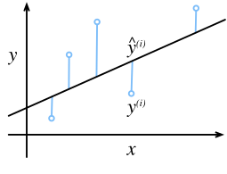
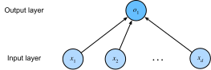
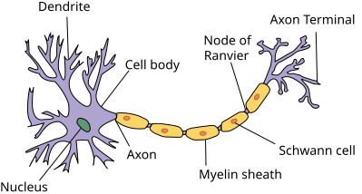

{.python .input}
%load_ext d2lbook.tab
tab.interact_select(['mxnet', 'pytorch', 'tensorflow', 'jax'])
```

# 線形回帰
:label:`sec_linear_regression`

*回帰* 問題は、数値を予測したいときに現れる。
代表例として、住宅や株式の価格予測、入院患者の在院日数の予測、小売売上の需要予測などがある。
ただし、すべての予測問題が古典的な回帰に属するわけではない。
後に、有限個のカテゴリのいずれに属するかを予測する *分類* 問題を扱う。

例として、住宅の面積（平方フィート）と築年数（年）に基づいて、住宅価格（ドル）を推定したいとする。
住宅価格を予測するモデルを構築するには、各住宅について売却価格、面積、築年数を含むデータが必要である。
機械学習では、このようなデータ集合を *訓練データセット* または *訓練集合* と呼ぶ。
各行（1件の売買に対応する記録）は *例*（または *サンプル*、*データ例*、*インスタンス*）である。
予測したい対象（価格）は *ラベル*（または *ターゲット*）と呼ぶ。
予測の根拠となる変数（築年数と面積）は *特徴量*（または *共変量*）である。

```{.python .input}
%%tab mxnet
%matplotlib inline
from d2l import mxnet as d2l
import math
from mxnet import np
import time
```

```{.python .input}
%%tab pytorch
%matplotlib inline
from d2l import torch as d2l
import math
import torch
import numpy as np
import time
```

```{.python .input}
%%tab tensorflow
%matplotlib inline
from d2l import tensorflow as d2l
import math
import tensorflow as tf
import numpy as np
import time
```

```{.python .input}
%%tab jax
%matplotlib inline
from d2l import jax as d2l
from jax import numpy as jnp
import math
import time
```

## 基礎

*線形回帰* は、回帰問題に対する標準的手法の中でも最も単純で、かつ最も広く用いられている。
19世紀初頭にさかのぼる線形回帰 :cite:`Legendre.1805,Gauss.1809` は、いくつかの単純な仮定に基づく。
まず、特徴量 $\mathbf{x}$ とターゲット $y$ の関係はおおむね線形であり、条件付き平均 $E[Y \mid X=\mathbf{x}]$ が特徴量 $\mathbf{x}$ の重み付き和で表せると仮定する。
このとき、観測ノイズによってターゲット値がその期待値からずれることは許容する。
次に、そのノイズはガウス分布に従う、扱いやすいものだと仮定する。
通常、$n$ はデータセット中の例の数を表す。
サンプルやターゲットの番号には上付き添字を、座標の番号には下付き添字を用いる。
具体的には、$\mathbf{x}^{(i)}$ は $i$ 番目のサンプル、$x_j^{(i)}$ はその $j$ 番目の座標である。

### モデル
:label:`subsec_linear_model`

あらゆる学習手法の中心には、特徴量をターゲットの推定値へ写像する方法を記述するモデルがある。
線形性の仮定とは、ターゲット（価格）の期待値が特徴量（面積と築年数）の重み付き和で表せることを意味する。

$$\textrm{price} = w_{\textrm{area}} \cdot \textrm{area} + w_{\textrm{age}} \cdot \textrm{age} + b.$$
:eqlabel:`eq_price-area`

ここで $w_{\textrm{area}}$ と $w_{\textrm{age}}$ は *重み*、$b$ は *バイアス*（または *オフセット*、*切片*）である。
重みは各特徴量が予測に与える影響を決める。
バイアスは、すべての特徴量が 0 のときの推定値を決める。
面積が厳密に 0 の新築住宅は現実には存在しないが、それでもバイアスは必要である。
そうすることで、原点を通る直線に限らず、特徴量のあらゆる線形関数を表現できる。
厳密には、:eqref:`eq_price-area` は入力特徴量の *アフィン変換* であり、特徴量の *線形変換*（重み付き和）に、バイアスによる *平行移動* を加えたものである。
データセットが与えられたときの目標は、重み $\mathbf{w}$ とバイアス $b$ を選び、平均的に見てモデルの予測が観測された真の価格によく一致するようにすることである。

特徴量が少ないデータセットを扱う分野では、:eqref:`eq_price-area` のようにモデルを明示的に書き下すことが多い。
一方、機械学習では高次元データを扱うことが多いため、コンパクトな線形代数の記法が便利である。
入力が $d$ 個の特徴量からなるとき、それぞれに 1 から $d$ までの添字を付けると、予測 $\hat{y}$ は
（一般に「ハット」は推定値を表す）
次のように書ける。

$$\hat{y} = w_1  x_1 + \cdots + w_d  x_d + b.$$

すべての特徴量をベクトル $\mathbf{x} \in \mathbb{R}^d$ に、すべての重みをベクトル $\mathbf{w} \in \mathbb{R}^d$ にまとめると、モデルは $\mathbf{w}$ と $\mathbf{x}$ の内積で簡潔に表せる。

$$\hat{y} = \mathbf{w}^\top \mathbf{x} + b.$$
:eqlabel:`eq_linreg-y`

:eqref:`eq_linreg-y` では、ベクトル $\mathbf{x}$ は1つの例の特徴量に対応する。
データセット全体が $n$ 個の例からなるときは、*設計行列* $\mathbf{X} \in \mathbb{R}^{n \times d}$ を用いて特徴量を表すと便利である。
ここで、$\mathbf{X}$ は各例に対して1行、各特徴量に対して1列を持つ。
特徴量集合 $\mathbf{X}$ に対する予測 $\hat{\mathbf{y}} \in \mathbb{R}^n$ は、行列--ベクトル積で表せる。

$${\hat{\mathbf{y}}} = \mathbf{X} \mathbf{w} + b,$$
:eqlabel:`eq_linreg-y-vec`

ここでは、和を取る際にブロードキャスト（:numref:`subsec_broadcasting`）が適用される。
訓練データセットの特徴量 $\mathbf{X}$ と対応する既知のラベル $\mathbf{y}$ が与えられたとき、線形回帰の目標は、$\mathbf{X}$ と同じ分布からサンプリングされた新しいデータ例の特徴量が与えられたときに、そのラベルを期待値の意味で最小誤差で予測できるような重みベクトル $\mathbf{w}$ とバイアス項 $b$ を見つけることである。

たとえ、$\mathbf{x}$ が与えられたときの $y$ を予測する最良のモデルが線形であると信じていても、現実世界の $n$ 個の例からなるデータセットで、すべての $1 \leq i \leq n$ に対して
$y^{(i)} = \mathbf{w}^\top \mathbf{x}^{(i)}+b$
が厳密に成り立つとは期待しない。
たとえば、$\mathbf{X}$ と $\mathbf{y}$ の観測には、どのような計測機器を用いても多少の測定誤差が含まれうる。
したがって、基礎となる関係が線形であると確信している場合でも、そのような誤差を表すノイズ項を組み込む。

最良の *パラメータ*（または *モデルパラメータ*）$\mathbf{w}$ と $b$ を求めるには、さらに2つ必要である。
(i) 与えられたモデルの良さを測る尺度、
(ii) その良さを改善するようにモデルを更新する手順である。

### 損失関数
:label:`subsec_linear-regression-loss-function`

モデルをデータに適合させるには、*適合度*、あるいは同値な *不適合度* の尺度を定める必要がある。
*損失関数* は、ターゲットの *真の* 値と *予測* 値の間のずれを定量化する。
損失は通常、非負の数であり、小さいほど良い。
完全な予測では損失は 0 になる。
回帰問題で最も一般的な損失関数は二乗誤差である。
例 $i$ に対する予測が $\hat{y}^{(i)}$、対応する真のラベルが $y^{(i)}$ のとき、*二乗誤差* は次のように与えられる。

$$l^{(i)}(\mathbf{w}, b) = \frac{1}{2} \left(\hat{y}^{(i)} - y^{(i)}\right)^2.$$
:eqlabel:`eq_mse`

定数 $\frac{1}{2}$ は本質的な違いを生まないが、損失を微分するときに打ち消し合うため、記法上便利である。
訓練データセットは与えられており、制御できないので、経験誤差はモデルパラメータの関数にすぎない。
:numref:`fig_fit_linreg` では、1次元入力の問題における線形回帰モデルの適合を可視化している。


:label:`fig_fit_linreg`

推定値 $\hat{y}^{(i)}$ とターゲット $y^{(i)}$ の差が大きいほど、その二次形式のために損失への寄与はさらに大きくなる。
この二次性は諸刃の剣である。
大きな誤差を避けるようモデルを促す一方で、異常データに過度に敏感になることもある。
$n$ 個の例からなるデータセット全体に対するモデルの良さを測るには、訓練集合上の損失を単純に平均すればよい
（あるいは同値に総和してもよい）。

$$L(\mathbf{w}, b) =\frac{1}{n}\sum_{i=1}^n l^{(i)}(\mathbf{w}, b) =\frac{1}{n} \sum_{i=1}^n \frac{1}{2}\left(\mathbf{w}^\top \mathbf{x}^{(i)} + b - y^{(i)}\right)^2.$$

モデルを訓練するときは、すべての訓練例にわたる総損失を最小にするパラメータ $(\mathbf{w}^*, b^*)$ を求める。

$$\mathbf{w}^*, b^* = \operatorname*{argmin}_{\mathbf{w}, b}\  L(\mathbf{w}, b).$$

### 解析解

本書で扱うほとんどのモデルとは異なり、線形回帰は驚くほど単純な最適化問題を与える。
特に、簡単な公式を適用することで、訓練データ上で評価した最適パラメータを解析的に求められる。
まず、設計行列にすべて 1 からなる列を追加すれば、バイアス $b$ をパラメータ $\mathbf{w}$ に組み込める。
すると、予測問題は $\|\mathbf{y} - \mathbf{X}\mathbf{w}\|^2$ の最小化になる。
設計行列 $\mathbf{X}$ がフルランク
（どの特徴量も他の特徴量の線形結合で表せない）である限り、損失面には臨界点がただ1つしかなく、それが定義域全体での損失の最小値に対応する。
損失を $\mathbf{w}$ で微分して 0 に等置すると、次を得る。

$$\begin{aligned}
    \partial_{\mathbf{w}} \|\mathbf{y} - \mathbf{X}\mathbf{w}\|^2 =
    2 \mathbf{X}^\top (\mathbf{X} \mathbf{w} - \mathbf{y}) = 0
    \textrm{ and hence }
    \mathbf{X}^\top \mathbf{y} = \mathbf{X}^\top \mathbf{X} \mathbf{w}.
\end{aligned}$$

これを $\mathbf{w}$ について解けば、最適化問題の解が得られる。
その解は

$$\mathbf{w}^* = (\mathbf X^\top \mathbf X)^{-1}\mathbf X^\top \mathbf{y}$$

である。

この解が一意であるのは、行列 $\mathbf X^\top \mathbf X$ が可逆、すなわち設計行列の列が線形独立である場合に限られる :cite:`Golub.Van-Loan.1996`。

線形回帰のような単純な問題では解析解が得られることもあるが、そのような幸運を当然視すべきではない。
解析解は美しい数学的解析を可能にする一方で、それを要求すると問題設定は著しく制約され、深層学習の興味深い側面の大半が排除されてしまう。

### ミニバッチ確率的勾配降下法

幸い、モデルを解析的に解けない場合でも、実際にはしばしば効果的に訓練できる。
しかも、多くのタスクでは、そのような最適化の難しいモデルの方がはるかに高い性能を示す。
したがって、訓練方法を見つける労力には十分な価値がある。

ほぼすべての深層学習モデルを最適化する鍵となる技法は、パラメータを少しずつ損失関数が減少する方向へ更新し、誤差を反復的に減らしていくことである。
このアルゴリズムを *勾配降下法* と呼ぶ。

勾配降下法の最も素朴な適用は、データセット中のすべての例で計算した損失の平均、すなわち損失関数そのものを微分することである。
しかし実際には、これは非常に遅くなりうる。
更新がどれほど強力でも、1回の更新の前にデータセット全体を1周しなければならないからである :cite:`Liu.Nocedal.1989`。
さらに、訓練データに冗長性が多い場合、フルバッチ更新の利点は限られる。

もう一方の極端は、一度に1つの例だけを用い、1つの観測に基づいて更新する方法である。
この *確率的勾配降下法*（SGD）は、大規模データセットに対して有効な戦略になりうる :cite:`Bottou.2010`。
しかし、SGD には計算上および統計上の欠点がある。
1つ目の問題は、プロセッサが主記憶からキャッシュへデータを移動するよりも、数値の乗算や加算をはるかに高速に実行できることである。
そのため、行列--ベクトル積を実行する方が、同等のベクトル--ベクトル演算を多数行うより、最大で1桁程度効率的である。
これは、1サンプルずつ処理する方法が、フルバッチよりもはるかに時間を要しうることを意味する。
2つ目の問題は、バッチ正規化（:numref:`sec_batch_norm` で説明する）のように、一度に複数の観測へアクセスできる場合にのみうまく機能する層があることである。

これら2つの問題に対する解決策は、中間的な戦略を採ることである。
フルバッチでも1サンプルずつでもなく、観測の *ミニバッチ* を用いる :cite:`Li.Zhang.Chen.ea.2014`。
ミニバッチサイズの具体的な選択は、利用可能なメモリ量、アクセラレータの数、層の種類、データセット全体の大きさなど、多くの要因に依存する。
それでも、32 から 256 の範囲、できれば 2 の大きな冪に近い値がよい出発点である。
これが *ミニバッチ確率的勾配降下法* である。

最も基本的な形では、各反復 $t$ において、まず固定個数 $|\mathcal{B}|$ の訓練例からなるミニバッチ $\mathcal{B}_t$ をランダムにサンプリングする。
次に、ミニバッチ上の平均損失をモデルパラメータに関して微分し、勾配を計算する。
最後に、その勾配に *学習率* と呼ばれるあらかじめ定めた小さな正の値 $\eta$ を掛け、その結果を現在のパラメータ値から引く。
更新は次のように表せる。

$$(\mathbf{w},b) \leftarrow (\mathbf{w},b) - \frac{\eta}{|\mathcal{B}|} \sum_{i \in \mathcal{B}_t} \partial_{(\mathbf{w},b)} l^{(i)}(\mathbf{w},b).$$

要するに、ミニバッチ SGD は次のように進む。
(i) 通常はランダムにモデルパラメータを初期化する。
(ii) データからランダムなミニバッチを反復的にサンプリングし、負の勾配方向へパラメータを更新する。
二次損失とアフィン変換に対しては、これを閉形式で展開できる。

$$\begin{aligned} \mathbf{w} & \leftarrow \mathbf{w} - \frac{\eta}{|\mathcal{B}|} \sum_{i \in \mathcal{B}_t} \partial_{\mathbf{w}} l^{(i)}(\mathbf{w}, b) && = \mathbf{w} - \frac{\eta}{|\mathcal{B}|} \sum_{i \in \mathcal{B}_t} \mathbf{x}^{(i)} \left(\mathbf{w}^\top \mathbf{x}^{(i)} + b - y^{(i)}\right)\\ b &\leftarrow b -  \frac{\eta}{|\mathcal{B}|} \sum_{i \in \mathcal{B}_t} \partial_b l^{(i)}(\mathbf{w}, b) &&  = b - \frac{\eta}{|\mathcal{B}|} \sum_{i \in \mathcal{B}_t} \left(\mathbf{w}^\top \mathbf{x}^{(i)} + b - y^{(i)}\right). \end{aligned}$$
:eqlabel:`eq_linreg_batch_update`

ミニバッチ $\mathcal{B}$ を用いるので、そのサイズ $|\mathcal{B}|$ で正規化する必要がある。
多くの場合、ミニバッチサイズと学習率は利用者が定める。
訓練ループの中で更新されないこの種の調整可能なパラメータを *ハイパーパラメータ* と呼ぶ。
これらはベイズ最適化などの手法で自動調整することもできる :cite:`Frazier.2018`。
最終的な解の品質は、通常、別の *検証データセット*（または *検証集合*）で評価する。

あらかじめ定めた回数だけ反復して訓練した後
（あるいは別の停止条件が満たされた後）、推定されたモデルパラメータ $\hat{\mathbf{w}}, \hat{b}$ を記録する。
たとえ真の関数が完全に線形でノイズがなかったとしても、これらのパラメータは損失の厳密な最小化解にはならず、まして決定論的でもない。
アルゴリズムは最小化解へ向かって徐々に収束するが、有限回のステップでそれを厳密に求めることは通常できない。
さらに、パラメータ更新に用いるミニバッチ $\mathcal{B}$ はランダムに選ばれるため、決定論性は失われる。

線形回帰は、たまたま大域的最小値を持つ学習問題である
（$\mathbf{X}$ がフルランク、あるいは同値に $\mathbf{X}^\top \mathbf{X}$ が可逆であるとき）。
しかし、深層ネットワークの損失面には多くの鞍点や局所最小値が存在する。
幸い、通常は厳密なパラメータ値そのものに関心があるわけではなく、正確な予測
（したがって低い損失）
を与える何らかのパラメータ集合が得られれば十分である。
実際、深層学習の実務では、訓練集合上の損失を小さくするパラメータを見つけること自体に苦労することはまれである :cite:`Izmailov.Podoprikhin.Garipov.ea.2018,Frankle.Carbin.2018`。
より難しいのは、未観測データに対しても正確な予測を与えるパラメータを見つけることである。
この課題を *汎化* と呼ぶ。
この話題には本書を通して繰り返し立ち返る。

### 予測

モデル $\hat{\mathbf{w}}^\top \mathbf{x} + \hat{b}$ が得られれば、新しい例に対して *予測* を行える。
たとえば、面積 $x_1$ と築年数 $x_2$ が与えられたとき、これまで見たことのない住宅の売却価格を予測できる。
深層学習の実務では、この予測段階を *推論* と呼ぶことが多いが、これはやや不正確である。
*推論* は一般に、証拠に基づいて導かれるあらゆる結論を指し、パラメータ値の推定も、未観測インスタンスのラベルに関する結論も含みうる。
一方、統計学の文献では、*推論* はむしろパラメータ推定を指すことが多い。
この用語の多義性は、深層学習の実務家と統計学者の間で不要な混乱を招きうる。
以下では、可能な限り *予測* という語を用いる。


## 高速化のためのベクトル化

モデルを訓練するときは、通常、例のミニバッチ全体を同時に処理したい。
これを効率よく行うには、[**計算をベクトル化し、Python で高コストな for ループを書くのではなく、高速な線形代数ライブラリを活用する必要がある。**]

これがなぜ重要かを見るために、[**ベクトル加算を行う2つの方法を考える。**]
まず、すべて 1 からなる 10,000 次元ベクトルを2つ用意する。
1つ目の方法では、Python の for ループでベクトルを走査する。
2つ目では、`+` を1回呼び出すだけで済ませる。

```{.python .input}
%%tab all
n = 10000
a = d2l.ones(n)
b = d2l.ones(n)
```

これで処理時間を計測できる。
まず、[**for ループを使って1座標ずつ加算する。**]

```{.python .input}
%%tab mxnet, pytorch
c = d2l.zeros(n)
t = time.time()
for i in range(n):
    c[i] = a[i] + b[i]
f'{time.time() - t:.5f} sec'
```

```{.python .input}
%%tab tensorflow
c = tf.Variable(d2l.zeros(n))
t = time.time()
for i in range(n):
    c[i].assign(a[i] + b[i])
f'{time.time() - t:.5f} sec'
```

```{.python .input}
%%tab jax
# JAXの配列は不変であり、一度作成するとその内容は変更できない。
# 個々の要素を更新するには、JAXは更新済みのコピーを返す
# インデックス付き更新構文を用いる。
c = d2l.zeros(n)
t = time.time()
for i in range(n):
    c = c.at[i].set(a[i] + b[i])
f'{time.time() - t:.5f} sec'
```

[**あるいは、オーバーロードされた `+` 演算子で要素ごとの和を計算する。**]

```{.python .input}
%%tab all
t = time.time()
d = a + b
f'{time.time() - t:.5f} sec'
```

2つ目の方法は1つ目より劇的に高速である。
コードをベクトル化すると、しばしば桁違いの高速化が得られる。
さらに、多くの計算をライブラリに任せられるため、自分で書くコード量が減り、誤りの可能性が下がり、コードの移植性も高まる。


## 正規分布と二乗損失
:label:`subsec_normal_distribution_and_squared_loss`

ここまで、二乗損失という目的関数に対して、かなり実用的な動機づけを与えてきた。
すなわち、基礎となるパターンが本当に線形であれば、最適パラメータは条件付き期待値 $E[Y\mid X]$ を返し、またこの損失は外れ値に大きな罰則を与える。
さらに、ノイズ分布に確率的仮定を置くことで、二乗損失に対してより形式的な動機づけも得られる。

線形回帰は19世紀初頭に発明された。
ガウスとルジャンドルのどちらが先にこの考えに到達したかは長く議論されてきたが、正規分布
（*ガウス分布* とも呼ばれる）
を発見したのもガウスであった。
正規分布と二乗損失を伴う線形回帰は、単に同じ祖先を持つ以上に深い関係を共有している。

まず、平均 $\mu$、分散 $\sigma^2$（標準偏差 $\sigma$）の正規分布は次で与えられる。

$$p(x) = \frac{1}{\sqrt{2 \pi \sigma^2}} \exp\left(-\frac{1}{2 \sigma^2} (x - \mu)^2\right).$$

以下では [**正規分布を計算する関数を定義する**]。

```{.python .input}
%%tab pytorch, mxnet, tensorflow
def normal(x, mu, sigma):
    p = 1 / math.sqrt(2 * math.pi * sigma**2)
    return p * np.exp(-0.5 * (x - mu)**2 / sigma**2)
```

```{.python .input}
%%tab jax
def normal(x, mu, sigma):
    p = 1 / math.sqrt(2 * math.pi * sigma**2)
    return p * jnp.exp(-0.5 * (x - mu)**2 / sigma**2)
```

これで [**正規分布を可視化**] できる。

```{.python .input}
%%tab mxnet
# 可視化に再びNumPyを用いる
x = np.arange(-7, 7, 0.01)

# 平均と標準偏差の組み合わせ
params = [(0, 1), (0, 2), (3, 1)]
d2l.plot(x.asnumpy(), [normal(x, mu, sigma).asnumpy() for mu, sigma in params], xlabel='x',
         ylabel='p(x)', figsize=(4.5, 2.5),
         legend=[f'mean {mu}, std {sigma}' for mu, sigma in params])
```

```{.python .input}

%%tab pytorch, tensorflow, jax
if tab.selected('jax'):
    # 可視化には JAX NumPy を用いる
    x = jnp.arange(-7, 7, 0.01)
if tab.selected('pytorch', 'mxnet', 'tensorflow'):
    # 可視化に再びNumPyを用いる
    x = np.arange(-7, 7, 0.01)

# 平均と標準偏差の組み合わせ
params = [(0, 1), (0, 2), (3, 1)]
d2l.plot(x, [normal(x, mu, sigma) for mu, sigma in params], xlabel='x',
         ylabel='p(x)', figsize=(4.5, 2.5),
         legend=[f'mean {mu}, std {sigma}' for mu, sigma in params])
```

平均を変えると $x$ 軸方向の平行移動に対応し、分散を大きくすると分布は広がり、ピークは低くなる。

二乗損失を伴う線形回帰を動機づける1つの方法は、観測がノイズを含む測定から生じ、そのノイズ $\epsilon$ が正規分布 $\mathcal{N}(0, \sigma^2)$ に従うと仮定することである。

$$y = \mathbf{w}^\top \mathbf{x} + b + \epsilon \textrm{ where } \epsilon \sim \mathcal{N}(0, \sigma^2).$$

したがって、与えられた $\mathbf{x}$ に対して特定の $y$ が観測される *尤度* は次のように書ける。

$$P(y \mid \mathbf{x}) = \frac{1}{\sqrt{2 \pi \sigma^2}} \exp\left(-\frac{1}{2 \sigma^2} (y - \mathbf{w}^\top \mathbf{x} - b)^2\right).$$

このように、尤度は因数分解される。
*最尤原理* によれば、パラメータ $\mathbf{w}$ と $b$ の最良の値は、データセット全体の *尤度* を最大化するものである。

$$P(\mathbf y \mid \mathbf X) = \prod_{i=1}^{n} p(y^{(i)} \mid \mathbf{x}^{(i)}).$$

この等式は、すべての組 $(\mathbf{x}^{(i)}, y^{(i)})$ が互いに独立に抽出されたことから成り立つ。
最尤原理に従って選ばれる推定量を *最尤推定量* と呼ぶ。
指数関数の積を最大化するのは難しそうに見えるが、目的関数を変えずに尤度の対数を最大化すれば大幅に簡単になる。
歴史的理由から、最適化は最大化ではなく最小化として表現されることが多い。
そこで、同値な問題として *負の対数尤度* を *最小化* する。これは次のように書ける。

$$-\log P(\mathbf y \mid \mathbf X) = \sum_{i=1}^n \frac{1}{2} \log(2 \pi \sigma^2) + \frac{1}{2 \sigma^2} \left(y^{(i)} - \mathbf{w}^\top \mathbf{x}^{(i)} - b\right)^2.$$

$\sigma$ が固定であると仮定すれば、第1項は $\mathbf{w}$ や $b$ に依存しないので無視できる。
第2項は、先に導入した二乗誤差損失に、乗法定数 $\frac{1}{\sigma^2}$ が掛かったものにすぎない。
幸い、解は $\sigma$ にも依存しない。
したがって、平均二乗誤差を最小化することは、加法的ガウスノイズを仮定した線形モデルの最尤推定と等価である。


## ニューラルネットワークとしての線形回帰

線形モデルは、本書でこれから扱う複雑なネットワークを表現するには十分に豊かではない。
しかし、（人工）ニューラルネットワークは、すべての特徴量が入力ニューロンで表され、それらがすべて出力に直接接続されたネットワークとして、線形モデルを包含できるほど豊かである。

:numref:`fig_single_neuron` は、線形回帰をニューラルネットワークとして描いたものである。
この図は、各入力が出力にどう接続されているかという接続パターンを強調しているが、重みやバイアスの具体的な値は示していない。


:label:`fig_single_neuron`

入力は $x_1, \ldots, x_d$ である。
$d$ を入力層の *入力数* または *特徴次元* と呼ぶ。
ネットワークの出力は $o_1$ である。
単一の数値を予測するだけなので、出力ニューロンは1つしかない。
入力値はすべて *与えられた* ものであることに注意されたい。
*計算される* ニューロンは1つだけである。
要するに、線形回帰は1層の全結合ニューラルネットワークとみなせる。
後の章では、はるかに多くの層を持つネットワークを扱う。

### 生物学

線形回帰は計算神経科学よりも前に登場したため、線形回帰をニューラルネットワークの観点から説明するのは時代錯誤に見えるかもしれない。
それでも、サイバネティクス研究者で神経生理学者でもあったウォーレン・マカロックとウォルター・ピッツが人工ニューロンのモデルを考案し始めたとき、これは自然な出発点であった。
:numref:`fig_Neuron` に示す生物学的ニューロンの模式図を考えよう。
そこには、*樹状突起*（入力端子）、*細胞核*（CPU）、*軸索*（出力線）、および *軸索終末*（出力端子）があり、*シナプス* を介して他のニューロンと接続する。


:label:`fig_Neuron`

他のニューロン
（あるいは環境センサー）
から到着する情報 $x_i$ は樹状突起で受け取られる。
特に、その情報は *シナプス重み* $w_i$ によって重み付けされ、積 $x_i w_i$ によって活性化または抑制の効果が決まる。
複数のソースから到着した重み付き入力は、細胞核で重み付き和 $y = \sum_i x_i w_i + b$ として集約され、場合によっては関数 $\sigma(y)$ による非線形な後処理を受ける。
その後、この情報は軸索を通って軸索終末へ送られ、そこで目的地
（たとえば筋肉のようなアクチュエータ）
に到達するか、あるいは樹状突起を介して別のニューロンへの入力となる。

もちろん、適切な接続構造と学習アルゴリズムを備えていれば、このような多数の単位を組み合わせることで、単一のニューロンだけでは表現できない、はるかに興味深く複雑な振る舞いを生み出せるという高水準の考え方は、実際の生物学的神経系の研究に由来する。
同時に、今日の深層学習研究の大部分は、より広い源泉から着想を得ている。
:citet:`Russell.Norvig.2016` は、飛行機が鳥に *着想を得た* ものであっても、ここ数世紀の航空工学の革新を主に牽引してきたのは鳥類学ではなかったと指摘している。
同様に、今日の深層学習における着想は、数学、言語学、心理学、統計学、計算機科学、そして他の多くの分野から、同程度あるいはそれ以上に得られている。

## 要約

この節では、古典的な線形回帰を導入した。
そこでは、線形関数のパラメータを、訓練集合上の二乗損失を最小化するように選ぶ。
また、この目的関数の選択を、いくつかの実用的な観点と、線形性およびガウスノイズの仮定の下で線形回帰を最尤推定として解釈できることの両方から動機づけた。
さらに、計算上の観点と統計学との関係を議論した後、このような線形モデルを、入力が出力へ直接接続された単純なニューラルネットワークとして表現できることを示した。
まもなく線形モデルそのものからは先へ進むが、ここで導入した内容は、あらゆるモデルに必要な構成要素――パラメトリックな形、微分可能な目的関数、ミニバッチ確率的勾配降下法による最適化、そして最終的には未観測データでの評価――を理解するのに十分である。


## 演習

1. いくつかのデータ $x_1, \ldots, x_n \in \mathbb{R}$ があると仮定する。目標は、$\sum_i (x_i - b)^2$ を最小にする定数 $b$ を見つけることである。
    1. $b$ の最適値の解析解を求めよ。
    1. この問題とその解は正規分布とどのように関係しているか。
    1. 損失を $\sum_i (x_i - b)^2$ から $\sum_i |x_i-b|$ に変えるとどうなるか。$b$ の最適解を見つけられるか。
1. $\mathbf{x}^\top \mathbf{w} + b$ で表されるアフィン関数が、$(\mathbf{x}, 1)$ 上の線形関数と等価であることを証明せよ。
1. $\mathbf{x}$ の二次関数、すなわち $f(\mathbf{x}) = b + \sum_i w_i x_i + \sum_{j \leq i} w_{ij} x_{i} x_{j}$ を求めたいとする。これを深層ネットワークとしてどのように定式化するか。
1. 線形回帰問題が解ける条件の1つは、設計行列 $\mathbf{X}^\top \mathbf{X}$ がフルランクであることだった。
    1. そうでない場合はどうなるか。
    1. どうすれば修正できるか。$\mathbf{X}$ のすべての要素に、座標ごとに独立なガウスノイズを微量加えるとどうなるか。
    1. この場合、設計行列 $\mathbf{X}^\top \mathbf{X}$ の期待値はいくらか。
    1. $\mathbf{X}^\top \mathbf{X}$ がフルランクでないとき、確率的勾配降下法では何が起こるか。
1. 加法ノイズ $\epsilon$ を支配するノイズモデルが指数分布であると仮定する。すなわち、$p(\epsilon) = \frac{1}{2} \exp(-|\epsilon|)$ である。
    1. このモデルの下でのデータの負の対数尤度 $-\log P(\mathbf y \mid \mathbf X)$ を書き下せ。
    1. 閉形式解を見つけられるか。
    1. この問題を解くためのミニバッチ確率的勾配降下法アルゴリズムを提案せよ。何がうまくいかなくなる可能性があるか
    （ヒント: パラメータを更新し続けると、停留点の近くで何が起こるか）。
    それを修正できるか。
1. 2つの線形層を合成して2層のニューラルネットワークを設計したいとする。すなわち、最初の層の出力が2番目の層の入力になる。なぜこのような素朴な合成はうまくいかないのか。
1. 現実的な住宅価格や株価の推定に回帰を使うとすると、何が起こるか。
    1. 加法的ガウスノイズの仮定が適切でないことを示せ。ヒント: 価格が負になることはあるか。変動はどうか。
    1. 価格の対数に回帰する方が、すなわち $y = \log \textrm{price}$ とする方が、なぜはるかに良いのか。
    1. ペニー株、すなわち非常に低価格の株を扱うとき、何に注意すべきか。ヒント: あらゆる価格で取引できるか。なぜ安い株ほどこの問題が大きいのか。詳しくは、有名な Black--Scholes モデルを復習せよ :cite:`Black.Scholes.1973`。
1. 食料品店で売れたリンゴの *個数* を推定するために回帰を使いたいとする。
    1. ガウス加法ノイズモデルの問題点は何か。ヒント: 売っているのは石油ではなくリンゴである。
    1. [ポアソン分布](https://en.wikipedia.org/wiki/Poisson_distribution) は個数に関する分布を表す。 $p(k \mid \lambda) = \lambda^k e^{-\lambda}/k!$ で与えられる。ここで $\lambda$ は率関数であり、$k$ は観測される事象数である。$\lambda$ が個数 $k$ の期待値であることを証明せよ。
    1. ポアソン分布に対応する損失関数を設計せよ。
    1. 代わりに $\log \lambda$ を推定するための損失関数を設計せよ。