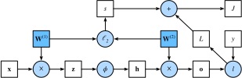

# 順伝播、逆伝播、および計算グラフ
:label:`sec_backprop`

これまで、私たちはミニバッチ確率的勾配降下法を用いてモデルを学習してきた。  
しかし、アルゴリズムを実装するときに私たちが気にしていたのは、モデルを通した *順伝播* に伴う計算だけであった。  
勾配を計算するときには、深層学習フレームワークが提供する逆伝播関数を呼び出すだけであった。

勾配の自動計算は、深層学習アルゴリズムの実装を劇的に簡単にする。  
自動微分が登場する以前は、複雑なモデルに少し変更を加えるだけでも、複雑な導関数を手計算で再計算する必要があった。  
驚くほど頻繁に、学術論文では更新則の導出に何ページも割かなければなりませんであった。  
私たちは引き続き自動微分に頼って興味深い部分に集中する必要がありますが、深層学習を表面的にしか理解しないままで終わりたくないのであれば、これらの勾配が内部でどのように計算されているのかを知っておくべきである。

この節では、*逆方向伝播*（より一般には *逆伝播* と呼ばれる）の詳細を深く掘り下げます。  
手法とその実装の両方についていくらかの洞察を与えるために、ここでは基本的な数学と計算グラフを用いる。  
まずは、重み減衰（$\ell_2$ 正則化、これは後続の章で説明する）を伴う、1つの隠れ層を持つ MLP に話を絞る。

## 順伝播

*順伝播*（または *フォワードパス*）とは、入力層から出力層へ向かう順序で、ニューラルネットワークの中間変数（出力を含む）を計算し、保存することを指する。  
ここでは、1つの隠れ層を持つニューラルネットワークの仕組みを、段階を追って見ていくる。  
これは退屈に思えるかもしれませんが、ファンクの巨匠ジェームス・ブラウンの永遠の言葉を借りれば、"pay the cost to be the boss" である。

簡単のため、入力例が $\mathbf{x}\in \mathbb{R}^d$ であり、隠れ層にバイアス項が含まれないと仮定ししよう。  
このとき中間変数は次のようになる。

$$\mathbf{z}= \mathbf{W}^{(1)} \mathbf{x},$$

ここで $\mathbf{W}^{(1)} \in \mathbb{R}^{h \times d}$ は隠れ層の重みパラメータである。  
中間変数 $\mathbf{z}\in \mathbb{R}^h$ を活性化関数 $\phi$ に通すと、長さ $h$ の隠れ活性化ベクトルが得られる。

$$\mathbf{h}= \phi (\mathbf{z}).$$

隠れ層の出力 $\mathbf{h}$ もまた中間変数である。  
出力層のパラメータが $\mathbf{W}^{(2)} \in \mathbb{R}^{q \times h}$ の重みのみを持つと仮定すると、長さ $q$ のベクトルを持つ出力層変数を得られる。

$$\mathbf{o}= \mathbf{W}^{(2)} \mathbf{h}.$$

損失関数が $l$ であり、データ例のラベルが $y$ であると仮定すると、単一のデータ例に対する損失項は次のように計算できる。

$$L = l(\mathbf{o}, y).$$

後で導入する $\ell_2$ 正則化の定義に従い、ハイパーパラメータ $\lambda$ が与えられたとき、正則化項は

$$s = \frac{\lambda}{2} \left(\|\mathbf{W}^{(1)}\|_\textrm{F}^2 + \|\mathbf{W}^{(2)}\|_\textrm{F}^2\right),$$
:eqlabel:`eq_forward-s`

となる。ここで行列のフロベニウスノルムは、行列をベクトルに平坦化した後に $\ell_2$ ノルムを適用したものにすぎない。  
最後に、与えられたデータ例に対するモデルの正則化済み損失は次のようになる。

$$J = L + s.$$

以下では、$J$ を *目的関数* と呼ぶ。

## 順伝播の計算グラフ

*計算グラフ* を描くと、計算内の演算子と変数の依存関係を可視化できる。  
:numref:`fig_forward` は、上で述べた単純なネットワークに対応するグラフを示しています。四角は変数、円は演算子を表します。  
左下が入力、右上が出力を意味する。  
矢印の向き（データの流れを表す）が、主として右方向および上方向であることに注意されたい。

:label:`fig_forward`

## 逆伝播

*逆伝播* とは、ニューラルネットワークのパラメータの勾配を計算する方法を指する。  
要するに、この方法は微積分の *連鎖律* に従って、ネットワークを出力層から入力層へと逆順にたどる。  
このアルゴリズムは、勾配を計算する際に必要となる中間変数（偏導関数）を保存する。  
$\mathsf{Y}=f(\mathsf{X})$ および $\mathsf{Z}=g(\mathsf{Y})$ という関数があり、入力と出力 $\mathsf{X}, \mathsf{Y}, \mathsf{Z}$ が任意の形状のテンソルであるとする。  
連鎖律を用いると、$\mathsf{Z}$ の $\mathsf{X}$ に関する導関数は次のように計算できる。

$$\frac{\partial \mathsf{Z}}{\partial \mathsf{X}} = \textrm{prod}\left(\frac{\partial \mathsf{Z}}{\partial \mathsf{Y}}, \frac{\partial \mathsf{Y}}{\partial \mathsf{X}}\right).$$

ここでは $\textrm{prod}$ 演算子を用いて、転置や入力位置の入れ替えなど必要な操作を行った後に、その引数を掛け合わせる。  
ベクトルの場合、これは単純で、行列同士の積にすぎない。  
より高次元のテンソルでは、対応する適切な演算を用いる。  
演算子 $\textrm{prod}$ は、記法上の煩雑さをすべて隠している。

:numref:`fig_forward` に計算グラフが示されている、1つの隠れ層を持つ単純なネットワークのパラメータは、$\mathbf{W}^{(1)}$ と $\mathbf{W}^{(2)}$ でした。  
逆伝播の目的は、$\partial J/\partial \mathbf{W}^{(1)}$ と $\partial J/\partial \mathbf{W}^{(2)}$ を計算することである。  
これを達成するために、連鎖律を適用し、中間変数とパラメータそれぞれの勾配を順に計算する。  
計算の順序は順伝播で行ったものと逆になる。なぜなら、計算グラフの結果から始めて、パラメータへ向かってたどる必要があるからである。  
最初のステップは、目的関数 $J=L+s$ の損失項 $L$ と正則化項 $s$ に関する勾配を計算することである。

$$\frac{\partial J}{\partial L} = 1 \; \textrm{and} \; \frac{\partial J}{\partial s} = 1.$$

次に、連鎖律に従って、目的関数の出力層変数 $\mathbf{o}$ に関する勾配を計算する。

$$
\frac{\partial J}{\partial \mathbf{o}}
= \textrm{prod}\left(\frac{\partial J}{\partial L}, \frac{\partial L}{\partial \mathbf{o}}\right)
= \frac{\partial L}{\partial \mathbf{o}}
\in \mathbb{R}^q.
$$

次に、正則化項の両方のパラメータに関する勾配を計算する。

$$\frac{\partial s}{\partial \mathbf{W}^{(1)}} = \lambda \mathbf{W}^{(1)}
\; \textrm{and} \;
\frac{\partial s}{\partial \mathbf{W}^{(2)}} = \lambda \mathbf{W}^{(2)}.$$

これで、出力層に最も近いモデルパラメータの勾配 $\partial J/\partial \mathbf{W}^{(2)} \in \mathbb{R}^{q \times h}$ を計算できる。  
連鎖律を用いると次のようになる。

$$\frac{\partial J}{\partial \mathbf{W}^{(2)}}= \textrm{prod}\left(\frac{\partial J}{\partial \mathbf{o}}, \frac{\partial \mathbf{o}}{\partial \mathbf{W}^{(2)}}\right) + \textrm{prod}\left(\frac{\partial J}{\partial s}, \frac{\partial s}{\partial \mathbf{W}^{(2)}}\right)= \frac{\partial J}{\partial \mathbf{o}} \mathbf{h}^\top + \lambda \mathbf{W}^{(2)}.$$
:eqlabel:`eq_backprop-J-h`

$\mathbf{W}^{(1)}$ に関する勾配を得るには、出力層から隠れ層へと逆伝播を続ける必要がある。  
隠れ層出力に関する勾配 $\partial J/\partial \mathbf{h} \in \mathbb{R}^h$ は次のように与えられる。

$$
\frac{\partial J}{\partial \mathbf{h}}
= \textrm{prod}\left(\frac{\partial J}{\partial \mathbf{o}}, \frac{\partial \mathbf{o}}{\partial \mathbf{h}}\right)
= {\mathbf{W}^{(2)}}^\top \frac{\partial J}{\partial \mathbf{o}}.
$$

活性化関数 $\phi$ は要素ごとに適用されるため、中間変数 $\mathbf{z}$ の勾配 $\partial J/\partial \mathbf{z} \in \mathbb{R}^h$ を計算するには、要素ごとの乗算演算子を用いる必要がある。これを $\odot$ で表する。

$$
\frac{\partial J}{\partial \mathbf{z}}
= \textrm{prod}\left(\frac{\partial J}{\partial \mathbf{h}}, \frac{\partial \mathbf{h}}{\partial \mathbf{z}}\right)
= \frac{\partial J}{\partial \mathbf{h}} \odot \phi'\left(\mathbf{z}\right).
$$

最後に、入力層に最も近いモデルパラメータの勾配 $\partial J/\partial \mathbf{W}^{(1)} \in \mathbb{R}^{h \times d}$ を得る可能である。  
連鎖律に従うと、次を得る。

$$
\frac{\partial J}{\partial \mathbf{W}^{(1)}}
= \textrm{prod}\left(\frac{\partial J}{\partial \mathbf{z}}, \frac{\partial \mathbf{z}}{\partial \mathbf{W}^{(1)}}\right) + \textrm{prod}\left(\frac{\partial J}{\partial s}, \frac{\partial s}{\partial \mathbf{W}^{(1)}}\right)
= \frac{\partial J}{\partial \mathbf{z}} \mathbf{x}^\top + \lambda \mathbf{W}^{(1)}.
$$

## ニューラルネットワークの学習

ニューラルネットワークを学習するとき、順伝播と逆伝播は互いに依存している。  
特に順伝播では、依存関係の向きに従って計算グラフをたどり、その経路上のすべての変数を計算する。  
これらはその後、グラフ上の計算順序が逆になる逆伝播で用いられる。

前述の単純なネットワークを例に考えしよう。  
一方で、順伝播中に正則化項 :eqref:`eq_forward-s` を計算するには、モデルパラメータ $\mathbf{W}^{(1)}$ と $\mathbf{W}^{(2)}$ の現在値が必要である。  
それらは、直近の反復における逆伝播に基づいて最適化アルゴリズムによって与えられる。  
他方で、逆伝播中のパラメータ :eqref:`eq_backprop-J-h` の勾配計算は、隠れ層出力 $\mathbf{h}$ の現在値に依存しており、それは順伝播によって与えられる。

したがって、ニューラルネットワークを学習するときは、モデルパラメータを初期化した後、順伝播と逆伝播を交互に行い、逆伝播で得られる勾配を用いてモデルパラメータを更新する。  
逆伝播は、重複計算を避けるために、順伝播で保存された中間値を再利用することに注意されたい。  
その結果の1つとして、逆伝播が完了するまで中間値を保持しておく必要がある。  
これもまた、学習に平易な予測よりもかなり多くのメモリが必要になる理由の1つである。  
さらに、そのような中間値のサイズは、おおよそネットワーク層数とバッチサイズに比例する。  
したがって、より大きなバッチサイズでより深いネットワークを学習すると、*メモリ不足* エラーが起こりやすくなる。

## まとめ

順伝播は、ニューラルネットワークで定義された計算グラフ内の中間変数を順次計算し、保存する。これは入力層から出力層へ進む。  
逆伝播は、ニューラルネットワーク内の中間変数とパラメータの勾配を、逆順に順次計算し、保存する。  
深層学習モデルを学習するとき、順伝播と逆伝播は相互依存であり、学習には予測よりもかなり多くのメモリが必要である。

## 演習

1. あるスカラー関数 $f$ の入力 $\mathbf{X}$ が $n \times m$ 行列であると仮定する。$\mathbf{X}$ に関する $f$ の勾配の次元は何ですか。
1. この節で説明したモデルの隠れ層にバイアスを追加してください（正則化項にバイアスを含める必要はありない）。
    1. 対応する計算グラフを描いて。
    1. 順伝播と逆伝播の式を導出して。
1. この節で説明したモデルにおける学習時と予測時のメモリ使用量を計算して。
1. 2階導関数を計算したいと仮定する。計算グラフには何が起こりますか。計算にはどれくらい時間がかかると予想しますか。
1. 計算グラフが GPU に対して大きすぎると仮定する。
    1. それを複数の GPU に分割できますか。
    1. 小さいミニバッチで学習する場合と比べて、利点と欠点は何ですか。

