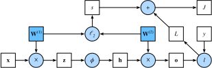

# 順伝播、逆伝播、および計算グラフ
:label:`sec_backprop`

これまで、ミニバッチ確率的勾配降下法を用いてモデルを学習してきた。  
しかし、アルゴリズムを実装する際に意識していたのは、モデルに対する *順伝播* に伴う計算だけであった。  
勾配を計算するときは、深層学習フレームワークが提供する逆伝播関数を呼び出すだけでよかった。

勾配の自動計算は、深層学習アルゴリズムの実装を劇的に容易にする。  
自動微分が登場する以前は、複雑なモデルにわずかな変更を加えるだけでも、複雑な導関数を手作業で計算し直す必要があった。  
実際、学術論文では更新則の導出に何ページも費やすことが珍しくなかった。  
自動微分に頼って本質的に重要な部分へ集中することは引き続き有用であるが、深層学習を表面的にしか理解しないままで終わりたくないなら、これらの勾配が内部でどのように計算されるかを知っておくべきである。

この節では、*逆方向伝播*（一般には *逆伝播* と呼ぶ）を詳しく扱う。  
手法とその実装の両方に対する洞察を与えるため、基本的な数学と計算グラフを用いる。  
まずは、重み減衰（$\ell_2$ 正則化。詳細は後の章で述べる）を伴う、1つの隠れ層をもつ MLP に話を限定する。

## 順伝播

*順伝播*（または *フォワードパス*）とは、入力層から出力層へ向かう順序で、ニューラルネットワークの中間変数（出力を含む）を計算し、保存することである。  
ここでは、1つの隠れ層をもつニューラルネットワークの仕組みを段階的に見ていく。  
退屈に思えるかもしれないが、ジェームス・ブラウンの言葉を借りれば、"pay the cost to be the boss" である。

簡単のため、入力例を $\mathbf{x}\in \mathbb{R}^d$ とし、隠れ層にはバイアス項がないと仮定する。  
このとき、中間変数は次のようになる。

$$\mathbf{z}= \mathbf{W}^{(1)} \mathbf{x},$$

ここで $\mathbf{W}^{(1)} \in \mathbb{R}^{h \times d}$ は隠れ層の重みパラメータである。  
中間変数 $\mathbf{z}\in \mathbb{R}^h$ を活性化関数 $\phi$ に通すと、長さ $h$ の隠れ活性化ベクトルが得られる。

$$\mathbf{h}= \phi (\mathbf{z}).$$

隠れ層の出力 $\mathbf{h}$ も中間変数である。  
出力層のパラメータが重み $\mathbf{W}^{(2)} \in \mathbb{R}^{q \times h}$ のみであると仮定すると、長さ $q$ の出力層変数が得られる。

$$\mathbf{o}= \mathbf{W}^{(2)} \mathbf{h}.$$

損失関数を $l$、データ例のラベルを $y$ とすると、単一のデータ例に対する損失項は次のように計算できる。

$$L = l(\mathbf{o}, y).$$

後で導入する $\ell_2$ 正則化の定義に従うと、ハイパーパラメータ $\lambda$ に対して、正則化項は

$$s = \frac{\lambda}{2} \left(\|\mathbf{W}^{(1)}\|_\textrm{F}^2 + \|\mathbf{W}^{(2)}\|_\textrm{F}^2\right),$$
:eqlabel:`eq_forward-s`

となる。ここで行列のフロベニウスノルムは、行列をベクトルに平坦化したうえで $\ell_2$ ノルムを適用したものにすぎない。  
最後に、与えられたデータ例に対するモデルの正則化付き損失は次のようになる。

$$J = L + s.$$

以下では、$J$ を *目的関数* と呼ぶ。

## 順伝播の計算グラフ

*計算グラフ* を描くと、計算に含まれる演算子と変数の依存関係を可視化できる。  
:numref:`fig_forward` は、上述の単純なネットワークに対応するグラフを示している。四角は変数、円は演算子を表す。  
左下が入力、右上が出力に対応する。  
矢印の向き（データの流れを表す）が、主として右方向および上方向であることに注意されたい。

:label:`fig_forward`

## 逆伝播

*逆伝播* とは、ニューラルネットワークのパラメータの勾配を計算する方法である。  
要するに、この方法は微積分の *連鎖律* に従って、ネットワークを出力層から入力層へ逆向きにたどる。  
このアルゴリズムは、勾配の計算に必要な中間変数（偏導関数）を保存する。  
$\mathsf{Y}=f(\mathsf{X})$ および $\mathsf{Z}=g(\mathsf{Y})$ という関数があり、入力と出力 $\mathsf{X}, \mathsf{Y}, \mathsf{Z}$ が任意の形状のテンソルであるとする。  
連鎖律を用いると、$\mathsf{Z}$ の $\mathsf{X}$ に関する導関数は次のように計算できる。

$$\frac{\partial \mathsf{Z}}{\partial \mathsf{X}} = \textrm{prod}\left(\frac{\partial \mathsf{Z}}{\partial \mathsf{Y}}, \frac{\partial \mathsf{Y}}{\partial \mathsf{X}}\right).$$

ここで $\textrm{prod}$ 演算子は、転置や入力位置の入れ替えなど必要な操作を行ったうえで、その引数を掛け合わせることを表す。  
ベクトルの場合は単純で、行列積にすぎない。  
より高次元のテンソルでは、それに対応する適切な演算を用いる。  
演算子 $\textrm{prod}$ は、記法上の煩雑さをまとめて隠している。

:numref:`fig_forward` に計算グラフを示した、1つの隠れ層をもつ単純なネットワークのパラメータは、$\mathbf{W}^{(1)}$ と $\mathbf{W}^{(2)}$ である。  
逆伝播の目的は、$\partial J/\partial \mathbf{W}^{(1)}$ と $\partial J/\partial \mathbf{W}^{(2)}$ を計算することである。  
そのために、連鎖律を適用し、中間変数とパラメータそれぞれの勾配を順に求める。  
計算の順序は順伝播とは逆になる。なぜなら、計算グラフの出力から出発して、パラメータへ向かってたどる必要があるからである。  
最初のステップは、目的関数 $J=L+s$ の損失項 $L$ と正則化項 $s$ に関する勾配を計算することである。

$$\frac{\partial J}{\partial L} = 1 \; \textrm{and} \; \frac{\partial J}{\partial s} = 1.$$

次に、連鎖律に従って、目的関数の出力層変数 $\mathbf{o}$ に関する勾配を計算する。

$$
\frac{\partial J}{\partial \mathbf{o}}
= \textrm{prod}\left(\frac{\partial J}{\partial L}, \frac{\partial L}{\partial \mathbf{o}}\right)
= \frac{\partial L}{\partial \mathbf{o}}
\in \mathbb{R}^q.
$$

次に、正則化項の各パラメータに関する勾配を計算する。

$$\frac{\partial s}{\partial \mathbf{W}^{(1)}} = \lambda \mathbf{W}^{(1)}
\; \textrm{and} \;
\frac{\partial s}{\partial \mathbf{W}^{(2)}} = \lambda \mathbf{W}^{(2)}.$$

これで、出力層に最も近いモデルパラメータの勾配 $\partial J/\partial \mathbf{W}^{(2)} \in \mathbb{R}^{q \times h}$ を計算できる。  
連鎖律を用いると次のようになる。

$$\frac{\partial J}{\partial \mathbf{W}^{(2)}}= \textrm{prod}\left(\frac{\partial J}{\partial \mathbf{o}}, \frac{\partial \mathbf{o}}{\partial \mathbf{W}^{(2)}}\right) + \textrm{prod}\left(\frac{\partial J}{\partial s}, \frac{\partial s}{\partial \mathbf{W}^{(2)}}\right)= \frac{\partial J}{\partial \mathbf{o}} \mathbf{h}^\top + \lambda \mathbf{W}^{(2)}.$$
:eqlabel:`eq_backprop-J-h`

$\mathbf{W}^{(1)}$ に関する勾配を得るには、出力層から隠れ層へ逆伝播を続ける必要がある。  
隠れ層出力に関する勾配 $\partial J/\partial \mathbf{h} \in \mathbb{R}^h$ は次のように与えられる。

$$
\frac{\partial J}{\partial \mathbf{h}}
= \textrm{prod}\left(\frac{\partial J}{\partial \mathbf{o}}, \frac{\partial \mathbf{o}}{\partial \mathbf{h}}\right)
= {\mathbf{W}^{(2)}}^\top \frac{\partial J}{\partial \mathbf{o}}.
$$

活性化関数 $\phi$ は要素ごとに適用されるため、中間変数 $\mathbf{z}$ の勾配 $\partial J/\partial \mathbf{z} \in \mathbb{R}^h$ を計算するには、要素ごとの積を表す演算子を用いる必要がある。これを $\odot$ で表す。

$$
\frac{\partial J}{\partial \mathbf{z}}
= \textrm{prod}\left(\frac{\partial J}{\partial \mathbf{h}}, \frac{\partial \mathbf{h}}{\partial \mathbf{z}}\right)
= \frac{\partial J}{\partial \mathbf{h}} \odot \phi'\left(\mathbf{z}\right).
$$

最後に、入力層に最も近いモデルパラメータの勾配 $\partial J/\partial \mathbf{W}^{(1)} \in \mathbb{R}^{h \times d}$ を得る。  
連鎖律に従うと、次を得る。

$$
\frac{\partial J}{\partial \mathbf{W}^{(1)}}
= \textrm{prod}\left(\frac{\partial J}{\partial \mathbf{z}}, \frac{\partial \mathbf{z}}{\partial \mathbf{W}^{(1)}}\right) + \textrm{prod}\left(\frac{\partial J}{\partial s}, \frac{\partial s}{\partial \mathbf{W}^{(1)}}\right)
= \frac{\partial J}{\partial \mathbf{z}} \mathbf{x}^\top + \lambda \mathbf{W}^{(1)}.
$$

## ニューラルネットワークの学習

ニューラルネットワークを学習するとき、順伝播と逆伝播は互いに依存している。  
具体的には、順伝播では依存関係の向きに従って計算グラフをたどり、その経路上のすべての変数を計算する。  
その後、それらの値を、計算順序が逆になる逆伝播で用いる。

前述の単純なネットワークを例に考えよう。  
一方で、順伝播中に正則化項 :eqref:`eq_forward-s` を計算するには、モデルパラメータ $\mathbf{W}^{(1)}$ と $\mathbf{W}^{(2)}$ の現在値が必要である。  
これらは、直前の反復における逆伝播に基づいて最適化アルゴリズムが与える。  
他方で、逆伝播中のパラメータ :eqref:`eq_backprop-J-h` の勾配計算は、隠れ層出力 $\mathbf{h}$ の現在値に依存しており、これは順伝播によって与えられる。

したがって、ニューラルネットワークを学習するときは、モデルパラメータを初期化した後、順伝播と逆伝播を交互に行い、逆伝播で得られた勾配を用いてモデルパラメータを更新する。  
逆伝播では、重複計算を避けるために、順伝播で保存した中間値を再利用することに注意されたい。  
その結果、逆伝播が完了するまで中間値を保持しておく必要がある。  
これも、学習において単なる予測よりかなり多くのメモリを必要とする理由の1つである。  
さらに、そのような中間値の大きさは、おおよそネットワークの層数とバッチサイズに比例する。  
したがって、より大きなバッチサイズでより深いネットワークを学習すると、*メモリ不足* エラーが起こりやすくなる。

## まとめ

順伝播は、ニューラルネットワークで定義された計算グラフ内の中間変数を、入力層から出力層へ向かって順次計算し、保存する。  
逆伝播は、ニューラルネットワーク内の中間変数とパラメータの勾配を、出力層から入力層へ向かって逆順に計算し、保存する。  
深層学習モデルを学習するとき、順伝播と逆伝播は相互依存であり、学習には予測よりもかなり多くのメモリが必要である。

## 演習

1. あるスカラー関数 $f$ の入力 $\mathbf{X}$ が $n \times m$ 行列であると仮定する。$\mathbf{X}$ に関する $f$ の勾配の次元は何であるか。
1. この節で説明したモデルの隠れ層にバイアスを追加せよ（正則化項にバイアスを含める必要はない）。
    1. 対応する計算グラフを描け。
    1. 順伝播と逆伝播の式を導出せよ。
1. この節で説明したモデルにおける、学習時と予測時のメモリ使用量を計算せよ。
1. 2階導関数を計算したいと仮定する。計算グラフには何が起こるだろうか。計算にはどれくらい時間がかかると予想するか。
1. 計算グラフが GPU に対して大きすぎると仮定する。
    1. それを複数の GPU に分割できるか。
    1. 小さいミニバッチで学習する場合と比べて、利点と欠点は何であるか。