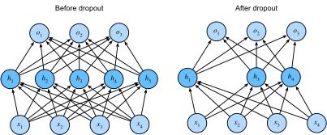

{.python .input}
%load_ext d2lbook.tab
tab.interact_select(['mxnet', 'pytorch', 'tensorflow', 'jax'])
```

# ドロップアウト
:label:`sec_dropout`

**ドロップアウト** は、深層学習モデルの学習時に一部のニューロンをランダムに無効化し、特定のニューロンへの過度な依存を防ぐことで、モデルの汎化性能を高める強力な正則化手法である。

まず、優れた予測モデルに何を期待するかを考えよう。
未知のデータに対しても高い性能を示すことが望ましい。
古典的な汎化理論は、訓練性能とテスト性能の差を小さくするには、
単純なモデルを目指すべきだと示唆する。
単純さは、しばしば次元数の少なさとして現れる。
これは、:numref:`sec_generalization_basics` で線形モデルの単項式基底関数を議論した際に見たとおりである。
さらに、:numref:`sec_weight_decay` で重み減衰（$\ell_2$ 正則化）を扱ったときに見たように、
パラメータのノルムの小ささも単純さの有用な尺度である。
単純さのもう1つの重要な概念は滑らかさであり、これは関数が入力の微小な変化に過度に敏感でないことを意味する。
たとえば、画像分類では、画素に多少のランダムノイズを加えても
予測が大きく変わらないことが期待される。

:citet:`Bishop.1995` は、入力にノイズを加えて学習することが
チホノフ正則化と等価であることを示し、この考えを定式化した。
この研究は、関数の滑らかさ（したがって単純さ）と、
入力の摂動に対する頑健性との間に、明確な数学的関係があることを示した。

その後、:citet:`Srivastava.Hinton.Krizhevsky.ea.2014` は、
Bishop の考えをネットワークの内部層にも適用する巧妙な方法を提案した。
*ドロップアウト* と呼ばれるこの手法は、順伝播で内部層を計算する際にノイズを注入するものであり、
ニューラルネットワークの学習における標準的な手法となっている。
この手法が *dropout* と呼ばれるのは、学習中に実際にいくつかのニューロンを
*drop out*（脱落）させるからである。
学習の各反復において、標準的なドロップアウトは、次の層を計算する前に
各層のノードの一定割合をゼロにする。

明確にしておくと、Bishop との関係づけはここでの解釈である。
ドロップアウトの原論文は、性生殖との興味深い類推によって直感を与えている。
著者らは、ニューラルネットワークの過学習を、
各層が前の層の特定の活性化パターンに依存している状態として特徴づけ、
これを *co-adaptation* と呼んだ。
彼らによれば、ドロップアウトは co-adaptation を壊すものであり、
性生殖が共適応した遺伝子の組合せを壊すのと同様だという。
この説明の妥当性には議論の余地があるが、
ドロップアウトという手法自体は長く使われ続けており、
さまざまな変種がほとんどの深層学習ライブラリに実装されている。 


重要なのは、このノイズをどのように注入するかである。
1つの考え方は、他の層を固定したときに各層の期待値がノイズなしの場合の値と等しくなるよう、
*不偏* にノイズを注入することである。
Bishop の研究では、線形モデルの入力にガウスノイズを加えた。
各学習反復で、平均0の分布からサンプルしたノイズ
$\epsilon \sim \mathcal{N}(0,\sigma^2)$ を入力 $\mathbf{x}$ に加え、
摂動後の点 $\mathbf{x}' = \mathbf{x} + \epsilon$ を得る。
期待値では、$E[\mathbf{x}'] = \mathbf{x}$ である。

標準的なドロップアウト正則化では、各層のノードの一定割合をゼロにし、
その後、残った（ドロップされなかった）ノードの割合で正規化することで、
各層を *補正* する。
言い換えると、
*ドロップアウト確率* $p$ に対して、
各中間活性化 $h$ を次のランダム変数 $h'$ に置き換える。

$$
\begin{aligned}
h' =
\begin{cases}
    0 & \textrm{ with probability } p \\
    \frac{h}{1-p} & \textrm{ otherwise}
\end{cases}
\end{aligned}
$$

このように設計することで、期待値は変わらず、すなわち $E[h'] = h$ となる。

```{.python .input}
%%tab mxnet
from d2l import mxnet as d2l
from mxnet import autograd, gluon, init, np, npx
from mxnet.gluon import nn
npx.set_np()
```

```{.python .input}
%%tab pytorch
from d2l import torch as d2l
import torch
from torch import nn
```

```{.python .input}
%%tab tensorflow
from d2l import tensorflow as d2l
import tensorflow as tf
```

```{.python .input}
%%tab jax
from d2l import jax as d2l
from flax import linen as nn
from functools import partial
import jax
from jax import numpy as jnp
import optax
```

## 実際のドロップアウト

:numref:`fig_mlp` の、1つの隠れ層と5個の隠れユニットをもつ MLP を思い出そう。
隠れ層にドロップアウトを適用し、各隠れユニットを確率 $p$ でゼロにすると、
結果として元のニューロンの部分集合だけからなるネットワークとみなせる。
:numref:`fig_dropout2` では、$h_2$ と $h_5$ が取り除かれている。
その結果、出力の計算はもはや $h_2$ や $h_5$ に依存せず、
逆伝播の際にはそれらに対応する勾配も消える。
このようにして、出力層の計算が $h_1, \ldots, h_5$ の特定の要素に
過度に依存することを防げる。


:label:`fig_dropout2`

通常、テスト時にはドロップアウトを無効にする。
学習済みモデルと新しいデータ例が与えられたときには、どのノードもドロップしないため、
正規化も不要である。
ただし、例外もある。
一部の研究者は、ニューラルネットワーク予測の *不確実性* を推定するヒューリスティックとして、
テスト時にもドロップアウトを用いる。
多様なドロップアウトマスクの下でも予測が一貫していれば、
そのネットワークはより高い確信をもっているとみなせるかもしれない。

## ゼロからの実装

単一層に対するドロップアウト関数を実装するには、
その層と同じ次元数をもつベルヌーイ（二値）確率変数をサンプルすればよい。
この確率変数は、確率 $1-p$ で値 $1$（保持）を、確率 $p$ で値 $0$（ドロップ）を取る。
これを実装する簡単な方法は、まず一様分布 $U[0, 1]$ からサンプルを生成し、
対応するサンプルが $p$ より大きいノードを保持し、それ以外をドロップすることである。

以下のコードでは、[**テンソル入力 `X` の要素を確率 `dropout` でドロップする `dropout_layer` 関数を実装し**]、
上で説明したように残りを再スケーリングする。
すなわち、生き残った要素を `1.0-dropout` で割る。

```{.python .input}
%%tab mxnet
def dropout_layer(X, dropout):
    assert 0 <= dropout <= 1
    if dropout == 1: return np.zeros_like(X)
    mask = np.random.uniform(0, 1, X.shape) > dropout
    return mask.astype(np.float32) * X / (1.0 - dropout)
```

```{.python .input}
%%tab pytorch
def dropout_layer(X, dropout):
    assert 0 <= dropout <= 1
    if dropout == 1: return torch.zeros_like(X)
    mask = (torch.rand(X.shape) > dropout).float()
    return mask * X / (1.0 - dropout)
```

```{.python .input}
%%tab tensorflow
def dropout_layer(X, dropout):
    assert 0 <= dropout <= 1
    if dropout == 1: return tf.zeros_like(X)
    mask = tf.random.uniform(
        shape=tf.shape(X), minval=0, maxval=1) < 1 - dropout
    return tf.cast(mask, dtype=tf.float32) * X / (1.0 - dropout)
```

```{.python .input}
%%tab jax
def dropout_layer(X, dropout, key=d2l.get_key()):
    assert 0 <= dropout <= 1
    if dropout == 1: return jnp.zeros_like(X)
    mask = jax.random.uniform(key, X.shape) > dropout
    return jnp.asarray(mask, dtype=jnp.float32) * X / (1.0 - dropout)
```

いくつかの例で `dropout_layer` 関数を[**試してみよう**]。
以下のコードでは、
入力 `X` に対して、ドロップアウト確率 0、0.5、1 をそれぞれ適用する。

```{.python .input}
%%tab pytorch
X = torch.arange(16, dtype = torch.float32).reshape((2, 8))
print('dropout_p = 0:', dropout_layer(X, 0))
print('dropout_p = 0.5:', dropout_layer(X, 0.5))
print('dropout_p = 1:', dropout_layer(X, 1))
```

```{.python .input}
%%tab mxnet
X = np.arange(16).reshape(2, 8)
print('dropout_p = 0:', dropout_layer(X, 0))
print('dropout_p = 0.5:', dropout_layer(X, 0.5))
print('dropout_p = 1:', dropout_layer(X, 1))
```

```{.python .input}
%%tab jax
X = jnp.arange(16, dtype=jnp.float32).reshape(2, 8)
print('dropout_p = 0:', dropout_layer(X, 0))
print('dropout_p = 0.5:', dropout_layer(X, 0.5))
print('dropout_p = 1:', dropout_layer(X, 1))
```

```{.python .input}
%%tab tensorflow
X = tf.reshape(tf.range(16, dtype=tf.float32), (2, 8))
print('dropout_p = 0:', dropout_layer(X, 0))
print('dropout_p = 0.5:', dropout_layer(X, 0.5))
print('dropout_p = 1:', dropout_layer(X, 1))
```

### モデルの定義

以下のモデルでは、各隠れ層の出力（活性化関数の後）にドロップアウトを適用する。
層ごとに異なるドロップアウト確率を設定できる。
一般には、入力層に近いほどドロップアウト確率を小さくする。
また、ドロップアウトは学習時にのみ有効にする。

```{.python .input}
%%tab mxnet
class DropoutMLPScratch(d2l.Classifier):
    def __init__(self, num_outputs, num_hiddens_1, num_hiddens_2,
                 dropout_1, dropout_2, lr):
        super().__init__()
        self.save_hyperparameters()
        self.lin1 = nn.Dense(num_hiddens_1, activation='relu')
        self.lin2 = nn.Dense(num_hiddens_2, activation='relu')
        self.lin3 = nn.Dense(num_outputs)
        self.initialize()

    def forward(self, X):
        H1 = self.lin1(X)
        if autograd.is_training():
            H1 = dropout_layer(H1, self.dropout_1)
        H2 = self.lin2(H1)
        if autograd.is_training():
            H2 = dropout_layer(H2, self.dropout_2)
        return self.lin3(H2)
```

```{.python .input}
%%tab pytorch
class DropoutMLPScratch(d2l.Classifier):
    def __init__(self, num_outputs, num_hiddens_1, num_hiddens_2,
                 dropout_1, dropout_2, lr):
        super().__init__()
        self.save_hyperparameters()
        self.lin1 = nn.LazyLinear(num_hiddens_1)
        self.lin2 = nn.LazyLinear(num_hiddens_2)
        self.lin3 = nn.LazyLinear(num_outputs)
        self.relu = nn.ReLU()

    def forward(self, X):
        H1 = self.relu(self.lin1(X.reshape((X.shape[0], -1))))
        if self.training:  
            H1 = dropout_layer(H1, self.dropout_1)
        H2 = self.relu(self.lin2(H1))
        if self.training:
            H2 = dropout_layer(H2, self.dropout_2)
        return self.lin3(H2)
```

```{.python .input}
%%tab tensorflow
class DropoutMLPScratch(d2l.Classifier):
    def __init__(self, num_outputs, num_hiddens_1, num_hiddens_2,
                 dropout_1, dropout_2, lr):
        super().__init__()
        self.save_hyperparameters()
        self.lin1 = tf.keras.layers.Dense(num_hiddens_1, activation='relu')
        self.lin2 = tf.keras.layers.Dense(num_hiddens_2, activation='relu')
        self.lin3 = tf.keras.layers.Dense(num_outputs)

    def forward(self, X):
        H1 = self.lin1(tf.reshape(X, (X.shape[0], -1)))
        if self.training:
            H1 = dropout_layer(H1, self.dropout_1)
        H2 = self.lin2(H1)
        if self.training:
            H2 = dropout_layer(H2, self.dropout_2)
        return self.lin3(H2)
```

```{.python .input}
%%tab jax
class DropoutMLPScratch(d2l.Classifier):
    num_hiddens_1: int
    num_hiddens_2: int
    num_outputs: int
    dropout_1: float
    dropout_2: float
    lr: float
    training: bool = True

    def setup(self):
        self.lin1 = nn.Dense(self.num_hiddens_1)
        self.lin2 = nn.Dense(self.num_hiddens_2)
        self.lin3 = nn.Dense(self.num_outputs)
        self.relu = nn.relu

    def forward(self, X):
        H1 = self.relu(self.lin1(X.reshape(X.shape[0], -1)))
        if self.training:
            H1 = dropout_layer(H1, self.dropout_1)
        H2 = self.relu(self.lin2(H1))
        if self.training:
            H2 = dropout_layer(H2, self.dropout_2)
        return self.lin3(H2)
```

### [**学習**]

以下は、先に説明した MLP の学習と同様である。

```{.python .input}
%%tab all
hparams = {'num_outputs':10, 'num_hiddens_1':256, 'num_hiddens_2':256,
           'dropout_1':0.5, 'dropout_2':0.5, 'lr':0.1}
model = DropoutMLPScratch(**hparams)
data = d2l.FashionMNIST(batch_size=256)
trainer = d2l.Trainer(max_epochs=10)
trainer.fit(model, data)
```

## [**簡潔な実装**]

高水準 API を使う場合、各全結合層の後に `Dropout` 層を追加し、
コンストラクタの唯一の引数としてドロップアウト確率を渡すだけでよい。
学習中、`Dropout` 層は指定されたドロップアウト確率に従って、
前の層の出力（あるいは同値に次の層への入力）をランダムにドロップする。
学習モードでないとき、`Dropout` 層は単にデータをそのまま通す。

```{.python .input}
%%tab mxnet
class DropoutMLP(d2l.Classifier):
    def __init__(self, num_outputs, num_hiddens_1, num_hiddens_2,
                 dropout_1, dropout_2, lr):
        super().__init__()
        self.save_hyperparameters()
        self.net = nn.Sequential()
        self.net.add(nn.Dense(num_hiddens_1, activation="relu"),
                     nn.Dropout(dropout_1),
                     nn.Dense(num_hiddens_2, activation="relu"),
                     nn.Dropout(dropout_2),
                     nn.Dense(num_outputs))
        self.net.initialize()
```

```{.python .input}
%%tab pytorch
class DropoutMLP(d2l.Classifier):
    def __init__(self, num_outputs, num_hiddens_1, num_hiddens_2,
                 dropout_1, dropout_2, lr):
        super().__init__()
        self.save_hyperparameters()
        self.net = nn.Sequential(
            nn.Flatten(), nn.LazyLinear(num_hiddens_1), nn.ReLU(), 
            nn.Dropout(dropout_1), nn.LazyLinear(num_hiddens_2), nn.ReLU(), 
            nn.Dropout(dropout_2), nn.LazyLinear(num_outputs))
```

```{.python .input}
%%tab tensorflow
class DropoutMLP(d2l.Classifier):
    def __init__(self, num_outputs, num_hiddens_1, num_hiddens_2,
                 dropout_1, dropout_2, lr):
        super().__init__()
        self.save_hyperparameters()
        self.net = tf.keras.models.Sequential([
            tf.keras.layers.Flatten(),
            tf.keras.layers.Dense(num_hiddens_1, activation=tf.nn.relu),
            tf.keras.layers.Dropout(dropout_1),
            tf.keras.layers.Dense(num_hiddens_2, activation=tf.nn.relu),
            tf.keras.layers.Dropout(dropout_2),
            tf.keras.layers.Dense(num_outputs)])
```

```{.python .input}
%%tab jax
class DropoutMLP(d2l.Classifier):
    num_hiddens_1: int
    num_hiddens_2: int
    num_outputs: int
    dropout_1: float
    dropout_2: float
    lr: float
    training: bool = True

    @nn.compact
    def __call__(self, X):
        x = nn.relu(nn.Dense(self.num_hiddens_1)(X.reshape((X.shape[0], -1))))
        x = nn.Dropout(self.dropout_1, deterministic=not self.training)(x)
        x = nn.relu(nn.Dense(self.num_hiddens_2)(x))
        x = nn.Dropout(self.dropout_2, deterministic=not self.training)(x)
        return nn.Dense(self.num_outputs)(x)
```

:begin_tab:`jax`
ドロップアウト層を含むネットワークで `Module.apply()` を使う場合、PRNGKey が必要になるため、
損失関数を再定義する必要があることに注意されたい。
また、この RNG シードは明示的に `dropout` という名前で渡す必要がある。
このキーは Flax の `dropout` 層が内部でランダムなドロップアウトマスクを生成するために用いる。
学習ループの各エポックで一意な `dropout_rng` キーを使うことが重要である。
そうしないと、生成されるドロップアウトマスクが確率的にならず、エポックごとに変化しない。
この `dropout_rng` は
:numref:`oo-design-training` で定義した `d2l.Trainer` クラスの `TrainState` オブジェクトに属性として保存でき、
各エポックで新しい `dropout_rng` に置き換えられる。
これは、:numref:`sec_linear_scratch` で定義した `fit_epoch` メソッドですでに処理してある。
:end_tab:

```{.python .input}
%%tab jax
@d2l.add_to_class(d2l.Classifier)  #@save
@partial(jax.jit, static_argnums=(0, 5))
def loss(self, params, X, Y, state, averaged=True):
    Y_hat = state.apply_fn({'params': params}, *X,
                           mutable=False,  # 後で使用する（例: バッチ正規化）
                           rngs={'dropout': state.dropout_rng})
    Y_hat = d2l.reshape(Y_hat, (-1, Y_hat.shape[-1]))
    Y = d2l.reshape(Y, (-1,))
    fn = optax.softmax_cross_entropy_with_integer_labels
    # 返される空の辞書は補助データのプレースホルダである。
    # 後で使用される（例: バッチ正規化用）
    return (fn(Y_hat, Y).mean(), {}) if averaged else (fn(Y_hat, Y), {})
```

次に、[**モデルを学習する**]。

```{.python .input}
%%tab all
model = DropoutMLP(**hparams)
trainer.fit(model, data)
```

## まとめ

次元数や重みベクトルの大きさを制御することに加えて、ドロップアウトは過学習を避けるためのもう1つの手段である。
多くの場合、これらの手法は組み合わせて用いる。
ドロップアウトは学習時にのみ使うことに注意されたい。
これは、活性化 $h$ を、期待値が $h$ に等しいランダム変数で置き換える操作である。


## 演習

1. 1層目と2層目のドロップアウト確率を変えるとどうなるか。特に、両方の層の確率を入れ替えるとどうなるか。これらの問いに答える実験を設計し、結果を定量的に示し、定性的な要点をまとめなさい。
1. エポック数を増やし、ドロップアウトを使う場合と使わない場合の結果を比較しなさい。
1. ドロップアウトを適用する場合としない場合で、各隠れ層の活性化の分散はどの程度か。この量が時間とともにどのように変化するかを、両方のモデルについてプロットしなさい。
1. なぜドロップアウトは通常テスト時には使わないのだろうか。
1. この節のモデルを例に、ドロップアウトと重み減衰の効果を比較しなさい。ドロップアウトと重み減衰を同時に使うとどうなるか。効果は加算的だろうか。それとも逓減するか、あるいは悪化するか。互いに打ち消し合うだろうか。
1. 活性化ではなく、重み行列の個々の重みにドロップアウトを適用するとどうなるか。
1. 標準的なドロップアウトとは異なる、各層にランダムノイズを注入する別の手法を考案しなさい。Fashion-MNIST データセットで、固定したアーキテクチャに対してドロップアウトを上回る方法を開発できるだろうか。