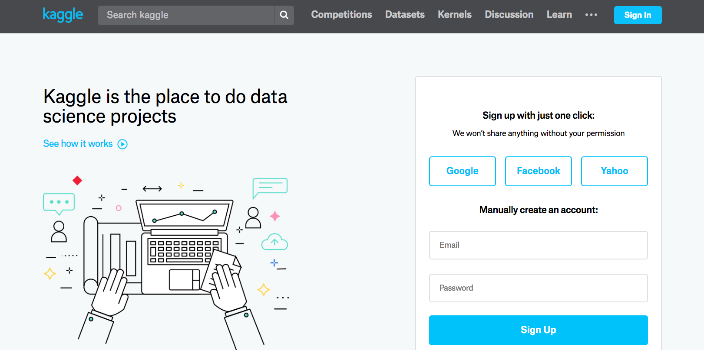
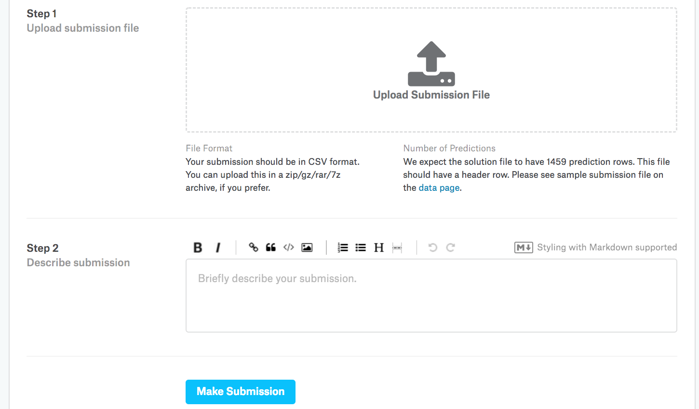

{.python .input  n=1}
%load_ext d2lbook.tab
tab.interact_select(['mxnet', 'pytorch', 'tensorflow', 'jax'])
```

# Kaggleで住宅価格を予測する
:label:`sec_kaggle_house`

ここまでで、深層ネットワークを構築・学習するための基本的な道具を導入し、
さらに重み減衰やドロップアウトといった手法でそれらを正則化する方法も学んだ。
いよいよ、Kaggleコンペティションに参加して、
これまでの知識を実践に移す準備が整った。
住宅価格予測コンペティションは、始めるのに最適な題材である。
データは比較的一般的で、音声や動画のように特殊なモデルを必要とするような
特異な構造は含んでいない。
このデータセットは :citet:`De-Cock.2011` によって収集されたもので、
2006--2010年のアイオワ州エイムズの住宅価格を扱っている。
これは、Harrison と Rubinfeld (1978) による有名な [Boston housing dataset](https://archive.ics.uci.edu/ml/machine-learning-databases/housing/housing.names)
よりもかなり大きく、データ例の数も特徴量の数も多くなっている。


この節では、データ前処理、モデル設計、ハイパーパラメータ選択の詳細を順に説明する。
実践的なアプローチを通じて、
データサイエンティストとしてのキャリアに役立つ直感を
身につけてもらえればと思う。

```{.python .input}
%%tab mxnet
%matplotlib inline
from d2l import mxnet as d2l
from mxnet import gluon, autograd, init, np, npx
from mxnet.gluon import nn
import pandas as pd

npx.set_np()
```

```{.python .input}
%%tab pytorch
%matplotlib inline
from d2l import torch as d2l
import torch
from torch import nn
import pandas as pd
```

```{.python .input}
%%tab tensorflow
%matplotlib inline
from d2l import tensorflow as d2l
import tensorflow as tf
import pandas as pd
```

```{.python .input}
%%tab jax
%matplotlib inline
from d2l import jax as d2l
import jax
from jax import numpy as jnp
import numpy as np
import pandas as pd
```

## データのダウンロード

本書を通して、さまざまなダウンロード済みデータセットを用いてモデルを学習・評価する。
ここでは、zip または tar ファイルをダウンロードして展開するための
[**2つのユーティリティ関数を実装**]する。
ここでも、そのようなユーティリティ関数の実装詳細は省略する。

```{.python .input  n=2}
%%tab all
def download(url, folder, sha1_hash=None):
    """Download a file to folder and return the local filepath."""

def extract(filename, folder):
    """Extract a zip/tar file into folder."""
```

## Kaggle

[Kaggle](https://www.kaggle.com) は、機械学習コンペティションを開催する
人気のあるプラットフォームである。
各コンペティションは1つのデータセットを中心に構成されており、
多くは賞金を提供する利害関係者によって後援されている。
このプラットフォームは、フォーラムや共有コードを通じて
ユーザー同士の交流を支援し、
協力と競争の両方を促進する。
ランキング上位を追い求めるあまり暴走し、
研究者が本質的な問いを立てることよりも前処理の細部に
視野狭窄的に集中してしまうことも少なくないが、
一方で、競合手法を直接定量比較できるようにする
プラットフォームの客観性には大きな価値がある。
さらに、コード共有によって
何がうまくいき、何がうまくいかなかったのかを
誰もが学べるようになる。
Kaggleコンペティションに参加したい場合は、
まずアカウント登録が必要である。
(:numref:`fig_kaggle` を参照)。


:width:`400px`
:label:`fig_kaggle`

:numref:`fig_house_pricing` に示すように、住宅価格予測コンペティションのページでは、
データセットを見つけたり（"Data" タブの下）、
予測を提出したり、順位を確認したりできる。
URL は次のとおりである。

> https://www.kaggle.com/c/house-prices-advanced-regression-techniques


:width:`400px`
:label:`fig_house_pricing`

## データセットへのアクセスと読み込み

コンペティションのデータは
訓練セットとテストセットに分かれていることに注意されたい。
各レコードには住宅の資産価値と、
道路の種類、建築年、屋根の種類、地下室の状態などの属性が含まれる。
特徴量にはさまざまなデータ型が含まれている。
たとえば、建築年は整数で表され、
屋根の種類は離散的なカテゴリ割り当てで表され、
その他の特徴量は浮動小数点数で表される。
そして、ここで現実の厄介さが出てくる。
一部のデータ例ではデータが完全に欠落しており、
欠損値は単に "na" として示されている。
各住宅の価格は訓練セットにのみ含まれている
（コンペティションなのだから当然である）。
訓練セットを分割して検証セットを作りたいところであるが、
Kaggle に予測をアップロードした後でしか
公式テストセット上でモデルを評価できない。
:numref:`fig_house_pricing` のコンペティションタブにある "Data" タブには、
データをダウンロードするためのリンクがある。

まずは、 :numref:`sec_pandas` で紹介した `pandas` を使って
[**データを読み込み、処理**]してみよう。
便宜上、Kaggle の住宅データセットをダウンロードしてキャッシュできる。
このデータセットに対応するファイルがすでにキャッシュディレクトリに存在し、
その SHA-1 が `sha1_hash` と一致する場合、冗長なダウンロードで
インターネット回線を無駄にしないよう、キャッシュ済みファイルを使用する。

```{.python .input  n=30}
%%tab all
class KaggleHouse(d2l.DataModule):
    def __init__(self, batch_size, train=None, val=None):
        super().__init__()
        self.save_hyperparameters()
        if self.train is None:
            self.raw_train = pd.read_csv(d2l.download(
                d2l.DATA_URL + 'kaggle_house_pred_train.csv', self.root,
                sha1_hash='585e9cc93e70b39160e7921475f9bcd7d31219ce'))
            self.raw_val = pd.read_csv(d2l.download(
                d2l.DATA_URL + 'kaggle_house_pred_test.csv', self.root,
                sha1_hash='fa19780a7b011d9b009e8bff8e99922a8ee2eb90'))
```

訓練データセットには 1460 個のデータ例、80 個の特徴量、1 個のラベルが含まれ、
一方で検証データには 1459 個の例と 80 個の特徴量が含まれている。

```{.python .input  n=31}
%%tab all
data = KaggleHouse(batch_size=64)
print(data.raw_train.shape)
print(data.raw_val.shape)
```

## データ前処理

最初の4つのデータ例について、最初の4つと最後の2つの特徴量、およびラベル（SalePrice）を
[**見てみましょう**]。

```{.python .input  n=10}
%%tab all
print(data.raw_train.iloc[:4, [0, 1, 2, 3, -3, -2, -1]])
```

各データ例では、最初の特徴量が識別子であることがわかる。
これはモデルが各訓練データ例を区別するのに役立ちる。
便利ではあるが、予測の目的には何の情報も持たない。
したがって、モデルにデータを入力する前に、
この特徴量はデータセットから削除する。
さらに、さまざまなデータ型が混在しているため、
モデリングを始める前にデータ前処理が必要になる。


まず数値特徴量から始めよう。
最初にヒューリスティックとして、
[**すべての欠損値を対応する特徴量の平均値で置き換える。**]
その後、すべての特徴量を共通の尺度にそろえるために、
[**データを標準化し、特徴量を平均0・分散1に再スケーリングする**]:

$$x \leftarrow \frac{x - \mu}{\sigma},$$

ここで $\mu$ と $\sigma$ はそれぞれ平均と標準偏差を表す。
これにより特徴量（変数）が本当に平均0・分散1になることを確認するには、
$E[\frac{x-\mu}{\sigma}] = \frac{\mu - \mu}{\sigma} = 0$ であり、
また $E[(x-\mu)^2] = (\sigma^2 + \mu^2) - 2\mu^2+\mu^2 = \sigma^2$ であることに注意されたい。
直感的には、データを標準化する理由は2つある。
第1に、最適化に都合がよいことである。
第2に、どの特徴量が関連するかを *a priori* に知ることはできないので、
ある特徴量に割り当てられた係数を他よりも強く罰したくないからである。

[**次に離散値を扱う。**]
これには "MSZoning" のような特徴量が含まれる。
[**これらは one-hot エンコーディングで置き換える**]
これは、先に多クラスラベルをベクトルに変換したときと同じ方法である
(:numref:`subsec_classification-problem` を参照)。
たとえば、"MSZoning" は "RL" と "RM" の値を取る。
"MSZoning" 特徴量を削除すると、
値が 0 か 1 の2つの新しい指示特徴量
"MSZoning_RL" と "MSZoning_RM" が作成される。
one-hot エンコーディングに従えば、
元の "MSZoning" の値が "RL" なら、
"MSZoning_RL" は 1 で "MSZoning_RM" は 0 である。
`pandas` パッケージはこれを自動的に行ってくれる。

```{.python .input  n=32}
%%tab all
@d2l.add_to_class(KaggleHouse)
def preprocess(self):
    # Remove the ID and label columns
    label = 'SalePrice'
    features = pd.concat(
        (self.raw_train.drop(columns=['Id', label]),
         self.raw_val.drop(columns=['Id'])))
    # Standardize numerical columns
    numeric_features = features.dtypes[features.dtypes!='object'].index
    features[numeric_features] = features[numeric_features].apply(
        lambda x: (x - x.mean()) / (x.std()))
    # Replace NAN numerical features by 0
    features[numeric_features] = features[numeric_features].fillna(0)
    # Replace discrete features by one-hot encoding
    features = pd.get_dummies(features, dummy_na=True)
    # Save preprocessed features
    self.train = features[:self.raw_train.shape[0]].copy()
    self.train[label] = self.raw_train[label]
    self.val = features[self.raw_train.shape[0]:].copy()
```

この変換によって、特徴量の数が 79 から 331 に増えることがわかる
（ID 列とラベル列を除く）。

```{.python .input  n=33}
%%tab all
data.preprocess()
data.train.shape
```

## 誤差尺度

まずは二乗損失を用いた線形モデルを学習してみよう。
当然ながら、この線形モデルがコンペティションで勝てる提出につながることはないが、
データの中に意味のある情報があるかどうかを確認するための健全性チェックにはなる。
ここでランダム予測よりも良い結果が出せないなら、
データ処理にバグがある可能性が高いだろう。
そして、うまくいくなら、線形モデルはベースラインとして機能し、
単純なモデルが最良報告モデルにどれくらい近づけるのかについての直感を与え、
より洗練されたモデルからどれほどの改善が期待できるかの目安になる。

住宅価格では、株価と同様に、
絶対量よりも相対量のほうが重要である。
したがって、[**絶対誤差 $y - \hat{y}$ よりも
相対誤差 $\frac{y - \hat{y}}{y}$ のほうを重視する傾向がある**]。
たとえば、オハイオ州の田舎で住宅価格を推定していて、
典型的な住宅の価値が 125,000 ドルであるときに、
予測が 100,000 ドル外れたとしたら、
おそらくひどい出来である。
一方、カリフォルニア州ロスアルトスヒルズで同じだけ外れたとしても、
それは驚くほど正確な予測かもしれない
（そこでは住宅価格の中央値が 400 万ドルを超える）。

[**この問題に対処する1つの方法は、
価格推定の対数における差を測ることである。**]
実際、これはコンペティションが提出物の品質を評価するために用いている
公式の誤差尺度でもありる。
結局のところ、$|\log y - \log \hat{y}| \leq \delta$ のような小さな値 $\delta$ は、
$e^{-\delta} \leq \frac{\hat{y}}{y} \leq e^\delta$ に対応しる。
これにより、予測価格の対数とラベル価格の対数の間の
次の二乗平均平方根誤差が得られる。

$$\sqrt{\frac{1}{n}\sum_{i=1}^n\left(\log y_i -\log \hat{y}_i\right)^2}.$$

```{.python .input  n=60}
%%tab all
@d2l.add_to_class(KaggleHouse)
def get_dataloader(self, train):
    label = 'SalePrice'
    data = self.train if train else self.val
    if label not in data: return
    get_tensor = lambda x: d2l.tensor(x.values.astype(float),
                                      dtype=d2l.float32)
    # Logarithm of prices 
    tensors = (get_tensor(data.drop(columns=[label])),  # X
               d2l.reshape(d2l.log(get_tensor(data[label])), (-1, 1)))  # Y
    return self.get_tensorloader(tensors, train)
```

## $K$-分割交差検証

:ref:`subsec_generalization-model-selection` で
[**交差検証**] を導入し、モデル選択の扱いについて議論したことを思い出してほしい。
ここではそれを活用して、モデル設計の選択やハイパーパラメータの調整を行う。
まず、$K$-分割交差検証手順におけるデータの
$i^\textrm{th}$ 分割を返す関数が必要である。
これは、$i^\textrm{th}$ 区間を検証データとして切り出し、
残りを訓練データとして返す。
これはデータの扱いとして最も効率的な方法ではないことに注意されたい。
データセットがかなり大きい場合には、
もっと賢い方法を確実に採るだろう。
しかし、この問題は単純なので、
そのような追加の複雑さはコードを不必要にわかりにくくしてしまうかもしれない。
したがって、ここでは省略しても問題ない。

```{.python .input}
%%tab all
def k_fold_data(data, k):
    rets = []
    fold_size = data.train.shape[0] // k
    for j in range(k):
        idx = range(j * fold_size, (j+1) * fold_size)
        rets.append(KaggleHouse(data.batch_size, data.train.drop(index=idx),  
                                data.train.loc[idx]))    
    return rets
```

$K$ 回学習したときの [**平均検証誤差が返される**]。
$K$-分割交差検証では、これを用いる。

```{.python .input}
%%tab all
def k_fold(trainer, data, k, lr):
    val_loss, models = [], []
    for i, data_fold in enumerate(k_fold_data(data, k)):
        model = d2l.LinearRegression(lr)
        model.board.yscale='log'
        if i != 0: model.board.display = False
        trainer.fit(model, data_fold)
        val_loss.append(float(model.board.data['val_loss'][-1].y))
        models.append(model)
    print(f'average validation log mse = {sum(val_loss)/len(val_loss)}')
    return models
```

## [**モデル選択**]

この例では、調整していないハイパーパラメータの組を選び、
モデルの改善は読者に委ねる。
適切な選択を見つけるには、
最適化する変数の数に応じて時間がかかることがある。
十分に大きなデータセットと通常の種類のハイパーパラメータであれば、
$K$-分割交差検証は複数回の試行に対して
かなり頑健である傾向がある。
しかし、非現実的に多くの選択肢を試すと、
検証性能が真の誤差をもはや代表しなくなるかもしれない。

```{.python .input}
%%tab all
trainer = d2l.Trainer(max_epochs=10)
models = k_fold(trainer, data, k=5, lr=0.01)
```

ときには、あるハイパーパラメータ集合に対する訓練誤差の数が非常に少ないのに、
$K$-分割交差検証での誤差数はかなり大きくなることがある。
これは過学習していることを示している。
学習中は、この2つの数値の両方を監視したいところである。
過学習が小さいということは、データがより強力なモデルを支えられる可能性を示しているかもしれない。
大きな過学習は、正則化手法を取り入れることで改善できることを示唆しているかもしれない。

##  [**Kaggle への予測提出**]

良いハイパーパラメータの選び方がわかったので、
$K$ 個のモデルすべてによるテストセット上の予測の平均を
計算してみよう。
予測を csv ファイルに保存しておくと、
Kaggle への結果アップロードが簡単になる。
次のコードは `submission.csv` というファイルを生成する。

```{.python .input}
%%tab all
if tab.selected('pytorch', 'mxnet', 'tensorflow'):
    preds = [model(d2l.tensor(data.val.values.astype(float), dtype=d2l.float32))
             for model in models]
if tab.selected('jax'):
    preds = [model.apply({'params': trainer.state.params},
             d2l.tensor(data.val.values.astype(float), dtype=d2l.float32))
             for model in models]
# Taking exponentiation of predictions in the logarithm scale
ensemble_preds = d2l.reduce_mean(d2l.exp(d2l.concat(preds, 1)), 1)
submission = pd.DataFrame({'Id':data.raw_val.Id,
                           'SalePrice':d2l.numpy(ensemble_preds)})
submission.to_csv('submission.csv', index=False)
```

次に、 :numref:`fig_kaggle_submit2` に示すように、
Kaggle に予測を提出し、
テストセット上の実際の住宅価格（ラベル）とどの程度一致しているかを確認できる。
手順はとても簡単である。

* Kaggle のウェブサイトにログインし、住宅価格予測コンペティションのページを開く。
* “Submit Predictions” または “Late Submission” ボタンをクリックする。
* ページ下部の点線枠内にある “Upload Submission File” ボタンをクリックし、アップロードしたい予測ファイルを選択する。
* ページ下部の “Make Submission” ボタンをクリックして結果を表示する。


:width:`400px`
:label:`fig_kaggle_submit2`

## まとめと考察

実データにはしばしばさまざまなデータ型が混在しており、前処理が必要である。
実数値データを平均0・分散1に再スケーリングするのは良いデフォルトである。
欠損値を平均値で置き換えるのも同様である。
さらに、カテゴリ特徴量を指示特徴量に変換すると、
それらを one-hot ベクトルとして扱えるようになりる。
絶対誤差よりも相対誤差を重視する傾向がある場合には、
予測の対数における差を測ることができる。
モデルを選択し、ハイパーパラメータを調整するには、
$K$-分割交差検証を使える。


## 演習

1. この節の予測を Kaggle に提出してみしよう。どの程度の成績でしたか？
1. 欠損値を平均値で置き換えるのは常に良い考えだろうか？ ヒント: 値がランダムに欠損していない状況を構成できるか？
1. $K$-分割交差検証によってハイパーパラメータを調整し、スコアを改善ししよう。
1. モデルを改善することでスコアを改善しましょう（たとえば、層、重み減衰、ドロップアウト）。
1. この節で行ったように連続数値特徴量を標準化しないとどうなるか？


