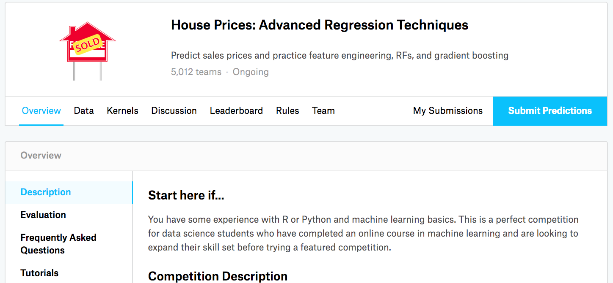
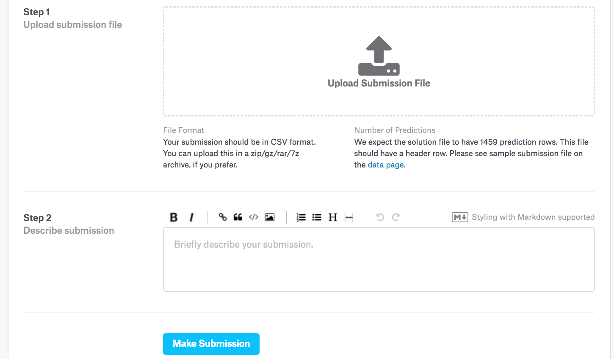

{.python .input  n=1}
%load_ext d2lbook.tab
tab.interact_select(['mxnet', 'pytorch', 'tensorflow', 'jax'])
```

# Kaggleで住宅価格を予測する
:label:`sec_kaggle_house`

ここまでで、深層ネットワークを構築して学習するための基本的な道具を導入し、さらに重み減衰やドロップアウトによる正則化の方法も学んだ。いよいよKaggleコンペティションに参加し、これまでの知識を実践に移す準備が整った。住宅価格予測コンペティションは、その第一歩として格好の題材である。データは比較的汎用的であり、音声や映像のように特殊なモデルを必要とする独特の構造を持たない。このデータセットは :citet:`De-Cock.2011` によって収集されたもので、2006--2010年のアイオワ州エイムズにおける住宅価格を扱っている。有名な [Boston housing dataset](https://archive.ics.uci.edu/ml/machine-learning-databases/housing/housing.names)（Harrison と Rubinfeld, 1978）よりもかなり大規模で、データ例の数も特徴量の数も多い。


この節では、データ前処理、モデル設計、ハイパーパラメータ選択の詳細を順に説明する。実践的な手順を通じて、データサイエンティストとして有用な直感を養うことを目指す。

```{.python .input}
%%tab mxnet
%matplotlib inline
from d2l import mxnet as d2l
from mxnet import gluon, autograd, init, np, npx
from mxnet.gluon import nn
import pandas as pd

npx.set_np()
```

```{.python .input}
%%tab pytorch
%matplotlib inline
from d2l import torch as d2l
import torch
from torch import nn
import pandas as pd
```

```{.python .input}
%%tab tensorflow
%matplotlib inline
from d2l import tensorflow as d2l
import tensorflow as tf
import pandas as pd
```

```{.python .input}
%%tab jax
%matplotlib inline
from d2l import jax as d2l
import jax
from jax import numpy as jnp
import numpy as np
import pandas as pd
```

## データのダウンロード

本書では、さまざまなダウンロード済みデータセットを用いてモデルを学習・評価する。ここでは、zip または tar ファイルをダウンロードして展開するための[**2つのユーティリティ関数を実装**]する。これらの実装の詳細は省略する。

```{.python .input  n=2}
%%tab all
def download(url, folder, sha1_hash=None):
    """Download a file to folder and return the local filepath."""

def extract(filename, folder):
    """Extract a zip/tar file into folder."""
```

## Kaggle

[Kaggle](https://www.kaggle.com) は、機械学習コンペティションを開催する人気の高いプラットフォームである。各コンペティションは1つのデータセットを中心に構成され、多くは賞金を提供するスポンサーによって支えられている。このプラットフォームは、フォーラムやコード共有を通じて参加者同士の交流を促し、協調と競争の両方を生み出す。上位入賞を目指すあまり、研究者が本質的な問いよりも前処理の細部に過度に集中してしまうこともある。しかしその一方で、競合手法を直接かつ定量的に比較できるという客観性には大きな価値がある。さらに、コード共有によって、何が有効で何が有効でなかったかを誰もが学べる。Kaggleコンペティションに参加するには、まずアカウント登録が必要である（:numref:`fig_kaggle`）。


:width:`400px`
:label:`fig_kaggle`

:numref:`fig_house_pricing` に示すように、住宅価格予測コンペティションのページでは、データセットの取得（"Data" タブ）、予測の提出、順位の確認が行える。URL は次のとおりである。

> https://www.kaggle.com/c/house-prices-advanced-regression-techniques


:width:`400px`
:label:`fig_house_pricing`

## データセットへのアクセスと読み込み

コンペティションのデータは訓練セットとテストセットに分かれている。各レコードには住宅価格に加えて、道路の種類、建築年、屋根の種類、地下室の状態などの属性が含まれる。特徴量にはさまざまなデータ型が混在している。たとえば、建築年は整数、屋根の種類は離散カテゴリ、その他の特徴量は浮動小数点数で表される。そして現実のデータらしく、一部のデータ例では値が欠落しており、欠損値は単に "na" として記録されている。各住宅の価格は訓練セットにのみ含まれる（コンペティションである以上当然である）。訓練セットをさらに分割して検証セットを作りたいところだが、公式テストセット上での評価は、Kaggle に予測をアップロードした後でしか得られない。:numref:`fig_house_pricing` のコンペティションページにある "Data" タブから、データをダウンロードできる。

まずは、:numref:`sec_pandas` で紹介した `pandas` を用いて[**データを読み込み、処理**]しよう。便宜のため、Kaggle の住宅データセットはダウンロードしてキャッシュできる。対応するファイルがすでにキャッシュディレクトリに存在し、その SHA-1 が `sha1_hash` と一致する場合には、不要な再ダウンロードを避けてキャッシュ済みファイルを利用する。

```{.python .input  n=30}
%%tab all
class KaggleHouse(d2l.DataModule):
    def __init__(self, batch_size, train=None, val=None):
        super().__init__()
        self.save_hyperparameters()
        if self.train is None:
            self.raw_train = pd.read_csv(d2l.download(
                d2l.DATA_URL + 'kaggle_house_pred_train.csv', self.root,
                sha1_hash='585e9cc93e70b39160e7921475f9bcd7d31219ce'))
            self.raw_val = pd.read_csv(d2l.download(
                d2l.DATA_URL + 'kaggle_house_pred_test.csv', self.root,
                sha1_hash='fa19780a7b011d9b009e8bff8e99922a8ee2eb90'))
```

訓練データセットには 1460 個のデータ例、80 個の特徴量、1 個のラベルが含まれる。一方、検証データには 1459 個のデータ例と 80 個の特徴量が含まれる。

```{.python .input  n=31}
%%tab all
data = KaggleHouse(batch_size=64)
print(data.raw_train.shape)
print(data.raw_val.shape)
```

## データ前処理

最初の4個のデータ例について、先頭4個と末尾2個の特徴量、およびラベル（SalePrice）を[**見てみよう**]。

```{.python .input  n=10}
%%tab all
print(data.raw_train.iloc[:4, [0, 1, 2, 3, -3, -2, -1]])
```

各データ例の最初の特徴量は識別子である。これは各訓練データ例を区別するのには役立つが、予測には何の情報も与えない。したがって、モデルに入力する前にこの特徴量は削除する。また、さまざまなデータ型が混在しているため、モデリングの前に前処理が必要である。


まず数値特徴量を扱う。最初のヒューリスティックとして、[**すべての欠損値を対応する特徴量の平均値で置き換える。**]その後、すべての特徴量を共通の尺度にそろえるため、[**データを標準化し、各特徴量を平均0・分散1に再スケーリングする**]。

$$x \leftarrow \frac{x - \mu}{\sigma},$$

ここで $\mu$ と $\sigma$ はそれぞれ平均と標準偏差である。実際、$E[\frac{x-\mu}{\sigma}] = \frac{\mu - \mu}{\sigma} = 0$ であり、また $E[(x-\mu)^2] = (\sigma^2 + \mu^2) - 2\mu^2+\mu^2 = \sigma^2$ なので、変換後の特徴量は平均0・分散1になる。直感的には、標準化には2つの利点がある。第1に、最適化が容易になる。第2に、どの特徴量が重要かを *a priori* に知ることはできないため、ある特徴量に対応する係数だけを他より強く罰するのは望ましくない。

[**次に離散値を扱う。**]これには "MSZoning" のような特徴量が含まれる。[**これらは one-hot エンコーディングで置き換える**]。これは、以前に多クラスラベルをベクトルへ変換したときと同じ考え方である（:numref:`subsec_classification-problem` を参照）。たとえば、"MSZoning" が "RL" と "RM" の値を取るとする。"MSZoning" を削除すると、値が 0 または 1 の2つの指示特徴量 "MSZoning_RL" と "MSZoning_RM" が新たに作られる。one-hot エンコーディングでは、元の "MSZoning" の値が "RL" なら、"MSZoning_RL" は 1、"MSZoning_RM" は 0 となる。`pandas` はこの処理を自動で行う。

```{.python .input  n=32}
%%tab all
@d2l.add_to_class(KaggleHouse)
def preprocess(self):
    # ID列とラベル列を削除する
    label = 'SalePrice'
    features = pd.concat(
        (self.raw_train.drop(columns=['Id', label]),
         self.raw_val.drop(columns=['Id'])))
    # 数値列を標準化する
    numeric_features = features.dtypes[features.dtypes!='object'].index
    features[numeric_features] = features[numeric_features].apply(
        lambda x: (x - x.mean()) / (x.std()))
    # NANの数値特徴量を0で置換する
    features[numeric_features] = features[numeric_features].fillna(0)
    # 離散特徴をワンホットエンコーディングで置き換える
    features = pd.get_dummies(features, dummy_na=True)
    # 前処理済み特徴量を保存する
    self.train = features[:self.raw_train.shape[0]].copy()
    self.train[label] = self.raw_train[label]
    self.val = features[self.raw_train.shape[0]:].copy()
```

この変換により、特徴量の数は 79 から 331 に増えることがわかる（ID 列とラベル列を除く）。

```{.python .input  n=33}
%%tab all
data.preprocess()
data.train.shape
```

## 誤差尺度

まずは二乗損失を用いた線形モデルを学習してみよう。もちろん、この線形モデルだけでコンペティションに勝てるわけではない。しかし、データに意味のある情報が含まれているかを確認する健全性チェックとしては有用である。ここでランダム予測より良い結果が得られないなら、データ処理にバグがある可能性が高い。逆にうまく機能するなら、線形モデルはベースラインとして役立ち、単純なモデルが最良の報告結果にどの程度近づけるか、またより洗練されたモデルによってどれほど改善できそうかの感覚を与える。

住宅価格では、株価と同様に、絶対量よりも相対量のほうが重要である。したがって、[**絶対誤差 $y - \hat{y}$ よりも、相対誤差 $\frac{y - \hat{y}}{y}$ を重視することが多い**]。たとえば、オハイオ州の地方で典型的な住宅価格が 125,000 ドルだとして、予測が 100,000 ドル外れていれば、それは非常に悪い予測である。一方、カリフォルニア州ロスアルトスヒルズで同じだけ外れたとしても、むしろかなり正確かもしれない（そこでは住宅価格の中央値が 400 万ドルを超える）。

[**この問題に対処する1つの方法は、価格の対数における差を測ることである。**]実際、これはコンペティションが提出物の品質を評価するために用いている公式の誤差尺度でもある。というのも、$|\log y - \log \hat{y}| \leq \delta$ という小さな値 $\delta$ は、$e^{-\delta} \leq \frac{\hat{y}}{y} \leq e^\delta$ に対応するからである。これにより、予測価格の対数と真の価格の対数の間の次の二乗平均平方根誤差が得られる。

$$\sqrt{\frac{1}{n}\sum_{i=1}^n\left(\log y_i -\log \hat{y}_i\right)^2}.$$

```{.python .input  n=60}
%%tab all
@d2l.add_to_class(KaggleHouse)
def get_dataloader(self, train):
    label = 'SalePrice'
    data = self.train if train else self.val
    if label not in data: return
    get_tensor = lambda x: d2l.tensor(x.values.astype(float),
                                      dtype=d2l.float32)
    # Logarithm of prices 
    tensors = (get_tensor(data.drop(columns=[label])),  # X
               d2l.reshape(d2l.log(get_tensor(data[label])), (-1, 1)))  # Y
    return self.get_tensorloader(tensors, train)
```

## $K$-分割交差検証

:ref:`subsec_generalization-model-selection` で[**交差検証**]を導入し、モデル選択について議論したことを思い出してほしい。ここではそれを用いて、モデル設計の選択やハイパーパラメータの調整を行う。まず、$K$-分割交差検証におけるデータの $i^\textrm{th}$ 分割を返す関数が必要である。これは、$i^\textrm{th}$ 区間を検証データとして取り出し、残りを訓練データとして返す。

この方法は、データの扱いとして最も効率的ではない。データセットが非常に大きいなら、より賢い実装を採るべきである。しかし、この問題は比較的単純であり、そうした追加の複雑さはかえってコードを読みにくくするだけかもしれない。したがって、ここでは簡潔さを優先する。

```{.python .input}
%%tab all
def k_fold_data(data, k):
    rets = []
    fold_size = data.train.shape[0] // k
    for j in range(k):
        idx = range(j * fold_size, (j+1) * fold_size)
        rets.append(KaggleHouse(data.batch_size, data.train.drop(index=idx),  
                                data.train.loc[idx]))    
    return rets
```

$K$ 回の学習に対する[**平均検証誤差を返す**]。これが $K$-分割交差検証で用いる量である。

```{.python .input}
%%tab all
def k_fold(trainer, data, k, lr):
    val_loss, models = [], []
    for i, data_fold in enumerate(k_fold_data(data, k)):
        model = d2l.LinearRegression(lr)
        model.board.yscale='log'
        if i != 0: model.board.display = False
        trainer.fit(model, data_fold)
        val_loss.append(float(model.board.data['val_loss'][-1].y))
        models.append(model)
    print(f'average validation log mse = {sum(val_loss)/len(val_loss)}')
    return models
```

## [**モデル選択**]

この例では、特に調整していないハイパーパラメータの組を用い、モデル改善は読者への課題とする。適切な選択を見つけるには、最適化すべき変数の数に応じて時間がかかることがある。十分に大きなデータセットと一般的な種類のハイパーパラメータであれば、$K$-分割交差検証は複数回の試行に対して比較的頑健である。しかし、現実的でないほど多くの選択肢を試すと、検証性能が真の誤差を代表しなくなる可能性がある。

```{.python .input}
%%tab all
trainer = d2l.Trainer(max_epochs=10)
models = k_fold(trainer, data, k=5, lr=0.01)
```

ときには、あるハイパーパラメータ集合に対する訓練誤差が非常に小さいにもかかわらず、$K$-分割交差検証での誤差がかなり大きいことがある。これは過学習を示している。学習中は、これら2つの値をともに監視したい。過学習が小さいなら、データがより強力なモデルを支えられる可能性がある。過学習が大きいなら、正則化手法の導入によって改善できるかもしれない。

##  [**Kaggle への予測提出**]

適切なハイパーパラメータの選び方がわかったので、$K$ 個のモデルすべてによるテストセット上の予測の平均を計算しよう。予測を csv ファイルに保存しておけば、Kaggle へのアップロードが容易になる。次のコードは `submission.csv` というファイルを生成する。

```{.python .input}
%%tab pytorch, mxnet, tensorflow
preds = [model(d2l.tensor(data.val.values.astype(float), dtype=d2l.float32))
         for model in models]
# 対数スケールでの予測値の指数化
ensemble_preds = d2l.reduce_mean(d2l.exp(d2l.concat(preds, 1)), 1)
submission = pd.DataFrame({'Id':data.raw_val.Id,
                           'SalePrice':d2l.numpy(ensemble_preds)})
submission.to_csv('submission.csv', index=False)
```

```{.python .input}
%%tab jax
preds = [model.apply({'params': trainer.state.params},
         d2l.tensor(data.val.values.astype(float), dtype=d2l.float32))
         for model in models]
# 対数スケールでの予測値の指数化
ensemble_preds = d2l.reduce_mean(d2l.exp(d2l.concat(preds, 1)), 1)
submission = pd.DataFrame({'Id':data.raw_val.Id,
                           'SalePrice':d2l.numpy(ensemble_preds)})
submission.to_csv('submission.csv', index=False)
```

次に、:numref:`fig_kaggle_submit2` に示すように、Kaggle に予測を提出し、テストセット上の実際の住宅価格（ラベル）とどの程度一致しているかを確認できる。手順はきわめて簡単である。

* Kaggle のウェブサイトにログインし、住宅価格予測コンペティションのページを開く。
* “Submit Predictions” または “Late Submission” ボタンをクリックする。
* ページ下部の点線枠内にある “Upload Submission File” ボタンをクリックし、アップロードする予測ファイルを選択する。
* ページ下部の “Make Submission” ボタンをクリックして結果を確認する。


:width:`400px`
:label:`fig_kaggle_submit2`

## まとめと考察

実データにはしばしば複数のデータ型が混在しており、前処理が必要である。実数値データを平均0・分散1に再スケーリングするのは有力なデフォルトである。欠損値を平均値で補うのも同様である。さらに、カテゴリ特徴量を指示特徴量へ変換すれば、それらを one-hot ベクトルとして扱える。絶対誤差よりも相対誤差を重視したい場合には、予測値の対数における差を測るとよい。モデル選択とハイパーパラメータ調整には、$K$-分割交差検証を利用できる。


## 演習

1. この節の予測を Kaggle に提出せよ。どの程度の成績になっただろうか。
1. 欠損値を平均値で置き換えるのは常に良い考えだろうか。ヒント: 値がランダムには欠損していない状況を構成できるか。
1. $K$-分割交差検証によってハイパーパラメータを調整し、スコアを改善せよ。
1. モデルを改良してスコアを改善せよ（たとえば、層、重み減衰、ドロップアウト）。
1. この節で行ったように連続値特徴量を標準化しないとどうなるか。