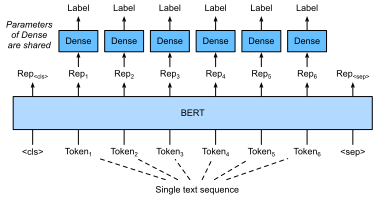
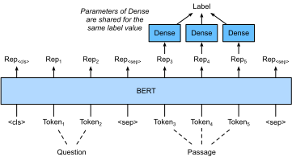

# 系列レベルおよびトークンレベルのアプリケーションのための BERT のファインチューニング
:label:`sec_finetuning-bert`

本章の前の節では、
RNN、CNN、attention、MLP などに基づく、
自然言語処理アプリケーション向けのさまざまなモデルを設計してきました。
これらのモデルは、空間的または時間的な制約がある場合には有用ですが、
自然言語処理の各タスクごとに個別のモデルを作ることは、
実際には不可能です。
:numref:`sec_bert` では、
事前学習モデルである BERT を紹介しました。
これは、幅広い自然言語処理タスクに対して
最小限のアーキテクチャ変更で済みます。
一方で、
提案当時、
BERT はさまざまな自然言語処理タスクで最先端の性能を改善しました。
他方で、
:numref:`sec_bert-pretraining` で述べたように、
元の BERT モデルの 2 つのバージョンは
それぞれ 1 億 1000 万個と 3 億 4000 万個のパラメータを持ちます。
したがって、十分な計算資源がある場合には、
下流の自然言語処理アプリケーション向けに
BERT をファインチューニングすることを検討できます。

以下では、
自然言語処理アプリケーションの一部を
系列レベルとトークンレベルに一般化します。
系列レベルでは、
BERT によるテキスト入力の表現を
出力ラベルへ変換する方法を、
単一テキスト分類と
テキスト対分類または回帰で紹介します。
トークンレベルでは、テキストタグ付けや質問応答といった
新しいアプリケーションを簡単に紹介し、
BERT がそれらの入力をどのように表現し、
出力ラベルへ変換するかを説明します。
ファインチューニングでは、
異なるアプリケーション間で BERT に必要な「最小限のアーキテクチャ変更」は、
追加の全結合層です。
下流アプリケーションの教師あり学習では、
追加層のパラメータはゼロから学習され、
事前学習済み BERT モデル内のすべてのパラメータはファインチューニングされます。

## 単一テキスト分類

*単一テキスト分類* は、1 つのテキスト系列を入力として受け取り、その分類結果を出力します。
本章で学んだ感情分析のほかに、
Corpus of Linguistic Acceptability (CoLA) も
単一テキスト分類のデータセットであり、
与えられた文が文法的に許容可能かどうかを判定します :cite:`Warstadt.Singh.Bowman.2019`。
たとえば、"I should study." は許容されますが、"I should studying." は許容されません。

:label:`fig_bert-one-seq`

:numref:`sec_bert` では BERT の入力表現を説明しました。
BERT の入力系列は、単一テキストとテキスト対の両方を明確に表現します。
ここで特別な分類トークン
“&lt;cls&gt;” は系列分類に用いられ、
特別な分類トークン
“&lt;sep&gt;” は単一テキストの終端を示すか、テキスト対を区切ります。
:numref:`fig_bert-one-seq` に示すように、
単一テキスト分類アプリケーションでは、
特別な分類トークン
“&lt;cls&gt;” の BERT 表現が入力テキスト系列全体の情報を符号化します。
入力単一テキストの表現として、
これは全結合（dense）層からなる小さな MLP に入力され、
すべての離散ラベル値の分布を出力します。

## テキスト対分類または回帰

本章では自然言語推論についても見てきました。
これは *テキスト対分類* に属し、
テキストのペアを分類するタイプのアプリケーションです。

2 つのテキストを入力として受け取りながら連続値を出力する
*意味的テキスト類似度* は、人気のある *テキスト対回帰* タスクです。
このタスクは文の意味的類似性を測定します。
たとえば、Semantic Textual Similarity Benchmark データセットでは、
文のペアの類似度スコアは、
0（意味の重なりなし）から 5（意味が等価）までの順序尺度です :cite:`Cer.Diab.Agirre.ea.2017`。
目的はこれらのスコアを予測することです。
Semantic Textual Similarity Benchmark データセットの例には、（文 1、文 2、類似度スコア）として次のものがあります。

* "A plane is taking off.", "An air plane is taking off.", 5.000;
* "A woman is eating something.", "A woman is eating meat.", 3.000;
* "A woman is dancing.", "A man is talking.", 0.000.

:label:`fig_bert-two-seqs`

:numref:`fig_bert-one-seq` の単一テキスト分類と比べると、
:numref:`fig_bert-two-seqs` におけるテキスト対分類のための BERT のファインチューニングは、
入力表現が異なります。
意味的テキスト類似度のようなテキスト対回帰タスクでは、
連続ラベル値を出力し、
平均二乗損失を用いるといった単純な変更を適用できます。これは回帰では一般的です。

## テキストタグ付け

次に、*テキストタグ付け* のようなトークンレベルのタスクを考えます。
ここでは各トークンにラベルが割り当てられます。
テキストタグ付けタスクの中でも、
*品詞タグ付け* は、文中での単語の役割に応じて、
各単語に品詞タグ（たとえば形容詞や限定詞）を割り当てます。
たとえば、
Penn Treebank II のタグセットによれば、
文 "John Smith 's car is new"
は
"NNP (noun, proper singular) NNP POS (possessive ending) NN (noun, singular or mass) VB (verb, base form) JJ (adjective)"
とタグ付けされるべきです。

:label:`fig_bert-tagging`

テキストタグ付けアプリケーションのための BERT のファインチューニングを
:numref:`fig_bert-tagging` に示します。
:numref:`fig_bert-one-seq` と比べると、
唯一の違いは、
テキストタグ付けでは、入力テキストの *各トークン* の BERT 表現が
同じ追加の全結合層に入力され、
品詞タグのようなトークンのラベルを出力する点です。

## 質問応答

別のトークンレベルのアプリケーションとして、
*質問応答* は読解能力を反映します。
たとえば、
Stanford Question Answering Dataset (SQuAD v1.1) は
読解用の文章と質問からなり、
各質問への答えは、
その質問が関係する文章からのテキスト区間（text span）にすぎません :cite:`Rajpurkar.Zhang.Lopyrev.ea.2016`。
説明のために、
次の文章を考えます。
"Some experts report that a mask's efficacy is inconclusive. However, mask makers insist that their products, such as N95 respirator masks, can guard against the virus."
そして質問 "Who say that N95 respirator masks can guard against the virus?" を考えます。
答えは文章中のテキスト区間 "mask makers" であるべきです。
したがって、SQuAD v1.1 の目的は、質問と文章のペアが与えられたときに、
文章中のテキスト区間の開始位置と終了位置を予測することです。

:label:`fig_bert-qa`

質問応答のために BERT をファインチューニングするには、
質問と文章をそれぞれ BERT の入力における第 1 および第 2 のテキスト系列として詰め込みます。
テキスト区間の開始位置を予測するために、
同じ追加の全結合層が、
文章中の位置 $i$ にある任意のトークンの BERT 表現を
スカラー値 $s_i$ に変換します。
文章中のすべてのトークンのこれらのスコアは、
さらに softmax 操作によって
確率分布へ変換され、
文章中の各トークン位置 $i$ に対して、
テキスト区間の開始である確率 $p_i$ が割り当てられます。
テキスト区間の終了位置の予測も同様ですが、
その追加の全結合層のパラメータは開始位置予測用のものとは独立です。
終了位置を予測するときには、
位置 $i$ にある任意の文章トークンが
同じ全結合層によって
スカラー値 $e_i$ に変換されます。
:numref:`fig_bert-qa`
は質問応答のための BERT のファインチューニングを示しています。

質問応答では、
教師あり学習の訓練目的は、
正解の開始位置と終了位置の対数尤度を最大化することと同じくらい直接的です。
区間を予測するときには、
位置 $i$ から位置 $j$ までの有効な区間（$i \leq j$）について
スコア $s_i + e_j$ を計算し、
最も高いスコアを持つ区間を出力できます。

## まとめ

* BERT は、単一テキスト分類（たとえば感情分析や言語的許容性の判定）、テキスト対分類または回帰（たとえば自然言語推論や意味的テキスト類似度）、テキストタグ付け（たとえば品詞タグ付け）、質問応答などの系列レベルおよびトークンレベルの自然言語処理アプリケーションに対して、最小限のアーキテクチャ変更（追加の全結合層）で対応できます。
* 下流アプリケーションの教師あり学習では、追加層のパラメータはゼロから学習され、事前学習済み BERT モデル内のすべてのパラメータはファインチューニングされます。

## 演習

1. ニュース記事向けの検索エンジンアルゴリズムを設計しましょう。システムがクエリ（たとえば "oil industry during the coronavirus outbreak"）を受け取ったら、そのクエリに最も関連するニュース記事の順位付きリストを返すものとします。大量のニュース記事と多数のクエリがあると仮定します。問題を簡単にするため、各クエリに対して最も関連する記事がラベル付けされていると仮定します。負例サンプリング（:numref:`subsec_negative-sampling` を参照）と BERT をアルゴリズム設計にどのように適用できますか？
1. 言語モデルの学習に BERT をどのように活用できますか？
1. 機械翻訳に BERT を活用できますか？
