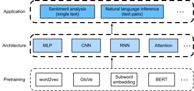

# 自然言語処理: 応用
:label:`chap_nlp_app`

私たちは、テキスト系列中のトークンをどのように表現し、:numref:`chap_nlp_pretrain` でその表現をどのように学習するかを見てきました。  
このような事前学習済みのテキスト表現は、さまざまな下流の自然言語処理タスクに対して、各種モデルへ入力できます。

実際、
前の章では、深層学習アーキテクチャを説明するためだけに、
*事前学習なしで* 自然言語処理の応用をすでにいくつか扱ってきました。
たとえば、:numref:`chap_rnn` では、RNN を用いてノヴェラのようなテキストを生成する言語モデルを設計しました。
また、:numref:`chap_modern_rnn` と :numref:`chap_attention-and-transformers` では、機械翻訳のために RNN と注意機構に基づくモデルも設計しました。

しかし、この本はそのような応用を網羅的に扱うことを目的としていません。
その代わりに、
私たちが注目するのは、*言語の（深層）表現学習を自然言語処理の問題解決にどう適用するか* です。
事前学習済みのテキスト表現が与えられたとき、
この章では、単一テキストとテキスト対の関係をそれぞれ解析する、2つの
人気があり代表的な
下流の自然言語処理タスク、すなわち感情分析と自然言語推論を取り上げます。


:label:`fig_nlp-map-app`

:numref:`fig_nlp-map-app` に示すように、
この章では、MLP、CNN、RNN、注意機構など、さまざまな種類の深層学習アーキテクチャを用いて自然言語処理モデルを設計する基本的な考え方を説明します。
:numref:`fig_nlp-map-app` にあるどの応用に対しても、どの事前学習済みテキスト表現とどのアーキテクチャを組み合わせることも可能ですが、
ここでは代表的な組み合わせをいくつか選びます。
具体的には、感情分析については、RNN と CNN に基づく人気のあるアーキテクチャを調べます。
自然言語推論については、テキスト対を解析する方法を示すために、注意機構と MLP を選びます。
最後に、事前学習済み BERT モデルを
幅広い自然言語処理応用に対してどのようにファインチューニングするかを紹介します。
対象は、系列レベル（単一テキスト分類とテキスト対分類）と
トークンレベル（テキストタグ付けと質問応答）です。
具体的な実証例として、
自然言語推論のために BERT をファインチューニングします。

:numref:`sec_bert` で紹介したように、
BERT は幅広い自然言語処理応用に対して、
アーキテクチャの変更を最小限に抑えられます。
しかし、この利点には、下流応用のために
BERT の膨大な数のパラメータをファインチューニングしなければならないという代償が伴います。
空間や時間に制約がある場合には、
MLP、CNN、RNN、注意機構に基づく、こうした工夫されたモデルのほうが
より実用的です。
以下では、まず感情分析の応用から始め、
それぞれ RNN と CNN に基づくモデル設計を説明します。

```toc
:maxdepth: 2

sentiment-analysis-and-dataset
sentiment-analysis-rnn
sentiment-analysis-cnn
natural-language-inference-and-dataset
natural-language-inference-attention
finetuning-bert
natural-language-inference-bert
```\n