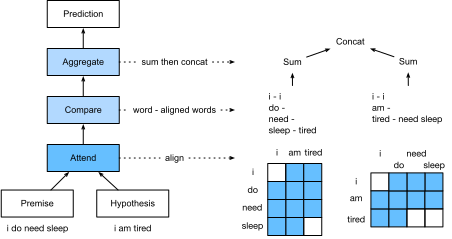

# 自然言語推論: Attention の利用
:label:`sec_natural-language-inference-attention`

自然言語推論タスクと SNLI データセットについては、 :numref:`sec_natural-language-inference-and-dataset` で導入しました。複雑で深いアーキテクチャに基づく多くのモデルを踏まえ、:citet:`Parikh.Tackstrom.Das.ea.2016` は attention 機構を用いて自然言語推論に取り組む方法を提案し、これを「decomposable attention model」と呼びました。
その結果、再帰層や畳み込み層を持たないモデルとなり、はるかに少ないパラメータ数で、当時の SNLI データセットにおける最高性能を達成しました。
この節では、 :numref:`fig_nlp-map-nli-attention` に示すような、自然言語推論のためのこの attention ベースの手法（MLP を用いる）を説明し、実装します。


:label:`fig_nlp-map-nli-attention`


## モデル

前提文と仮説文におけるトークンの順序を保持するよりも、
一方のテキスト系列の各トークンを他方のすべてのトークンに対応付け、その逆も行い、
その後でそのような情報を比較・集約して、前提文と仮説文の論理関係を予測すればよいのです。
機械翻訳におけるソース文とターゲット文のトークン対応付けと同様に、
前提文と仮説文のトークン対応付けは attention 機構によってきれいに実現できます。


:label:`fig_nli_attention`

:numref:`fig_nli_attention` は、attention 機構を用いた自然言語推論の手法を示しています。
高レベルでは、これは attending、comparing、aggregating の 3 つのステップを共同で学習する構成です。
以下で、それらを順に説明します。

```{.python .input}
#@tab mxnet
from d2l import mxnet as d2l
from mxnet import gluon, init, np, npx
from mxnet.gluon import nn

npx.set_np()
```

```{.python .input}
#@tab pytorch
from d2l import torch as d2l
import torch
from torch import nn
from torch.nn import functional as F
```

### Attending

最初のステップは、一方のテキスト系列の各トークンを、他方の系列の各トークンに対応付けることです。
前提文が "i do need sleep"、仮説文が "i am tired" だとしましょう。
意味的な類似性により、
仮説文中の "i" を前提文中の "i" に対応付け、
仮説文中の "tired" を前提文中の "sleep" に対応付けたいと考えます。
同様に、前提文中の "i" を仮説文中の "i" に対応付け、
前提文中の "need" と "sleep" を仮説文中の "tired" に対応付けたいと考えます。
このような対応付けは、重み付き平均を用いた *soft* なものです。理想的には、大きな重みが対応付けたいトークンに割り当てられます。
説明を簡単にするため、 :numref:`fig_nli_attention` ではそのような対応付けを *hard* な形で示しています。

ここでは、attention 機構を用いた soft な対応付けをより詳しく説明します。
前提文と仮説文をそれぞれ $\mathbf{A} = (\mathbf{a}_1, \ldots, \mathbf{a}_m)$
および $\mathbf{B} = (\mathbf{b}_1, \ldots, \mathbf{b}_n)$ と表します。
それぞれのトークン数は $m$ と $n$ であり、
$\mathbf{a}_i, \mathbf{b}_j \in \mathbb{R}^{d}$ ($i = 1, \ldots, m, j = 1, \ldots, n$) は $d$ 次元の単語ベクトルです。
soft な対応付けのために、attention 重み $e_{ij} \in \mathbb{R}$ を次のように計算します。

$$e_{ij} = f(\mathbf{a}_i)^\top f(\mathbf{b}_j),$$
:eqlabel:`eq_nli_e`

ここで関数 $f$ は、以下の `mlp` 関数で定義される MLP です。
$f$ の出力次元は `mlp` の `num_hiddens` 引数で指定されます。

```{.python .input}
#@tab mxnet
def mlp(num_hiddens, flatten):
    net = nn.Sequential()
    net.add(nn.Dropout(0.2))
    net.add(nn.Dense(num_hiddens, activation='relu', flatten=flatten))
    net.add(nn.Dropout(0.2))
    net.add(nn.Dense(num_hiddens, activation='relu', flatten=flatten))
    return net
```

```{.python .input}
#@tab pytorch
def mlp(num_inputs, num_hiddens, flatten):
    net = []
    net.append(nn.Dropout(0.2))
    net.append(nn.Linear(num_inputs, num_hiddens))
    net.append(nn.ReLU())
    if flatten:
        net.append(nn.Flatten(start_dim=1))
    net.append(nn.Dropout(0.2))
    net.append(nn.Linear(num_hiddens, num_hiddens))
    net.append(nn.ReLU())
    if flatten:
        net.append(nn.Flatten(start_dim=1))
    return nn.Sequential(*net)
```

強調しておくべき点は、:eqref:`eq_nli_e` において
$f$ は入力として $\mathbf{a}_i$ と $\mathbf{b}_j$ を別々に受け取り、2 つをまとめて入力するわけではないことです。
この *分解* の工夫により、$f$ の適用回数は $mn$ 回（計算量は二次）ではなく、$m + n$ 回（計算量は線形）で済みます。


:eqref:`eq_nli_e` の attention 重みを正規化し、
仮説文中のすべてのトークンベクトルの重み付き平均を計算して、
前提文中の $i$ 番目のトークンに soft に対応付けられた仮説文の表現を得ます。

$$
\boldsymbol{\beta}_i = \sum_{j=1}^{n}\frac{\exp(e_{ij})}{ \sum_{k=1}^{n} \exp(e_{ik})} \mathbf{b}_j.
$$

同様に、仮説文中の各トークン $j$ に対して、前提文トークンの soft な対応付けを計算します。

$$
\boldsymbol{\alpha}_j = \sum_{i=1}^{m}\frac{\exp(e_{ij})}{ \sum_{k=1}^{m} \exp(e_{kj})} \mathbf{a}_i.
$$

以下では、入力前提文 `A` に対する仮説文の soft な対応付け（`beta`）と、入力仮説文 `B` に対する前提文の soft な対応付け（`alpha`）を計算する `Attend` クラスを定義します。

```{.python .input}
#@tab mxnet
class Attend(nn.Block):
    def __init__(self, num_hiddens, **kwargs):
        super(Attend, self).__init__(**kwargs)
        self.f = mlp(num_hiddens=num_hiddens, flatten=False)

    def forward(self, A, B):
        # Shape of `A`/`B`: (b`atch_size`, no. of tokens in sequence A/B,
        # `embed_size`)
        # Shape of `f_A`/`f_B`: (`batch_size`, no. of tokens in sequence A/B,
        # `num_hiddens`)
        f_A = self.f(A)
        f_B = self.f(B)
        # Shape of `e`: (`batch_size`, no. of tokens in sequence A,
        # no. of tokens in sequence B)
        e = npx.batch_dot(f_A, f_B, transpose_b=True)
        # Shape of `beta`: (`batch_size`, no. of tokens in sequence A,
        # `embed_size`), where sequence B is softly aligned with each token
        # (axis 1 of `beta`) in sequence A
        beta = npx.batch_dot(npx.softmax(e), B)
        # Shape of `alpha`: (`batch_size`, no. of tokens in sequence B,
        # `embed_size`), where sequence A is softly aligned with each token
        # (axis 1 of `alpha`) in sequence B
        alpha = npx.batch_dot(npx.softmax(e.transpose(0, 2, 1)), A)
        return beta, alpha
```

```{.python .input}
#@tab pytorch
class Attend(nn.Module):
    def __init__(self, num_inputs, num_hiddens, **kwargs):
        super(Attend, self).__init__(**kwargs)
        self.f = mlp(num_inputs, num_hiddens, flatten=False)

    def forward(self, A, B):
        # Shape of `A`/`B`: (`batch_size`, no. of tokens in sequence A/B,
        # `embed_size`)
        # Shape of `f_A`/`f_B`: (`batch_size`, no. of tokens in sequence A/B,
        # `num_hiddens`)
        f_A = self.f(A)
        f_B = self.f(B)
        # Shape of `e`: (`batch_size`, no. of tokens in sequence A,
        # no. of tokens in sequence B)
        e = torch.bmm(f_A, f_B.permute(0, 2, 1))
        # Shape of `beta`: (`batch_size`, no. of tokens in sequence A,
        # `embed_size`), where sequence B is softly aligned with each token
        # (axis 1 of `beta`) in sequence A
        beta = torch.bmm(F.softmax(e, dim=-1), B)
        # Shape of `alpha`: (`batch_size`, no. of tokens in sequence B,
        # `embed_size`), where sequence A is softly aligned with each token
        # (axis 1 of `alpha`) in sequence B
        alpha = torch.bmm(F.softmax(e.permute(0, 2, 1), dim=-1), A)
        return beta, alpha
```

### Comparing

次のステップでは、一方の系列のトークンと、そのトークンに soft に対応付けられた他方の系列を比較します。
soft な対応付けでは、一方の系列のすべてのトークンが、重みはおそらく異なるものの、他方の系列のあるトークンと比較されます。
説明を簡単にするため、 :numref:`fig_nli_attention` では対応付けられたトークン同士を *hard* な形で組にしています。
たとえば、attending ステップによって、前提文中の "need" と "sleep" の両方が仮説文中の "tired" に対応付けられたとすると、"tired--need sleep" の組が比較されます。

比較ステップでは、一方の系列のトークンと、他方の系列から対応付けられたトークンの連結（演算子 $[\cdot, \cdot]$）を関数 $g$（MLP）に入力します。

$$\mathbf{v}_{A,i} = g([\mathbf{a}_i, \boldsymbol{\beta}_i]), i = 1, \ldots, m\\ \mathbf{v}_{B,j} = g([\mathbf{b}_j, \boldsymbol{\alpha}_j]), j = 1, \ldots, n.$$

:eqlabel:`eq_nli_v_ab`


:eqref:`eq_nli_v_ab` において、$\mathbf{v}_{A,i}$ は、前提文中のトークン $i$ と、そのトークン $i$ に soft に対応付けられたすべての仮説文トークンとの比較を表します。
一方、$\mathbf{v}_{B,j}$ は、仮説文中のトークン $j$ と、そのトークン $j$ に soft に対応付けられたすべての前提文トークンとの比較を表します。
以下の `Compare` クラスは、この比較ステップを定義します。

```{.python .input}
#@tab mxnet
class Compare(nn.Block):
    def __init__(self, num_hiddens, **kwargs):
        super(Compare, self).__init__(**kwargs)
        self.g = mlp(num_hiddens=num_hiddens, flatten=False)

    def forward(self, A, B, beta, alpha):
        V_A = self.g(np.concatenate([A, beta], axis=2))
        V_B = self.g(np.concatenate([B, alpha], axis=2))
        return V_A, V_B
```

```{.python .input}
#@tab pytorch
class Compare(nn.Module):
    def __init__(self, num_inputs, num_hiddens, **kwargs):
        super(Compare, self).__init__(**kwargs)
        self.g = mlp(num_inputs, num_hiddens, flatten=False)

    def forward(self, A, B, beta, alpha):
        V_A = self.g(torch.cat([A, beta], dim=2))
        V_B = self.g(torch.cat([B, alpha], dim=2))
        return V_A, V_B
```

### Aggregating

2 つの比較ベクトル集合 $\mathbf{v}_{A,i}$ ($i = 1, \ldots, m$) と $\mathbf{v}_{B,j}$ ($j = 1, \ldots, n$) が得られたら、
最後のステップでは、それらの情報を集約して論理関係を推論します。
まず、両方の集合をそれぞれ総和します。

$$
\mathbf{v}_A = \sum_{i=1}^{m} \mathbf{v}_{A,i}, \quad \mathbf{v}_B = \sum_{j=1}^{n}\mathbf{v}_{B,j}.
$$

次に、両方の要約結果を連結して関数 $h$（MLP）に入力し、論理関係の分類結果を得ます。

$$
\hat{\mathbf{y}} = h([\mathbf{v}_A, \mathbf{v}_B]).
$$

集約ステップは、以下の `Aggregate` クラスで定義されます。

```{.python .input}
#@tab mxnet
class Aggregate(nn.Block):
    def __init__(self, num_hiddens, num_outputs, **kwargs):
        super(Aggregate, self).__init__(**kwargs)
        self.h = mlp(num_hiddens=num_hiddens, flatten=True)
        self.h.add(nn.Dense(num_outputs))

    def forward(self, V_A, V_B):
        # Sum up both sets of comparison vectors
        V_A = V_A.sum(axis=1)
        V_B = V_B.sum(axis=1)
        # Feed the concatenation of both summarization results into an MLP
        Y_hat = self.h(np.concatenate([V_A, V_B], axis=1))
        return Y_hat
```

```{.python .input}
#@tab pytorch
class Aggregate(nn.Module):
    def __init__(self, num_inputs, num_hiddens, num_outputs, **kwargs):
        super(Aggregate, self).__init__(**kwargs)
        self.h = mlp(num_inputs, num_hiddens, flatten=True)
        self.linear = nn.Linear(num_hiddens, num_outputs)

    def forward(self, V_A, V_B):
        # Sum up both sets of comparison vectors
        V_A = V_A.sum(dim=1)
        V_B = V_B.sum(dim=1)
        # Feed the concatenation of both summarization results into an MLP
        Y_hat = self.linear(self.h(torch.cat([V_A, V_B], dim=1)))
        return Y_hat
```

### 全体をまとめる

attending、comparing、aggregating の各ステップを組み合わせることで、
これら 3 つのステップを共同で学習する decomposable attention model を定義します。

```{.python .input}
#@tab mxnet
class DecomposableAttention(nn.Block):
    def __init__(self, vocab, embed_size, num_hiddens, **kwargs):
        super(DecomposableAttention, self).__init__(**kwargs)
        self.embedding = nn.Embedding(len(vocab), embed_size)
        self.attend = Attend(num_hiddens)
        self.compare = Compare(num_hiddens)
        # There are 3 possible outputs: entailment, contradiction, and neutral
        self.aggregate = Aggregate(num_hiddens, 3)

    def forward(self, X):
        premises, hypotheses = X
        A = self.embedding(premises)
        B = self.embedding(hypotheses)
        beta, alpha = self.attend(A, B)
        V_A, V_B = self.compare(A, B, beta, alpha)
        Y_hat = self.aggregate(V_A, V_B)
        return Y_hat
```

```{.python .input}
#@tab pytorch
class DecomposableAttention(nn.Module):
    def __init__(self, vocab, embed_size, num_hiddens, num_inputs_attend=100,
                 num_inputs_compare=200, num_inputs_agg=400, **kwargs):
        super(DecomposableAttention, self).__init__(**kwargs)
        self.embedding = nn.Embedding(len(vocab), embed_size)
        self.attend = Attend(num_inputs_attend, num_hiddens)
        self.compare = Compare(num_inputs_compare, num_hiddens)
        # There are 3 possible outputs: entailment, contradiction, and neutral
        self.aggregate = Aggregate(num_inputs_agg, num_hiddens, num_outputs=3)

    def forward(self, X):
        premises, hypotheses = X
        A = self.embedding(premises)
        B = self.embedding(hypotheses)
        beta, alpha = self.attend(A, B)
        V_A, V_B = self.compare(A, B, beta, alpha)
        Y_hat = self.aggregate(V_A, V_B)
        return Y_hat
```

## モデルの学習と評価

ここでは、定義した decomposable attention model を SNLI データセットで学習し、評価します。
まずデータセットを読み込みます。


### データセットの読み込み

:numref:`sec_natural-language-inference-and-dataset` で定義した関数を用いて、SNLI データセットをダウンロードして読み込みます。バッチサイズと系列長はそれぞれ $256$ と $50$ に設定します。

```{.python .input}
#@tab all
batch_size, num_steps = 256, 50
train_iter, test_iter, vocab = d2l.load_data_snli(batch_size, num_steps)
```

### モデルの作成

入力トークンを表現するために、事前学習済みの 100 次元 GloVe 埋め込みを用います。
したがって、:eqref:`eq_nli_e` におけるベクトル $\mathbf{a}_i$ と $\mathbf{b}_j$ の次元を 100 にあらかじめ定めます。
:eqref:`eq_nli_e` における関数 $f$ と、:eqref:`eq_nli_v_ab` における関数 $g$ の出力次元は 200 に設定します。
その後、モデルインスタンスを作成し、パラメータを初期化し、
GloVe 埋め込みを読み込んで入力トークンのベクトルを初期化します。

```{.python .input}
#@tab mxnet
embed_size, num_hiddens, devices = 100, 200, d2l.try_all_gpus()
net = DecomposableAttention(vocab, embed_size, num_hiddens)
net.initialize(init.Xavier(), ctx=devices)
glove_embedding = d2l.TokenEmbedding('glove.6b.100d')
embeds = glove_embedding[vocab.idx_to_token]
net.embedding.weight.set_data(embeds)
```

```{.python .input}
#@tab pytorch
embed_size, num_hiddens, devices = 100, 200, d2l.try_all_gpus()
net = DecomposableAttention(vocab, embed_size, num_hiddens)
glove_embedding = d2l.TokenEmbedding('glove.6b.100d')
embeds = glove_embedding[vocab.idx_to_token]
net.embedding.weight.data.copy_(embeds);
```

### モデルの学習と評価

:numref:`sec_multi_gpu` にある、テキスト系列や画像のような単一入力を受け取る `split_batch` 関数とは対照的に、
ここでは前提文と仮説文のような複数入力をミニバッチで受け取る `split_batch_multi_inputs` 関数を定義します。

```{.python .input}
#@tab mxnet
#@save
def split_batch_multi_inputs(X, y, devices):
    """Split multi-input `X` and `y` into multiple devices."""
    X = list(zip(*[gluon.utils.split_and_load(
        feature, devices, even_split=False) for feature in X]))
    return (X, gluon.utils.split_and_load(y, devices, even_split=False))
```

これで、SNLI データセット上でモデルを学習・評価できます。

```{.python .input}
#@tab mxnet
lr, num_epochs = 0.001, 4
trainer = gluon.Trainer(net.collect_params(), 'adam', {'learning_rate': lr})
loss = gluon.loss.SoftmaxCrossEntropyLoss()
d2l.train_ch13(net, train_iter, test_iter, loss, trainer, num_epochs, devices,
               split_batch_multi_inputs)
```

```{.python .input}
#@tab pytorch
lr, num_epochs = 0.001, 4
trainer = torch.optim.Adam(net.parameters(), lr=lr)
loss = nn.CrossEntropyLoss(reduction="none")
d2l.train_ch13(net, train_iter, test_iter, loss, trainer, num_epochs, devices)
```

### モデルの利用

最後に、前提文と仮説文のペアに対する論理関係を出力する予測関数を定義します。

```{.python .input}
#@tab mxnet
#@save
def predict_snli(net, vocab, premise, hypothesis):
    """Predict the logical relationship between the premise and hypothesis."""
    premise = np.array(vocab[premise], ctx=d2l.try_gpu())
    hypothesis = np.array(vocab[hypothesis], ctx=d2l.try_gpu())
    label = np.argmax(net([premise.reshape((1, -1)),
                           hypothesis.reshape((1, -1))]), axis=1)
    return 'entailment' if label == 0 else 'contradiction' if label == 1 \
            else 'neutral'
```

```{.python .input}
#@tab pytorch
#@save
def predict_snli(net, vocab, premise, hypothesis):
    """Predict the logical relationship between the premise and hypothesis."""
    net.eval()
    premise = torch.tensor(vocab[premise], device=d2l.try_gpu())
    hypothesis = torch.tensor(vocab[hypothesis], device=d2l.try_gpu())
    label = torch.argmax(net([premise.reshape((1, -1)),
                           hypothesis.reshape((1, -1))]), dim=1)
    return 'entailment' if label == 0 else 'contradiction' if label == 1 \
            else 'neutral'
```

学習済みモデルを使って、文のペアの自然言語推論結果を得ることができます。

```{.python .input}
#@tab all
predict_snli(net, vocab, ['he', 'is', 'good', '.'], ['he', 'is', 'bad', '.'])
```

## まとめ

* decomposable attention model は、前提文と仮説文の論理関係を予測するために、attending、comparing、aggregating の 3 ステップから構成されます。
* attention 機構を用いると、一方のテキスト系列の各トークンを他方のすべてのトークンに対応付け、その逆も行えます。そのような対応付けは重み付き平均を用いた soft なものであり、理想的には大きな重みが対応付けたいトークンに割り当てられます。
* 分解の工夫により、attention 重みを計算する際の計算量は二次ではなく線形となり、より望ましい性質を持ちます。
* 事前学習済みの単語ベクトルを、自然言語推論のような下流の自然言語処理タスクの入力表現として利用できます。


## 演習

1. 他のハイパーパラメータの組み合わせでモデルを学習してみましょう。テストセットでより高い精度を得られますか？
1. 自然言語推論における decomposable attention model の主な欠点は何ですか？
1. 任意の文のペアについて、意味的類似度の程度（たとえば 0 から 1 の連続値）を得たいとします。データセットをどのように収集し、ラベル付けすればよいでしょうか？ attention 機構を用いたモデルを設計できますか？

:begin_tab:`mxnet`
[Discussions](https://discuss.d2l.ai/t/395)
:end_tab:

:begin_tab:`pytorch`
[Discussions](https://discuss.d2l.ai/t/1530)
:end_tab:\n