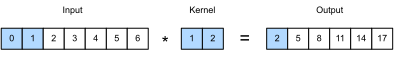
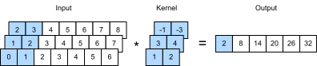
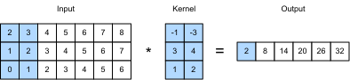

# 畳み込みニューラルネットワークを用いた感情分析
:label:`sec_sentiment_cnn` 


:numref:`chap_cnn` では、
2次元CNNを用いて
2次元画像データを処理する
仕組みを調べました。
そこでは、
隣接ピクセルのような
局所特徴に対して
CNNが適用されました。
CNNはもともと
コンピュータビジョン向けに
設計されましたが、
自然言語処理でも広く使われています。
簡単に言えば、
任意のテキスト系列を
1次元画像だと考えればよいのです。
このようにすると、
1次元CNNは
テキスト中の $n$-gram のような
局所特徴を処理できます。

この節では、
単一のテキストを表現するためのCNNアーキテクチャを
どのように設計するかを示すために、
*textCNN* モデルを用います :cite:`Kim.2014`。
感情分析のために
GloVeの事前学習を用いたRNNアーキテクチャを使う
:numref:`fig_nlp-map-sa-rnn` と比べると、
:numref:`fig_nlp-map-sa-cnn` における
唯一の違いは
アーキテクチャの選択にあります。


:label:`fig_nlp-map-sa-cnn`

```{.python .input}
#@tab mxnet
from d2l import mxnet as d2l
from mxnet import gluon, init, np, npx
from mxnet.gluon import nn
npx.set_np()

batch_size = 64
train_iter, test_iter, vocab = d2l.load_data_imdb(batch_size)
```

```{.python .input}
#@tab pytorch
from d2l import torch as d2l
import torch
from torch import nn

batch_size = 64
train_iter, test_iter, vocab = d2l.load_data_imdb(batch_size)
```

## 1次元畳み込み

モデルを紹介する前に、
1次元畳み込みがどのように動作するかを見てみましょう。
これは、
相互相関演算に基づく
2次元畳み込みの特殊な場合にすぎないことを
念頭に置いてください。


:label:`fig_conv1d`

:numref:`fig_conv1d` に示すように、
1次元の場合、
畳み込みウィンドウは
入力テンソル上を
左から右へと
スライドします。
スライド中、
畳み込みウィンドウの
ある位置に含まれる
入力部分テンソル（たとえば :numref:`fig_conv1d` の $0$ と $1$）と
カーネルテンソル（たとえば :numref:`fig_conv1d` の $1$ と $2$）を
要素ごとに掛け合わせます。
これらの積の和が、
出力テンソルの対応する位置における
1つのスカラー値（たとえば :numref:`fig_conv1d` の $0\times1+1\times2=2$）を
与えます。

以下の `corr1d` 関数で
1次元の相互相関を実装します。
入力テンソル `X` と
カーネルテンソル `K` が与えられると、
出力テンソル `Y` を返します。

```{.python .input}
#@tab all
def corr1d(X, K):
    w = K.shape[0]
    Y = d2l.zeros((X.shape[0] - w + 1))
    for i in range(Y.shape[0]):
        Y[i] = (X[i: i + w] * K).sum()
    return Y
```

:numref:`fig_conv1d` の入力テンソル `X` とカーネルテンソル `K` を構成して、
上の1次元相互相関実装の出力を検証できます。

```{.python .input}
#@tab all
X, K = d2l.tensor([0, 1, 2, 3, 4, 5, 6]), d2l.tensor([1, 2])
corr1d(X, K)
```

複数チャネルを持つ任意の
1次元入力に対しては、
畳み込みカーネルも
同じ数の入力チャネルを持つ必要があります。
その後、各チャネルごとに、
入力の1次元テンソルと畳み込みカーネルの1次元テンソルに対して
相互相関演算を行い、
すべてのチャネルにわたる結果を
足し合わせて
1次元の出力テンソルを生成します。
:numref:`fig_conv1d_channel` は
3つの入力チャネルを持つ
1次元相互相関演算を示しています。


:label:`fig_conv1d_channel`


複数入力チャネルを持つ
1次元相互相関演算を実装し、
:numref:`fig_conv1d_channel` の結果を検証できます。

```{.python .input}
#@tab all
def corr1d_multi_in(X, K):
    # まず、`X` と `K` の0次元目（チャネル次元）を反復する。
    # その後、それらを足し合わせる
    return sum(corr1d(x, k) for x, k in zip(X, K))

X = d2l.tensor([[0, 1, 2, 3, 4, 5, 6],
              [1, 2, 3, 4, 5, 6, 7],
              [2, 3, 4, 5, 6, 7, 8]])
K = d2l.tensor([[1, 2], [3, 4], [-1, -3]])
corr1d_multi_in(X, K)
```

複数入力チャネルを持つ
1次元相互相関は、
単一入力チャネルの
2次元相互相関と等価であることに
注意してください。
例として、
:numref:`fig_conv1d_channel` における
複数入力チャネルの1次元相互相関に対応する形は、
:numref:`fig_conv1d_2d` における
単一入力チャネルの
2次元相互相関です。
ここでは、畳み込みカーネルの高さは
入力テンソルの高さと
同じでなければなりません。



:label:`fig_conv1d_2d`

:numref:`fig_conv1d` と :numref:`fig_conv1d_channel` の両方の出力は、
どちらも1チャネルしか持ちません。
:numref:`subsec_multi-output-channels` で説明した
複数出力チャネルを持つ2次元畳み込みと同様に、
1次元畳み込みでも
複数の出力チャネルを指定できます。

## 時間方向最大プーリング

同様に、プーリングを用いて
系列表現から
各時刻にわたる最も重要な特徴として
最大値を抽出できます。
textCNNで使われる
*max-over-time pooling* は、
1次元のグローバル最大プーリング
:cite:`Collobert.Weston.Bottou.ea.2011`
のように動作します。
各チャネルが
異なる時刻の値を保持する
多チャネル入力に対しては、
各チャネルの出力は
そのチャネルの最大値になります。
なお、
max-over-time pooling では
チャネルごとに
時刻数が異なっていても構いません。

## textCNNモデル

1次元畳み込みと
max-over-time pooling を用いて、
textCNNモデルは
個々の事前学習済みトークン表現を入力とし、
その後、
下流タスク向けの系列表現を
得て変換します。

$n$ 個のトークンを
$d$ 次元ベクトルで表した
単一のテキスト系列に対して、
入力テンソルの幅、高さ、チャネル数は
それぞれ $n$、$1$、$d$ です。
textCNNモデルは
次のように入力を出力へ変換します。

1. 複数の1次元畳み込みカーネルを定義し、入力に対してそれぞれ個別に畳み込み演算を行う。幅の異なる畳み込みカーネルは、異なる数の隣接トークン間の局所特徴を捉えられる。
1. すべての出力チャネルに対して max-over-time pooling を行い、その後、すべてのスカラープーリング出力を連結してベクトルにする。
1. 連結したベクトルを全結合層で出力カテゴリへ変換する。過学習を抑えるためにドロップアウトを使える。


:label:`fig_conv1d_textcnn`

:numref:`fig_conv1d_textcnn` は、
具体例を用いて
textCNNのモデルアーキテクチャを示しています。
入力は11個のトークンからなる文で、
各トークンは6次元ベクトルで表されています。
したがって、幅11の6チャネル入力があります。
幅が2と4の
2つの1次元畳み込みカーネルを定義し、
それぞれ4チャネルと5チャネルの出力を持たせます。
それらは、
幅 $11-2+1=10$ の4つの出力チャネルと、
幅 $11-4+1=8$ の5つの出力チャネルを生成します。
これら9チャネルは幅が異なりますが、
max-over-time pooling により
連結された9次元ベクトルが得られ、
最終的に
2次元出力ベクトルへ変換されて
二値感情予測を行います。


### モデルの定義

以下のクラスでtextCNNモデルを実装します。
:numref:`sec_sentiment_rnn` の双方向RNNモデルと比べると、
再帰層を畳み込み層に置き換えるだけでなく、
2つの埋め込み層も使います。
1つは学習可能な重みを持ち、
もう1つは固定重みを持ちます。

```{.python .input}
#@tab mxnet
class TextCNN(nn.Block):
    def __init__(self, vocab_size, embed_size, kernel_sizes, num_channels,
                 **kwargs):
        super(TextCNN, self).__init__(**kwargs)
        self.embedding = nn.Embedding(vocab_size, embed_size)
        # 学習しない埋め込み層
        self.constant_embedding = nn.Embedding(vocab_size, embed_size)
        self.dropout = nn.Dropout(0.5)
        self.decoder = nn.Dense(2)
        # max-over-time pooling 層にはパラメータがないので、このインスタンスは
        # 共有できる
        self.pool = nn.GlobalMaxPool1D()
        # 複数の1次元畳み込み層を作成する
        self.convs = nn.Sequential()
        for c, k in zip(num_channels, kernel_sizes):
            self.convs.add(nn.Conv1D(c, k, activation='relu'))

    def forward(self, inputs):
        # 形状 (batch size, no.
        # of tokens, token vector dimension) の2つの埋め込み層の出力をベクトル方向に連結する
        embeddings = np.concatenate((
            self.embedding(inputs), self.constant_embedding(inputs)), axis=2)
        # 1次元畳み込み層の入力形式に合わせて、
        # テンソルを並べ替え、2次元目にチャネルを格納する
        embeddings = embeddings.transpose(0, 2, 1)
        # 各1次元畳み込み層について、max-over-time
        # pooling の後、形状 (batch size, no. of channels, 1) のテンソルが
        # 得られる。最後の次元を削除し、チャネル方向に連結する
        encoding = np.concatenate([
            np.squeeze(self.pool(conv(embeddings)), axis=-1)
            for conv in self.convs], axis=1)
        outputs = self.decoder(self.dropout(encoding))
        return outputs
```

```{.python .input}
#@tab pytorch
class TextCNN(nn.Module):
    def __init__(self, vocab_size, embed_size, kernel_sizes, num_channels,
                 **kwargs):
        super(TextCNN, self).__init__(**kwargs)
        self.embedding = nn.Embedding(vocab_size, embed_size)
        # 学習しない埋め込み層
        self.constant_embedding = nn.Embedding(vocab_size, embed_size)
        self.dropout = nn.Dropout(0.5)
        self.decoder = nn.Linear(sum(num_channels), 2)
        # max-over-time pooling 層にはパラメータがないので、このインスタンスは
        # 共有できる
        self.pool = nn.AdaptiveAvgPool1d(1)
        self.relu = nn.ReLU()
        # 複数の1次元畳み込み層を作成する
        self.convs = nn.ModuleList()
        for c, k in zip(num_channels, kernel_sizes):
            self.convs.append(nn.Conv1d(2 * embed_size, c, k))

    def forward(self, inputs):
        # 形状 (batch size, no.
        # of tokens, token vector dimension) の2つの埋め込み層の出力をベクトル方向に連結する
        embeddings = torch.cat((
            self.embedding(inputs), self.constant_embedding(inputs)), dim=2)
        # 1次元畳み込み層の入力形式に合わせて、
        # テンソルを並べ替え、2次元目にチャネルを格納する
        embeddings = embeddings.permute(0, 2, 1)
        # 各1次元畳み込み層について、max-over-time
        # pooling の後、形状 (batch size, no. of channels, 1) のテンソルが
        # 得られる。最後の次元を削除し、チャネル方向に連結する
        encoding = torch.cat([
            torch.squeeze(self.relu(self.pool(conv(embeddings))), dim=-1)
            for conv in self.convs], dim=1)
        outputs = self.decoder(self.dropout(encoding))
        return outputs
```

textCNNインスタンスを作成しましょう。
これは、カーネル幅が3、4、5で、
すべて100個の出力チャネルを持つ
3つの畳み込み層を備えています。

```{.python .input}
#@tab mxnet
embed_size, kernel_sizes, nums_channels = 100, [3, 4, 5], [100, 100, 100]
devices = d2l.try_all_gpus()
net = TextCNN(len(vocab), embed_size, kernel_sizes, nums_channels)
net.initialize(init.Xavier(), ctx=devices)
```

```{.python .input}
#@tab pytorch
embed_size, kernel_sizes, nums_channels = 100, [3, 4, 5], [100, 100, 100]
devices = d2l.try_all_gpus()
net = TextCNN(len(vocab), embed_size, kernel_sizes, nums_channels)

def init_weights(module):
    if type(module) in (nn.Linear, nn.Conv1d):
        nn.init.xavier_uniform_(module.weight)

net.apply(init_weights);
```

### 事前学習済み単語ベクトルの読み込み

:numref:`sec_sentiment_rnn` と同様に、
事前学習済みの100次元GloVe埋め込みを
初期化済みのトークン表現として読み込みます。
これらのトークン表現（埋め込み重み）は、
`embedding` では学習され、
`constant_embedding` では固定されます。

```{.python .input}
#@tab mxnet
glove_embedding = d2l.TokenEmbedding('glove.6b.100d')
embeds = glove_embedding[vocab.idx_to_token]
net.embedding.weight.set_data(embeds)
net.constant_embedding.weight.set_data(embeds)
net.constant_embedding.collect_params().setattr('grad_req', 'null')
```

```{.python .input}
#@tab pytorch
glove_embedding = d2l.TokenEmbedding('glove.6b.100d')
embeds = glove_embedding[vocab.idx_to_token]
net.embedding.weight.data.copy_(embeds)
net.constant_embedding.weight.data.copy_(embeds)
net.constant_embedding.weight.requires_grad = False
```

### モデルの学習と評価

これで、感情分析のためにtextCNNモデルを学習できます。

```{.python .input}
#@tab mxnet
lr, num_epochs = 0.001, 5
trainer = gluon.Trainer(net.collect_params(), 'adam', {'learning_rate': lr})
loss = gluon.loss.SoftmaxCrossEntropyLoss()
d2l.train_ch13(net, train_iter, test_iter, loss, trainer, num_epochs, devices)
```

```{.python .input}
#@tab pytorch
lr, num_epochs = 0.001, 5
trainer = torch.optim.Adam(net.parameters(), lr=lr)
loss = nn.CrossEntropyLoss(reduction="none")
d2l.train_ch13(net, train_iter, test_iter, loss, trainer, num_epochs, devices)
```

以下では、学習済みモデルを使って
2つの簡単な文の感情を予測します。

```{.python .input}
#@tab all
d2l.predict_sentiment(net, vocab, 'this movie is so great')
```

```{.python .input}
#@tab all
d2l.predict_sentiment(net, vocab, 'this movie is so bad')
```

## まとめ

* 1次元CNNは、テキスト中の $n$-gram のような局所特徴を処理できる。
* 複数入力チャネルを持つ1次元相互相関は、単一入力チャネルの2次元相互相関と等価である。
* max-over-time pooling では、チャネルごとに時刻数が異なっていてもよい。
* textCNNモデルは、1次元畳み込み層と max-over-time pooling 層を用いて、個々のトークン表現を下流アプリケーションの出力へ変換する。


## 演習

1. ハイパーパラメータを調整し、 :numref:`sec_sentiment_rnn` とこの節の2つのアーキテクチャを、分類精度や計算効率などで比較せよ。
1. :numref:`sec_sentiment_rnn` の演習で紹介した手法を用いて、モデルの分類精度をさらに改善できるか。
1. 入力表現に位置エンコーディングを追加せよ。分類精度は向上するか。
