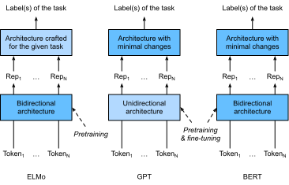

# Transformerによる双方向エンコーダ表現（BERT）
:label:`sec_bert`

これまでに、自然言語理解のためのいくつかの単語埋め込みモデルを紹介してきた。
事前学習後、その出力は行ごとに所定の語彙の単語を表すベクトルが並んだ行列とみなせる。
実際、これらの単語埋め込みモデルはいずれも *文脈非依存* である。
まず、この性質を示そう。

## 文脈非依存から文脈依存へ

:numref:`sec_word2vec_pretraining` と :numref:`sec_synonyms` の実験を思い出そう。
たとえば、word2vec と GloVe は、単語の文脈に関係なく（文脈がある場合でも）同じ単語に同じ事前学習済みベクトルを割り当てる。
形式的には、任意のトークン $x$ の文脈非依存表現とは、入力として $x$ のみを受け取る関数 $f(x)$ である。
自然言語には多義性や複雑な意味論が豊富に存在するため、文脈非依存表現には明らかな限界がある。
たとえば、"a crane is flying" と "a crane driver came" という文脈における "crane" は、まったく異なる意味を持つ。
したがって、同じ単語でも文脈に応じて異なる表現が割り当てられることがある。

このことが、単語の表現がその文脈に依存する *文脈依存* 単語表現の発展を促した。
したがって、トークン $x$ の文脈依存表現とは、$x$ とその文脈 $c(x)$ の両方に依存する関数 $f(x, c(x))$ である。
代表的な文脈依存表現には、TagLM（language-model-augmented sequence tagger） :cite:`Peters.Ammar.Bhagavatula.ea.2017`、CoVe（Context Vectors） :cite:`McCann.Bradbury.Xiong.ea.2017`、ELMo（Embeddings from Language Models） :cite:`Peters.Neumann.Iyyer.ea.2018` がある。

たとえば、系列全体を入力として与えることで、ELMo は入力系列中の各単語に表現を割り当てる関数である。
具体的には、ELMo は事前学習済みの双方向 LSTM のすべての中間層表現を出力表現として組み合わせる。
その後、ELMo 表現は、既存の教師ありモデルに追加特徴量として加えられる。たとえば、ELMo 表現と既存モデルにおけるトークンの元の表現（例：GloVe）を連結する。
一方で、ELMo 表現を追加した後は、事前学習済み双方向 LSTM モデルのすべての重みは固定される。
他方で、既存の教師ありモデルは、特定のタスクに合わせて個別に調整される。
当時のタスクごとの最良モデルを活用することで、ELMo の追加により、感情分析、自然言語推論、意味役割付与、共参照解決、固有表現認識、質問応答の6つの自然言語処理タスクで最先端性能が向上した。

## タスク特化からタスク非依存へ

ELMo は多様な自然言語処理タスクの解決を大きく改善したが、それでも各解法は *タスク特化* のアーキテクチャに依存している。
しかし、自然言語処理タスクごとに個別のアーキテクチャを設計するのは、実際には容易ではない。
GPT（Generative Pre-Training）モデルは、文脈依存表現のための一般的な *タスク非依存* モデルを設計しようとする試みである :cite:`Radford.Narasimhan.Salimans.ea.2018`。
Transformer デコーダ上に構築された GPT は、テキスト系列の表現に用いられる言語モデルを事前学習する。
GPT を下流タスクに適用する際には、言語モデルの出力が追加の線形出力層に入力され、タスクのラベルを予測する。
事前学習済みモデルのパラメータを固定する ELMo とは対照的に、GPT は下流タスクの教師あり学習中に、事前学習済み Transformer デコーダの *すべて* のパラメータを微調整する。
GPT は、自然言語推論、質問応答、文類似度、分類の12個のタスクで評価され、モデルアーキテクチャへの変更を最小限に抑えつつ、そのうち9個で最先端性能を更新した。

しかし、言語モデルの自己回帰的な性質のため、GPT は前方（左から右）しか見ない。
"i went to the bank to deposit cash" と "i went to the bank to sit down" という文脈では、"bank" は左側の文脈に敏感であるが、GPT は "bank" に対して同じ表現を返してしまう。
そのため、意味は異なるにもかかわらず同一の表現になってしまう。

## BERT: 両者の長所を組み合わせる

これまで見てきたように、
ELMo は文脈を双方向に符号化するが、タスク特化のアーキテクチャを用いる。
一方、GPT はタスク非依存だが、文脈を左から右へ符号化する。
両者の長所を組み合わせた BERT（Bidirectional Encoder Representations from Transformers）は、文脈を双方向に符号化し、幅広い自然言語処理タスクに対して最小限のアーキテクチャ変更しか必要としない :cite:`Devlin.Chang.Lee.ea.2018`。
事前学習済み Transformer エンコーダを用いることで、BERT は双方向の文脈に基づいて任意のトークンを表現できる。
下流タスクの教師あり学習では、BERT は2つの点で GPT に似ている。
第1に、BERT の表現は追加の出力層に入力され、タスクの性質に応じて、たとえば各トークンを予測するか系列全体を予測するかといった最小限のアーキテクチャ変更で済む。
第2に、事前学習済み Transformer エンコーダのすべてのパラメータが微調整され、追加の出力層はゼロから学習される。
:numref:`fig_elmo-gpt-bert` は ELMo、GPT、BERT の違いを示している。


:label:`fig_elmo-gpt-bert`

BERT はさらに、(i) 単一テキスト分類（例：感情分析）、(ii) テキスト対分類（例：自然言語推論）、(iii) 質問応答、(iv) テキストタグ付け（例：固有表現認識）という広いカテゴリにわたる11個の自然言語処理タスクで最先端性能を更新した。
2018年に提案された、文脈依存の ELMo からタスク非依存の GPT と BERT まで、自然言語の深い表現を事前学習するという概念的には単純だが実証的には強力な手法は、さまざまな自然言語処理タスクの解決を一変させた。

この章の残りでは、BERT の事前学習を詳しく見ていく。
自然言語処理アプリケーションについては :numref:`chap_nlp_app` で説明する際に、下流アプリケーション向けの BERT の微調整を示す。

```{.python .input}
#@tab mxnet
from d2l import mxnet as d2l
from mxnet import gluon, np, npx
from mxnet.gluon import nn

npx.set_np()
```

```{.python .input}
#@tab pytorch
from d2l import torch as d2l
import torch
from torch import nn
```

## [**入力表現**]
:label:`subsec_bert_input_rep`

自然言語処理では、
感情分析のように単一テキストを入力とするタスクもあれば、
自然言語推論のように2つのテキスト系列の対を入力とするタスクもある。
BERT の入力系列は、単一テキストとテキスト対の両方を明確に表現できる。
前者では、BERT の入力系列は
特別な分類トークン “&lt;cls&gt;”、
テキスト系列のトークン、
および特別な区切りトークン “&lt;sep&gt;” の連結である。
後者では、BERT の入力系列は
“&lt;cls&gt;”、第1テキスト系列のトークン、
“&lt;sep&gt;”、第2テキスト系列のトークン、そして “&lt;sep&gt;” の連結である。
ここでは、"BERT input sequence" という用語を他の種類の "sequences" と一貫して区別する。
たとえば、1つの *BERT input sequence* は、1つの *text sequence* または2つの *text sequences* のいずれかを含みうる。

テキスト対を区別するために、学習されるセグメント埋め込み $\mathbf{e}_A$ と $\mathbf{e}_B$ が、それぞれ第1系列と第2系列のトークン埋め込みに加えられる。
単一テキスト入力では、$\mathbf{e}_A$ のみが使われる。

以下の `get_tokens_and_segments` は、1文または2文を入力として受け取り、BERT 入力系列のトークンと対応するセグメント ID を返す。

```{.python .input}
#@tab all
#@save
def get_tokens_and_segments(tokens_a, tokens_b=None):
    """Get tokens of the BERT input sequence and their segment IDs."""
    tokens = ['<cls>'] + tokens_a + ['<sep>']
    # 0 and 1 are marking segment A and B, respectively
    segments = [0] * (len(tokens_a) + 2)
    if tokens_b is not None:
        tokens += tokens_b + ['<sep>']
        segments += [1] * (len(tokens_b) + 1)
    return tokens, segments
```

BERT は双方向アーキテクチャとして Transformer エンコーダを採用する。
Transformer エンコーダで一般的なように、位置埋め込みは BERT 入力系列の各位置に加えられる。
ただし、元の Transformer エンコーダとは異なり、BERT では *学習可能* な位置埋め込みを用いる。
要するに、 :numref:`fig_bert-input` が示すように、BERT 入力系列の埋め込みは
トークン埋め込み、セグメント埋め込み、位置埋め込みの和である。


:label:`fig_bert-input`

以下の [**`BERTEncoder` クラス**] は、 :numref:`sec_transformer` で実装した `TransformerEncoder` クラスに似ている。
`TransformerEncoder` とは異なり、`BERTEncoder` は
セグメント埋め込みと学習可能な位置埋め込みを用いる。

```{.python .input}
#@tab mxnet
#@save
class BERTEncoder(nn.Block):
    """BERT encoder."""
    def __init__(self, vocab_size, num_hiddens, ffn_num_hiddens, num_heads,
                 num_blks, dropout, max_len=1000, **kwargs):
        super(BERTEncoder, self).__init__(**kwargs)
        self.token_embedding = nn.Embedding(vocab_size, num_hiddens)
        self.segment_embedding = nn.Embedding(2, num_hiddens)
        self.blks = nn.Sequential()
        for _ in range(num_blks):
            self.blks.add(d2l.TransformerEncoderBlock(
                num_hiddens, ffn_num_hiddens, num_heads, dropout, True))
        # In BERT, positional embeddings are learnable, thus we create a
        # parameter of positional embeddings that are long enough
        self.pos_embedding = self.params.get('pos_embedding',
                                             shape=(1, max_len, num_hiddens))

    def forward(self, tokens, segments, valid_lens):
        # Shape of `X` remains unchanged in the following code snippet:
        # (batch size, max sequence length, `num_hiddens`)
        X = self.token_embedding(tokens) + self.segment_embedding(segments)
        X = X + self.pos_embedding.data(ctx=X.ctx)[:, :X.shape[1], :]
        for blk in self.blks:
            X = blk(X, valid_lens)
        return X
```

```{.python .input}
#@tab pytorch
#@save
class BERTEncoder(nn.Module):
    """BERT encoder."""
    def __init__(self, vocab_size, num_hiddens, ffn_num_hiddens, num_heads,
                 num_blks, dropout, max_len=1000, **kwargs):
        super(BERTEncoder, self).__init__(**kwargs)
        self.token_embedding = nn.Embedding(vocab_size, num_hiddens)
        self.segment_embedding = nn.Embedding(2, num_hiddens)
        self.blks = nn.Sequential()
        for i in range(num_blks):
            self.blks.add_module(f"{i}", d2l.TransformerEncoderBlock(
                num_hiddens, ffn_num_hiddens, num_heads, dropout, True))
        # In BERT, positional embeddings are learnable, thus we create a
        # parameter of positional embeddings that are long enough
        self.pos_embedding = nn.Parameter(torch.randn(1, max_len,
                                                      num_hiddens))

    def forward(self, tokens, segments, valid_lens):
        # Shape of `X` remains unchanged in the following code snippet:
        # (batch size, max sequence length, `num_hiddens`)
        X = self.token_embedding(tokens) + self.segment_embedding(segments)
        X = X + self.pos_embedding[:, :X.shape[1], :]
        for blk in self.blks:
            X = blk(X, valid_lens)
        return X
```

語彙サイズが 10000 だと仮定しよう。
[**`BERTEncoder` の順伝播による推論**] を示すために、そのインスタンスを作成し、パラメータを初期化する。

```{.python .input}
#@tab mxnet
vocab_size, num_hiddens, ffn_num_hiddens, num_heads = 10000, 768, 1024, 4
num_blks, dropout = 2, 0.2
encoder = BERTEncoder(vocab_size, num_hiddens, ffn_num_hiddens, num_heads,
                      num_blks, dropout)
encoder.initialize()
```

```{.python .input}
#@tab pytorch
vocab_size, num_hiddens, ffn_num_hiddens, num_heads = 10000, 768, 1024, 4
ffn_num_input, num_blks, dropout = 768, 2, 0.2
encoder = BERTEncoder(vocab_size, num_hiddens, ffn_num_hiddens, num_heads,
                      num_blks, dropout)
```

`tokens` を長さ 8 の 2つの BERT 入力系列と定義し、各トークンは語彙のインデックスであるとする。
入力 `tokens` に対する `BERTEncoder` の順伝播推論は、各トークンがベクトルで表現された符号化結果を返す。
そのベクトル長はハイパーパラメータ `num_hiddens` によって定義される。
このハイパーパラメータは通常、Transformer エンコーダの *隠れサイズ*（隠れユニット数）と呼ばれる。

```{.python .input}
#@tab mxnet
tokens = np.random.randint(0, vocab_size, (2, 8))
segments = np.array([[0, 0, 0, 0, 1, 1, 1, 1], [0, 0, 0, 1, 1, 1, 1, 1]])
encoded_X = encoder(tokens, segments, None)
encoded_X.shape
```

```{.python .input}
#@tab pytorch
tokens = torch.randint(0, vocab_size, (2, 8))
segments = torch.tensor([[0, 0, 0, 0, 1, 1, 1, 1], [0, 0, 0, 1, 1, 1, 1, 1]])
encoded_X = encoder(tokens, segments, None)
encoded_X.shape
```

## 事前学習タスク
:label:`subsec_bert_pretraining_tasks`

`BERTEncoder` の順伝播推論は、入力テキストの各トークンと挿入された
特別トークン “&lt;cls&gt;” および “&lt;seq&gt;” の BERT 表現を与える。
次に、これらの表現を用いて BERT の事前学習の損失関数を計算する。
事前学習は次の2つのタスクから構成される：マスク付き言語モデルと次文予測である。

### [**マスク付き言語モデル**]
:label:`subsec_mlm`

:numref:`sec_language-model` で示したように、言語モデルは左側の文脈を用いてトークンを予測する。
各トークンの表現のために双方向の文脈を符号化するには、BERT はトークンをランダムにマスクし、双方向文脈からのトークンを用いて自己教師ありでマスクされたトークンを予測する。
このタスクは *マスク付き言語モデル* と呼ばれる。

この事前学習タスクでは、
トークンの15%がランダムに選ばれ、予測対象のマスクされたトークンとなる。
ラベルを使って答えを覗き見しないように、マスクされたトークンを予測するための単純な方法は、BERT 入力系列中でそれを常に特別な “&lt;mask&gt;” トークンに置き換えることである。
しかし、この人工的な特別トークン “&lt;mask&gt;” は微調整では決して現れない。
事前学習と微調整の間のこのような不一致を避けるため、あるトークンが予測のためにマスクされる場合（たとえば "this movie is great" で "great" がマスクおよび予測対象として選ばれた場合）、入力では次のように置き換えられる。

* 80% の確率で特別な “&lt;mask&gt;” トークンに置き換える（例："this movie is great" が "this movie is &lt;mask&gt;" になる）；
* 10% の確率でランダムなトークンに置き換える（例："this movie is great" が "this movie is drink" になる）；
* 10% の確率でラベルのトークンをそのまま残す（例："this movie is great" が "this movie is great" のままになる）。

15% のうち 10% の確率でランダムなトークンが挿入されることに注意しよう。
このときどき入るノイズは、BERT が双方向文脈の符号化においてマスクされたトークンに過度に偏らないよう促す（特にラベルのトークンがそのまま残る場合）。

以下の `MaskLM` クラスを実装して、BERT 事前学習のマスク付き言語モデルタスクにおけるマスクされたトークンを予測する。
予測には1隠れ層 MLP（`self.mlp`）を用いる。
順伝播推論では、2つの入力を受け取る：
`BERTEncoder` の符号化結果と、予測対象のトークン位置である。
出力は、これらの位置における予測結果である。

```{.python .input}
#@tab mxnet
#@save
class MaskLM(nn.Block):
    """The masked language model task of BERT."""
    def __init__(self, vocab_size, num_hiddens, **kwargs):
        super(MaskLM, self).__init__(**kwargs)
        self.mlp = nn.Sequential()
        self.mlp.add(
            nn.Dense(num_hiddens, flatten=False, activation='relu'))
        self.mlp.add(nn.LayerNorm())
        self.mlp.add(nn.Dense(vocab_size, flatten=False))

    def forward(self, X, pred_positions):
        num_pred_positions = pred_positions.shape[1]
        pred_positions = pred_positions.reshape(-1)
        batch_size = X.shape[0]
        batch_idx = np.arange(0, batch_size)
        # Suppose that `batch_size` = 2, `num_pred_positions` = 3, then
        # `batch_idx` is `np.array([0, 0, 0, 1, 1, 1])`
        batch_idx = np.repeat(batch_idx, num_pred_positions)
        masked_X = X[batch_idx, pred_positions]
        masked_X = masked_X.reshape((batch_size, num_pred_positions, -1))
        mlm_Y_hat = self.mlp(masked_X)
        return mlm_Y_hat
```

```{.python .input}
#@tab pytorch
#@save
class MaskLM(nn.Module):
    """The masked language model task of BERT."""
    def __init__(self, vocab_size, num_hiddens, **kwargs):
        super(MaskLM, self).__init__(**kwargs)
        self.mlp = nn.Sequential(nn.LazyLinear(num_hiddens),
                                 nn.ReLU(),
                                 nn.LayerNorm(num_hiddens),
                                 nn.LazyLinear(vocab_size))

    def forward(self, X, pred_positions):
        num_pred_positions = pred_positions.shape[1]
        pred_positions = pred_positions.reshape(-1)
        batch_size = X.shape[0]
        batch_idx = torch.arange(0, batch_size)
        # Suppose that `batch_size` = 2, `num_pred_positions` = 3, then
        # `batch_idx` is `torch.tensor([0, 0, 0, 1, 1, 1])`
        batch_idx = torch.repeat_interleave(batch_idx, num_pred_positions)
        masked_X = X[batch_idx, pred_positions]
        masked_X = masked_X.reshape((batch_size, num_pred_positions, -1))
        mlm_Y_hat = self.mlp(masked_X)
        return mlm_Y_hat
```

[**`MaskLM` の順伝播推論**] を示すために、そのインスタンス `mlm` を作成して初期化する。
`BERTEncoder` の順伝播推論から得られる `encoded_X` は、2つの BERT 入力系列を表していることを思い出そう。
`mlm_positions` を、`encoded_X` のいずれかの BERT 入力系列において予測する3つのインデックスとして定義する。
`mlm` の順伝播推論は、`encoded_X` のすべてのマスク位置 `mlm_positions` における予測結果 `mlm_Y_hat` を返す。
各予測について、結果のサイズは語彙サイズに等しい。

```{.python .input}
#@tab mxnet
mlm = MaskLM(vocab_size, num_hiddens)
mlm.initialize()
mlm_positions = np.array([[1, 5, 2], [6, 1, 5]])
mlm_Y_hat = mlm(encoded_X, mlm_positions)
mlm_Y_hat.shape
```

```{.python .input}
#@tab pytorch
mlm = MaskLM(vocab_size, num_hiddens)
mlm_positions = torch.tensor([[1, 5, 2], [6, 1, 5]])
mlm_Y_hat = mlm(encoded_X, mlm_positions)
mlm_Y_hat.shape
```

マスク下で予測されたトークン `mlm_Y_hat` の正解ラベル `mlm_Y` があれば、BERT 事前学習におけるマスク付き言語モデルタスクの交差エントロピー損失を計算できる。

```{.python .input}
#@tab mxnet
mlm_Y = np.array([[7, 8, 9], [10, 20, 30]])
loss = gluon.loss.SoftmaxCrossEntropyLoss()
mlm_l = loss(mlm_Y_hat.reshape((-1, vocab_size)), mlm_Y.reshape(-1))
mlm_l.shape
```

```{.python .input}
#@tab pytorch
mlm_Y = torch.tensor([[7, 8, 9], [10, 20, 30]])
loss = nn.CrossEntropyLoss(reduction='none')
mlm_l = loss(mlm_Y_hat.reshape((-1, vocab_size)), mlm_Y.reshape(-1))
mlm_l.shape
```

### [**次文予測**]
:label:`subsec_nsp`

マスク付き言語モデルは単語の表現のために双方向文脈を符号化できるが、テキスト対の論理的関係を明示的にはモデル化しない。
2つのテキスト系列の関係を理解する助けとして、BERT は事前学習において *次文予測* という二値分類タスクを考える。
事前学習用の文対を生成する際、半分の確率では実際に連続する文であり、ラベルは "True" である。
残りの半分では、第2文はコーパスからランダムにサンプリングされ、ラベルは "False" である。

以下の `NextSentencePred` クラスは、1隠れ層 MLP を用いて、BERT 入力系列における第2文が第1文の次の文であるかどうかを予測する。
Transformer エンコーダの自己注意により、特別トークン “&lt;cls&gt;” の BERT 表現は入力中の2つの文の両方を符号化する。
したがって、MLP 分類器の出力層（`self.output`）は `X` を入力として受け取る。ここで `X` は、符号化された “&lt;cls&gt;” トークンを入力とする MLP の隠れ層の出力である。

```{.python .input}
#@tab mxnet
#@save
class NextSentencePred(nn.Block):
    """The next sentence prediction task of BERT."""
    def __init__(self, **kwargs):
        super(NextSentencePred, self).__init__(**kwargs)
        self.output = nn.Dense(2)

    def forward(self, X):
        # `X` shape: (batch size, `num_hiddens`)
        return self.output(X)
```

```{.python .input}
#@tab pytorch
#@save
class NextSentencePred(nn.Module):
    """The next sentence prediction task of BERT."""
    def __init__(self, **kwargs):
        super(NextSentencePred, self).__init__(**kwargs)
        self.output = nn.LazyLinear(2)

    def forward(self, X):
        # `X` shape: (batch size, `num_hiddens`)
        return self.output(X)
```

[**`NextSentencePred` のインスタンスの順伝播推論**] は、各 BERT 入力系列に対して二値予測を返すことがわかる。

```{.python .input}
#@tab mxnet
nsp = NextSentencePred()
nsp.initialize()
nsp_Y_hat = nsp(encoded_X)
nsp_Y_hat.shape
```

```{.python .input}
#@tab pytorch
# PyTorch by default will not flatten the tensor as seen in mxnet where, if
# flatten=True, all but the first axis of input data are collapsed together
encoded_X = torch.flatten(encoded_X, start_dim=1)
# input_shape for NSP: (batch size, `num_hiddens`)
nsp = NextSentencePred()
nsp_Y_hat = nsp(encoded_X)
nsp_Y_hat.shape
```

2つの二値分類の交差エントロピー損失も計算できる。

```{.python .input}
#@tab mxnet
nsp_y = np.array([0, 1])
nsp_l = loss(nsp_Y_hat, nsp_y)
nsp_l.shape
```

```{.python .input}
#@tab pytorch
nsp_y = torch.tensor([0, 1])
nsp_l = loss(nsp_Y_hat, nsp_y)
nsp_l.shape
```

前述の2つの事前学習タスクにおけるすべてのラベルは、手作業のラベル付けを行わずとも、事前学習コーパスから自明に得られることに注目すべきである。
元の BERT は BookCorpus :cite:`Zhu.Kiros.Zemel.ea.2015` と英語版 Wikipedia を連結したものを用いて事前学習されている。
これら2つのテキストコーパスは非常に大きく、それぞれ8億語と25億語を含む。

## [**まとめてみよう**]

BERT を事前学習するとき、最終的な損失関数はマスク付き言語モデルと次文予測の両方の損失関数の線形結合である。
ここで、`BERTEncoder`、`MaskLM`、`NextSentencePred` の3つのクラスをインスタンス化することで、`BERTModel` クラスを定義できる。
順伝播推論は、符号化された BERT 表現 `encoded_X`、マスク付き言語モデルの予測 `mlm_Y_hat`、および次文予測 `nsp_Y_hat` を返す。

```{.python .input}
#@tab mxnet
#@save
class BERTModel(nn.Block):
    """The BERT model."""
    def __init__(self, vocab_size, num_hiddens, ffn_num_hiddens, num_heads,
                 num_blks, dropout, max_len=1000):
        super(BERTModel, self).__init__()
        self.encoder = BERTEncoder(vocab_size, num_hiddens, ffn_num_hiddens,
                                   num_heads, num_blks, dropout, max_len)
        self.hidden = nn.Dense(num_hiddens, activation='tanh')
        self.mlm = MaskLM(vocab_size, num_hiddens)
        self.nsp = NextSentencePred()

    def forward(self, tokens, segments, valid_lens=None, pred_positions=None):
        encoded_X = self.encoder(tokens, segments, valid_lens)
        if pred_positions is not None:
            mlm_Y_hat = self.mlm(encoded_X, pred_positions)
        else:
            mlm_Y_hat = None
        # The hidden layer of the MLP classifier for next sentence prediction.
        # 0 is the index of the '<cls>' token
        nsp_Y_hat = self.nsp(self.hidden(encoded_X[:, 0, :]))
        return encoded_X, mlm_Y_hat, nsp_Y_hat
```

```{.python .input}
#@tab pytorch
#@save
class BERTModel(nn.Module):
    """The BERT model."""
    def __init__(self, vocab_size, num_hiddens, ffn_num_hiddens, 
                 num_heads, num_blks, dropout, max_len=1000):
        super(BERTModel, self).__init__()
        self.encoder = BERTEncoder(vocab_size, num_hiddens, ffn_num_hiddens,
                                   num_heads, num_blks, dropout,
                                   max_len=max_len)
        self.hidden = nn.Sequential(nn.LazyLinear(num_hiddens),
                                    nn.Tanh())
        self.mlm = MaskLM(vocab_size, num_hiddens)
        self.nsp = NextSentencePred()

    def forward(self, tokens, segments, valid_lens=None, pred_positions=None):
        encoded_X = self.encoder(tokens, segments, valid_lens)
        if pred_positions is not None:
            mlm_Y_hat = self.mlm(encoded_X, pred_positions)
        else:
            mlm_Y_hat = None
        # The hidden layer of the MLP classifier for next sentence prediction.
        # 0 is the index of the '<cls>' token
        nsp_Y_hat = self.nsp(self.hidden(encoded_X[:, 0, :]))
        return encoded_X, mlm_Y_hat, nsp_Y_hat
```

## まとめ

* word2vec や GloVe のような単語埋め込みモデルは文脈非依存である。これらは、単語の文脈に関係なく（文脈がある場合でも）同じ単語に同じ事前学習済みベクトルを割り当てる。多義性や自然言語の複雑な意味論をうまく扱うのは難しい。
* ELMo や GPT のような文脈依存単語表現では、単語の表現はその文脈に依存する。
* ELMo は文脈を双方向に符号化するが、タスク特化のアーキテクチャを用いる（ただし、自然言語処理タスクごとに個別のアーキテクチャを作るのは実際には容易ではない）。一方、GPT はタスク非依存だが、文脈を左から右へ符号化する。
* BERT は両者の長所を組み合わせる。すなわち、文脈を双方向に符号化し、幅広い自然言語処理タスクに対して最小限のアーキテクチャ変更しか必要としない。
* BERT 入力系列の埋め込みは、トークン埋め込み、セグメント埋め込み、位置埋め込みの和である。
* BERT の事前学習は2つのタスクから成る：マスク付き言語モデルと次文予測である。前者は単語の表現のために双方向文脈を符号化でき、後者はテキスト対の論理的関係を明示的にモデル化する。

## 演習

1. 他の条件がすべて同じなら、マスク付き言語モデルは左から右への言語モデルよりも、収束に必要な事前学習ステップ数が多くなるだろうか、それとも少なくなるだろうか。なぜか。
1. BERT の元の実装では、`BERTEncoder`（`d2l.TransformerEncoderBlock` 経由）の位置ごとのフィードフォワードネットワークと `MaskLM` の全結合層の両方で、活性化関数としてガウス誤差線形ユニット（GELU） :cite:`Hendrycks.Gimpel.2016` が使われている。GELU と ReLU の違いについて調べよ。\n
