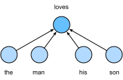

# 単語埋め込み（word2vec）
:label:`sec_word2vec`

自然言語は、意味を表現するために用いられる複雑なシステムです。
このシステムでは、単語が意味の基本単位です。
その名のとおり、
*単語ベクトル* は単語を表現するためのベクトルであり、
単語の特徴ベクトル、あるいは表現とみなすこともできます。
単語を実数ベクトルに写像する技術は
*単語埋め込み* と呼ばれます。
近年、
単語埋め込みは徐々に
自然言語処理の基礎知識となってきました。

## ワンホットベクトルは悪い選択

:numref:`sec_rnn-scratch` では、単語（文字は単語）を表現するためにワンホットベクトルを用いました。
辞書中の異なる単語の数（辞書サイズ）を $N$ とし、
各単語に $0$ から $N-1$ までの
異なる整数（インデックス）を対応させるとします。
インデックスが $i$ の任意の単語に対して
ワンホットベクトル表現を得るには、
長さ $N$ の全要素 0 のベクトルを作成し、
位置 $i$ の要素を 1 に設定します。
このようにして、各単語は長さ $N$ のベクトルで表現され、
ニューラルネットワークで直接利用できます。

ワンホット単語ベクトルは簡単に構成できますが、
通常は良い選択ではありません。
主な理由の1つは、ワンホット単語ベクトルでは、私たちがよく用いる *コサイン類似度* のように、異なる単語間の類似性を正確に表現できないことです。
ベクトル $\mathbf{x}, \mathbf{y} \in \mathbb{R}^d$ に対して、そのコサイン類似度は両者のなす角の余弦です。

$$\frac{\mathbf{x}^\top \mathbf{y}}{\|\mathbf{x}\| \|\mathbf{y}\|} \in [-1, 1].$$

任意の異なる2つの単語のワンホットベクトル間のコサイン類似度は 0 なので、
ワンホットベクトルは単語間の類似性を符号化できません。

## 自己教師あり word2vec

上記の問題に対処するために [word2vec](https://code.google.com/archive/p/word2vec/) ツールが提案されました。
これは各単語を固定長ベクトルに写像し、これらのベクトルは異なる単語間の類似性や類推関係をよりよく表現できます。
word2vec ツールには2つのモデル、すなわち *skip-gram* :cite:`Mikolov.Sutskever.Chen.ea.2013` と *continuous bag of words*（CBOW） :cite:`Mikolov.Chen.Corrado.ea.2013` があります。
意味的に有意味な表現を得るために、
その学習は
条件付き確率に依存しており、
コーパス中の
周囲のいくつかの単語を使って
いくつかの単語を予測するものとみなせます。
教師信号がラベルなしデータから得られるため、
skip-gram と continuous bag of words の両方は
自己教師ありモデルです。

以下では、これら2つのモデルとその学習方法を紹介します。

## Skip-Gram モデル
:label:`subsec_skip-gram`

*skip-gram* モデルは、ある単語からテキスト系列中の周囲の単語を生成できると仮定します。
テキスト系列 "the", "man", "loves", "his", "son" を例に取りましょう。
"loves" を *中心単語* とし、コンテキストウィンドウサイズを 2 に設定します。
:numref:`fig_skip_gram` に示すように、
中心単語 "loves" が与えられたとき、
skip-gram モデルは、中心単語から 2 語以内にある *文脈単語* "the", "man", "his", "son" を生成する条件付き確率を考えます。

$$P(\textrm{"the"},\textrm{"man"},\textrm{"his"},\textrm{"son"}\mid\textrm{"loves"}).$$

中心単語が与えられたときに
文脈単語が独立に生成される
（すなわち条件付き独立）と仮定します。
この場合、上の条件付き確率は
次のように書き換えられます。

$$P(\textrm{"the"}\mid\textrm{"loves"})\cdot P(\textrm{"man"}\mid\textrm{"loves"})\cdot P(\textrm{"his"}\mid\textrm{"loves"})\cdot P(\textrm{"son"}\mid\textrm{"loves"}).$$

:label:`fig_skip_gram`

skip-gram モデルでは、各単語は条件付き確率を計算するために2つの $d$ 次元ベクトル表現を持ちます。
より具体的には、
辞書中のインデックスが $i$ の任意の単語について、
$\mathbf{v}_i\in\mathbb{R}^d$
および $\mathbf{u}_i\in\mathbb{R}^d$
を、それぞれ *中心* 単語および *文脈* 単語として用いるときの2つのベクトルとします。
辞書中のインデックスが $o$ の任意の文脈単語 $w_o$ を、辞書中のインデックスが $c$ の中心単語 $w_c$ から生成する条件付き確率は、ベクトルの内積に対する softmax 演算でモデル化できます。

$$P(w_o \mid w_c) = \frac{\exp(\mathbf{u}_o^\top \mathbf{v}_c)}{ \sum_{i \in \mathcal{V}} \exp(\mathbf{u}_i^\top \mathbf{v}_c)},$$
:eqlabel:`eq_skip-gram-softmax`

ここで、語彙インデックス集合 $\mathcal{V} = \{0, 1, \ldots, |\mathcal{V}|-1\}$ です。
長さ $T$ のテキスト系列があり、時刻 $t$ の単語を $w^{(t)}$ と表します。
任意の中心単語が与えられたときに
文脈単語が独立に生成されると仮定します。
コンテキストウィンドウサイズを $m$ とすると、
skip-gram モデルの尤度関数は、
任意の中心単語が与えられたときに
すべての文脈単語を生成する確率です。

$$ \prod_{t=1}^{T} \prod_{-m \leq j \leq m,\ j \neq 0} P(w^{(t+j)} \mid w^{(t)}),$$

ここで、1 未満または $T$ を超える時刻は省略できます。

### 学習

skip-gram モデルのパラメータは、語彙中の各単語に対する中心単語ベクトルと文脈単語ベクトルです。
学習では、尤度関数を最大化する（すなわち最尤推定を行う）ことでモデルパラメータを学習します。これは次の損失関数を最小化することと等価です。

$$ - \sum_{t=1}^{T} \sum_{-m \leq j \leq m,\ j \neq 0} \textrm{log}\, P(w^{(t+j)} \mid w^{(t)}).$$

確率的勾配降下法を用いて損失を最小化するとき、
各反復で
より短い部分系列をランダムにサンプリングし、その部分系列に対する（確率的）勾配を計算してモデルパラメータを更新できます。
この（確率的）勾配を計算するには、
中心単語ベクトルと文脈単語ベクトルに関する
対数条件付き確率の勾配を求める必要があります。
一般に、:eqref:`eq_skip-gram-softmax` に従うと、
中心単語 $w_c$ と
文脈単語 $w_o$ の任意の組に関わる対数条件付き確率は

$$\log P(w_o \mid w_c) =\mathbf{u}_o^\top \mathbf{v}_c - \log\left(\sum_{i \in \mathcal{V}} \exp(\mathbf{u}_i^\top \mathbf{v}_c)\right).$$
:eqlabel:`eq_skip-gram-log`

微分により、その中心単語ベクトル $\mathbf{v}_c$ に関する勾配は次のように得られます。

$$\begin{aligned}\frac{\partial \textrm{log}\, P(w_o \mid w_c)}{\partial \mathbf{v}_c}&= \mathbf{u}_o - \frac{\sum_{j \in \mathcal{V}} \exp(\mathbf{u}_j^\top \mathbf{v}_c)\mathbf{u}_j}{\sum_{i \in \mathcal{V}} \exp(\mathbf{u}_i^\top \mathbf{v}_c)}\\&= \mathbf{u}_o - \sum_{j \in \mathcal{V}} \left(\frac{\exp(\mathbf{u}_j^\top \mathbf{v}_c)}{ \sum_{i \in \mathcal{V}} \exp(\mathbf{u}_i^\top \mathbf{v}_c)}\right) \mathbf{u}_j\\&= \mathbf{u}_o - \sum_{j \in \mathcal{V}} P(w_j \mid w_c) \mathbf{u}_j.\end{aligned}$$
:eqlabel:`eq_skip-gram-grad`

:eqref:`eq_skip-gram-grad` の計算には、中心単語として $w_c$ を用いたときの辞書中のすべての単語の条件付き確率が必要であることに注意してください。
他の単語ベクトルに対する勾配も同様に求められます。

学習後、辞書中のインデックスが $i$ の任意の単語について、2つの単語ベクトル
$\mathbf{v}_i$（中心単語として）と $\mathbf{u}_i$（文脈単語として）を得ます。
自然言語処理の応用では、skip-gram モデルの中心単語ベクトルが通常
単語表現として用いられます。

## Continuous Bag of Words（CBOW）モデル

*continuous bag of words*（CBOW）モデルは skip-gram モデルに似ています。
skip-gram モデルとの主な違いは、
continuous bag of words モデルが
テキスト系列中の周囲の文脈単語に基づいて
中心単語が生成されると仮定する点です。
たとえば、
同じテキスト系列 "the", "man", "loves", "his", "son" で、"loves" を中心単語とし、コンテキストウィンドウサイズを 2 とすると、
continuous bag of words モデルは
文脈単語 "the", "man", "his", "son" に基づいて中心単語 "loves" を生成する条件付き確率を考えます（:numref:`fig_cbow` を参照）。これは

$$P(\textrm{"loves"}\mid\textrm{"the"},\textrm{"man"},\textrm{"his"},\textrm{"son"}).$$

:label:`fig_cbow`

continuous bag of words モデルでは
複数の文脈単語があるため、
条件付き確率の計算ではこれらの文脈単語ベクトルを平均します。
具体的には、
辞書中のインデックスが $i$ の任意の単語について、
$\mathbf{v}_i\in\mathbb{R}^d$
および $\mathbf{u}_i\in\mathbb{R}^d$
を、それぞれ *文脈* 単語および *中心* 単語として用いるときの2つのベクトルとします
（意味は skip-gram モデルと入れ替わっています）。
周囲の文脈単語 $w_{o_1}, \ldots, w_{o_{2m}}$（辞書中のインデックスが $o_1, \ldots, o_{2m}$）が与えられたときに、任意の中心単語 $w_c$（辞書中のインデックスが $c$）を生成する条件付き確率は、次のようにモデル化できます。

$$P(w_c \mid w_{o_1}, \ldots, w_{o_{2m}}) = \frac{\exp\left(\frac{1}{2m}\mathbf{u}_c^\top (\mathbf{v}_{o_1} + \ldots + \mathbf{v}_{o_{2m}}) \right)}{ \sum_{i \in \mathcal{V}} \exp\left(\frac{1}{2m}\mathbf{u}_i^\top (\mathbf{v}_{o_1} + \ldots + \mathbf{v}_{o_{2m}}) \right)}.$$
:eqlabel:`fig_cbow-full`

簡潔のために、$\mathcal{W}_o= \{w_{o_1}, \ldots, w_{o_{2m}}\}$ および $\bar{\mathbf{v}}_o = \left(\mathbf{v}_{o_1} + \ldots + \mathbf{v}_{o_{2m}} \right)/(2m)$ とおきます。すると :eqref:`fig_cbow-full` は次のように簡略化できます。

$$P(w_c \mid \mathcal{W}_o) = \frac{\exp\left(\mathbf{u}_c^\top \bar{\mathbf{v}}_o\right)}{\sum_{i \in \mathcal{V}} \exp\left(\mathbf{u}_i^\top \bar{\mathbf{v}}_o\right)}.$$

長さ $T$ のテキスト系列があり、時刻 $t$ の単語を $w^{(t)}$ と表します。
コンテキストウィンドウサイズを $m$ とすると、
continuous bag of words モデルの尤度関数は、
それぞれの文脈単語が与えられたときに
すべての中心単語を生成する確率です。

$$ \prod_{t=1}^{T}  P(w^{(t)} \mid  w^{(t-m)}, \ldots, w^{(t-1)}, w^{(t+1)}, \ldots, w^{(t+m)}).$$

### 学習

continuous bag of words モデルの学習は、
skip-gram モデルの学習とほぼ同じです。
continuous bag of words モデルの
最尤推定は、次の損失関数を最小化することと等価です。

$$  -\sum_{t=1}^T  \textrm{log}\, P(w^{(t)} \mid  w^{(t-m)}, \ldots, w^{(t-1)}, w^{(t+1)}, \ldots, w^{(t+m)}).$$

次に注意してください。

$$\log\,P(w_c \mid \mathcal{W}_o) = \mathbf{u}_c^\top \bar{\mathbf{v}}_o - \log\,\left(\sum_{i \in \mathcal{V}} \exp\left(\mathbf{u}_i^\top \bar{\mathbf{v}}_o\right)\right).$$

微分により、任意の文脈単語ベクトル $\mathbf{v}_{o_i}$（$i = 1, \ldots, 2m$）に関する勾配は次のように得られます。

$$\frac{\partial \log\, P(w_c \mid \mathcal{W}_o)}{\partial \mathbf{v}_{o_i}} = \frac{1}{2m} \left(\mathbf{u}_c - \sum_{j \in \mathcal{V}} \frac{\exp(\mathbf{u}_j^\top \bar{\mathbf{v}}_o)\mathbf{u}_j}{ \sum_{i \in \mathcal{V}} \exp(\mathbf{u}_i^\top \bar{\mathbf{v}}_o)} \right) = \frac{1}{2m}\left(\mathbf{u}_c - \sum_{j \in \mathcal{V}} P(w_j \mid \mathcal{W}_o) \mathbf{u}_j \right).$$
:eqlabel:`eq_cbow-gradient`

他の単語ベクトルに対する勾配も同様に求められます。
skip-gram モデルとは異なり、
continuous bag of words モデルでは通常
文脈単語ベクトルを単語表現として用います。

## まとめ

* 単語ベクトルは単語を表現するためのベクトルであり、単語の特徴ベクトル、あるいは表現とみなすこともできます。単語を実数ベクトルに写像する技術は単語埋め込みと呼ばれます。
* word2vec ツールには skip-gram モデルと continuous bag of words モデルの両方が含まれます。
* skip-gram モデルは、ある単語からテキスト系列中の周囲の単語を生成できると仮定します。一方、continuous bag of words モデルは、周囲の文脈単語に基づいて中心単語が生成されると仮定します。

## 演習

1. 各勾配を計算する計算量はどれくらいですか？ 辞書サイズが非常に大きい場合、どのような問題が生じますか？
1. 英語のいくつかの定型句は "new york" のように複数の単語から構成されます。これらの単語ベクトルをどのように学習しますか？ ヒント：word2vec 論文の Section 4 を参照してください :cite:`Mikolov.Sutskever.Chen.ea.2013`。
1. skip-gram モデルを例に、word2vec の設計について考えてみましょう。skip-gram モデルにおける2つの単語ベクトルの内積とコサイン類似度の関係は何でしょうか？ 意味的に似た単語の組に対して、なぜ skip-gram モデルで学習した単語ベクトルのコサイン類似度が高くなりうるのでしょうか？
