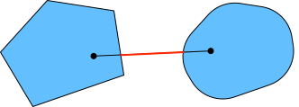
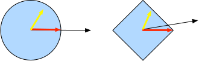

# 凸性
:label:`sec_convexity`

凸性は最適化アルゴリズムの設計において重要な役割を果たす。  
その大きな理由は、このような状況ではアルゴリズムの解析や検証がはるかに容易になるからである。  
言い換えると、
アルゴリズムが凸な設定でさえうまく動かないのであれば、
通常、それ以外の状況で大きな成果を期待すべきではない。  
さらに、深層学習における最適化問題は一般に非凸であるが、局所最小値の近傍では凸関数の性質の一部をしばしば示す。これにより、 :cite:`Izmailov.Podoprikhin.Garipov.ea.2018` のような興味深い新しい最適化手法が生まれる。

```{.python .input}
#@tab mxnet
%matplotlib inline
from d2l import mxnet as d2l
from mpl_toolkits import mplot3d
from mxnet import np, npx
npx.set_np()
```

```{.python .input}
#@tab pytorch
%matplotlib inline
from d2l import torch as d2l
import numpy as np
from mpl_toolkits import mplot3d
import torch
```

```{.python .input}
#@tab tensorflow
%matplotlib inline
from d2l import tensorflow as d2l
import numpy as np
from mpl_toolkits import mplot3d
import tensorflow as tf
```

## 定義

凸解析に入る前に、
*凸集合* と *凸関数* を定義する必要がある。
これらは機械学習で広く用いられる数学的道具につながる。


### 凸集合

集合は凸性の基礎である。簡単に言えば、ベクトル空間内の集合 $\mathcal{X}$ は、任意の $a, b \in \mathcal{X}$ に対して、それらを結ぶ線分がやはり $\mathcal{X}$ に含まれるとき *凸* である。数学的には、すべての $\lambda \in [0, 1]$ について

$$\lambda  a + (1-\lambda)  b \in \mathcal{X} \textrm{ whenever } a, b \in \mathcal{X}.$$

これは少し抽象的に聞こえるかもしれない。 :numref:`fig_pacman` を考えてみよう。最初の集合は、含まれない線分が存在するので凸ではない。
他の2つの集合にはそのような問題はない。


:label:`fig_pacman`

定義は、それを何かに使えない限り、単独ではあまり有用ではない。
この場合、 :numref:`fig_convex_intersect` に示すように交差を考えることができる。
$\mathcal{X}$ と $\mathcal{Y}$ が凸集合だと仮定する。このとき $\mathcal{X} \cap \mathcal{Y}$ も凸である。これを見るには、任意の $a, b \in \mathcal{X} \cap \mathcal{Y}$ を考える。$\mathcal{X}$ と $\mathcal{Y}$ は凸なので、$a$ と $b$ を結ぶ線分は $\mathcal{X}$ と $\mathcal{Y}$ の両方に含まれる。したがって、それらは $\mathcal{X} \cap \mathcal{Y}$ にも含まれなければならず、これで定理が示される。


:label:`fig_convex_intersect`

この結果はほとんど手間をかけずに強めることができる。すなわち、凸集合 $\mathcal{X}_i$ に対して、その交差 $\cap_{i} \mathcal{X}_i$ は凸である。
逆が成り立たないことを見るには、互いに交わらない集合 $\mathcal{X} \cap \mathcal{Y} = \emptyset$ を考える。ここで $a \in \mathcal{X}$ と $b \in \mathcal{Y}$ を取る。 :numref:`fig_nonconvex` の $a$ と $b$ を結ぶ線分には、$\mathcal{X} \cap \mathcal{Y} = \emptyset$ を仮定しているので、$\mathcal{X}$ にも $\mathcal{Y}$ にも属さない部分が含まれていなければならない。したがって、その線分は $\mathcal{X} \cup \mathcal{Y}$ にも含まれず、一般に凸集合の和集合は凸である必要がないことが示される。


:label:`fig_nonconvex`

通常、深層学習の問題は凸集合上で定義される。たとえば、$\mathbb{R}^d$、
すなわち実数からなる $d$ 次元ベクトルの集合は凸集合である（結局のところ、$\mathbb{R}^d$ 内の任意の2点を結ぶ線分は $\mathbb{R}^d$ にとどまる）。場合によっては、$\{\mathbf{x} | \mathbf{x} \in \mathbb{R}^d \textrm{ and } \|\mathbf{x}\| \leq r\}$ で定義される半径 $r$ の球のように、長さに上限のある変数を扱う。

### 凸関数

凸集合が定義できたので、*凸関数* $f$ を導入できる。
凸集合 $\mathcal{X}$ が与えられたとき、関数 $f: \mathcal{X} \to \mathbb{R}$ は、すべての $x, x' \in \mathcal{X}$ とすべての $\lambda \in [0, 1]$ について

$$\lambda f(x) + (1-\lambda) f(x') \geq f(\lambda x + (1-\lambda) x').$$

を満たすとき *凸* である。

これを示すために、関数のグラフを描いて条件を満たすか確認してみよう。
以下では、凸関数と非凸関数の両方をいくつか定義する。

```{.python .input}
#@tab all
f = lambda x: 0.5 * x**2  # Convex
g = lambda x: d2l.cos(np.pi * x)  # Nonconvex
h = lambda x: d2l.exp(0.5 * x)  # Convex

x, segment = d2l.arange(-2, 2, 0.01), d2l.tensor([-1.5, 1])
d2l.use_svg_display()
_, axes = d2l.plt.subplots(1, 3, figsize=(9, 3))
for ax, func in zip(axes, [f, g, h]):
    d2l.plot([x, segment], [func(x), func(segment)], axes=ax)
```

予想どおり、余弦関数は *非凸* であり、放物線と指数関数は凸である。条件が意味を持つためには、$\mathcal{X}$ が凸集合であることが必要である点に注意されたい。そうでなければ、$f(\lambda x + (1-\lambda) x')$ の値が定義できない可能性がある。


### ジェンセンの不等式

凸関数 $f$ が与えられたとき、
最も有用な数学的道具の1つが *ジェンセンの不等式* である。
これは凸性の定義の一般化に相当する。

$$\sum_i \alpha_i f(x_i)  \geq f\left(\sum_i \alpha_i x_i\right)    \textrm{ and }    E_X[f(X)]  \geq f\left(E_X[X]\right),$$
:eqlabel:`eq_jensens-inequality`

ここで $\alpha_i$ は $\sum_i \alpha_i = 1$ を満たす非負の実数であり、$X$ は確率変数である。
言い換えると、凸関数の期待値は、その期待値に凸関数を適用したもの以上になる。後者のほうが通常はより簡単な式である。 
最初の不等式を証明するには、和の中の1項に対して順に凸性の定義を繰り返し適用する。


ジェンセンの不等式のよくある応用の1つは、
より複雑な式をより簡単な式で上から抑えることである。
たとえば、
部分的に観測された確率変数の対数尤度に対して適用できる。つまり、次を用いる。

$$E_{Y \sim P(Y)}[-\log P(X \mid Y)] \geq -\log P(X),$$

なぜなら $\int P(Y) P(X \mid Y) dY = P(X)$ だからである。
これは変分法で利用できる。ここで $Y$ は通常、観測されていない確率変数であり、$P(Y)$ はその分布に関する最良の推定であり、$P(X)$ は $Y$ を積分消去した分布である。たとえば、クラスタリングでは $Y$ はクラスタラベルであり、$P(X \mid Y)$ はクラスタラベルを適用したときの生成モデルである。


## 性質

凸関数には多くの有用な性質がある。以下では、よく使われるものをいくつか説明する。


### 局所最小値は大域最小値

まず何よりも重要なのは、凸関数の局所最小値は大域最小値でもあることである。 
これは背理法で次のように証明できる。

凸集合 $\mathcal{X}$ 上で定義された凸関数 $f$ を考える。
$x^{\ast} \in \mathcal{X}$ が局所最小値だと仮定する。
ある小さな正の値 $p$ が存在して、$0 < |x - x^{\ast}| \leq p$ を満たす $x \in \mathcal{X}$ に対して $f(x^{\ast}) < f(x)$ が成り立つとする。

局所最小値 $x^{\ast}$ が $f$ の大域最小値ではないと仮定する。
すると、$f(x') < f(x^{\ast})$ を満たす $x' \in \mathcal{X}$ が存在する。 
また、
$\lambda = 1 - \frac{p}{|x^{\ast} - x'|}$ のような $\lambda \in [0, 1)$ も存在し、
$0 < |\lambda x^{\ast} + (1-\lambda) x' - x^{\ast}| \leq p$ となる。 

しかし、
凸関数の定義によれば、次が成り立つ。

$$\begin{aligned}
    f(\lambda x^{\ast} + (1-\lambda) x') &\leq \lambda f(x^{\ast}) + (1-\lambda) f(x') \\
    &< \lambda f(x^{\ast}) + (1-\lambda) f(x^{\ast}) \\
    &= f(x^{\ast}),
\end{aligned}$$

これは $x^{\ast}$ が局所最小値であるという仮定に矛盾する。
したがって、$f(x') < f(x^{\ast})$ を満たす $x' \in \mathcal{X}$ は存在しない。局所最小値 $x^{\ast}$ は大域最小値でもある。

たとえば、凸関数 $f(x) = (x-1)^2$ は $x=1$ に局所最小値を持ち、それは同時に大域最小値でもある。

```{.python .input}
#@tab all
f = lambda x: (x - 1) ** 2
d2l.set_figsize()
d2l.plot([x, segment], [f(x), f(segment)], 'x', 'f(x)')
```

凸関数の局所最小値が大域最小値でもあるという事実は非常に便利である。 
これは、関数を最小化するときに「行き詰まる」ことがないことを意味する。 
ただし、これは大域最小値が複数存在しないという意味でも、そもそも存在しないという意味でもないことに注意されたい。たとえば、関数 $f(x) = \mathrm{max}(|x|-1, 0)$ は区間 $[-1, 1]$ 上で最小値を取る。逆に、関数 $f(x) = \exp(x)$ は $\mathbb{R}$ 上で最小値を取らない。$x \to -\infty$ で $0$ に漸近するが、$f(x) = 0$ となる $x$ は存在しない。

### 凸関数の下位集合は凸

*下位集合* を用いると、凸集合を便利に定義できる。
具体的には、
凸集合 $\mathcal{X}$ 上で定義された凸関数 $f$ に対して、
任意の下位集合

$$\mathcal{S}_b \stackrel{\textrm{def}}{=} \{x | x \in \mathcal{X} \textrm{ and } f(x) \leq b\}$$

は凸である。 

簡単に証明しよう。任意の $x, x' \in \mathcal{S}_b$ に対して、$\lambda \in [0, 1]$ のもとで $\lambda x + (1-\lambda) x' \in \mathcal{S}_b$ を示せばよいことを想起されたい。 
$f(x) \leq b$ かつ $f(x') \leq b$ なので、
凸性の定義より

$$f(\lambda x + (1-\lambda) x') \leq \lambda f(x) + (1-\lambda) f(x') \leq b.$$

### 凸性と2階微分

関数 $f: \mathbb{R}^n \rightarrow \mathbb{R}$ の2階微分が存在するなら、$f$ が凸かどうかを調べるのは非常に簡単である。 
必要なのは、$f$ のヘッセ行列が半正定値であるかどうかを確認することだけである。すなわち、$\nabla^2f \succeq 0$、つまり、
ヘッセ行列 $\nabla^2f$ を $\mathbf{H}$ と書くと、
すべての $\mathbf{x} \in \mathbb{R}^n$ について
$\mathbf{x}^\top \mathbf{H} \mathbf{x} \geq 0$
が成り立つことである。
たとえば、関数 $f(\mathbf{x}) = \frac{1}{2} \|\mathbf{x}\|^2$ は、$\nabla^2 f = \mathbf{1}$、すなわちヘッセ行列が単位行列であるため凸である。


形式的には、2回微分可能な1変数関数 $f: \mathbb{R} \rightarrow \mathbb{R}$ は、2階導関数 $f'' \geq 0$ であることと同値に凸である。2回微分可能な多変数関数 $f: \mathbb{R}^{n} \rightarrow \mathbb{R}$ については、ヘッセ行列 $\nabla^2f \succeq 0$ であることと同値に凸である。

まず、1変数の場合を証明する必要がある。
$f$ の凸性が $f'' \geq 0$ を意味することを見るには、次を用いる。

$$\frac{1}{2} f(x + \epsilon) + \frac{1}{2} f(x - \epsilon) \geq f\left(\frac{x + \epsilon}{2} + \frac{x - \epsilon}{2}\right) = f(x).$$

2階導関数は有限差分の極限で与えられるので、次が従う。

$$f''(x) = \lim_{\epsilon \to 0} \frac{f(x+\epsilon) + f(x - \epsilon) - 2f(x)}{\epsilon^2} \geq 0.$$

$f'' \geq 0$ が $f$ の凸性を意味することを見るには、
$f'' \geq 0$ なら $f'$ は単調非減少関数であることを用いる。$a < x < b$ を $\mathbb{R}$ 上の3点とし、
$x = (1-\lambda)a + \lambda b$ かつ $\lambda \in (0, 1)$ とする。
平均値の定理によれば、
$\alpha \in [a, x]$ と $\beta \in [x, b]$ が存在して

$$f'(\alpha) = \frac{f(x) - f(a)}{x-a} \textrm{ and } f'(\beta) = \frac{f(b) - f(x)}{b-x}.$$


単調性より $f'(\beta) \geq f'(\alpha)$ なので、

$$\frac{x-a}{b-a}f(b) + \frac{b-x}{b-a}f(a) \geq f(x).$$

$x = (1-\lambda)a + \lambda b$ なので、

$$\lambda f(b) + (1-\lambda)f(a) \geq f((1-\lambda)a + \lambda b),$$

したがって凸性が示される。

次に、多変数の場合を証明する前に補題が必要である。
$f: \mathbb{R}^n \rightarrow \mathbb{R}$
が凸であることと、すべての $\mathbf{x}, \mathbf{y} \in \mathbb{R}^n$ に対して

$$g(z) \stackrel{\textrm{def}}{=} f(z \mathbf{x} + (1-z)  \mathbf{y}) \textrm{ where } z \in [0,1]$$ 

が凸であることは同値である。

$f$ の凸性が $g$ の凸性を意味することを証明するには、すべての $a, b, \lambda \in [0, 1]$ に対して（したがって
$0 \leq \lambda a + (1-\lambda) b \leq 1$）

$$\begin{aligned} &g(\lambda a + (1-\lambda) b)\\
=&f\left(\left(\lambda a + (1-\lambda) b\right)\mathbf{x} + \left(1-\lambda a - (1-\lambda) b\right)\mathbf{y} \right)\\
=&f\left(\lambda \left(a \mathbf{x} + (1-a)  \mathbf{y}\right)  + (1-\lambda) \left(b \mathbf{x} + (1-b)  \mathbf{y}\right) \right)\\
\leq& \lambda f\left(a \mathbf{x} + (1-a)  \mathbf{y}\right)  + (1-\lambda) f\left(b \mathbf{x} + (1-b)  \mathbf{y}\right) \\
=& \lambda g(a) + (1-\lambda) g(b).
\end{aligned}$$

逆を証明するには、
すべての $\lambda \in [0, 1]$ に対して

$$\begin{aligned} &f(\lambda \mathbf{x} + (1-\lambda) \mathbf{y})\\
=&g(\lambda \cdot 1 + (1-\lambda) \cdot 0)\\
\leq& \lambda g(1)  + (1-\lambda) g(0) \\
=& \lambda f(\mathbf{x}) + (1-\lambda) f(\mathbf{y}).
\end{aligned}$$


最後に、
上の補題と1変数の場合の結果を用いると、
多変数の場合は次のように証明できる。
多変数関数 $f: \mathbb{R}^n \rightarrow \mathbb{R}$ が凸であることと、すべての $\mathbf{x}, \mathbf{y} \in \mathbb{R}^n$ に対して $g(z) \stackrel{\textrm{def}}{=} f(z \mathbf{x} + (1-z)  \mathbf{y})$、ただし $z \in [0,1]$、
が凸であることは同値である。
1変数の場合によれば、
これは
$g'' = (\mathbf{x} - \mathbf{y})^\top \mathbf{H}(\mathbf{x} - \mathbf{y}) \geq 0$（$\mathbf{H} \stackrel{\textrm{def}}{=} \nabla^2f$）
がすべての $\mathbf{x}, \mathbf{y} \in \mathbb{R}^n$ について成り立つことと同値であり、
これは半正定値行列の定義により $\mathbf{H} \succeq 0$
と同値である。


## 制約

凸最適化の優れた性質の1つは、制約を効率的に扱えることである。つまり、次の形の *制約付き最適化* 問題を解けることである。

$$\begin{aligned} \mathop{\textrm{minimize~}}_{\mathbf{x}} & f(\mathbf{x}) \\
    \textrm{ subject to } & c_i(\mathbf{x}) \leq 0 \textrm{ for all } i \in \{1, \ldots, n\},
\end{aligned}$$

ここで $f$ は目的関数、$c_i$ は制約関数である。これが何を意味するかを見るために、$c_1(\mathbf{x}) = \|\mathbf{x}\|_2 - 1$ の場合を考える。このとき、パラメータ $\mathbf{x}$ は単位球に制約される。第2の制約が $c_2(\mathbf{x}) = \mathbf{v}^\top \mathbf{x} + b$ なら、これはすべての $\mathbf{x}$ が半空間上にあることに対応する。両方の制約を同時に満たすことは、球の一部を切り取ることに相当する。

### ラグランジアン

一般に、制約付き最適化問題を解くのは難しい。その対処法の1つは物理学に由来し、かなり単純な直感に基づく。箱の中にボールがあると想像されたい。ボールは最も低い場所へ転がり、重力の力は箱の側面がボールに及ぼす力と釣り合う。要するに、目的関数の勾配（すなわち重力）は制約関数の勾配によって相殺される（ボールは壁が「押し返す」ことで箱の中にとどまる必要がある）。 
なお、いくつかの制約は有効でない場合がある。
ボールに触れていない壁は
ボールに対して力を及ぼせない。


*ラグランジアン* $L$ の導出は省略するが、
上の考え方は次の鞍点最適化問題として表せる。

$$L(\mathbf{x}, \alpha_1, \ldots, \alpha_n) = f(\mathbf{x}) + \sum_{i=1}^n \alpha_i c_i(\mathbf{x}) \textrm{ where } \alpha_i \geq 0.$$

ここで変数 $\alpha_i$（$i=1,\ldots,n$）は、制約が適切に課されることを保証するいわゆる *ラグランジュ乗数* である。これらは、すべての $i$ について $c_i(\mathbf{x}) \leq 0$ が成り立つのに十分な大きさに選ばれる。たとえば、自然に $c_i(\mathbf{x}) < 0$ となる任意の $\mathbf{x}$ に対しては、結局 $\alpha_i = 0$ を選ぶことになる。さらに、これは鞍点最適化問題であり、すべての $\alpha_i$ に関しては *最大化* し、同時に $\mathbf{x}$ に関しては *最小化* する。$L(\mathbf{x}, \alpha_1, \ldots, \alpha_n)$ という関数に至るまでの説明は豊富にある。ここでは、$L$ の鞍点が元の制約付き最適化問題の最適解に対応することを知っていれば十分である。

### ペナルティ

制約付き最適化問題を少なくとも *近似的に* 満たす1つの方法は、ラグランジアン $L$ を修正することである。 
$c_i(\mathbf{x}) \leq 0$ を厳密に満たす代わりに、単に $\alpha_i c_i(\mathbf{x})$ を目的関数 $f(x)$ に加える。これにより、制約違反がひどくなりすぎることを防げる。

実際、私たちはずっとこの手法を使ってきた。 :numref:`sec_weight_decay` の重み減衰を考えてみよう。そこでは、$\mathbf{w}$ が大きくなりすぎないように、目的関数に $\frac{\lambda}{2} \|\mathbf{w}\|^2$ を加えている。制約付き最適化の観点からは、これはある半径 $r$ に対して $\|\mathbf{w}\|^2 - r^2 \leq 0$ を保証するものと見なせる。$\lambda$ の値を調整することで、$\mathbf{w}$ の大きさを変えられる。

一般に、ペナルティを加えることは、制約を近似的に満たすための良い方法である。実際には、これは厳密に満たす方法よりもはるかに頑健であることがわかる。さらに、非凸問題では、凸の場合に厳密な方法を魅力的にしていた多くの性質（たとえば最適性）はもはや成り立たない。

### 射影

制約を満たす別の戦略は射影である。これも以前に、たとえば :numref:`sec_rnn-scratch` の勾配クリッピングで見た。そこでは、次のようにして勾配の長さを $\theta$ 以下に抑えた。

$$\mathbf{g} \leftarrow \mathbf{g} \cdot \mathrm{min}(1, \theta/\|\mathbf{g}\|).$$

これは $\mathbf{g}$ を半径 $\theta$ の球へ *射影* したものである。より一般に、凸集合 $\mathcal{X}$ への射影は次で定義される。

$$\textrm{Proj}_\mathcal{X}(\mathbf{x}) = \mathop{\mathrm{argmin}}_{\mathbf{x}' \in \mathcal{X}} \|\mathbf{x} - \mathbf{x}'\|,$$

これは $\mathbf{x}$ に最も近い $\mathcal{X}$ 内の点である。 


:label:`fig_projections`

射影の数学的定義は少し抽象的に聞こえるかもしれない。 :numref:`fig_projections` はそれをもう少し明確に説明している。そこでは、円とひし形という2つの凸集合がある。 
両方の集合の内側にある点（黄色）は、射影の際に変化しない。 
両方の集合の外側にある点（黒）は、
元の点（黒）に最も近い集合内の点（赤）へ射影される。
$\ell_2$ 球では方向は変わらないが、ひし形の例からわかるように、一般にはそうとは限らない。


凸射影の用途の1つは、疎な重みベクトルを計算することである。この場合、重みベクトルを $\ell_1$ 球へ射影する。
これは :numref:`fig_projections` のひし形の場合を一般化したものである。


## まとめ

深層学習の文脈では、凸関数の主な目的は最適化アルゴリズムの動機づけを与え、それらを詳細に理解する助けとなることである。以下では、勾配降下法と確率的勾配降下法がどのように導かれるかを見ていく。


* 凸集合の交差は凸である。和集合はそうとは限らない。
* 凸関数の期待値は、その期待値に凸関数を適用したもの以上である（ジェンセンの不等式）。
* 2回微分可能な関数は、そのヘッセ行列（2階導関数の行列）が半正定値であることと同値に凸である。
* 凸制約はラグランジアンを通じて加えられる。実際には、目的関数にペナルティとして単純に加えてもよい。
* 射影は、元の点に最も近い凸集合内の点へ写す。

## 演習

1. 集合内の点どうしを結ぶすべての線を描き、それらの線が集合に含まれるかどうかを調べることで集合の凸性を確認したいとする。
    1. 境界上の点だけを調べれば十分であることを証明せよ。
    1. 集合の頂点だけを調べれば十分であることを証明せよ。
1. $\mathcal{B}_p[r] \stackrel{\textrm{def}}{=} \{\mathbf{x} | \mathbf{x} \in \mathbb{R}^d \textrm{ and } \|\mathbf{x}\|_p \leq r\}$ を、$p$-ノルムを用いた半径 $r$ の球とする。すべての $p \geq 1$ に対して $\mathcal{B}_p[r]$ が凸であることを証明せよ。
1. 凸関数 $f$ と $g$ が与えられたとき、$\mathrm{max}(f, g)$ も凸であることを示せ。$\mathrm{min}(f, g)$ が凸でないことを証明せよ。
1. softmax 関数の正規化が凸であることを証明せよ。より具体的には、
    $f(x) = \log \sum_i \exp(x_i)$
    の凸性を証明せよ。
1. 線形部分空間、すなわち $\mathcal{X} = \{\mathbf{x} | \mathbf{W} \mathbf{x} = \mathbf{b}\}$ が凸集合であることを証明せよ。
1. $\mathbf{b} = \mathbf{0}$ の線形部分空間の場合、射影 $\textrm{Proj}_\mathcal{X}$ がある行列 $\mathbf{M}$ を用いて $\mathbf{M} \mathbf{x}$ と書けることを証明せよ。
1. 2回微分可能な凸関数 $f$ について、ある $\xi \in [0, \epsilon]$ が存在して $f(x + \epsilon) = f(x) + \epsilon f'(x) + \frac{1}{2} \epsilon^2 f''(x + \xi)$ と書けることを示せ。
1. 凸集合 $\mathcal{X}$ と2つのベクトル $\mathbf{x}$, $\mathbf{y}$ が与えられたとき、射影は距離を増やさない、すなわち $\|\mathbf{x} - \mathbf{y}\| \geq \|\textrm{Proj}_\mathcal{X}(\mathbf{x}) - \textrm{Proj}_\mathcal{X}(\mathbf{y})\|$ ことを証明せよ。
