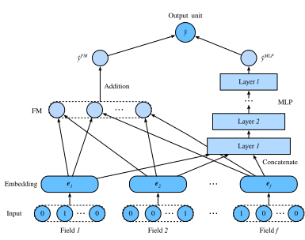

# Deep Factorization Machines

効果的な特徴の組み合わせを学習することは、クリック率予測タスクの成功にとって極めて重要です。Factorization Machines は、特徴間相互作用を線形の枠組み（たとえば双線形相互作用）でモデル化します。しかし、実世界のデータでは、特徴の交差構造は通常きわめて複雑で非線形であるため、これだけでは不十分なことが多いです。さらに悪いことに、実際には通常、2次の特徴相互作用しか factorization machines では用いられません。より高次の特徴の組み合わせを factorization machines でモデル化することは理論上は可能ですが、数値的不安定性と高い計算複雑性のため、一般には採用されません。

有効な解決策の一つは、深層ニューラルネットワークを用いることです。深層ニューラルネットワークは特徴表現学習に強力であり、洗練された特徴相互作用を学習できる可能性があります。そのため、深層ニューラルネットワークを factorization machines に統合するのは自然な発想です。factorization machines に非線形変換層を追加すると、低次の特徴の組み合わせと高次の特徴の組み合わせの両方をモデル化できるようになります。さらに、入力に由来する非線形な内在構造も深層ニューラルネットワークで捉えることができます。この節では、FM と深層ニューラルネットワークを組み合わせた代表的なモデルである deep factorization machines (DeepFM) :cite:`Guo.Tang.Ye.ea.2017` を紹介します。


## Model Architectures

DeepFM は、FM コンポーネントと deep コンポーネントからなり、これらは並列構造で統合されています。FM コンポーネントは 2-way factorization machines と同じで、低次の特徴相互作用をモデル化するために使われます。deep コンポーネントは MLP であり、高次の特徴相互作用と非線形性を捉えるために使われます。これら 2 つのコンポーネントは同じ入力／埋め込みを共有し、その出力が最終予測として加算されます。DeepFM の考え方は、記憶と汎化の両方を捉えられる Wide \& Deep アーキテクチャに似ていることに注意するとよいでしょう。Wide \& Deep モデルに対する DeepFM の利点は、特徴の組み合わせを自動的に識別することで、手作業による特徴設計の労力を減らせる点です。

簡潔さのため、FM コンポーネントの説明は省略し、その出力を $\hat{y}^{(FM)}$ と表します。詳細は前節を参照してください。$\mathbf{e}_i \in \mathbb{R}^{k}$ を $i^\textrm{th}$ フィールドの潜在特徴ベクトルとします。deep コンポーネントの入力は、疎なカテゴリ特徴入力に対してルックアップされたすべてのフィールドの密な埋め込みを連結したもので、次のように表されます。

$$
\mathbf{z}^{(0)}  = [\mathbf{e}_1, \mathbf{e}_2, ..., \mathbf{e}_f],
$$

ここで $f$ はフィールド数です。これを次のニューラルネットワークに入力します。

$$
\mathbf{z}^{(l)}  = \alpha(\mathbf{W}^{(l)}\mathbf{z}^{(l-1)} + \mathbf{b}^{(l)}),
$$

ここで $\alpha$ は活性化関数です。$\mathbf{W}_{l}$ と $\mathbf{b}_{l}$ は $l^\textrm{th}$ 層の重みとバイアスです。$y_{DNN}$ を予測出力とします。DeepFM の最終予測は、FM と DNN の両方の出力の和です。したがって、次式を得ます。

$$
\hat{y} = \sigma(\hat{y}^{(FM)} + \hat{y}^{(DNN)}),
$$

ここで $\sigma$ はシグモイド関数です。DeepFM のアーキテクチャを以下に示します。


DeepFM は、深層ニューラルネットワークと FM を組み合わせる唯一の方法ではないことに注意してください。特徴相互作用の上に非線形層を追加することもできます :cite:`He.Chua.2017`。

```{.python .input  n=2}
#@tab mxnet
from d2l import mxnet as d2l
from mxnet import init, gluon, np, npx
from mxnet.gluon import nn
import os

npx.set_np()
```

## Implementation of DeepFM
DeepFM の実装は FM のそれと似ています。FM 部分はそのままにし、活性化関数として `relu` を用いた MLP ブロックを使います。モデルの正則化のために Dropout も用います。MLP のニューロン数は `mlp_dims` ハイパーパラメータで調整できます。

```{.python .input  n=2}
#@tab mxnet
class DeepFM(nn.Block):
    def __init__(self, field_dims, num_factors, mlp_dims, drop_rate=0.1):
        super(DeepFM, self).__init__()
        num_inputs = int(sum(field_dims))
        self.embedding = nn.Embedding(num_inputs, num_factors)
        self.fc = nn.Embedding(num_inputs, 1)
        self.linear_layer = nn.Dense(1, use_bias=True)
        input_dim = self.embed_output_dim = len(field_dims) * num_factors
        self.mlp = nn.Sequential()
        for dim in mlp_dims:
            self.mlp.add(nn.Dense(dim, 'relu', True, in_units=input_dim))
            self.mlp.add(nn.Dropout(rate=drop_rate))
            input_dim = dim
        self.mlp.add(nn.Dense(in_units=input_dim, units=1))

    def forward(self, x):
        embed_x = self.embedding(x)
        square_of_sum = np.sum(embed_x, axis=1) ** 2
        sum_of_square = np.sum(embed_x ** 2, axis=1)
        inputs = np.reshape(embed_x, (-1, self.embed_output_dim))
        x = self.linear_layer(self.fc(x).sum(1)) \
            + 0.5 * (square_of_sum - sum_of_square).sum(1, keepdims=True) \
            + self.mlp(inputs)
        x = npx.sigmoid(x)
        return x
```

## Training and Evaluating the Model
データ読み込みの手順は FM と同じです。DeepFM の MLP コンポーネントは、ピラミッド構造（30-20-10）を持つ 3 層の全結合ネットワークに設定します。その他のハイパーパラメータは FM と同じです。

```{.python .input  n=4}
#@tab mxnet
batch_size = 2048
data_dir = d2l.download_extract('ctr')
train_data = d2l.CTRDataset(os.path.join(data_dir, 'train.csv'))
test_data = d2l.CTRDataset(os.path.join(data_dir, 'test.csv'),
                           feat_mapper=train_data.feat_mapper,
                           defaults=train_data.defaults)
field_dims = train_data.field_dims
train_iter = gluon.data.DataLoader(
    train_data, shuffle=True, last_batch='rollover', batch_size=batch_size,
    num_workers=d2l.get_dataloader_workers())
test_iter = gluon.data.DataLoader(
    test_data, shuffle=False, last_batch='rollover', batch_size=batch_size,
    num_workers=d2l.get_dataloader_workers())
devices = d2l.try_all_gpus()
net = DeepFM(field_dims, num_factors=10, mlp_dims=[30, 20, 10])
net.initialize(init.Xavier(), ctx=devices)
lr, num_epochs, optimizer = 0.01, 30, 'adam'
trainer = gluon.Trainer(net.collect_params(), optimizer,
                        {'learning_rate': lr})
loss = gluon.loss.SigmoidBinaryCrossEntropyLoss()
d2l.train_ch13(net, train_iter, test_iter, loss, trainer, num_epochs, devices)
```

FM と比べると、DeepFM はより速く収束し、より良い性能を達成します。

## Summary

* FM にニューラルネットワークを統合することで、複雑で高次の相互作用をモデル化できるようになります。
* DeepFM は広告データセットにおいて、元の FM を上回る性能を示します。

## Exercises

* MLP の構造を変えて、モデル性能への影響を確認してください。
* データセットを Criteo に変更し、元の FM モデルと比較してください。\n
