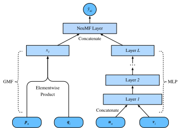

# パーソナライズドランキングのためのニューラル協調フィルタリング

この節では明示的フィードバックを超えて、暗黙的フィードバックを用いた推薦のためのニューラル協調フィルタリング（NCF）フレームワークを導入します。暗黙的フィードバックは推薦システムに広く存在します。クリック、購入、視聴といった行動は、収集が容易でユーザの嗜好を示す一般的な暗黙的フィードバックです。ここで紹介する NeuMF :cite:`He.Liao.Zhang.ea.2017` は neural matrix factorization の略で、暗黙的フィードバックを用いたパーソナライズドランキング課題に取り組むことを目的としています。このモデルは、行列分解の内積をニューラルネットワークの柔軟性と非線形性で置き換えることで、モデル表現力の向上を狙っています。具体的には、このモデルは generalized matrix factorization（GMF）と MLP を含む2つのサブネットワークで構成され、単純な内積ではなく2つの経路から相互作用をモデル化します。これら2つのネットワークの出力は連結され、最終的な予測スコアの計算に用いられます。AutoRec のレーティング予測課題とは異なり、このモデルは暗黙的フィードバックに基づいて各ユーザに対する順位付き推薦リストを生成します。モデルの学習には、前節で導入したパーソナライズドランキング損失を用います。

## NeuMF モデル

前述のとおり、NeuMF は2つのサブネットワークを融合します。GMF は行列分解の一般的なニューラルネットワーク版であり、入力はユーザとアイテムの潜在因子の要素ごとの積です。これは2つのニューラル層から成ります。

$$
\mathbf{x} = \mathbf{p}_u \odot \mathbf{q}_i \\
\hat{y}_{ui} = \alpha(\mathbf{h}^\top \mathbf{x}),
$$

ここで $\odot$ はベクトルのハダマード積を表します。$\mathbf{P} \in \mathbb{R}^{m \times k}$  と $\mathbf{Q} \in \mathbb{R}^{n \times k}$ は、それぞれユーザとアイテムの潜在行列に対応します。$\mathbf{p}_u \in \mathbb{R}^{ k}$ は $P$ の $u^\textrm{th}$ 行、$\mathbf{q}_i \in \mathbb{R}^{ k}$ は $Q$ の $i^\textrm{th}$ 行です。$\alpha$ と $h$ は出力層の活性化関数と重みを表します。$\hat{y}_{ui}$ はユーザ $u$ がアイテム $i$ に与えるであろう予測スコアです。

このモデルのもう一つの構成要素は MLP です。モデルの柔軟性を高めるため、MLP サブネットワークは GMF とユーザおよびアイテムの埋め込みを共有しません。代わりに、ユーザ埋め込みとアイテム埋め込みの連結を入力として用います。複雑な接続と非線形変換により、ユーザとアイテムの間の複雑な相互作用を推定できます。より正確には、MLP サブネットワークは次のように定義されます。

$$
\begin{aligned}
z^{(1)} &= \phi_1(\mathbf{U}_u, \mathbf{V}_i) = \left[ \mathbf{U}_u, \mathbf{V}_i \right] \\
\phi^{(2)}(z^{(1)})  &= \alpha^1(\mathbf{W}^{(2)} z^{(1)} + b^{(2)}) \\
&... \\
\phi^{(L)}(z^{(L-1)}) &= \alpha^L(\mathbf{W}^{(L)} z^{(L-1)} + b^{(L)})) \\
\hat{y}_{ui} &= \alpha(\mathbf{h}^\top\phi^L(z^{(L-1)}))
\end{aligned}
$$

ここで $\mathbf{W}^*, \mathbf{b}^*$ および $\alpha^*$ は、それぞれ重み行列、バイアスベクトル、活性化関数を表します。$\phi^*$ は対応する層の関数を表します。$\mathbf{z}^*$ は対応する層の出力を表します。

GMF と MLP の結果を融合するために、単純な加算ではなく、NeuMF は2つのサブネットワークの最後から2番目の層を連結して、さらに後続の層に渡せる特徴ベクトルを作ります。その後、出力は行列 $\mathbf{h}$ とシグモイド活性化関数で射影されます。予測層は次のように定式化されます。
$$
\hat{y}_{ui} = \sigma(\mathbf{h}^\top[\mathbf{x}, \phi^L(z^{(L-1)})]).
$$

次の図は NeuMF のモデルアーキテクチャを示しています。



```{.python .input  n=1}
#@tab mxnet
from d2l import mxnet as d2l
from mxnet import autograd, gluon, np, npx
from mxnet.gluon import nn
import mxnet as mx
import random

npx.set_np()
```

## モデルの実装
以下のコードは NeuMF モデルを実装します。これは、異なるユーザおよびアイテムの埋め込みベクトルを持つ generalized matrix factorization モデルと MLP から成ります。MLP の構造はパラメータ `nums_hiddens` によって制御されます。ReLU がデフォルトの活性化関数として使われます。

```{.python .input  n=2}
#@tab mxnet
class NeuMF(nn.Block):
    def __init__(self, num_factors, num_users, num_items, nums_hiddens,
                 **kwargs):
        super(NeuMF, self).__init__(**kwargs)
        self.P = nn.Embedding(num_users, num_factors)
        self.Q = nn.Embedding(num_items, num_factors)
        self.U = nn.Embedding(num_users, num_factors)
        self.V = nn.Embedding(num_items, num_factors)
        self.mlp = nn.Sequential()
        for num_hiddens in nums_hiddens:
            self.mlp.add(nn.Dense(num_hiddens, activation='relu',
                                  use_bias=True))
        self.prediction_layer = nn.Dense(1, activation='sigmoid', use_bias=False)

    def forward(self, user_id, item_id):
        p_mf = self.P(user_id)
        q_mf = self.Q(item_id)
        gmf = p_mf * q_mf
        p_mlp = self.U(user_id)
        q_mlp = self.V(item_id)
        mlp = self.mlp(np.concatenate([p_mlp, q_mlp], axis=1))
        con_res = np.concatenate([gmf, mlp], axis=1)
        return self.prediction_layer(con_res)
```

## 負例サンプリングを用いたカスタマイズデータセット

ペアワイズランキング損失において重要なステップは負例サンプリングです。各ユーザについて、そのユーザが相互作用していないアイテムは候補アイテム（未観測エントリ）です。次の関数はユーザ ID と候補アイテムを入力として受け取り、各ユーザに対して候補集合から負のアイテムをランダムにサンプリングします。学習段階では、モデルはユーザが好むアイテムが、嫌うアイテムや未相互作用のアイテムより高く順位付けされるようにします。

```{.python .input  n=3}
#@tab mxnet
class PRDataset(gluon.data.Dataset):
    def __init__(self, users, items, candidates, num_items):
        self.users = users
        self.items = items
        self.cand = candidates
        self.all = set([i for i in range(num_items)])

    def __len__(self):
        return len(self.users)

    def __getitem__(self, idx):
        neg_items = list(self.all - set(self.cand[int(self.users[idx])]))
        indices = random.randint(0, len(neg_items) - 1)
        return self.users[idx], self.items[idx], neg_items[indices]
```

## 評価器
この節では、学習用とテスト用のデータセットを構築するために時系列分割戦略を採用します。モデルの有効性を評価するために、指定した切り捨て位置 $\ell$ におけるヒット率（$\textrm{Hit}@\ell$）と ROC 曲線下面積（AUC）の2つの評価指標を用います。各ユーザに対する指定位置 $\ell$ におけるヒット率は、推薦アイテムが上位 $\ell$ のランキングリストに含まれているかどうかを示します。形式的な定義は次のとおりです。

$$
\textrm{Hit}@\ell = \frac{1}{m} \sum_{u \in \mathcal{U}} \textbf{1}(rank_{u, g_u} <= \ell),
$$

ここで $\textbf{1}$ は指示関数であり、正解アイテムが上位 $\ell$ のリストにランクインしていれば 1、そうでなければ 0 です。$rank_{u, g_u}$ は、ユーザ $u$ の正解アイテム $g_u$ の推薦リスト内での順位を表します（理想的な順位は 1 です）。$m$ はユーザ数です。$\mathcal{U}$ はユーザ集合です。

AUC の定義は次のとおりです。

$$
\textrm{AUC} = \frac{1}{m} \sum_{u \in \mathcal{U}} \frac{1}{|\mathcal{I} \backslash S_u|} \sum_{j \in I \backslash S_u} \textbf{1}(rank_{u, g_u} < rank_{u, j}),
$$

ここで $\mathcal{I}$ はアイテム集合です。$S_u$ はユーザ $u$ の候補アイテムです。なお、precision、recall、normalized discounted cumulative gain（NDCG）など、他の多くの評価プロトコルも利用できます。

次の関数は、各ユーザについてヒット数と AUC を計算します。

```{.python .input  n=4}
#@tab mxnet
#@save
def hit_and_auc(rankedlist, test_matrix, k):
    hits_k = [(idx, val) for idx, val in enumerate(rankedlist[:k])
              if val in set(test_matrix)]
    hits_all = [(idx, val) for idx, val in enumerate(rankedlist)
                if val in set(test_matrix)]
    max = len(rankedlist) - 1
    auc = 1.0 * (max - hits_all[0][0]) / max if len(hits_all) > 0 else 0
    return len(hits_k), auc
```

次に、全体のヒット率と AUC は次のように計算されます。

```{.python .input  n=5}
#@tab mxnet
#@save
def evaluate_ranking(net, test_input, seq, candidates, num_users, num_items,
                     devices):
    ranked_list, ranked_items, hit_rate, auc = {}, {}, [], []
    all_items = set([i for i in range(num_users)])
    for u in range(num_users):
        neg_items = list(all_items - set(candidates[int(u)]))
        user_ids, item_ids, x, scores = [], [], [], []
        [item_ids.append(i) for i in neg_items]
        [user_ids.append(u) for _ in neg_items]
        x.extend([np.array(user_ids)])
        if seq is not None:
            x.append(seq[user_ids, :])
        x.extend([np.array(item_ids)])
        test_data_iter = gluon.data.DataLoader(
            gluon.data.ArrayDataset(*x), shuffle=False, last_batch="keep",
            batch_size=1024)
        for index, values in enumerate(test_data_iter):
            x = [gluon.utils.split_and_load(v, devices, even_split=False)
                 for v in values]
            scores.extend([list(net(*t).asnumpy()) for t in zip(*x)])
        scores = [item for sublist in scores for item in sublist]
        item_scores = list(zip(item_ids, scores))
        ranked_list[u] = sorted(item_scores, key=lambda t: t[1], reverse=True)
        ranked_items[u] = [r[0] for r in ranked_list[u]]
        temp = hit_and_auc(ranked_items[u], test_input[u], 50)
        hit_rate.append(temp[0])
        auc.append(temp[1])
    return np.mean(np.array(hit_rate)), np.mean(np.array(auc))
```

## モデルの学習と評価

学習関数を以下に定義します。モデルはペアワイズ方式で学習します。

```{.python .input  n=6}
#@tab mxnet
#@save
def train_ranking(net, train_iter, test_iter, loss, trainer, test_seq_iter,
                  num_users, num_items, num_epochs, devices, evaluator,
                  candidates, eval_step=1):
    timer, hit_rate, auc = d2l.Timer(), 0, 0
    animator = d2l.Animator(xlabel='epoch', xlim=[1, num_epochs], ylim=[0, 1],
                            legend=['test hit rate', 'test AUC'])
    for epoch in range(num_epochs):
        metric, l = d2l.Accumulator(3), 0.
        for i, values in enumerate(train_iter):
            input_data = []
            for v in values:
                input_data.append(gluon.utils.split_and_load(v, devices))
            with autograd.record():
                p_pos = [net(*t) for t in zip(*input_data[:-1])]
                p_neg = [net(*t) for t in zip(*input_data[:-2],
                                              input_data[-1])]
                ls = [loss(p, n) for p, n in zip(p_pos, p_neg)]
            [l.backward(retain_graph=False) for l in ls]
            l += sum([l.asnumpy() for l in ls]).mean()/len(devices)
            trainer.step(values[0].shape[0])
            metric.add(l, values[0].shape[0], values[0].size)
            timer.stop()
        with autograd.predict_mode():
            if (epoch + 1) % eval_step == 0:
                hit_rate, auc = evaluator(net, test_iter, test_seq_iter,
                                          candidates, num_users, num_items,
                                          devices)
                animator.add(epoch + 1, (hit_rate, auc))
    print(f'train loss {metric[0] / metric[1]:.3f}, '
          f'test hit rate {float(hit_rate):.3f}, test AUC {float(auc):.3f}')
    print(f'{metric[2] * num_epochs / timer.sum():.1f} examples/sec '
          f'on {str(devices)}')
```

ここで、MovieLens 100k データセットを読み込み、モデルを学習できます。MovieLens データセットにはレーティングしかないため、精度の一部を失うものの、これらのレーティングを 0 と 1 に二値化します。ユーザがアイテムを評価した場合、その暗黙的フィードバックを 1 とみなし、そうでなければ 0 とします。アイテムを評価する行為は、暗黙的フィードバックを与える一形態とみなせます。ここでは、ユーザが最後に相互作用したアイテムをテスト用に残す `seq-aware` モードでデータセットを分割します。

```{.python .input  n=11}
#@tab mxnet
batch_size = 1024
df, num_users, num_items = d2l.read_data_ml100k()
train_data, test_data = d2l.split_data_ml100k(df, num_users, num_items,
                                              'seq-aware')
users_train, items_train, ratings_train, candidates = d2l.load_data_ml100k(
    train_data, num_users, num_items, feedback="implicit")
users_test, items_test, ratings_test, test_iter = d2l.load_data_ml100k(
    test_data, num_users, num_items, feedback="implicit")
train_iter = gluon.data.DataLoader(
    PRDataset(users_train, items_train, candidates, num_items ), batch_size,
    True, last_batch="rollover", num_workers=d2l.get_dataloader_workers())
```

次に、モデルを作成して初期化します。隠れ層サイズが一定の 10 の3層 MLP を使用します。

```{.python .input  n=8}
#@tab mxnet
devices = d2l.try_all_gpus()
net = NeuMF(10, num_users, num_items, nums_hiddens=[10, 10, 10])
net.initialize(ctx=devices, force_reinit=True, init=mx.init.Normal(0.01))
```

以下のコードでモデルを学習します。

```{.python .input  n=12}
#@tab mxnet
lr, num_epochs, wd, optimizer = 0.01, 10, 1e-5, 'adam'
loss = d2l.BPRLoss()
trainer = gluon.Trainer(net.collect_params(), optimizer,
                        {"learning_rate": lr, 'wd': wd})
train_ranking(net, train_iter, test_iter, loss, trainer, None, num_users,
              num_items, num_epochs, devices, evaluate_ranking, candidates)
```

## まとめ

* 行列分解モデルに非線形性を加えることは、モデルの能力と有効性を改善するうえで有益です。
* NeuMF は行列分解と MLP の組み合わせです。MLP はユーザとアイテムの埋め込みの連結を入力として受け取ります。

## 演習

* 潜在因子の次元を変えてみましょう。潜在因子のサイズはモデル性能にどのような影響を与えるでしょうか？
* MLP のアーキテクチャ（例：層数、各層のニューロン数）を変えて、その性能への影響を確認しましょう。
* 異なる最適化手法、学習率、重み減衰率を試してみましょう。
* 前節で定義したヒンジ損失を使ってこのモデルを最適化してみましょう。

:begin_tab:`mxnet`
[Discussions](https://discuss.d2l.ai/t/403)
:end_tab:\n